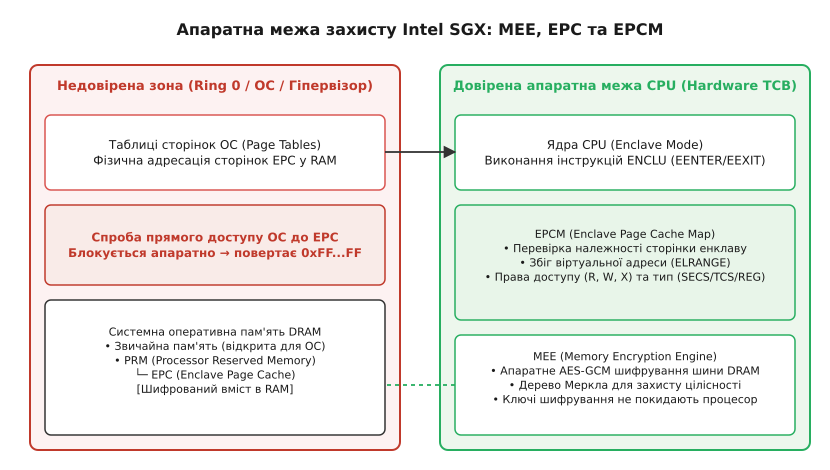
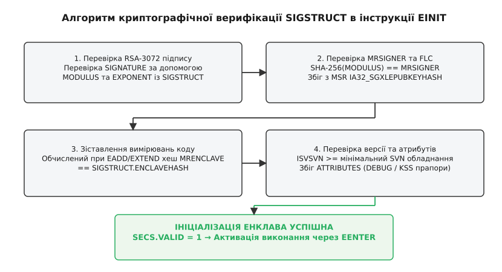

# Апаратне ізолювання Intel SGX та верифікація SIGSTRUCT

<preknowlist>
- [Концепції ядра Linux](book:unix-linux/kernel-and-userspace) — кільця захисту CPU (Ring 0 / Ring 3), системні виклики та таблиці сторінок віртуальної пам'яті.
- [Каркас Crypto API у ядрі Linux](book:unix-linux/kernel-crypto-framework) — криптографічні хеш-функції SHA-256 та відкриті ключі асиметричного підпису.
</preknowlist>

Коли сервер обробляє приватні ключі криптогаманця, паролі або біометричні дані користувачів, операційна система та гіпервізор у кільці 0 (Ring 0) мають повний доступ до лінійного простору оперативної пам'яті будь-якого процесу. Одна вразливість нульового дня у драйвері ядра, скомпрометований гіпервізор хмарного провайдера або зловмисний адміністратор із привілеями `root` дають можливість безперешкодно прочитати вміст RAM процесу через `/dev/mem` або скинути дамп стану регістрів. Інструкції апаратного ізолювання Intel SGX (Software Guard Extensions) перевертають цю традиційну модель довіри, вилучаючи ядро операційної системи, BIOS/UEFI та гіпервізор із переліку довірених компонентів (Trusted Computing Base, TCB) і створюючи всередині процесора ізольовані зони виконання — енклави (enclaves, від лат. *inclavare* — замикати на ключ).

## Конфіденційні обчислення та апаратне шифрування RAM

Класична архітектура x86-64 будується на ієрархії кілець захисту, де привілейоване ядро керує таблицями сторінок віртуальної пам'яті і контролює виконання процесів у недовіреному режимі користувача (Ring 3). У цій системі будь-який привілейований суб'єкт здатний змінити адресне відображення, вставити довільний код або прочитати секрети з адресного простору програми.

SGX впроваджує концепцію конфіденційних обчислень (confidential computing), переносячи межу довіри безпосередньо у кристалик центрального процесора. Навіть якщо операційна система повністю скомпрометована, мікрокод процесора та апаратні блоки шифрування гарантують цілісність і конфіденційність коду та даних енклава.


*Апаратна межа захисту Intel SGX: ізоляція пам'яті EPC через MEE та контроль EPCM.*

Головним компонентом апаратної ізоляції пам'яті є Memory Encryption Engine (MEE) — спеціалізований контролер, вбудований у системний агент процесора між кеш-пам'яттю останнього рівня (L3) та контролером оперативної пам'яті DRAM.

Під час початкового завантаження системи (POST) BIOS/UEFI резервує неперервний фізичний діапазон оперативної пам'яті під назвою Processor Reserved Memory (PRM). Розмір PRM конфігурується у системному BIOS і може становити від 128 МБ до кількох сотень гігабайтів у сучасних серверних процесорах Xeon. Коли процесор виділяє PRM під закриту зону SGX, доступ до неї поза межами кристала CPU стає фізично неможливим завдяки трирівневому апаратному захисту:

1. **Апаратне шифрування шини:** При вивантаженні кеш-рядка з L3-кешу у фізичну оперативну пам'ять MEE автоматично шифрує дані алгоритмом AES у лічильниковому режимі (CTR), а цілісність підтверджує окремою міткою автентичності (MAC). Ключі шифрування генеруються апаратним генератором випадкових чисел (TRNG) при кожному перезавантаженні системи і зберігаються у внутрішніх регістрах процесора, які не мають адресного відображення на шині.
2. **Захист цілісності через дерево Меркла:** Для запобігання фізичним атакам підміни пам'яті або повторного відтворення старих даних (replay attacks) MEE будує в зарезервованій пам'яті дерево хешів (Merkle Tree). Кожен кеш-рядок пов'язується з монотонним лічильником та криптографічною міткою автентифікації. При кожному читанні сторінки з DRAM процесор перевіряє цілісність криптографічного графа.
3. **Блокування з боку шини:** Якщо привілейований процес ядра, зчитувач DMA-контролера або шинний аналізатор спробує прочитати фізичні адреси PRM через системну шину, контролер шини миттєво повертає суцільний масив одиниць (`0xFFFFFFFF`), не розкриваючи зашифрованих даних і не викликаючи сторінкового збою.

## Структура Enclave Page Cache (EPC) та карта EPCM

Всередині області PRM виділяється спеціалізований масив фізичних сторінок — Enclave Page Cache (EPC). Саме у сторінках EPC розміщується код, стек, динамічна пам'ять (heap) та керуючі структури всіх активних енклавів системи.

Для контролю за тим, як операційна система відображає фізичні сторінки EPC на віртуальні адреси користувацьких процесів, процесор підтримує внутрішню таблицю — Enclave Page Cache Map (EPCM). Елементи EPCM зберігаються в апаратно захищеній пам'яті всередині PRM і недоступні для запису чи читання навіть для ядра операційної системи.

Точний розмір запису EPCM залежить від мікроархітектури і програмі недоступний; логічно кожен запис містить такі атрибути:
- **Тип сторінки (Page Type):**
  - `SECS` (SGX Enclave Control Structure) — метадані енклава (базова адреса, розмір, хеш вимірювання `MRENCLAVE`, атрибути та лічильник активних потоків).
  - `TCS` (Thread Control Structure) — точка входу потоку виконання, адреса стека, покажчик SSA та стан потоку.
  - `REG` (Regular) — звичайна сторінка коду або даних енклава.
  - `VA` (Version Array) — сторінка версіонування для бекапу та свопінгу сторінок у незахищену RAM.
- **Прив'язка до енклава (SECS Binding):** Фізична адреса сторінки SECS, яка ідентифікує конкретний енклав-власник даної сторінки.
- **Очікувана віртуальна адреса (ELRANGE Address):** Лінійна віртуальна адреса у просторі процесу, на яку повинна відображатися ця фізична сторінка.
- **Права доступу (R, W, X):** Прапори дозволу читання, запису та виконання для коду всередині енклава.
- **Стан блокування (BLOCKED) та валідності (VALID):** Використовуються під час вивантаження сторінок та ініціалізації.

Коли процес виконує інструкцію звернення до пам'яті у режимі енклава, процесор паралельно зі звичайним обходом таблиць сторінок ОС перевіряє відповідність запису в EPCM:

```
Умова доступу = (Адреса_ОС == EPCM.ELRANGE) AND (Процес_Owner == EPCM.SECS) AND (Операція ∈ EPCM.Permissions)
```

Якщо ядро операційної системи спробує підмінити таблицю сторінок і відобразити фізичну сторінку EPC чужого енклава або перенаправити звернення на іншу віртуальну адресу, апаратний блок EPCM миттєво згенерує сторінковий збій (`#PF`) з виставленим бітом `SGX` у коді помилки і заблокує доступ.

## Інструкції SGX та життєвий цикл енклава

Набір інструкцій Intel SGX ділиться на два класи leaf-функцій: привілейовані інструкції `ENCLS` (викликаються у кільці 0 ядра) та непривілейовані інструкції `ENCLU` (викликаються у кільці 3 користувача).

```
        Користувацький простір (Ring 3)              Ядро ОС (Ring 0)
┌──────────────────────────────────────────────┐ ┌──────────────────────┐
│ ENCLU [EENTER] ──► Вхід в енклав             │ │ ENCLS [ECREATE]      │
│ ENCLU [EEXIT]  ──► Вихід з енклава           │ │ ENCLS [EADD]         │
│ ENCLU [ERESUME]──► Відновлення після винятку │ │ ENCLS [EEXTEND]      │
│ ENCLU [EREPORT]──► Локальна атестація        │ │ ENCLS [EINIT]        │
└──────────────────────────────────────────────┘ └──────────────────────┘
```

### Створення та наповнення (ENCLS)

Процес збірки енклава контролюється операційною системою у три послідовні кроки:

1. **ECREATE:** Операційна система передає фізичну сторінку під структуру SECS, задаючи базову віртуальну адресу діапазону адресації енклава (ELRANGE) та його максимальний розмір. Розмір діапазону повинен бути строго ступенем двійки (2ⁿ). Процесор створює відповідний запис в EPCM з типом `SECS`.
2. **EADD:** Ядро додає сторінки коду, даних, TCS та стека з незахищеної пам'яті у сторінки EPC. При виконанні `EADD` процесор копіює вміст, створює запис в EPCM із відповідними правами (R/W/X) і прив'язує сторінку до SECS даного енклава.
3. **EEXTEND:** Для кожного 256-байтового блоку доданої сторінки ядро викликає інструкцію `EEXTEND`, яка оновлює внутрішній SHA-256 хеш-регістр процесора `MRENCLAVE`.

### Криптографічна ініціалізація (EINIT)

Після завантаження всіх сторінок ядро викликає інструкцію `EINIT`. Вона приймає криптографічну структуру `SIGSTRUCT`, створену розробником під час підписання бінарного файлу. 

Процесор перевіряє RSA-підпис `SIGSTRUCT`, порівнює накопичений у регістрі `MRENCLAVE` хеш коду з хешем `ENCLAVEHASH`, що вказаний у підписі розробника, перевіряє дотримання політики запуску та переводить стан `SECS.VALID` у `1`. З цього моменту наповнення енклава фіксується: додавання нових сторінок через `EADD` стає неможливим, а код отримує дозвіл на виконання.

### Виконання та обробка переривань (ENCLU)

Перехід коду у захищений режим відбувається за допомогою інструкції `EENTER`. Процесор перевіряє, що цільова адреса вказує на коректну та не зайняту іншим потоком структуру TCS, перемикає внутрішній стан ядра процесора в Enclave Mode, вмикає перевірки EPCM і передає керування на точку входу енклава.

Для повернення у недовірене середовище код енклава викликає `EEXIT`. Апаратура при цьому регістрів загального призначення не чистить — це обов'язок runtime-бібліотеки енклава, яка перед `EEXIT` затирає RAX–RDX, RSI, RDI та R8–R15, щоб секрети не потрапили в незахищену пам'ять додатка-хоста.

Якщо під час виконання енклава виникає апаратне переривання або сторінковий збій (Page Fault), процесор виконує асинхронний вихід — Asynchronous Enclave Exit (AEX):
- Поточний стан регістрів безпечно зберігається у захищену сторінку State Save Area (SSA) всередині EPC.
- Виконавчі регістри CPU заповнюються синтетичними фіксованими значеннями.
- Керування передається обробнику переривань ядра ОС.
- Після обробки переривання додаток викликає `ERESUME` для відновлення стану з SSA та продовження виконання з перерваного місця.

### Механізм свопінгу сторінок EPC

Оскільки обсяг фізичної пам'яті EPC обмежений апаратно, ядро Linux виконує підкачку (paging) сторінок EPC у звичайну RAM:
- **EWB (Enclave Write Back):** Процесор шифрує сторінку EPC, обчислює її MAC-тег цілісності, збільшує лічильник версії у спеціальній сторінці `VA` (Version Array) та дозволяє ядру вивантажити зашифрований блок у звичайну оперативну пам'ять.
- **ELDU / ELDB (Enclave Load Data):** Ядро завантажує зашифровану сторінку назад у вільну фрейм-зону EPC. Процесор перевіряє MAC-тег цілісності та збіг лічильника версії зі сторінкою `VA`. Якщо дані не були модифіковані зовні, сторінка розшифровується і відновлюється в EPCM.

## Динамічний розподіл пам'яті у SGX2

У першій версії технології SGX1 розмір енклава та кількість сторінок фіксувалися під час ініціалізації інструкцією `EINIT`. Розширення SGX2 (уперше — у клієнтських процесорах на Goldmont Plus, згодом у серверних Xeon Scalable) додало можливість динамічно виділяти та змінювати атрибути сторінок у вже запущеному енклаві без перезапуску:

- `EAUG` (Enclave Add Uninitialized Page): Інструкція ядра, яка додає нову порожню сторінку EPC до вже активного енклава.
- `EMODT` (Enclave Modify Type): Інструкція, що змінює тип сторінки EPCM (наприклад, перетворення звичайної сторінки `REG` у структуру `TCS` для створення нового потоку).
- `EMODPR` (Enclave Modify Permission Restriction): Звуження прав доступу сторінки — і тільки звуження (наприклад, зняття прапора `W` після завантаження динамічного коду JIT-компілятора). Розширювати права може лише сам енклав інструкцією `ENCLU[EMODPE]`.

Динамічне виділення сторінок дозволяє сучасним runtime-середовищам (таким як WebAssembly, Go чи Java JVM всередині енклавів) ефективно керувати пам'яттю без виділення гігабайтних статичних резервів на старті.

## Аутентифікація енклава: MRENCLAVE, MRSIGNER та SIGSTRUCT

Довіра до обчислень всередині енклава спирається на криптографічну ідентифікацію його стану та автора. SGX підтримує дві фундаментальні метрики ідентичності:

1. **MRENCLAVE (Measurement Register Enclave):** 256-бітний SHA-256 відбиток початкового стану енклава. Він враховує не лише вміст усіх завантажених сторінок, але й порядок їх додавання, віртуальні адреси та надані права доступу. Будь-яка зміна хоча б одного байта коду чи порядку інструкцій змінить `MRENCLAVE`.
2. **MRSIGNER (Measurement Register Signer):** 256-бітний SHA-256 хеш відкритого RSA-3072 ключа розробника. `MRSIGNER` визначає особу видавця додатка і залишається незмінним при оновленні версій коду.

Для підтвердження автентичності використовується криптографічний документ `SIGSTRUCT` (розміром 1808 байтів), описаний у [Повний бінарний макет SIGSTRUCT](book:unix-linux/sigstruct-and-sgx-enclaves/api-sigstruct.md).


*Алгоритм криптографічної перевірки структури SIGSTRUCT та запуску енклава інструкцією EINIT.*

Під час виконання інструкції `EINIT` апаратний мікрокод CPU реалізує суворий каскадний алгоритм перевірки:

```
[Крок 1: RSA Signature]   ► SIGNATURE перевіряється через MODULUS та EXPONENT
                                     │ (збіг)
                                     ▼
[Крок 2: MRSIGNER match]  ► SHA256(MODULUS) зіставляється з політики Launch Control
                                     │ (збіг)
                                     ▼
[Крок 3: MRENCLAVE match] ► SECS.MRENCLAVE зіставляється з SIGSTRUCT.ENCLAVEHASH
                                     │ (збіг)
                                     ▼
[Крок 4: Anti-Rollback]   ► SIGSTRUCT.ISVSVN >= Мінімальний апаратний SVN
                                     │ (успіх)
                                     ▼
                        АКТИВАЦІЯ: SECS.VALID = 1
```

1. **Перевірка RSA-підпису:** Процесор перевіряє цифровий підпис `SIGNATURE` за допомогою відкритих параметрів `MODULUS` (`N`) та `EXPONENT` (`e`), знімаючи доповнення PKCS#1 v1.5 і порівнюючи обчислений SHA-256 хеш заголовка та тіла `SIGSTRUCT`.
2. **Перевірка політики запуску:** Процесор обчислює `SHA-256(MODULUS)` — це і є `MRSIGNER` — та звіряє його з довіреним значенням політики запуску (за FLC — із вмістом MSR `IA32_SGXLEPUBKEYHASH`).
3. **Зіставлення вимірювання коду:** Процесор порівнює значення `SIGSTRUCT.ENCLAVEHASH` з реальним `MRENCLAVE`, накопиченим при виконанні `EADD` та `EEXTEND`.
4. **Захист від відкату версій (Anti-Rollback):** Процесор порівнює номер версії безпеки `ISVSVN` із поточним рівнем TCB системи, блокуючи запуск застарілих версій енклавів, що містять відомі вразливості.
5. **Маскування атрибутів:** Поле `ATTRIBUTEMASK` визначає, які біти конфігурації (наприклад, прапор `DEBUG`) є критичними. Якщо розробник підписав продакшн-енклав (`DEBUG = 0`), а ОС намагається запустити його у режимі налагодження, `EINIT` повертає помилку і блокує ініціалізацію.

## Політики запуску: від EINITTOKEN до Flexible Launch Control (FLC)

Окрім криптографічної перевірки підпису розробника, платформа SGX вимагає механізму авторизації запуску (Launch Control), детально проаналізованого в [Еволюція SGX Launch Control](book:unix-linux/sigstruct-and-sgx-enclaves/hist-launch-control-evolution.md).

У першій версії технології (SGX 1.0) корпорація Intel контролювала запуск усіх продакшн-енклавів через вимогу надання криптографічного маркера `EINITTOKEN`. Токен генерувався локально, але виключно спеціальним системним енклавом Intel Launch Enclave (LE), підписаним ключем Intel: право запуску визначав список дозволених `MRSIGNER` усередині цього енклава — тож остаточне слово завжди лишалося за Intel.

Сучасна архітектура **Flexible Launch Control (FLC)** скасовує цю монополію, надаючи оновлені MSR-регістри:

```
IA32_SGXLEPUBKEYHASH0  [  63:0  ] ──┐
IA32_SGXLEPUBKEYHASH1  [ 127:64 ] ──┼─► 256-бітний SHA-256 хеш довіреного MRSIGNER
IA32_SGXLEPUBKEYHASH2  [ 191:128] ──┤   записується ядром Linux при завантаженні
IA32_SGXLEPUBKEYHASH3  [ 255:192] ──┘
```

При завантаженні системи ядро Linux записує у ці MSR-регістри SHA-256 хеш відкритого ключа розробника або системної політики. Під час виконання `EINIT` процесор порівнює `MRSIGNER` із `SIGSTRUCT` безпосередньо з вмістом MSR. Це дозволяє операційній системі самостійно вирішувати, яким розробникам дозволено запускати енклави без залучення сторонніх сервісів Intel.

## Механізм атестації та генерації ключів (Attestation & Sealing)

Апаратні енклави надають два базові криптографічні сервіси для побудови розподілених довірених систем:

1. **Локальна атестація (`EREPORT`):** Інструкція `EREPORT` генерує криптографічний звіт `REPORT`, який містить вимірювання `MRENCLAVE`, `MRSIGNER`, атрибути енклава та 64 байти довільних даних розробника. Звіт завіряється апаратним симетричним ключем `Report Key`, який відомий лише процесору. Інший енклав на тій самій фізичній платформі може перевірити звіт за допомогою інструкції `EGETKEY`.
2. **Дистанційна атестація (Remote Attestation):** Для доказу віддаленому клієнту (наприклад, вебінтерфейсу або банківському серверу), що код виконується у справжньому апаратному енклаві Intel SGX, звіт `REPORT` передається спеціальному системному енклаву Quoting Enclave (QE). QE завіряє звіт за допомогою асиметричного ключа ECDSA (або EPID у застарілих системах), створюючи криптографічний сертифікат (Quote), який клієнт перевіряє через хмарний Intel Attestation Service (IAS) або власною інфраструктурою на бібліотеках DCAP (Data Center Attestation Primitives).
3. **Запечатування даних (Sealing):** Енклав може запитувати у процесора апаратні ключі шифрування (`Sealing Key`) через інструкцію `EGETKEY`. Ключ може прив'язуватися або до конкретного стану коду (`MRENCLAVE`), або до ключа розробника (`MRSIGNER`). Це дозволяє зашифрувати секрети перед записом на диск і гарантувати, що їх зможе прочитати лише цей конкретний енклав або його наступна оновлена версія.

## Інтерфейс драйвера Linux /dev/sgx_enclave

Починаючи з версії ядра Linux 5.11, підтримка SGX реалізована у вигляді підсистеми ядра, що надає символьний пристрій `/dev/sgx_enclave`. Докладний практичний приклад завантаження з викликами `ioctl` наведено у [Приклад завантаження енклава в Linux](book:unix-linux/sigstruct-and-sgx-enclaves/proj-enclave-loader.md).

Взаємодія користувацького додатка-хоста з драйвером ядра відбувається за допомогою наступних системних викликів:

1. `open("/dev/sgx_enclave", O_RDWR)` — отримання файлового дескриптора керування EPC.
2. `ioctl(fd, SGX_IOC_ENCLAVE_CREATE, &create_struct)` — виклик привілейованої інструкції `ECREATE` для створення SECS.
3. `mmap(..., fd, 0)` — виділення віртуального адресного простору ELRANGE для енклава.
4. `ioctl(fd, SGX_IOC_ENCLAVE_ADD_PAGES, &add_struct)` — виклик інструкцій `EADD` та `EEXTEND` для копіювання коду та оновлення `MRENCLAVE`.
5. `ioctl(fd, SGX_IOC_ENCLAVE_INIT, &init_struct)` — виклик `EINIT` із передачею покажчика на структуру `SIGSTRUCT`.

Драйвер ядра відповідає за автоматичне виділення фізичних сторінок EPC, обробку підкачки при недостатності EPC та налаштування EPCM-записів у мікрокоді процесора.

## Вразливості мікроархітектури та атаки сторонніми каналами

Попри те, що апаратна межа SGX надійно захищає пам'ять від прямого доступу операційної системи, відкритим вектором атак залишаються мікроархітектурні сторонні канали (Side-Channel Attacks):

- **Атаки на кеш-пам'ять (Prime+Probe, Flush+Reload):** Оскільки енклав та недовірений хост виконуються на одному фізичному ядрі і ділять спільні L1/L2 кеші, зловмисна ОС може відстежувати паттерни звернення енклава до пам'яті через вимірювання затримок доступів до кеш-ліній.
- **Спекулятивні атаки (Foreshadow / L1TF):** Вразливість Foreshadow (L1 Terminal Fault) дозволяла недовіреному коду у спекулятивному режимі виконання читати залишкові дані з L1-кешу процесора, оминаючи апаратні перевірки EPCM, якщо сторінка EPC була вивантажена операційною системою.
- **Атаки на напругу та частоту (Plundervolt):** Маніпуляція недокументованим MSR керування напругою ядра (тим самим інтерфейсом, яким користуються утиліти андервольтингу) дозволяла зловмиснику провокувати обчислювальні збої у виконання інструкцій множення всередині енклава, що призводило до злому криптографічних ключів RSA.

Для нейтралізації цих атак розробники обладнання застосовують оновлення мікрокоду (TCB Recovery), апаратне блокування зміни напруги у спекулятивних режимах та автоматичне очищення буферів L1D при виході з енклава через `EEXIT`/`AEX`. Розробники коду енклавів зобов'язані використовувати алгоритми з постійним часом виконання (constant-time execution), що унеможливлює витік секретів через час виконання та кеш-пам'ять.

Апаратна технологія Intel SGX разом із перевіркою `SIGSTRUCT` формує надійний фундамент для конфіденційних обчислень у середовищах із нульовою довірою до операційної системи. Вона дозволяє розгортати критичні сервіси у хмарі, гарантуючи, що секретні дані не покинуть межі кристала процесора без криптографічної перевірки.
