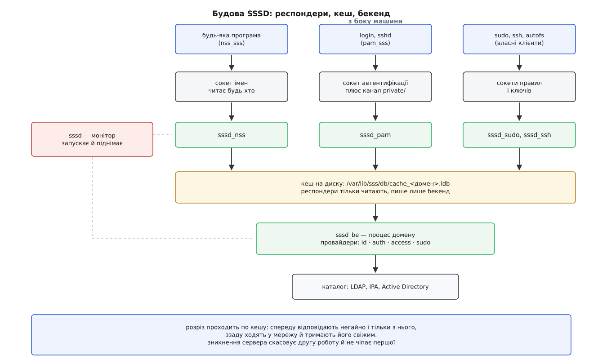
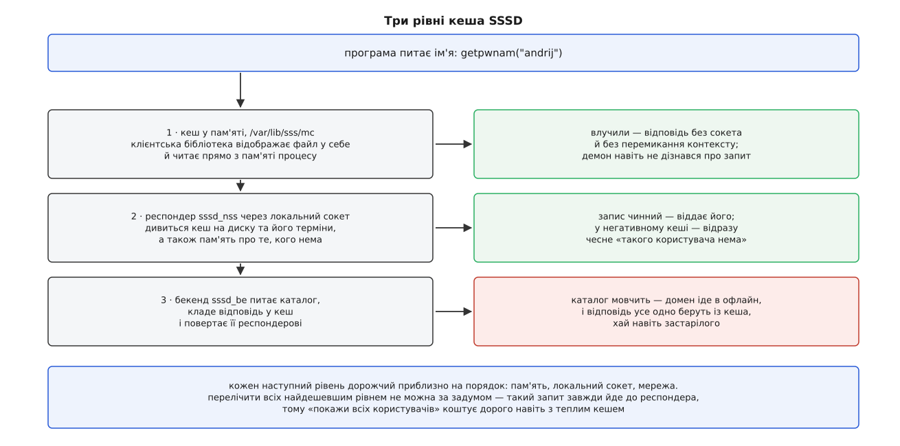
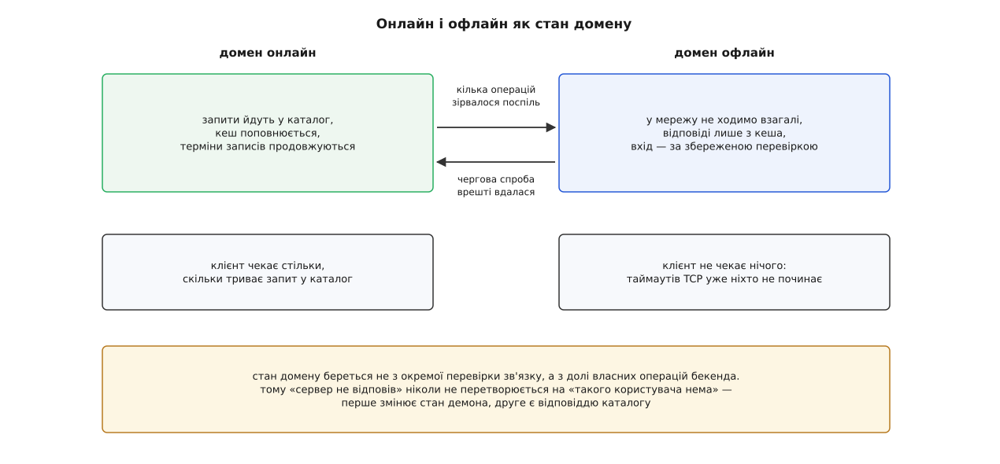

# SSSD: демон, що тримає з'єднання з каталогом і кеш облікових записів

<preknowlist>
- [База облікових записів: passwd, group, shadow і шар NSS](topic:unix-linux/user-database-nss) — ім'я користувача домальовує бібліотека C, а джерело відповіді вибирає перемикач NSS за рядком у `/etc/nsswitch.conf`; модуль джерела вміє відповісти «нема такого» і окремо «не зміг спитати».
- [Каталог LDAP як мережеве джерело облікових записів](topic:unix-linux/ldap-directory) — запис, його ім'я в дереві, і дві різні операції: пошук про особу й bind про секрет.
- [PAM: стек модулів автентифікації](topic:unix-linux/pam-stack) — програма не перевіряє пароль сама, а віддає це стекові модулів.
- [Користувачі, групи й ідентичність процесу](topic:unix-linux/uid-gid-model) — ядро тримає ідентичність числами й звіряється тільки з ними.
- [Сокети домену Unix](topic:unix-linux/unix-domain-sockets) — локальний канал між процесами з правами доступу, як у файлу.
- [Відображення файлу в пам'ять](topic:unix-linux/mmap-model) — як вміст файлу стає ділянкою адресного простору процесу й читається без системних викликів.
- [Автентифікація Kerberos](topic:communications/kerberos-authentication) — квиток замість пароля, і те, що квиток видає служба, до якої треба дотягнутися.
</preknowlist>

## Питання, на яке немає часу ходити в мережу

Виконайте `ls -l` у каталозі з п'ятьма тисячами файлів. У колонці власника з'явиться п'ять тисяч імен — і кожне з них окреме питання «як звати того, хто має номер 1000». На домашньому комп'ютері відповідь лежить у файлі поруч. У великій установі її там немає: правда про людей живе на сервері десь у мережі, бо тільки так вона може бути однаковою на всіх машинах.

З цієї заміни виростають три вимоги, і вони тягнуть у різні боки.

Відповідь має бути **свіжою**: людину звільнили — машина не повинна далі вважати її своєю. Відповідь має бути **миттєвою**: її питають не раз на день, а всередині звичайних команд, тисячами за секунду, і затримка в мілісекунду перетворює `ls -l` на п'ятисекундне очікування. І відповідь має бути **завжди**: ноутбук виніс з установи, кабель перебили, сервер перезавантажують — а людина мусить зайти у власну машину.

Свіжість вимагає ходити в мережу щоразу. Швидкість забороняє ходити в мережу взагалі. Доступність вимагає вміти відповісти, коли мережі немає. Це не суперечність у формулюваннях, а справжній конфлікт, і будь-який розв'язок мусить його розсудити, а не приховати.

Класичний клієнт каталогу цього не робив. Модулі `nss_ldap` і `pam_ldap` — це спільні об'єкти, які бібліотека C підвантажує **всередину вашого процесу**: у `ls`, у `sshd`, у `cron`. Кожен процес відкривав власне з'єднання з власним рукостисканням TLS, кожен читав пароль службового запису з файлу, доступного всім, і жоден не мав куди покласти вже отриману відповідь — бо процес зараз помре, а сусідній про нього нічого не знає.

## Чого не має бібліотека і що має процес

Придивімося, чого саме бракує, — бо саме брак і задає форму розв'язку.

Бібліотеці бракує **життя між викликами**. З'єднання з сервером — річ дорога: розв'язати ім'я, встановити TCP, домовитися про TLS, перевірити сертифікат, прив'язатися службовим записом. Усе це коштує кількох обмінів по мережі, а живе рівно доти, доки живе процес; для `ls` — частку секунди. Тримати з'єднання відкритим може лише той, хто сам не вмирає.

Бібліотеці бракує **пам'яті між процесами**. Кеш — це пам'ять про минулі відповіді, а спільної пам'яті в незалежних процесів немає. Тому в конструкції «модуль у кожному процесі» кеша не буває в принципі, і кожен новий процес починає з нуля.

Бібліотеці бракує **окремого місця для секретів**. Щоб питати каталог, клієнт мусить сам чимось засвідчитися: паролем службового запису, ключем із keytab, сертифікатом машини. Якщо питає кожен процес, то ці секрети мусить читати кожен процес — включно з тим, що запустив звичайний користувач, аби подивитися список файлів.

І ще одне, менш очевидне: бібліотека виконує мережеву операцію **в чужому часі**. Затримка каталогу опиняється всередині `getpwnam()`, тобто всередині `ls -l`, який ніякої мережі не просив.

Усі чотири нестачі знімає одна річ — **окремий процес на машину**. Він живий постійно, тож тримає з'єднання. Він один, тож його пам'ять спільна для всіх. Він працює під власним обліковим записом, тож секрети лежать у файлах, доступних тільки йому. І він чекає на мережу у своєму часі, а тому, хто спитав, віддає готове.

Таким процесом і є SSSD (англ. *System Security Services Daemon* — демон служб безпеки системи). Він виріс із клієнтської частини проєкту FreeIPA, а окремим проєктом став наприкінці 2009 року; [як це сталося і що було до нього](topic:unix-linux/sssd/hist-sssd-birth.md) — окремою розповіддю.

## Розріз усередині демона

Один процес на машину породжує нову складність, яку варто побачити до того, як дивитися на схему.

Цей процес мусить робити дві геть різні за характером роботи. Спереду він відповідає десяткам клієнтів, і відповідати мусить негайно. Ззаду він розмовляє з сервером, який буває повільним, а буває мертвим. Зліпити це в один цикл не можна: одна мережева операція, що чекає таймауту, спинить усіх, хто в цю мить питає ім'я, — і ми повернемося рівно до тієї біди, від якої тікали.

Тому демон розрізаний упоперек цього розрізнення.

**Респондери** (англ. *responder* — той, хто відповідає) дивляться в бік машини. Кожен обслуговує свій вид питань: `sssd_nss` — переклад імен і номерів, `sssd_pam` — перевірку особи, окремі респондери — правила `sudo`, відкриті ключі SSH, мапи автомонтування. Респондер знає кеш і клієнтський протокол, і більше нічого: ні про LDAP, ні про Kerberos, ні про сертифікати він не чув.

**Бекенд** (англ. *back end* — задній кінець) дивиться в бік мережі. На кожен домен запускається окремий процес `sssd_be`, і всередині нього працюють **провайдери** — змінні частини, що вміють говорити з конкретним видом сервера: `id_provider` дістає записи, `auth_provider` перевіряє пароль, `access_provider` вирішує, чи взагалі пускати цю людину на цю машину. Саме заміною провайдера один і той самий демон обслуговує голий LDAP, FreeIPA й Active Directory.

**Монітор** — головний процес `sssd`. Він нічого не обчислює: запускає решту, стежить за нею й піднімає те, що впало.



*Кеш стоїть точно на межі розрізу: бекенд у нього пише, респондери з нього читають — і саме тому відповідь можлива тоді, коли бекендові нема з ким говорити.*

Цей розріз — не адміністративний порядок, а те, завдяки чому працює офлайн. Обов'язок респондера сформульовано так: **«відповідай із кеша»**. Обов'язок бекенда — **«тримай кеш свіжим»**. Зникнення сервера скасовує другий обов'язок і не чіпає першого.

## Дріт до клієнта: два сокети й дуже дешевий протокол

З боку машини від SSSD лишаються крихітні модулі: `nss_sss` для перемикача імен і `pam_sss` для стека автентифікації. Вони не вміють нічого, крім як записати питання в локальний сокет і прочитати відповідь. Уся мережева наука — з того боку сокета.

Сокетів свідомо два, і різниця між ними — це різниця між двома питаннями. Сокет респондера імен (`/var/lib/sss/pipes/nss`) відкритий усім: ім'я користувача — річ прилюдна, її щодня питає кожна програма. Сокет автентифікації (`/var/lib/sss/pipes/pam`) теж відкритий кожному, хто входить у машину, — інакше заставка екрана звичайного користувача не мала б у кого перевірити його пароль. А поруч, у підкаталозі `private/`, лежить другий канал того самого респондера, доступний лише привілейованим клієнтам: через нього йде те, чого не має права робити хто завгодно, — дії від імені іншої людини, і коло довірених задають окремо.

Протокол цього каналу — власний двійковий, а не щось загальновживане. Причина суто арифметична: це найгарячіший шлях у системі, і на нього припадають мільйони звертань за день, тому кожен зайвий розбір рядка тут коштує реальних відсотків процесора. А от між власними частинами — монітором, респондерами й бекендом — повідомлень мало, і вони структуровані, тож там ужито [D-Bus](topic:unix-linux/dbus): дорожче на повідомлення, зате з іменованими методами й сигналами.

## Кеш у трьох рівнях

Кеш у цій конструкції не оптимізація, а несуча стіна, тож у нього три рівні, і кожен з'явився через окрему причину.

**Кеш на диску** — головний і єдиний постійний. Це файл `/var/lib/sss/db/cache_<домен>.ldb`, і формат тут не випадковий: `ldb` — вбудована база з проєкту Samba, побудована за тією самою моделлю, що й LDAP. Запис, багатозначні атрибути, пошук фільтром — усе, що приходить із каталогу, лягає в неї без перекладу. Розкласти те саме по колонках звичайної таблиці означало б щось загубити: у каталозі в атрибута буває п'ять значень, а стовпчик тримає одне. Пише в цей файл **тільки бекенд**; респондери його читають.

**Негативний кеш** живе в пам'яті респондера й пам'ятає протилежне — про кого відомо, що його нема. Без нього кожна невдала спроба била б у мережу, а невдалих спроб більшість: `root`, `daemon`, `systemd-resolve` та інші локальні записи в каталозі не існують, і питають про них постійно.

**Кеш у пам'яті** знімає останню ціну — саме звертання до сокета. Файли з каталогу `/var/lib/sss/mc` клієнтська бібліотека при першому запиті [відображає в себе](topic:unix-linux/mmap-model) на читання, і далі бере відповідь прямо з пам'яті: без сокета, без перемикання контексту, без участі демона. Це та сама «бібліотека в процесі», від якої ми втекли, — але з єдиною важливою відмінністю: процес лише читає готове, він ні з ким не розмовляє. Тому туди кладуть виключно прилюдні дані, ті самі, що були б у відкритому `/etc/passwd`. Механізм додали у версії 1.9, і саме він робить `ls -l` на п'яти тисячах файлів звичайною командою, а не мережевою операцією.



*Кожен наступний рівень дорожчий приблизно на два порядки: пам'ять, локальний сокет, мережа. Перелічення всіх записів іде повз найдешевший рівень завжди — тому «покажи всіх» коштує дорого навіть тоді, коли окремі імена вже в кеші.*

## У кожного запису є вік

Кеш дає швидкість і доступність, а платить за них єдиною валютою — актуальністю. Тому в кожного запису в базі є позначка, коли він застаріє: доти респондер віддає його не питаючи, після — бекенд іде оновити.

Наслідки цього треба знати наперед, бо всі вони мають вигляд поламаної системи.

Людину дописали до групи `dialout` — на машині вона там опиниться не одразу, а коли застаріє її запис. Людину звільнили — вона ще деякий час буде чинним користувачем із чинними правами на файли. Змінили домашній каталог — половина машин уже знає нове значення, половина ще старе.

Це не вада налаштування, а прямий вияв того, що відповідь тепер має вік. Регулювати можна лише **величину** розбіжності: коротший термін — свіжіше й дорожче, довший — дешевше й ризикованіше. А коли зміна потрібна негайно, запис позначають застарілим руками — `sssctl cache-expire`, і найближчий запит піде в каталог.

> 🔧 **Навіщо це.** Дописали людину в групу, перевіряєте `id` — старий склад. Спокуса перезапустити демон або стерти кеш велика, і обидва рухи шкідливі: перезапуск нічого не пришвидшує, а стирання файлу забирає ще й збережені перевірки паролів, тобто позбавляє входу всіх, хто зараз без мережі. Правильний рух — позначити застарілим саме те, що змінили.

Повний перелік того, чим це керується — секції `sssd.conf`, вибір провайдерів, терміни кеша, шляхи сокетів і команди `sssctl` — зібрано [окремо](topic:unix-linux/sssd/api-sssd-config-and-tools.md).

## Офлайн — це стан, а не помилка

Тепер найважливіше: як демон розрізняє «сервер відповів, що такого нема» і «сервера немає». Перемикач NSS тримає для цих випадків [різні статуси](topic:unix-linux/user-database-nss), і якщо демон їх зіллє, обрив кабелю перетворить усіх користувачів установи на неіснуючих.

Розрізнення зроблено не перевіркою зв'язку, а **станом домену**. Бекенд не пінгує сервер за розкладом: він дивиться на власні операції. Кілька зірваних поспіль — і домен перемикається в офлайн. З цієї миті бекенд не робить мережевих спроб узагалі, а респондери відповідають самим кешем; клієнт при цьому не чекає жодного таймауту TCP, бо ніхто його вже не починає. Повернення відбувається так само зсередини: демон пробує з'єднатися знову через дедалі довші проміжки, і перша вдала спроба повертає домен в онлайн.



*Клієнт не бачить різниці у формі відповіді — лише в її свіжості. Саме тому обрив мережі не виглядає як зникнення людей.*

Побічний виграш тут не менший за головний. Без явного стану кожен запит під час аварії коштував би повного таймауту з'єднання, і машина з мертвим каталогом гальмувала б на кожній команді. Зі станом вона просто працює на кеші.

## Пароль, який довелося запам'ятати

Ім'я кешувати безпечно: воно й так прилюдне. З перевіркою пароля так не вийде, і саме тут конструкція платить найдорожче.

Щоб пустити людину в машину без мережі, демон мусить сам вирішити, чи правильний уведений пароль. Для цього потрібна річ, якою це можна перевірити, — тобто [хеш із сіллю](topic:programming/password-hashing), збережений у кеші. У SSSD це солоний SHA-512, і файл кеша доступний лише привілейованому процесові.

Зважте, що при цьому повертається. Файл `/etc/shadow` колись розрізали навпіл саме для того, щоб хеші не лежали там, де їх читають усі. Тут хеші не прилюдні, але вони знову лежать **на кожній машині**, і тепер це вже не пароль до однієї машини, а пароль до всієї установи. Ноутбук із таким кешем, що потрапив у чужі руки, дає для підбору стільки часу, скільки нападник забажає, — без журналів, без обмежень на кількість спроб.

Тому збереження перевірок — річ вимкнена типово (`cache_credentials`), а для ввімкненої є термін життя в днях: людина, що не заходила довше, офлайн уже не зайде. Це прямий обмін між доступністю й ризиком, і робити його треба свідомо.

**Ноутбук у відрядженні, налаштований на офлайн-вхід на два тижні:**

```
[pam]
offline_credentials_expiration = 14

[domain/firma.ua]
id_provider = ldap
auth_provider = ldap
cache_credentials = true
```

Людина, що востаннє заходила 3 числа, зайде без мережі до 17-го; 18-го — уже ні.

І ще одна втрата, менш помітна. З [Kerberos](topic:communications/kerberos-authentication) офлайн-вхід дає лише сам вхід: квитка взяти нема в кого, бо його видає служба в мережі. Людина в системі, а мережеві сховища для неї закриті, доки не з'явиться зв'язок і вона не отримає квиток.

## Чому демон розрісся

Той, хто володіє з'єднанням і кешем, притягує до себе все, що ставить каталогу питання.

Правила [sudo](topic:unix-linux/sudo) теж бувають у каталозі — і замість того, щоб `sudo` ходив туди сам, з'явився провайдер правил і респондер до нього. Відкриті ключі SSH лежать у тому самому записі людини — з'явився респондер, що віддає їх серверу SSH. Мапи автомонтування, атрибути для програм через окремий канал D-Bus, кеш квитків Kerberos, винесений із файлів у `/tmp` у власне сховище демона (`sssd_kcm`), до якого процес дістається лише через сокет, — усе це доросло до окремих респондерів.

Спокусливо назвати це розростанням, але причина одна й та сама щоразу. Кожна з цих служб мала власного мережевого клієнта, з власним з'єднанням, власними секретами й без кеша — тобто повторювала помилку `nss_ldap` у своєму кутку.

## Ціна конструкції

Плата за розв'язок збирається в кількох місцях, і всі вони наслідки того самого рішення.

**Усе залежить від одного процесу.** Монітор піднімає впалих дітей, але коли не стартує сам демон — на машину не заходить ніхто, крім тих, хто є в локальних файлах. Ось чому `files` у `/etc/nsswitch.conf` стоїть першим, а `root` завжди лишається місцевим.

**Демон привілейований.** Історично він увесь працював від `root` — і це процес, що розбирає дані з мережі. Сучасні версії йдуть звичним шляхом [розділення привілеїв](topic:unix-linux/privilege-separation): респондери запускають від службового користувача й [активують сокетом](topic:unix-linux/socket-activation), а привілеї лишають тільки там, де без них не обійтися.

**З'являється порядок запуску.** Щоб дістатися сервера, демон мусить [розв'язати його ім'я](topic:unix-linux/name-resolution-path) — а це знову перемикач імен. Кільце розривають тим, що рядок `hosts` не посилають у SSSD, але залежність від мережі на ранньому завантаженні лишається постійним джерелом дивних затримок.

**Діагностика стала непрямою.** Відповідь, яку віддали програмі, могла прийти з відображеної пам'яті, з бази на диску або з дроту, і ці три випадки ламаються по-різному. Тому перше питання при розбиранні — не «що в каталозі», а «звідки саме взялася ця відповідь»; [як це виміряти й побачити](topic:unix-linux/sssd/proj-measure-cache.md) — окремо, з кодом.

## Що з цього лишається

SSSD не додав до системи нового джерела імен — джерелом лишився каталог. Він додав інше: **у машини з'явилася власна пам'ять про те, ким є її люди**, і ця пам'ять переживає джерело.

Звідси й зсув, який варто тримати в голові при кожному розбиранні. Раніше питання «хто такий 1000» мало дві відповіді: правильну й «нема такого». Тепер у відповіді є ще й вік, стан і копія — вона може бути вчорашньою, може прийти від демона, що вже годину не бачив мережі, і може відрізнятися від відповіді сусідньої машини, налаштованої так само.

І остання асиметрія. Каталог лишається єдиним місцем, де правду **міняють**, але перестає бути єдиним місцем, де її **знають**: знає тепер кожна машина, кожна по-своєму й зі своїм запізненням. Централізація, задля якої все затівалося, живе тільки в записі; читання розійшлося по сотнях копій, і за це його зробили швидким і живучим.
