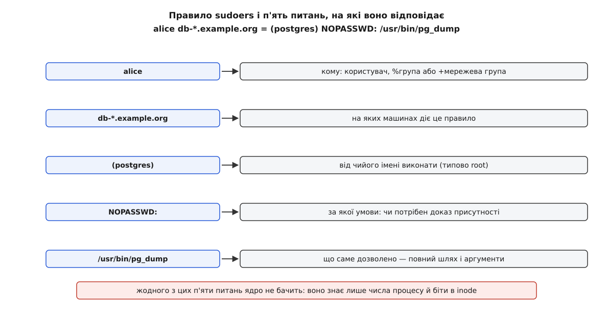
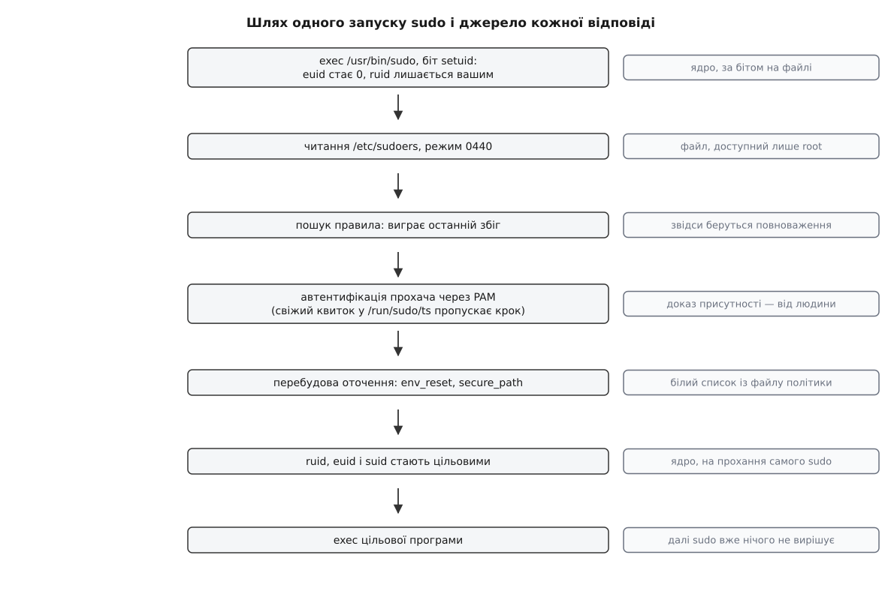
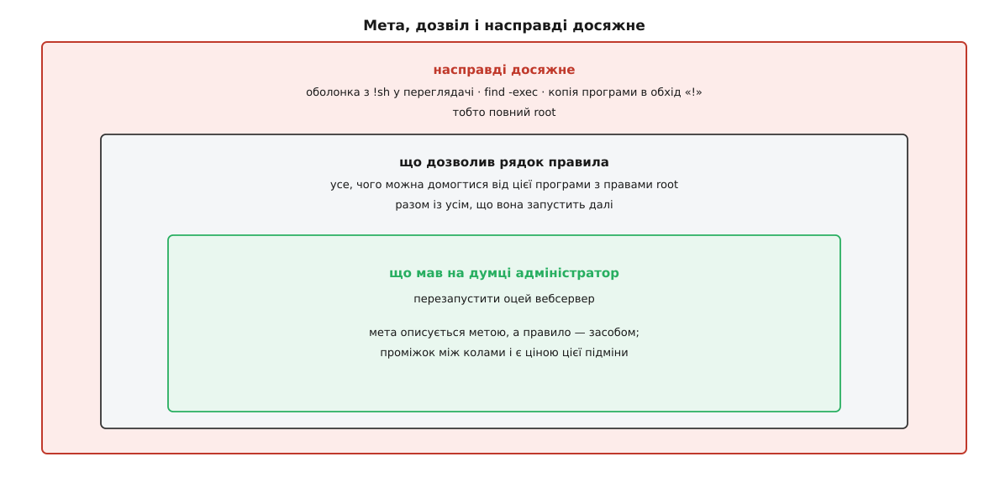

# sudo: підвищення прав за правилами sudoers

<preknowlist>
- [Користувачі, групи й ідентичність процесу](book:unix-linux/uid-gid-model) — процес несе числа ruid і euid; на перевірках ядро дивиться на діючий, а реальний каже, чий це процес.
- [setuid, setgid і підвищення прав](book:unix-linux/setuid-and-privilege) — біт на файлі, що в мить exec дає програмі права власника файлу; усе оточення, з яким вона починає життя, склав той, хто її запустив.
- [exec: заміна образу](book:unix-linux/exec-semantics) — процес лишається тим самим, а код і адресний простір у ньому міняються цілком.
- [argv, оточення й що успадковує дитина](book:unix-linux/argv-and-environment) — аргументи й змінні оточення складає той, хто запускає, і вони переходять у нову програму.
- [PAM: стек модулів автентифікації](book:unix-linux/pam-stack) — налаштовний ланцюг перевірок «чи це справді та людина», спільний для всіх програм, що питають пароль.
- [Автентифікація](book:programming/authentication) — межа між «доведи, що це ти» і «тобі це можна»: два різні питання з різними відповідями.
</preknowlist>

На машині троє адміністраторів і один пароль root. Так живуть роками, доки нічого не сталося.

Потім один звільняється — і пароль треба міняти двом іншим. Потім у журналі знаходять рядок про те, що вночі переписали налаштування мережі, і сказати, хто з трьох це зробив, неможливо: у журналі стоїть `root`. Потім приходить четвертий, якому треба вміти рівно одне — перезапускати одну службу, — а віддати йому доводиться все.

Три різні біди, але корінь у них спільний. Пароль root — це не право, це **знання**. І воно має всі властивості знання: його не можна віддати частинами, не можна забрати назад в однієї людини, не забравши в решти, і воно нічого не каже про того, хто ним скористався.

Отже, потрібен спосіб віддати частину повноважень root, не віддаючи того, чим root стають.

## Хто взагалі здатен це вирішити

Ядро таке рішення ухвалити не може. Усе, що воно має на руках, — числа процесу й біти в inode; про людей, про наміри й про переліки дозволених команд у ньому немає поняття. Єдина відповідь, яку ядро вміє дати на питання про підвищення прав, — це біт setuid на файлі, і вона однакова для всіх, хто цей файл запустив: усе або нічого.

А записати ми хочемо щось на кшталт «Іванові вільно перезапускати оцю службу від імені root». Це твердження про трійку — хто, що робить, від чийого імені, — і жодного з трьох членів ядро не бачить.

Значить, рішення живе в просторі користувача: у програмі, яка читає файл із правилами й порівнює з ним прохання. Але сама ця програма мусить уміти віддати права root — а такий механізм у Unix рівно один. Тому вона неминуче виходить **setuid root**: працює від нуля з першої ж інструкції й далі обмежує себе сама, тим, що знайшла у файлі. Уся конструкція, про яку йдеться далі, — наслідок цих двох речень: файл політики плюс вхідні двері, до яких може підійти будь-хто.

Програма зветься `sudo`. Назва читається як *superuser do* — «зроби від імені суперкористувача»; відколи ціль стало можливо вибирати, її частіше розгортають як *substitute user do* — «зроби від імені іншого користувача». На відміну від [`su`](book:unix-linux/su-switch-user), яка питає пароль **цілі** й після цього віддає її повністю, `sudo` не питає чужого пароля взагалі: він питає ваш.

Як з невеличкої програми на VAX-11/750 близько 1980 року виросло те, що сьогодні стоїть майже на кожній машині, — [окрема розповідь](book:unix-linux/sudo/hist-sudo-lineage.md).

## П'ять питань в одному рядку

Файл політики зветься `/etc/sudoers`, і одне правило в ньому — це один рядок:

```
alice   db-*.example.org = (postgres) NOPASSWD: /usr/bin/pg_dump
```



*Кожна частина рядка відповідає на своє питання, і жодне з цих п'яти питань ядро поставити не вміє — саме тому політика й опинилася у просторі користувача.*

Перше поле — **кому**: ім'я користувача, `%група`, `%#gid` або мережева група `+netgroup`; імена й членство беруться зі [звичайної бази облікових записів](book:unix-linux/user-database-nss), тож у мережевому каталозі правило «усім із групи `dba`» діє на всіх машинах одразу.

Друге поле — **на яких машинах**. Воно здається зайвим, доки не згадати, звідки взялося: у мережі з десятків робочих станцій один-єдиний `/etc/sudoers` роздавали по спільній файловій системі, і колонка машин була єдиним способом розрізнити, де саме це правило діє. Сьогодні файли частіше розкладає система керування конфігураціями, але поле лишилося — і лишилося корисним для правил, що мають діяти лише на робочих серверах.

Третє, у дужках, — **від чийого імені**: `(postgres)` або `(postgres:dba)`, якщо треба задати ще й групу. Типове значення — `root`, і саме через цю типовість легко забути, що `sudo` взагалі не про root: це механізм «виконати від імені когось іншого», у якому root — лише найчастіший випадок.

Четверте — **позначки**: `NOPASSWD` знімає вимогу пароля, `NOEXEC` забороняє дозволеній програмі запускати інші, `SETENV` дозволяє прохачеві передати змінні оточення.

П'яте — **що саме**: повний шлях до програми, можливо з аргументами.

Коли правил кілька й кілька з них підходять, виграє **останній збіг**, а не найточніший. Це найважливіше і найчастіше забуте речення про синтаксис: рядок-виняток, поставлений вище за загальний рядок, не діє взагалі. Тому файл читають згори вниз як послідовність перезаписів, а правлять його через `visudo` — програму, яка перевіряє синтаксис перед тим, як покласти новий вміст на місце, бо помилка в цьому файлі означає, що привілейованої дії не зробить уже ніхто.

Повний перелік — псевдоніми, `Defaults`, позначки, контрольні суми файлів, каталог `/etc/sudoers.d/` — зібрано окремо: [синтаксис sudoers і команди навколо нього](book:unix-linux/sudo/api-sudoers-syntax.md).

> 🔧 **Навіщо це.** Прочитати політику очима важче, ніж здається: правила приходять із кількох файлів, накладаються одне на одне й залежать від членства в групах. Тому перевіряють її не читанням, а запитом: `sudo -l` показує, що саме дозволено вам на цій машині після всіх накладань, а `sudo -l -U ivan` — що дозволено Іванові. Це та сама відповідь, яку `sudo` дасть у мить запуску, і будь-яку зміну в `sudoers.d` варто звіряти саме нею, а не власним прочитанням файлу.

## Один запуск, крок за кроком

Тепер простежмо, що відбувається між натисканням Enter і появою нового процесу.



*Праворуч від кожного кроку — джерело відповіді: повноваження приходять із файлу, доказ присутності — від людини або з кеша, а числа наприкінці ставить ядро на прохання самого sudo.*

**Запуск.** Ваша оболонка робить `exec` файлу `/usr/bin/sudo`, на якому стоїть біт setuid. Діючий ідентифікатор стає нулем, реальний лишається вашим — і саме реальний відповідає на питання «хто просить». Якби `sudo` дивився на діючий, він питав би сам себе.

**Читання політики.** Файл `/etc/sudoers` має режим `0440` і власника root: прочитати його не може ніхто, крім root. Звідси неприємний наслідок, вартий уваги, — програма мусить бути привілейованою **ще до того**, як дізналася, чи має право хоч на що-небудь.

**Пошук правила.** Якщо жодне не підходить, `sudo` відмовляє й пише про це в журнал. Ця відмова коштує рівно нічого, і в цьому теж є сенс: невдала спроба лишає слід.

**Автентифікація.** `sudo` проганяє [стек PAM](book:unix-linux/pam-stack) із файлу `/etc/pam.d/sudo` і питає **ваш** пароль. Ось місце, де найлегше помилитися в розумінні: пароль тут нічого не додає до ваших повноважень. Повноваження вже записані у файлі й були відомі кроком раніше. Пароль доводить **присутність** — що за цим терміналом досі та сама людина, а не хтось, хто підійшов до незамкненого екрана. Це рівно та роль, яку в [полкіті](book:unix-linux/polkit) грає `auth_self`.

**Перебудова оточення.** Про неї — наступний розділ.

**Зміна облікових даних.** `sudo` бере в базі групи цілі, ставить груповий і користувацький ідентифікатори — причому **всі три** числа, реальний, діючий і збережений, стають цільовими. Дороги назад у нового процесу немає: він не «тимчасово підвищений», він просто інший.

**Запуск.** Останній `exec` замінює образ на цільову програму. Коли `sudo` не мусить нічого спостерігати, цей `exec` відбувається просто в його власному процесі — програма стає на його місце, і [код виходу](book:unix-linux/exit-status) ваша оболонка дістає прямо від неї. А коли діє `use_pty` чи запис сеансу (від 1.9.14 `use_pty` типово ввімкнено), `sudo` спершу відгалужує дитину, віддає `exec` їй, а сам лишається батьком, який тільки чекає й переказує її код виходу далі.

## Квиток на п'ять хвилин

Питати пароль на кожен запуск здається найбезпечнішим, доки не подивитися, що це робить із людиною. Установлення пакунка — це десяток команд поспіль, і людина, яка вводить пароль удесяте за хвилину, вводить його не думаючи. Рефлекс «побачив запит — набрав пароль» коштує дорожче, ніж усе, що ним захищають.

Тому доведену присутність запам'ятовують. Запис лежить у `/run/sudo/ts` — на [тимчасовій файловій системі в пам'яті](book:unix-linux/pseudo-filesystems), тож перезавантаження стирає всі квитки самим фактом. Типовий строк — п'ять хвилин, і рахується він від останнього запуску, а не від уведення пароля.

Найцікавіше в цьому записі — його **межа**. Типово квиток прив'язаний до терміналу (`tty_tickets`), і причина проста: без прив'язки будь-яка ваша програма в сусідньому вікні дістала б право на привілейовану дію без жодної вашої участі — просто тому, що п'ять хвилин тому ви щось робили в іншому вікні. Прив'язка звужує вікно до одного терміналу, але не закриває його: усе, що виконується від вашого імені в **тому самому** терміналі, живе всередині квитка. Скинути його вручну — `sudo -k`; вимкнути зовсім — `Defaults timestamp_timeout=0`.

Термінал тут узагалі виявився слабким місцем, і не лише через квиток. Процес, який тримає відкритим ваш термінал, історично міг вкинути в його чергу вводу символи через `ioctl(TIOCSTI)` — так, наче їх набрали ви; після завершення привілейованої програми ці символи виконає ваша оболонка. Звідси налаштування `use_pty`, за яким `sudo` віддає команді свіжий [псевдотермінал](book:unix-linux/pseudo-terminal) замість справжнього, і звідси ж вимикач `dev.tty.legacy_tiocsti`, який Kees Cook додав у ядро (увійшов у 6.2) і який частина дистрибутивів тримає вимкненим типово.

> 🔧 **Навіщо це.** `NOPASSWD` заведено вважати послабленням, але правильна відповідь залежить від того, чи є кому доводити присутність. Задача в `cron` або крок складання в CI виконується тоді, коли за машиною нікого немає: там запит пароля означає лише те, що пароль доведеться десь записати — а це гірше за будь-яке `NOPASSWD`. І навпаки, на робочому столі, повз який ходять люди, `NOPASSWD` знімає єдине, що там узагалі перевіряють.

## Оточення дістається в спадок

Підвищена програма починає життя в оточенні, яке склав той, хто її запустив, — це загальна властивість [будь-якого setuid-запуску](book:unix-linux/setuid-and-privilege), і `sudo` успадковує її цілком. Різниця лише в тому, що між прохачем і ціллю тут стоїть посередник, здатний оточення почистити.

Типово діє `env_reset`: майже все викидається, а лишається короткий білий список — `TERM` та те, що адміністратор дописав через `env_keep`. Решту потрібного `sudo` не зберігає, а ставить сам: `HOME`, `SHELL`, `LOGNAME` і `USER` — за ціллю, плюс власні `SUDO_*` про прохача. Окремо стоїть `secure_path` — стала змінна `PATH`, якою `sudo` заміняє вашу. Без неї дозволена програма, шукаючи допоміжну команду за іменем, знайшла б її у вашому каталозі: правило вказує повний шлях до самої програми, але не має жодного впливу на те, що вона запустить далі.

## Команда — поганий спосіб сказати, чого ви хочете

Тут починається найважче в темі, і воно не про механізм, а про мову, якою складено правило.

Адміністратор має на думці **мету**: «Іван має вміти перезапускати цей вебсервер». Записати він може лише **засіб** — командний рядок. І дозвіл виявляється не тим, що він хотів сказати, а всім, чого можна домогтися від цієї програми, запущеної з правами root.



*Правило описує засіб, а не мету; проміжок між колами й є простором усіх відомих способів вирости з дозволеної команди до повного root.*

**Програма приводить із собою іншу програму.** Класика — сторінковий переглядач: `systemctl status` в інтерактивному терміналі віддає вивід у `less`, а з `less` набирається `!sh` — і ви маєте оболонку від імені root. Нікому й на думку не спадало давати Іванові переглядач; його притягла за собою дозволена команда. Той самий клас — `find -exec`, `awk 'BEGIN{system("/bin/sh")}'`, `tar --to-command`, будь-який редактор. Позначка `NOEXEC` це частково затуляє: `sudo` підставляє програмі підмінені функції запуску через [механізм попереднього завантаження бібліотек](book:unix-linux/library-search-order) — і, отже, працює лише для динамічно злінкованих програм. На Linux та сама бібліотека від sudo 1.8.18p1 ще й ставить фільтр системних викликів, тож прямим `execve` в обхід libc її вже не обійти; на решті систем ця дірка лишилася.

**Аргументи звіряються як текст.** У правилі можна перелічити дозволені аргументи, і шаблон `*` у них збігається з будь-якими символами, включно з `/`. Шляхи при цьому ніхто не зводить до канонічного вигляду. Тому правило `/bin/cat /var/log/*` дозволяє `sudo cat /var/log/../../etc/shadow` — рядок збігся, а файл виявився зовсім не той. Ще одна тонкість того самого ґатунку: якщо в правилі аргументів не вказано взагалі, дозволені **будь-які**; заборонити їх повністю можна лише явним `""`.

**Відняти від «усього» не виходить.** Правило `ivan ALL = ALL, !/bin/su` виглядає як «усе, крім `su`», а насправді означає «усе»: досить скопіювати файл в інше місце й запустити копію — шлях у правилі інший, збіг із забороною не спрацював, а `sudo` й так виконає його від імені root. Ця пастка настільки стала, що про неї попереджає власна документація sudoers, і вона ж повторилася на іншому полі: правило виду «від імені будь-кого, крім root» обходили запитом `sudo -u#-1`, бо −1 не збігалося з жодним іменем і тому не потрапляло під заборону, а системному викликові зміни ідентифікатора те саме −1 означає «не міняти» — і процес лишався тим, ким уже був, тобто root (CVE-2019-14287, знайшов Joe Vennix, полагоджено в 1.8.28). Спільний висновок обох випадків один: **перелік винятків не є межею**. Межею є перелік дозволеного.

Звідси єдина конструктивна порада: не роздавайте загальнопризначені програми. Якщо дозвіл має звучати «перезапустити оцю службу», привілейованою робіть власну маленьку програму, яка вміє рівно це й не приймає нічого зайвого. Як така програма виглядає й на чому вони найчастіше ламаються — [розібрано з кодом](book:unix-linux/sudo/proj-sudo-wrapper.md). Загальне формулювання цього підходу — [принцип найменших привілеїв](book:programming/least-privilege).

## Правити файл — окрема задача

`sudo vi /etc/hosts` — найпоширеніший спосіб віддати повний root за одне натискання: редактор запускається від імені root, а з будь-якого редактора виходить оболонка.

Тому редагування виділили в окремий режим — `sudoedit` (він же `sudo -e`). Схема інша: файл копіюється в тимчасовий, ваш редактор запускається **від вашого імені** й з вашими налаштуваннями, а привілейованою лишається тільки остання дія — покласти змінений вміст назад. Виграш подвійний: редактор більше не є привілейованим, і його втечі більше нічого не варті.

Ціна теж є, і вона показова. Привілейованого коду поменшало, але не зникло: лишився і шматок, який кладе файл на місце, і весь спільний вхід, через який `sudoedit` узагалі викликають. Помилка знайшлася саме на вході. У січні 2021 року Qualys опублікували `Baron Samedit` (CVE-2021-3156): переповнення купи при знятті зворотних скісних рисок з аргументів командного рядка, до якого діставалися сполученням режиму редагування з ключем `-s`, дозволяло стати root будь-кому, хто взагалі має обліковий запис — навіть без жодного правила в `sudoers`. Вразливий код прожив у програмі з липня 2011 року, тобто близько десяти років.

## Журнал: те, заради чого все починалося

Кожен запуск лишає рядок: хто просив, з якого терміналу, з якого каталогу, від чийого імені й яку саме команду. Це і є відповідь на другу з трьох бід, з яких почалася тема: дія перестала бути безіменною.

Але межі цього журналу треба знати точно. Він фіксує **прохання**, а не те, що сталося далі: `sudo -i` — це один рядок на цілий сеанс, усередині якого могло статися будь-що. Для випадків, коли цього мало, є запис усього вводу й виводу (`log_input`, `log_output`) з подальшим переглядом через `sudoreplay`.

І головне обмеження — інше. Журнал, записаний на тій самій машині, де щойно здобули root, доказом не є: той, хто його здобув, може його переписати. Тому в sudo 1.9 з'явився `sudo_logsrvd` — служба, якій записи відсилають на іншу машину, а на робочих машинах журнал дублюють у [централізований збирач](book:unix-linux/journald-logging) або в [підсистему аудиту ядра](book:unix-linux/audit-framework), яку сам `sudo` не контролює.

## Куди рухаються вхідні двері

Слабке місце всієї конструкції видно з першого розділу: це двері, до яких може підійти будь-хто, і за ними одразу нуль. `Baron Samedit` показав, скільки років там здатна прожити помилка; у 2025 році Rich Mirch зі Stratascale знайшов ще дві — зокрема CVE-2025-32463, де ключ `--chroot` давав root узагалі без правила в політиці, бо `sudo` викликав `chroot()` на вказаний користувачем каталог ще до того, як з'ясував, чи має право.

Відповіді на це рухаються у двох різних напрямах. Перший — прибрати цілий клас помилок: `sudo-rs`, переписаний на Rust з ініціативи Internet Security Research Group (проєкт Prossimo, згодом Trifecta Tech Foundation), від жовтня 2025 року стоїть типовим в Ubuntu 25.10; частину рідковживаних можливостей у ньому свідомо не реалізували — і, показово, обидві торішні вразливості стосувалися саме тих можливостей, яких там немає.

Другий напрям — прибрати самі двері. `run0` із systemd 256 (2024) не є setuid-програмою взагалі: це те саме `systemd-run` під іншим іменем, яке просить [керівник служб](book:unix-linux/systemd-model) запустити процес від імені цілі. Привілейований процес народжується не з вашого, а з PID 1, тож не успадковує від вас ні оточення, ні дескрипторів, ні терміналу — термінал йому виділяють новий. Хто дозволяє, вирішує [полкіт](book:unix-linux/polkit). Плата за це очевидна з попередніх розділів: політика стає полкітовою, а разом із нею зникає та сама одиниця, у якій `sudoers` уміє говорити, — конкретний командний рядок із конкретними аргументами.

І тут видно, що насправді лишається від sudo незалежно від того, чия програма запускатиме привілейований процес завтра. Не підвищення прав — його вміє й один біт на файлі. Головне те, що делегування перестало бути знанням, яке передають з рук у руки, і стало **текстом**: його можна прочитати, звірити, покласти в систему контролю версій і спитати з автора. Невирішеним лишилося рівно те, з чого почався передостанній розділ: цей текст говорить про засоби, а людина, яка його пише, думає про мету — і кожна пастка вище живе саме в проміжку між цими двома.
