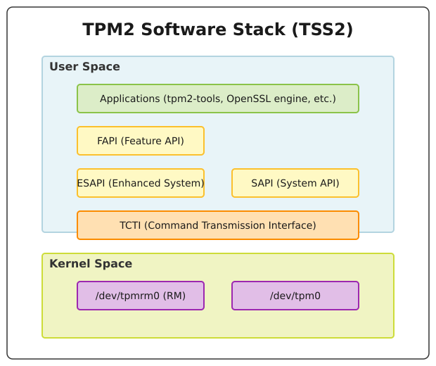

# Стек TPM 2.0 та апаратне зберігання ключів

<preknowlist>
- [Концепції ядра Linux](book:unix-linux/kernel-and-userspace) — базові поняття системних викликів та VFS.
</preknowlist>

Сучасна комп'ютерна безпека вимагає не лише надійних криптографічних алгоритмів, але й безпечного середовища для зберігання ключів та виконання криптографічних операцій. Trusted Platform Module (TPM) — це спеціалізований мікроконтролер (або його програмна чи мікропрограмна емуляція), призначений для забезпечення апаратного рівня безпеки комп'ютерних систем. 

У цій статті ми детально розглянемо стек програмного забезпечення TPM 2.0 у системах Unix та Linux (TSS2), архітектуру взаємодії між ядром операційної системи та простором користувача, а також практичні аспекти використання апаратного зберігання ключів, прив'язки даних до стану платформи (sealing) та атестації.

## 1. Вступ до TPM 2.0

TPM (Trusted Platform Module) є міжнародним стандартом, розробленим консорціумом Trusted Computing Group (TCG). Перша версія, TPM 1.2, набула широкого поширення, але мала обмеження щодо підтримуваних криптографічних алгоритмів (в основному RSA та SHA-1). Стандарт TPM 2.0, опублікований у 2014 році (ISO/IEC 11889:2015), став кардинальним переглядом архітектури. TPM 2.0 підтримує криптографічну гнучкість (crypto-agility), дозволяючи використовувати сучасні алгоритми, такі як еліптичні криві (ECC) та сімейство геш-функцій SHA-2 або SHA-3.

### Форм-фактори TPM
TPM може існувати в декількох формах:
- **dTPM (Discrete TPM):** Окремий апаратний чип на материнській платі (зазвичай підключений через шину SPI або LPC). Вважається найбільш захищеним варіантом від фізичних втручань.
- **fTPM (Firmware TPM):** Реалізація TPM у захищеному середовищі виконання (Trusted Execution Environment, TEE) основного процесора (наприклад, Intel PTT або AMD fTPM). Вона не має окремого чипа, але ізольована від основної операційної системи.
- **vTPM (Virtual TPM):** Програмна реалізація для віртуальних машин, яка надає гостьовій ОС інтерфейс TPM, що емулюється гіпервізором.

### Основні функції TPM
1. **Генерація випадкових чисел:** Наявність апаратного генератора справжніх випадкових чисел (TRNG).
2. **Безпечне зберігання ключів:** Ключі генеруються всередині TPM і, як правило, ніколи не залишають його межі у відкритому (незашифрованому) вигляді.
3. **Вимірювання платформи (Platform Measurement):** Зберігання гешів конфігурації системи (завантажувача, ядра, прошивок) у регістрах PCR.
4. **Прив'язка даних (Sealing):** Можливість зашифрувати дані таким чином, що їх можна розшифрувати лише за умови певного стану системи (тобто певних значень PCR).
5. **Атестація (Attestation):** Механізм доведення третій стороні, що система працює в довіреному стані і що певний ключ дійсно згенерований апаратним TPM.

## 2. Архітектура ядра Linux: /dev/tpm0 та /dev/tpmrm0

Для того, щоб застосунки простору користувача (user space) могли взаємодіяти з чипом TPM, ядро Linux надає драйвери та відповідні символьні пристрої. Історично для цього використовувався пристрій `/dev/tpm0`.

Однак, TPM — це пристрій із дуже обмеженими ресурсами. Він має невелику кількість внутрішньої пам'яті для зберігання завантажених об'єктів (ключів, сесій). Зазвичай він може тримати в пам'яті лише 3–4 об'єкти одночасно. Якщо кілька програм спробують одночасно взаємодіяти з TPM через `/dev/tpm0`, вони швидко вичерпають доступні слоти (виникне помилка `TPM_RC_OBJECT_MEMORY`), і застосунки повинні будуть вручну керувати вивантаженням і завантаженням контекстів (context swapping).

### Менеджер ресурсів TPM (In-Kernel Resource Manager)
Починаючи з версії ядра Linux 4.12, було додано вбудований менеджер ресурсів (TPM Resource Manager), який надається через пристрій `/dev/tpmrm0`.

Менеджер ресурсів працює подібно до планувальника завдань операційної системи або менеджера віртуальної пам'яті. Коли застосунок відкриває `/dev/tpmrm0`, менеджер ресурсів створює для нього ізольований віртуальний простір. Він автоматично перехоплює команди, завантажує необхідні об'єкти в TPM перед виконанням команди і вивантажує їх (зберігаючи зашифрований контекст у оперативній пам'яті комп'ютера) після її завершення.

Це дозволяє багатьом процесам працювати з TPM одночасно і не турбуватися про брак пам'яті всередині самого чипа. **Сучасні рекомендації вимагають завжди використовувати `/dev/tpmrm0`** для роботи з TPM 2.0, залишаючи `/dev/tpm0` виключно для специфічних інструментів діагностики або оновлення прошивки самого TPM.

Рис. TPM2 Software Stack Архітектура:


## 3. TPM2 Software Stack (TSS2)

Робота з TPM на рівні байтових команд (TPM Command Transmission) є надзвичайно складною та схильною до помилок. Кожна команда є бінарним блоком даних, який потрібно ретельно сформувати, враховуючи сесії авторизації, криптографічні підписи (HMAC) параметрів тощо.

Для розв'язання цієї проблеми TCG розробила стандартизований стек програмного забезпечення, відомий як TSS2 (TPM2 Software Stack). Найпоширенішою його реалізацією в Linux є проект `tpm2-tss` від Intel/Fraunhofer. Цей стек складається з кількох рівнів API, кожен з яких пропонує різний баланс між контролем та зручністю.

### 3.1 TCTI (TPM Command Transmission Interface)
Найнижчий рівень абстракції, який просто відповідає за передачу бінарних пакетів до TPM та отримання відповідей. Він приховує деталі транспортного рівня. Наприклад, TCTI може працювати безпосередньо з `/dev/tpmrm0`, звертатися до програмного емулятора (через сокети) або спілкуватися з демоном доступу користувацького простору (abrmd).

### 3.2 SAPI (System API) / SYS
SAPI (зараз часто називається SYS) — це пряма відповідність специфікаціям команд TPM 2.0. Кожна команда TPM має відповідну функцію SAPI (наприклад, `Tss2_Sys_Create`). SAPI генерує правильний потік байтів, але вимагає від розробника вручну розраховувати сесії, HMAC та керувати станом. Код на SAPI зазвичай дуже громіздкий.

### 3.3 ESAPI (Enhanced System API)
ESAPI створений, щоб розв'язати проблему складності SAPI. Він автоматично керує криптографічними сесіями та обчисленням HMAC для авторизації параметрів. Якщо ви пишете C/C++ застосунок і вам потрібен повний контроль над TPM, але ви не хочете власноруч реалізовувати протоколи авторизації (які дуже складні), ESAPI — це правильний вибір. `tpm2-tools` в основному побудовані на базі ESAPI.

### 3.4 FAPI (Feature API)
FAPI — це найвищий рівень TSS2, розроблений для спрощення типових завдань до 1-2 викликів функцій. FAPI використовує концепцію профілів і автоматичного керування ієрархіями ключів. Замість того, щоб вказувати складні криптографічні параметри (наприклад, алгоритм RSA, режим padding, геш для OAEР), розробник просто вказує шлях (наприклад, `"HS/SRK/my_key"`), а FAPI самостійно бере на себе все інше, спираючись на конфігураційні файли (JSON).

## 4. Ієрархії TPM 2.0 та типи ключів

TPM 2.0 організовує свої об'єкти (ключі, паролі, NV-індекси) у так звані ієрархії. Ієрархія — це криптографічне дерево, на вершині якого знаходиться первинне значення (Primary Seed) — велике випадкове число, згенероване самим TPM і яке ніколи не залишає його межі. З цього seed за допомогою KDF (Key Derivation Function) детерміновано генеруються первинні ключі (Primary Keys).

У TPM 2.0 є чотири основні ієрархії:
1. **Endorsement Hierarchy (`TPM_RH_ENDORSEMENT`):** Призначена для ключів ідентифікації пристрою (Endorsement Key). Вона використовується для доведення третій стороні, що ви спілкуєтесь зі справжнім апаратним TPM. Контролюється виробником і адміністратором приватності (Privacy Administrator).
2. **Platform Hierarchy (`TPM_RH_PLATFORM`):** Призначена для використання мікропрограмою платформи (BIOS/UEFI, завантажувач). Зазвичай ОС не має повного доступу до цієї ієрархії після завантаження.
3. **Owner/Storage Hierarchy (`TPM_RH_OWNER`):** Основна ієрархія для використання операційною системою та застосунками. Вона використовується для створення Storage Root Key (SRK) та генерації ключів користувачів. Контролюється власником (ОС/Адміністратором).
4. **Null Hierarchy (`TPM_RH_NULL`):** Ефемерна ієрархія. Її первинний seed генерується заново при кожному перезавантаженні TPM. Ключі в цій ієрархії не зберігаються між перезавантаженнями. Використовується для тимчасових криптографічних операцій або сесій.

### Ключ ідентифікації: Endorsement Key (EK)
EK — це особливий ключ, пара якого (або принаймні первинне зерно для її генерації) прошивається в TPM ще на заводі-виробнику. Виробник TPM також надає сертифікат (EK Certificate), підписаний його власним кореневим центром сертифікації (Root CA), який підтверджує, що публічна частина EK дійсно належить їхньому оригінальному апаратному TPM.

Це критично важливо, оскільки без EK Certificate зловмисник міг би створити програмний емулятор TPM (vTPM), який брехав би про свій стан. Сертифікат EK гарантує фізичну справжність мікросхеми. Важлива деталь: приватна частина EK **ніколи** не використовується для підписування (signing). Вона використовується **лише для дешифрування** (decrypt) під час процесу, відомого як MakeCredential/ActivateCredential.

### Ключ атестації: Attestation Key (AK)
Оскільки підписувати дані ключем EK заборонено (це порушувало б конфіденційність, оскільки EK унікальний і його використання для всіх підписів дозволило б відстежувати користувача), для атестації створюються ключі AK (або AIK - Attestation Identity Key).

AK — це ключ (зазвичай RSA або ECC), згенерований в ієрархії Endorsement, який має атрибут "restricted signing". Це означає, що AK може підписувати лише структури даних, згенеровані самим TPM (наприклад, цитати стану PCR — Quotes), але не може підписувати довільні дані користувача. 

Щоб довести третій стороні (серверу атестації), що AK дійсно створений всередині справжнього TPM (а не програмного), сервер шифрує симетричний ключ для передачі (виклик MakeCredential), використовуючи публічний ключ EK. Цей зашифрований пакет структурований так, що TPM зможе розшифрувати його (виклик ActivateCredential) за допомогою приватного EK **лише за умови**, що вказаний AK також знаходиться в цьому ж TPM. Якщо розшифрування успішне, клієнт отримує секрет, що підтверджує легітимність AK.

## 5. Робота з TPM: використання tpm2-tools

Найбільш практичним способом взаємодії з TPM 2.0 у Linux є використання набору утиліт командного рядка `tpm2-tools`. Це набір інструментів, які дозволяють виконувати операції з TPM, не пишучи код на C.

### 5.1 Створення Storage Root Key (SRK)
Все в ієрархії Owner починається з первинного ключа. Створимо SRK (первинний ключ RSA) і збережемо його контекст у файл `srk.ctx`.

```bash
# Генерація первинного ключа в Owner ієрархії
tpm2_createprimary -C o -g sha256 -G rsa -c srk.ctx
```
Тут `-C o` означає ієрархію Owner, `-g sha256` — алгоритм гешування для ключів, `-G rsa` — тип ключа, а `-c srk.ctx` — файл для збереження контексту (об'єкта, який вказує на цей ключ у пам'яті TPM).

Оскільки генерація первинного ключа детермінована, кожен раз при виконанні цієї команди з тими ж параметрами, ви отримаєте один і той самий ключ SRK. Тому не обов'язково зберігати його постійно (Persistent Memory), його можна генерувати "на льоту".

### 5.2 Створення та завантаження дочірнього ключа
Далі ми створюємо звичайний симетричний ключ (наприклад, AES), який буде "загорнутий" (encrypted/wrapped) ключем SRK.

```bash
# Створення ключа AES для шифрування
tpm2_create -C srk.ctx -g sha256 -G aes -u key.pub -r key.priv
```
Файли `key.pub` та `key.priv` є публічною і приватною частинами ключа. Однак, **`key.priv` — це не "голий" симетричний ключ**. Це симетричний ключ, зашифрований публічним ключем SRK всередині TPM. Ці файли можна безпечно зберігати на диску; навіть якщо зловмисник їх викраде, він не зможе витягти ключ AES без доступу до вашого апаратного TPM.

Щоб використовувати ключ, його потрібно завантажити в TPM:
```bash
tpm2_load -C srk.ctx -u key.pub -r key.priv -c key.ctx
```
Тепер `key.ctx` можна використовувати для шифрування і дешифрування.

### 5.3 Шифрування та дешифрування даних
Шифруємо файл `secret.txt`:
```bash
tpm2_encryptdecrypt -c key.ctx -o secret.enc secret.txt
```
Дешифруємо його:
```bash
tpm2_encryptdecrypt -d -c key.ctx -o secret.dec secret.enc
```

### 5.4 Постійне зберігання ключів (Persistent Objects)
Іноді зручно зберігати ключ всередині енергонезалежної пам'яті TPM, щоб не завантажувати його щоразу файлами `*.ctx`. Для цього ключу або об'єкту присвоюється Persistent Handle (покажчик на адресу, що починається з `0x81xxxxxx`).

```bash
# Зберігання srk.ctx в пам'яті TPM за адресою 0x81000001
tpm2_evictcontrol -C o -c srk.ctx 0x81000001
```
Тепер замість `srk.ctx` можна використовувати адресу `0x81000001` в будь-якій команді `tpm2_tools`. Варто пам'ятати, що NVRAM TPM (де зберігаються persistent об'єкти) має дуже обмежений обсяг, тому не слід зловживати цією можливістю.

## 6. Регістри конфігурації платформи (PCRs) та Sealing

PCR (Platform Configuration Registers) є фундаментальним концептом TPM, що дозволяє реалізувати ідею "Trusted Boot" та "Sealing". 

PCR — це регістри, які можуть містити лише криптографічний геш (зазвичай SHA-1, SHA-256 або SHA-384). Унікальність PCR полягає в тому, що ви **не можете записати значення в PCR безпосередньо**. Єдина операція модифікації, дозволена для PCR, — це `Extend` (розширення).

Операція Extend працює так:
`New_PCR_Value = Hash( Current_PCR_Value || New_Data )`

Ця властивість гарантує, що значення PCR залежить від **усіх** попередніх вимірювань і від **порядку**, в якому ці вимірювання були зроблені. Це утворює нерозривний криптографічний ланцюжок.

### Розподіл PCR у PC (TCG Client Specification)
Згідно зі стандартами TCG для ПК, регістри PCR мають конкретне призначення:
- **PCR 0:** Core Root of Trust for Measurement (CRTM), BIOS/UEFI код.
- **PCR 1:** Налаштування BIOS, конфігурація материнської плати.
- **PCR 2:** Option ROMs.
- **PCR 3:** Налаштування Option ROM і конфігурація.
- **PCR 4:** Master Boot Record (MBR) або UEFI Boot Manager (наприклад, GRUB2 або systemd-boot), завантажуваний код.
- **PCR 5:** Конфігурація завантажувача (наприклад, командний рядок ядра або конфіги GRUB).
- **PCR 7:** Стан Secure Boot, ключі та сертифікати Secure Boot (PK, KEK, db, dbx).
- **PCR 8-15:** Призначені для використання операційною системою (ядро Linux, initrd, IMA).

Коли система завантажується, BIOS/UEFI вимірює (хешує) наступний компонент (завантажувач) і виконує операцію Extend у PCR 4, перш ніж передати йому управління. Завантажувач, у свою чергу, хешує ядро та initrd, роблячи Extend у відповідні PCR. Якщо хоча б один байт у конфігурації завантажувача або ядрі зміниться, фінальне значення PCR буде абсолютно іншим.

### Sealing (Прив'язка даних до PCR)
Sealing — це процес шифрування даних за допомогою TPM таким чином, що TPM погодиться розшифрувати ці дані (Unseal) **тільки якщо** поточні значення вказаних PCR точно збігаються зі значеннями, які були при створенні об'єкта (seal).

Це ідеальний механізм для захисту ключів шифрування дисків (наприклад, LUKS). Якщо зловмисник змінить конфігурацію завантаження, вимкне Secure Boot, або завантажиться з Live USB, значення PCR 7, 4, 5 будуть відрізнятися від еталонних. Отже, TPM відмовить у розшифруванні ключа, і диск залишиться заблокованим.

#### Практичний приклад Sealing за допомогою tpm2-tools

1. Зчитаємо поточні значення PCR для банку SHA-256:
```bash
tpm2_pcrread sha256:0,7
```

2. Створимо політику авторизації (Policy), яка стверджує: "Дозволити доступ лише якщо поточні значення PCR 0 і 7 збігаються з тими, що є зараз":
```bash
tpm2_createpolicy --policy-pcr -l sha256:0,7 -L policy.digest
```
Файл `policy.digest` містить хеш складної структури, що представляє умови доступу.

3. Створюємо первинний ключ, якщо його ще немає:
```bash
tpm2_createprimary -C o -c primary.ctx
```

4. Зашифровуємо (Seal) секретний рядок, прив'язуючи його до нашої політики:
```bash
echo "My Ultra Secret Disk Key" > secret.data
tpm2_create -C primary.ctx -u obj.pub -r obj.priv -L policy.digest -i secret.data
```
Тут ми вказали `-L policy.digest`. Тепер секрет `secret.data` надійно запечатаний в об'єкті (який представлений файлами pub/priv).

5. Розшифрування (Unseal):
Щоб розшифрувати дані, нам потрібно спочатку розпочати сесію політики в TPM, довести, що PCR збігаються, і лише потім виконати Unseal.

```bash
# Завантажуємо об'єкт в TPM
tpm2_load -C primary.ctx -u obj.pub -r obj.priv -c obj.ctx

# Починаємо сесію авторизації
tpm2_startauthsession --policy-session -S session.ctx

# Виконуємо команду перевірки PCR в рамках сесії
tpm2_policypcr -S session.ctx -l sha256:0,7

# Нарешті, розшифровуємо дані, надаючи докази з сесії
tpm2_unseal -c obj.ctx -p session:session.ctx
```
Якщо стан системи не змінився, команда успішно виведе `My Ultra Secret Disk Key`. Якщо ви, наприклад, зміните налаштування Secure Boot (зміниться PCR 7), крок `tpm2_policypcr` завершиться помилкою, і ключ не буде видано.

## 7. Віддалена атестація (Remote Attestation)

У багатьох корпоративних або хмарних сценаріях серверам необхідно переконатися в цілісності своїх клієнтів або вузлів. Це робиться за допомогою механізму Quote.

Quote — це криптографічний підпис поточних значень вибраних PCR, виконаний ключем атестації (AK).

Кроки віддаленої атестації:
1. Сервер (Verifier) генерує випадкове число (Nonce) і відправляє його клієнту. Це гарантує захист від Replay Attacks.
2. Клієнт просить TPM згенерувати Quote для PCR 0, 2, 4, 7, додаючи Nonce.
   ```bash
   tpm2_quote -c ak.ctx -l sha256:0,2,4,7 -q <nonce_from_server> -m quote.msg -s quote.sig -p pcr.bin
   ```
3. Клієнт відправляє на сервер повідомлення `quote.msg`, підпис `quote.sig` та поточні значення PCR `pcr.bin`, а також Event Log (ядро Linux веде лог кожної операції Extend, який доступний у `/sys/kernel/security/tpm0/binary_bios_measurements`).
4. Сервер перевіряє криптографічний підпис (він знає публічний ключ AK та має довіру до нього через MakeCredential).
5. Сервер перераховує (replays) Event Log, роблячи імітацію Extend операцій, і перевіряє, чи фінальні хеші збігаються зі значеннями PCR у Quote.
6. Сервер аналізує кожен запис у Event Log (наприклад, хеші ядра або сертифікати Secure Boot), порівнюючи їх зі своєю базою даних "відомих хороших" хешів (Known Good Values, Reference Integrity Manifest - RIM).

Якщо все збігається, сервер знає, що клієнтська машина завантажилася в безпечному, передбачуваному стані. Це є основою для технологій типу Zero Trust.

## 8. Інтеграція TPM у реальні системи Linux

Сьогодні екосистема Linux надає відмінну інтеграцію для використання TPM 2.0 у повсякденних задачах без необхідності писати скрипти з `tpm2-tools`.

### 8.1 LUKS та systemd-cryptenroll
Найбільш популярний сценарій — автоматичне розблокування зашифрованого кореневого розділу (LUKS2) при завантаженні. Раніше для цього використовувалися складні скрипти Clevis, але зараз `systemd` має нативну підтримку.

Використовуючи утиліту `systemd-cryptenroll`, ви можете прив'язати слот ключа LUKS до PCR:
```bash
# Додає ключ в TPM і прив'язує його до PCR 7
sudo systemd-cryptenroll --tpm2-device=auto --tpm2-pcrs=7 /dev/nvme0n1p3
```
У файлі `/etc/crypttab` достатньо додати параметр `tpm2-device=auto`, і systemd під час завантаження автоматично витягне ключ із TPM (якщо PCR 7 правильний) і розблокує диск без запиту пароля.

### 8.2 SSH ключі (tpm2-pkcs11 або FAPI)
Стек TSS2 містить бібліотеку `tpm2-pkcs11`, яка реалізує стандартний інтерфейс PKCS#11 поверх TPM. Оскільки OpenSSH підтримує PKCS#11, ви можете генерувати приватні ключі SSH, які ніколи не залишають TPM.

```bash
# Приклад використання SSH з PKCS11 (конфігурація вимагає ініціалізації токена)
ssh -I /usr/lib/libtpm2_pkcs11.so user@server
```
Якщо хтось вкраде ваш ноутбук, він не зможе скопіювати ваш SSH-ключ (`id_rsa`), оскільки ключ апаратно прив'язаний до чипа на материнській платі (або вимагає TPM PIN-коду).

### 8.3 OpenSSL Engine та Provider
Для забезпечення апаратного шифрування у веб-серверах (Nginx, Apache) або VPN-шлюзах розроблено `tpm2-tss-engine` (для старих версій OpenSSL) та сучасний `tpm2-provider` (для OpenSSL 3.0). Вони дозволяють генерувати сертифікати та ключі TLS таким чином, що приватний ключ RSA/ECC обробляється всередині TPM, захищаючи сервер від крадіжки сертифіката при компрометації ОС.

## 9. Вразливості та безпекові міркування

Не зважаючи на те, що TPM позиціонується як апаратний якір довіри (Root of Trust), він не є магічною "срібною кулею". Існує кілька векторів атак та обмежень:

### Сніфінг шини (Bus Sniffing)
У дискретних dTPM мікросхема підключена до процесора через шину LPC, SPI або I2C (у телефонах). На відміну від процесора та пам'яті, ці шини часто проходять через зовнішні шари материнської плати. Зловмисник із фізичним доступом може припаяти логічний аналізатор до контактів шини та перехопити трафік.
Якщо TPM розшифровує ключ LUKS під час завантаження і передає його процесору у відкритому вигляді (cleartext) через шину SPI, зловмисник може перехопити цей ключ. 

**Захист:** Стандарт TPM 2.0 передбачає шифрування параметрів (Parameter Encryption) та сесії з HMAC. Коли налаштовується Sealing, ключ передається від TPM до процесора зашифрованим за допомогою сесійного ключа (наприклад, Salted Session). Сучасні версії systemd/clevis починають використовувати цю функцію, але багато старих реалізацій передавали ключі відкрито.

### Вразливості прошивки (Firmware Bugs)
TPM — це мікроконтролер із власною складною прошивкою. В історії були серйозні випадки вразливостей. Найвідоміша — вразливість ROCA (Return of Coppersmith's Attack, CVE-2017-15361) у криптографічній бібліотеці Infineon, яка використовувалася у мільйонах чипів TPM. Вразливість дозволяла вирахувати приватний ключ RSA з його публічної частини. У таких випадках потрібно оновлювати мікрокод TPM або замінювати обладнання.

### Захист від словникових атак (Dictionary Attack Protection - DA)
Щоб запобігти підбору PIN-кодів (Auth Values) для ключів, TPM має вбудовану систему захисту. Якщо кількість невдалих спроб авторизації (Lockout Count) досягає порогу (зазвичай 3 або 30 спроб, залежно від виробника), TPM переходить у режим блокування (Lockout Mode). У цьому режимі він відмовляється виконувати будь-які команди, що вимагають авторизації, доки не пройде час відновлення (Recovery Time). Параметри DA можна налаштувати в ієрархії Lockout.

## Висновок

Стек TPM 2.0 (TSS2) у Linux є потужним інструментом для розбудови систем із високими вимогами до безпеки. Від базових функцій, таких як `/dev/tpmrm0`, який вирішує проблему конкурентного доступу до апаратних ресурсів, до просунутих можливостей FAPI та інтеграції з systemd, Linux надає всі необхідні абстракції. 

Використання TPM дозволяє перенести відповідальність за зберігання ключів та виконання критичних криптографічних операцій з оперативної пам'яті, що вразлива до читання та дампів, у захищене апаратне середовище. Розуміння ієрархій ключів (Endorsement для атестації та Storage для зберігання), концепцій PCR та механізмів авторизації є життєво необхідним для архітекторів сучасних систем захисту інформації.
