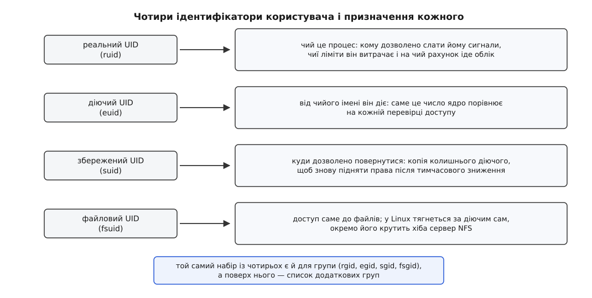
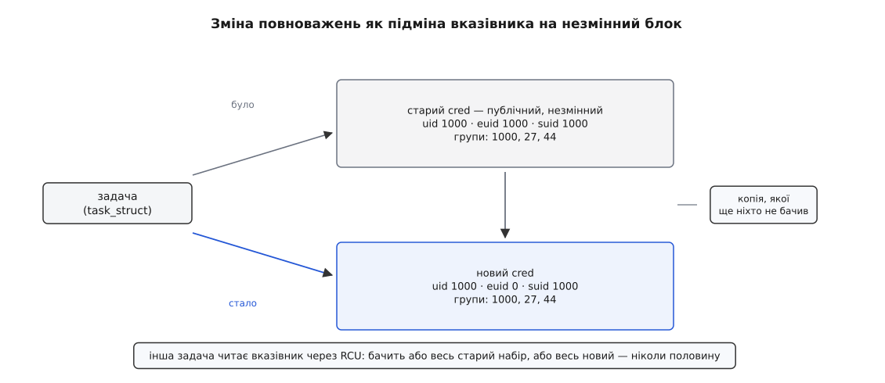
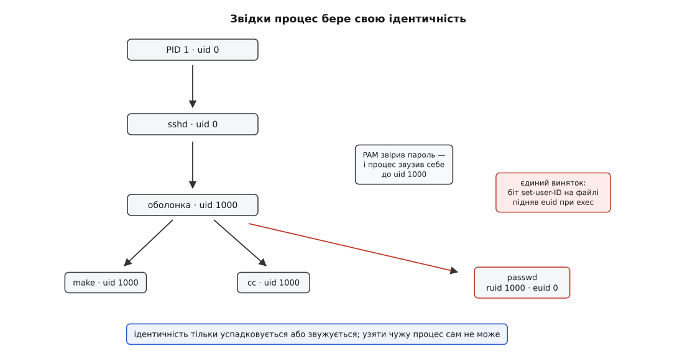

# Користувачі, групи й ідентичність процесу

<preknowlist>
- [Процес](topic:unix-linux/process-model) — усе, що ядро тримає про один запуск програми, аби виконання можна було спинити й продовжити.
- [Ядро й простір користувача](topic:unix-linux/kernel-and-userspace) — рішення про доступ до чужих ресурсів ухвалює ядро, а програма лише просить.
- [Системний виклик](topic:unix-linux/syscall-mechanics) — як програма переходить у режим ядра з проханням і повертається назад.
- [fork](topic:unix-linux/fork-semantics) — дитина починає життя з копії стану батька.
- [exec](topic:unix-linux/exec-semantics) — заміна образу програми без заміни процесу: щось при цьому переживає заміну, щось ні.
- [Inode](topic:unix-linux/inode-model) — у файлу є власник і група, записані просто в його метаданих, окремо від імені.
</preknowlist>

## Кому ядро каже «ні»

Наберіть `cat /etc/shadow` під звичайним обліковим записом — і побачите `Permission denied`. Зверніть увагу, чого при цьому **не** сталося: у вас нічого не спитали. Не запросили пароль, не показали діалог, не звернулися ні до кого по підтвердження. Відповідь була готова миттєво.

Отже, коли `cat` попросив ядро відкрити файл, ядро вже знало все потрібне, щоб відмовити. І це не поодинока послуга: та сама відповідь мусить видаватися на кожне відкриття файлу, на кожен сигнал, на кожен запис у каталог — сотні тисяч разів на секунду на завантаженій машині. Значить, вона мусить бути дешевою: жодних читань конфігів, жодних запитів кудись назовні, жодного розбору тексту.

Два питання, з яких далі виводиться вся конструкція. Перше: **де саме лежить те, з чим ядро звіряється** — бо це щось мусить бути в ядрі вже до моменту перевірки. Друге: **у якому воно вигляді** — бо звірення мусить коштувати одиниці тактів.

## Ідентичність належить процесу, а не людині

Напрошується відповідь: ядро перевіряє, який користувач запустив програму. Але «користувач, який запустив» — це не річ, до якої можна звернутися.

Запустіть довгу задачу через `nohup` і вийдіть із системи: людини вже немає, сеанс закрито, а процес біжить далі й далі відкриває файли. Завдання з `cron` узагалі стартує тоді, коли ніхто нікуди не входив. Мережевий демон обслуговує сотню людей одночасно й не є жодною з них. У момент перевірки питати нема кого — і чекати нема коли.

Тому ідентичність не є посиланням на людину. Це **знімок**, зроблений тоді, коли процес виникав, і відтоді він лежить у самому процесі — поряд із його відображенням пам'яті й таблицею дескрипторів, у тому самому переліку речей, які ядро тримає на один запуск.

Наслідок цього видно неозброєним оком і часто дивує. Змініть користувачеві пароль, поки його програма працює — програма нічого не помітить. Заберіть його зовсім із бази облікових записів — процеси, що вже біжать, і далі відкриватимуть свої файли. Ядро звіряється зі знімком, а знімок уже в процесі.

## Чому число, а не ім'я

Тепер про вигляд. У знімку могло б лежати ім'я — рядок `andrij`. Але порівняння рядків має ціну й має неоднозначність: кодування, регістр, довжина, правила зіставлення локалі. А ще ім'я мінливе: перейменували обліковий запис — і всі позначки на всіх файлах системи стали брехнею.

Число вільне від усього цього. Воно фіксованої ширини, порівнюється однією інструкцією й спокійно лежить у полі inode фіксованого розміру. Тому ідентифікатор користувача — **UID** (англ. *user identifier*) і ідентифікатор групи — **GID** — це просто цілі числа без знака.

З цього випливає річ, яку варто засвоїти раніше за всі подробиці: **ядро ніколи не відкриває `/etc/passwd`**. Воно взагалі не знає, що таке «ім'я користувача». Ім'я — це прикраса, яку домальовує простір користувача: `ls -l` бачить у inode число, викликає `getpwuid()` і показує рядок. [База облікових записів](topic:unix-linux/user-database-nss) — файли `/etc/passwd` і `/etc/group`, а поверх них шар NSS, що вміє брати ті самі відомості з LDAP чи мережевого каталогу — це справа бібліотеки, а не ядра; вона лише перекладає числа в імена та назад.

Звідси три щоденні наслідки. UID без запису в базі — цілком законний стан: `ls -l` просто покаже голе число замість імені, і жодна перевірка від цього не зламається. Дві системи, що вживають однакові числа, — це для ядра однакові користувачі, хай навіть в іменах у них немає нічого спільного; саме тому монтований чужий диск раптом виявляється «вашим». І архіватор `tar` кладе в архів **і** ім'я, **і** число, а розпаковуючи, доводиться обирати, що з двох вважати правдою.

Ширина числа теж має історію. Спочатку UID був 16-бітним, тобто система вміщала 65 536 користувачів. У ядрі 2.4 з'явилися 32-бітні варіанти системних викликів (`getuid32`, `setuid32` і решта пари), і сучасний `uid_t` — 32-бітний; обгортки glibc ховають цю розбіжність від програм. Слід тієї заміни лишився видимим: якщо 32-бітне число треба показати через старий 16-бітний інтерфейс, ядро підставляє «число переповнення» — типово 65534, той самий `nobody`. А значення `(uid_t)-1` зарезервоване назавжди: в інтерфейсах зміни повноважень воно означає «це число не чіпати».

## Друге число: група

Одного UID мало, і причина суто механічна. Файл часто треба поділити між кількома людьми. Зберігати в inode список людей не можна: це поле змінної довжини в структурі, яку читають на кожній перевірці й яка мусить бути фіксованого розміру.

Розв'язок — перевернути напрям. На об'єкті ставлять **друге число, спільне для багатьох**: групу. А факт «ця людина належить до цієї групи» переїжджає з файлу на користувача. Тепер в inode рівно два числа — власник і група, — а списки живуть в одному місці на всю систему.

У початковому Unix людина мала одну групу за раз, і щоб працювати від імені іншої, доводилося перемикатися командою `newgrp`. Життя цього не витримало: людина справді входить одночасно і в проєктну команду, і в тих, кому дозволено писати на послідовний порт. У 4.2BSD (1983) з'явився `setgroups(2)` і **список додаткових груп** — набір GID, які діють одночасно з основним. Довгий час цей список був обмежений 32 записами; від ядра 2.6.4 межа — 65 536 (`/proc/sys/kernel/ngroups_max`), і успадковується він так само, як решта ідентичності: копіюється дитині й переживає `exec`.

> 🔧 **Навіщо це.** Список груп — теж знімок, і зроблено його в мить входу в систему. Тому додавання користувача до групи `dialout` не діє на вже відкриті сеанси: процеси, що біжать, тримають старий список і далі не бачать `/dev/ttyUSB0`. Потрібен новий вхід — або хоча б новий сеанс, у якому список зберуть заново. Друга пастка того самого роду мережева: протокол доступу NFS у режимі AUTH_SYS передає з клієнта щонайбільше 16 груп, і сімнадцятої для сервера просто не існує — лікують це або тим, що сервер сам збирає групи за UID (`--manage-gids`), або переходом на RPCSEC_GSS.

## Одного UID мало й самому процесу

Дотепер ідентичність була одним числом на процес. Тепер подивімося, чому їх насправді чотири.

Команда `passwd` мусить записати новий хеш пароля у `/etc/shadow` — файл, до якого не має доступу ніхто, крім `root`. Отже, під час роботи вона мусить діяти від чужого імені. Але якщо ідентичність — одне число, то, підмінивши його, програма втрачає дві речі одразу: вона більше не знає, **кому саме** служить (а їй треба змінити пароль саме тому, хто її запустив), і не має куди повернутися.

Тому число розділили за ролями.

**Діючий UID** (*effective*, euid) — це те, що ядро порівнює на перевірках. Він відповідає на питання «від чийого імені зараз дію».

**Реальний UID** (*real*, ruid) — це те, чий цей процес. Він відповідає на інші питання, і їх більше, ніж здається: кому дозволено слати процесові сигнали (`kill` вимагає, щоб реальний або діючий UID відправника збігся з реальним чи збереженим UID цілі), чий ліміт на кількість процесів витрачає ця задача (`RLIMIT_NPROC` рахує саме за реальним UID), кого показує `ps` у колонці власника.

Тепер третє. Обережна програма, отримавши підвищені права, хоче тримати їх увімкненими лише на ті кілька рядків, де вони потрібні, а решту часу працювати зниженою. Знизити діючий UID вона може завжди. А от підняти назад — ні: піднімати дозволено тільки привілейованому, а вона щойно перестала ним бути. Щоб такий маневр був можливий, додали **збережений UID** (*saved set-user-ID*, suid) — копію того, чим був діючий UID одразу після `exec`. Повернутися до цього значення дозволено явно, і саме воно робить «тимчасове зниження» тимчасовим. Механізм прийшов із System V і закріпився в POSIX.

Четверте число — вже суто лінуксове й народжене конкретною бідою. Серверові NFS треба перевіряти доступ до файлів від імені клієнтського користувача. Єдиним способом був діючий UID — але до ядра 2.0 право слати сигнал звірялося саме за діючими UID, і будь-який місцевий користувач із тим самим номером міг послати серверові сигнал посеред роботи. Тож завели **файловий UID** (fsuid), що вживається **тільки** у файлових перевірках і ні в чому іншому. Від ядра 2.0 правило для сигналів змінили, потреба відпала — але виклик лишився назавжди, бо він частина незмінного інтерфейсу до простору користувача. Тепер fsuid просто автоматично йде слідом за діючим, і окремо його майже ніхто не крутить.



*Реальний каже, чий це процес; діючий — від чийого імені він діє; збережений тримає адресу повернення; файловий лишився від старої вади в правилі для сигналів.*

Рівно такий самий набір із чотирьох існує для групи — rgid, egid, sgid, fsgid, — а поверх нього лежить список додаткових груп, спільний на весь процес.

## Набір повноважень міняють цілим

Усі ці числа разом із [можливостями](topic:unix-linux/capabilities) та ключами лежать в одній структурі ядра — `cred` (від *credentials*, повноваження). Задача не містить її в собі, а лише вказує на неї, і структура має лічильник посилань ([підрахунок посилань](topic:programming/reference-counting)).

Головна властивість цієї структури випливає з одного спостереження: **у ваші повноваження заглядають чужі задачі**. Сусідній процес, надсилаючи сигнал, звіряється з вашими числами; хтось читає ваш `/proc/PID/status`; підсистема безпеки перевіряє вас під час вашого ж системного виклику. Якби поля правилися на місці, читач міг би застати мить, коли діючий UID уже нульовий, а список груп ще старий — тобто побачити ідентичність, якої ніколи не існувало.

Тому опублікований `cred` **не змінюють ніколи**. Зміна виглядає інакше: зробити копію (`prepare_creds()`), правити копію, якої ще ніхто не бачив, і одним записом підмінити вказівник у задачі (`commit_creds()`). Читачі ходять через RCU і бачать або весь старий набір, або весь новий ([RCU](topic:unix-linux/rcu-read-copy-update) — механізм, що дає читати без замків, доки старий примірник живий). Друге правило звідти ж: задача має право міняти **лише власні** повноваження — чужі не редагує ніхто.



*Старий блок лишається цілим і живим, доки на нього хтось дивиться; новий стає видимим одним записом вказівника — проміжного стану не існує.*

Такою ця конструкція стала не одразу: копію-при-записі для повноважень зробив David Howells, і в ядро вона лягла наприкінці 2008 року (випуск 2.6.29). До того поля ідентичності жили просто в структурі задачі, і кожен, хто хотів тимчасово попрацювати від чужого імені, крутив їх на місці.

## Звідки ідентичність береться

Тепер видно, що ідентичність — це блок даних усередині процесу. Лишається питання, як він там опиняється. Каналів рівно два.

Перший — **успадкування**. `fork` не міняє повноважень: дитина починає з тим самим набором чисел — ядро робить їй власну копію блоку, дослівно таку саму (спільний блок ділять лише потоки одного процесу). `exec` теж їх зберігає — заміна образу програми не є зміною того, хто програму виконує.

Другий — **свідома зміна тим, хто вже має на неї право**. Дозвіл на довільну підміну своїх чисел дає можливість `CAP_SETUID` (історично — просто нульовий UID).

Третього каналу немає. Звідси випливає, що ідентичність кожного процесу в машині простежується вниз по дереву аж до PID 1, який стартує з UID 0. Програма входу — `login`, `sshd`, менеджер сеансів — теж працює від імені `root`; вона питає пароль, віддає його на перевірку [стекові PAM](topic:unix-linux/pam-stack), і лише переконавшись, **сама себе звужує** до UID користувача, а вже потім запускає оболонку. Непривілейований процес не має жодного способу набути чужу ідентичність — навіть знаючи чужий пароль.



*Кожна стрілка вниз — це або успадкування без змін, або звуження. Єдина стрілка вгору проходить через файл із бітом set-user-ID — і навіть вона не створює нової ідентичності, а бере її у власника файлу.*

Той самий біт на виконуваному файлі й здається винятком, і ним не є: підвищений діючий UID береться з власника файлу, тобто в того, хто його вже мав і поклав туди свідомо. Як саме це працює й чим небезпечне — [окрема тема](topic:unix-linux/setuid-and-privilege).

## Правила зміни й чому вони кусаються

Найстаріший виклик у цій родині — `setuid()` — має **дві різні поведінки** залежно від того, хто його викликає. Привілейований процес одним викликом ставить усі три числа (реальний, діючий, збережений) і тим самим відрізає собі шлях назад. Непривілейований змінює **тільки діючий**, і то лише на значення реального або збереженого.

Наслідок отруйний. `setuid(getuid())` у програмі, що дістала права від власника-`root`, справді знижує все. Той самий рядок у програмі, яка привілейованою не є (скажімо, set-user-ID-програма, власник якої — звичайний користувач, а не `root`), змінить діючий UID і **мовчки** лишить збережений недоторканим — а отже, лишить процесові дорогу назад до чужих прав, про яку автор коду не здогадується. Історія розбіжностей у цьому сімействі викликів між гілками Unix і те, як її нарешті розібрали формально, — [окрема розповідь](topic:unix-linux/uid-gid-model/hist-setuid-semantics.md): різні системи розуміли `setuid()` по-різному, через що переносний код роками працював не так, як думав його автор.

Друга пастка ще простіше: **зміна повноважень може не вдатися**. Класика — вичерпаний `RLIMIT_NPROC`: перехід на непривілейованого користувача, у якого вже забагато процесів, повертає `EAGAIN`. Програма, що не перевірила код повернення, спокійно біжить далі з правами `root`.

Третя — **порядок**. Прибрати додаткові групи дозволено лише привілейованому, тому `setgroups()` мусить іти першим; знизивши спочатку UID, ви позбавите себе права чіпати групи й лишите процесові членство, якого не збиралися лишати.

Звідси одна робоча послідовність: групи, потім група, потім користувач, і обов'язково звірка результату.

```c
#define _GNU_SOURCE
#include <sys/types.h>
#include <unistd.h>
#include <grp.h>

/* Незворотний перехід у чужу ідентичність. 0 — вдалося, -1 — ні. */
static int drop_forever(uid_t uid, gid_t gid)
{
    /* 1. Додаткові групи — першими: прибирати їх дозволено лише привілейованому. */
    if (setgroups(1, &gid) != 0)
        return -1;

    /* 2. Усі три групові числа одразу, інакше egid можна підняти зі збереженого. */
    if (setresgid(gid, gid, gid) != 0)
        return -1;

    /* 3. Аж тепер користувач: після цього кроку привілеїв уже не буде. */
    if (setresuid(uid, uid, uid) != 0)
        return -1;

    /* 4. Звірка: жоден із викликів вище не зобов'язаний був
          зробити рівно те, що ми просили. */
    uid_t r, e, s;
    gid_t rg, eg, sg;
    if (getresuid(&r, &e, &s) != 0 || getresgid(&rg, &eg, &sg) != 0)
        return -1;
    if (r != uid || e != uid || s != uid)    return -1;
    if (rg != gid || eg != gid || sg != gid) return -1;

    /* 5. І окремо — що зайвих груп справді не лишилося. */
    gid_t list[2];
    int n = getgroups(2, list);
    if (n < 0 || n > 1 || (n == 1 && list[0] != gid))
        return -1;

    return 0;
}
```

Кроки 4 і 5 не є перестраховкою: спосіб дізнатися, ким процес став насправді, лише один — прочитати числа назад. Повний перелік викликів цієї родини з тим, що саме кожен ставить і якими помилками падає, зібрано [окремо](topic:unix-linux/uid-gid-model/api-credential-syscalls.md); розгорнутий приклад із демонстрацією неповного зниження — у [лабораторній](topic:unix-linux/uid-gid-model/proj-drop-privileges.md).

> 🔧 **Навіщо це.** Будь-яка служба, що стартує від `root` заради одного привілею — прив'язатися до порту нижче 1024, відкрити пристрій, прочитати ключ, — далі мусить працювати кимось іншим. Саме тут з'являються діри: знизили UID, забувши групи; знизили, не перевіривши результат; знизили `setuid()`, лишивши збережений. Наведена послідовність — не стиль, а мінімум, за яким процес після зниження справді не може повернутися.

## Одна ідентичність, різні числа

Досі число було абсолютним: UID 1000 означав те саме в будь-якому куточку машини. [Простори імен користувачів](topic:unix-linux/namespaces) це змінили.

У просторі імен ідентичність існує разом із **таблицею перекладу** — файлом `/proc/PID/uid_map`, кожен рядок якого має вигляд «перший номер усередині, перший номер зовні, скільки їх поспіль»:

```
0      100000    65536
```

Такий рядок каже: те, що всередині зветься нулем, зовні є номером 100000. Процес усередині бачить себе `root` і поводиться як `root` — але щоразу, коли номер перетинає межу простору імен (лягає в inode, показується в `stat`, їде в облікових даних сокета), його перекладають. Тому файл, створений «нульовим» користувачем усередині, зовні належить номеру 100000, який зовні не має жодних особливих прав.

Записати таку таблицю можна рівно один раз і тільки маючи право в батьківському просторі — інакше вона була б безкоштовним способом стати ким завгодно. Довго обмеження на її обсяг було п'ять рядків; від ядра 4.15 їх дозволено 340. А якщо номер із зовнішнього світу не потрапляє в жоден діапазон, показати його всередині нічим — і назовні виїжджає те саме число переповнення 65534.

Ось де сходяться обидва кінці. Ядро й далі порівнює числа, і далі однією інструкцією — усередині простору імен перевірка нічим не відрізняється від перевірки в кореневій системі. Змінилося інше: число перестало бути іменем самим по собі. Воно є ідентичністю лише разом із таблицею, відносно якої його читають, — і той самий процес чесно має два різні номери залежно від того, звідки на нього дивитися.
