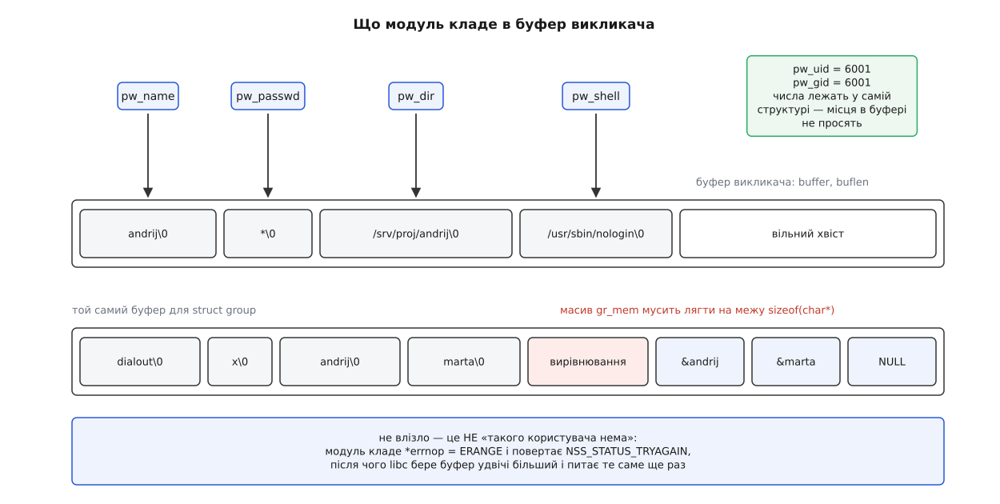

# ⚙️ Свій модуль NSS: спільний об'єкт, що відповідає замість `/etc/passwd`

Зберемо працездатний модуль — невеликий `.so`, після встановлення якого `ls -l`, `id`, `getent` і `sshd` починають знати імена з нашого джерела, хоча жодну з цих програм ніхто не перезбирав і не правив.

## Задача

Складальний парк заводить облікові записи сам: кожному проєктові дають UID із діапазону 6000–6999, а перелік лежить в одному файлі `/etc/demo-users` рядками `ім'я:uid:gid`. Файл цей не наш — його переписує система керування парком, коли проєкти з'являються й зникають.

Перша спокуса — вливати ці рядки в `/etc/passwd` скриптом за розкладом. Вона хибна відразу з трьох боків. Вливання створює **другий стан**, який тепер треба тримати узгодженим: кожен зниклий проєкт лишає по собі сміттєвий рядок, кожен збій скрипта — розбіжність. Пише воно у файл, який паралельно правлять `useradd` і пакетний менеджер, тож два записи можуть накластися. І воно неминуче запізнюється: між зміною в джерелі й появою рядка в `passwd` є вікно, у якому система впевнено показує неправду.

Копія не потрібна. Потрібна **відповідь на запит**: хай `/etc/demo-users` лишається єдиним джерелом, а система питає його тоді, коли їй справді треба назвати число.

## Контракт: два імені й один підпис

Розширюваність тримається на тому, що libc не має списку відомих джерел — вона має правило, як зі слова в налаштуванні зібрати два імені. У завантажувачі модулів glibc це буквально два форматні рядки:

```c
__asprintf (&shlib_name, "libnss_%s.so%s", module->name, __nss_shlib_revision);
__asprintf (&function_name, "_nss_%s_%s", module->name, nss_function_name_array[idx]);
```

Слово `demo` в рядку `passwd:` перетворюється на файл `libnss_demo.so.2`, який libc відкриває через [dlopen](book:unix-linux/dynamic-loader), і на символ `_nss_demo_getpwnam_r`, який вона там шукає. Більше ніякої реєстрації не існує: збіг імен — і є вся інтеграція. (`files` і `dns` у сучасних glibc — виняток: вони вбудовані в саму libc, і для них є окрема гілка без завантаження з диска.)

Лишається підпис функції. Він схожий на публічний `getpwnam_r`, але відрізняється двома важливими дрібницями. Немає вихідного аргументу «знайшли чи ні» — про це каже **повернений статус**. І помилка кладеться в `*errnop`, а не в `errno`: у статично злінкованій програмі застосунок і підвантажений модуль користуються **різними** копіями цієї змінної, тож `errno` модуля до викликача просто не дійде.

## Модуль

```c
/* nss_demo.c — джерело облікових записів із /etc/demo-users (ім'я:uid:gid) */
#include <nss.h>
#include <pwd.h>
#include <errno.h>
#include <stdio.h>
#include <string.h>

#define SOURCE "/etc/demo-users"

/* Копіює рядок у буфер викликача й посуває курсор. NULL — місця забракло. */
static char *pack(const char *s, char **cur, char *end)
{
    size_t n = strlen(s) + 1;
    if ((size_t)(end - *cur) < n)
        return NULL;
    char *dst = *cur;
    memcpy(dst, s, n);
    *cur += n;
    return dst;
}

static enum nss_status fill(struct passwd *pw, const char *name,
                            uid_t uid, gid_t gid,
                            char *buf, size_t buflen, int *errnop)
{
    char *cur = buf, *end = buf + buflen;
    char home[256];
    snprintf(home, sizeof home, "/srv/proj/%s", name);

    pw->pw_name   = pack(name, &cur, end);
    pw->pw_passwd = pack("*", &cur, end);      /* паролем сюди не заходять */
    pw->pw_gecos  = pack("", &cur, end);
    pw->pw_dir    = pack(home, &cur, end);
    pw->pw_shell  = pack("/usr/sbin/nologin", &cur, end);

    if (!pw->pw_name || !pw->pw_passwd || !pw->pw_gecos
        || !pw->pw_dir || !pw->pw_shell) {
        *errnop = ERANGE;                      /* буфер малий — і тільки це */
        return NSS_STATUS_TRYAGAIN;            /* покличуть ще раз, з більшим */
    }
    pw->pw_uid = uid;                          /* числа лежать у структурі */
    pw->pw_gid = gid;
    return NSS_STATUS_SUCCESS;
}

/* key_name != NULL — шукаємо за іменем, інакше за числом. */
static enum nss_status find(const char *key_name, uid_t key_uid,
                            struct passwd *pw,
                            char *buf, size_t buflen, int *errnop)
{
    FILE *f = fopen(SOURCE, "re");             /* 'e' — O_CLOEXEC, див. нижче */
    if (f == NULL) {
        *errnop = errno;
        return NSS_STATUS_UNAVAIL;             /* джерела тут нема взагалі */
    }

    char line[512];
    enum nss_status st = NSS_STATUS_NOTFOUND;
    while (fgets(line, sizeof line, f)) {
        if (!strchr(line, '\n') && !feof(f)) { /* рядок довший за буфер: */
            int c;                             /* відкинути хвіст цілком,  */
            while ((c = fgetc(f)) != '\n' && c != EOF) { }
            continue;                          /* інакше він стане записом */
        }
        char name[128];
        unsigned long uid, gid;
        if (sscanf(line, "%127[^:]:%lu:%lu", name, &uid, &gid) != 3)
            continue;                          /* коментарі й сміття — повз */
        int hit = key_name ? strcmp(name, key_name) == 0
                           : (uid_t)uid == key_uid;
        if (!hit)
            continue;
        st = fill(pw, name, (uid_t)uid, (gid_t)gid, buf, buflen, errnop);
        break;
    }
    fclose(f);
    if (st == NSS_STATUS_NOTFOUND)
        *errnop = ENOENT;
    return st;
}

enum nss_status _nss_demo_getpwnam_r(const char *name, struct passwd *pw,
                                     char *buf, size_t buflen, int *errnop)
{
    return find(name, 0, pw, buf, buflen, errnop);
}

enum nss_status _nss_demo_getpwuid_r(uid_t uid, struct passwd *pw,
                                     char *buf, size_t buflen, int *errnop)
{
    return find(NULL, uid, pw, buf, buflen, errnop);
}
```

Збірка й підключення — три кроки, і жоден із них не зачіпає програм:

```bash
cc -O2 -Wall -shared -fPIC -Wl,-soname,libnss_demo.so.2 \
   -o libnss_demo.so.2 nss_demo.c
sudo install -m 0644 libnss_demo.so.2 /usr/lib/x86_64-linux-gnu/
sudo ldconfig

printf 'builder:6001:6001\nrunner:6002:6002\n' | sudo tee /etc/demo-users
sudo sed -i 's/^passwd:.*/passwd:  files demo/' /etc/nsswitch.conf

getent passwd builder      # builder:*:6001:6001::/srv/proj/builder:/usr/sbin/nologin
id -nu 6002                # runner
```

Ім'я **файлу** тут важить більше за `SONAME`: libc відкриває саме `libnss_demo.so.2` за буквальним іменем, а `-Wl,-soname` потрібен, щоб `ldconfig` завів для бібліотеки правильний запис у кеші — [чому ім'я файлу й `SONAME` це різні речі](book:unix-linux/soname-versioning). Пробувати модуль на живій машині не обов'язково: тестова програма може перемкнути пошук лише для себе викликом `__nss_configure_lookup("passwd", "demo")` перед першим запитом.

## Буфер: пакування і єдиний сенс ERANGE

Уся структура, яку ми повертаємо, лежить у **чужій пам'яті**. Викликач дав `struct passwd` і шматок байтів; після повернення він має право звільнити буфер — і тоді всі вказівники в структурі мусять уже вести всередину нього, а не в нашу статичну змінну.



*Числа місця в буфері не просять; рядки копіюються поспіль; масив вказівників потребує ще й вирівнювання.*

Для `passwd` пакування зводиться до копіювання рядків підряд. А от `struct group` має поле `gr_mem` — масив `char *`, і він мусить лягти на адресу, кратну розміру вказівника, інакше на суворих архітектурах читання цього масиву дає збій:

```c
uintptr_t p = (uintptr_t)cur;
cur = (char *)((p + _Alignof(char *) - 1) & ~(uintptr_t)(_Alignof(char *) - 1));
if (cur + (n_members + 1) * sizeof(char *) > end) {
    *errnop = ERANGE;
    return NSS_STATUS_TRYAGAIN;
}
```

Тепер про `ERANGE`. Модуль може відповісти `NSS_STATUS_TRYAGAIN` із двох геть різних причин, і розрізняє їх саме код у `*errnop`. `EAGAIN` означає «джерело зараз зайняте, спитайте пізніше» — перемикач піде до наступного. `ERANGE` означає **тільки одне**: «буфер замалий». Побачивши цю пару, libc не йде до наступного джерела, а ставить те саме питання ще раз із більшим буфером: у класичному `getpwnam()` вона подвоює свій внутрішній буфер сама, а в `getpwnam_r()` віддає `ERANGE` нагору — і подвоює вже той, хто викликав. Тому `ERANGE` не можна повертати ні з чого іншого: він зарезервований, і будь-яке інше його вживання перетворить одну невдачу на нескінченне подвоєння буфера.

Решта відповідей у нашому коді розкладена так само буквально. Файлу нема — `UNAVAIL`: це не «користувача нема», це «джерела на цій машині нема», і питати треба далі. Файл є, рядка в ньому нема — `NOTFOUND`: маємо доказ відсутності.

## Симетрія відповідей і дешевий відсів

`getpwnam` і `getpwuid` — два питання про той самий запис, і модуль зобов'язаний відповідати на них однаково. Реалізували тільки пошук за іменем — дістали систему, у якій `id builder` працює бездоганно, а `ls -l /srv/proj` уперто показує 6001: власника файлу питають числом. Помилка підступна саме тим, що на помилку не схожа.

Друге, що варто зробити одразу, — відсіювати чужі числа до перегляду файлу. Наше джерело володіє діапазоном 6000–6999, і запит поза ним — гарантований `NOTFOUND`:

```c
if (key_name == NULL && (key_uid < 6000 || key_uid > 6999)) {
    *errnop = ENOENT;
    return NSS_STATUS_NOTFOUND;
}
```

При `passwd: files demo` до нас доходять лише ті запити, на які не відповіли локальні файли, — але таких у системі з чужими дисками й зниклими записами набирається чимало, і кожен із них інакше обійшовся б повним переглядом файлу.

Коли ж модуль не працює зовсім, дивляться три речі по черзі. Чи видно символ: `nm -D --defined-only libnss_demo.so.2 | grep _nss_` — зібрали з прихованою видимістю, і libc завантажить модуль, але функції не знайде, тобто бази для цього джерела просто не існуватиме. Чи знайдено файл: `LD_DEBUG=libs getent passwd builder` покаже спробу відкрити `libnss_demo.so.2` і шляхи, якими її шукали. Чи дійшло питання до джерела: `strace -e openat getent passwd builder` покаже, чи відкривали `/etc/demo-users` взагалі.

## Ви тепер живете в чужому процесі

Модуль виконується всередині кожної програми, яка колись спитала чиєсь ім'я, — зокрема в `sshd`, `cron` і будь-якому демоні. Звідси весь список заборон, і всі вони з одного кореня.

Нічого не друкувати: ваш `printf` виллється в середину виводу `ls` або в протокол демона. Нічого не завершувати: `exit()` чи `abort()` у модулі — це смерть чужого процесу на рівному місці. Ніякого змінного глобального стану без замка: вас покличуть із кількох потоків одночасно, і функція мусить бути [реентерабельною](book:programming/reentrancy). Дескриптори відкривати з `O_CLOEXEC` (той самий `e` у `fopen`) — інакше ваш файл потече в кожен `exec`, який процес зробить після пошуку. І ніколи не кликати `getpwnam()` чи `getaddrinfo()` зсередини модуля: перемикач опиниться всередині самого себе.

Модуль не перевіряє паролів — про це його ніхто й не питає. Автентифікація йде окремою дорогою, через [стек PAM](book:unix-linux/pam-stack); NSS лише називає.

Ще дві межі варто знати наперед. Статично злінкована програма все одно шукатиме ваш `.so` на диску в мить першого пошуку — і не факт, що знайде. А процес у [chroot](book:unix-linux/chroot) чи в мінімальному контейнері, куди модуль не поклали, побачить голі числа.

## Чого ми не написали і скільки це коштує

Ми не реалізували обхід бази — `setpwent`/`getpwent_r`/`endpwent`. Ціна відома: `getent passwd` без аргументів наших записів не покаже. Це чесний компроміс, бо обхід вимагає стану між викликами, а стан у чужому процесі — саме те, чого хочеться уникнути.

Вартість одного пошуку — відкриття файлу й перегляд до `n` рядків. Спокуса закешувати результат прямо в модулі велика й хибна: кеш опиниться в кожному процесі окремою копією, а скидати застарілі записи в усіх цих копіях буде нікому. Кеш у такій конструкції належить окремій службі, а не бібліотеці.

Це підводить до дешевшої альтернативи, про яку варто знати ще до того, як писати `.so`. systemd має [власний реєстр записів](book:unix-linux/userdb-varlink): служба виставляє сокет у `/run/systemd/userdb/`, відповідає на запити протоколом Varlink — або взагалі кладе статичний JSON у `/etc/userdb/`, — а вже наявний `libnss_systemd` опитує всіх, хто там є. Коду у вашому процесі при цьому не з'являється: помилка чужої служби обертається тайм-аутом на сокеті, а не збоєм усередині `sshd`.

Правило вибору з цього просте. Свій модуль NSS пишуть тоді, коли джерело мусить відповідати й без systemd, і без сокетів — на етапі раннього завантаження, у чужому контейнері, на системі, де вашої служби нема. В усіх інших випадках відповідь за сокетом обходиться дешевше.
