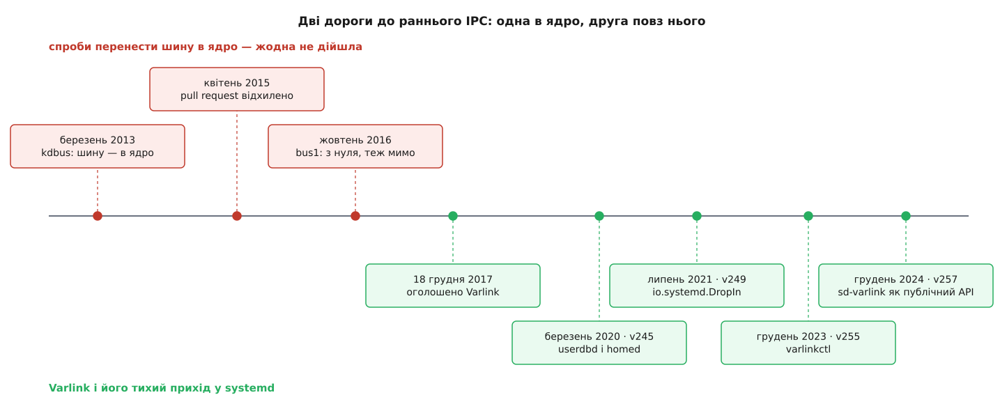

# 📜 Звідки взявся Varlink: чотири роки в ядро і розворот на порозі

Varlink народився не з бажання зробити кращий [D-Bus](topic:unix-linux/dbus), а з чотирьох років невдач: двічі шину намагалися внести всередину ядра Linux, і двічі спільнота ядра сказала «ні». Коли стало ясно, що дорога закрита, троє інженерів Red Hat переформулювали задачу — і виявилося, що болю було два, а лагодили весь час не той.

## Два різні болі, які довго вважали одним

Скарг на шину повідомлень було рівно дві, і вони про різне.

Перша — **швидкість**. Кожне повідомлення на D-Bus іде через демон-посередник: відправник пише в сокет демонові, демон розбирає, звіряє політику, пише одержувачеві. Два переходи замість одного, зайве копіювання, зайве перемикання контексту. Для потоку дрібних повідомлень — скажімо, тисяч сповіщень від системи керування живленням — це відчутно.

Друга — **доступність**. Демон шини — звичайна програма: щоб він запрацював, мають бути змонтовані файлові системи, має існувати його сокет, має бути прочитана політика. Усе це буває пізно. В initramfs шини ще немає; у PID 1 у першу мить її ще немає; під час вимкнення її вже немає. Гаральд Гоєр (Harald Hoyer) у грудні 2017-го описав, як із цим жили насправді: ранні демони робили запасний канал «через сокет домену Unix зі своїм саморобним протоколом» — кожен свій.

Обидві скарги з десяти кроків приводили до одного винуватця — посередника. Тому й ліки шукали одні: **прибрати посередника, перенісши шину в ядро**. Ядро вміє передавати повідомлення без зайвого копіювання, ядро працює з першої секунди — здавалося, одним ходом закриються обидві діри.

*Ліворуч від розвороту — те, що ядро відхилило; праворуч — те, що зробили повз ядро.*

## kdbus: чотири роки й один pull request

Задум оприлюднив Леннарт Поттерінг (Lennart Poettering) 20 березня 2013 року листом у розсилку systemd-devel — під заголовком, що прямо називав дві частини плану: нову бібліотеку шини й `kdbus`, шину в ядрі. У січні 2014-го Джонатан Корбет (Jonathan Corbet) розібрав задум у LWN, а 13 квітня 2015 року Ґреґ Кроа-Гартман (Greg Kroah-Hartman) надіслав pull request на ядро 4.1. *(Дати підтверджені первинними джерелами: архів розсилки, статті LWN, лист pull request.)*

Прийняття не сталося — і зачепилося не за швидкість. Найгостріше заперечення стосувалося того, **як kdbus передає відомості про повноваження того, хто надіслав повідомлення**. Енді Лутомирський (Andy Lutomirski) наполягав, що набір повноважень (capabilities) — величина, яку тлумачить ядро й тільки ядро; віддавати її в простір користувача, щоб там за нею ухвалювали рішення, означає зламати поділ рівнів. Ерік Бідерман (Eric Biederman) додав те, що це руйнує в просторах імен користувачів: процес, який туди зайшов, виглядає власником усіх повноважень одразу, і перевірка втрачає сенс. Латка, що прибирала передачу повноважень через межу простору імен, розв'язувала одне й ламала інше — впізнавання того, хто питає, у контейнерах.

22 квітня 2015 року Корбет підбив підсумок статтею з назвою-вироком — *The kdbuswreck*, «kdbus-аварія». Лінус Торвальдс у суперечці майже не брав участі й обмовився, що тривоги навколо повноважень його не надто турбують; вирішили не він і не одна людина — вирішила відсутність згоди. У 4.1 не пішло нічого.

## bus1: зробити з нуля — і теж не дійти

Другу спробу почали, коли стало ясно, що першу не врятувати. У жовтні 2016-го Давід Германн (David Herrmann) виклав на огляд `bus1` — не покращений kdbus, а систему з нуля, ближчу до Android Binder і Cap'n Proto, ніж до D-Bus: передача повідомлень за принципом можливостей (capability-based), де право надіслати повідомлення — це переданий об'єкт, а не перевірка за списком. Автор одразу наголосив, що це запит на відгук, а не заявка на внесення.

Відгук був, внесення не було. Гоєр підбив цю спробу різко й точно: bus1 «виявився надміру складним і був просто транспортом без протоколу». Останнє важить більше, ніж здається. Транспорт — це «як донести байти»; протокол — це «як домовитися про сенс»: які є методи, які в них поля, що повертається, як виглядає помилка. Ядро транспорт дати могло; домовленості про сенс воно давати не хоче й не мусить.

## Розворот: 18 грудня 2017

Того дня Гоєр опублікував допис, який оголосив Varlink. Значну частину роботи він приписав Ларсу Карліцькі (Lars Karlitski) й Каю Сіверсу (Kay Sievers); усі троє тоді були пов'язані з Red Hat — тобто це ті самі люди й те саме коло, що чотири роки штовхали шину в ядро.

Перевернули саме питання. Замість «як зробити шину швидшою» спитали «що потрібне для IPC, доступного від найпершої миті завантаження» — і відповідь вийшла напрочуд малою: **точка-в-точку через сокет, повідомлення — об'єкт JSON**. Ні демона, ні реєстрації імен, ні політики, ні спільної шини. Швидкість при цьому свідомо принесли в жертву простоті й читності: протокол такий, що прив'язку до нової мови пишуть за вечір, а не витрачають «більше часу на код IPC, ніж на власне задачу».

Гоєр додав і велику мрію: якщо Varlink приживеться, набір інтерфейсів міг би скластися у спільний системний API для Linux — замість `ioctl()`, `procfs`, `sysfs`, розсипу IPC-механізмів.

## Реакція: розбір у LWN і холодний душ

3 січня 2018 року Джейк Едж (Jake Edge) розібрав Varlink у LWN. Стаття й коментарі під нею склали список зауважень, який лишається на диво доречним:

- **Чому текст, а не двійковий формат?** JSON неоднозначний у типах і числах; MessagePack чи XDR дали б і компактність, і чіткість.
- **Де передача файлових дескрипторів?** Це те, заради чого IPC у Unix часто й потрібен, а в первісній специфікації її не було.
- **Де автентифікація, ідентичність, посвідчення?** Питання виявилося пророчим навпаки: саме зв'язка «точка-в-точку + сокет домену Unix» пізніше дала відповідь простішу за будь-який протокол автентифікації — ядро само засвідчує UID того, хто під'єднався.
- **Чому просто не запустити D-Bus раніше або не полагодити його?**
- І неминуче: «JSON — це, схоже, новий XML», плюс жарт про черговий стандарт поверх п'ятнадцяти наявних.

Едж підсумував тверезо: обсяг переробок, щоб Varlink був «усюди», величезний, а користь від цього не очевидна.

## Дві історії застосування — коротка і довга

Перше помітне застосування поза systemd — Podman. Його раннє API було саме варлінковим, з інтерфейсом `io.podman`; існували навіть готові прив'язки для Python. Довго це не прожило: з виходом Podman 2.0 (літо 2020) варлінкове API оголосили застарілим на користь REST-API, сумісного з Docker, а в Podman 3.0 (лютий 2021) прибрали зовсім. Причина не в протоколі, а в екосистемі: інструменти навколо контейнерів говорили HTTP, і бути єдиним, хто говорить інакше, коштувало дорожче за виграш.

Друга історія тиха й довга. У випуску systemd 245 (березень 2020) з'явилися `systemd-userdbd` і `systemd-homed` — і саме там Varlink дістав те, задля чого його придумували: доступність від найранішого завантаження. Далі, крок за кроком: у 249 (липень 2021) — служба `io.systemd.DropIn`, що підбирає записи користувачів із тек-довантажень; у 255 (грудень 2023) — інструмент `varlinkctl`, яким уперше стало можливо просто подивитися й покликати службу з командного рядка, плюс самоопис для всіх таких служб (позначений як експериментальний); у 257 (грудень 2024) — реалізацію винесли в `libsystemd` під іменем `sd-varlink`, тобто зробили публічним API. *(Версії й місяці звірені за NEWS systemd і оголошеннями випусків.)*

## Що з цього виходить

Найцікавіше сталося збоку. Ті самі люди, що робили kdbus і bus1, зрештою розв'язали й перший біль — швидкість — але теж повз ядро: написали `dbus-broker`, замінник демона шини в просторі користувача, який виявився значно швидшим за старий, не змінюючи ні протоколу, ні жодної програми.

Тобто два болі, які чотири роки лікували одним ліком, вилікували двома різними — і жоден із них не був «шиною в ядрі». Швидкість виявилася питанням якості реалізації посередника. Доступність виявилася питанням того, чи взагалі є посередник, — і єдиною чесною відповіддю на неї було його не мати.
