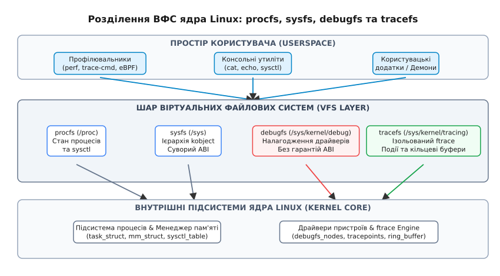
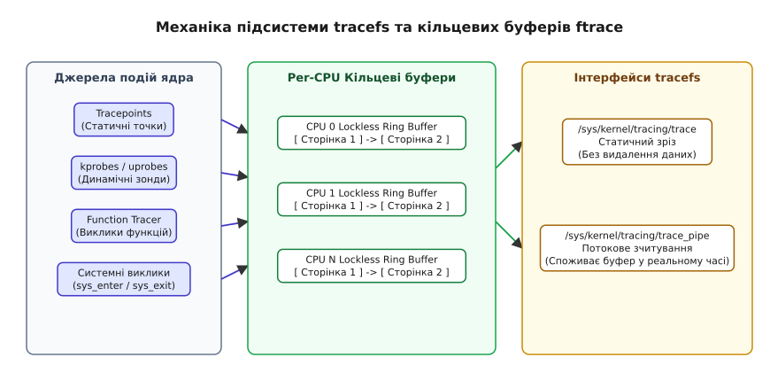

# Налагодові ВФС: debugfs та tracefs

<preknowlist>
- [Віртуальна файлова система procfs](topic:unix-linux/proc-filesystem) — псевдофайлова система /proc та відображення внутрішнього стану процесів.
- [Об'єкти та атрибути sysfs](topic:unix-linux/sysfs-device-model) — ієрархія kobjects, пристроїв та суворі обмеження на опис атрибутів.
</preknowlist>

Під час розробки або глибокого налагодження драйвера периферійного пристрою в ядрі Linux інженер стикається з необхідністю вивантажити багатокілобайтний дамп внутрішніх регістрів, таблиць DMA та лічильників блокувань. Спроба експортувати ці дані через `sysfs` негайно виявляє архітектурне обмеження **«один атрибут — одне значення»** (one value per file), порушення якого блокується рецензентами ядра, а використання `procfs` призводить до некоординованого захаращення простору назв процесів. Саме для задач внутрішнього аналізу ядра без обмежень на формат виводу та без зобов'язань щодо стабільності ABI розроблено спеціалізовані псевдофайлові системи `debugfs` та `tracefs`.

---

## 1. Архітектурна мотивація та еволюція налагодових ВФС

Операційна система Linux спирається на шар віртуальної файлової системи (VFS), який експортує ресурси ядра у вигляді файлового дерева. VFS надає універсальний абстрактний інтерфейс, завдяки якому системні виклики POSIX (`open`, `read`, `write`, `close`, `lseek`) застосовуються як до фізичних дискових файлових систем (ext4, btrfs), так і до віртуальних псевдофайлових систем, які існують виключно в оперативній пам'яті (RAM).

Проте різні класи системної інформації вимагають кардинально відмінних стратегій керування їхньою структурою, доступом та гарантіями стабільності.

### Обмеження procfs та суворість sysfs

Історично першою псевдофайловою системою в ядрі Linux була `procfs` (/proc). Вона розроблялася для відображення метаданих процесів (структур `task_struct` та `mm_struct`), але через відсутність у ранніх версіях ядра інших механізмів експорту даних розробники периферійних драйверів почали створювати власні довільні каталоги у корені `/proc` — із власним форматом виводу, без стандартизованих масок доступу і без будь-якої координації простору назв.

Для наведення порядку у ядрі Linux 2.6 було впроваджено файлову систему `sysfs` (/sys). Вона зафіксувала сувору ієрархію об'єктів пристроїв (`kobject`), шин (PCI, USB, I2C) та відповідних драйверів. Для збереження чистоти системного адміністрування у `sysfs` було встановлено три жорсткі правила:
1. **Суворий зв'язок з ABI ядра:** кожен атрибут у `/sys` стає частиною задокументованого інтерфейсу розробки (Application Binary Interface). Його зміна або видалення вимагає тривалого оголошення застарілим (deprecation cycle), що розтягується на декілька років.
2. **Правило «один атрибут — одне значення»:** файл у `sysfs` зобов'язаний містити лише одне елементарне рядкове або числове значення (наприклад, стан живлення пристрою `1`/`0` або температуру датчика).
3. **Обмеження розміру сторінки:** вивід будь-якого атрибута у `sysfs` суворо обмежений розміром однієї системної сторінки пам'яті `PAGE_SIZE` (зазвичай 4096 байтів).

Ці обмеження виявилися ідеальними для конфігурування системи демонами `udev` та `systemd`, але вони повністю знерухомили розробників драйверів. Налагодження нового контролера накопичувача або мережевого адаптера 100GbE вимагає вивантаження багатосторінкових таблиць дескрипторів DMA, кільцевих черг пакетів та лічильників апаратних помилок. Спроба розділити 64-кілобайтний дамп регістрів на тисячі окремих файлів `sysfs` з дотриманням вимог ABI була розцінена спільнотою ядра як неприпустима.

### Створення debugfs та відокремлення tracefs

Для вирішення цієї кризи Ґреґ Кроа-Гартман (Greg Kroah-Hartman) опублікував у грудні 2004 року патч спеціалізованої ВФС **debugfs**; у мейнлайн вона потрапила в 2.6.11 (березень 2005) з точкою монтування `/sys/kernel/debug`. Її три засади прямо протилежні засадам `sysfs`:
- Повна відсутність зобов'язань щодо ABI (NO_ABI): розробник може змінювати формати, перейменовувати або видаляти вузли у будь-якому релізі ядра.
- Відсутність обмежень на формат виводу: дозволено багаторядкові текстові звіти, довільні двійкові блоби та дампи пам'яті.
- Гранична простота API: реєстрація скалярної змінної ядра виконується одним рядком коду.

Підсистема трасування **ftrace** (Function Tracer), що влилася в ядро 2.6.27, власної ВФС не мала, тож усі її керувальні файли розмістили всередині `debugfs` за шляхом `/sys/kernel/debug/tracing`. Так в одному піддереві опинилися дві речі з геть різною ціною помилки: вузли драйверів із прямим доступом до фізичної пам'яті та регістрів обладнання — і трасування, потрібне на виробничих серверах. А оскільки корінь `debugfs` ядро створює з правами `0700` (константа `DEBUGFS_DEFAULT_MODE`), пустити когось до трасування означало пустити його й до всього іншого.

У ядрі Linux 4.1 (червень 2015 року) Стівен Ростедт (Steven Rostedt) виокремив підсистему трасування у незалежну ВФС **tracefs** із точкою монтування `/sys/kernel/tracing` — відтоді права на трасування роздають окремо від решти `debugfs`.

Хронологію патчів, імена учасників і безпекове тло цього розділення розібрано у вставці [Історія виокремлення debugfs та tracefs](topic:unix-linux/debugfs-tracefs-kernel-debugging-interfaces/hist-debugfs-tracefs-evolution.md).


*Архітектурне розділення ВФС ядра Linux: procfs для процесів, sysfs для ієрархії пристроїв із гарантіями ABI, debugfs для сирого налагодження драйверів та tracefs для підсистеми ftrace.*

---

## 2. debugfs — внутрішня архітектура, API та безпека

Файлова система `debugfs` існує виключно в оперативній пам'яті (RAM) і реєструється в ядрі як псевдофайлова система з магічним числом суперблока `DEBUGFS_MAGIC` (`0x64626720`). Вона монтується за допомогою стандартної команди системного адміністрування:

```bash
# Монтування debugfs вручну
$ mount -t debugfs none /sys/kernel/debug
```

У більшості сучасних дистрибутивів Linux `debugfs` монтується автоматично під час ініціалізації системи засобами `systemd` з правами доступу `0700` (дозволено лише для користувача `root`).

### C API ядра Linux для створення вузлів debugfs

Для використання `debugfs` у модулі ядра необхідно підключити заголовок `<linux/debugfs.h>`. Ядро надає набір функцій для швидкого експорту змінних базових типів або створення власних операцій читання/запису.

Для експорту скалярних змінних використовуються спеціалізовані обгортки:
- `debugfs_create_u8()`, `debugfs_create_u16()`, `debugfs_create_u32()`, `debugfs_create_u64()` — експорт цілих чисел різної розрядності.
- `debugfs_create_bool()` — експорт прапорців типу `bool` (відображаються як `Y`/`N` при зчитуванні та записі).
- `debugfs_create_atomic_t()` — експорт атомарних лічильників ядра `atomic_t`.
- `debugfs_create_blob()` — експорт неструктурованого бінарного масиву пам'яті через структуру `struct debugfs_blob_wrapper`.

Скалярні обгортки нічого не повертають: у ядрах 5.5–5.14 їх по одній перевели на `void`, бо драйвер однаково мусить працювати й тоді, коли `debugfs` вимкнено, — отже перевіряти там нічого. `struct dentry *` і далі віддають лише `debugfs_create_dir()`, `debugfs_create_file()` та `debugfs_create_blob()`; у ядрах до цієї серії вказівник повертали всі.

Приклад створення каталогу та експорту 32-бітного числа в ядрі Linux:

```c
struct dentry *my_debug_dir;
u32 error_counter = 0;

/* Створення каталогу /sys/kernel/debug/my_driver */
my_debug_dir = debugfs_create_dir("my_driver", NULL);

/* Створення файлу /sys/kernel/debug/my_driver/error_count */
debugfs_create_u32("error_count", 0644, my_debug_dir, &error_counter);
```

Якщо драйвер повинен експортувати складний звіт або форматований текст, обсяг якого перевищує розмір однієї сторінки пам'яті (на x86_64 — 4 КіБ), застосовується механізм **seq_file**. У цьому випадку файл створюється викликом `debugfs_create_file()`, якому передають власну структуру `struct file_operations`: у ній `.read` — це готовий `seq_read`, а `.open` — своя функція, що викликає `single_open()` із вказівником на функцію показу. Механізм `seq_file` розбиває формування великого текстового звіту на послідовні кроки і здійснює авто-масштабування внутрішніх буферів ядра, запобігаючи витокам пам'яті та ручному обчисленню зміщень.

### Внутрішні структури VFS та захист від зникнення вузла

Кожен елемент у `debugfs` представлений у ядрі об'єктом `struct dentry` та відповідним `struct inode`. Коли користувацька програма відкриває файл у `/sys/kernel/debug`, VFS зв'язує операції файлу з таблицею `struct file_operations`, наданою драйвером.

Критичною проблемою при розробці драйверів є синхронізація вивантаження модуля. Якщо користувацький процес виконує системний виклик `read()` на файлі `debugfs`, а адміністратор у цей самий момент вивантажує модуль ядра командою `rmmod`, ядро може вивільнити пам'ять, у якій розташовано функції обробника. Це призводить до критичного збою типу Use-After-Free.

Щоб цього не сталося, `debugfs` не пускає системний виклик прямо в обробник драйвера, а ставить перед ним власний проксі-шар:
1. Перед кожним читанням чи записом ядро викликає `debugfs_file_get()` — той бере посилання на службову структуру вузла `struct debugfs_fsdata` (лічильник `active_users`).
2. Якщо вузол уже позначено як вилучений, `debugfs_file_get()` повертає `-EIO`, і обробник драйвера не викликається взагалі.
3. `debugfs_remove()` спершу помічає вузол та все, що під ним, як вилучене, а потім чекає, доки лічильник не впаде до нуля, — тобто доки з обробників не вийдуть ті виклики, що вже всередині.

Внутрішня реалізація цього очікування змінювалася: у ядрах 4.7–4.14 воно спиралося на SRCU (`synchronize_srcu()`), а від 4.15 його замінили на лічильник посилань із `completion`. Для драйвера видима поведінка та сама, тож старіші описи з `synchronize_srcu()` помиляються лише в назві механізму, не в суті.

У високопродуктивних драйверах розробники іноді використовують виклик `debugfs_create_file_unsafe()`, який цей проксі-шар обходить задля економії тактів процесора, проте тоді драйвер сам відповідає за те, щоб файл не зник з-під обробника.

Практичний приклад розробки модуля ядра з вузлами `debugfs` та утиліти зчитування наведено у вставці [Розробка драйвера з інтерфейсом debugfs та зчитування tracefs](topic:unix-linux/debugfs-tracefs-kernel-debugging-interfaces/proj-kernel-debugfs-module.md).

### Модель безпеки та режим Kernel Lockdown

Оскільки `debugfs` призначена для довільного налагодження, вона містить файли, які дозволяють читати та перезаписувати довільні ділянки фізичної пам'яті ядра, реєстри DMA-контролерів або конфігурацію переривань. За наявності уразливостей у драйверах `debugfs` може слугувати вектором для підвищення привілеїв та обходу захисту ядра.

У ядрі Linux впроваджено підсистему захисту **Kernel Lockdown** (від англ. *lockdown* — сувора ізоляція); за конфігурації `CONFIG_LOCK_DOWN_IN_EFI_SECUREBOOT` вона вмикається сама, коли систему завантажено з UEFI Secure Boot. Рівнів два, і другий містить перший; поточний видно у `/sys/kernel/security/lockdown`:
- Рівень `integrity` забороняє все, чим можна змінити стан працюючого ядра, — і саме сюди належить обмеження `debugfs` (причина `LOCKDOWN_DEBUGFS`). Відкрити вдається лише файл із правами не ширшими за `0444`, відкритий на читання і без обробників `ioctl` та `mmap`; будь-який інший вузол `debugfs` дістає `-EPERM` навіть для `root`.
- Рівень `confidentiality` додатково забороняє все, чим можна вичитати пам'ять ядра: `LOCKDOWN_KCORE`, `LOCKDOWN_KPROBES`, `LOCKDOWN_PERF` — і `LOCKDOWN_TRACEFS`, тобто на цьому рівні закривається вже й `tracefs`.

Окрім того, збирач ядра обирає типову поведінку `debugfs` взаємовиключними опціями конфігурації: `CONFIG_DEBUG_FS_ALLOW_ALL` (доступ дозволено — звичайний стан) та `CONFIG_DEBUG_FS_ALLOW_NONE` (доступу немає зовсім: ВФС не реєструється, а спроби драйверів створити вузли відхиляються з помилкою). Готове ядро перемикається параметром завантаження `debugfs=on|off`. У ядрах 5.9–6.14 між цими двома був іще проміжний `CONFIG_DEBUG_FS_DISALLOW_MOUNT` — API працює, але змонтувати `/sys/kernel/debug` не можна; від 6.15 його прибрали, а стару форму `debugfs=no-mount` лишили як застарілий синонім `debugfs=off`.

---

## 3. tracefs — архітектура трасування та кільцеві буфери ftrace

Віртуальна файлова система **tracefs** надає користувацький інтерфейс до підсистеми `ftrace` (Function Tracer) — потужного інструменту аналізу продуктивності та трасування подій ядра в режимі реального часу.

Офіційною точкою монтування `tracefs` є каталог `/sys/kernel/tracing`:

```bash
# Монтування tracefs
$ mount -t tracefs nodev /sys/kernel/tracing
```

Для зворотної сумісності зі старими скриптами ядро, щойно змонтовано `debugfs`, автоматично підмонтовує ту саму `tracefs` ще й у каталог `/sys/kernel/debug/tracing`. Це саме автомонтування (`d_automount`), а не монтування-прив'язка: у старому місці з'являється окремий екземпляр монтування тієї ж файлової системи. Від ядра 6.17 поведінку оголошено застарілою — при першому зверненні до старого шляху в журнал іде попередження про вилучення у 2030 році, а прибрати автомонтування можна конфігурацією `CONFIG_TRACEFS_AUTOMOUNT_DEPRECATED=n`.

### Принцип динамічної модифікації коду ftrace

Однією з найвизначніших особливостей підсистеми `ftrace`, керованої через `tracefs`, є використання динамічного патчингу інструкцій ядра (dynamic code patching).

Ядро з підтримкою ftrace збирається з інструментувальними прапорцями компілятора, і виглядають вони по-різному на різних архітектурах. На x86_64 це `-pg -mfentry`: GCC або Clang ставить на початку кожної придатної до трасування функції п'ятибайтовий виклик `call __fentry__` (історично, до появи `-mfentry`, — `call mcount` уже після прологу). На ARM64 це `-fpatchable-function-entry=2`: жодного виклику компілятор не генерує, а лишає перед тілом функції дві чотирибайтові порожні інструкції — місце, куди ядро згодом впише перехід. Адреси всіх таких точок збирає в окрему секцію `__mcount_loc` або сам компілятор (`-mrecord-mcount`), або скрипт `recordmcount` під час збирання.

Під час завантаження ядра підсистема ftrace обходить список `__mcount_loc` і затирає кожну таку точку порожньою інструкцією `NOP` (No Operation) — на x86_64 однією п'ятибайтовою. Саме тому у вимкненому стані ftrace коштує **практично нічого**: на вході у функцію лишається порожня інструкція, а не виклик із збереженням регістрів.

Коли користувач вмикає трасування через `tracefs` (наприклад, `echo function > /sys/kernel/tracing/current_tracer`):
1. Ядро переходить у режим гарячого патчингу інструкцій за допомогою викликів `ftrace_replace_code()`.
2. `NOP` у вибраних функціях атомарно замінюються назад на перехід у трасувальник (на x86_64 — `call ftrace_caller`).
3. Виклик спрямовує виконання в обробник, який зчитує лічильники та записує параметри події у кільцевий буфер.

### Спеціалізовані трасувальники затримок (Latency Tracers)

Окрім загального трасування функцій, `tracefs` дозволяє вмикати спеціалізовані трасувальники для пошуку системних затримок реального часу:
- **irqsoff** — вимірює тривалість проміжків часу, протягом яких процесор працює з вимкненими апаратними перериваннями.
- **preemptoff** — вимірює проміжки часу, коли в ядрі заборонено витиснення задач (preemption disabled).
- **wakeup / wakeup_rt** — вимірює затримку між моментом розбудження високопріоритетного процесу реального часу та миттю, коли він реально отримує процесорний час.

### Структура керувальних файлів tracefs

Всередині `/sys/kernel/tracing` розміщено текстові файли, за допомогою яких адміністратор або розробник конфігурує трасування шляхом звичайного запису рядків (наприклад, через `echo`).

Основні елементи керування `tracefs`:
1. **available_tracers** — файл лише для читання з переліком трасувальників, які підтримує саме це ядро (`function_graph`, `function`, `blk`, `mmiotrace`, `nop` тощо).
2. **current_tracer** — активний трасувальник; запис імені з попереднього переліку перемикає режим, запис `nop` вимикає.
3. **tracing_on** — глобальний бінарний перемикач (1 або 0). Дозволяє миттєво призупиняти або відновлювати запис подій у буфер без скидання накопиченої інформації.
4. **set_ftrace_filter** — фільтр функцій із підтримкою шаблонів: звужує трасування до однієї підсистеми, замість тягнути через буфер усе ядро.
5. **set_ftrace_pid** — фільтрація трасування за ідентифікатором процесу (PID).
6. **buffer_size_kb** — обсяг кільцевого буфера в кілобайтах, і саме **на кожне** процесорне ядро окремо, а не на всю систему.

Детальний довідник усіх параметрів керування та C API наведено у вставці [Специфікація API debugfs та файлів керування tracefs](topic:unix-linux/debugfs-tracefs-kernel-debugging-interfaces/api-debugfs-tracefs-control.md).

### Два способи читання: trace проти trace_pipe

Зчитування накопичених подій трасування з `tracefs` здійснюється через два принципово різних файли:

- **/sys/kernel/tracing/trace**
  Надає статичний зріз (snapshot) кільцевого буфера. Читання цього файлу не видаляє дані з буфера. Для очищення накопичених даних достатньо перезаписати файл порожнім рядком: `echo > /sys/kernel/tracing/trace`.
- **/sys/kernel/tracing/trace_pipe**
  Надає потоковий інтерфейс зчитування в режимі реального часу. Читання з `trace_pipe` є **деструктивним та блокуючим**: спожитий рядок події видаляється з буфера ядра, а процес спостерігача блокується до появи нових подій ядра.


*Механіка підсистеми tracefs: атомарний запис із джерел подій у per-CPU кільцеві буфери ядра та зчитування через статичний файл trace або потоковий trace_pipe.*

### Архітектура безблокувальних per-CPU кільцевих буферів

Висока продуктивність подій у `tracefs` досягається завдяки використанню **безблокувальних per-CPU кільцевих буферів** ftrace.

Кожне процесорне ядро (CPU core) має власний виділений кільцевий буфер в оперативній пам'яті, який складається з кільцевого списку підбуферів розміром у сторінку пам'яті (на x86_64 — 4 КіБ). Коли точка трасування (tracepoint) або перехоплювач (kprobe) спрацьовує всередині контексту переривання чи виклику функції ядра:
1. Подія записується у буфер поточного CPU без захоплення глобального спін-локу (spin-lock).
2. Запис виконується атомарними інструкціями порівняння з обміном `cmpxchg()`, що гарантує відсутність взаємних блокувань (deadlocks) навіть при виклику трасувальника з обробника апаратного переривання (IRQ context).
3. При зчитуванні через `/sys/kernel/tracing/trace` ядро зливає події з per-CPU буферів, впорядковуючи їх за апаратними часовими мітками (timestamps).

Моніторинг стану кільцевих буферів здійснюється через файли статистики у каталозі `/sys/kernel/tracing/per_cpu/cpuX/stats`. Поле `overrun` рахує події, втрачені через переповнення буфера — у типовому режимі перезапису їх затерли новіші, — а `commit overrun` відстежує окремий випадок: переповнення сталося під час вкладеного переривання, коли запис попередньої події ще не був завершений.

### Трасувальні точки (tracepoints) та динамічні зонди (kprobes/uprobes)

У каталозі `/sys/kernel/tracing/events/` розміщено статичні точки трасування, вбудовані в код ядра розробниками. Вони згруповані за підсистемами (`sched`, `kmem`, `net`, `syscalls`).

Кожна подія має власні керувальні файли:
- `events/sched/sched_switch/enable` — запис `1` вмикає відстеження перемикання контексту процесів.
- `events/sched/sched_switch/filter` — дозволяє задавати текстові фільтри (наприклад: `prev_comm == "nginx"`).
- `events/sched/sched_switch/format` — описує структуру бінарного запису події для розшифровки інструментами простору користувача.

Окрім статичних точок, `tracefs` дозволяє динамічно створювати нові точки перехоплення без перекомпіляції ядра:
- **kprobes** — запис у `/sys/kernel/tracing/kprobe_events` встановлює зонд на будь-яку внутрішню інструкцію ядра за допомогою заміни інструкції на точку зупинки (breakpoint `int 3` на x86_64 або `brk` на ARM64).
- **uprobes** — запис у `/sys/kernel/tracing/uprobe_events` встановлює зонд на виконуваний код або бібліотеку простору користувача (наприклад, на виклики у `libc.so`).

---

## 4. Порівняльний аналіз та інтеграція з інструментами простору користувача

Для вибору оптимального віртуального інтерфейсу під час розробки або експлуатації Linux необхідно чітко розуміти призначення кожної з чотирьох основних ВФС.

| Критерій порівняння | procfs (/proc) | sysfs (/sys) | debugfs (/sys/kernel/debug) | tracefs (/sys/kernel/tracing) |
| :--- | :--- | :--- | :--- | :--- |
| **Головне призначення** | Інформація про процеси та глобальні параметри ядра | Ієрархічний опис об'єктів пристроїв та драйверів | Довільне налагодження драйверів та експорт внутрішнього стану | Управління трасуванням ядра, ftrace та подій |
| **Гарантії ABI** | Високі для процесів, низькі для застарілих вузлів | Надзвичайно суворі (будь-яка зміна потребує deprecation cycle) | Відсутні (NO_ABI, зміна формату в будь-якому релізі) | Формально не обіцяні, на практиці бережені: зміну, що ламає `perf` чи `trace-cmd`, зазвичай відкочують |
| **Обмеження формату** | Текстовий вивід, історично некоординований | Суворе правило «один атрибут — одне значення» | Без обмежень (текст, бінарні дампи, seq_file) | Текстовий інтерфейс керування, кільцевий буфер подій |
| **Права доступу** | Частково відкрита для звичайних користувачів | Відкрита для читання користувачам | Тільки `root` (обмежується Kernel Lockdown) | Гнучке налаштування прав доступу та груп |
| **Типові споживачі** | `ps`, `top`, `free`, `sysctl` | `udev`, `lspci`, `lshw`, `systemd` | Розробники драйверів, gdb, спеціалізовані утиліти | `perf`, `trace-cmd`, `bpftrace`, `eBPF` |

### Практична взаємодія через високорівневий інструментарій

Хоча взаємодія з `tracefs` може здійснюватися безпосередньо через маніпуляції файлами за допомогою `echo` та `cat`, на практиці для аналізу продуктивності використовують високорівневі інструменти. Спираються вони на `tracefs` по-різному — від повної обгортки до самого лише читання переліку подій:

- **trace-cmd**
  Консольна утиліта, яка виступає фронтендом до `tracefs`. Команда `trace-cmd record -e sched_switch` автоматично активує відповідний `enable` прапорець у `tracefs`, зчитує бінарний потік з per-CPU буферів та зберігає його у файл `trace.dat` для наступного аналізу командою `trace-cmd report`.
- **perf**
  Системний профілювальник Linux бере з ієрархії `/sys/kernel/tracing/events/` перелік доступних tracepoint-подій та їхні числові ідентифікатори, а вже саме вимірювання відкриває власним системним викликом `perf_event_open()` — ним же він читає й апаратні лічильники PMU, до яких `tracefs` стосунку не має.
- **eBPF (Extended Berkeley Packet Filter)**
  Сучасні eBPF-програми приєднуються до тих самих статичних tracepoints і динамічних kprobes/uprobes. Розкладку полів події вони, на відміну від `perf` і `trace-cmd`, беруть не з файлів `format`, а з BTF-опису ядра (`/sys/kernel/btf/vmlinux`) — саме на ньому тримається CO-RE (Compile Once – Run Everywhere), здатність однієї скомпільованої програми працювати на ядрах різних версій.

Завдяки розділенню ВФС ядро Linux забезпечує суворий баланс між стабільністю адміністрування у `sysfs`, гнучкістю розробки у `debugfs` та високоефективною аналітикою продуктивності у `tracefs`.
