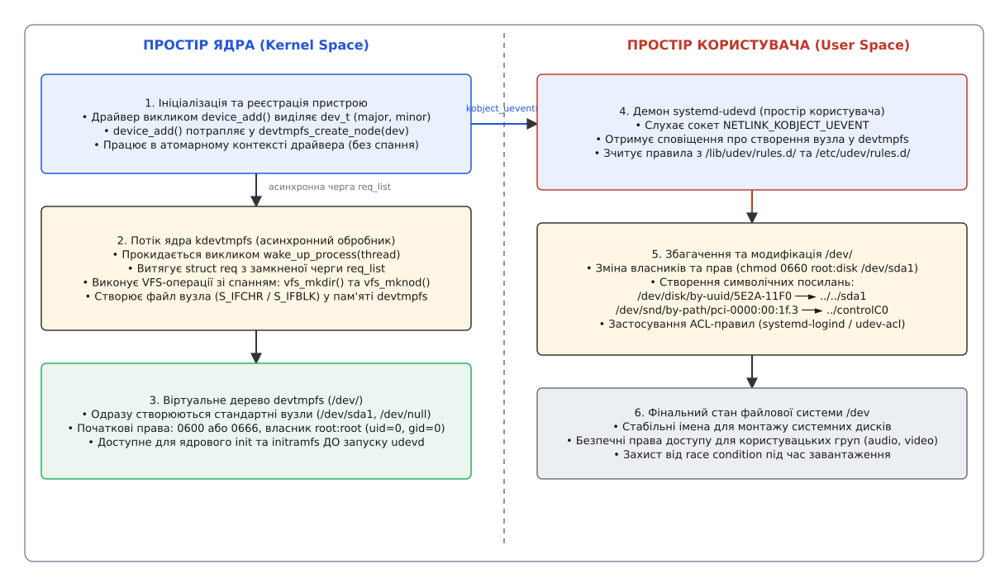
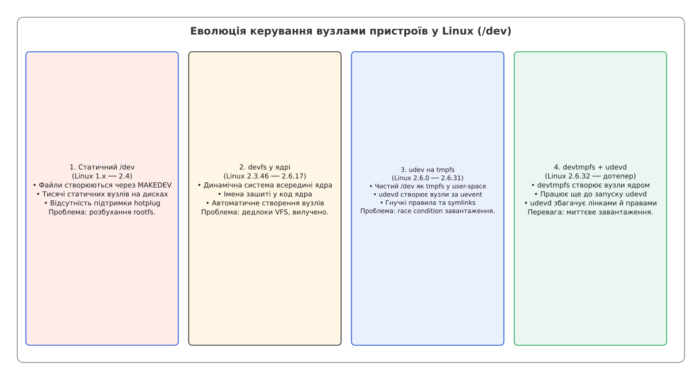

# Автоматичне монтування вузлів пристроїв у devtmpfs

<preknowlist>
- [Модель файлів пристроїв та мажорні/мінорні номери](book:unix-linux/device-file-model) — роль файлів пристроїв у `/dev` та зв'язок з драйверами.
- [Ранній етап завантаження initramfs](book:unix-linux/initramfs) — створення початкового середовища у пам'яті та монтаж базових файлових систем.
- [Файлова система sysfs та kobject](book:unix-linux/sysfs-kobject-sysfs-dirent) — ієрархія об'єктів ядра та генерація подій uevent.
- [Правила udev та керування пристроями](book:unix-linux/udev-rules) — демони користувацького простору для динамічного керування вузлами та символьними посиланнями.
</preknowlist>

Ядро Linux відкриває свої перші файли ще до того, як у системі з'явиться бодай один процес простору користувача — раніше за `/sbin/init` і тим паче раніше за демон `systemd-udevd`. Якщо в кореневому образі немає символьного вузла `/dev/console` (мажорний номер 5, мінорний 1), ядро друкує `Warning: unable to open an initial console.` і запускає перший процес наосліп — без стандартного введення, виведення й потоку помилок, тож жодного повідомлення про подальші збої ви не побачите. Якщо ж бракує блокового вузла самого кореневого диска `/dev/sda1` (мажорний 8, мінорний 1), корінь просто нема з чого монтувати, і завантаження обривається на `Kernel panic - not syncing: VFS: Unable to mount root fs on unknown-block(0,0)`. Покласти створення цих файлів на демон у просторі користувача не виходить: він сам лежить на диску, який ще не змонтовано, а поки контролер NVMe чи SATA доініціалізується, ядру вже треба відкривати вузол. Виходив стан гонитви (англ. *race condition*), у якому програвала система загалом.

Для розв'язання цієї фундаментальної проблеми у ядрі Linux 2.6.32 було реалізовано віртуальну файлову систему в оперативній пам'яті `devtmpfs` (англ. *Device Temporary Filesystem*).

## Архітектурна функція devtmpfs та механізм ядра kdevtmpfs

Файлова система `devtmpfs` є спеціалізованим примірником файлової системи в оперативній пам'яті — на базі `shmem`, а якщо в конфігурації ядра вимкнено `CONFIG_TMPFS`, то простішої `ramfs`, — яка управляється безпосередньо внутрішніми механізмами ядра Linux. На відміну від класичних дискових файлових систем (ext4, xfs), об'єкти у `devtmpfs` не мають відповідника на носії: вони існують виключно в системному кеші індексних дескрипторів (`inode cache`) та кеші каталогів VFS (`dentry cache`).

Призначення в неї одне: вузол символьного чи блокового пристрою мусить існувати в `/dev` уже тієї миті, коли драйвер завершив реєстрацію обладнання, — і без жодної участи простору користувача.

Внутрішня архітектура `devtmpfs` спирається на три основні компоненти у коді ядра (`drivers/base/devtmpfs.c`):

1. **Модуль підсистеми ядра (`drivers/base/devtmpfs.c`)**: реєструє тип файлової системи `devtmpfs_fs_type` та дає підсистемі `driver core` точки входу для створення й вилучення вузлів.
2. **Виділений потік ядра `kdevtmpfs`**: фоновий потік (kernel daemon), який виконує реальні операції створення та вилучення файлів і каталогів усередині VFS.
3. **Черга запитів (`requests`)**: однозв'язний список об'єктів `struct req` (поле `next`), захищений спін-блокуванням `req_lock`, у який драйвери пристроїв додають нові завдання на створення або видалення вузлів.

Ключовим рішенням розробників було винесення створення вузлів VFS у окремий потік `kdevtmpfs`. Причина не в атомарності виклику: `device_add()` сама по собі спить (виділяє пам'ять із `GFP_KERNEL`, бере мутекси sysfs), і `devtmpfs_create_node()` теж спить — після постановки запиту вона чекає на `wait_for_completion(&req.done)`, тобто драйвер не рушить далі, доки вузол не буде створено. Потік потрібен заради **контексту, у якому виконуються шляхові операції**. Під час старту `devtmpfsd()` викликає `devtmpfs_setup()`: та робить `ksys_unshare(CLONE_NEWNS)`, монтує `devtmpfs` і виконує `init_chroot(".")` — потік дістає власний простір імен монтування з коренем у самій `devtmpfs`. Тому `vfs_mkdir()` та `vfs_mknod()` завжди працюють від кореня цієї файлової системи, з правами `GLOBAL_ROOT_UID`, незалежно від того, у якому chroot, контейнері чи просторі імен виявився потік, що зареєстрував пристрій.

У коді ядра структура запиту `struct req` має такий вигляд:

```c
static struct req {
    struct req *next;
    struct completion done;
    int err;
    const char *name;
    umode_t mode;   /* 0 => delete */
    kuid_t uid;
    kgid_t gid;
    struct device *dev;
} *requests;
```

Кожен запит описує точне ім'я вузла (наприклад, `bus/usb/001/002`), режим доступу `mode`, власників `uid`/`gid` та вказівник на об'єкт пристрою `dev`. Нульове `mode` — це домовлений маркер вилучення вузла, окремого поля «операція» структура не має. Сама `struct req` живе на стеку викликача — під запит нічого не виділяється, — а `kdevtmpfs` кладе результат назад у поле `err` тієї самої структури.

Детальну історію розвитку підходів до керування файлами пристроїв та причин відмови від попередніх рішень описано у вставці [📜 Еволюція концепції керування вузлами пристроїв: від статичного MAKEDEV до devtmpfs](book:unix-linux/devtmpfs-kernel-device-node-management/hist-dev-nodes-evolution.md).

## Життєвий цикл створення та вилучення вузла у devtmpfs

Послідовність подій від моменту виявлення фізичного обладнання до появи готового файлу у каталозі `/dev` розгортається за чітким причинно-наслідковим алгоритмом:

```
device_add()
  └─ devtmpfs_create_node()          ← контекст драйвера, що реєструє пристрій
       ├─ req на початок списку requests (спін-лок req_lock)
       ├─ wake_up_process(thread)
       └─ wait_for_completion(&req.done)   ← драйвер спить

kdevtmpfs: devtmpfs_work_loop()      ← власний простір імен, chroot у devtmpfs
       ├─ vfs_mkdir()  — проміжні каталоги (/dev/bus/usb/001/)
       ├─ vfs_mknod()  — сам вузол, inode у /dev готовий
       └─ complete(&req.done)              → драйвер прокидається

device_add() далі: kobject_uevent(&dev->kobj, KOBJ_ADD)
       └─ udevd отримує подію, коли вузол у /dev УЖЕ існує
```

1. **Реєстрація у драйвері:** Драйвер пристрою (наприклад, NVMe-контролер або USB-послідовний адаптер) заповнює поле `dev->devt` парою мажорного й мінорного номерів і викликає функцію `device_add(struct device *dev)`.
2. **Перехоплення ядровою інфраструктурою:** Функція `device_add()` перевіряє `MAJOR(dev->devt)` і, якщо номер ненульовий, передає вказівник на пристрій у `devtmpfs_create_node(dev)` — обов'язково **до** розсилання `kobject_uevent()`.
3. **Формування запиту:** Функція `devtmpfs_create_node()` дістає через `device_get_devnode()` ім'я вузла (наприклад, `bus/usb/001/002` або `nvme0n1p1`), заповнює `struct req` і, якщо драйвер не задав власного режиму доступу, ставить типове `0600`; далі домішує `S_IFBLK` або `S_IFCHR` залежно від того, блоковий пристрій чи символьний. Готовий запит іде на початок списку `requests`.
4. **Пробудження потоку ядра:** Викликом `wake_up_process(thread)` ядро сигналізує потоку `kdevtmpfs` і одразу засинає на `wait_for_completion()`.
5. **Виконання VFS-операцій:** Потік `kdevtmpfs` витягує запит у функції `devtmpfs_work_loop()`, аналізує шляхи до файлу, за потреби створює необхідні проміжні каталоги (через внутрішній виклик `vfs_mkdir()`), після чого викликає `vfs_mknod()` у файловій системі `devtmpfs`.
6. **Призначення власників:** Оскільки потік `kdevtmpfs` виконується у контексті ядра з привілеями початкового простору імен користувачів (`GLOBAL_ROOT_UID` та `GLOBAL_ROOT_GID`), початковим власником новоствореного індексного дескриптора стає `root` (`uid = 0`, `gid = 0`) до моменту можливого перевизначення з боку `udevd`.

Коли пристрій виключається з системи (наприклад, при висмикуванні USB-накопичувача), події розгортаються у зворотному порядку:

1. Драйвер викликає `device_del(struct device *dev)`.
2. Викликається функція `devtmpfs_delete_node(dev)`, яка ставить у список `requests` запит із нульовим `mode` — саме нуль тут означає «вилучити».
3. Потік `kdevtmpfs` виконує виклик `vfs_unlink()` для відповідного вузла у `devtmpfs`.
4. Якщо після видалення вузла батьківський каталог (наприклад, `/dev/bus/usb/001/`) залишається порожнім, `kdevtmpfs` рекурсивно вилучає порожні каталоги через `vfs_rmdir()`.

## Автоматичне монтування та конфігурація ядра (CONFIG_DEVTMPFS_MOUNT)

Для того щоб файлова система `devtmpfs` була доступна на самому початку завантаження, у ядрі реалізовано механізм автоматичного монтажу.

Налаштування визначаються двома ключовими прапорами компіляції ядра:

- **`CONFIG_DEVTMPFS=y`**: Вмикає компіляцію коду `drivers/base/devtmpfs.c`, створення типу файлової системи `devtmpfs` та запуск потоку `kdevtmpfs`.
- **`CONFIG_DEVTMPFS_MOUNT=y`**: Вказує ядру автоматично змонтувати примірник `devtmpfs` у каталог `/dev`. Монтаж робить функція `prepare_namespace()` (`init/do_mounts.c`) безпосередньо після `mount_root()` — через виклик `devtmpfs_mount()` — і, отже, **до** `run_init_process()` та запуску будь-якого процесу простору користувача.

У випадку, якщо параметр `CONFIG_DEVTMPFS_MOUNT` вимкнено при збірці ядра, поведінку автоматичного монтажу можна примусово змінити через параметр командного рядка завантаження ядра (англ. *kernel command line*):

```
devtmpfs.mount=1
```

Переданий параметр `devtmpfs.mount=1` змушує функцію `devtmpfs_mount()` виконати монтаж файлової системи. Ядро створює корінь VFS для `devtmpfs` із маскою прав `0755` та монтує його у точку `/dev`.

Тут є пастка, на якій спотикаються збирачі власних образів: **на завантаження через `initramfs` цей автомонтаж не поширюється взагалі**. `prepare_namespace()` виконується лише тоді, коли ядро монтує корінь самотужки; за наявності `initramfs` керування одразу дістає `/init`, і `devtmpfs` у ньому доводиться монтувати вручну — саме тому кожен генератор (`dracut`, `initramfs-tools`, `mkinitcpio`) першим ділом робить `mount -t devtmpfs devtmpfs /dev`. Далі, коли скрипт передає керування справжній кореневій файловій системі через `switch_root` або `pivot_root`, змонтований примірник `devtmpfs` переноситься (`mount --move /dev /sysroot/dev`) у новий корінь. Це гарантує, що жоден створений ядром вузол пристрою не губиться при переході між етапами завантаження. Мінімальний `/dev/console` в образі `initramfs` усе одно потрібен: ядро відкриває його ще до того, як `/init` устигне щось змонтувати.

Повний список функцій ядра, прапорів компіляції та параметрів монтажу наведено у довіднику [📋 Інтерфейс ядра та конфігураційні параметри devtmpfs](book:unix-linux/devtmpfs-kernel-device-node-management/api-devtmpfs-kernel-surface.md).

## Співіснування та розподіл ролей: devtmpfs проти systemd-udevd

Поява `devtmpfs` не усунула демонів простору користувача — ані `systemd-udevd`, ані `eudev`. Вона лише провела чітку межу між тим, що робить ядро, і тим, що лишається просторові користувача.


*Драйвер, що реєструє пристрій, чекає, доки потік kdevtmpfs створить вузол у /dev; лише після цього ядро розсилає uevent — і systemd-udevd збагачує вже наявний файл, а не створює його.*

### Розподіл функцій між ядром та udevd:

- **Низькорівневе створення (Ядро `devtmpfs`):** Забезпечує миттєве створення символьних та блокових вузлів за канонічними іменами драйверів (`sda`, `nvme0n1`, `ttyS0`). Призначає типові права `0600` (окремі драйвери на кшталт `mem` просять `0666`) та власника `root:root`.
- **Збагачення метаданими (Простір користувача `udevd`):** Змінює права та групи доступу (`chmod 0660`, `chown root:disk`), надає розширені ACL-права для активної сесії користувача (`systemd-logind`).
- **Символічні посилання (Простір користувача `udevd`):** Створює стабільні альтернативні імена: `/dev/disk/by-uuid/`, `/dev/disk/by-label/`, `/dev/mapper/`, `/dev/input/by-id/`.
- **Автоматизація подій (Простір користувача `udevd`):** Автоматично завантажує необхідні модулі ядра за запитом (`modprobe`), викликає утиліти налаштування мережевих інтерфейсів та підключає дискові масиви.

Ця модель усуває проблему «гонки завантаження», і тримається вона на порядку викликів усередині `device_add()`. Коли ядро виявляє дисковий накопичувач, файл `/dev/sda1` з'являється ще до того, як `device_add()` поверне керування драйверові, — і лише **після** того, як вузол готовий, ядро розсилає сповіщення `kobject_uevent()` через сокет `NETLINK_KOBJECT_UEVENT`. Тобто простір користувача фізично не може побачити подію раніше за сам файл. Демон `systemd-udevd` приймає сповіщення, зчитує правила з `/lib/udev/rules.d/`, створює зручне посилання `/dev/disk/by-uuid/C12A-99F8 -> ../../sda1` та призначає групу `disk`. Навіть якщо `systemd-udevd` запуститься через 5 секунд після початку завантаження, система не впаде у паніку: завантажувальний скрипт або саме ядро можуть змонтувати диск одразу, бо файл пристрою вже існує у `devtmpfs`.

Такий розподіл ролей — не первісний задум, а четверта за ліком спроба: три попередні моделі керування `/dev` розбилися кожна об власну перешкоду.


*Кожна модель /dev розбивалася об власну перешкоду — від тисяч статичних вузлів на диску до політики імен, зашитої в ядро, — аж поки devtmpfs і udevd не поділили роботу навпіл.*

## Простеження та діагностика вузлів через procfs, sysfs та ftrace

Усе, що `devtmpfs` робить у працюючій системі, видно ззовні трьома різними способами: `procfs` показує, чи вона взагалі є і з якими обмеженнями змонтована, `sysfs` — який об'єкт ядра стоїть за конкретним вузлом, а трасувальники — сам момент його створення.

### Перевірка монтування через procfs

Наявність підтримки `devtmpfs` у поточному ядрі перевіряється у файлі `/proc/filesystems`:

```bash
grep devtmpfs /proc/filesystems
```

Відповіддю буде рядок `nodev   devtmpfs` — сама його наявність підтверджує, що тип зареєстровано в ядрі. Файл `/proc/self/mountinfo` показує точні параметри монтування:

```
30 1 0:6 / /dev rw,nosuid,relatime shared:2 - devtmpfs devtmpfs rw,size=8143432k,nr_inodes=2035858,mode=0755
```

### Зв'язок із sysfs

Кожному вузлу у `devtmpfs` відповідає об'єкт пристрою у `sysfs`. Ядро експортує індекс мажорного та мінорного номерів через каталоги `/sys/dev/char/` та `/sys/dev/block/`:

```bash
ls -l /sys/dev/block/8:1
```

У відповідь дістаємо символічне посилання на точний об'єкт у дереві пристроїв:

```
lrwxrwxrwx 1 root root 0 Aug 12 10:00 /sys/dev/block/8:1 -> ../../devices/pci0000:00/0000:00:17.0/ata1/host0/target0:0:0/0:0:0:0/block/sda/sda1
```

### Динамічне трасування через bpftrace

Функція `devtmpfs_create_node()` не є статичною, тож вона видима в `kallsyms` — а отже, на неї можна почепити `kprobe` і побачити сам момент постановки запиту в чергу.

Приклад трасування функції `devtmpfs_create_node` за допомогою `bpftrace`:

```bash
bpftrace -e 'kprobe:devtmpfs_create_node { $dev = (struct device *)arg0; printf("devtmpfs node creation queued: %s\n", str($dev->kobj.name)); }'
```

Під час підключення нових пристроїв у консоль будуть виводитися імена об'єктів, що надходять у чергу потоку `kdevtmpfs`.

Практичну реалізацію утиліти моніторингу подій та аналізу вузлів у `devtmpfs` мовами C та C++ розібрано у вставці [⚙️ Моніторинг створення вузлів пристроїв у devtmpfs та обробка uevent](book:unix-linux/devtmpfs-kernel-device-node-management/proj-devtmpfs-node-inspector.md).

## Витрати оперативної пам'яті, безпека та контейнеризація

Незважаючи на високу ефективність, використання `devtmpfs` вимагає врахування кількох технічних обмежень та крайніх випадків.

### Накладні витрати пам'яті

Оскільки `devtmpfs` живе повністю в оперативній пам'яті системи (RAM), кожен створений каталог або вузол пристрою споживає ресурси кешу `dentry` та `struct inode`. Порядок величини такий: один `dentry` — близько 200 байтів, один `inode` у shmem — близько кілобайта, тож типова настільна система з кількома сотнями вузлів витрачає сотні кілобайтів, а на великому сервері з дисковим масивом рахунок доходить до одиниць мебібайтів. Для настільних і серверних машин це неістотно, але може бути критичним для надмалих вбудованих систем (embedded Linux) з обсягом RAM менше 16 МіБ.

Для обмеження споживання пам'яті під час монтування можна вказувати параметри `nr_inodes` та `size`:

```bash
mount -t devtmpfs devtmpfs /dev -o mode=0755,size=16M,nr_inodes=4096
```

### Аспекти безпеки та SELinux

Початкові вузли у `devtmpfs` створюються з обмеженими правами (типово `0600`, власник `root:root`). Проте драйвери системних псевдо-пристроїв — насамперед `drivers/char/mem.c`, що обслуговує `/dev/null`, `/dev/zero`, `/dev/full`, `/dev/random` — явно передають режим доступу `0666` при реєстрації, що дозволяє будь-якому процесу записувати або зчитувати з них дані на ранньому етапі завантаження, ще до появи `udevd`. Із мітками SELinux історія та сама, що й із правами: вузол, який щойно створило ядро, дістає загальний типовий контекст файлової системи (`system_u:object_r:device_t:s0`), а точні контексти окремих пристроїв (`null_device_t`, `random_device_t` тощо) розставляє вже `systemd-udevd` за своїми правилами — тобто після події, а не в мить створення.

Окремий важіль загартовування — прапор збірки `CONFIG_DEVTMPFS_SAFE`: він додає до монтажу `devtmpfs` прапори `MS_NOEXEC` та `MS_NOSUID`, тож із вузлів у `/dev` не можна ні виконувати код, ні підвищувати привілеї через setuid-біт. Плату теж варто знати: за ввімкненого `CONFIG_DEVTMPFS_SAFE` `/dev/mem` неможливо відобразити в пам'ять із прапором `PROT_EXEC`, що ламає, зокрема, старі відеодрайвери без KMS.

### Контейнеризація та простір імен користувачів (User Namespaces)

У середовищах ізоляції контейнерів (Docker, LXC, systemd-nspawn, podman) монтування глобальної `devtmpfs` усередині ізольованого контейнера є **забороненим** з міркувань безпеки. Якщо контейнер отримає прямий доступ до змонтованої `devtmpfs` хоста, процес усередині контейнера з правами `root` зможе взаємодіяти з блоковими пристроями хоста (`/dev/sda`) або його фізичною пам'яттю (`/dev/mem`), що призведе до повного прориву ізоляції (англ. *container escape*).

Тому середовища виконання контейнерів монтують усередині контейнера звичайну ізольовану файлову систему `tmpfs` у точку `/dev` та за допомогою виклику `mknod()` або монтування за методом `bind-mount` прокидають лише безпечний мінімальний набір пристроїв (`/dev/null`, `/dev/zero`, `/dev/full`, `/dev/random`, `/dev/pts/`).

> 🔧 **Навіщо це.**
> Розуміння роботи `devtmpfs` є критичним при розробці власних збірок вбудованого Linux (Yocto, Buildroot), створенні компактних середовищ `initramfs` та налагодженні збоїв завантаження серверів. Якщо ваш вбудований пристрій повинен завантажуватися за 300 мілісекунд, відмова від демона `udevd` на користь чистого `CONFIG_DEVTMPFS_MOUNT=y` дає робоче `/dev` без запуску жодного демона — щоправда, лише з канонічними іменами ядра: посилань `by-uuid`, груп доступу та ACL без `udevd` не буде, і покладатися на них система вже не може.
