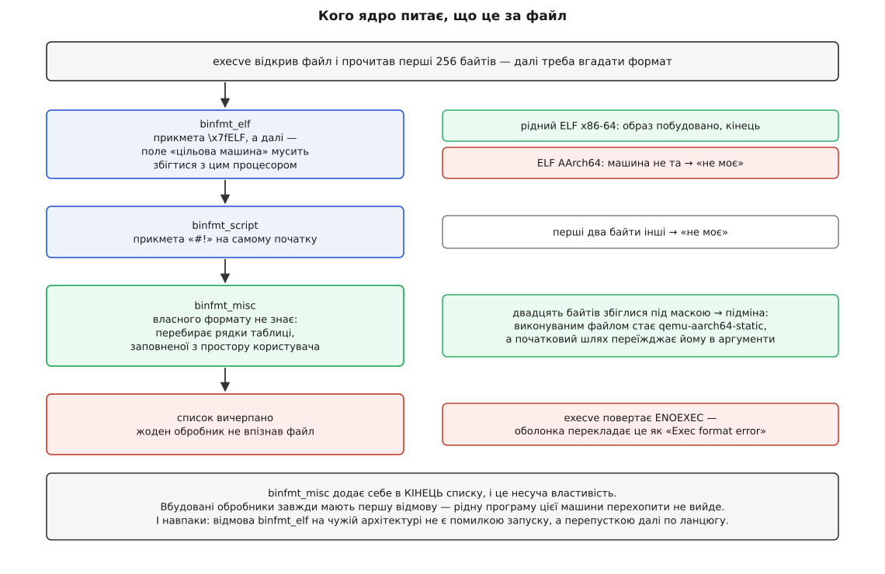
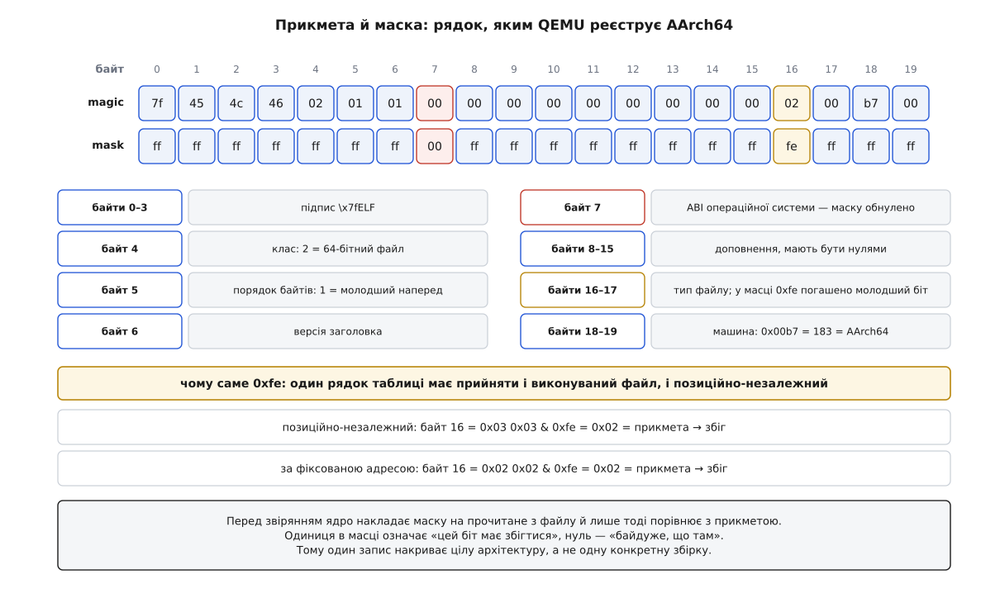

# binfmt_misc: як ядро вчиться запускати чужі формати

<preknowlist>
- [exec: заміна образу](topic:unix-linux/exec-semantics) — заміна вмісту процесу новою програмою; ядро спершу робить усе, що може відмовити, і аж тоді руйнує старий образ.
- [ELF: сегменти, секції, точка входу](topic:unix-linux/elf-structure) — будова виконуваного файлу й що саме стоїть у його заголовку: клас, порядок байтів, тип, цільова машина.
- [Набір інструкцій](topic:programming/isa) — машинний код написано під конкретний набір команд, і процесор іншої архітектури його просто не розуміє.
- [Файловий дескриптор](topic:unix-linux/file-descriptor) — мале ціле число, індекс у таблиці процесу, через яке процес читає й пише.
- [Допоміжний вектор ELF](topic:unix-linux/auxiliary-vector) — список пар «ключ — значення», який ядро кладе на стек новій програмі поруч з аргументами й оточенням.
- [Псевдо-ФС: procfs, sysfs, tmpfs](topic:unix-linux/pseudo-filesystems) — файлові системи без диска, де файл є не сховищем даних, а вікном у структуру ядра.
- [Простори імен: ізоляція погляду на систему](topic:unix-linux/namespaces) — механізм, яким процесові підмінюють бачення дерева монтувань, мережі, номерів процесів.
</preknowlist>

Файл `hello` лежить у поточному каталозі, біт виконання на ньому стоїть, усередині — цілком справжня, зібрана й робоча програма. Оболонка відповідає: `cannot execute binary file: Exec format error`. На сусідній машині — той самий процесор, те саме ядро, та сама оболонка — цей самий файл запускається без жодного слова.

Різниця між двома машинами вміщується в одну таблицю всередині ядра. Ця стаття — про те, що в тій таблиці лежить, звідки вона там береться і чому саме такої форми.

## Спершу — впізнати

Щоб виконати файл, ядро мусить спочатку зрозуміти, що це за файл. У Unix ім'я про вміст не каже нічого: розширення — просто символи в імені, а каталог зберігає лише пару «ім'я — інод». Єдине джерело правди про вміст — сам вміст.

Тому `execve`, відкривши файл, читає його початок (128 байтів, а від версії 5.1 — 256) і пропонує ці байти **обробникам формату** — списку модулів, кожен з яких уміє впізнавати свій ґатунок файлів за прикметою на початку. `binfmt_elf` дивиться на чотири байти `\x7fELF`, `binfmt_script` — на два символи `#!`. Обробник, який упізнав своє, будує новий образ і повертає успіх; той, хто не впізнав, каже «не моє», і ядро йде до наступного. Коли список вичерпано, `execve` повертає `ENOEXEC` — «формат виконуваного файлу невідомий». Саме це повідомлення оболонка й перекладає як `Exec format error`.

Список обробників — звичайний список у ядрі, до якого модулі додаються при завантаженні. Він фіксований складанням ядра: скільки форматів зібрали, стільки система й розуміє. Крім одного запису.

## Обробник, який не розуміє жодного формату

`binfmt_misc` (від англ. *miscellaneous* ← лат. *miscere* — змішувати) — обробник, який не вміє нічого впізнавати. Він не знає ані ELF, ані байткоду, ані структури будь-чого. Усе його знання лежить у **таблиці, яку заповнюють із простору користувача**, і кожен її рядок каже дві речі: за якою прикметою впізнати файл і кому його віддати.

Коли черга доходить до `binfmt_misc`, він перебирає рядки своєї таблиці, порівнює прочитані байти з прикметою кожного — і, знайшовши збіг, робить одну-єдину дію: **підміняє виконуваний файл на інший**. Той файл, що його назвав рядок таблиці, стає справжньою програмою для цього запуску, а початковий файл переїжджає до нього в аргументи. Далі все повторюється звичайним шляхом: підставлений файл проходить той самий список обробників, і цього разу його впізнає `binfmt_elf`.

Звідси й точна відповідь на назву статті. Ядро не вчиться нового формату — воно вчиться **делегувати**. Формат розуміє програма в просторі користувача; ядро лише знає, кому подзвонити.

> 🔧 **Навіщо це.** Уся цінність механізму — у тому, де саме він спрацьовує. Підміна відбувається всередині `execve`, тобто **нижче за всіх**: нижче за оболонку, `make`, `find -exec`, службу systemd, CI-раннер, файловий менеджер. Ніхто з них не знає й не має знати, що файл насправді чужого формату. Той самий ефект «зроби вигляд, що це звичайна програма» можна було б наліпити на кожен із цих інструментів окремо — і мати десяток розбіжних реалізацій, які по-різному ламаються. `binfmt_misc` робить це в одній точці, крізь яку всі вони й так проходять.

## Чому цей обробник стоїть у списку останнім

`binfmt_misc` додає себе в **кінець** списку обробників, і це не деталь реалізації, а несуча властивість.

Наслідок перший, захисний: **вбудовані обробники завжди мають першу відмову**. Скільки не реєструй прикмету `\x7fELF`, звичайну програму твоєї архітектури ти нею не перехопиш — `binfmt_elf` побачить її раніше й забере собі. Механізм, у якому будь-хто з `CAP_SYS_ADMIN` міг би непомітно вклинитися між системою й запуском кожної рідної програми, був би не розширенням, а чорним ходом.

Наслідок другий, і саме він робить механізм цікавим. Візьмімо виконуваний файл, зібраний під AArch64, на машині з x86-64. Він **є** справжнім ELF: підпис на місці, заголовки цілі. `binfmt_elf` бере його, читає заголовок — і відмовляється, бо поле «цільова машина» називає архітектуру, інструкцій якої цей процесор не виконує. Відмова обробника не є помилкою запуску: ядро просто йде далі списком. І там на ті самі байти чекає рядок таблиці `binfmt_misc`, прикмета якого включає **саме це поле** — номер архітектури. Збіг є, і файл віддають емулятору.

Отже, чужа архітектура запускається не всупереч перевірці в `binfmt_elf`, а **завдяки** їй: відмова рідного обробника — це і є той сигнал, який передає файл далі по ланцюгу.



*Відмова `binfmt_elf` на полі «цільова машина» — не помилка, а перепустка далі по списку; на цьому й тримається запуск чужих архітектур.*

## Рядок реєстрації

Таблицю заповнюють через файлову систему. Її монтують — типово в `/proc/sys/fs/binfmt_misc` — і пишуть у файл `register`:

```sh
mount -t binfmt_misc none /proc/sys/fs/binfmt_misc
echo ':qemu-aarch64:M::\x7fELF…:\xff\xff…:/usr/bin/qemu-aarch64-static:F' \
    > /proc/sys/fs/binfmt_misc/register
```

Вибір файлової системи замість системного виклику тут не випадковий. Новий системний виклик — це навіки заморожений інтерфейс, який доведеться підтримувати завжди; файлова система дає той самий доступ без жодного розширення ABI. До того ж кожен зареєстрований запис стає окремим файлом у цьому каталозі: його можна прочитати `cat`, вимкнути записом нуля, прибрати записом `-1`. Керування таблицею дістається звичайним інструментам задарма.

Сам рядок реєстрації має сім полів:

```
:name:type:offset:magic:mask:interpreter:flags
```

**Роздільник — перший символ рядка**, а не обов'язково двокрапка. Причина в полі `magic`: там лежать довільні байти файлу, і серед них цілком може трапитися сама двокрапка. Дозвіл узяти інший символ — простіша відповідь на це, ніж правила екранування.

**`name`** — ім'я запису; під ним у каталозі з'явиться файл. **`type`** — `M` (за прикметою в байтах) або `E` (за розширенням імені). **`offset`** — з якого байта файлу починається прикмета; потрібен там, де перед підписом стоїть свій заголовок. **`interpreter`** — повний шлях до програми, яку підставлять.

А два поля посередині варті окремої розмови.

## Прикмета й маска

**`magic`** — очікувані байти. **`mask`** — байти тієї самої довжини, які кажуть, **які біти взагалі порівнювати**: перед звірянням ядро накладає маску на прочитане з файлу й лише тоді порівнює з прикметою. Одиниця в масці означає «цей біт має збігтися», нуль — «байдуже, що там».

Навіщо це потрібно, найкраще видно на справжньому рядку. Ось прикмета й маска, якими QEMU реєструє AArch64, — двадцять байтів заголовка ELF:

```
magic = \x7fELF\x02\x01\x01\x00\x00\x00\x00\x00\x00\x00\x00\x00\x02\x00\xb7\x00
mask  = \xff\xff\xff\xff\xff\xff\xff\x00\xff\xff\xff\xff\xff\xff\xff\xff\xfe\xff\xff\xff
```

**Що означає кожен байт цих двадцяти:**

```
байт    magic     mask    поле заголовка ELF              звіряємо?
0…3     7f 45 4c 46  ff…  підпис "\x7fELF"                так
4       02        ff      клас: 2 = 64-бітний             так
5       01        ff      порядок байтів: 1 = молодший    так
6       01        ff      версія заголовка                так
7       00        00      ABI операційної системи         НІ — маску обнулено
8…15   00 ×8     ff ×8   версія ABI (8) і доповнення     так
16…17   02 00     fe ff   тип файлу: 2 = виконуваний      так, крім молодшого біта
18…19   b7 00     ff ff   машина: 0x00b7 = 183 = AArch64  так
```

Два нулі в масці — це два різні «байдуже», і кожен має свою причину.

Байт 7 — це поле ABI операційної системи. Різні збирачі ставлять туди різне: нуль для загального System V, трійку для GNU. Архітектури це не стосується, тож маска викидає байт цілком.

Байт 16 цікавіший. Тип файлу `2` означає «виконуваний за фіксованою адресою», `3` — «спільний об'єкт», і саме трійка стоїть у позиційно-незалежних програмах, які нині збирають типово ([рандомізація розкладки адресного простору](topic:programming/aslr) вимагає саме такого вигляду). Обидва варіанти треба прийняти. Маска `0xfe` гасить молодший біт — і два сусідні числа стають одним:

```
файл зібрано як позиційно-незалежний:  байт 16 = 0x03
маска                                            0xfe
0x03 & 0xfe                                    = 0x02
прикмета                                       = 0x02   → збіг

файл зібрано за фіксованою адресою:    байт 16 = 0x02
0x02 & 0xfe                                    = 0x02   → збіг теж
```

Один рядок таблиці замість двох, і жодного «майже такого самого» запису поруч.



*Маска перетворює точний збіг на збіг за суттєвими полями — і саме тому один запис накриває цілу архітектуру, а не одну збірку.*

Розмір прикмети обмежено зверху тим самим буфером, який `execve` уже прочитав: якщо `offset` разом із довжиною прикмети виходить за нього, реєстрація відмовляє. Історично це 128 байтів, від версії 5.1 — 256. Увесь рядок реєстрації не може перевищувати 1920 символів; цього стачає, бо прикмета й маска записані з екрануванням і їдять по чотири символи на байт. Повний перелік полів, обмежень і того, як це саме записують у systemd та Debian, зібрано окремо: [контракт реєстрації binfmt_misc](topic:unix-linux/binfmt-misc/api-register-format.md).

## Що бачить інтерпретатор

Підміна файлу означає, що інтерпретаторові треба якось сказати, який саме файл він має виконати. Ядро робить це через масив аргументів, і робить доволі грубо.

Типово новий `argv` виглядає так: нульовим елементом стає **шлях до інтерпретатора**, першим — **повний шлях до початкового файлу**, а далі йдуть аргументи користувача, починаючи з `argv[1]`. Початковий `argv[0]` при цьому просто зникає — його затирають шляхом до файлу.

Здебільшого це нікого не турбує. Але є цілий клас програм, які дивляться на власне `argv[0]` і від нього залежать: `busybox` за іменем вирішує, якою з двох сотень команд йому бути; ланкові імена на кшталт `cc` замість `gcc`; будь-який виклик з навмисно підміненим нульовим аргументом. Для таких випадків є прапорець **`P`**: ядро тоді нічого не затирає, а **додає** шлях до файлу зайвим аргументом. Початковий `argv[0]` при цьому не зникає — він просто з'їжджає на два місця вниз і стає третім, одразу після шляху.

![Масив аргументів після підміни: типово нульовим елементом стає інтерпретатор, першим — повний шлях до початкового файлу, початковий argv[0] затерто; з прапорцем P початковий argv[0] уціліє й опиняється третім елементом](/reference/unix-linux/processes/binfmt-misc/img/argv-rewrite.svg)

*Уся підміна формату ззовні зводиться до одного: як саме переписано масив аргументів.*

Сам інтерпретатор при цьому мусить розуміти, у якому з двох виглядів до нього прийшли аргументи, — інакше він переплутає шлях до файлу з першим аргументом користувача. Тому від версії 5.12 ядро повідомляє про це через допоміжний вектор: у полі `AT_FLAGS` виставлено біт `AT_FLAGS_PRESERVE_ARGV0`. Це один із небагатьох випадків, коли допоміжний вектор несе не властивість системи, а обставину конкретного запуску.

І окрема домовленість, порушення якої дорого коштує: **інтерпретатор не має шукати переданий шлях у `PATH`**. Ядро віддає йому повний шлях до вже знайденого файлу; повторний пошук за іменем відкриває просту дірку — файл із потрібним іменем, підкладений у каталог із початку `PATH`, виконається замість того, який справді запускали.

## Три способи, якими шлях підводить

Інтерпретаторові передають **шлях** — рядок. А шлях сам собою нічого не значить: він набуває сенсу лише в чиємусь контексті — з чиїми правами його відкривають і в якому дереві монтувань розв'язують. Рівно з трьох способів, якими цей контекст може не збігтися з очікуваним, виросли три прапорці.

**Файл може бути недоступним на читання.** Право на виконання й право на читання — різні біти ([біти прав і як їх перевіряють](topic:unix-linux/permission-bits)); файл із режимом `--x` виконати можна, а прочитати — ні. Для рідного ELF це працює: сторінки коду відображає саме ядро, якому дозволи процесу не указ. А от інтерпретатор — звичайна програма з правами того, хто запустив, і відкрити такий файл вона не зможе. Прапорець **`O`** знімає проблему на корені: ядро відкриває файл само́ й передає інтерпретаторові готовий дескриптор у допоміжному векторі, під ключем `AT_EXECFD`. Замість «ось шлях, іди відкрий» — «ось уже відкрите».

**Права нового процесу беруться не з того файлу.** Ядро виконує **інтерпретатор**, тож і `setuid`-біт воно бере з інтерпретатора, а біти початкового файлу ігнорує — рівно з тієї самої причини, з якої Linux ігнорує підвищення прав на сценаріях із `#!`. Прапорець **`C`** це перевертає: права й мітку безпеки нового процесу обчислюють за початковим файлом, а не за інтерпретатором (і сам собою вмикає `O`, бо інакше інтерпретатор не дістався б до файлу, який щойно дав йому чужі права).

> 🔧 **Навіщо це.** Прапорець `C` — заряджена зброя, і брати його треба свідомо. Він означає, що інтерпретатор виконуватиметься з правами, узятими з чужого файлу, — тобто будь-яка вразливість в інтерпретаторі стає вразливістю підвищення прав. Емулятор чужої архітектури — це десятки тисяч рядків розбору інструкцій; ставити його в довірену основу системи заради зручності не варто. Типова конфігурація QEMU не вмикає `C` саме тому, і додають його лише там, де без `setuid` усередині емульованого середовища справді не обійтися.

**Шляху до самого інтерпретатора може не існувати.** Це найгостріший випадок. Шлях `/usr/bin/qemu-aarch64-static` ядро розв'язує **в контексті того, хто викликав `execve`**, — у його корені й у його дереві монтувань. Процес усередині `chroot` або контейнера має інший корінь ([chroot і його межі](topic:unix-linux/chroot), [простори імен](topic:unix-linux/namespaces)), і в тому корені жодного емулятора немає. Виходило б, що емулятор доводиться копіювати всередину кожного контейнера — тобто псувати чужий образ заради того, щоб він запустився.

Прапорець **`F`** розриває це коло, зсуваючи момент відкриття: ядро відкриває файл інтерпретатора **під час реєстрації** й тримає його відкритим, а при кожному запуску просто клонує вже відкритий файл. Шлях більше не потрібен — потрібен лише сам файл, який ядро вже тримає за руку. Зміна кореня, зміна простору монтувань, видалення файлу з диска — усе це на запуск не впливає. Прапорець додав Джеймс Ботомлі, і патч потрапив у версію 4.8 (2016) з прямо названою метою: запускати контейнери чужої архітектури, не забруднюючи їхні образи емулятором.

## Контейнер чужої архітектури, крок за кроком

Тепер увесь ланцюг видно цілком. Ось що відбувається, коли на машині з x86-64 запускають образ, зібраний під AArch64.

**Один раз на хості** реєструють рядок з прапорцем `F` — саме це робить звичне заклинання `docker run --privileged multiarch/qemu-user-static --reset -p yes`, де `-p` і означає «постійний», тобто `F`. Ядро в цю мить відкриває `qemu-aarch64-static` і кладе відкритий файл собі в таблицю.

**Далі запускають контейнер.** Його корінь — образ, зібраний під AArch64; емулятора всередині немає й не буде. Середовище виконання розгалужується, налаштовує простори імен і кличе `execve` на `/bin/sh` — файл із того образу.

**Ядро йде списком обробників.** `binfmt_elf` бачить підпис ELF, читає далі, натикається на `0x00b7` у полі машини й відмовляється. Черга доходить до `binfmt_misc`; двадцять байтів збігаються з прикметою під маскою.

**Підміна.** Інтерпретатором стає **не шлях, а той самий файл, що його ядро тримає відкритим** ще з реєстрації, — файл із файлової системи хоста, до якої контейнер жодного доступу не має. У `argv` лягає шлях `/bin/sh`, який розв'яжеться вже всередині контейнера.

**Емулятор працює.** QEMU відкриває `/bin/sh` — тепер уже звичайним відкриттям, у корені контейнера, — сам розкладає його сегменти в пам'ять і починає виконувати інструкції AArch64, перетворюючи їх на x86-64 ([емуляція набору інструкцій](topic:programming/instruction-set-emulation)). Системні виклики, які робить емульована програма, він перекладає на справжні системні виклики хоста.


*Прапорець `F` переносить розв'язання шляху з моменту запуску в момент реєстрації — тому корінь контейнера більше нічого не вирішує.*

Одна деталь у цьому ланцюгу неочевидна, доки не зламається: **емулятор мусить бути зібраний статично**. Він стартує з коренем контейнера, і жодної спільної бібліотеки хоста там немає — а якби й була, то під чужу архітектуру. Тому в назві файлу й стоїть `-static`: динамічно злінкований емулятор помер би на першому ж пошуку `libc` ([статичне й динамічне лінкування](topic:unix-linux/static-and-dynamic-linking)).

## Межі, пастки й неприємні діагностики

**Ланцюг обмежено завглибшки.** Підставлений інтерпретатор проходить список обробників наново — і сам цілком може виявитися сценарієм із `#!`, який тягне за собою ще одну підміну. Ядро дозволяє щонайбільше чотири такі переписування поспіль, а на п'ятому повертає `ELOOP`. Обмеження спільне для `#!` і `binfmt_misc`, бо лічильник у `execve` один на обидва механізми.

**Таблиця історично була одна на машину.** Реєстрація вимагає `CAP_SYS_ADMIN`, а результат діяв на всю систему: контейнер міг користуватися чужими записами, але завести власний не міг. Змінилося це наприкінці 2023 року, коли в дерево ліг патч Крістіана Браунера на основі роботи Лорана Вів'є (версія ядра 6.7, випуск — січень 2024): `binfmt_misc` тепер монтується всередині простору імен користувачів, і кожен такий простір дістає власний примірник таблиці.

**Тип `E` судить за іменем.** Це єдине місце в ядрі, де спосіб виконання файлу залежить від його **назви**, а не вмісту, — і виглядає як пряме порушення того, на чому Unix стоїть. Виправдання в нього одне, зате чесне: буває, що прикмети немає. Архів `.jar` починається з підпису звичайного ZIP, спільного з тисячами інших архівів, які запускати не треба. Розрізнити їх за вмістом означало б розбирати архів у ядрі; розрізнити за розширенням — один рядок. Ціна теж чесна: перейменування файлу міняє те, як він виконується.

**Найгірша діагностика — та, що бреше про файл.** Прибери інтерпретатора (або просто перейменуй його при оновленні пакунка), і кожен файл цього формату почне відповідати `ENOENT` — «немає такого файлу». Немає при цьому не того файлу, який ти запускав, а інтерпретатора, названого в таблиці. Це той самий обман, що й при відсутньому динамічному завантажувачі, і той самий спосіб перевірки: подивитися не на файл, а на запис у `/proc/sys/fs/binfmt_misc/`.

**Таблицю легко скинути ненароком.** Записи не переживають перезавантаження, тож їх відновлюють на старті: systemd має `systemd-binfmt.service`, який читає `/etc/binfmt.d/*.conf` ([systemd: юніти, залежності, цілі](topic:unix-linux/systemd-model)), Debian — `update-binfmts` зі своїм каталогом. Обидва вміють спершу **прибрати всі** записи, а тоді розкласти свої. Класична пригода саме звідси: у WSL інтеграція з Windows тримається на записі `WSLInterop`, який ловить дволітерний підпис `MZ` на початку виконуваних файлів Windows і віддає їх `/init`. Увімкни в тому ж середовищі systemd — і `systemd-binfmt`, не знаючи про цей запис, змете його разом з усіма; запуск `notepad.exe` з оболонки Linux перестає працювати без жодного натяку на причину.

**І запобіжник, про який варто знати.** Саму файлову систему `binfmt_misc` ядро позначає як таку, з якої нічого не виконують. Інакше файли-записи в ній самі могли б стати цілями підміни — і механізм замкнувся б на себе.

## Що з цього виходить

Впізнати формат — остання суто ядерна дія в житті програми. Усе, що після неї, робить уже код у просторі користувача: розкладає сегменти динамічний завантажувач, шукає команди оболонка, розбирає байткод віртуальна машина. `binfmt_misc` бере цю останню ядерну дію й робить її теж делегованою — не додаючи в ядро жодного знання про формати, які з'являться потім.

Тому в цій таблиці однаково живуть речі, що не мають між собою нічого спільного: емулятор чужого набору інструкцій, місток до Windows, віртуальна машина Java. Ядру байдуже, що саме вміє інтерпретатор; воно домовилося лише про те, як його покликати. І доки домовленість тримається, `./app.jar` у конвеєрі, у `Makefile`, у полі «команда» службового юніта поводиться точно так само, як зібраний під цю машину ELF, — бо всі вони проходять крізь один і той самий системний виклик, а підміна стається під ним.

Історію самого механізму — від латки 1997 року, написаної заради Java та DOS-програм, до прапорця для контейнерів через дев'ятнадцять років — розказано окремо: [як з'явився binfmt_misc](topic:unix-linux/binfmt-misc/hist-binfmt-misc.md). А завести власний формат від нуля, побачити переписаний `argv` на власні очі й помацати прапорці `P` та `O` можна невеликим дослідом: [власний формат за десять хвилин](topic:unix-linux/binfmt-misc/proj-register-own-format.md).
