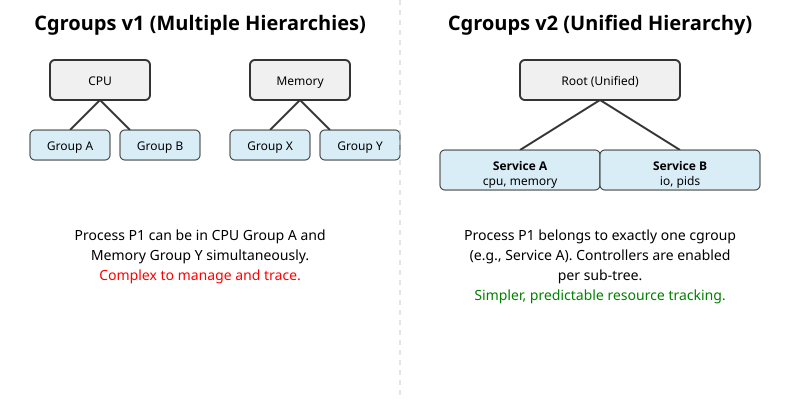
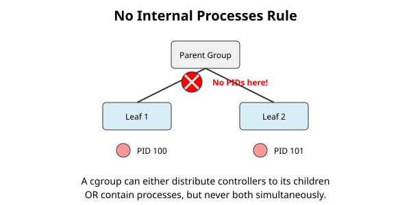

# Cgroups v2: єдина ієрархія (Unified Hierarchy)

<preknowlist>
- [Концепції ядра Linux](book:unix-linux/kernel-and-userspace) — базові поняття системних викликів та віртуальної файлової системи (VFS).
- [Процеси та потоки](book:unix-linux/processes) — як ядро бачить задачі та планує їх виконання.
</preknowlist>

Control Groups (cgroups) — це механізм ядра Linux для організації процесів в ієрархічні групи з метою обмеження, обліку та ізоляції використання ресурсів (процесорного часу, пам'яті, дискового вводу-виводу тощо). З появою Cgroups v2 (офіційно визнано стабільним у версії ядра 4.5), парадигма управління ресурсами в Linux зазнала кардинальних змін, перейшовши від моделі розрізнених ієрархій для кожного контролера до концепції **єдиної ієрархії (Unified Hierarchy)**.

У цій статті ми детально розглянемо архітектуру Cgroups v2, фундаментальне правило "no internal processes", роботу з основними контролерами (`cpu`, `memory`, `io`, `pids`), а також механізм Pressure Stall Supervision, який дозволяє відстежувати брак ресурсів у системі.

## 1. Еволюція та проблеми Cgroups v1

Щоб зрозуміти переваги Cgroups v2, важливо згадати, як працювала перша версія (Cgroups v1). У v1 кожен ресурсний контролер (наприклад, `cpu`, `memory`, `blkio`) мав власну, незалежну ієрархію. Це означало, що адміністратор міг створити ієрархію для процесора, де процес А і процес Б знаходились у різних групах, і абсолютно іншу ієрархію для пам'яті, де ці ж процеси могли знаходитись в одній групі.

Хоча на перший погляд це здавалося гнучким, на практиці такий підхід породив значні проблеми:
1. **Хаос управління**: Програмам простору користувача (наприклад, `systemd`, `Docker`, `Kubernetes`) було надзвичайно складно відстежувати приналежність процесів до різних ієрархій та синхронізувати їх.
2. **Конфлікти контролерів**: Оскільки ієрархії були незалежними, було неможливо ефективно координувати дії контролерів. Наприклад, коли процесу не вистачає пам'яті і система починає активно вивантажувати сторінки в swap (створюючи навантаження на диск), контролери `memory` та `blkio` не могли легко обмінюватися інформацією про те, хто саме спричинив це навантаження.
3. **Обмеження продуктивності**: Обхід кількох дерев ієрархій створював додаткове навантаження на ядро при створенні та знищенні процесів.

Ці фундаментальні проблеми призвели до розробки Cgroups v2, керівним принципом якої стала простота і узгодженість.



## 2. Єдина ієрархія (Unified Hierarchy)

У Cgroups v2 існує лише **одне дерево ієрархії**. Усі контролери монтуються разом у спільній точці, яка традиційно знаходиться в `/sys/fs/cgroup/` (за умови, що система завантажена з підтримкою лише v2, тобто unified mode). 

### 2.1 Монтування та базова структура

У системі, що використовує виключно cgroups v2, файлова система cgroup монтується за допомогою команди (це зазвичай робить `systemd` при завантаженні):

```bash
mount -t cgroup2 none /sys/fs/cgroup
```

Якщо зазирнути всередину цієї директорії, ви побачите набір спеціальних файлів `cgroup.*`, які є фундаментальними для управління деревом, а також файли конкретних контролерів, якщо вони активовані для кореневої групи.

Основні файли керування ієрархією:
- `cgroup.procs`: Містить список PID процесів, які належать до цієї групи. Запис PID у цей файл переміщує процес до відповідної cgroup.
- `cgroup.controllers`: Тільки для читання. Показує список контролерів, які **доступні** для цієї групи (ті, що ядро підтримує і які були передані від батьківської групи).
- `cgroup.subtree_control`: Список контролерів, які **активовані для дочірніх груп** (subtrees). Записуючи назви контролерів у цей файл з префіксами `+` або `-`, ви вмикаєте або вимикаєте їх.
- `cgroup.events`: Надає інформацію про стан групи, наприклад, чи містить вона процеси або дочірні групи.
- `cgroup.stat`: Статистика групи, зокрема кількість процесів і потоків, що знаходяться у ній.

### 2.2 Розподіл контролерів по дереву (Top-Down Constraint)

Однією з ключових особливостей єдиної ієрархії є те, що контролери активуються згори донизу (top-down). Група отримує доступ до контролера (наприклад, `memory`), тільки якщо її батьківська група активувала цей контролер у своєму `cgroup.subtree_control`.

Це створює передбачувану і строгу систему: якщо адміністратор заборонив управління пам'яттю на рівні певної групи, жодна з її дочірніх груп не зможе обійти це обмеження.

## 3. Правило "No Internal Processes" (Відсутність внутрішніх процесів)

Це одне з найважливіших і найсуворіших правил дизайну Cgroups v2. Воно вирішує проблему конкуренції за ресурси між процесами і підгрупами.

**Суть правила**: Некоренева cgroup не може одночасно розподіляти ресурси (тобто мати контролери активованими в `cgroup.subtree_control`) **і** містити процеси у своєму `cgroup.procs`.

Іншими словами:
- Група може бути **листовим вузлом** (leaf node), де вона містить процеси, але не має дочірніх груп із активними контролерами.
- Або група може бути **внутрішнім вузлом** (internal node), яка розподіляє ресурси між своїми дочірніми групами, але сама не містить жодних процесів.



### Чому це важливо?

Уявіть ситуацію в v1: Група A має дочірню групу B. У Групі A також працюють якісь процеси. Коли контролер намагається розподілити ресурси, йому доводиться балансувати між процесами, що безпосередньо належать Групі A, і всією сукупністю процесів у Групі B. Процеси в A по суті стають прихованою "дочірньою групою", але їхні обмеження і ваги нечіткі. Це призводило до непередбачуваної поведінки та складної логіки в ядрі.

У v2 ця неоднозначність усунена. Всі процеси, що конкурують за ресурси на певному рівні ієрархії, завжди знаходяться на одному рівні дерева (на рівні листя або в групах-сестрах).

*(Примітка: Існує виняток для кореневої cgroup, яка може містити процеси і одночасно активувати контролери для дочірніх груп. Також існує виняток для деяких контролерів, що не споживають ресурси, але вони є радше технічними деталями).*

## 4. Робота з основними контролерами

Контролери у Cgroups v2 реалізують конкретні політики управління ресурсами. Розглянемо найважливіші з них.

### 4.1 Контролер `cpu`

Цей контролер регулює розподіл процесорного часу. У v2 він об'єднує функціональність `cpu` (пропорційний розподіл) і `cpuacct` (облік), які в v1 були окремими.

**Основні файли:**
- `cpu.weight`: Замінює `cpu.shares` з v1. Задає відносну вагу групи (за замовчуванням 100, діапазон 1-10000). Група з вагою 200 отримає вдвічі більше процесорного часу під час конкуренції, ніж група з вагою 100.
- `cpu.max`: Замінює пару `cpu.cfs_quota_us` / `cpu.cfs_period_us`. Формат: `$MAX $PERIOD`. Наприклад, `100000 100000` означає дозвіл на 1 ядро (100000 мікросекунд з кожних 100000). `max 100000` означає відсутність жорсткого обмеження.
- `cpu.stat`: Детальна статистика використання CPU (user mode, system mode).

### 4.2 Контролер `memory`

Контролер `memory` в v2 був суттєво перероблений для вирішення проблем з page cache та анонімною пам'яттю, які переслідували v1.

**Основні файли:**
- `memory.current`: Поточне споживання пам'яті (у байтах).
- `memory.max`: Жорсткий ліміт (Hard limit). Якщо група перевищує його, спрацьовує OOM (Out-Of-Memory) killer для процесів у цій групі.
- `memory.high`: Основний інструмент керування ("Throttle limit"). При наближенні до цього порогу ядро починає агресивно звільняти сторінки (reclaim), сповільнюючи процеси, що генерують навантаження (throttling), замість того, щоб вбивати їх.
- `memory.low`: Захист "best-effort". Ядро намагатиметься не вивантажувати сторінки цієї групи, поки пам'ять системи вище певного рівня.
- `memory.min`: Жорсткий захист пам'яті. Гарантована кількість пам'яті. Пам'ять групи ніколи не буде звільнена нижче цього порогу, навіть якщо системі загрожує загальний OOM.
- `memory.stat` та `memory.events`: Статистика і лічильники подій (кількість OOM, allocation failures).

Зміна від v1: Немає окремого ліміту `memory+swap` (`memory.memsw.limit_in_bytes`). Замість нього є окремий контролер/файл `memory.swap.max`.

### 4.3 Контролер `io`

Контролер вводу-виводу (раніше `blkio`) управляє пропускною здатністю дискових пристроїв. В v2 він став значно ефективнішим завдяки єдиній ієрархії: тепер ядро точно знає, якій cgroup належать операції вводу-виводу, навіть якщо це буферизований запис (buffered I/O) з page cache, що було практично неможливо в v1.

**Основні файли:**
- `io.max`: Встановлює жорсткі обмеження (bps - bytes per second, iops - IO operations per second) для конкретних пристроїв. Формат: `$MAJOR:$MINOR rbps=$BYTES wbps=$BYTES riops=$IOPS wiops=$IOPS`.
- `io.weight`: Пропорційна вага для дискового часу на пристрої. Працює з планувальниками типу BFQ.
- `io.stat`: Детальна статистика прочитаних/записаних байтів та операцій за кожним блоковим пристроєм.

### 4.4 Контролер `pids`

Простий, але вкрай важливий контролер для захисту від атак типу "fork bomb". Він обмежує кількість процесів/потоків, які можуть існувати в cgroup.

**Основні файли:**
- `pids.max`: Максимальна кількість процесів (може бути число або рядок `max`).
- `pids.current`: Поточна кількість процесів.
- `pids.events`: Кількість спроб створення процесу (fork/clone), які були відхилені через досягнення ліміту `pids.max`.

## 5. Pressure Stall Supervision (PSI - Pressure Stall Information)

Одним із найпотужніших нововведень, тісно пов'язаних з Cgroups v2 (з'явилося в ядрі 4.20), є **PSI**. PSI надає універсальну метрику того, наскільки сильно процеси в системі (або в конкретній cgroup) "страждають" від нестачі ресурсів.

До PSI системним адміністраторам доводилося покладатися на розрізнені метрики (load average, iostat, vmstat), щоб здогадатися, чи бракує пам'яті чи диска. PSI надає чіткі відповіді: він вимірює **час, протягом якого процеси були зупинені (stalled) в очікуванні ресурсу**.

Для кожної cgroup з'явилися три файли:
- `cpu.pressure`
- `memory.pressure`
- `io.pressure`

Кожен файл показує статистику за 10, 60 і 300 секунд. Метрики поділяються на:
- **`some`**: Відсоток часу, протягом якого *хоча б один* процес був зупинений через брак ресурсу.
- **`full`**: Відсоток часу, протягом якого *всі* неробочі (non-idle) процеси були зупинені (система або cgroup повністю заблокована ресурсом). Зрозуміло, що для CPU показника `full` не існує, оскільки процесор не чекає на сам себе.

Приклад виводу PSI:
:::tabs
== Базова команда
```bash
cat /sys/fs/cgroup/system.slice/memory.pressure
```
== Приклад виводу
```text
some avg10=0.00 avg60=0.00 avg300=0.00 total=15024
full avg10=0.00 avg60=0.00 avg300=0.00 total=314
```
:::

PSI дозволяє створювати демони (наприклад, `oomd` або `systemd-oomd`), які постійно моніторять `.pressure` файли і проактивно вбивають або обмежують процеси **до того**, як система увійде в стан глибокого swap-шторму або ядерного OOM, зберігаючи систему чуйною.

## 6. Приклад налаштування Cgroups v2 вручну

Розглянемо практичний приклад того, як створити групу, обмежити їй пам'ять та помістити туди процес. Всі операції виконуються з правами `root`.

1. **Створення ієрархії:**
   ```bash
   # Переходимо в корінь cgroups
   cd /sys/fs/cgroup

   # Створюємо батьківську групу
   mkdir myapp
   ```

2. **Активація контролерів:**
   Перевіряємо, які контролери доступні:
   ```bash
   cat myapp/cgroup.controllers
   # Вивід: cpuset cpu io memory pids
   ```
   
   Активуємо `memory` та `cpu` для дочірніх груп (пам'ятаємо про no internal processes rule: `myapp` не зможе мати процеси, якщо ми це зробимо, вона стане внутрішнім вузлом).
   ```bash
   echo "+memory +cpu" > myapp/cgroup.subtree_control
   ```

3. **Створення листових (leaf) груп:**
   ```bash
   mkdir myapp/worker1
   mkdir myapp/worker2
   ```

4. **Налаштування лімітів:**
   Встановлюємо жорсткий ліміт пам'яті для `worker1` у 500 Мегабайт:
   ```bash
   echo 500M > myapp/worker1/memory.max
   ```
   
   Надаємо `worker1` вищий пріоритет CPU, ніж `worker2`:
   ```bash
   echo 500 > myapp/worker1/cpu.weight
   echo 100 > myapp/worker2/cpu.weight
   ```

5. **Приєднання процесів:**
   Запускаємо програму (наприклад, `stress`) і записуємо її PID у групу:
   ```bash
   stress --vm 1 --vm-bytes 400M &
   PID=$!
   echo $PID > myapp/worker1/cgroup.procs
   ```
   
   Тепер процес ізольований в cgroup `myapp/worker1` і підпорядковується її правилам. Якщо процес спробує виділити більше 500MB пам'яті, ядро призупинить його або знищить через OOM killer, при цьому решта системи не постраждає.

## 7. Systemd та Cgroups v2

У сучасних дистрибутивах Linux вам рідко доведеться маніпулювати файловою системою `/sys/fs/cgroup/` безпосередньо. `systemd` є основним менеджером cgroups.

Коли система завантажується з єдиною ієрархією, systemd створює структуру, що складається з `slices` (зрізи), `scopes` (області) та `services` (служби).
- Кожен `.service` файл відповідає окремій (зазвичай листовій) cgroup.
- Директиви в unit-файлах systemd автоматично транслюються у файли cgroups v2.

Наприклад, наступний фрагмент `myapp.service`:
```ini
[Service]
MemoryMax=500M
MemoryHigh=400M
CPUWeight=500
TasksMax=100
```
буде трансловано systemd у налаштування `memory.max`, `memory.high`, `cpu.weight` та `pids.max` у відповідній cgroup `/sys/fs/cgroup/system.slice/myapp.service/`.

Systemd повністю поважає правило *no internal processes*. Саме тому він використовує делегування (delegation) через `Delegate=yes` для контейнерних систем (як Docker чи Podman), дозволяючи їм керувати власним піддеревом в межах визначених меж.

## Висновок

Cgroups v2 — це зрілий, консистентний і продуманий механізм управління ресурсами в Linux. Завдяки єдиній ієрархії він вирішив проблему плутанини множинних дерев контролерів. Правило "no internal processes" усунуло неоднозначність при розподілі ресурсів, а поява Pressure Stall Information (PSI) надала адміністраторам безпрецедентний інструмент для моніторингу реального браку ресурсів.

Сьогодні Cgroups v2 є стандартом де-факто, підтримується всіма основними контейнерними рушіями (Docker, containerd, CRI-O, Kubernetes) і забезпечує надійний фундамент для ізоляції робочих навантажень у сучасних хмарних і серверних інфраструктурах.
