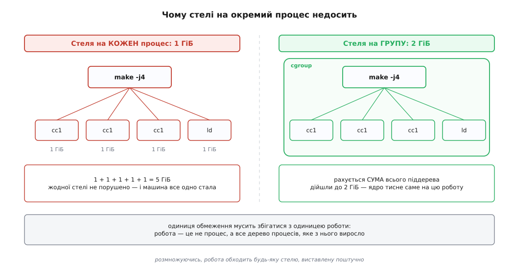
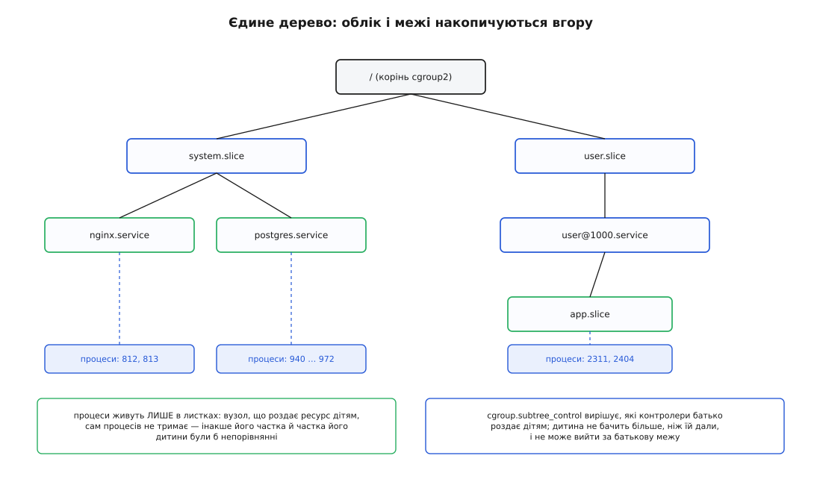
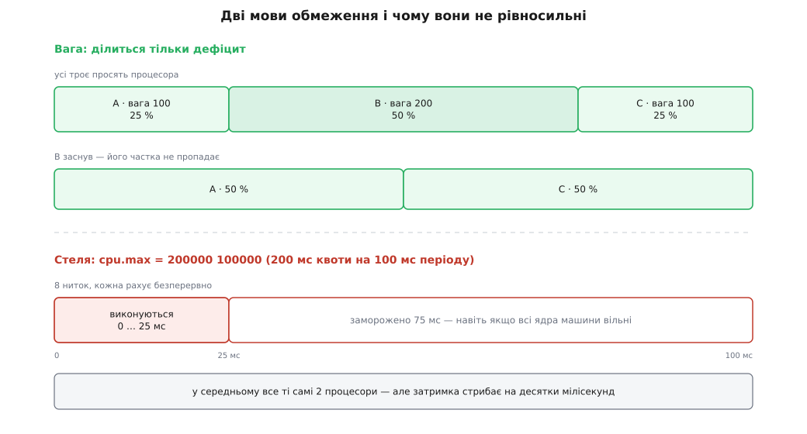
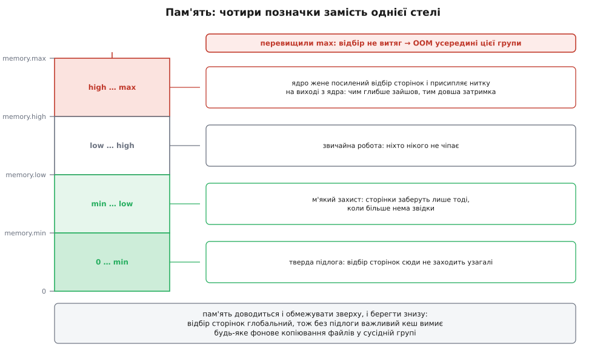

# cgroups: облік і обмеження ресурсів

<preknowlist>
- [Процес: що це насправді](topic:unix-linux/process-model) — у ядрі немає об'єкта «процес», є задача (`task_struct`), що вказує на окремі структури ресурсів.
- [Ядро й простір користувача](topic:unix-linux/kernel-and-userspace) — заліза програма не ділить: усе, що стосується чужих ресурсів, вирішує ядро.
- [PID і дерево процесів](topic:unix-linux/pid-and-hierarchy) — процеси утворюють дерево «батько → дитина», і дитина успадковує чимало властивостей батька.
- [Планувальник: як ядро ділить час](topic:unix-linux/scheduler-model) — кому віддати процесор і що означає пропорційний поділ за вагами.
- [Псевдо-ФС: procfs, sysfs](topic:unix-linux/pseudo-filesystems) — файл, за яким нічого не лежить на диску: читання й запис у нього — це виклик у ядро.
- [Свопінг і витіснення сторінок](topic:unix-linux/swap-and-reclaim) — коли пам'яті бракує, ядро відбирає вже роздані сторінки назад.
- [Overcommit і OOM-killer](topic:unix-linux/overcommit-and-oom) — що робить система, коли пам'ять скінчилася остаточно.
</preknowlist>

## Стеля на процес не обмежує роботу

Ви ділите машину між кількома збірками й хочете, щоб жодна не з'їла всю пам'ять. Інструмент, який лежить під рукою, — [ліміти ресурсів](topic:unix-linux/resource-limits): `setrlimit` дозволяє сказати «цьому процесові не більше гігабайта адресного простору», і дитина цю стелю успадкує. Ставимо гігабайт і запускаємо `make -j16`.

Далі відбувається неприємне. `make` розгалужується на шістнадцять компіляторів, кожен чесно тримається свого гігабайта, жодна стеля не порушена — і разом вони займають шістнадцять. Машина йде у своп, сусідня збірка стоїть.



*Стеля, виставлена поштучно, обходиться простим розмноженням: сума ніде не перевіряється.*

Проблема не в тому, що гігабайт замалий. Проблема в тому, що **одиниця обмеження не збігається з одиницею роботи**. Обмежуємо процес, а платить машина за роботу — а робота це не один процес, а все дерево, яке з нього виросло: компілятори, лінкери, оболонки-обгортки, демон збірки, який хтось запустив нащадком. Скільки їх буде, наперед не знає ніхто, тому й поштучну стелю виставити правильно неможливо.

І це ще не найгірше. Уявімо, що ми вирішили доглядати за деревом самотужки: запам'ятали PID батька, час від часу обходимо `/proc`, збираємо нащадків, додаємо їхню пам'ять. Такий нагляд ламається двома способами. Перший — процес відв'язується: викликає `setsid`, стає лідером нового сеансу, його справжній батько помирає, і дитину [підхоплює init](topic:unix-linux/orphan-reparenting). Дерева більше нема, слід загублено. Другий — перегони: між тим, як ми прочитали список нащадків, і тим, як ми зважили його пам'ять, устигли народитися ще п'ятеро.

Отже, потрібне щось інше, ніж стеля на процес і ніж обхід дерева ззовні. Потрібна **позначка на самій задачі**, яка задовольняє три умови: діти її успадковують автоматично; скинути її з себе задача не може; ядро рахує ресурси на позначку, а не на задачу. Тоді питання «скільки з'їла ця робота» перестає залежати від того, скільки процесів вона встигла наплодити й хто з них кому батько.

## Група як стійка позначка

Саме таку позначку й додали в `task_struct`: вказівник на групу, до якої задача належить. `fork` копіює цей вказівник разом з рештою — тому дитина народжується в тій самій групі, не роблячи для цього нічого. Вийти з групи можна лише одним способом: записати свій номер у спеціальний файл іншої групи. А на файл є права, і якщо їх нема — переходу не буде. Позначка тримається.

Ця конструкція називається **контрольна група** (англ. *control group*, звідси скорочення *cgroup*): іменований набір задач, на який ядро веде рахунок і до якого прикладає правила.

Слово «рахунок» тут важливіше за слово «правила», і ось чому. Обмежити можна лише те, що вмієш порахувати. Тому кожен механізм cgroups починається з обліку, а обмеження — це вже другий поверх, надбудований над лічильником. Причому облік ведеться на групу як на ціле: задача померла, а її витрати з групи нікуди не зникли; задача народилася — її витрати одразу лягли на ту саму суму. Група існує незалежно від того, скільки задач у ній зараз є, і скільки їх було вчора.

## Чому дерево, а не список

Плаского списку груп вистачило б, якби ділити доводилося один раз. Але ділять багаторазово й вкладено.

Машина віддає частку системним службам і частку живим користувачам. Усередині користувацької частки сеанс роздає своє між застосунками. Усередині застосунку — між робочими пулами. Кожен рівень хоче розпорядитися **своєю** часткою, нічого не знаючи про те, як його частку поділять далі, і не маючи змоги зіпсувати сусідам. Це рекурсія, і структура для неї — дерево.

З дерева одразу випливають дві властивості, заради яких усе й будувалося.

**Облік накопичується вгору.** Спожите дитиною входить у суму батька, батькове — у суму діда. Тому питання «скільки з'їв цей користувач» має відповідь, навіть якщо всередині користувача сотня вкладених груп: це просто сума піддерева.

**Межа накопичується вниз.** Фактична стеля для групи — найменша зі стель на всьому шляху до кореня. Дитина не може вигребти більше, ніж батько; створивши власних дітей і роздавши їм щедрі ліміти, вона нічого не змінить, бо ті діти теж усередині батькового піддерева. Ось чому батькові не треба довіряти дитині: дитині можна дозволити самій керувати своїм шматком дерева, і вона фізично не вилізе за його межі.



*Кожен вузол роздає дітям те, що має сам; процеси сидять тільки в листках.*

## Дерево з правами — це файлова система

Тепер придивімося, що саме нам потрібно від інтерфейсу до цих груп. Дерево вузлів. Створення й видалення вузла. Права на вузол, щоб делегувати піддерево іншому власникові. Іменовані атрибути на вузлі, які можна прочитати й записати. Успадкування прав від батька.

Усе перелічене вже є у файловій системі, і вигадувати другий такий механізм було б дивно. Тому cgroups не має власних системних викликів: керують ними через [псевдо-файлову систему](topic:unix-linux/pseudo-filesystems), змонтовану в `/sys/fs/cgroup`. Створити групу — `mkdir`. Видалити — `rmdir`. Поставити ліміт — записати число у файл. Перевести задачу — записати її номер у файл.

```sh
# нова група для збірки
mkdir /sys/fs/cgroup/build

# корінь має роздавати дітям процесор і пам'ять
echo "+cpu +memory" > /sys/fs/cgroup/cgroup.subtree_control

# правила для групи
echo 4G              > /sys/fs/cgroup/build/memory.max
echo "200000 100000" > /sys/fs/cgroup/build/cpu.max

# переводимо саму оболонку — усі її нащадки народяться вже тут
echo $$ > /sys/fs/cgroup/build/cgroup.procs
make -j16
```

Останній рядок — та сама відповідь на проблему, з якої почалася стаття. Ми не перелічуємо процеси збірки й не доганяємо їх у `/proc`: ми переводимо в групу **одну** задачу — оболонку — а решта потрапляє туди сама, самим фактом народження. Скільки їх буде, значення не має.

Рядок з `cgroup.subtree_control` виглядає зайвим, але без нього два наступні файли просто не з'являться. Батько мусить прямо оголосити, які контролери він роздає дітям: контролер — це код, що чіпляється до вузла й веде на ньому свій рахунок, і ввімкнений він не всюди, а лише там, де його попросили. Перелік того, які файли з'являються від якого контролера, які в них формати й типові значення, зібрано окремо — [довідка інтерфейсу cgroup v2](topic:unix-linux/cgroups/api-cgroup2-interface.md); тут нам важлива не таблиця імен, а механіка.

> 🔧 **Навіщо це.** Практично всі знайомі речі — юніт systemd, контейнер, під у Kubernetes, сеанс користувача — це один каталог у `/sys/fs/cgroup` з виставленими файлами. Коли служба «незрозуміло чому гальмує», читання `cpu.stat` і `memory.events` її групи відповідає на питання швидше за будь-який профілювальник: там прямо написано, скільки разів її морозили за квотою і скільки разів вона впиралася в пам'ять.

## Спершу порахувати

Механіка обліку різна для різних ресурсів, і різниця ця не технічна дрібниця — з неї виростає вся подальша поведінка.

**Пам'ять рахують у момент першого доторку.** Коли задача вперше торкається сторінки, ядро списує цю сторінку на групу, у якій задача зараз перебуває, і сторінка залишається за цією групою, поки не звільниться. Звідси наслідок, який регулярно збиває з пантелику: спільну сторінку — скажімо, сторінку кеша файлу, який читають дві групи, — оплачує та, що торкнулася першою. Друга користується безкоштовно, доки перша не помре. І звідси ж другий наслідок: перевести задачу в іншу групу легко, а перенести за нею вже нараховану пам'ять — ні, бо сторінка не знає, чия вона «за задумом», вона знає лише, кому її записали.

**Процесорний час рахують під час перемикання.** Планувальник і так знає, скільки наносекунд задача пробула на ядрі, — цю дельту він додає в лічильник групи заразом із власним обліком. Тому [облік процесорного часу](topic:unix-linux/cpu-time-accounting) на групі не коштує майже нічого понад те, що вже робиться.

**Ввід-вивід рахують за запитом.** Структура запиту до блокового пристрою несе посилання на групу, від імені якої запит іде, — і саме тут починаються складнощі, до яких ми ще дійдемо.

Залишається питання ціни. Якщо кожне списання сторінки б'є в один лічильник кореня, то на машині з сотнею ядер цей лічильник стає найгарячішою кеш-лінією в системі, і облік з'їдає більше, ніж економить. Тому ядро рахує **розподілено**: у кожної групи є свої лічильники на кожен процесор, і оновлення потрапляє в локальний, без жодної синхронізації із сусідами. Вгору по дереву числа підсумовуються **ліниво** — лише тоді, коли хтось справді читає `memory.stat` чи `cpu.stat`. Ця підсистема зветься `rstat`; платить за облік не той, хто працює, а той, хто дивиться.

## Дві мови обмеження: вага і стеля

Порахувавши, можна обмежувати. І тут виявляється, що «обмежити» означає дві різні речі, які легко переплутати й дуже боляче поплутати.

**Вага** каже, як ділити **дефіцит**. Файл `cpu.weight` бере число від 1 до 10000, типове значення 100. Коли на процесор претендують кілька груп-сестер, кожна дістає частку, пропорційну своїй вазі:

```
частка групи = вага групи / сума ваг активних сестер

сестри A(100), B(200), C(100), усі троє хочуть рахувати:
A = 100 / 400 = 0.25
B = 200 / 400 = 0.50
C = 100 / 400 = 0.25
```

Ключове слово тут — **активних**. Якщо B зараз нічого не рахує, її ваги в знаменнику немає, і A з C ділять усе навпіл. Ресурс не марнується ніколи: поки хтось хоче працювати, процесор працює. Таку властивість називають збереженням роботи (англ. *work-conserving*) — простою вона є лише на вигляд, бо саме вона робить ваги придатними для машини, завантаженої під зав'язку. Ширше про те, які взагалі бувають правила чесного поділу і чому «порівну» — не єдине з них, — [чесність розподілу](topic:programming/fairness-quotas).

**Стеля** каже, скільки не давати **ніколи**. Файл `cpu.max` містить два числа: квоту й період у мікросекундах, типово `max 100000` — тобто стелі немає, а період сто мілісекунд. Записавши `200000 100000`, ми кажемо: за кожні сто мілісекунд ця група має право спожити двісті мілісекунд процесорного часу, тобто в середньому два процесори. Вичерпала квоту — усі її задачі знімаються з ядер до початку наступного періоду, хоч би скільки ядер стояло без діла.

Різниця між цими двома мовами не косметична, і найкраще її видно на числах.

**Умова.** Восьминитковий сервер, кожна нитка рахує безперервно, група має `cpu.max = "200000 100000"` — тобто ті самі «два процесори».

```
квота  = 200000 мкс на період
період = 100000 мкс
середня частка = 200000 / 100000 = 2.0 процесора

вісім ниток жеруть паралельно:
за 1 мс стінного часу списується  = 8 × 1000 мкс = 8000 мкс
квота вичерпається через          = 200000 / 8000 = 25 мс
група стоїть до кінця періоду     = 100 − 25      = 75 мс
```

Середнє — рівно два процесори, як і замовляли. Але ці два процесори прийшли не рівним струмком, а сплеском: чверть періоду робота біжить на восьми ядрах, три чверті лежить. Запит, який прийшов на 30-й мілісекунді, чекатиме сімдесят мілісекунд — не тому, що машина зайнята, а тому, що його групі заборонено виконуватися. Та сама «частка два процесори», видана вагою, дала б рівномірний струмок і жодного простою.



*Вага роздає дефіцит і не марнує ресурс; стеля виконує обіцянку в середньому, платячи за це паузами.*

Побачити цей ефект можна прямо: `cpu.stat` рахує `nr_throttled` — скільки періодів група була заморожена, і `throttled_usec` — скільки часу на цьому втрачено. Ненульове `nr_throttled` у службі, яка «іноді гальмує», зазвичай і є розгадкою. Ліками бувають менший період (частіші, але коротші паузи), `cpu.max.burst` (дозвіл принести трохи невитраченої квоти з попереднього періоду) або, найчастіше, менше робочих ниток, ніж дозволяє квота.

Є й третій спосіб обмежити, який не є ні вагою, ні стелею: **розміщення**. Контролер `cpuset` не ділить частку, а каже, на яких саме ядрах і на яких вузлах пам'яті групі дозволено бути. Для машин з нерівномірним доступом до пам'яті це часто важливіше за будь-яку частку, бо ціна звертання до чужого вузла не в частках вимірюється ([NUMA](topic:programming/numa)).

## Чому з пам'яттю все інакше

Спокуса поширити модель «вага плюс стеля» на пам'ять велика, і вона хибна. Причина в асиметрії між ресурсами.

Процесорний час нікому не належить: не дали задачі ядро — вона просто почекала, і нічого не зламалося. Пам'ять, уже видану, забрати не можна просто так — спершу треба кудись подіти вміст: скинути сторінку у своп, записати брудну сторінку на диск, викинути чисту сторінку кеша. Це коштує часу й вводу-виводу, іноді багато. А якщо подіти нікуди — не залишається нічого, крім убити.

Тому в контролері пам'яті не одна позначка, а чотири, і кожна відповідає на своє питання.

**`memory.max` — тверда стеля.** Група підійшла до неї — ядро запускає відбір сторінок саме в цій групі, намагаючись опустити її нижче. Витягло — робота триває, ніхто нічого не помітив. Не витягло — спрацьовує вбивця пам'яті, але **всередині групи**: жертву обирають серед задач цієї групи, а не по всій машині. Це важлива відмінність від глобального [OOM-killer](topic:unix-linux/overcommit-and-oom): захланна робота вбиває себе, а не сусіда.

**`memory.high` — м'яке гальмо.** Досягнувши цієї позначки, група не вмирає, а починає гальмувати: ядро запускає посилений відбір сторінок, а на виході з ядра назад у програму присипляє нитку — тим довше, чим глибше група зайшла за позначку. Виходить зворотний зв'язок: чим більше просиш, тим повільніше отримуєш. Для служби це набагато краще за страту — вона просто працює повільніше, встигає це помітити, скинути кеш чи відмовити в частині запитів. Тому в реальних налаштуваннях `memory.high` ставлять як робочу межу, а `memory.max` — як запобіжник трохи вище.

**`memory.min` і `memory.low` — захист знизу.** Ці дві позначки кажуть протилежне до стелі: скільки в групи **не відбирати**. Причина, з якої вони потрібні, неочевидна: відбір сторінок глобальний. Коли машині бракує пам'яті, ядро шукає, що витіснити, по всіх групах — і чудовою здобиччю виявляється великий чистий кеш бази даних, який дуже легко викинути. Достатньо запустити в сусідній групі копіювання великого файлу, щоб база залишилася без кеша й почала читати з диска. `memory.min` ставить тверду підлогу, під яку відбір не заходить узагалі; `memory.low` — м'яку: заберуть лише тоді, коли більше нема звідки взяти.



*Пам'ять доводиться і обмежувати зверху, і берегти знизу — це два різні механізми, а не один.*

До цих чотирьох додається ще одне рішення, теж родом з асиметрії. Убивши одну задачу з групи, ядро могло не вирішити нічого: якщо це був один з двадцяти процесів розподіленої роботи, решта дев'ятнадцять залишаться в напівживому стані, а пам'ять не звільниться. Тому є `memory.oom.group`: увімкнена — і групу вбивають цілком, як неподільну одиницю.

## Диск: чому він найважчий

З процесором усе просто, бо він дискретний і однорідний: мілісекунда на одному ядрі така сама, як на іншому. З диском не так, і кожна відмінність ламає щось у моделі.

**Пропускна здатність не є сталою величиною.** Тисяча послідовних читань і тисяча випадкових — це той самий «обсяг», але зовсім різний час, особливо на обертовому диску. Отже, ділити «мегабайти за секунду» чесно не вийде: обмеживши двох сусідів однаковими мегабайтами, ви даруєте одному вдесятеро більше реального часу пристрою.

**Черга спільна й глибока.** Сучасний накопичувач виконує десятки запитів одночасно й сам вирішує, у якому порядку. Один сусід, що набив чергу довгими запитами, псує затримку іншому, навіть якщо за обсягом обидва в межах.

**Запис відкладений.** Програма пише у файл — і повертається; сторінка позначається брудною, а на диск її несе фонова нитка ядра через секунди ([кеш сторінок і довговічність запису](topic:unix-linux/page-cache-durability)). У момент справжнього вводу-виводу того, хто його спричинив, на процесорі давно нема.

Через це в контролері вводу-виводу є не одна мова, а кілька. `io.max` виставляє грубу стелю в байтах і операціях на секунду по кожному пристрою окремо. `io.weight` ділить час пристрою пропорційно — чесніше за байти, але потребує планувальника, який уміє це рахувати. `io.latency` формулює вимогу з протилежного боку: «затримка цієї групи не мусить перевищувати стількох мілісекунд», і ядро само притискає сусідів, коли вимога порушується. `io.cost` іде ще далі й будує модель вартості пристрою, щоб перерахувати різнорідні запити у порівнянні одиниці.

## Чому все переписали

Третій пункт із попереднього переліку — відкладений запис — виявився не просто незручністю, а тим, що зламало першу версію cgroups.

У першій версії кожен контролер мав **власну ієрархію**. Це виглядало гнучко: одне дерево для пам'яті, інше для диска, третє для процесора, і задача могла сидіти в `/cpu/batch` і водночас у `/memory/production`. Але тепер поставимо просте питання: фонова нитка ядра несе на диск брудну сторінку — на чий рахунок записати цей ввід-вивід?

Щоб відповісти, треба знати одночасно дві речі: чия це сторінка (це знає контролер пам'яті) і до якої групи диска належить власник (це знало б дерево диска). Але дерева різні, і спільної відповіді просто не існує — власник сторінки в дереві пам'яті може відповідати будь-якому вузлу в дереві диска або жодному. У результаті весь відкладений запис списувався на фонову нитку ядра, і жодне обмеження диска на нього не діяло. Латати це в межах роздільних ієрархій було нічим.

Звідси й народилася друга версія: **одне дерево на всі контролери**, задача належить рівно одному вузлу, і питання «чия це сторінка і чий це диск» має єдину відповідь. Разом з єдиною ієрархією прийшло правило, яке спершу дратує всіх: **процеси живуть тільки в листках**. Вузол, який роздає ресурс дітям, сам процесів не тримає. Причина проста: інакше довелося б порівнювати «частку вузла» з «часткою його дитини», а це величини різної природи — вузол уже включає в себе дитину. Заборона знімає питання.

Як саме це відбувалося — хто й навіщо почав, чому назву «контейнери» довелося змінити і чому перехід з першої версії на другу розтягнувся на роки, — [історія cgroups і двох ієрархій](topic:unix-linux/cgroups/hist-two-hierarchies.md).

## Тиск замість здогадок

Порахувавши споживання, ми знаємо, скільки взяли. Але для рішення «додати цій роботі пам'яті чи забрати» цього мало: споживання не каже, чи роботі **боляче**. Група може займати рівно свою стелю й почуватися чудово, а може займати половину й весь час чекати на сторінки.

Тому в кожній групі є ще три файли — `cpu.pressure`, `memory.pressure`, `io.pressure`. Вони показують не обсяг, а частку часу, протягом якого задачі **стояли** через брак ресурсу. Розрізняють два рівні: `some` — хтось у групі чекає (машина ще працює, але вже страждає), `full` — чекають усі, тобто робота стоїть повністю. Цей механізм зветься відомостями про застій під тиском (англ. *pressure stall information*, PSI); детальніше — [середнє навантаження й тиск на ресурси](topic:unix-linux/load-and-pressure). Практична цінність у тому, що на `memory.pressure` можна поставити поріг і отримати сповіщення **до того**, як група впреться в стелю й почнеться вбивство.

## Група як ціле

Наостанок — те, заради чого групу зручно мати як іменований об'єкт, а не як список номерів.

Убити роботу цілком колись означало цикл «прочитати `cgroup.procs`, розіслати сигнали, перечитати, повторити» — з очевидними перегонами, бо між читанням і сигналом устигають народитися нові задачі. Тепер достатньо записати одиницю в `cgroup.kill`: ядро розсилає `SIGKILL` усьому піддереву й гарантує, що нікому не вдасться прослизнути. Поруч лежить `cgroup.freeze` — заморозити піддерево цілком, не вбиваючи (зручно, коли треба зняти зріз стану). А `cgroup.events` повідомляє, коли група спорожніла, — на цьому наглядачі будують коректне прибирання.

Є навіть спосіб уникнути короткого проміжку, коли задача вже народилася, але ще не переведена: `clone3` уміє прийняти дескриптор каталогу групи й створити дитину **одразу** в ній ([vfork, posix_spawn і clone](topic:unix-linux/spawn-alternatives)).

На практиці всім деревом на типовій системі керує один менеджер — [systemd](topic:unix-linux/systemd-model), який розкладає машину на зрізи й одиниці й делегує піддерева тим, кому довіряє. Правити `/sys/fs/cgroup` руками поруч із ним — надійний спосіб побачити, як ваші зміни зникають при наступній перезбірці конфігурації. Пройти весь шлях самотужки на окремому піддереві — створити групу, поставити стелі, побачити замороження й смерть від нестачі пам'яті, прочитати лічильники з програми — можна за [розбором на живій системі](topic:unix-linux/cgroups/proj-cgroup-by-hand.md).

І ще одне, що варто тримати в голові: cgroups не ізолюють. Вони рахують і обмежують, але задача всередині групи чудово бачить решту машини, чужі процеси й чужі файли. Приховати від неї систему — робота [просторів імен](topic:unix-linux/namespaces), окремого механізму, який часто згадують поруч лише тому, що [контейнер](topic:programming/containers) складається з обох одразу: простори імен вирішують, що робота **бачить**, cgroups — скільки вона **бере**.

Головне ж, що дали cgroups, — це не самі ліміти, а поява в системі об'єкта, якого раніше не було. До них ядро знало процеси, а «служба», «збірка», «сеанс користувача» жили лише в головах адміністраторів. Тепер робота — це вузол у дереві з власним рахунком, з якого не можна втекти й на який можна послатися: обмежити, заморозити, убити, спитати, чи їй боляче.
