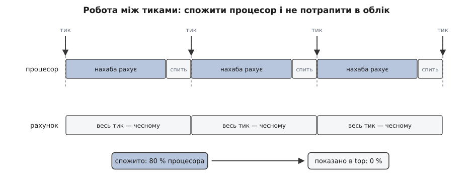

# 📜 Годинник із розетки: як тик став обліком, потім ABI, а потім дірою в безпеці

Числа `utime` і `stime`, які сьогодні віддає `/proc`, походять від однієї апаратної дрібниці 1970-х: у першого Unix єдиним джерелом регулярного часу був імпульс, знятий із мережі змінного струму, що живила машину. З того імпульсу виросло все інше — спосіб обліку вибіркою, форма виклику `times`, одиниця «сота частка секунди», яку вже не змінити, і, через тридцять років, атака, що дозволяє непривілейованому процесові з'їсти більшість процесора й показуватися в `top` нулем.

## Міряти не було чим

PDP-11, на якому Unix виріс, не мав нічого схожого на лічильник тактів процесора. Щоб ядро взагалі відчувало плин часу, у машину ставили окрему плату — годинник. Найдешевший і найпоширеніший, KW11-L (*Line Time Clock*, «годинник від мережі»), не мав власного генератора: він випрямляв змінний струм із блока живлення й перетворював переходи синусоїди через нуль на переривання. Частота такого годинника дорівнювала частоті освітлювальної мережі — 60 Гц у США, 50 Гц у Європі. Була й альтернатива, програмований KW11-P із кварцом, але саме лінійний варіант стояв у більшості машин; шоста редакція Unix вимагала хоч якогось із двох і без нього просто панікувала при старті.

Тобто ядро отримувало рівно один різновид часової події: «минула шістдесята частка секунди». Ніяких «прочитати поточний час на вимогу» — не було звідки читати. У `param.h` шостої редакції стоїть один рядок:

```c
#define HZ      60      /* Ticks/second of the clock */
```

Це не налаштування, а опис фізики місцевої розетки. Європейська машина на 50 Гц із цим числом відлічувала б секунду на п'яту частину довшу за справжню, — і константу доводилося правити перед складанням ядра. *(Останнє — висновок із того, як влаштований лінійний годинник, а не окреме свідчення; сама константа й вимога плати задокументовані в джерелах шостої редакції.)*

Тепер про облік. Обробник переривання годинника в `clock.c` шостої редакції має під рукою збережене слово стану процесора — `ps`. З нього видно, у якому режимі машина працювала в мить переривання. І весь облік процесорного часу в першому Unix — це буквально дві гілки:

```c
if((ps&UMODE) == UMODE) {
        u.u_utime++;
        ...
} else
        u.u_stime++;
```

Ніхто нічого не міряв. Ядро питало «де ти зараз?» шістдесят разів на секунду й додавало одиничку в ту з двох скарбничок, куди влучило питання. Це вибірка не тому, що хтось обрав статистику замість точності, а тому, що альтернативи фізично не існувало: єдиний доступний годинник цокав шістдесят разів на секунду, і в проміжку між цоканнями ядро було сліпе.

Варто затримати на цьому увагу. Багато рішень у Unix пізніше виявилися елегантними принципами; це — не принцип, а відбиток того, що́ можна було купити в DEC у 1975 році. Про те, звідки в ядрі беруться тики й що прийшло їм на зміну, коли з'явилися апаратні лічильники, — [Час у ядрі: тики й джерела часу](book:unix-linux/kernel-timekeeping).

## Чотири числа виклику `times`

Скарбнички треба було якось показати назовні. Так з'явився виклик `times`, і його форма шостої редакції варта того, щоб на неї подивитися:

```c
struct tbuffer {
        int     proc_user_time;
        int     proc_system_time;
        int     child_user_time[2];
        int     child_system_time[2];
};
```

Посібник до нього закінчується фразою «All times are in 1/60 seconds» — усі часи в шістдесятих частках секунди. Одиниця обліку тут не абстрактна «одиниця часу», а безпосередньо тик тієї самої плати.

У структурі впадає в око асиметрія. Власні часи процесу — по одному машинному слову, дитячі — по два. На PDP-11 слово має 16 бітів, тож власний лічильник переповнюється після 32767 тиків, тобто приблизно через дев'ять хвилин процесорного часу; дитячі, зібрані в подвійне слово, живуть незрівнянно довше. *(Це висновок із оголошених типів, а не з окремого коментаря авторів.)* Асиметрія має сенс: окрема програма в тодішньому розкладі життя рідко молотила довше за кілька хвилин, а от оболонка накопичувала суму по всіх командах сеансу — і саме її переповнення було б помітним.

Звідси й друга особливість, яка дожила до сьогодні: дитячі поля містять час **лише тих нащадків, яких уже поховано**. Час дитини не «тече» в батька безперервно — він одним стрибком додається до батькових полів у момент, коли батько збирає статус померлого нащадка; про сам цей момент — [Завершення, wait і зомбі](book:unix-linux/exit-wait-zombies). Логіка чисто бухгалтерська: поки процес живий, його час належить йому, а коли він зникає, рахунок мусить кудись перейти, інакше споживання загубиться.

Сучасний `times` із `struct tms` — це той самий інтерфейс із перейменованими полями: `tms_utime`, `tms_stime`, `tms_cutime`, `tms_cstime`. Змінилися типи (`clock_t` замість голого `int`) і одиниця, але не задум: чотири числа, з яких два — про мертвих дітей.

## Сота частка секунди, що закам'яніла

Далі відбулося те, що трапляється з кожним успішним інтерфейсом: апаратура, яка його породила, зникла, а число лишилося.

Linux на i386 аж до гілки 2.4 включно мав `HZ` = 100 — тик у 10 мс. У 2.6.0 частоту підняли до 1000, щоб зменшити затримки; з 2.6.13 `HZ` став параметром складання ядра зі значеннями 100, 250 (типове) або 1000. Внутрішня частота тепер залежить від того, під що зібрали ядро.

А `/proc/<pid>/stat` як віддавав час у сотих частках секунди, так і віддає. Не в наносекундах, не в тиках чинного `HZ` — у фіксованих сотих. Це окрема константа ядра, `USER_HZ`, і вона дорівнює 100 на всіх поширених архітектурах Linux незалежно від того, скільки разів на секунду ядро насправді цокає.

Причина не технічна, а договірна. Кожна програма, що читає `/proc` — `ps`, `top`, кожен агент моніторингу, кожен скрипт, який ділить `utime` на «сто», — покладається на це число. Змінити його означало б тихо зіпсувати арифметику в усіх них одразу: ніхто не впаде з помилкою, просто всі почнуть показувати неправильні відсотки. Це рівно той різновид обіцянки, який ядро Linux не порушує принципово, — [Стабільність ABI простору користувача](book:unix-linux/userspace-abi-stability).

Формально вихід залишили: правильний спосіб дізнатися одиницю — не вписувати сотню в код, а спитати `sysconf(_SC_CLK_TCK)`. Ядро передає це значення кожному щойно завантаженому виконуваному файлу окремим записом `AT_CLKTCK` у допоміжному векторі ELF, звідки його й бере бібліотека C; про сам механізм передавання — [Допоміжний вектор](book:unix-linux/auxiliary-vector). Тобто механіку зміни передбачили заздалегідь. Але оскільки правильний спосіб десятиліттями повертав ту саму сотню, величезна кількість коду просто вписала її константою — і тепер механіка є, а скористатися нею не можна. Гачок, за який ніхто не тягнув так довго, що він приріс.

## 2007: як із вибірки зробили зброю

Тридцять років вибіркового обліку вважалися питанням точності: усі знали, що `utime` трохи бреше, і мирилися з цим, бо в середньому по багатьох тиках похибка гасне. Що бреше вона керовано — помітили аж у 2007-му.

Дан Цафрір (Dan Tsafrir), Йоав Ецйон (Yoav Etsion) і Дрор Ґ. Файтельсон (Dror G. Feitelson) з Єврейського університету в Єрусалимі доповіли на 16-му симпозіумі USENIX Security роботу «Secretly Monopolizing the CPU Without Superuser Privileges» — «Таємна монополізація процесора без привілеїв суперкористувача» (серпень 2007, с. 239–256). Приводом, за їхнім же зізнанням у примітці, була суперечка аспірантів за доступ до факультетського обчислювального кластера перед дедлайнами; атаку вони придумали, але в суперечці не застосували — крім одного експерименту, погодженого з адміністраторами. У пролозі автори згадують, що дещо з тих ідей нібито реалізував Цутому Сімомура (Tsutomu Shimomura) в Прінстоні близько 1980 року, і тут-таки чесно позначають статус: жодного опублікованого чи детального опису вони не знайшли. Це переказ, не документований пріоритет.

Ідея атаки виростає прямо з двох гілок `clock.c`. Якщо рахунок виставляють у мить тику й тому, кого тик застав, то достатньо в цю мить **не працювати**.

Механізм тримається на двох спостереженнях. Перше: у тикових системах пробудження за таймером теж обробляється в тику, тож процес, який заснув на нуль наносекунд, прокинеться одразу **після** найближчого тику — і почне свій відрізок роботи з чистого аркуша. Друге: скільки триває тик у тактах процесора, легко виміряти самому — тисяча таких «нульових снів» поспіль дає середню довжину проміжку, а лічильник тактів (`rdtsc`) читається без жодних привілеїв. Далі програма працює рівно задану частку виміряного проміжку, звіряючись із лічильником, і засинає на нуль наносекунд, доки тик не мине. Увесь нахабний процес — десяток рядків на C, жодних привілеїв, стандартні POSIX-виклики.



*Верхня смуга — що́ насправді робить процесор усередині трьох послідовних тиків. Нижня — що́ про це записано в облік. Оскільки тик забирає ту задачу, яку застав, увесь час без винятку дістається чесному процесові, а нахаба лишається з нулем у графі споживання.*

Виміряний результат: на Pentium-IV 2.8 ГГц під Linux 2.6.16 із типовим тиком 250 Гц (4 мс) нахаба, налаштований на 80 %, узяв 80.27 % процесора, чесний обчислювальний сусід — 19.72 %, решта системи — 0.01 %. Рахунок при цьому виглядав так: нахабі, який щоразу працював трохи більше за 3 мс, виставляли **нуль**, а чесному, який реально працював менше за мілісекунду, — цілі 4 мс.

Прикметно, що це не одна діра, а дві, і друга гірша за першу. Перша — облік: споживання не видно. Друга — планувальник: система бачить процес, який постійно засинає сам, і робить із цього висновок, що він інтерактивний, а отже заслуговує на пріоритет. Тобто та сама поведінка, якою нахаба ховається від обліку, ще й піднімає його в черзі — тому він щоразу і встигає стартувати першим після тику. Про цю логіку — [Планувальник: як ядро ділить час](book:unix-linux/scheduler-model).

Автори написали й латку: кілька десятків рядків до 2.6.16, які тримають залишок кванта в наносекундах і оновлюють його не лише в тику, а й перед кожним перемиканням контексту — «лінивий точний рахунок». Дешево саме тому, що перемикання контексту трапляються значно рідше за системні виклики й самі собою коштують багато, тож зайве читання лічильника тактів на їхньому тлі непомітне. Для порівняння, точний облік на кожному вході в ядро — а так роблять Solaris і Windows XP — коштує два `rdtsc` плюс 64-бітну арифметику, близько 200 тактів на тій самій машині, і додає 20–47 % до тривалості коротких системних викликів.

І тут експеримент дав найповчальніший результат усієї роботи: латка **не допомогла**. Планувальник тепер знав про нахабу все — і однаково віддавав йому 80 %, бо евристика інтерактивності повертала «інтерактивний» процес назад в активну чергу замість того, щоб визнати його квант вичерпаним. Атака померла лише після того, як прибрали й це повернення. Мати правильні числа й користуватися ними — різні речі.

## Що з цього лишилося

Тикова вибірка `utime`/`stime` на x86 нікуди не поділася: [`/proc`](book:unix-linux/proc-filesystem) і досі показує суми, набрані опитуванням, і досі в сотих частках секунди. Що змінилося — планувальник. Сучасне ядро веде спожитий час задачі окремо, у наносекундах, оновлюючи його з монотонного джерела при кожному перемиканні контексту, і рішення про чесність поділу ухвалює саме за цим числом, а не за тиками. Це рівно та «лінива точність», яку запропонували 2007 року: облік для звітності лишили дешевим і приблизним, облік для рішень зробили точним.

Тож у сьогоднішньому ядрі співіснують два різні уявлення про час однієї задачі: те, у яке вірить планувальник, і те, яке бачить `top`. Перше народилося з відповіді на атаку. Друге — з частоти освітлювальної мережі в Нью-Джерсі.
