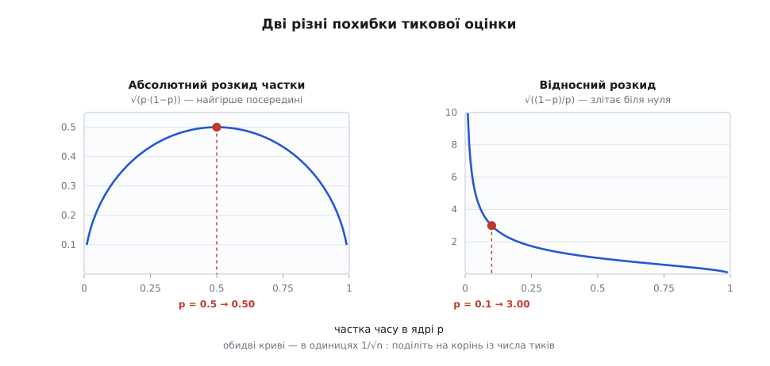
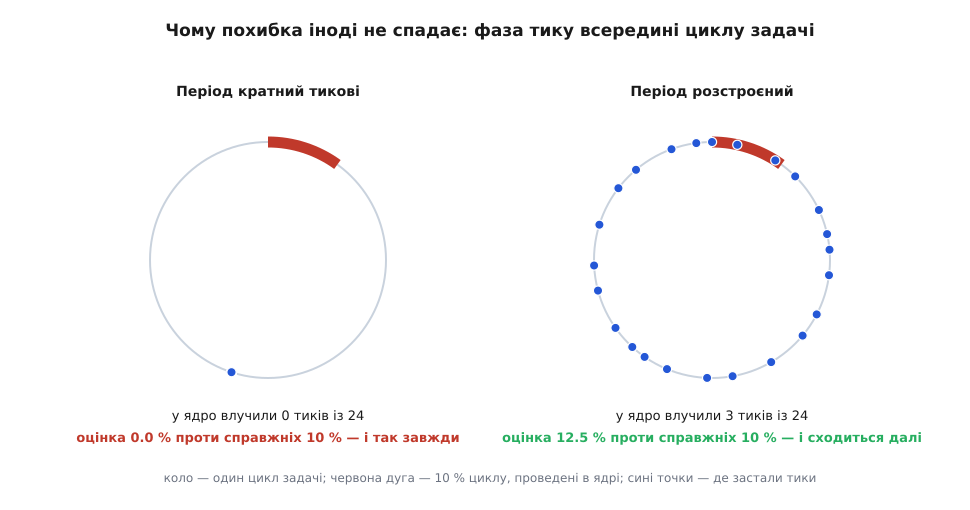

# 🧮 Математика тикової вибірки

Тиковий облік видає число, якого ніхто не міряв, — і питання, чого це число варте, має точну відповідь у формулах. Нижче виведено розкид оцінки й межі, у яких їй можна вірити; далі — алгебра, якою ядро зшиває вибіркову пропорцію з точною сумою, і випадок, коли вся ця статистика перестає працювати взагалі.

## Що саме тут випадкове

Спокуса сказати «задача випадково опиняється в ядрі» — і вона хибна. Задача цілком детермінована: це програма, яка виконує ті самі інструкції в тому самому порядку. Випадкового в ній немає нічого.

Випадкова тут **фаза** — зсув між сіткою тиків і власною лінією часу задачі. Позначмо режим задачі функцією `m(t)`, що дорівнює 1, коли задача в цю мить усередині коду ядра, і 0, коли у власному коді. Аргумент `t` — не настінний час, а спожитий процесорний: коли задача спить, лінія стоїть. Тик номер `i` застає задачу в момент `τᵢ`, і облік записує значення `Xᵢ = m(τᵢ)`.

Уся статистика тримається на двох різних припущеннях про моменти `τᵢ`, і їх варто одразу розділити, бо ламаються вони по-різному:

```
(A) кожен момент τᵢ рівноймовірно падає будь-куди на лінію часу задачі
    ⟹ P(Xᵢ = 1) = p,  де p — справжня частка часу в ядрі

(B) різні Xᵢ між собою незалежні
```

Припущення (A) відповідає за те, що оцінка влучає в ціль; (B) — за те, як швидко вона до цілі збігається. Це не одне й те саме твердження, і далі буде видно, що ціна їхнього порушення теж різна. Разом вони перетворюють кожен тик на [незалежну спробу](topic:math/independent-trials) з двома наслідками — спробу Бернуллі.

## Незміщеність дається задарма, дисперсія — ні

Кількість тиків, що влучили в ядро, — це `k = X₁ + … + Xₙ`, а оцінкою частки служить `p̂ = k/n`. Порахуймо, чого вона варта.

Середнє однієї спроби береться з означення:

```
E[Xᵢ] = 1·p + 0·(1−p) = p
```

Далі — сама лише лінійність середнього:

```
E[p̂] = E[(X₁ + … + Xₙ)/n] = (1/n)·(E[X₁] + … + E[Xₙ]) = (1/n)·n·p = p
```

Оцінка **незміщена**: у середньому по багатьох прогонах вона дає рівно `p`. Зверніть увагу, чого тут не знадобилося — незалежності. Середнє суми дорівнює сумі середніх завжди, хоч би як складові були переплетені між собою. Незміщеність тримається на самому лише припущенні (A).

З розкидом інакше. Дисперсія однієї спроби рахується через маленький трюк: `Xᵢ` набуває тільки значень 0 і 1, а для них `Xᵢ² = Xᵢ`, отже й `E[Xᵢ²] = E[Xᵢ] = p`.

```
Var(Xᵢ) = E[Xᵢ²] − (E[Xᵢ])² = p − p² = p·(1−p)
```

А ось перехід до дисперсії суми вже потребує (B): [дисперсії](topic:math/mean-variance) додаються лише для некорельованих доданків.

```
Var(k)  = n·p·(1−p)                         ← тут працює припущення (B)
Var(p̂) = Var(k)/n² = p·(1−p)/n
σ(p̂)   = √( p·(1−p)/n )
```

Звідси й славетний корінь. Він не має жодного стосунку до тиків як таких: це загальна властивість додавання `n` некорельованих величин — дисперсії ростуть як `n`, а розкид як `√n`, тож розкид середнього спадає як `1/√n`. Тим самим коренем [складаються будь-які випадкові похибки](topic:math/error-propagation), а сам розподіл кількості влучань — [біноміальний](topic:math/binomial-distribution).

## Дві похибки, які легко переплутати

Формула вище описує розкид **частки**. Але `/proc` показує не частку, а секунди, і поведінка похибки там протилежна.

Лічильник `stime` набирає по `1/HZ` секунди за влучання, а всього тиків за час роботи `T` набереться `n = T·HZ`. Підставмо:

```
stime  = k / HZ
σ(stime) = σ(k)/HZ = √( n·p·(1−p) ) / HZ

підставляємо n = T·HZ:

σ(stime) = √( T·HZ·p·(1−p) ) / HZ = √( T·p·(1−p) / HZ )
```

Результат варто прочитати повільно. Похибка **в секундах росте** як `√T`. Похибка **в частках спадає** як `1/√n`. Обидва твердження правильні одночасно й описують ту саму оцінку: що довше працює програма, то менше вона помиляється відносно, і то більше — абсолютно.

Помножимо на конкретні числа. Задача працює 10 секунд і проводить у ядрі десяту частку часу:

```
T = 10 s,  p = 0.1,  p·(1−p) = 0.09

HZ = 100  → σ = √(10·0.09/100)  = √0.0090 = 0.0949 s  ≈ 95 ms
HZ = 250  → σ = √(10·0.09/250)  = √0.0036 = 0.0600 s  ≈ 60 ms
HZ = 1000 → σ = √(10·0.09/1000) = √0.0009 = 0.0300 s  ≈ 30 ms
```

Залежність від частоти тиків теж коренева: `σ ∝ 1/√HZ`. Учетверо частіші тики зменшують похибку лише вдвічі — саме тому підняти HZ як спосіб полагодити облік працює кепсько, а коштує дорого.

## Скільки часу тримається остання цифра

Тепер можна поставити питання, заради якого все це рахувалося: коли похибка `stime` менша за одиницю, у якій його друкують? У `/proc/<pid>/stat` одиниця — сота частка секунди, тобто `u = 0.01 s`.

```
σ(stime) ≤ u
√( T·p·(1−p)/HZ ) ≤ u
T ≤ u²·HZ / ( p·(1−p) )
```

Нерівність дала **стелю** на час роботи, а не підлогу. Це прямий наслідок того, що абсолютна похибка росте: чекати, доки вона впаде нижче одиниці виводу, марно — вона від чекання тільки більшає. Умова виконується на коротких прогонах і перестає виконуватися на довгих.

Порахуймо цю стелю для `u = 0.01 s` (у дужках — те саме в тиках, `nₘₐₖₛ = Tₘₐₖₛ·HZ`):

```
                 HZ = 100        HZ = 250         HZ = 1000
p = 0.5      0.040 s  (4)     0.100 s  (25)     0.400 s  (400)
p = 0.1      0.111 s  (11)    0.278 s  (69)     1.111 s  (1111)
p = 0.01     1.010 s  (101)   2.525 s  (631)   10.101 s  (10101)
```

Отже на звичайній настільній збірці задача, що витрачає в ядрі десяту частку часу, має довірену останню цифру `stime` лише перші чверть секунди свого життя. Далі шум перевищує крок виводу, і молодші розряди надрукованого числа перестають нести інформацію — хоч друкуються справно й виглядають переконливо.

Помітно й інше: стеля росте як `HZ²` у тиках і лише як `HZ` у секундах, а найгірша вона посередині, при `p = 0.5`. Множник `p·(1−p)` максимальний саме там.

## Чому малий sys коштує найдорожче

Абсолютна похибка — не завжди те, що болить. Частіше питають інакше: скільки треба тиків, щоб помилитися не більше ніж на `ε` **від самого значення**. Це відносна похибка:

```
σ(p̂)/p = √( p·(1−p)/n ) / p = √( (1−p)/(n·p) )
```

Розв'яжімо відносно `n`:

```
n ≥ (1−p) / ( p·ε² )
```

Два множники тут працюють проти нас незалежно. Квадрат у `ε²` означає, що вдесятеро точніша відповідь коштує в сто разів довшого вимірювання. А `p` у знаменнику означає, що чим менша частка, тим дорожче її виміряти.

```
                ε = 10 %                    ε = 1 %
p = 0.5      100 тиків  (0.4 s)        10 000 тиків  (40 s)
p = 0.1      900 тиків  (3.6 s)        90 000 тиків  (6 хв)
p = 0.01   9 900 тиків  (40 s)        990 000 тиків  (66 хв)
```

У дужках — час роботи при HZ = 250. Останній рядок варто запам'ятати: щоб дізнатися з точністю до відсотка системний час задачі, яка проводить у ядрі один відсоток свого часу, треба понад годину процесорного часу. Не годину настінного очікування — годину безперервної роботи саме цієї задачі.



*Дві криві описують ту саму оцінку й ведуть себе протилежно. Абсолютний розкид частки найгірший при p = 0.5 і зникає на краях. Відносний — навпаки: біля нуля він необмежений, бо ділиться на дедалі менше значення. Обидві шкали дано в одиницях 1/√n, тож для конкретного числа тиків їх треба поділити на корінь із n.*

## Коли тиків мало: нуль як найімовірніша відповідь

Формула `p ± σ` мовчки припускає, що розподіл симетричний і схожий на дзвін. [Центральна гранична теорема](topic:math/central-limit) справді робить його таким, але не одразу: біноміальний розподіл наближається нормальним, коли `n·p·(1−p)` сягає хоча б десятка. При меншому добутку [довірчий інтервал](topic:math/confidence-interval) виду `±2σ` бреше, бо розподіл сильно скошений.

Що там відбувається насправді, видно з імовірності найгіршого результату — жодного влучання:

```
P(k = 0) = (1−p)ⁿ ≈ e^(−n·p)        при малому p
```

Підставмо `n·p = 1`, тобто випадок «у середньому один тик має влучити»:

```
e^(−1) = 0.3679

n = 250, p = 0.004  →  (0.996)²⁵⁰ = 0.3671
n = 100, p = 0.01   →  (0.99)¹⁰⁰   = 0.3660
```

Понад третина прогонів покаже рівно нуль. Задача, що працює секунду при HZ = 250 і чесно витрачає в ядрі 0.4 % часу, у трьох випадках із восьми отримає `stime = 0` — і жодного натяку, що це не справжній нуль. У цій області оцінка описується [статистикою Пуассона](topic:math/poisson-statistics), де відповідь — маленьке ціле число, а не величина з похибкою.

## Алгебра масштабування

Тепер перейдімо від вибірки до того, що з нею роблять далі. На вході три числа: точна сума `r`, виміряна планувальником, і два тикові лічильники `u` та `s`. На виході має бути пара, що складається рівно в `r`.

```
T  = u + s                  повний тиковий час
s′ = r · s / T              масштабована системна складова
u′ = r − s′                 користувацька — відніманням
```

**Твердження 1: пропорція зберігається.** Розкриймо `u′`:

```
u′ = r − r·s/T = r·(T − s)/T = r·u/T

звідси   s′/u′ = (r·s/T)/(r·u/T) = s/u
         s′/(s′+u′) = s/T
```

Тобто перетворення робить рівно одне: бере частку, здобуту вибіркою, і прикладає її до довжини, здобутої вимірюванням. Жодної нової інформації воно не додає.

**Твердження 2: сума точна — але лише завдяки відніманню.** Формула `u′ = r·u/T` симетрична й на папері рівносильна, проте в цілих числах вона зіпсувала б суму. Ділення в ядрі — з відкиданням дробової частини, тобто [підлога](topic:math/floor-division). Оскільки `r·s/T + r·u/T = r` точно, дробові частини цих двох виразів у сумі дають або 0, або 1, а отже:

```
⌊r·s/T⌋ + ⌊r·u/T⌋  ∈  { r − 1,  r }
```

Одна наносекунда іноді просто зникає. Ось приклад із реальними порядками величин:

```
r = 12 000 000 000 нс,   s = 1 800 000 000,   u = 9 200 000 000,   T = 11 000 000 000

⌊r·s/T⌋ =  1 963 636 363
⌊r·u/T⌋ = 10 036 363 636
сума    = 11 999 999 999   ≠ r    (бракує 1 нс)
```

Відніманням же `u′ = r − s′` сума дорівнює `r` тотожно, за побудовою, за будь-якого округлення `s′`. Тому в ядрі масштабують саме одну складову, а другу добирають.

**Твердження 3: масштабування не зменшує статистичної похибки.** Це найважливіше й найменш очевидне. Запишімо `s′` через оцінку частки: `s = p̂·T`, отже `s′ = r·p̂`. Величина `r` виміряна точно, тобто множник детермінований, і весь розкид приходить від `p̂`:

```
σ(s′) = r · σ(p̂) = r · √( p·(1−p)/n )

при r ≈ T і n = T·HZ:

σ(s′) = T · √( p·(1−p)/(T·HZ) ) = √( T·p·(1−p)/HZ )
```

Той самий вираз, що й для сирого тикового `stime`. Масштабування виправляє **суму** — розбіжність між `u + s` і `r`, яка була систематичною, — і не чіпає **шум поділу**, який був і лишається випадковим. Пара чисел після нього сходиться з реальністю в сумі й помиляється поодинці рівно так само, як раніше.

## Де губиться наносекунда

Добуток `r·s` для довгоживучої задачі легко переростає 64 біти: при `r` порядку 10¹² нс і `s` порядку 10¹¹ це вже 10²³, тоді як стеля 64-бітного числа — близько 1.8·10¹⁹. Тому множення й ділення роблять однією операцією `mul_u64_u64_div_u64(s, r, s + u)`, яка тримає проміжний добуток у 128 бітах і відкидає дробову частину лише наприкінці, при поділі.

Наслідок для похибки: вона обмежена однією наносекундою й **не накопичується**. Причина не в акуратності ділення, а в тому, що `s′` щоразу рахують наново з поточних лічильників, а не додають приріст до попереднього значення. Помилка округлення не має де осісти: попереднього результату у формулі немає.

Варто побачити, чого коштувала б відсутність 128-бітного проміжку. Тоді довелося б заздалегідь ужимати операнди — скажімо, зсувати `r` і `T` праворуч на `b` бітів, доки добуток не влізе. Кожен зсув відкидає молодші біти обох чисел, тож відносна похибка результату стає порядку `2⁻ᵐ`, де `m` — скільки значущих бітів лишилося в меншому з операндів. Ця похибка залежить уже не від одиниці молодшого розряду, а від **величини** чисел: що довше живе задача, то більше бітів довелося зрізати й то грубіша відповідь. Точне 128-бітне множення прибирає цю залежність повністю.

## Храповик монотонності

До масштабування додано ще одну вимогу: видані назовні значення не сміють меншати. Ядро тримає попередню видану пару `(u_прв, s_прв)` з інваріантом `u_прв + s_прв = r_прв` і застосовує два підтягування:

```
1)  якщо s′ < s_прв  →  s′ = s_прв
2)  u′ = r − s′
3)  якщо u′ < u_прв  →  u′ = u_прв,   s′ = r − u′
```

**Чому цього досить для обох складових.** Спирається доведення на монотонність `r`: планувальник ніколи не зменшує суму, тож `r ≥ r_прв`. Розберімо три випадки.

```
Випадок 1.  s′ = r·s/T ≥ s_прв, а після кроку 3 не змінилося.
            Обидві складові не менші за попередні за побудовою.

Випадок 2.  Спрацював крок 1: s′ = s_прв. Тоді

            u′ = r − s_прв = r − (r_прв − u_прв) = (r − r_прв) + u_прв ≥ u_прв

            бо r ≥ r_прв. Користувацька складова зросла сама собою.

Випадок 3.  Спрацював крок 3: u′ = u_прв. Тоді

            s′ = r − u_прв ≥ r_прв − u_прв = s_прв

            тобто підтягування u′ не зіпсувало гарантії для s′.
```

У всіх трьох випадках жодна складова не зменшилася, а сума лишилася точно `r`. Окремо ядро перевіряє й вироджений випадок: якщо `s_прв + u_прв ≥ r`, воно просто віддає стару пару без перерахунку — інакше інваріант зламався б.

**Ціна.** Підтягування руйнує твердження 1: після нього пропорція на виході вже не та, яку намалювала вибірка. Ось два послідовні читання:

```
Читання 1:  r = 10.000 s,  u = 8.000,  s = 2.000,  T = 10.000
            s′ = 10.000 · 2.000/10.000 = 2.0000
            u′ = 8.0000                            запам'ятали пару

Читання 2:  r = 10.100 s,  u = 8.400,  s = 2.000,  T = 10.400
            s′ = 10.100 · 2.000/10.400 = 1.9423    менше за 2.0000 → підтягуємо
            s′ = 2.0000,   u′ = 10.100 − 2.000 = 8.1000

            вибірка каже:  2.000/10.400 = 0.19231
            видано:        2.000/10.100 = 0.19802
```

Між двома читаннями системна складова не набрала жодного тику, зате користувацька набрала — тобто частка `sys` за вибіркою впала. Назовні ж вона зросла. Видане число більше не є оцінкою чогось; воно є максимумом із того, що коли-небудь виходило.

Звідси менш очевидний наслідок. Операція `max` над шумною послідовністю зміщена вгору: середнє максимуму більше за середнє окремого значення, і росте з кількістю доданих членів — це звичайна поведінка [порядкових статистик](topic:math/order-statistics). Отже **зміщення залежить від того, як часто читають**. Монітор, що опитує `/proc` десять разів на секунду, бачить систематично завищене `stime` там, де монітор із хвилинним кроком побачив би чесну оцінку. Симетричний шум вибірки підтягування перетворює на однобокий нахил.

Коли саме підтягування спрацьовує, теж рахується. Умова — щоб масштабоване значення впало:

```
r′·p̂′ < r·p̂     ⟺     (p̂ − p̂′)/p̂  >  (r′ − r)/r′
```

Тобто відносне провалля оцінки має перевищити відносний приріст часу між читаннями. Типовий розмах провалля — це відносний розкид `σ(p̂)/p = √((1−p)/(n·p))`, порахований вище:

```
p = 0.5,  n =  2 500  →  2.0 %
p = 0.1,  n =  2 500  →  6.0 %
p = 0.01, n =  2 500  → 19.9 %
p = 0.1,  n = 25 000  →  1.9 %
```

Читання, розділені меншим приростом часу, ніж ці відсотки, регулярно натраплятимуть на підтягування. Для десятисекундної задачі з `p = 0.1` це означає будь-яку пару читань, ближчих ніж 0.6 секунди одне до одного.

## Коли похибка перестає бути випадковою

Лишилося порахувати ціну припущення (A) — того самого, на якому трималася незміщеність. Задача детермінована; випадковість була тільки в фазі. Що як фаза теж не випадкова?

Нехай поведінка задачі періодична з циклом `T_ц`, а тики йдуть із періодом `T_т = 1/HZ`. Тоді момент, у який тик номер `i` застає задачу всередині її циклу, дорівнює

```
φᵢ = ( φ₀ + i·T_т )  mod  T_ц
```

Це вже не випадкові точки, а арифметична прогресія на колі — поворот кола на сталий кут щокроку. Позначмо часткою оберту `α = (T_т / T_ц) mod 1`. Уся доля оцінки залежить від арифметичної природи цього числа.

**Якщо `α` раціональне**, `α = a/q` у нескоротному вигляді, прогресія відвідує рівно `q` точок циклу й більше нікуди не потрапляє. Оцінка збігається не до `p`, а до середнього `m` по цих `q` точках:

```
p̂ → (1/q) · Σ_{j=0}^{q−1} m( φ₀ + j·T_ц/q )
```

Різниця між цим середнім і справжнім `p` — стале зміщення. Воно не спадає з `n` взагалі: скільки не додавай тиків, вони лягають у ті самі `q` точок. Найгірший випадок `q = 1` настає, коли період тику кратний періодові задачі (зокрема коли вони рівні): усі тики застають задачу в одній-єдиній фазі, і оцінка дорівнює 0 або 1 залежно від того, що там опинилося.

**Якщо `α` [ірраціональне](topic:math/irrational-numbers)**, послідовність `{i·α}` [рівномірно розподілена](topic:math/equidistribution) на колі, і `p̂ → p`. Цей факт — теорему про рівномірний розподіл дробових часток кратних ірраціонального числа — довели незалежно троє протягом 1909–1910 років: Пірс Боль (латвійський математик балтійсько-німецького роду, народжений у Валці в Ліфляндії тодішньої Російської імперії, працював у Ризькій політехніці), Герман Вейль (німець) і Вацлав Серпінський (поляк). Вейлеві належить і загальний критерій рівномірності через експоненційні суми, здобутий пізніше. Потрійне незалежне авторство тут — усталений факт, не спірна атрибуція.

Швидкість збіжності при цьому **вища за випадкову**. Відхилення рівномірності для повороту кола спадає приблизно як `log n / n`, а не як `1/√n`; наскільки добре — залежить від того, як `α` наближається [ланцюговими дробами](topic:math/continued-fractions). Погано наближувані числа збігаються найшвидше. Це той самий принцип, на якому квазівипадкові послідовності обганяють [метод Монте-Карло](topic:math/monte-carlo-propagation).

**Практична величина — час зносу фази.** Нехай `d` — відстань від `T_т` до найближчого кратного `T_ц`. За тик фаза зсувається на `d`, отже повний обхід циклу займає

```
N = T_ц / d   тиків
```

Доки `n ≪ N`, вибірка сидить майже в одній фазі, і оцінка зміщена. Аж коли `n` перевищить кілька `N`, зміщення розсмоктується. Порахуймо для аудіообробника з циклом 4.0001 мс при HZ = 250 (`T_т` = 4.0000 мс):

```
d = 0.0001 мс
N = 4.0001 / 0.0001 = 40 001 тиків = 160 секунд
```

Десятисекундний прогін такої задачі виміряно цілком в одній фазі — число буде хибним і стабільним, що найгірше: воно повторюється від запуску до запуску й тому виглядає надійним. Десятихвилинний прогін виміряно чесно.

Ось прямий рахунок трьох режимів. Задача справді проводить у ядрі `p = 0.1`; у таблиці — модуль похибки оцінки. У рядку «замкнений» фаза стала **повз** дугу — той самий бік випадку `q = 1`, що на фігурі нижче й у прикладі з аудіообробником: `p̂ = 0` назавжди. Лягла б вона в дугу — похибка була б 0.9000 на всіх `n`, і це єдина різниця між двома гілками:

```
                       n=10²    n=10³    n=10⁴    n=10⁵    n=10⁶

замкнений (d = 0)      0.1000   0.1000   0.1000   0.1000   0.1000
ледь розстроєний       0.0900   0.0990   0.0999   0.0200   0.0000
   (N = 40 001)
добре розстроєний      0.0000   0.0030   0.0014   0.0000   0.0000
   (N ≈ 29)
випадкова фаза         0.0239   0.0076   0.0024   0.0008   0.0002
```

Три різні закони. Замкнена фаза не збігається ніколи. Ледь розстроєна тримає повну похибку, доки не мине зносу, а тоді провалюється вниз. Добре розстроєна б'є випадкову вибірку на всій довжині — детермінована сітка вкриває цикл рівномірніше, ніж кидання кубика, і подекуди влучає в точне значення. Випадкова ж чесно повзе за своїм `1/√n`.



*Коло — один цикл задачі, червона дуга — та його десята частина, яку задача проводить у ядрі. Ліворуч крок фази нульовий, усі двадцять чотири точки лягли одна на одну повз дугу, і оцінка дорівнює нулю назавжди. Праворуч крок несумірний із циклом: точки розходяться по всьому колу, і частка влучань уже близька до справжньої десятої частки.*

Це те саме явище биття, через яке недостатньо частий відлік сигналу підмінює високу частоту низькою, — [аліасинг](topic:math/aliasing) у чистому вигляді. Тиковий облік відліковує режим задачі частотою HZ, і будь-яка періодичність задачі, сумірна з цією частотою, згортається в сталу похибку.

**Найгірший випадок — коли фазу обирають навмисно.** Якщо задача засинає перед кожним тиком і прокидається одразу після, вона робить `m(τᵢ) = 0` для всіх `i` за побудовою. Тоді `p̂ = 0` з імовірністю одиниця, і `n` не рятує: збільшення кількості спроб допомагає проти шуму, а не проти супротивника, який ті спроби бачить. Математично це означає, що припущення (A) не просто хибне — воно хибне в керований бік. Полагодити таке усередненням неможливо; єдиний вихід — зробити моменти відліку непередбачуваними, тобто повернути в модель ту випадковість, яку вона від початку припускала.

Звідси й підсумкова межа застосовності всієї конструкції. Формула `σ = √(p(1−p)/n)` описує не точність тикового обліку взагалі, а точність за умови незалежної фази. Для рівномірного обчислювального навантаження умова тримається, і похибка справді спадає коренем. Для періодичної задачі вона тримається або ні залежно від арифметики двох періодів. Для задачі, що підлаштовується під тик, вона не тримається ніколи.
