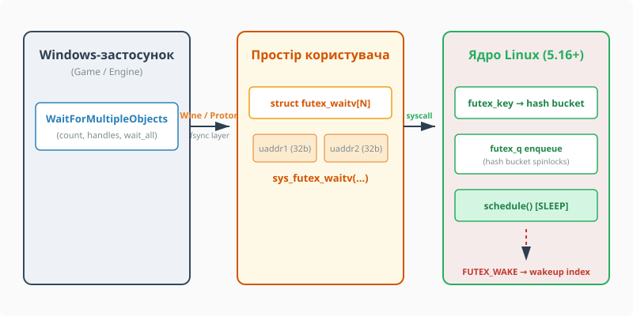

# Багатооб’єктна синхронізація futex2 (sys_futex_waitv)

<preknowlist>
- [Базові концепції futex](book:unix-linux/eventfd-and-futex) — механіка швидкого шляху у просторі користувача, операції `FUTEX_WAIT` та `FUTEX_WAKE`.
- [Потоки та задачі в Linux](book:unix-linux/threads-as-tasks) — модель `task_struct`, керування станами задач та системний виклик `clone()`.
- [Атомарні операції та бар'єри пам'яті](book:unix-linux/atomic-ops) — атомарні інструкції CPU (`CMPXCHG`) та впорядкування пам'яті.
- [Черги очікування ядра](book:unix-linux/kernel-wait-queues) — механізм блокування в ядрі (`wait_queue_head_t`, `schedule()`).
</preknowlist>

Коли завантажений ігровий рушій, сучасне середовище виконання чи високопродуктивний сервер обробляє тисячі паралельних подій, потік часто опиняється в ситуації, де він не може рухатися далі без сигналу від *хоча б одного* з кількох ресурсів. Якщо йдеться про один примітив, класичний `futex(2)` майже ідеальний: без конкуренції захоплення замка коштує десятки наносекунд і взагалі не виходить у ядро, а в ядро потік провалюється лише тоді, коли справді треба заснути. Але щойно чекати доводиться на масив з десяти чи п'ятдесяти змінних, системне програмування в Linux тривалий час опинялося перед архітектурним тупиком. Класичний `futex(2)` спроможний приспати потік виключно за однією віртуальною адресою `uaddr`. Спроба заблокувати потік на першій змінній ігнорує події на дев'яти інших; опитування в циклі (spin polling) марнує такти процесора, а переведення примітивів на файлові дескрипторні об'єкти `eventfd(2)` та `epoll(7)` призводить до виснаження лімітів ядра `open files` та катастрофічних накладних витрат на системні виклики `write(2)`.

Незважаючи на багаторівневу еволюцію операцій `futex()` (`FUTEX_WAIT`, `FUTEX_WAKE`, `FUTEX_REQUEUE`, `FUTEX_CMP_REQUEUE`), ядро Linux до версії 5.16 не надавало атомарного способу приспати потік на масиві з кількох futex-змінних. Цей недолік виявився критичним під час розгортання шарів емуляції Windows NT у Linux (Wine, Proton, Steam Deck). Архітектура Windows NT від початку будувалася довкола виклику `WaitForMultipleObjects()`, де потік засинає до появи сигналу на будь-якому з масиву об'єктів (м'ютекси, події, семафори). Щоб забезпечити нативну швидкість виконання ігор без важкої міжпроцесної емуляції, у ядрі Linux 5.16 з'явився новий системний виклик `sys_futex_waitv` — перший прийнятий компонент підсистеми **futex2**.


*Принцип емуляції Windows-функції WaitForMultipleObjects() за допомогою системного виклику sys_futex_waitv() у середовищі Wine/Proton.*

---

## Проблема множинного очікування: анатомія обмежень класичного futex

Щоб зрозуміти ціну відсутності багатооб'єктного очікування, варто розглянути внутрішню механіку класичного futex (Fast Userspace Mutex). Основна ідея futex полягає у поділі роботи між простором користувача та ядром:
1. **Fast Path (Швидкий шлях)**: Захоплення вільного замка здійснюється атомарною інструкцією процесора (наприклад, `LOCK CMPXCHG` на x86-64) без звернення до ядра. Якщо 32-бітне ціле число в пам'яті дорівнює `0` (вільно), потік атомарно записує туди `1` (зайнято) і миттєво продовжує виконання.
2. **Slow Path (Повільний шлях)**: Якщо замок зайнятий (`1`), потік виконує системний виклик `futex(uaddr, FUTEX_WAIT, val, timeout)`. Ядро перевіряє, чи значення за адресою `uaddr` досі дорівнює `val`. Якщо так, потік додається до черги очікування ядра і засинає. Коли власник звільняє замок, він виконує `futex(uaddr, FUTEX_WAKE, 1)`, сповіщаючи ядро про необхідність розбудити очікуючий потік.

Ця схема бездоганно працює для одиничного об'єкта. Однак при спробі реалізувати семантику `WaitAny` (заснути до події на `f1` АБО `f2` АБО `f3`) класичний API виявляється безсилим. Спроба заблокуватися на `f1` робить потік сліпим до подій на `f2`. Якщо інший потік просигналить `f2`, наш потік і далі марно спатиме на `f1`.

### Альтернативи до futex2 та їхні ціни

До появи `futex_waitv` системні програмісти та розробники Wine використовували три основні підходи, кожен з яких мав серйозні недоліки:

* **Міжпроцесний демон (wineserver)**: Потік звертався через сокет до централізованого демона `wineserver`, який вів облік усіх об'єктів. Кожна дія викликала щонайменше два перемикання контексту. При десятках тисяч звернень до синхронізації на секунду, звичних для ігрового рушія, це створювало відчутні затримки й вантажило CPU.
* **Емуляція через eventfd та epoll (esync)**: Кожен логічний м'ютекс або подію замінювали файловим дескриптором `eventfd(2)`. Для множинного очікування застосовували `epoll_wait(2)`. Схема працювала без `wineserver`, але створювала дві нові проблеми:
  - **Виснаження лімітів FD**: десятки й сотні тисяч об'єктів синхронізації у великій грі вичерпували системний ліміт `open files`, вимагаючи ручного налаштування `ulimit -n 1048576`.
  - **Споживання пам'яті ядром та накладні витрати VFS**: кожен `eventfd` — це окремий `struct file`, власний контекст лічильника та слот у таблиці дескрипторів процесу (inode й dentry в анонімних дескрипторів спільні на всю систему, але решта множиться на кожен об'єкт). Крім того, сигналювання об'єкта вимагало виклику `write(2)`, знищуючи перевагу fast-path.
* **Spin-polling (Активне опитування)**: Потік циклічно опитував значення декількох futex-змінних у користувацькому просторі. Це давало мінімальну затримку реакції, але навантажувало ядро CPU на 100% і розряджало батарею мобільних пристроїв.

Історію того, як екосистема пройшла шлях від повільних міжпроцесних демонів до нативного системного виклику ядра, детально висвітлено у вставці [Еволюція емуляції синхронізації Windows у Linux: від wineserver до futex2](book:unix-linux/futex2-waitv-syscall/hist-esync-fsync-futex2.md).

---

## Системний виклик `sys_futex_waitv`: Контракт та API

Розробники ядра Linux відмовилися від створення єдиного громіздкого системного виклику `futex2()`, який би замінив увесь старий функціонал. Натомість було вирішено впроваджувати невеликі, спеціалізовані виклики. `sys_futex_waitv` став першим із них і був доданий у версії Linux 5.16 (номер виклику `449` на x86_64).

### Сигнатура та структура даних

У просторі користувача виклик оголошується так:

```c
#include <linux/futex.h>
#include <sys/syscall.h>
#include <unistd.h>
#include <time.h>

int futex_waitv(struct futex_waitv *waiters, unsigned int nr_futexes,
                unsigned int flags, struct timespec *timeout, clockid_t clockid);
```

Масив об'єктів очікування передається через вектор структур `futex_waitv`:

```c
struct futex_waitv {
        __u64 val;        /* Очікуване значення futex-змінної */
        __u64 uaddr;      /* Адреса futex-змінної у просторі користувача */
        __u32 flags;      /* Прапорці конкретного futex-об'єкта */
        __u32 __reserved; /* Зарезервовано ядром (мусить бути 0) */
};
```

Детальний перелік розмірів полів, прапорців, системних обмежень та таблицю кодів помилок винесено у довідник [Довідник API та структури futex_waitv](book:unix-linux/futex2-waitv-syscall/api-futex-waitv.md).

### Ключові параметри та правила роботи

1. **`waiters`**: Вказівник на користувацький масив структур `futex_waitv`. Адреса `uaddr` у кожному елементі повинна бути вирівняна на межу розміру futex-змінної (4 байти для `FUTEX_32`).
2. **`nr_futexes`**: Кількість елементів у масиві. Ядро встановлює жорстке верхнє обмеження `FUTEX_WAITV_MAX = 128`. Якщо програма передає `nr_futexes > 128` або `0`, виклик повертає `EINVAL`. Це обмеження захищає ядро від виснаження пам'яті та обмежує обсяг роботи, яку встигає накопичити один системний виклик.
3. **`flags`**: Глобальні прапорці системного виклику. У поточних версіях ядра цей параметр зарезервований і **зобов'язаний дорівнювати 0**.
4. **`timeout` та `clockid`**: Вказівник на абсолютний час очікування `struct timespec` та ідентифікатор годинника (`CLOCK_MONOTONIC` або `CLOCK_REALTIME`). Якщо `timeout == NULL`, потік засинає безлімітно.

### Семантика прапорців елементів (`flags`)

Прапорці всередині кожної структури `futex_waitv` визначають властивості конкретного futex-а:
* **`FUTEX_32` (`0x02`)**: Вказує, що `uaddr` посилається на 32-бітне ціле число; це єдиний підтримуваний розмір, тож прапорець фактично обов'язковий. У 5.16 константи звалися саме `FUTEX_32` і `FUTEX_PRIVATE_FLAG`; згодом UAPI дав їм канонічні імена `FUTEX2_SIZE_U32` і `FUTEX2_PRIVATE`, лишивши старі як синоніми.
* **`FUTEX_PRIVATE_FLAG` (`0x80`)**: Вказує, що futex використовується виключно в межах одного віртуального адресного простору (між потоками одного процесу). Це дозволяє ядру оптимізувати обчислення хешу (використовувати віртуальну адресу замість фізичної сторінки / `inode`).
* **Shared Futex (без `FUTEX_PRIVATE_FLAG`)**: Futex вважається спільним між процесами. Ядро знаходить фізичну сторінку пам'яті та використовує її як ключ хешування, що дозволяє синхронізувати різні процеси через `mmap`.

### Значення повернення та помилки

* **Успіх**: Повертається ціле число у діапазоні `0 .. nr_futexes - 1`, яке вказує **індекс у масиві `waiters`**, чий futex зміг розбудити потік.
* **`EAGAIN`**: Якщо під час входу в ядро значення за адресою `uaddr` для *будь-якого* елемента не збігається з очікуваним `val`, ядро скасовує операцію і негайно повертає `-1` з `errno = EAGAIN`. Виняток один: якщо котрийсь із елементів, поставлених у чергу до виявлення розбіжності, устиг бути розбудженим, виклик поверне його індекс, а не помилку.
* **`ETIMEDOUT`**: Заданий абсолютний час минув, а сигналу так і не було.
* **`EINTR`**: Виклик перервано доставкою сигналу.

---

## Приклад використання: C та ідіоматичний C++

Оскільки бібліотека `glibc` не надає окремої функції-обгортки для `futex_waitv`, системні розробники викликають його через `syscall(2)`. Нижче наведено робочий приклад, у якому головний потік чекає на завершення однієї з двох подій: виконання фонового завдання або виклику зупинки (shutdown). Приклад навмисно спрощено до одного проходу: у бойовому коді виклик завжди загортають у цикл, бо `EAGAIN` (значення вже змінилося) та `EINTR` (сигнал) — це нормальні відповіді ядра, а не збій.

:::tabs
```c
#define _GNU_SOURCE
#include <stdio.h>
#include <stdlib.h>
#include <stdint.h>
#include <pthread.h>
#include <unistd.h>
#include <errno.h>
#include <linux/futex.h>
#include <sys/syscall.h>
#include <time.h>

static inline int sys_futex_waitv(struct futex_waitv *waiters, unsigned int nr_futexes,
                                  unsigned int flags, struct timespec *timo, clockid_t clockid) {
    return syscall(SYS_futex_waitv, waiters, nr_futexes, flags, timo, clockid);
}

static inline int sys_futex_wake(uint32_t *uaddr, int val) {
    return syscall(SYS_futex, uaddr, FUTEX_WAKE | FUTEX_PRIVATE_FLAG, val, NULL, NULL, 0);
}

uint32_t f_task_done = 0;
uint32_t f_shutdown = 0;

void *worker_thread(void *arg) {
    printf("[Worker] Виконую обчислення...\n");
    usleep(200000); /* Імітація роботи 200 мс */
    
    printf("[Worker] Завдання виконано. Сигналізую futex...\n");
    __atomic_store_n(&f_task_done, 1, __ATOMIC_RELEASE);
    sys_futex_wake(&f_task_done, 1);
    
    return NULL;
}

int main(void) {
    pthread_t thread;
    struct futex_waitv waiters[2];

    waiters[0].uaddr = (uint64_t)&f_task_done;
    waiters[0].val = 0;
    waiters[0].flags = FUTEX_32 | FUTEX_PRIVATE_FLAG;
    waiters[0].__reserved = 0;

    waiters[1].uaddr = (uint64_t)&f_shutdown;
    waiters[1].val = 0;
    waiters[1].flags = FUTEX_32 | FUTEX_PRIVATE_FLAG;
    waiters[1].__reserved = 0;

    if (pthread_create(&thread, NULL, worker_thread, NULL) != 0) {
        perror("pthread_create");
        return EXIT_FAILURE;
    }

    printf("[Main] Засинаю на futex_waitv (чекаю f_task_done або f_shutdown)...\n");
    int ret = sys_futex_waitv(waiters, 2, 0, NULL, 0);

    if (ret < 0) {
        perror("[Main] futex_waitv помилка");
    } else {
        printf("[Main] Прокинувся! Індекс розбудженого futex: %d\n", ret);
        if (ret == 0) {
            printf("[Main] Подія: f_task_done завершилася успішно.\n");
        } else if (ret == 1) {
            printf("[Main] Подія: отримано команду shutdown.\n");
        }
    }

    pthread_join(thread, NULL);
    return EXIT_SUCCESS;
}
```
```cpp
#include <iostream>
#include <vector>
#include <array>
#include <thread>
#include <atomic>
#include <chrono>
#include <cstdint>
#include <system_error>
#include <cerrno>
#include <span>
#include <unistd.h>
#include <sys/syscall.h>
#include <linux/futex.h>

class Futex2 {
public:
    static int waitv(std::span<futex_waitv> waiters, 
                     const struct timespec* timeout = nullptr, 
                     clockid_t clockid = CLOCK_MONOTONIC) {
        int res = static_cast<int>(::syscall(SYS_futex_waitv, waiters.data(), 
                                             static_cast<unsigned int>(waiters.size()), 
                                             0, timeout, clockid));
        if (res < 0) {
            throw std::system_error(errno, std::generic_category(), "futex_waitv failed");
        }
        return res;
    }

    static void wake(std::atomic<uint32_t>& futex_var, int count = 1) {
        ::syscall(SYS_futex, reinterpret_cast<uint32_t*>(&futex_var), 
                  FUTEX_WAKE | FUTEX_PRIVATE_FLAG, count, nullptr, nullptr, 0);
    }
};

int main() {
    std::atomic<uint32_t> task_done{0};
    std::atomic<uint32_t> shutdown{0};

    std::thread worker([&task_done]() {
        std::cout << "[Worker] Обчислення у C++...\n";
        std::this_thread::sleep_for(std::chrono::milliseconds(200));
        
        task_done.store(1, std::memory_order_release);
        Futex2::wake(task_done, 1);
    });

    std::array<futex_waitv, 2> waiters{{
        {
            .val = 0,
            .uaddr = reinterpret_cast<uint64_t>(&task_done),
            .flags = FUTEX_32 | FUTEX_PRIVATE_FLAG,
            .__reserved = 0
        },
        {
            .val = 0,
            .uaddr = reinterpret_cast<uint64_t>(&shutdown),
            .flags = FUTEX_32 | FUTEX_PRIVATE_FLAG,
            .__reserved = 0
        }
    }};

    try {
        std::cout << "[Main] Чекаємо через Futex2::waitv...\n";
        int index = Futex2::waitv(waiters);
        std::cout << "[Main] Успішно розбуджено об'єкт з індексом: " << index << "\n";
    } catch (const std::system_error& e) {
        std::cerr << "[Main] Помилка очікування: " << e.what() << "\n";
    }

    worker.join();
    return 0;
}
```
:::

---

## Внутрішня реалізація в ядрі Linux: Алгоритм та запобігання взаємним блокуванням

Реалізація багатооб'єктного очікування вимагала суттєвої перебудови підсистеми futex в ядрі (`kernel/futex/waitv.c` та `kernel/futex/core.c`).

### 1. Структури даних ядра: `futex_q` та Хеш-таблиці

Коли потік чекає на futex, ядро додає елемент очікування до глобальної хеш-таблиці бакетів (futex hash buckets). Ключем є `futex_key`, який обчислюється на основі віртуальної адреси (для `PRIVATE`) або сторінки пам'яті та `inode` (для `SHARED`); за цим ключем ядро знаходить потрібний бакет `struct futex_hash_bucket`.

Кожен об'єкт очікування описується в ядрі структурою `struct futex_q`:
- Містить вказівник на задачу `task_struct`, яка спить.
- Містить ключі `futex_key` та спискові вузли `plist_node` для підключення до хеш-бакета.

У класичному `futex(FUTEX_WAIT)` потік чекав лише на один futex, тому структура `futex_q` розміщувалася прямо на стеку ядра поточної задачі (`current`).

### 2. Динамічний розподіл пам'яті для масиву `futex_q`

У випадку `sys_futex_waitv` потік одночасно чекає на `N` futex-змінних. Це означає, що ядру потрібно створити `N` структур `futex_q`.
- **Виділення в купі ядра**: масив описів очікування (`struct futex_vector`, який містить і копію `futex_waitv`, і саму `futex_q`) ядро виділяє одним `kcalloc()` на весь вектор. Стек ядра для цього не годиться: він малий (кілька сторінок на задачу), а розмір масиву задає користувацький процес.
- **Чому стеля жорстка**: обсяг цього виділення задає користувацький процес, тож обмеження `FUTEX_WAITV_MAX = 128` захищає ядро від перетворення виклику на важіль виснаження пам'яті (Kernel Memory DoS).

### 3. Черги захоплюються по одній: чому тут немає взаємного блокування

Кожен хеш-бакет ядра захищений власним спин-блокуванням `spinlock_t`. Щоб вставити `N` структур `futex_q` у відповідні хеш-бакети, ядро повинно захопити блокування кількох бакетів одночасно.

Якщо два потоки одночасно викликають `sys_futex_waitv` на однакових futex-змінних, але передають їх у різному порядку (`[f1, f2]` проти `[f2, f1]`), без спеціальних заходів виникне взаємне блокування (deadlock): потік А захопить бакет `f1` і чекатиме `f2`, а потік Б захопить бакет `f2` і чекатиме `f1`.

Ядро обходить цю пастку не впорядкуванням ключів, а тим, що **ніколи не тримає більше одного блокування бакета водночас**. Елементи масиву обробляються послідовно:
1. Для чергового `uaddr` обчислюється `futex_key` та відповідний `futex_hash_bucket`, після чого захоплюється спін-блокування саме цього бакета.
2. Ядро читає значення за `uaddr` і порівнює його з очікуваним `val`.
3. Якщо значення збіглося, `futex_q` стає у чергу цього бакета, блокування негайно знімається, і ядро переходить до наступного елемента масиву.

Оскільки в кожен момент утримується щонайбільше один спін-лок, циклічне очікування неможливе за побудовою, і жодне впорядкування адрес не потрібне. Платою є те, що на момент виявлення розбіжності частина масиву вже стоїть у чергах — як ядро з цього виходить, показано в наступному підрозділі.

### 4. Покроковий алгоритм виконання `sys_futex_waitv`

1. **Копіювання даних**: Ядро копіює масив `waiters` із користувацького простору через `copy_from_user()`.
2. **Валідація**: Перевіряються резервні поля `__reserved == 0`, прапорці `FUTEX_32` та вирівнювання адрес.
3. **Обчислення ключів**: для кожного елемента обчислюється `futex_key` і визначається його `futex_hash_bucket`.
4. **Поелементна перевірка й постановка в чергу**: ядро йде масивом від початку; для кожного елемента захоплює блокування його бакета, зчитує значення з пам'яті користувача (`futex_get_value_locked`), порівнює з `val` і, якщо збіглося, ставить `futex_q` у чергу цього бакета та одразу знімає блокування. Усі `futex_q` посилаються на одну й ту саму задачу `current`.
5. **Відкат при розбіжності**: якщо значення чергового futex-а не дорівнює очікуваному `val`, ядро вилучає з черг усі вже поставлені `futex_q`, знову захоплюючи блокування бакетів по одному. Якщо котрийсь із них устиг бути розбудженим у цьому вікні, виклик повертає його індекс; якщо ні — `EAGAIN`.
6. **Засинання (Sleep)**: коли всі `N` елементів стали в черги, стан задачі змінюється на `TASK_INTERRUPTIBLE` і викликається `schedule()`; жодного блокування бакета при цьому не утримується.
7. **Пробудження та Dequeuing**:
   - Інший потік робить `FUTEX_WAKE` для однієї з адрес.
   - Ядро знаходить відповідний `futex_q`, видаляє його з бакета й будить задачу, що на ньому спала.
   - Прокинувшись, задача по черзі захоплює блокування решти бакетів і вилучає з них *усі інші* власні `futex_q`. Той єдиний елемент, якого в черзі вже немає, і є винуватцем пробудження — саме його порядковий номер задача повертає у простір користувача.
8. **Повернення індексу**: Виклик повертає в користувацький простір індекс елемента масиву, який ініціював пробудження.

---

## Крайові випадки та стани гонитви (race conditions)

У багатьох ядерних підсистемах паралельне виконання створює складні крайові випадки. Розглянемо детальніше найважливіші з них.

### 1. Гонитва між зчитуванням та пробудженням (EAGAIN Race)

Найважливішою гарантією `sys_futex_waitv` є запобігання втраченим пробудженням (lost wakeups). Припустимо, Потік A готується викликати `futex_waitv`, а Потік B одночасно змінює значення `f1` і викликає `FUTEX_WAKE`.

Якщо Потік B змінює значення *до того*, як Потік A захопить блокування бакетів в ядрі, зчитування значення у крок 4 виявить розбіжність між `val` і вмістом пам'яті. Ядро негайно повертає `EAGAIN`. Потік A повертається у користувацький простір, повторно перевіряє свої змінні в атомарному циклі і бачить, що `f1` вже сигналізований. Жодного засинання не відбувається і сигнал не втрачається.

### 2. Помилкові (spurious) пробудження та сигнали (`EINTR`)

Якщо під час перебування потоку у стані `TASK_INTERRUPTIBLE` процесу доставляється сигнал (наприклад, `SIGINT` або `SIGALRM`), ядро вилучає всі `futex_q` задачі з бакетів і повертає `-1` з `errno = EINTR`.

Приклад коректної обробки переривань сигналом у користувацькому коді:

:::tabs
```c
int ret;
do {
    ret = sys_futex_waitv(waiters, nr_futexes, 0, &ts, CLOCK_MONOTONIC);
} while (ret < 0 && errno == EINTR);
```
```cpp
int index;
for (;;) {
    try {
        index = Futex2::waitv(waiters, &ts, CLOCK_MONOTONIC);
        break;
    } catch (const std::system_error& e) {
        if (e.code().value() != EINTR)
            throw;              /* усе інше — не наша справа */
    }
}
```
:::

### 3. Хибне спільне використання кеш-лінії (cache line bouncing)

При розміщенні futex-змінних у пам'яті необхідно стежити за тим, щоб змінні, які часто модифікуються різними ядрами CPU, не потрапляли на одну кеш-лінію (зазвичай 64 байти). Якщо дві futex-змінні `f1` та `f2` лежать поруч у структурі, модифікація `f1` на CPU 0 інвалідує L1/L2 кеш для `f2` на CPU 1. Використання атрибутів вирівнювання `alignas(64)` або `__attribute__((aligned(64)))` дозволяє уникнути цього зниження продуктивності.

---

## Практична діагностика та простеження: procfs, sysfs, perf та bpftrace

Для моніторингу роботи системного виклику `sys_futex_waitv` та діагностики проблем з блокуваннями в Linux використовуються системні інструменти профілювання та трасування.

### 1. Перевірка наявності системного виклику

Найнадійніша перевірка — просто зробити виклик і подивитися на `errno`: на ядрі, старішому за 5.16, `syscall(SYS_futex_waitv, ...)` поверне `ENOSYS`. Опосередковано про підтримку свідчать версія ядра та конфігурація:

```bash
uname -r
zgrep CONFIG_FUTEX /proc/config.gz
```

Окремого прапорця `CONFIG_FUTEX2` у ванільному ядрі немає: `futex_waitv` належить до звичайної підсистеми futex і присутній у будь-якому ядрі 5.16+, зібраному з `CONFIG_FUTEX=y`.

### 2. Трасування через `strace`

Сучасні версії `strace` коректно декодують параметри та структуру `futex_waitv`:

```bash
strace -e trace=futex_waitv ./my_game_binary
```

Приклад виводу `strace`:
```text
futex_waitv([{val=0, uaddr=0x7ffe5a10, flags=FUTEX_32|FUTEX_PRIVATE_FLAG}, 
             {val=0, uaddr=0x7ffe5a14, flags=FUTEX_32|FUTEX_PRIVATE_FLAG}], 
            2, 0, NULL, CLOCK_MONOTONIC) = 0
```

### 3. Аналіз підсистеми через `perf` та Tracepoints

Окремої підсистеми точок трасування `futex:` у ванільному ядрі немає — futex спостерігають через загальні точки системних викликів:

```bash
# Перелік доступних точок трасування, дотичних до futex
sudo perf list 'syscalls:*futex*'

# Запис входів і виходів futex_waitv по всій системі
sudo perf record -e syscalls:sys_enter_futex_waitv \
                 -e syscalls:sys_exit_futex_waitv -a -- sleep 2
sudo perf report
```

### 4. Профілювання затримок з `bpftrace`

За допомогою eBPF можна виміряти затримку перебування потоку у виклику `futex_waitv`. Чіпляємось саме до точок трасування системних викликів: ім'я kprobe для системного виклику залежить від архітектури (`__x64_sys_futex_waitv`), а tracepoint однаковий скрізь:

```text
sudo bpftrace -e '
tracepoint:syscalls:sys_enter_futex_waitv {
    @start[tid] = nsecs;
}
tracepoint:syscalls:sys_exit_futex_waitv /@start[tid]/ {
    $dur = (nsecs - @start[tid]) / 1000;
    @usecs = hist($dur);
    delete(@start[tid]);
}'
```

---

## Вплив на продуктивність: Steam Deck, Proton та Ігри

Головним практичним драйвером розробки та впровадження `sys_futex_waitv` стала ігрова індустрія на Linux, зокрема платформа Valve Steam Deck та середовище виконання Proton.

> 🔧 **Навіщо це у реальній розробці.**
> Завдяки відмові від важкого емуляційного шару `esync` (на базі `eventfd`) та переходу на `fsync` з `sys_futex_waitv` ігрові рушії на Linux отримують у CPU-bound сценаріях помітний приріст продуктивності — від одиниць до кількох десятків відсотків залежно від гри й того, наскільки щільно вона синхронізується. На мобільних консолях на кшталт Steam Deck це безпосередньо знижує навантаження на процесор і продовжує час автономної роботи від акумулятора.

### Порівняльний аналіз систем синхронізації

| Характеристика | wineserver IPC | esync (eventfd + epoll) | fsync (sys_futex_waitv) |
| :--- | :--- | :--- | :--- |
| **Механізм очікування** | Сокети / IPC демон | `epoll_wait` на масиві FD | Нативний `sys_futex_waitv` |
| **Fast-path у userspace** | Ні (завжди IPC) | Ні (потрібен `sys_write`) | **Так** (атомарні інструкції CPU) |
| **Споживання FD** | 1-2 сокети | **1 FD на кожен об'єкт** | **0 файлових дескрипторів** |
| **Затримка (Latency)** | одиниці мікросекунд (IPC + два перемикання контексту) | близько мікросекунди (`write` + `epoll_wait`) | **частки мікросекунди** (без syscall на fast-path) |
| **Ліміти системи** | Без обмежень | Потребує `ulimit -n 1048576` | Не залежить від `ulimit` |

У мікротестах Collabora на очікуванні масиву з кількох об'єктів перехід з `esync` на `futex_waitv` скорочував затримку очікування в рази. У реальних іграх це дало не стільки приріст середнього FPS, скільки згладжування графіка frametime — підтягування показників 1% і 0.1% Low та зникнення мікрозаїкань.

---

## Крайові випадки, обмеження та майбутнє futex2

Попри високу ефективність, поточна реалізація `sys_futex_waitv` має кілька архітектурних обмежень, які вирішуються у наступних патчсетах Futex2:

1. **Відсутність семантики `WaitAll`**:
   У Windows NT виклик `WaitForMultipleObjects` підтримує прапор `bWaitAll = TRUE`, при якому потік засинає доти, доки *всі* об'єкти в масиві не перейдуть у сигнальний стан. `sys_futex_waitv` підтримує виключно семантику `WaitAny`. Реалізація атомарного `WaitAll` у ядрі є складною транзакційною задачею, оскільки вимагає одночасного атомарного захоплення кількох незалежних futex-змінних без утворення станів гонитви (race conditions).
2. **Розширення розмірів futex (`FUTEX_8`, `FUTEX_16`, `FUTEX_64`)**:
   Оригінальний futex працює лише з 32-бітними числами. В архітектурі futex2 зарезервовано прапорці для роботи з 8-бітними та 16-бітними прапорцями (для економії пам'яті у щільних масивах) та 64-бітними futex-ами (для lock-free алгоритмів на 64-бітних вказівниках).
3. **NUMA-обізнаність хеш-бакетів**:
   На багатовузлових серверах (AMD EPYC, Intel Xeon) глобальні хеш-бакети futex можуть ставати джерелом міжпроцесорної конкуренції (cache bounce). Розробляються реалізації NUMA-local futex buckets для локалізації хеш-таблиць у межах однієї NUMA-ноди.

Системний виклик `sys_futex_waitv` перетворив Linux на повноцінну платформу для високопродуктивної багатооб'єктної синхронізації, вирішивши двадцятирічну проблему неефективної емуляції і поставивши примітиви користувацької синхронізації Linux на один рівень із найпередовішими операційними системами.
