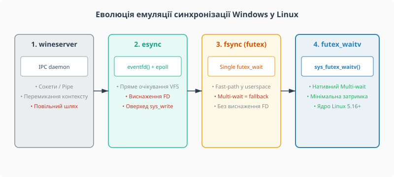

# 📜 Еволюція емуляції синхронізації Windows у Linux: від wineserver до futex2

Розвиток запуску ігор під Linux пройшов складний двадцятирічний шлях від повільної міжпроцесної взаємодії до створення спеціалізованого системного виклику в ядрі. Ця історія показує, як фундаментальна архітектурна розбіжність між моделлю синхронізації Windows NT та Linux підштовхнула розробників Valve, Collabora та спільноти Wine до глибокої перебудови фундаментальних примітивів очікування в ядрі.

*Чотири покоління механізмів синхронізації в емуляційному шарі Wine: від міжпроцесного демона до нативного системного виклику ядра.*

## Ера wineserver: міжпроцесний демон як єдине джерело правди

У перших версіях Wine (1990-х–2010-х років) розробники зіштовхнулися з тим, що модель синхронізації Windows NT кардинально відрізняється від POSIX-стандартів. У Windows NT примітиви синхронізації (м'ютекси, події, семафори, таймери) є об'єктами ядра (dispatcher objects), якими оперує універсальна централізована функція `WaitForMultipleObjects()`.

Швидке та чесне відтворення цієї поведінки в просторі користувача POSIX вимагало централізованого арбітра. Таким арбітром у проєкті Wine став **wineserver** — окремий демон користувацького простору, що виконувався паралельно з основними процесами застосунку. Коли Windows-програма викликала `CreateMutex()`, `SetEvent()` або `WaitForMultipleObjects()`, обгортка в `kernel32.dll` надсилала запит через локальний UNIX-сокет або канал (pipe) до `wineserver`.

Ця схема була надійною і з високою точністю відтворювала внутрішню семантику Windows NT. Однак її ціною була незадовільна продуктивність при високих навантаженнях:
- Кожна зміна стану об'єкта та кожна спроба заблокуватися вимагали двох обов'язкових перемикань контексту (потік застосунку → `wineserver` → потік застосунку).
- При високій частоті синхронізації (десятки тисяч викликів на секунду в ігрових рушіях) `wineserver` ставав головним вузьким місцем процесора, навантажуючи одне ядро CPU на 100% і блокуючи інші потоки.

## Ера esync: файлові дескриптори та eventfd

З появою ініціативи Valve Steam Play (Proton) у 2018 році та розробкою шарів трансляції графіки DXVK (Direct3D 11 у Vulkan) і VKD3D-Proton (Direct3D 12 у Vulkan) стало зрозуміло, що графічна підсистема перестала бути єдиним обмежувачем частоти кадрів. Затримки синхронізації у `wineserver` стали помітним обмежувачем: у багатопотокових AAA-іграх вони коштували десятки відсотків кадрової частоти.

Розробниця Wine Elizabeth Figura запропонувала патчсет **esync** (Eventfd Synchronization), який 2018 року потрапив до `wine-staging`, а звідти — до Proton. Основна ідея esync полягала у повному вилученні `wineserver` із гарячого шляху викликів синхронізації:
1. Кожен логічний примітив Windows (Event, Mutex, Semaphore) відображався на системний об'єкт Linux `eventfd(2)`.
2. Для реалізації багатооб'єктного очікування `WaitForMultipleObjects()` використовувався системний виклик `epoll_wait(2)` або `poll(2)`, який чекав на масиві файлових дескрипторів безпосередньо у просторі ядра.

Впровадження esync дало колосальний приріст частоти кадрів в іграх. Проте механізм зіштовхнувся з двома новими технічними бар'єрами:
- **Виснаження системних лімітів FD**: Великі ігри створювали десятки й сотні тисяч об'єктів синхронізації, що призводило до помилок `EMFILE` ("Too many open files") та вимагало від користувачів ручного підвищення системного ліміту `ulimit -n 1048576`.
- **Накладні витрати VFS та відсутність fast-path**: На відміну від futex, зміна стану `eventfd` вимагає обов'язкового системного виклику `write(2)`, що створювало зайві витрати ресурсів процесора.

## Ера fsync: повернення до futex

Щоб усунути залежність від файлових дескрипторів та зменшити споживання пам'яті ядром, та сама авторка esync — Elizabeth Figura — додала до Wine підсистему **fsync** (Futex Synchronization); доводили її до бойового стану вже спільно розробники CodeWeavers і Valve у складі Proton. `fsync` перевів одиничні об'єкти синхронізації на класичний системний виклик `futex(2)`.

Для одиничного м'ютекса чи події швидкий шлях (fast path) виконувався атомарними інструкціями процесора в користувацькому просторі без звернення до ядра. Проте операція `WaitAny` для кількох futex-змінних усе одно залишалася неможливою на рівні старого API `futex(2)`. `fsync` був змушений або реалізовувати складні спин-петлі (spin loops), або звертатися назад до `wineserver` для багатоелементного очікування.

## Народження futex2 та системного виклику `sys_futex_waitv`

У 2019 році розробники Collabora (зокрема André Almeida, Gabriel Krisman Bertazi) разом із Valve винесли обговорення розширення підсистеми futex у список розсилки ядра Linux (LKML). Початкова пропозиція описувала новий інтерфейс під назвою **futex2**, який мав підтримувати змінні різного розміру (`FUTEX_8`, `FUTEX_16`, `FUTEX_32`, `FUTEX_64`), багатооб'єктне очікування (`sys_futex_waitv`) та векторизоване пробудження (`sys_futex_wakev`).

За наполяганням супроводжувачів підсистеми futex (Thomas Gleixner, Peter Zijlstra) розробники розділили гігантську ініціативу на невеликі ізольовані системні виклики, кожен з яких можна рецензувати окремо. Найбільш критичним для ігрової екосистеми виявився системний виклик `futex_waitv()`.

Після кількох ітерацій рецензування коду, перебудови внутрішньої логіки постановки в черги хеш-бакетів і тестування у тисячах ігор Proton системний виклик `sys_futex_waitv` увійшов до ядра Linux 5.16, що вийшло у січні 2022 року. Proton дістав багатооб'єктне очікування без `wineserver` і без файлових дескрипторів — а розвиток на цьому не спинився: згодом Wine здобув окремий драйвер ядра `ntsync`, який відтворює семантику об'єктів NT точніше за `fsync`.
