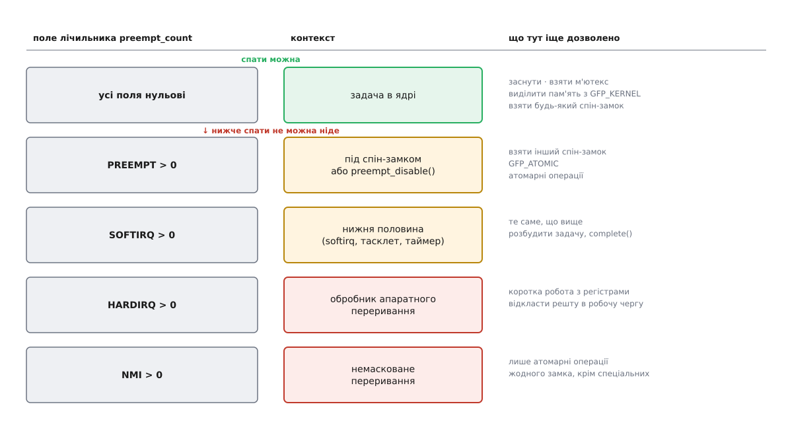
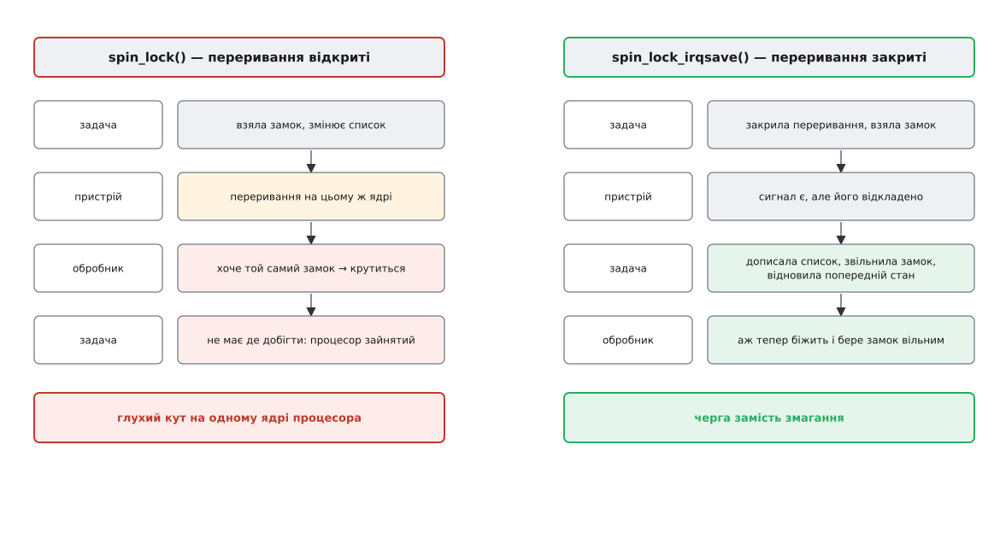
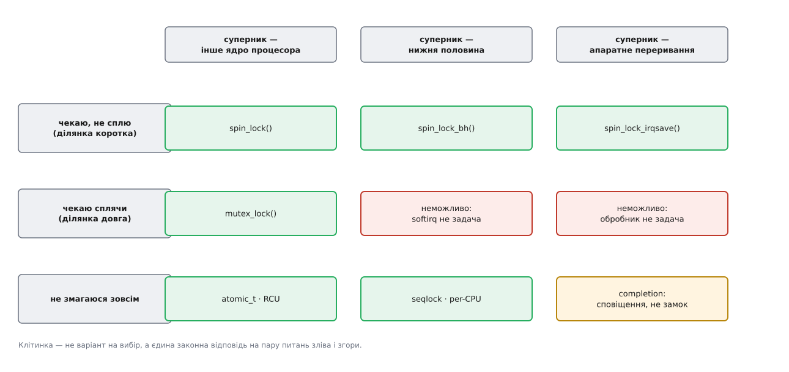

# Замки в ядрі й атомарний контекст: де спати не можна

<preknowlist>
- [Перегони даних і замки](book:programming/data-races-locks) — двоє, що пишуть в одну структуру одночасно, псують її; замок робить ділянку неподільною для решти.
- [Спін-замок](book:programming/spinlock) — замок, на якому чекають крутінням у порожньому циклі, а не засинанням.
- [Дедлок](book:programming/deadlock) — учасники чекають одне на одного по колу й не зрушать ніколи.
- [Ядро й простір користувача](book:unix-linux/kernel-and-userspace) — код ядра виконується на тому самому процесорі, що й програми, і ядро одне на всі задачі.
- [Стани процесу і що означає стан D](book:unix-linux/process-states) — «заснути» означає позначити себе неготовим і чекати, доки хтось розбудить.
- [Планувальник: як ядро ділить час](book:unix-linux/scheduler-model) — `schedule()` знімає поточну задачу з процесора й ставить туди іншу.
- [Витісненість ядра](book:unix-linux/kernel-preemption) — ядро дозволяє спинити себе не всюди; лічильник `preempt_count` каже, чи можна зараз перемикати задачу.
- [Переривання](book:programming/interrupts) — апаратна подія силою забирає процесор у того, хто зараз біжить.
- [Перемикання контексту](book:programming/context-switch) — зберегти регістри однієї задачі й відновити регістри іншої.
- [Упорядкування пам'яті та бар'єри](book:programming/memory-ordering-barriers) — процесор і компілятор переставляють доступи до пам'яті, і замок мусить це враховувати.
- [Когерентність кешів](book:programming/cache-coherence-protocol) — рядок кеша живе в одному ядрі процесора у виключному володінні, і передача володіння коштує часу.
</preknowlist>

## Два виклики того самого рядка

У драйвері є список подій. Його вичитує `read()` із простору користувача, а поповнюють двоє: обробник переривання від пристрою і шлях `write()`, яким програма вкидає власні позначки. Спільна структура, кілька охочих — очевидно, потрібен замок:

```c
static LIST_HEAD(events);
static DEFINE_MUTEX(events_lock);

static void push_event(u32 code)
{
    struct event *e = kmalloc(sizeof(*e), GFP_KERNEL);
    if (!e)
        return;
    e->code = code;

    mutex_lock(&events_lock);
    list_add_tail(&e->node, &events);
    mutex_unlock(&events_lock);
}
```

Викликана зі шляху `write()` — тобто з контексту задачі, — ця функція працює бездоганно. Викликана з обробника переривання — ламає систему, а ядро, складене з перевірками, лишає в журналі:

```
BUG: sleeping function called from invalid context at kernel/locking/mutex.c:283
in_atomic(): 1, irqs_disabled(): 1, non_block: 0, pid: 0, name: swapper/0
```

Дані ті самі. Замок той самий. Код той самий до літери. Отже, правильність тут визначає не структура, яку ми захищаємо, і не замок, який ми взяли, а **те, звідки нас покликали**. Цю властивість шляху виконання ядро називає контекстом, а ту його частину, де заборонено засинати, — **атомарним контекстом** (гр. *átomos* — неподільний): ділянкою, яку не можна розрізати перемиканням задачі.

Питання, на яке відповідає ця стаття, — чому така ділянка взагалі існує, як ядро її обмежує й чому вибір замка виявляється відповіддю не на питання «які в мене дані», а на два зовсім інші: **хто мій суперник** і **чи маю я право заснути, поки чекаю**.

## Що технічно означає «заснути»

Слово «заснути» звучить пасивно, ніби нічого не відбувається. Насправді це послідовність цілком конкретних дій, і саме з них випливають усі заборони.

Задача, якій треба чекати, робить три речі:

```c
/* так виглядає засинання, розписане до кісток */
DEFINE_WAIT(wait);

prepare_to_wait(&queue, &wait, TASK_UNINTERRUPTIBLE); /* 1. стати в чергу очікування
                                                          і позначити себе неготовою */
schedule();                                           /* 2. віддати процесор:
                                                          планувальник обере іншу задачу */
finish_wait(&queue, &wait);                           /* 3. прокинутися — колись потім */
```

Розберімо, що кожен крок мовчки припускає.

**Крок перший припускає, що є кого позначати.** Прапорець стану пишуть у `current` — структуру поточної задачі. Отже, той, хто засинає, мусить *бути задачею*: мати місце в черзі планувальника, власний стек, який збережеться до пробудження, і власний обліковий запис часу.

**Крок другий припускає, що піти зараз — безпечно.** `schedule()` знімає нас із процесора негайно, і на цьому ж процесорі побіжить хтось інший, а нас можуть повернути на інше ядро процесора й через невідомо скільки часу. Усе, що ми лишили в напівзібраному стані — взятий замок, недописану структуру, вказівник на дані свого ядра процесора, — лишиться таким на весь цей час, доступним усім охочим.

**Крок третій припускає, що є кому будити.** Хтось мусить викликати `wake_up()` саме на тій черзі, у яку ми стали. Якщо такого нікого немає, «заснути» перетворюється на «зникнути» ([черги очікування в ядрі](book:unix-linux/kernel-wait-queues)).

Порушити ці припущення можна двома різними способами. Кожен дає окремий різновид атомарного контексту, і плутати їх не варто: у них різні причини й різні наслідки.

## Перше порушення: обробник переривання не є задачею

Коли пристрій смикає лінію переривання, процесор кидає те, що робив, і стрибає в обробник. Кого він при цьому кинув? Ту задачу, якій не пощастило бігти на цьому ядрі процесора в цю мить. Вона не має жодного стосунку до пристрою; вона просто рахувала числа або чекала на щось своє.

Тепер уявімо, що обробник викликав `mutex_lock()`, замок зайнятий, і код чесно заснув. Що станеться?

`schedule()` зніме з процесора **не обробник** — обробника нема в жодній черзі планувальника, він не задача. Планувальник зніме ту саму випадкову жертву, у чиєму контексті ми опинилися, і поставить її в чергу очікування нашого м'ютекса. Жертва тепер спить на замку, про який уперше чує. А коли замок звільниться і її розбудять, вона продовжить виконання **з середини обробника переривання** — того самого, до якого не має стосунку.

І це ще оптимістичний сценарій. Зазвичай усе закінчується раніше й гірше: обробник, який заснув на кілька мілісекунд, увесь цей час тримає контролер переривань у стані, де подальші сигнали від цього пристрою замасковані, — а пристрій на них не чекає. Ядро й ловить це перевіркою — до того, як усе розсиплеться.

> 🔧 **Навіщо це.** Звідси стандартний прийом усього ядра: обробник переривання робить рівно те, що мусить статися негайно (підтвердити апаратурі приймання, забрати дані з регістрів), а решту віддає туди, де спати вже можна — у робочу чергу або в потік переривання ([переривання, softirq і робочі черги](book:unix-linux/interrupts-bottom-halves)). Коли в коді драйвера з'являється потреба чекати, це не привід шукати «замок, який можна брати в перериванні», а сигнал, що робота стоїть не на своєму поверсі.

Тут-таки видно й межу цієї заборони: вона стосується не лише апаратних обробників. Той самий стан — «я не задача, мене нема кому будити» — має код нижніх половин (softirq), код таймерів ядра й обробник немаскованого переривання. Спільне в них одне: **у планувальника немає рядка з моїм іменем**.

## Друге порушення: заснути під спін-замком

Другий різновид зовсім інший. Тут ми таки задача, нас є кому будити, і формально засинання спрацює. Ламається друге припущення — що піти зараз безпечно.

Спін-замок побудовано на розрахунку: власник тримає його десятки наносекунд, тому чекати, крутячись у циклі, дешевше, ніж засинати й прокидатися. Увесь примітив стоїть на цьому припущенні, і воно ж робить його крихким.

Задача A взяла спін-замок і заснула на очікуванні диска — скажімо, п'ять мілісекунд. Порахуймо, що це коштує машині.

**Ціна одного засинання під спін-замком на 16-ядерному сервері, де ця структура гаряча.**

```
власник спить                       = 5 мс
ядер процесора, що хочуть цей замок ≈ 8
кожне крутиться весь цей час        = 8 · 5 мс   = 40 мс марного часу процесора
корисної роботи за цей час          = 0
```

Сорок мілісекунд процесорного часу згоріло, і жодне з тих ядер не може перемкнутися на іншу роботу — воно ж крутиться в циклі з забороненим витісненням. Але справжня катастрофа інша, і вона не потребує восьми ядер. Якщо задача B, що чекає на цей замок, крутиться **на тому самому ядрі процесора**, де мала б бігти A, то A не прокинеться ніколи: єдиний процесор, здатний її виконати, зайнятий тим, що крутить B. Обидві стоять назавжди, і жодного повідомлення в журналі — просто зависла машина.

Тому взяття спін-замка **забороняє витіснення на цьому ядрі процесора**, а заборона витіснення робить будь-яке засинання помилкою: заснути означає покликати планувальник, а планувальник тут відрізаний. Так одна дія — `spin_lock()` — тягне за собою повний набір заборон, і саме тому «під спін-замком» і «в атомарному контексті» на практиці означають те саме.

Поруч живе тихіший наслідок того ж рішення. Гарячі структури ядро тримає окремим примірником на кожне ядро процесора й працює з ними взагалі без замків: захистом слугує сам факт, що ніхто інший на це ядро процесора не претендує. Витіснення чи міграція перетворюють цей захист на ілюзію — задача прокидається на сусідньому ядрі процесора й пише за вказівником у чужий примірник. Тому в ядрі є окремий примітив саме для цієї потреби, `local_lock`, який у звичайному складанні перетворюється на заборону витіснення, а в реальночасовому — на справжній замок ([дані свого ядра процесора](book:unix-linux/per-cpu-data)).

## Лічильник, який описує контекст

Ядру потрібно якось знати, у якому воно контексті. Знання це живе в одному 32-бітному слові при кожній задачі — `preempt_count`, розділеному на поля:

```
біти  0…7    PREEMPT   вкладеність preempt_disable() і взятих спін-замків
біти  8…15   SOFTIRQ   виконання softirq + заборони нижніх половин
біти 16…19   HARDIRQ   вкладеність обробників апаратних переривань
біти 20…23   NMI       немасковане переривання
біт  31      прапорець «пора перемкнути задачу» (на частині архітектур)
```

Кожен вхід у відповідний стан додає одиницю у своє поле, кожен вихід віднімає. Поля різні, а користуються ними по-різному: `in_hardirq()` дивиться лише на своє поле, `in_task()` — чи порожні обидва верхні поля й найнижчий біт softirq, `in_atomic()` — чи все слово (крім прапорця) нульове.

Найтонше тут поле softirq: воно рахує не одиницями, і з цієї арифметики виростає ціла родина перевірок, у яких легко взяти не ту ([що саме читає кожна перевірка контексту](book:unix-linux/kernel-locking/api-locking-primitives.md)).



*Кожен щабель донизу — ще одне поле лічильника, що стало ненульовим, і ще один клас операцій, який відпав. Ліворуч — чим цей стан позначено в `preempt_count`; праворуч — що на цьому щаблі ще дозволено. Засинання зникає з переліку дозволеного на першому ж щаблі й більше не з'являється.*

Ловить порушення не сам сон, а позначка на початку кожної функції, яка має право заснути:

```c
void mutex_lock(struct mutex *lock)
{
    might_sleep();          /* «мене можна кликати лише звідти, де вільно спати» */
    ...
}
```

Із увімкненим `CONFIG_DEBUG_ATOMIC_SLEEP` ця позначка дивиться на лічильник і кричить одразу — до того, як система справді зависне. Саме її ми й бачили в повідомленні на початку: рядок `in_atomic(): 1` означає «лічильник ненульовий», а `pid: 0, name: swapper/0` — що обробник виконувався в контексті задачі простою, яка до нашого пристрою не має жодного стосунку.

## Чому контекст не можна спитати, а треба знати

Напрошується думка: якщо є `in_atomic()`, то функція може перевірити його сама й повестися розумно — заснути, коли можна, і покрутитися, коли ні. Ядро свідомо цього не робить, і причина глибша за смак.

Технічна половина причини така. Поле PREEMPT підтримується лише тоді, коли ядро складене з витісненням або з налагоджувальними перевірками (`CONFIG_PREEMPT_COUNT`). У ядрі без витісненості `spin_lock()` не збільшує лічильника взагалі — йому нема чого забороняти, бо перемикання й так не станеться. Отже, `in_atomic()` під спін-замком у такому ядрі поверне нуль: контекст атомарний, а лічильник каже, що ні. Функція, яка довірилася б цій відповіді, заснула б під замком і повісила машину — і не на тестовому стенді, а рівно на тій конфігурації, якої в тестах не було.

Смислова половина важливіша. Спроба самому дізнатися контекст означає, що функція готова поводитися по-різному залежно від того, хто її покликав. Позиція ядра тут записана прямо в коментарі до `include/linux/preempt.h`: `in_atomic()` не знає про взяті спін-замки в невитіснюваному ядрі, тому вживати його в коді драйвера не можна — гілка за його результатом завжди свідчить, що потрібне знання не передали явно. У 2020 році Томас Ґляйкснер пропонував серією «sched: Make preempt count unconditional» зробити лічильник безумовним, щоб принаймні прибрати технічну брехню; загального рішення тоді не ухвалили, а на практиці питання зняли з іншого боку — сучасні ядра дистрибутивів витіснювані, тож лічильник у них ведеться завжди.

Лишається головне: **контекст — це властивість шляху виклику, а не змінна, яку читають**. Кожна функція ядра має неписаний контракт «звідки мене можна кликати», і цей контракт не перевіряється в момент виклику — він або дотриманий автором, або порушений. Уся механіка замків у ядрі виросла з єдиної потреби: зробити цей контракт записаним.

## Хто мій суперник: звідки беруться різні спін-замки

Повернімося до драйвера з початку. Ми з'ясували, чому там не можна `mutex`. Але просто замінити його на `spin_lock()` — теж помилка, і щоб побачити чому, треба поставити питання, яке в задачі про замки задають рідко: **хто саме може забрати в мене цю структуру**.

У просторі користувача відповідь одна: інший потік на іншому процесорі. У ядрі відповідей три, і вони не рівноцінні.

**Суперник на іншому ядрі процесора.** Класичний випадок, для якого й придуманий спін-замок: доки я тримаю замок, той, інший, крутиться. Обидва — задачі, обидва рухаються, ситуація симетрична й розв'язується сама собою за десятки наносекунд. Звичайний `spin_lock()`.

**Суперник — переривання на моєму ж ядрі процесора.** Ось де симетрія ламається. Задача взяла замок і працює зі списком. Приходить переривання від того самого пристрою — на цьому ж ядрі процесора, силою, посеред нашої ділянки. Обробник хоче той самий замок і починає крутитися. Він крутитиметься вічно: щоб замок звільнився, має добігти задача, а задача не побіжить, бо процесор зайнятий обробником, і витіснити обробник неможливо — він не задача. Глухий кут на одному-єдиному ядрі процесора, без жодного другого учасника.



*Ліворуч: переривання встромляється між взяттям і звільненням замка, обробник крутиться, задача не має де добігти. Праворуч: `spin_lock_irqsave()` закриває переривання на цьому ядрі процесора ще до взяття замка, тож обробник просто чекає своєї черги за межами критичної ділянки.*

Розв'язок прямий: якщо замок береться десь у обробнику переривання, то **всі інші, хто його бере, мусять при цьому закрити переривання на своєму ядрі процесора** — `spin_lock_irqsave()`. Правило виглядає асиметричним (обробникові закривати нічого не треба, переривання й так закриті), але асиметрія тут справжня: небезпечна лише одна послідовність із двох.

Чому саме `irqsave`, а не простіше `spin_lock_irq()`, яке закриває переривання й наприкінці відкриває? Бо ділянки вкладаються. Якщо нас покликали звідти, де переривання вже були закриті, беззастережне відкриття наприкінці відкриє їх посеред чужої критичної ділянки — і зламає її захист. Тому `irqsave` зберігає попередній стан у змінну й наприкінці відновлює саме його. Це той рідкісний випадок, коли незручніший інтерфейс обрано свідомо: він єдиний складається сам із собою.

**Суперник — нижня половина (softirq).** Проміжний випадок: код softirq не є задачею, але й не має тієї сили, що апаратний обробник, — його можна відкласти. Тут вистачає `spin_lock_bh()`, який забороняє нижні половини, не чіпаючи апаратних переривань. Дешевше, ніж закривати переривання, і достатньо, коли з цією структурою апаратний обробник не працює.

Отже, три варіанти одного примітиву — не три смаки, а три різні відповіді на питання «хто мене може перервати». Вибрати заслабший означає отримати глухий кут, який відтворюється раз на тиждень під навантаженням; вибрати задужий — закривати переривання там, де це не потрібно, і зайвий раз погіршувати затримку всієї машини.

## Чи маю я право заснути, поки чекаю

Друге питання зовсім незалежне від першого, і саме воно розділяє світ замків ядра навпіл.

Спін-замок вигідний лише тоді, коли чекати доведеться менше, ніж коштує перемикання контексту (близько двох мікросекунд), — а що претендентів звичайно кілька й кожен чекає своєї черги, поріг ділиться між ними й на практиці падає до десятків-сотень наносекунд. Щойно критична ділянка стає довгою (звернення до диска, копіювання сторінки, робота з мережею), крутіння перетворюється на чисте марнотратство: ядро процесора палить час замість того, щоб виконувати чужу корисну роботу. Тут потрібен замок, на якому **сплять**, — і платою за нього стає вимога бути задачею.

**М'ютекс** (англ. *mutual exclusion* — взаємне виключення) — основний сплячий замок ядра. Він має одну властивість, якої немає в спін-замка: **власника**. Ядро знає, яка саме задача тримає м'ютекс, і з цього знання виростає все інше.

Перше, що дає власник, — можливість не спати даремно. З 2009 року (латка Петера Зейлстри, ядро 2.6.30, перенесена з реальночасової гілки, де її для rt-м'ютексів зробив Стівен Ростедт на основі роботи Ґреґорі Гаскінса) м'ютекс поводиться хитріше, ніж «зайнято — сплю». Претендент дивиться, чи власник **зараз біжить на іншому ядрі процесора**. Якщо так — розумно покрутитися: власник, який виконується, ось-ось відпустить замок, і два перемикання контексту виявляться дорожчими за коротке крутіння. Щойно власник сам зник із процесора — крутитися немає сенсу, і претендент засинає. На тесті масштабованості віртуальної файлової системи ця зміна дала приріст у три з половиною рази.

Друге, що дає власник, — можливість підняти йому пріоритет, коли на замок чекає важлива задача. Без цього довгі ділянки під сплячим замком перетворюються на класичну [інверсію пріоритетів](book:programming/priority-inversion) у масштабах усього ядра.

Третій наслідок власника — обмеження, яке дивує тих, хто прийшов із семафорів: **м'ютекс має звільняти той, хто його взяв**. Не можна взяти в одній задачі, а віддати в іншій; не можна віддати з обробника переривання.

А потреба «одна сторона чекає, інша сповіщає» цілком реальна: задача чекає, доки пристрій закінчить операцію, а сповістити її мусить саме обробник переривання. Для цього в ядрі є окремий примітив — **завершення** (`struct completion`): задача кличе `wait_for_completion()` і засинає, обробник кличе `complete()` і будить її. Це працює саме тому, що завершення — не замок і не має власника; його «звільнення» — просто сповіщення, а сповіщати можна й з обробника переривання.

```c
/* драйвер: задача чекає на завершення обміну, будить її переривання */
struct my_dev {
    struct completion done;
    u32 result;
};

static ssize_t dev_read(struct file *f, char __user *buf, size_t n, loff_t *off)
{
    struct my_dev *d = f->private_data;

    start_transfer(d);                              /* смикнули пристрій */
    if (wait_for_completion_interruptible(&d->done)) /* заснули: ми задача, нам можна */
        return -ERESTARTSYS;

    return copy_result(d, buf, n);
}

static irqreturn_t dev_irq(int irq, void *arg)
{
    struct my_dev *d = arg;

    d->result = read_status(d);
    complete(&d->done);       /* будити з переривання можна: це не взяття замка */
    return IRQ_HANDLED;
}
```

Зверніть увагу, що з цього коду зникло питання про замок узагалі. Так і виглядає найкраща відповідь на «який замок брати»: перебудувати обмін так, щоб спільної структури, за яку треба змагатися, не стало.

## Коли замок не потрібен зовсім

Замок — не єдина відповідь на спільні дані, і в гарячих місцях ядра він якраз найгірша. Три альтернативи варто знати, бо кожна знімає окремий різновид витрат.

**Лічильники й прапорці** живуть у типі `atomic_t`, з яким процесор працює однією неподільною інструкцією. Жодного очікування, жодного контексту — `atomic_inc()` однаково законний і в задачі, і в немаскованому перериванні. Ціна в тому, що атомарна лише сама операція: два послідовні `atomic_read()` уже не дають узгодженої картини ([без замків](book:programming/lock-free-basics)).

**Послідовний замок** (seqlock) розв'язує випадок «пишуть рідко, читають безперервно». Письменник збільшує лічильник до зміни й після неї, читач запам'ятовує лічильник, читає дані й перевіряє, чи той не змінився; змінився — читає ще раз. Читачі не пишуть у спільний рядок кеша взагалі, тож не заважають одне одному й не втрачають швидкості зі зростанням числа ядер процесора. Ціна: читач мусить бути готовим повторити спробу, а отже, не має права ані спати всередині спроби, ані робити щось незворотне з прочитаним. Саме так побудовано читання часу в ядрі ([час у ядрі: тики, монотонний годинник і джерела часу](book:unix-linux/kernel-timekeeping)).

**RCU** іде далі: читач не робить узагалі нічого — ані запису, ані атомарної операції. Письменник створює нову версію структури, підмінює вказівник і відкладає звільнення старої до моменту, коли всі читачі, що могли її бачити, гарантовано вийшли зі своїх ділянок. Це найдешевше читання з можливих і найдорожчий запис ([RCU: читання без замків і відкладене звільнення](book:unix-linux/rcu-read-copy-update)).

Спільне в усіх трьох одне: вони прибирають не замок, а **змагання**. І це загальне правило ядра — коли структура стала вузьким місцем, шукають не швидшого замка, а способу перестати ділити її між ядрами процесора.



*Горизонталь — від кого захищаємось, вертикаль — чи маємо право заснути. Примітив стоїть на перетині, а не обирається зі списку: у кожній клітинці рівно один законний варіант. Середній рядок обривається не випадково — сплячий замок неможливий скрізь, де суперник не є задачею: ані нижня половина, ані обробник переривання взяти його не можуть, і саме тому в правому куті стоїть завершення замість замка.*

Повний перелік того, що з чого викликається, з якими станами лічильника й якими сигнатурами, зібрано окремо: [примітиви синхронізації ядра: контекст, сигнатури, правила](book:unix-linux/kernel-locking/api-locking-primitives.md).

## Порядок узяття: помилка, якої не видно локально

Досі ми дивилися на один замок. Але ядро тримає десятки тисяч замків, і найгірша помилка виникає там, де кожен окремий фрагмент коду бездоганний.

Задача A бере замок першої структури, потім, не відпускаючи, — замок другої. Задача B у зовсім іншій підсистемі бере ті самі два, але в зворотному порядку. Обидва фрагменти правильні поодинці. Разом вони дають глухий кут, щойно збігуться в часі: A тримає перший і чекає на другий, B тримає другий і чекає на перший.

Особливість цієї помилки в тому, що **її неможливо побачити, читаючи один файл**. Правильність тут — властивість глобального графа: не має існувати циклу в порядку взяття замків по всьому дереву ядра. Такий інваріант неможливо утримати ані оглядом коду, ані тестуванням: цикл спрацьовує лише за конкретного збігу в часі, який може не траплятися роками.

Тому в 2006 році (набір латок Інґо Молнара, ядро 2.6.18) у ядро додали механізм, який перевіряє інваріант замість людини. Ідея `lockdep` варта того, щоб її зрозуміти, бо вона нетипова для налагоджувальних засобів: він не ловить дедлоків. Він будує граф і кричить на **першу ж можливість** дедлока.

Працює це так. Кожен замок належить до **класу** — не окремий примірник, а тип: «замок inode будь-якої файлової системи», «замок цієї структури драйвера». Щоразу, коли ядро бере замок класу Y, тримаючи замок класу X, `lockdep` записує в граф ребро X → Y. Якщо колись з'явиться ребро Y → X — тобто хтось десь узяв їх у зворотному порядку, — з'явиться цикл, і механізм видасть звіт негайно, хоч би дві ці послідовності ніколи й не збіглися в часі на одній машині.

Той самий граф перевіряє й контекст, з якого ми починали. `lockdep` позначає кожен клас за тим, як його вживають: чи брали його колись з обробника переривання, чи брали колись із закритими перериваннями. Замок, узятий у перериванні, але деінде взятий без `irqsave`, — це та сама асиметрія, з якої виростає глухий кут на одному ядрі процесора, і механізм повідомить про неї, навіть якщо переривання в цю мить не прийшло.

> 🔧 **Навіщо це.** Практичний висновок для всіх, хто пише щось у ядрі: складання з `CONFIG_PROVE_LOCKING` — не «додаткова перевірка про всяк випадок», а єдиний реальний спосіб довідатися про свою помилку в порядку замків до того, як вона стане звітом про зависання з продакшену. Ціна — відчутне сповільнення, тож таке ядро тримають на стенді, а не на бойовій машині. Звіт `lockdep` виглядає лячно, але читається за чіткою схемою й майже завжди називає винуватця прямо: [прочитати звіт lockdep і зробити дедлок навмисне](book:unix-linux/kernel-locking/proj-lockdep-lab.md).

## Ціна замка, який усі хочуть

Лишилося питання, яке не стосується ані контексту, ані порядку: скільки коштує сам замок, коли за нього змагаються.

Спін-замок у найпростішому вигляді — це слово в пам'яті, яке всі претенденти в циклі намагаються переписати атомарною інструкцією. Кожна така спроба вимагає забрати рядок кеша у виключне володіння, тобто відібрати його в того ядра процесора, яке ним володіло. Претенденти б'ються за один рядок, і кожне їхнє крутіння сповільнює того самого власника, на якого вони чекають, — бо власникові теж треба цей рядок, щоб замок відпустити.

Наслідок протиприродний, але вимірюваний: додавання ядер процесора може **зменшити** пропускну здатність. Крім того, простий замок несправедливий — його отримує не той, хто чекав найдовше, а той, кому пощастило з кешем. Нік Піґґін, узявшись 2008 року за це, спостерігав на восьмиядерному Opteron, як один потік випереджає інший до мільйона разів поспіль; його відповіддю став **квитковий замок** (ядро 2.6.25): претендент бере номерок, власник по звільненні викликає наступний номер, черга стає чесною.

Чесність, однак, не прибрала штовханини за рядок кеша — усі досі крутяться на одному слові. Це прибрав наступний крок: **чергові замки** (qspinlock) Ваймана Лонга, увімкнені на x86 з ядра 4.2 (2015). Кожен претендент стає у зв'язаний список і крутиться на **своїй власній** комірці, яку більше ніхто не чіпає; попередник, звільняючи замок, пише в неї одне слово. Кількість передач рядка кеша перестає залежати від числа претендентів.

Арифметика цих трьох поколінь — чому наївне крутіння росте квадратично, звідки береться стеля квиткового замка й чому черга дає сталу вартість — розібрана окремо: [скільки коштує змагання за замок](book:unix-linux/kernel-locking/math-lock-scaling.md).

## Коли самі примітиви змінюють природу

Усе описане стоїть на тому, що спін-замок крутиться, а м'ютекс спить. Реальночасове складання ядра цю відповідність ламає: під `PREEMPT_RT` звичайний `spinlock_t` перетворюється на сплячий замок, і ділянку під ним стає можна витісняти й переривати сном. Це не дрібне налаштування, а зміна самого поділу, з якого ми починали.

Але заборона нікуди не зникає — вона стає меншою і, головне, **названою**. Код, який справді не має права спати (сам планувальник, вхід у переривання, обробка немаскованих переривань), користується окремим типом `raw_spinlock_t`, що лишається справжнім спін-замком зі справжньою забороною витіснення. Різниця з попереднім світом не в наявності такого замка, а в його статусі: те, що раніше було станом за замовчуванням, стало явно позначеним винятком, який рецензент має право оскаржити ([витісненість ядра: від PREEMPT_NONE до PREEMPT_RT](book:unix-linux/kernel-preemption)).

Ось у цьому перетворенні й видно, куди все рухалося тридцять років. Атомарний контекст починався як мовчазне припущення: код ядра знав про себе, що його не спинять, і ніде цього не записував. Кожен наступний крок — поява `might_sleep()`, поділ спін-замків на три різновиди за суперником, `lockdep`, окремий `local_lock` для даних свого ядра процесора, `raw_spinlock_t` — робив одне й те саме: **перетворював припущення на запис**. Не додавав нової можливості, а змушував автора назвати вголос те, на що він і так спирався.

Тому питання «який замок узяти» насправді ніколи не про замок. Це питання «звідки мене кличуть і що я обіцяю тому, хто чекає», і відповідь на нього ядро вимагає записати в типі — бо в місці виклику її вже ніхто не перевірить.
