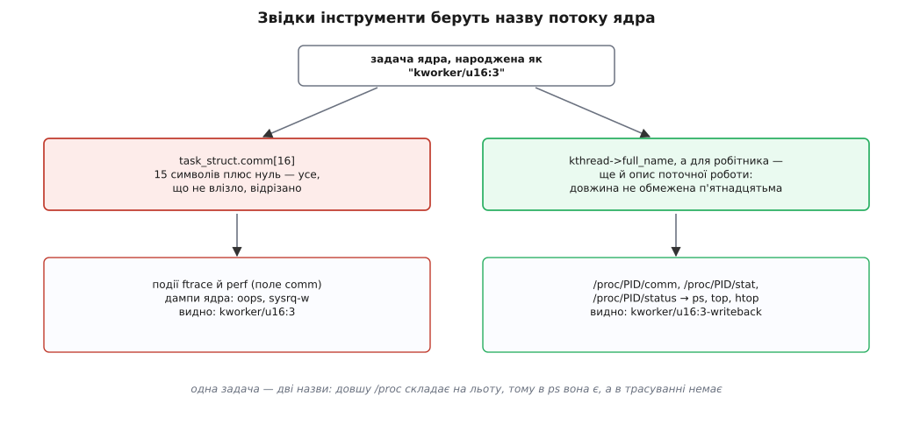
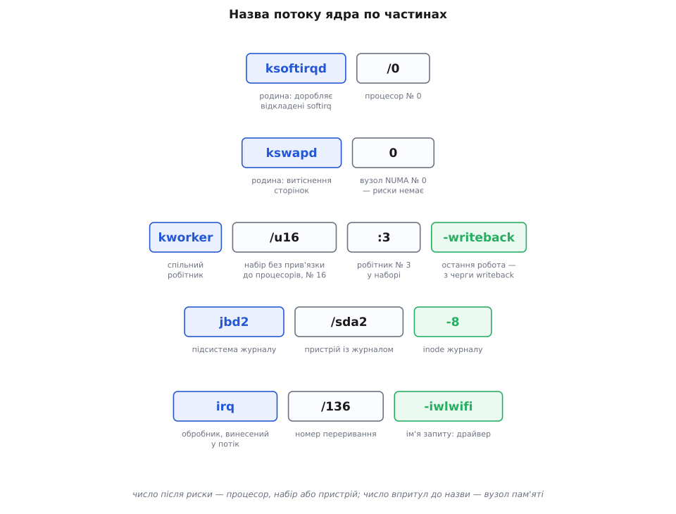

# 📋 Назви потоків ядра: довідник родин і чисел у виводі `ps`

Півтори сотні рядків у квадратних дужках, які показує `ps ax` на щойно завантаженій машині, — не безіменний натовп: у кожному написі закодовано родину, майже завжди номер процесора або вузла пам'яті, а в сучасних ядрах ще й те, яку саме роботу задача робила останньою. Тут розібрано правило, за яким ядро складає ці назви, перелічено родини, що трапляються на звичайній системі (що кожна робить і чи можна її кудись перенести), і зібрано файли та команди, якими про такий потік дізнаються все інше.

## Звідки береться напис

Ім'я задачі лежить у полі `comm`, і воно однакове для програм і для потоків ядра:

```c
enum {
	TASK_COMM_LEN = 16,
};

/* у struct task_struct: */
char				comm[TASK_COMM_LEN];
```

П'ятнадцять символів плюс завершальний нуль. Звідси всі обрізки на кшталт `ext4-rsv-conver` чи `btrfs-transacti`, що виглядають як друкарська помилка, а насправді є рівно тим, що влізло.

Квадратні дужки ставить не ядро, а `ps`: вона друкує рядок запуску з `/proc/<pid>/cmdline`, а коли той порожній — бере коротке ім'я й обрамляє дужками. Ознака означає тільки «командного рядка немає».

Але напис, який показує `ps`, не завжди дорівнює вмісту `comm`. Відповідь на читання `/proc/<pid>/comm`, `stat` і `status` ядро складає на льоту, і для потоків ядра — окремою гілкою:

```c
void proc_task_name(struct seq_file *m, struct task_struct *p, bool escape)
{
	char tcomm[64];

	if (p->flags & PF_WQ_WORKER)
		wq_worker_comm(tcomm, sizeof(tcomm), p);
	else if (p->flags & PF_KTHREAD)
		get_kthread_comm(tcomm, sizeof(tcomm), p);
	else
		__get_task_comm(tcomm, sizeof(tcomm), p);
	…
}
```

Буфер тут на 64 байти, а не на 16. Звичайний потік ядра має поле `full_name` («щоб зберегти повну назву, коли `comm` обрізано»), і `get_kthread_comm()` віддає саме його. Робітник робочої черги (прапорець `PF_WQ_WORKER`) отримує назву ще цікавішу: `wq_worker_comm()` доклеює до неї опис роботи, яку робітник виконує зараз або виконував востаннє.



*Довшу назву бачить лише той, хто читає `/proc`; трасування й аварійні дампи працюють із полем `comm` і показують обрізок.*

Практичний наслідок один, зате незручний: та сама задача в `ps` і в події трасування зветься по-різному. Побачивши в `top` рядок `kworker/u16:3-writeback`, у трасі шукати треба `kworker/u16:3`.

## Граматика назви

```
ksoftirqd/0            родина / номер процесора
kswapd0                родина + номер вузла пам'яті (риски немає)
migration/3            родина / номер процесора
kworker/2:1H           робітник 1 з високопріоритетного набору процесора 2
kworker/u16:3-events   набір без прив'язки № 16, робітник 3, остання робота — з черги events
jbd2/sda2-8            підсистема / пристрій - inode журналу
irq/136-iwlwifi        підсистема / номер переривання - ім'я запиту
```

Правила, за якими це читається:

- **Скісна риска з числом** — номер процесора, до якого потік прив'язано. Такі назви заводить механізм потоків «по одному на процесор», і число в них — не порядковий номер примірника, а саме номер ядра.
- **Число впритул до назви, без риски** — номер вузла пам'яті (NUMA), а не процесора. Так іменують себе родини підсистеми пам'яті: `kswapd0`, `kcompactd1`. На машині з одним вузлом такий потік завжди один і завжди з нулем.
- **Літера `u` перед числом** у `kworker` означає *unbound* — набір робітників **без** прив'язки до процесора; тоді число після неї є номером набору, а не ядра. Номери роздано підряд, і першими розібрано по два набори на кожен процесор, тому на восьмиядерній машині перший вільний номер якраз і виходить 16.
- **Двокрапка з числом** у `kworker` — порядковий номер робітника всередині набору. Робітники з'являються й зникають за навантаженням, тож цей номер нічого не означає між перезавантаженнями.
- **Літера `H`** наприкінці — робітник із високопріоритетного набору (від'ємне `nice`).
- **Дефіс наприкінці** — опис роботи: назва робочої черги або рядок, який робота поставила собі сама. Замість дефіса може стояти `+` — це означає, що роботу виконують **просто зараз**, а дефіс каже, що вона була останньою.



*Однакові на вигляд числа означають різне: після риски — процесор або набір, впритул до назви — вузол пам'яті.*

## Планування, процесори, час

Потоки, що обслуговують сам процесор і планування. Більшість із них прив'язана намертво: така задача існує заради свого ядра, і саме їй `taskset` відмовляє.

| назва | що робить | прив'язка |
| --- | --- | --- |
| `kthreadd` | предок усіх потоків ядра, PID 2: клонує їх за заявками з чистим оточенням | вільна |
| `ksoftirqd/N` | доробляє відкладені половини переривань ([softirq](book:unix-linux/interrupts-bottom-halves)), коли їх стає забагато, щоб виконувати прямо в обробнику | процесор N, намертво |
| `migration/N` | потік-зупинник: виконує роботу, що вимагає монопольного володіння процесором — перенесення задач між чергами, `stop_machine()`, зміна такту | процесор N, намертво; окремий клас планування, вищий за будь-який реальночасовий |
| `cpuhp/N` | проводить процесор через стани вмикання й вимикання на ходу, викликаючи зареєстровані переходи | процесор N, намертво |
| `idle_inject/N` | примусово заганяє процесор у простій на задані проміжки — тепловий захист і обмеження потужності | процесор N |
| `khungtaskd` | раз на `hung_task_timeout_secs` (типово 120 с) обходить задачі й друкує в журнал ті, що застрягли в [непереривному сні](book:unix-linux/process-states) | вільна |
| `kdevtmpfs` | створює вузли пристроїв у `devtmpfs` від імені ядра, коли драйвер реєструє пристрій | вільна |
| `watchdog/N` | детектор м'яких зависань — **лише старі ядра** | процесор N |

Останній рядок варто прочитати уважно: у сучасному ядрі окремих потоків `watchdog/N` немає. Детектор м'яких зависань працює на таймері високої роздільности й на разовій роботі, яку підкидають потокові-зупиннику (`stop_one_cpu_nowait(…, softlockup_fn, …)`), тож у `ps` його не видно взагалі. Побачили `watchdog/N` — перед вами стара система. А `watchdogd` — це вже інше: потік апаратного сторожового таймера `/dev/watchdog`.

## RCU

Окрема родина на кілька рядків, а на системах із винесеними зворотними викликами — ще й по два потоки на кожен процесор. Усі вони обслуговують [RCU](book:programming/read-copy-update) — спосіб читати спільні структури без замків, за який платять відкладеним звільненням пам'яті: змінене місце звільняють не одразу, а коли мине період, за який усі читачі гарантовано вийшли зі своїх ділянок.

| назва | що робить | прив'язка |
| --- | --- | --- |
| `rcu_preempt` | головний потік періодів відстрочки: відкриває період, обходить процесори й закриває його | вільна |
| `rcu_sched` | те саме, але в ядрі, зібраному **без** витісненого RCU — назва прямо каже, який різновид зібрано | вільна |
| `rcu_gp`, `rcu_par_gp` | рятівники робочих черг RCU (у нових ядрах — `kworker/R-rcu_gp`); зазвичай сплять усе життя | вільна |
| `rcuog/N` | збирає зворотні виклики з процесорів, у яких їх винесено назовні, і чекає на період за них усіх | вільна |
| `rcuop/N` або `rcuos/N` | власне виконує зворотні виклики за процесор N; літера — та сама абревіатура різновиду (`p` — витіснений, `s` — планувальний) | вільна, тому їх і зганяють з ізольованих ядер |
| `rcuc/N` | виконує зворотні виклики на самому процесорі — у збірках із підняттям пріоритету читачів і в `PREEMPT_RT` | процесор N |
| `rcu_tasks_kthread`, `rcu_tasks_trace_kthread`, `rcu_tasks_rude_kthread` | окремі різновиди відстрочки для трасування та [eBPF](book:unix-linux/ebpf-extended-berkeley-packet-filter): чекають не на ділянки читання, а на добровільні перемикання контексту | вільна |

Назви `rcuog`/`rcuop` з'являються лише тоді, коли зворотні виклики винесено з процесорів (`rcu_nocbs=` у рядку ядра або відповідна збірка) — саме цим і звільняють ядро від фонової роботи в системах, чутливих до затримок.

## Пам'ять

| назва | що робить | прив'язка |
| --- | --- | --- |
| `kswapdN` | фонове [витіснення сторінок](book:unix-linux/swap-and-reclaim) вузла N: прокидається, коли вільної пам'яті стає менше за межу, і звільняє її до верхньої межі | один на [вузол NUMA](book:programming/numa) |
| `kcompactdN` | ущільнює пам'ять вузла N — зсуває сторінки, щоб з'явилися суцільні шматки під [великі сторінки](book:unix-linux/huge-pages) й інші великі запити | вузол N, з м'якою прив'язкою до його процесорів |
| `khugepaged` | обходить адресні простори й склеює звичайні сторінки у великі; керується через `/sys/kernel/mm/transparent_hugepage/khugepaged/` | вільна |
| `ksmd` | шукає однакові за вмістом сторінки різних процесів і зводить їх в одну спільну (KSM) | вільна |
| `oom_reaper` | одразу після вироку [вбивці за браком пам'яті](book:unix-linux/overcommit-and-oom) відбирає пам'ять жертви, не чекаючи, доки та завершиться сама | вільна |

## Файлові системи й запис на диск

| назва | що робить | прив'язка |
| --- | --- | --- |
| `jbd2/<пристрій>-<inode>` | потік журналу JBD2 (ним користується ext4): збирає транзакції й [комітить](book:unix-linux/journaling-consistency) їх за таймером або за проханням `fsync()`. Число після дефіса — inode журналу всередині файлової системи, для ext4 це майже завжди 8 | вільна |
| `ext4-rsv-conver` | обрізана назва черги ext4, у якій завершують перетворення незаписаних екстентів після асинхронного запису | вільна, набір без прив'язки |
| `xfsaild/<пристрій>` | штовхає на диск записи зі списку активних елементів журналу XFS і зсуває хвіст журналу, щоб у ньому лишалося вільне місце | вільна |
| `btrfs-transaction` | комітить транзакції Btrfs за таймером (параметр монтування `commit=`) | вільна |
| `btrfs-cleaner` | прибирає видалені підтоми й порожні групи блоків | вільна |
| `kworker/uN:M-writeback` | власне запис брудних сторінок [кешу](book:unix-linux/page-cache-durability) на пристрої; чергу заведено як таку, що потрібна для звільнення пам'яті, тому в неї є рятівник | набір без прив'язки |
| `kworker/N:MH-kblockd` | блоковий шар: перезапуск черг запитів і завершення операцій; черга високопріоритетна, звідси `H` | процесор N |

Дві останні родини — уже не власні потоки, а робота в спільних робітниках; звідси й вигляд назви.

## Переривання, винесені в потоки

| назва | що робить | прив'язка |
| --- | --- | --- |
| `irq/<номер>-<ім'я>` | тіло обробника переривання, зареєстрованого через `request_threaded_irq()`: сама лінія обслуговується за мікросекунди, а довга частина виконується тут, і їй уже можна чекати. Ім'я після дефіса — те, під яким драйвер зареєстрував запит | за маскою самого переривання |
| `irq/<номер>-s-<ім'я>` | вторинний обробник — те саме для драйверів, яким винесення нав'язали примусово | так само |

Ці потоки живуть у реальночасовому класі FIFO, тому в системах із жорсткими вимогами до затримок їм регулярно правлять [пріоритет](book:unix-linux/priority-nice-realtime) — і це працює. А от прив'язку вони беруть не ззовні, а з самого переривання: діставши позначку перевірити прив'язку, потік бере чинну маску свого вектора й ставить її собі викликом `set_cpus_allowed_ptr()`. Прапорця `PF_NO_SETAFFINITY` у них немає, тож `taskset` не відмовить — але виставлене ним протримається лише до наступної такої перевірки. Переселяють такий потік тому не `taskset`, а записом у `/proc/irq/<номер>/smp_affinity`: у `setup_irq_thread()` цю поведінку прямо названо бажаною — потік має переїжджати на ті процесори, куди код, що просив переривання, поклав сам вектор.

## `kworker` у подробицях

Більшість імен у `ps` — робітники спільних наборів, тому їх варто розбирати окремо.

| форма | що це |
| --- | --- |
| `kworker/2:1` | робітник 1 звичайного набору процесора 2 |
| `kworker/2:1H` | те саме, але набір високопріоритетний |
| `kworker/u16:3` | робітник 3 набору 16, не прив'язаного до процесорів |
| `kworker/u16:3-writeback` | той самий робітник; остання виконана робота була з черги `writeback` |
| `kworker/u16:3+writeback` | той самий робітник, і цю роботу він виконує **зараз** |
| `kworker/R-writeback` | рятівник черги `writeback` — окремий потік у резерві на випадок, коли створити звичайного робітника не вдається через брак пам'яті |

Рятівники в старіших ядрах називалися просто назвою черги, без префікса; саме звідти в `ps` беруться загадкові рядки без жодної ознаки належності до ядра — `[ext4-rsv-conver]`, `[nvme-wq]`.

Суфікс після дефіса — це або назва черги, або опис, який робота поставила собі сама (`set_worker_desc()`; у ядрі поле описано як «непрозорий рядок… друкується в дампі задачі для налагодження»). Найчастіші назви черг:

| черга | чия робота |
| --- | --- |
| `events` | загальна черга: сюди потрапляє все, що ставлять простим `schedule_work()` |
| `events_highpri` | те саме з високопріоритетного набору — робітник матиме суфікс `H` |
| `events_unbound` | те саме без прив'язки до процесора |
| `events_power_efficient` | роботи, які дозволено збирати на менше ядер заради енергоощадности |
| `mm_percpu_wq` | дрібні роботи підсистеми пам'яті на кожному процесорі |
| `writeback` | запис брудних сторінок; заведена без прив'язки до процесорів, із рятівником і з власною текою в `sysfs` |
| `kblockd` | блоковий шар |
| `nvme-wq` | обслуговування контролерів NVMe |
| `ext4-rsv-conversion` | завершення перетворення екстентів ext4 |

XFS, крім `xfsaild/<пристрій>`, заводить на кожне монтування ще кілька власних черг — їхні назви теж містять ім'я пристрою, тому в `ps` вони легко впізнаються.

## Прапорці створення робочих черг (WQ_*)

Суфікси та поведінка потоків `kworker` напряму визначаються прапорцями, з якими підсистеми створюють свої черги викликом `alloc_workqueue()` (давніші `create_workqueue()` й `create_singlethread_workqueue()` — лише обгортки над ним із заздалегідь обраним набором прапорців):

- **`WQ_UNBOUND`** — роботи цієї черги не прив'язуються до конкретного процесора. Для них виділяється спільний пул робітників (`kworker/uN:M`), який планувальник може вільно переміщувати між ядрами або обмежувати маскою процесорів у `sysfs`.
- **`WQ_FREEZABLE`** — черга бере участь у процесі заморожування задач при переході системи в режим сну (suspend/hibernate). Якщо прапорець виставлено, ядро чекає завершення поточних робіт і призупиняє виконання нових задач черги на час сну.
- **`WQ_MEM_RECLAIM`** — стратегічний прапорець для черг, які беруть участь у звільненні пам'яті (наприклад, підсистеми запису на диск `writeback` чи блоковий шар). Така черга гарантовано отримує власний резервний потік-рятівник (`kworker/R-...`), який виконає роботу навіть тоді, коли вільної пам'яті вже бракує і створити чергового робітника не вдається.
- **`WQ_HIGHPRI`** — елементи цієї черги виконуються робітниками з високопріоритетного пулу (`kworker/N:MH`), що має від'ємне значення `nice` (типово -20). Це гарантує мінімальну затримку перед початком виконання для критичних системних задач.
- **`WQ_CPU_INTENSIVE`** — повідомляє підсистему `cmwq`, що роботи цієї черги тривалий час завантажують процесор обчисленнями. Такі роботи не враховують у керуванні паралельністю: набір поводиться так, ніби вони його не займають, тож короткі завдання того самого набору не чекають, доки довге обчислення добіжить кінця.
- **`WQ_SYSFS`** — підключає чергу до файлової системи `sysfs` за шляхом `/sys/devices/virtual/workqueue/<назва>/`. Це дає змогу адміністратору системи динамічно переглядати та змінювати параметри `cpumask`, `max_active` та `nice` для конкретної черги прямо під час роботи.

## Потоки ядра та режим сну системи (Suspend / Hibernation)

Під час переходу системи у стан сну (suspend to RAM або hibernation) ядро виконує процедуру заморожування процесів (freezing). Звичайні користувацькі задачі заморожуються примусово, але з потоками ядра ситуація відрізняється:

- За замовчуванням потік ядра має прапорець `PF_NOFREEZE` — успадкований від `kthreadd`, яка виставляє його собі, — тобто процедуру заморожування він ігнорує й працює далі.
- Якщо потік ядра бере участь у збереженні стану диска чи енергозбереженні, він скидає цей прапорець викликом `set_freezable()`. У своєму робочому циклі такий потік викликає `freezing(current)` або спить у `wait_event_freezable()`. 
- При переході в сон підсистема заморожування будить такий потік, і той чекає відновлення системи в замороженому стані (у сучасних ядрах це окремий стан задачі `TASK_FROZEN`). Якщо такий потік не відповість на запит заморожування, процедура сну скасовується з помилкою в журналі `Freezing of tasks failed`.

## Спеціалізований механізм kthread_worker

Коли підсистемі ядра потрібен не просто довільний робітник із загального пулу `cmwq`, а строго послідовне виконання завдань в одному виділеному потоці з власною чергою, використовують підсистему **`kthread_worker`**:

- Створення виділеного потоку-робітника виконується за допомогою `kthread_create_worker()` або `kthread_create_worker_on_cpu()`.
- Потік отримує власну структуру `struct kthread_worker` і робочий цикл, який обробляє елементи `struct kthread_work`.
- Елементи роботи додаються викликом `kthread_queue_work()`, а для затримки виконання використовується `kthread_queue_delayed_work()`.

Така схема дає суворо послідовне (FIFO) виконання елементів роботи в одному потоці: контекст лишається локальним, порядок — передбачуваним, а самовільного переїзду на інший процесор не буде. У виводі `ps` такі потоки показують ім'я, яке їм надали при виклику `kthread_create_worker()`.

## Керування чергами через sysfs

Для черг з прапорцем `WQ_SYSFS` у каталозі `/sys/devices/virtual/workqueue/<назва>/` доступні такі файли керування:

- `cpumask` — бітова маска або список процесорів (наприклад, `0-3`), на яких дозволено виконувати роботи цієї черги. Запис нової маски негайно обмежує виконання робіт лише вказаними ядрами.
- `max_active` — максимальна кількість елементів роботи цієї черги, які можуть виконуватися паралельно. Стеля й типове значення прошиті константами заголовка: у ядрах щонайменше до 6.12 це `WQ_MAX_ACTIVE` = 512 і `WQ_DFL_ACTIVE` = 256 (для черг без прив'язки 512 — теж стеля, а не типове значення), у новіших обидва числа підняли вчетверо: 2048 і 1024. Зменшення `max_active` до `1` робить суворо послідовною чергу, прив'язану до процесорів; для черги без прив'язки це вже не так — строгий порядок дає окрема `alloc_ordered_workqueue()`.
- `nice` — рівень пріоритету (від -20 до 19) для потоків `kworker`, які обробляють завдання цієї черги.
- `affinity_scope`, `affinity_strict` — для черг без прив'язки: за якою межею групувати робітників (`cpu`, `smt`, `cache`, `numa`, `system`) і чи тримати цю межу залізно. З'явилися в ядрі 6.6 разом із перебудовою черг без прив'язки; тоді ж прибрано давніший прапорець `numa` й файл `pool_ids`, а колишню поведінку тепер задають областю `numa` в суворому режимі.

## Драйвери пристроїв та спеціалізовані підсистеми

Крім загальних родин планування та пам'яті, власні потоки ядра та робочі черги активують специфічні драйвери пристроїв і підсистеми:

| назва або префікс | підсистема | що робить |
| --- | --- | --- |
| `scsi_eh_N` | SCSI / Storage | потік обробки помилок (error handler) SCSI-контролера N; прокидається лише при збоях дискової шини або таймаутах викликів |
| `scsi_tmf_N` | SCSI / Storage | виконання команд скидання та обслуговування завдань (task management functions) |
| `loopN` | Блоковий шар | потік обслуговування віртуального петльового пристрою `/dev/loopN` (наприклад, монтування ISO чи образів дисків) |
| `mdN_raidX` | RAID-контролер | потік синхронізації та перерахунку контрольних сум масиву RAID (raid0, raid1, raid5, raid6) |
| `kcryptd` | dm-crypt / LVM | потік фонового шифрування та розшифрування блоків блокового пристрою |
| `cardN-crtcM` | DRM / GPU | потік керування вертикальною синхронізацією (vblank) та оновленням дисплейних кадрів графічної карти |
| `ath10k_wq` / `iwlwifi` | Wi-Fi драйвери | відкладена обробка кадрів бездротової мережі, керування потужністю передавача та роумінгом |
| `napi/<інтерфейс>-<id>` | Мережевий стек | опитування черги NAPI окремим потоком замість softirq — вмикається записом у `/sys/class/net/<інтерфейс>/threaded`; наприклад `napi/eth0-289` |

Потоку, названого за самим драйвером графіки, у сучасному `ps` шукати не варто: планувальник DRM більше не тримає власного kthread на командне кільце. У `drm_sched_init()` він заводить упорядковану чергу — `alloc_ordered_workqueue(name, WQ_MEM_RECLAIM)`, — а `name` подає драйвер, і в amdgpu це ім'я самого кільця (`gfx_0.0.0`, `sdma0` тощо). Тому в списку задач ви побачите звичайного робітника або рятівника з ім'ям кільця в назві, а не рядок на кшталт `amdgpu_gfx`. Те саме сталося з графікою Intel: власний потік на рушій (`i915/signal:<рушій>`) прибрано ще в ядрах 5.x, і в `ps` від драйвера лишилися самі робочі черги.

## Інтерфейси огляду

| що спитати | що дасть |
| --- | --- |
| `ps -eo pid,psr,cls,rtprio,ni,stat,comm --sort=comm` | повний зріз: на якому процесорі задача зараз (`psr`), її клас планування й пріоритет, стан і назва |
| `/proc/<pid>/stack` | стек ядра — саме те місце, де потік зараз спить або крутиться. Потрібні права root і `CONFIG_STACKTRACE`; для задачі, що виконується на іншому процесорі, це знімок, а не істина в останній інстанції |
| `/proc/<pid>/status`, поле `Threads` | у потоку ядра завжди `1`: такі задачі не збирають у багатопотокові групи |
| `/proc/<pid>/status`, поле `Cpus_allowed_list` | єдиний надійний спосіб дізнатися прив'язку: у `migration/3` тут буде `3`, у `kswapd0` — список ядер вузла, у вільного потоку — усі |
| `/proc/<pid>/status`, поле `SigIgn` | у потоків ядра всі одиниці — сигнали з простору користувача їм не доставляють узагалі |
| `/proc/<pid>/comm` | довга назва (для робітника — із суфіксом роботи), а не вміст поля `comm` |
| `ps -o wchan:24 -p <pid>` | символ функції, у якій задача спить; потрібні `CONFIG_KALLSYMS` і права |
| `taskset -pc <маска> <pid>` | для вільного потоку ядра [переселення](book:unix-linux/cpu-affinity) спрацює; для прив'язаного через `kthread_bind()` (`migration/N`, `ksoftirqd/N`) поверне `Invalid argument`: у такої задачі виставлено прапорець `PF_NO_SETAFFINITY`, і ядро відмовляє на рівні системного виклику. Потокам `irq/…` цього прапорця не ставлять — запис пройде, але його перекриє маска самого вектора |
| `chrt -p <pid>` / `chrt -f -p 50 <pid>` | клас планування й пріоритет читаються й міняються звичайно — саме так піднімають потоки `irq/…` над рештою |
| `/sys/devices/virtual/workqueue/cpumask` | типова маска процесорів для **не прив'язаних** робочих черг: єдиний вимикач, яким `kworker/uN:M` заганяють на службові ядра |
| `/sys/devices/virtual/workqueue/<черга>/cpumask`, `max_active`, `nice` | те саме, але для окремої черги — з'являється лише в тих черг, які заведено з прапорцем `WQ_SYSFS` |
| `tools/workqueue/wq_dump.py` у дереві ядра | повна картина: які набори є, з яких процесорів вони складені й яка черга на якому наборі виконується |

Типовий розбір, коли `top` показує робітника на цілому ядрі, займає три кроки:

```sh
# 1. хто це і що він робив останнім — суфікс у назві
cat /proc/4711/comm
# kworker/u16:3+writeback

# 2. де саме він зараз
sudo cat /proc/4711/stack

# 3. чи можна його кудись подіти
grep Cpus_allowed_list /proc/4711/status
```

Перший крок називає замовника — підсистему, з чиєї черги взято роботу; другий показує, у якій функції потік застряг; третій каже, чи має сенс `taskset`. Якщо в назві є `+`, робота триває просто зараз, і стек буде змістовний; якщо дефіс — робітник уже вільний, а сотню відсотків йому намалював попередній сплеск.

Для динамічного відстеження активності робочих черг за допомогою `bpftrace`:

```sh
# відстежити, які саме функції виконуються у kworker та скільки часу вони займають
sudo bpftrace -e '
tracepoint:workqueue:workqueue_execute_start {
    @start[args->work] = nsecs;
}
tracepoint:workqueue:workqueue_execute_end {
    $duration = (nsecs - @start[args->work]) / 1000;
    @us[ksym(args->function)] = hist($duration);
    delete(@start[args->work]);
}'
```

Цей коротенький скрипт будує гістограму тривалостей (у мікросекундах) для кожної функції, що запускається у спільному наборі `kworker`, — і саме за нею видно винуватця підвищеного навантаження ядра.

