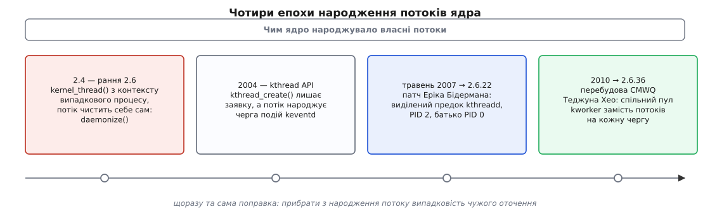
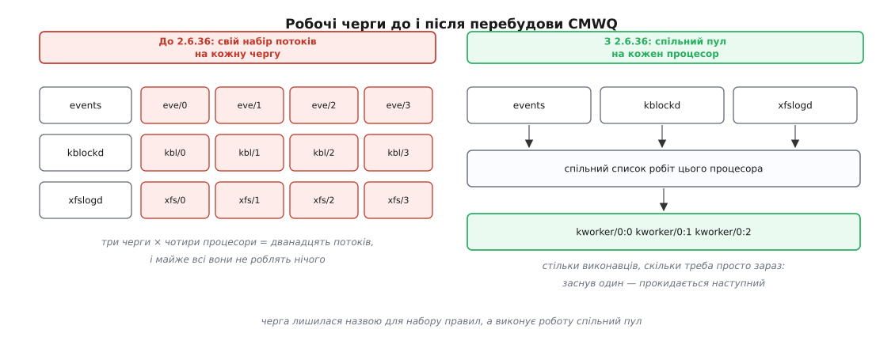

# 📜 Від daemonize() до kworker: як ядро вчилося народжувати власні потоки

Десять років ядро Linux переписувало одну й ту саму частину себе — ту, що створює потоки ядра, — і щоразу з тієї самої причини: свіжий потік успадковував оточення випадкового процесу, який просто опинився поруч у мить створення. Ця історія починається з функції, яку кожен драйвер мусив кликати власноруч, і закінчується пулом безіменних виконавців, які самі знають, скільки їх має бути.



*Кожен крок прибирає з народження потоку ще один шматок випадковости.*

## Потік, який чистив себе сам

У ядрах 2.4 і ранніх 2.6 створення потоку ядра виглядало так: код кликав `kernel_thread(fn, arg, flags)`, а нова задача першою ж дією викликала `daemonize()` — і аж тоді ставала потоком ядра.

Порядок тут не деталь, а суть біди. `kernel_thread()` — це звичайне клонування поточної задачі. А поточною задачею була та, що виконувала цей код: якщо модуль вантажили командою `modprobe`, батьком потоку ядра ставав `modprobe` (див. [модулі ядра](topic:unix-linux/kernel-modules) — драйвер стає частиною ядра саме через запуск такої програми з простору користувача). Новонароджений успадковував від нього все: відкриті файлові дескриптори, поточний і кореневий каталоги, керівний термінал, маску сигналів, приналежність до сеансу й групи процесів.

Ось як виглядало прибирання в ядрі 2.4.0:

```c
void daemonize(void)
{
	struct fs_struct *fs;

	/*
	 * If we were started as result of loading a module, close all of the
	 * user space pages.  We don't need them, and if we didn't close them
	 * they would be locked into memory.
	 */
	exit_mm(current);

	current->session = 1;
	current->pgrp = 1;

	/* Become as one with the init task */

	exit_fs(current);	/* current->fs->count--; */
	fs = init_task.fs;
	current->fs = fs;
	atomic_inc(&fs->count);
	exit_files(current);
	current->files = init_task.files;
	atomic_inc(&current->files->count);
}
```

Коментар у коді називає причину прямо: якщо потік лишить собі відображення пам'яті того, хто його породив, ця пам'ять буде замкнена доти, доки живе потік. Те саме з каталогами: потік ядра, що тримає посилання на кореневий каталог `modprobe`, тримає й змонтовану файлову систему, з якої той запустився, — і `umount` дає «пристрій зайнято» без жодного видимого винуватця.

Тепер придивіться, чого в цій функції немає. Немає імені: `current->comm` лишався тим, що дістався від батька, і драйвер сам писав туди щось на кшталт `strcpy(current->comm, "kjournald")`. Немає блокування сигналів: потік ядра з успадкованою маскою міг дістати `SIGTERM`, адресований геть іншому процесові, і тихо померти посеред роботи. Немає перепідпорядкування: батьком лишався `modprobe`, тож коли той завершувався, потік ядра ставав сиротою й [переходив до init](topic:unix-linux/orphan-reparenting) — а `init` мусив потім жати на `wait()` по задачах, які йому ніколи не належали.

Усе це драйвери дописували самі, кожен по-своєму. Хтось забував заблокувати сигнали, хтось — перейменуватися, хтось кликав `reparent_to_init()`, а хтось ні. І між `kernel_thread()` та `daemonize()` лишалося вікно, у якому потік уже виконується, а ще не відв'язаний: дескриптори чужі, сигнали приходять, батько будь-якої миті може завершитися.

Функція росла роками, ковтаючи забуті кроки. У ядрі 2.6.12 вона вже приймає ім'я, блокує **й** скидає сигнали, відв'язує термінал і сама кличе `reparent_to_init()`:

```c
void daemonize(const char *name, ...)
{
	/* ... */
	vsnprintf(current->comm, sizeof(current->comm), name, args);
	exit_mm(current);
	set_special_pids(1, 1);
	current->signal->tty = NULL;

	/* Block and flush all signals */
	sigfillset(&blocked);
	sigprocmask(SIG_BLOCK, &blocked, NULL);
	flush_signals(current);

	/* Become as one with the init task */
	exit_fs(current);
	current->fs = init_task.fs;
	exit_files(current);
	current->files = init_task.files;

	reparent_to_init();
}
```

Це вже майже правильно — але сама схема лишається зворотною. Задача спершу народжується забрудненою, а потім відмивається. Кожен новий вид забруднення доводиться згадувати й дописувати в список.

> 🔧 **Навіщо це.** Та сама назва `daemonize` живе й у просторі користувача, і значить майже те саме: відв'язатися від того, з чого тебе запустили. [Демонізація](topic:unix-linux/daemonize) в userspace — це `fork`, новий сеанс, закриті успадковані дескриптори й корінь у `/`. Ядро вирішувало ту саму задачу з одним ускладненням: демон у просторі користувача очищає себе задля свого спокою, а потік ядра — щоб не тримати заручником чужу файлову систему.

## Чисте оточення краще передавати у спадок

Розв'язок з'явився там, де біль став нестерпним. Расті Расселл (Rusty Russell) робив гаряче під'єднання процесорів — а це означає створювати й убивати потоки ядра на льоту, з довільного контексту, багато разів. LWN 6 січня 2004 року описав нові примітиви, які він для цього написав, і назвав діагноз старої схеми: код створення потоку переписували щоразу наново, і певні речі — зокрема чистоту оточення — робили не завжди добре.

Новий API виглядав інакше: `kthread_create(fn, data, "ім'я")` і `kthread_run()`, `kthread_should_stop()` і `kthread_stop()`. Замовник більше не клонує себе. Він лишає **заявку**, а справжнім батьком нового потоку стає хтось інший — той, чиє оточення завідомо чисте.

Спершу цим кимось зробили чергу подій `keventd` — робочу чергу, потоки якої вже були потоками ядра з правильним оточенням. Коментар у `kernel/kthread.c` версії 2.6.21 називає причину дослівно: створення робиться через `keventd`, щоб дістати чисте оточення, навіть коли нас покликано з простору користувача — «think modprobe, hotplug cpu, …». Заявка була структурою з полем `struct work_struct`, яку ставили в чергу через `queue_work(helper_wq, &create.work)`, а замовник чекав на `completion`.

Це вже правильна ідея: очищення переїхало з дитини на батька. Але воно було наполовину — свіжий потік у тій самій версії 2.6.21 усе ще сам кликав `kthread_exit_files()` і сам забивав маску сигналів через `sigfillset()`. І, головне, схема тягла за собою залежність, яка невдовзі й стала на заваді.

## Кругова залежність, яку розірвав Бідерман

Робочі черги створюють свої потоки через `kthread_create()`. А `kthread_create()` створює потоки через робочу чергу. Коло замкнулося: підсистема kthread не могла запрацювати, доки не піднято робочі черги, а ті не могли піднятися без kthread.

Практично це означало, що kthread оживає пізно — вже після того, як система ініціалізувала чимало іншого. Ерік В. Бідерман (Eric W. Biederman) сформулював, чому це погано, у комітному повідомленні патча «kthread: don't depend on work queues» (автор — `ebiederm@xmission.com`, 9 травня 2007, з поправкою Ендрю Мортона «use interruptible sleeps»; у дерево Лінуса патч ліг того ж дня). Формулювання там таке: задачі, створені через `kthread_create`, мають бути якнайближчі до `init_task` і не бути «contaminated by user processes» — забрудненими процесами користувача; а чим пізніше стартує `kthreadd`, тим важче цього уникнути.

Причина проста: чим пізніше народжується той, хто породжує потоки ядра, тим більше в системі вже є чого успадкувати помилково — і тим довший список того, що доводиться відмивати.

Патч викинув робочі черги зі шляху створення й замінив їх простим списком заявок, `kthread_create_list`. Замість позиченої черги подій з'явився власний предок — `kthreadd`, якого запускають з `init_task` одразу після потоку, що згодом виконає `/sbin/init`. У `init/main.c` версії 2.6.22 це два рядки поспіль:

```c
kernel_thread(kernel_init, NULL, CLONE_FS | CLONE_SIGHAND);
numa_default_policy();
pid = kernel_thread(kthreadd, NULL, CLONE_FS | CLONE_FILES);
kthreadd_task = find_task_by_pid(pid);
```

Звідси й номери, які всі бачать у `ps`: перший потік дістає PID 1, другий — PID 2 (про те, чому саме перший номер особливий, — [роль init і PID 1](topic:unix-linux/init-and-pid1)). Обидва — діти задачі простою з номером нуль, тож у `kthreadd` батьківський PID дорівнює 0.

Бідерман окремо називає обидва наслідки цього батьківства. Перший — від чистого предка потрібно міняти лише те, що справді має відрізнятися: ім'я, набір дозволених процесорів, ставлення до сигналів. Саме це й робить `kthreadd_setup()` у 2.6.22, і більше нічого. Другий наслідок тонший: потоки ядра тепер ростуть не під PID 1, тож не засмічують дерево дітей першого процесу й не сповільнюють родину [викликів wait()](topic:unix-linux/exit-wait-zombies), якими той збирає своїх справжніх сиріт.

У той самий день і в те саме вікно злиття ліг патч Олега Нестерова: потоки ядра перестали **блокувати** сигнали й почали їх **ігнорувати**, поставивши `SIG_IGN`. Різниця практична: заблокований сигнал стає в чергу й займає пам'ять, поки хтось його не забере, а проігнорований відкидається одразу.

Так у ядрі 2.6.22 (липень 2007) з'явився той самий `[kthreadd]` з другим номером, який ви бачите в кожній сучасній системі. Перевірити межу просто: у `kernel/kthread.c` версії 2.6.21 ще стоїть `queue_work(helper_wq, …)`, у версії 2.6.22 — вже вічний цикл `kthreadd()`, що розбирає список заявок.

## Тисяча потоків, які майже завжди сплять

Друга половина історії — про те, ким усі ці потоки виявилися насправді. Переважна їх більшість — не самостійні служби, а виконавці робочих черг: механізму, яким ядро [відкладає на потім](topic:unix-linux/interrupts-bottom-halves) те, чого не можна робити в обробнику переривання.

Стара схема черг була прямолінійна: кожна черга — свої потоки. Багатопотокова черга тримала по потоку на кожен процесор, однопотокова — один на всю систему. Драйвер, якому потрібна власна черга, кликав `create_workqueue("myfs")` і діставав `myfs/0`, `myfs/1`, `myfs/2`… — по одному на ядро процесора.

Наслідки описано в документі `Documentation/workqueue.txt`, який Теджун Хео (Tejun Heo) написав разом із цією перебудовою. Марнотратство: одна багатопотокова черга тримає стільки потоків, скільки в машині процесорів, і на великих системах завантаження встигало вичерпати типовий простір у 32 тисячі номерів PID. Під статтею LWN про робочі черги від 7 вересня 2010 року читач описав свій випадок: чотириядерний Nehalem із гіперпотоковістю — машина, за його ж словами, не бозна-яка велика — заводив під час старту майже тисячу потоків ядра; він назвав це «way past ridiculous», далеко за межею смішного.

Найдивніше, що ця орда потоків давала при цьому **замало** паралельности. Кожна черга мала власний пул, тож багатопотокова черга давала рівно один контекст виконання на процесор, а однопотокова — один на систему. Роботи змагалися за цю вузьку шпарину, і звідси, як пише Хео, схильність до взаємних блокувань навколо єдиного контексту виконання. Класична пастка: робота A, що стоїть у черзі й чекає завершення роботи B, яка стоїть у тій самій черзі за нею. Один контекст — A не звільнить його, доки не дочекається B, а B не почнеться, доки не звільниться контекст. Це не помилка драйвера в звичному сенсі: те саме поєднання на іншій черзі працює справно.



*Одна й та сама робота, але виконавців більше не приписано до конкретної черги.*

## CMWQ: пул, який сам знає, скільки його треба

Перебудову назвали concurrency managed workqueue — робочі черги з керованою паралельністю; вона ввійшла в ядро 2.6.36 (жовтень 2010), а основний патч Теджуна Хео датовано 29 червня 2010 року. Документ називає три мети: не зламати наявний API черг; дати спільні пули виконавців на процесор, щоб паралельність бралася на вимогу й не марнувала ресурсів; і регулювати цю паралельність автоматично, щоб той, хто ставить роботу в чергу, узагалі про неї не думав.

Ключ до автоматичности — у слові «керована». Пул бачить, скільки його виконавців зараз **справді працює** на процесорі, бо ядро повідомляє його, коли виконавець засинає й коли прокидається. Мета проста: щоб на кожному процесорі виконувалася рівно одна робота. Заснув виконавець на блокуванні чи на диску — пул будить наступного або створює нового; лишився без роботи — зайві виконавці невдовзі зникають.

Черга з цього моменту перестала бути набором потоків і стала набором правил: скільки робіт із неї можна виконувати одночасно (`max_active`), чи можна її роботі відкладати надовго, чи потрібен цій черзі окремий рятівний потік. Останнє — відповідь на найнеприємніший клас блокувань: черзі, від якої залежить звільнення пам'яті, дають прапорець `WQ_MEM_RECLAIM` і виділеного рятівника, бо створити нового виконавця під тиском пам'яті можна не завжди, а саме тоді ця робота й потрібна найбільше. Тому й функцію створення черги замінили на `alloc_workqueue()` із прапорцями — старий `create_workqueue()` лишився обгорткою заради сумісности.

Видима частина цієї зміни — імена. Замість `events/0`, `kblockd/0`, `xfslogd/1` у `ps` з'явилися безликі `kworker/0:1`, `kworker/1:2` і `kworker/u16:3` для непов'язаних із конкретним процесором пулів: у назві лишилися процесор і порядковий номер виконавця, бо черги він більше не має. Ціна — діагностична: побачивши, що `kworker` їсть процесор, ви більше не знаєте із самої назви, чия це робота. Саме тому згодом (ядро 4.18) до рядка `ps` додали назву робочої черги, з якої виконавець узяв роботу: `kworker/1:2-events`.

Спільна нитка всіх чотирьох епох одна. Потік ядра — звичайна задача, а задача в Unix завжди народжується від когось і завжди щось успадковує. Кожен крок цієї історії відповідав на питання «від кого саме»: спершу від того, хто випадково опинився поруч, — і тоді доводиться відмиватися; потім від черги подій; далі від виділеного чистого предка; і врешті виявилося, що більшості потоків не треба народжуватися взагалі — досить пулу виконавців, який тримає рівно стількох, скільки роботи є просто зараз.
