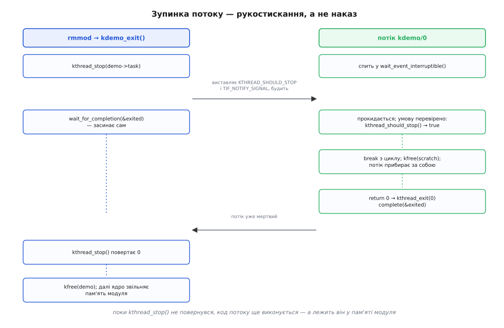
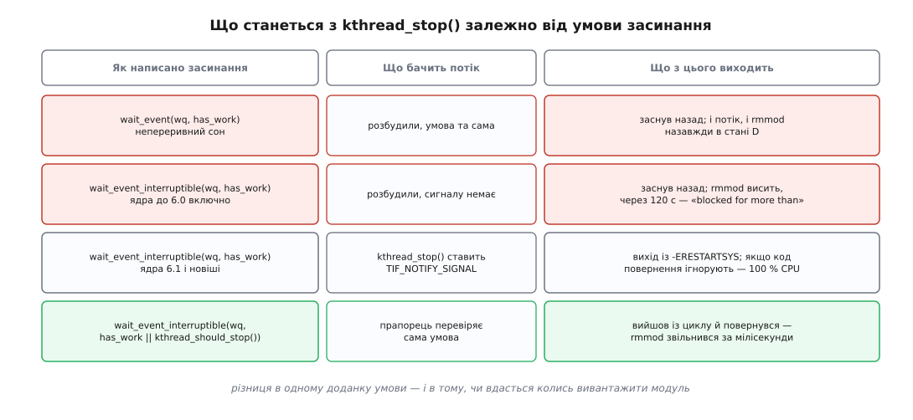

# ⚙️ Модуль із власним потоком ядра: завести, розбудити, зупинити

Нижче — робочий модуль, який заводить власну задачу ядра, будить її командою з оболонки й коректно спиняє під час вивантаження. Запустити потік коштує одного виклику; майже вся решта коду існує заради однієї гарантії — коли ядро звільнить пам'ять модуля, у ній уже ніхто не виконуватиметься.

## Задача

Написати [модуль](book:unix-linux/kernel-modules), який під час завантаження створює один потік ядра. Потік спить, доки нема роботи; ззовні його можна штовхнути записом у файл в `/sys`; після `rmmod` він мусить вийти сам, а модуль — зникнути без слідів.

Знадобиться Linux із заголовками поточного ядра (`linux-headers-$(uname -r)` або `kernel-devel`), компілятор і право виконувати `insmod`. Право це не звичайне: [повноваження](book:unix-linux/capabilities) `CAP_SYS_MODULE` дає змогу виконати будь-який код у найпривілейованішому режимі процесора, тож усі досліди — у віртуальній машині зі знімком стану. Дві з шести пасток нижче кінчаються Oops, і краще, щоб падала не ваша робоча система.

## Ідея: зупинка — це рукостискання

Головне рішення в цьому модулі приймається до першого рядка коду, і воно не про потік, а про пам'ять.

Функція, яку виконує потік, лежить у пам'яті модуля. Змінні, з якими він працює, — теж. Коли `rmmod` спрацював, ядро звільняє цю пам'ять і віддає її під що завгодно. Отже, між «rmmod почався» і «пам'ять звільнено» хтось мусить дочекатися, доки потік перестане в цій пам'яті виконуватися.

Природно було б сподіватися, що про це подбає саме ядро — так само, як воно рахує відкриті дескриптори драйвера й не дає зняти модуль, поки хтось ним користується. Але потік ядра **не тримає посилання на модуль**. `kthread_run()` ніде не кличе `try_module_get()`, тож лічильник у `lsmod` буде нулем навіть тоді, коли потік крутиться на повну. Ядро дозволить вивантаження, не спитавши нікого.

Тому чекати мусить сам модуль, і механізм для цього єдиний. `kthread_stop()` не вбиває задачу — він виставляє їй позначку «час зупинитися», будить її й **чекає, доки її функція сама повернеться**. Повернене значення стане результатом виклику. Це рукостискання з двох сторін: одна сторона просить, друга підтверджує виходом.



*Права доріжка виконується в пам'яті модуля; ліва звільняє цю пам'ять — тому вони й мусять зустрітися.*

Звідси випливає форма функції потоку, і вона не декоративна: цикл, який на кожному колі питає позначку; засинання, яке питає її теж; і єдиний спосіб піти — повернутися з функції.

## Код

```c
/* kdemo.c — модуль із власним потоком ядра */
#define pr_fmt(fmt) KBUILD_MODNAME ": " fmt

#include <linux/init.h>
#include <linux/module.h>
#include <linux/moduleparam.h>
#include <linux/kthread.h>
#include <linux/wait.h>
#include <linux/slab.h>
#include <linux/sched.h>
#include <linux/smp.h>
#include <linux/err.h>
#include <linux/sysfs.h>

struct kdemo {
    struct task_struct *task;
    wait_queue_head_t   waitq;
    bool                has_work;
    unsigned long       rounds;
};

static struct kdemo *demo;

/* ── усе життя потоку — це одна функція ────────────────────────────── */
static int kdemo_thread(void *arg)
{
    struct kdemo *d = arg;
    void *scratch;

    scratch = kmalloc(PAGE_SIZE, GFP_KERNEL);
    if (!scratch) {
        pr_err("немає пам'яті під буфер\n");
        goto wait_for_stop;      /* саме goto, а не return: пастка 3 */
    }

    pr_info("потік %s стартував, pid=%d\n", current->comm, current->pid);

    while (!kthread_should_stop()) {
        wait_event_interruptible(d->waitq,
                                 READ_ONCE(d->has_work) ||
                                 kthread_should_stop());
        if (kthread_should_stop())
            break;

        WRITE_ONCE(d->has_work, false);

        memset(scratch, 0, PAGE_SIZE);      /* справжня робота: тут спати МОЖНА */
        d->rounds++;
        pr_info("коло %lu на CPU%u\n", d->rounds, raw_smp_processor_id());
    }

    kfree(scratch);
    pr_info("потік виходить, зроблено кіл: %lu\n", d->rounds);
    return 0;

wait_for_stop:
    /* здатися можна; мовчки повернутися — ні: на нас чекатиме kthread_stop() */
    set_current_state(TASK_INTERRUPTIBLE);
    while (!kthread_should_stop()) {
        schedule();
        set_current_state(TASK_INTERRUPTIBLE);
    }
    __set_current_state(TASK_RUNNING);
    return -ENOMEM;
}

/* ── штовхнути потік ззовні: запис у /sys/module/kdemo/parameters/kick ── */
static int kdemo_kick_set(const char *val, const struct kernel_param *kp)
{
    if (!demo)
        return -ENODEV;

    WRITE_ONCE(demo->has_work, true);       /* спершу факт... */
    wake_up_interruptible(&demo->waitq);    /* ...і аж потім побудка */
    return 0;
}

static int kdemo_kick_get(char *buf, const struct kernel_param *kp)
{
    return sysfs_emit(buf, "%lu\n", demo ? READ_ONCE(demo->rounds) : 0UL);
}

static const struct kernel_param_ops kdemo_kick_ops = {
    .set = kdemo_kick_set,
    .get = kdemo_kick_get,
};
module_param_cb(kick, &kdemo_kick_ops, NULL, 0644);
MODULE_PARM_DESC(kick, "запис — розбудити потік; читання — скільки кіл зроблено");

/* ── завантаження й вивантаження ───────────────────────────────────── */
static int __init kdemo_init(void)
{
    struct task_struct *t;

    demo = kzalloc(sizeof(*demo), GFP_KERNEL);
    if (!demo)
        return -ENOMEM;

    init_waitqueue_head(&demo->waitq);

    t = kthread_run(kdemo_thread, demo, "kdemo/%d", 0);
    if (IS_ERR(t)) {
        int err = PTR_ERR(t);

        pr_err("kthread_run: %d\n", err);
        kfree(demo);
        demo = NULL;
        return err;
    }

    demo->task = t;
    pr_info("завантажено, потік pid=%d\n", task_pid_nr(t));
    return 0;
}

static void __exit kdemo_exit(void)
{
    int ret = kthread_stop(demo->task);   /* повернеться лише з мертвим потоком */

    pr_info("потік завершився з кодом %d\n", ret);
    kfree(demo);
    demo = NULL;
}

module_init(kdemo_init);
module_exit(kdemo_exit);

MODULE_LICENSE("GPL");
MODULE_DESCRIPTION("Потік ядра: запуск, побудка, зупинка");
```

Кілька рядків варті окремої уваги.

`kthread_run(fn, data, "kdemo/%d", 0)` — це не окремий механізм, а макрос із двох дій: `kthread_create()` плюс `wake_up_process()`. Ім'я задається форматним рядком, і воно ж потрапить у поле `comm` та у вивід `ps`. Форматування тут доречне саме тому, що потоків одного роду зазвичай кілька — по одному на процесор чи на пристрій, і номер у назві їх розрізняє. Але поле `comm` коротке, шістнадцять байтів разом із нулем: довше ім'я ядро мовчки обріже.

Повертається не покажчик або `NULL`, а або задача, або **код помилки, запакований у покажчик**. Тому перевірка — `IS_ERR()`, а розпакування — `PTR_ERR()`; звичайне `if (!t)` тут пропустить помилку далі й дасть падіння на першому ж використанні.

Рядок `demo->task = t;` стоїть **після** того, як потік уже пущено, і це працює лише тому, що сам потік поля `task` не читає. Якби читав — була б класична гонитва старту. Правильна форма для такого випадку — розділити пару: `kthread_create()`, доналаштувати все, і аж тоді `wake_up_process()`. Нижче ми саме так і зробимо, коли доведеться прив'язувати потік до процесора.

У `kdemo_kick_set()` порядок двох рядків — не стилістика. Спершу виставляємо факт (`has_work`), потім будимо. Зворотний порядок дав би вікно, у якому потік прокинувся, перевірив умову, не побачив роботи й заснув знову — і побудка пропала б. Правило `wake_up()` після зміни всього, від чого залежить умова, записане просто в коментарі до `wait_event_interruptible` у заголовку ядра; сам `wake_up()` при цьому несе потрібні бар'єри пам'яті, тож окремих не треба.

І `wait_event_interruptible()` — це макрос, а не функція. Він перевіряє умову, і якщо та хибна — вкладає задачу в [чергу очікування](book:unix-linux/kernel-wait-queues), позначає стан `TASK_INTERRUPTIBLE` і викликає планувальник. Умова обчислюється наново на кожній побудці; те, що ви написали в дужках, виконається багато разів, тому там не місце нічому важкому чи з побічними ефектами.

## Makefile

```makefile
obj-m += kdemo.o

KDIR ?= /lib/modules/$(shell uname -r)/build

all:
	$(MAKE) -C $(KDIR) M=$(CURDIR) modules

clean:
	$(MAKE) -C $(KDIR) M=$(CURDIR) clean
```

(Відступи в рецептах — табуляція, інакше `make` відмовиться це читати.)

Файл нічого не збирає сам: `-C $(KDIR)` перемикає `make` у теку заголовків працюючого ядра, а `M=$(CURDIR)` каже його системі збирання, що зовнішній модуль лежить ось тут. Компілятор, прапорці й конфігурація беруться з того ядра, проти якого ви збираєтеся, — інакше зміщення полів у структурах не збіглися б.

## Запуск

```console
$ make
make -C /lib/modules/6.8.0-45-generic/build M=/home/u/kdemo modules
  CC [M]  /home/u/kdemo/kdemo.o
  MODPOST /home/u/kdemo/Module.symvers
  CC [M]  /home/u/kdemo/kdemo.mod.o
  LD [M]  /home/u/kdemo/kdemo.ko

$ sudo insmod kdemo.ko
$ dmesg | tail -2
[ 1204.551302] kdemo: завантажено, потік pid=4812
[ 1204.551344] kdemo: потік kdemo/0 стартував, pid=4812
```

Потік уже в системі, і виглядає він точнісінько як інші мешканці квадратних дужок:

```console
$ ps ax | grep '[k]demo'
   4812 ?        S      0:00 [kdemo/0]

$ grep -E '^(Name|State|Threads|Vm)' /proc/4812/status
Name:	kdemo/0
State:	S (sleeping)
Threads:	1
```

Жодного рядка `Vm` — і фільтр тут ні до чого. Ядро друкує ці рядки, лише коли в задачі є відображення пам'яті; тут його немає, тому їх просто не існує. Стан `S` означає переривний сон: задача лежить у нашій черзі очікування.

Тепер штовхнемо її:

```console
$ echo 1 | sudo tee /sys/module/kdemo/parameters/kick > /dev/null
$ dmesg | tail -1
[ 1260.113905] kdemo: коло 1 на CPU3
$ cat /sys/module/kdemo/parameters/kick
1
```

Файл у [sysfs](book:unix-linux/sysfs-device-model) з'явився через `module_param_cb`: запис кличе `.set`, читання — `.get`. Це найдешевший спосіб мати з модулем двосторонню розмову, не пишучи ані символьного пристрою, ані `ioctl`.

Перед вивантаженням варто глянути на лічильник посилань — саме той, на який годі покладатися:

```console
$ lsmod | grep kdemo
kdemo                  16384  0
```

Нуль, хоча потік живий. Ядро не бачить у ньому користувача модуля.

```console
$ sudo rmmod kdemo
$ dmesg | tail -2
[ 1301.402118] kdemo: потік виходить, зроблено кіл: 1
[ 1301.402260] kdemo: потік завершився з кодом 0
```

Порядок цих двох рядків — і є доказ рукостискання. Спершу договорив потік, і лише потім `kthread_stop()` віддав керування в `kdemo_exit()`. Якби порядок був зворотний, це означало б, що модуль звільнив пам'ять під ногами в того, хто ще виконується.

## Прив'язати до процесора

Потік ядра прив'язують до конкретного процесора тоді, коли він обслуговує саме його: черги, переривання, таймери, кеш. Робиться це `kthread_bind()`, і саме тут згодиться розділена пара створення й побудки:

```c
static int cpu = -1;
module_param(cpu, int, 0444);
MODULE_PARM_DESC(cpu, "прив'язати потік до цього процесора; -1 — не прив'язувати");

    /* у kdemo_init() замість kthread_run() */
    t = kthread_create(kdemo_thread, demo, "kdemo/%d", cpu < 0 ? 0 : cpu);
    if (IS_ERR(t)) { /* ...як було... */ }

    if (cpu >= 0)
        kthread_bind(t, cpu);   /* лише поки задача ще жодного разу не бігала */

    demo->task = t;
    wake_up_process(t);         /* ось тепер — у чергу готових */
```

`kthread_bind()` вимагає, щоб задача була **щойно створена й ще не виконувалася**: усередині він чекає, доки вона стоятиме, і в разі невдачі просто друкує попередження стеком, а прив'язки не буде. Тому `kthread_run()` тут не годиться — він будить задачу тієї ж миті. Є ще пара `kthread_create_on_cpu()` / `kthread_run_on_cpu()`: вони роблять те саме, але додатково запам'ятовують номер процесора всередині задачі, щоб після паркування й розпаркування — а саме це з такими потоками роблять, коли процесор від'єднують, — прив'язку відновили правильно.

Тепер найцікавіше — що на це скаже `taskset`:

```console
$ sudo insmod kdemo.ko cpu=3
$ taskset -pc 4931
pid 4931's current affinity list: 3

$ sudo taskset -pc 0-7 4931
taskset: failed to set pid 4931's affinity: Invalid argument
```

Читання працює, запис — ні. Причина не в правах: `kthread_bind()` разом із маскою виставляє задачі прапорець `PF_NO_SETAFFINITY`, а `sched_setaffinity()` починається з перевірки цього прапорця й повертає `-EINVAL`. У `sched_getaffinity()` такої перевірки немає, тому [набір дозволених процесорів](book:unix-linux/cpu-affinity) прочитати можна завжди.

Заборона не примхлива. Така задача існує заради свого процесора; переселивши її, ви не розвантажите ядро, а зламаєте те, що воно обслуговує. Звільняти виділені ядра від фонової роботи доводиться не переселенням потоків, а тим, щоб роботи для них там не виникало.

Прив'язка дає ще один, менш очевидний виграш. У коді потоку ми писали `raw_smp_processor_id()`, а не звичайний `smp_processor_id()` — бо звичайний у ядрі з увімкненою діагностикою [витіснення](book:unix-linux/kernel-preemption) друкує `BUG: using smp_processor_id() in preemptible code`: між обчисленням номера й його використанням задачу могли перенести. Але перевірка має виняток, який так і зветься — «потік, прив'язаний до процесора»: якщо в задачі стоїть `PF_NO_SETAFFINITY` і дозволений рівно один процесор, номер змінитися не може. Тобто після `kthread_bind()` звичайний `smp_processor_id()` стає законним, і зроблено це саме для таких потоків.

## Шість пасток

### 1. Умова засинання, яка не питає про зупинку

Найпоширеніша помилка виглядає нешкідливо:

```c
        wait_event_interruptible(d->waitq, READ_ONCE(d->has_work));
```

Роботи більше не буде — `rmmod` для того й прийшов. Отже, `kthread_stop()` виставив позначку й розбудив задачу; та перевірила умову, побачила `false` — і за буквою макроса має заснути назад, тимчасом як `kthread_stop()` уже стоїть у `wait_for_completion()`.

Чим це кінчиться насправді, залежить від того, як саме написано засинання і яке у вас ядро:



*Той самий виклик поводиться по-різному в ядрах до 6.0 і починаючи з 6.1 — і жодна з цих поведінок не є тією, якої ви хотіли.*

З ядра 6.1 `kthread_stop()` окрім позначки зупинки виставляє задачі ще й `TIF_NOTIFY_SIGNAL`, а `signal_pending()` вважає цей прапорець за сигнал — саме для того, щоб задача вирвалася з циклів очікування. Тож `wait_event_interruptible()` поверне `-ERESTARTSYS`. Але прапорець ніхто не зніме: знімають його на виході в простір користувача, куди потік ядра не ходить. Отже, кожне наступне переривне засинання повертатиметься миттєво, і потік, який ігнорує код повернення, крутитиметься на сто відсотків процесора замість того, щоб зависнути. Зависання перетворилося на пожирача такту — не подарунок, а інша діагностика.

А з `wait_event()` без суфікса, тобто з непереривним сном, ситуація не змінилася ні на йоту: жодні прапорці на нього не діють. Обидві задачі — і потік, і `rmmod` — застрягають у [стані](book:unix-linux/process-states) `D`, а за дві хвилини сторож зависань напише в журнал `INFO: task rmmod:5120 blocked for more than 120 seconds`. Далі — лише перезавантаження.

Лікується це одним доданком в умові, і саме він стоїть у робочому коді:

```c
        wait_event_interruptible(d->waitq,
                                 READ_ONCE(d->has_work) ||
                                 kthread_should_stop());
```

### 2. Спати там, де не можна

Потік ядра заводять переважно заради права заснути. Але право це належить не потокові, а **контексту**, у якому він саме зараз перебуває, — і сам же потік легко з цього контексту виходить:

```c
        /* якби в struct kdemo додали ще й spinlock_t lock */
        spin_lock(&d->lock);
        wait_event_interruptible(d->waitq, READ_ONCE(d->has_work));  /* ← так не можна */
        spin_unlock(&d->lock);
```

Звичайний спінлок вимикає витіснення, тобто робить контекст атомарним, а `wait_event_interruptible` починається з `might_sleep()`. У ядрі з `CONFIG_DEBUG_ATOMIC_SLEEP` це дасть у журналі `BUG: sleeping function called from invalid context`; без цього налаштування діагностика буде брутальнішою — `BUG: scheduling while atomic` уже з планувальника, а до того встигне статися будь-що. (У збірці `PREEMPT_RT` той самий `spin_lock()` перетворено на сплячий замок, і заборона там інша — але код мусить лишатися правильним для обох збірок.)

Та сама межа проходить і через розподіл пам'яті: `kmalloc(..., GFP_KERNEL)` має право заснути, чекаючи на звільнення сторінок, тож під [спінлоком](book:unix-linux/kernel-locking) припустимий лише `GFP_ATOMIC` — з меншим шансом на успіх і без будь-якого очікування. Правило запам'ятовується так: питання не «хто я», а «що я зараз тримаю».

### 3. Потік, який повернувся сам

Уявіть, що на початку функції потоку не вистачило пам'яті, і ви написали чесне `return -ENOMEM`. Модуль завантажився, потік прожив мілісекунду й помер.

Далі стається неприємне. Батько потоків ядра, `kthreadd`, ігнорує `SIGCHLD`, тому такий небіжчик прибирається сам собою: `task_struct` звільняється, зомбі не лишається. А в `demo->task` у вас лежить покажчик на цю пам'ять. Коли настане `rmmod`, `kthread_stop()` розіменує звільнену структуру ядра — це вже не «помилка в модулі», це псування чужої пам'яті з наслідками десь зовсім в іншому місці.

Заголовок ядра формулює це стримано: якщо функція потоку може завершитися сама, той, хто кличе `kthread_stop()`, мусить гарантувати, що `task_struct` нікуди не подінеться. Практично в модулі це означає одне з двох. Або не давати потокові підстав виходити самому — усе, що може не вдатися, виділяти в `kdemo_init()`, де є куди повернути помилку. Або, якщо вихід усе-таки можливий, не виходити мовчки, а дочекатися свого рукостискання — це і є мітка `wait_for_stop` у робочому коді:

```c
    set_current_state(TASK_INTERRUPTIBLE);
    while (!kthread_should_stop()) {
        schedule();
        set_current_state(TASK_INTERRUPTIBLE);
    }
    __set_current_state(TASK_RUNNING);
```

Стан виставляється **перед** перевіркою й наново після кожної побудки — інакше між перевіркою й `schedule()` лишалося б вікно, у якому `kthread_stop()` встиг би розбудити задачу, що ще не заснула, і побудка пропала б.

Побічний факт із того самого рукостискання: якщо задачу створити через `kthread_create()` і, не будячи, одразу спинити, `kthread_stop()` поверне `-EINTR`. Функція потоку в такому разі не виконається жодного разу.

### 4. Ззовні його не вбити

```console
$ sudo kill -9 4812
$ ps ax | grep '[k]demo'
   4812 ?        S      0:00 [kdemo/0]
```

Команда відзвітувала успіхом і не зробила нічого. Сигнали з простору користувача задачам із прапорцем `PF_KTHREAD` не доставляються взагалі — навіть `SIGKILL`, який для звичайного процесу невідхильний.

Так і має бути: спинити потік ядра має право лише той код, що його завів, — бо тільки він знає, у якій точці роботи потік зараз перебуває й що встиг захопити. У нашому модулі цей код — `kdemo_exit()`, тобто ваш `rmmod`.

Звідси й практичний висновок про попередні пастки: якщо потік застряг так, що не реагує на `kthread_stop()`, у вас не лишилося жодного важеля. Ані `kill`, ані `rmmod -f` — тільки перезавантаження.

### 5. Ресурси, які ніхто не підбере

Коли завершується звичайний процес, ядро прибирає за ним усе: адресний простір, дескриптори, відображення. Коли завершується потік ядра, не прибирається **нічого**. Немає ні деструкторів, ні обробників виходу, ні власника, який помітив би втрату.

Тому все, що функція потоку виділила, вона мусить звільнити сама, на кожному шляху виходу. У нашому коді `scratch` виділено на початку й звільнено рівно перед `return 0` — і саме тому в функції один нормальний вихід, а не три. Замки — так само: вийти з циклу зі взятим м'ютексом означає лишити його взятим назавжди, бо власника більше не існує, а розблокувати чужий м'ютекс нікому.

Звідси й порядок у `kdemo_exit()`: спершу `kthread_stop()`, потім `kfree(demo)`. Зворотний порядок — це `kthread_stop(demo->task)` з уже звільненої структури, тобто читання сміття замість покажчика на задачу.

### 6. Останнє коло під час вивантаження

Приберіть із `kdemo_exit()` виклик `kthread_stop()` — лишіть тільки `kfree(demo)`. Зберіть, завантажте, штовхніть кілька разів і зробіть `rmmod`.

Він спрацює миттєво: лічильник посилань нуль, заперечувати нікому. Ядро викличе `kdemo_exit()`, звільнить `demo` — а разом із ним і голову черги очікування, у якій лежить сплячий потік, — і поверне під інші потреби пам'ять, у якій лежить код `kdemo_thread()`. Далі можливі два кінці, і обидва погані. Або наступна побудка веде задачу в звільнену пам'ять, і в журнал падає [Oops](book:unix-linux/kernel-oops-panic) на кшталт `BUG: unable to handle page fault for address ...`. Або пам'ять уже встигли перевикористати, і потік слухняно виконає те, що там опинилося.

Найпідступніше те, що з першого разу може й пронести — якщо потік спав, а сторінки не встигли віддати. Помилка ця нестабільна за побудовою, і саме тому таку перевірку роблять не «на око», а окремим завантаженням у ядрі, зібраному з `CONFIG_DEBUG_KERNEL` і `KASAN`.

Той самий різновид гонитви має і тонший вияв, який лишається навіть у правильному коді. Файл `parameters/kick` живе в `sysfs` доти, доки ядро не розбере модуль, — а `kdemo_exit()` виконується **до** того. Тобто хтось може писати в цей файл рівно тоді, коли `demo` вже звільнено; перевірка `if (!demo)` вікна не закриває, бо між перевіркою й використанням покажчик може змінитися. У справжньому драйвері зовнішній вхід і вивантаження розводять м'ютексом; тут показано найкоротший варіант, і ця вада в ньому свідома.

## Чи потрібен був окремий потік

Тепер найкорисніше питання цієї вправи: коли всього вищенаписаного можна не робити.

Кожен потік ядра коштує однієї `task_struct`, шістнадцяти кілобайтів стека ядра й постійного рядка в списках планувальника. Це небагато, але це назавжди — і саме тому підсистеми ядра вже давно не заводять власного потоку під кожну відкладену справу. Типова відкладена робота йде в [робочу чергу](book:unix-linux/interrupts-bottom-halves): ви складаєте туди елемент — `INIT_WORK` плюс `schedule_work()`, — а виконують його спільні `kworker`, яких ядро заводить і згортає за потребою. Коду виходить п'ять рядків, і питання зупинки зводиться до `cancel_work_sync()`, який теж чекає — тим самим рукостисканням, тільки без вашої участі.

Власний потік виправданий, коли робота **триває**, а не трапляється: нескінченний цикл обслуговування пристрою, довгий скан, який не можна лишати на спільному робітникові, задача з власним пріоритетом планування, задача, прив'язана до конкретного процесора. Тобто тоді, коли вам потрібен не виконавець, а окрема одиниця, яку видно планувальнику.

І якщо потрібен саме він — усе, що ви написали в модулі понад один виклик `kthread_run()`, було відповіддю на єдину обставину: цю задачу ніхто не всиновив. Ні ядро, ні `init`, ні лічильник посилань модуля. Тому власником доводиться бути вашому коду — від першого `kmalloc` у функції потоку до останнього `kfree` після `kthread_stop()`.
