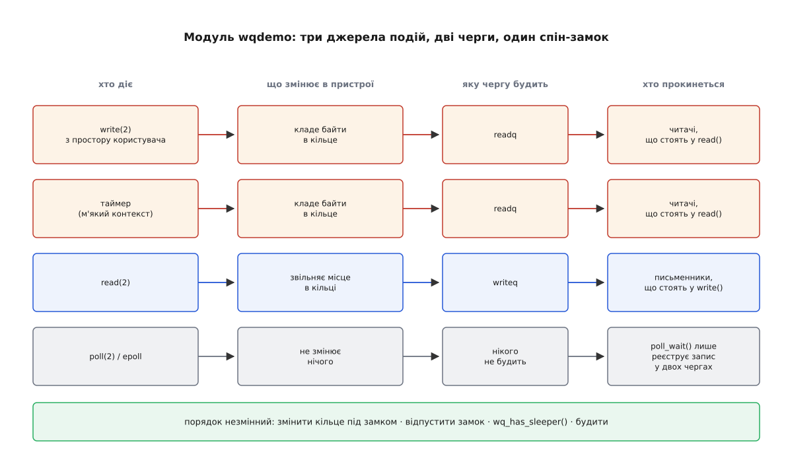

# ⚙️ Модуль ядра з чергою очікування: блокувальне читання, poll і гримуча отара

Нижче — робочий символьний пристрій, який уміє те саме, що вміє будь-який справжній драйвер: тримати кільцевий буфер, приспати читача, поки в буфері порожньо, розбудити його із запису й із таймера, віддати `-EAGAIN` тому, хто попросив `O_NONBLOCK`, і чесно відповісти на `poll()`. А коли модуль запрацює, ми поставимо на нього шістдесят чотири читачі й зміряємо, у скільки разів дешевшає одна подія після однієї-єдиної зміни — прапорця `WQ_FLAG_EXCLUSIVE` у записі черги.

## Задача

Написати [модуль](book:unix-linux/kernel-modules), який заводить `/dev/wqdemo` — пристрій, що поводиться як труба. Запис кладе байти в кільце; читання забирає їх, а якщо кільце порожнє — блокується, доки байти не з'являться. Джерел байтів два: чужий `write()` і таймер ядра, який імітує перервання від залізяки. Читач має право не блокуватися (`O_NONBLOCK`) і має право чекати через `poll()`/`epoll` разом з іншими дескрипторами. Ctrl-C мусить виривати читача зі сну.

Знадобиться Linux із заголовками поточного ядра (`linux-headers-$(uname -r)` або `kernel-devel`), компілятор і право виконувати `insmod`. Код нижче написано під ядро 6.6 і новіші; місця, де інтерфейс мінявся, позначено окремо. [Повноваження](book:unix-linux/capabilities) `CAP_SYS_MODULE` дає змогу виконати будь-який код у найпривілейованішому режимі процесора — тож усі досліди робіть у віртуальній машині зі знімком стану.

## Ідея: три рішення до першого рядка коду

Головні рішення в такому драйвері приймають не про чергу, а про **замок** — бо саме замок вирішує, хто й звідки має право чіпати умову, заради якої всі сплять.

**Перше.** Умова тут — «у кільці є байти», тобто пара індексів голови й хвоста. Захищати їх треба чимось, що можна взяти **з таймера**, а таймер спрацьовує в м'якому контексті ([нижній половині](book:unix-linux/interrupts-bottom-halves)), де спати заборонено. Отже, м'ютекс відпадає: він засинає. Лишається [спін-замок](book:programming/spinlock) — і саме тому в структурі пристрою стоїть `spinlock_t`, а не `struct mutex`. Це не питання швидкості; це питання того, чи має право код у контексті перервання взагалі торкнутися нашої умови.

**Друге, і воно випливає з першого.** Під спін-замком не можна `copy_to_user()`. Виглядає ця функція як звичайне копіювання, але сторінка користувача може виявитися невідображеною — і тоді копіювання спричинить [хибу сторінки](book:unix-linux/page-fault), а обробка хиби спить. Тому шлях читання розпадається на три кроки з різними правилами: **під замком** дістати байти з кільця в буфер усередині ядра, **відпустити замок**, і аж **потім** віддати їх користувачеві. Той самий поділ, дзеркально, робить `write()`.

**Третє.** Будити треба після того, як умова стала істинною, і **поза замком**. Поза — бо перше, що зробить розбуджена задача, це полізе по цей самий замок; якщо ми його ще тримаємо, вона одразу закрутиться на місці, витративши те пробудження намарне. А оскільки перед пробудженням ми хочемо дешево спитати «а чи є взагалі охочі», між зміною умови й читанням списку черги мусить стояти повний [бар'єр пам'яті](book:programming/memory-ordering-barriers) — його дає `wq_has_sleeper()`.

Звідси й уся форма модуля: одна структура пристрою, один спін-замок на кільце, дві черги очікування — окремо для читачів і окремо для письменників, — і незмінний порядок дій навколо кожного пробудження.



*`poll()` стоїть окремим рядком не випадково: він реєструє запис у чергах, але сам не засинає в них жодного разу.*

## Пристрій і кільце

```c
/* wqdemo.c — символьний пристрій із чергою очікування */
#define pr_fmt(fmt) KBUILD_MODNAME ": " fmt

#include <linux/init.h>
#include <linux/module.h>
#include <linux/moduleparam.h>
#include <linux/kernel.h>
#include <linux/fs.h>
#include <linux/cdev.h>
#include <linux/device.h>
#include <linux/slab.h>
#include <linux/spinlock.h>
#include <linux/wait.h>
#include <linux/sched.h>
#include <linux/poll.h>
#include <linux/timer.h>
#include <linux/jiffies.h>
#include <linux/uaccess.h>

#define RING_SIZE   4096u   /* степінь двійки: маска замість ділення */
#define CHUNK        256u   /* стільки байтів обслуговує один виклик */

struct wqdemo {
    spinlock_t         lock;    /* захищає кільце; його бере й таймер */
    char              *ring;
    unsigned int       head;    /* куди писати — лічильник, що не обгортається */
    unsigned int       tail;    /* звідки читати */

    wait_queue_head_t  readq;   /* тут сплять ті, кому бракує байтів */
    wait_queue_head_t  writeq;  /* а тут — ті, кому бракує місця */

    struct timer_list  tick;
    unsigned long      seq;

    struct cdev        cdev;
};

static struct wqdemo *dev;
static dev_t          devt;
static struct class  *cls;

static bool exclusive;
module_param(exclusive, bool, 0644);
MODULE_PARM_DESC(exclusive, "читачі стають у чергу виключними: будити по одному");

static unsigned int period_ms;
module_param(period_ms, uint, 0444);
MODULE_PARM_DESC(period_ms, "період таймера в мілісекундах; 0 — таймер вимкнено");
```

Кільце тут зроблено найдешевшим із відомих способів: індекси **не обгортаються**, обгортається лише віднімання. `head - tail` у беззнаковій арифметиці дає число зайнятих байтів навіть тоді, коли самі лічильники перекотилися через межу типу, а індекс у масив дістають маскою. Того й вимагає розмір — степінь двійки. Детальніше про цю конструкцію та її різновиди — у темі про [кільцевий буфер](book:algorithms/ring-buffer).

```c
static inline unsigned int ring_used(const struct wqdemo *d) { return d->head - d->tail; }
static inline unsigned int ring_free(const struct wqdemo *d) { return RING_SIZE - ring_used(d); }

/* обидві копіюють у пам'ять ЯДРА і кличуться ЛИШЕ під d->lock */
static unsigned int ring_put(struct wqdemo *d, const char *src, unsigned int n)
{
    unsigned int i;

    n = min(n, ring_free(d));
    for (i = 0; i < n; i++)
        d->ring[(d->head + i) & (RING_SIZE - 1)] = src[i];
    d->head += n;
    return n;
}

static unsigned int ring_get(struct wqdemo *d, char *dst, unsigned int n)
{
    unsigned int i;

    n = min(n, ring_used(d));
    for (i = 0; i < n; i++)
        dst[i] = d->ring[(d->tail + i) & (RING_SIZE - 1)];
    d->tail += n;
    return n;
}
```

Тепер — дві функції, які обчислюють умову для черги. Вони беруть замок, і це варто пояснити, бо на перший погляд виглядає зухвало: їх викликатимуть із нутрощів `wait_event_*`, коли задача вже оголосила себе сплячою.

```c
static bool ring_has_data(struct wqdemo *d)
{
    unsigned long flags;
    bool ret;

    spin_lock_irqsave(&d->lock, flags);
    ret = ring_used(d) != 0;
    spin_unlock_irqrestore(&d->lock, flags);
    return ret;
}

static bool ring_has_space(struct wqdemo *d)
{
    unsigned long flags;
    bool ret;

    spin_lock_irqsave(&d->lock, flags);
    ret = ring_free(d) != 0;
    spin_unlock_irqrestore(&d->lock, flags);
    return ret;
}
```

Це законно — і саме тому, що замок тут спін-замок, а не м'ютекс. Умову обчислюють у проміжку між «стан = `TASK_INTERRUPTIBLE`» і `schedule()`, а в цьому проміжку не можна лише **спати**; узяти й віддати замок, який ніколи не спить, — можна. Єдина тонкість ховається у `spin_unlock()`: він вмикає назад [витіснення](book:unix-linux/kernel-preemption), і ядро може тієї ж миті перепланувати нас. Але витіснення знімає задачу з процесора, **не виймаючи її з черги готових**, — незалежно від того, що записано в її стані. Тому оголошений заздалегідь сон не спрацьовує передчасно.

Спокуса написати простіше — читати `head` і `tail` без замка — велика, і в більшості прикладів у мережі так і зроблено. Здебільшого воно й працює, бо хибне «даних немає» коштує лише зайвого оберту циклу. Але два незалежні читання можуть скластися в картину, якої ніколи не існувало: `head` побачено до чужого запису, `tail` — уже після чужого читання. Раз на мільярди проходів різниця між ними випадково збіжиться з розміром кільця — і письменник засне на «кільце повне», якого не було. Замок коштує тут двох десятків тактів, та ще й на вже повільному шляху, тож відмовлятися від нього немає за що.

## Читання, що вміє чекати

```c
/* заснути так, як просить параметр модуля */
static int wqdemo_wait_data(struct wqdemo *d)
{
    if (READ_ONCE(exclusive))
        return wait_event_interruptible_exclusive(d->readq, ring_has_data(d));

    return wait_event_interruptible(d->readq, ring_has_data(d));
}

static ssize_t wqdemo_read(struct file *f, char __user *buf, size_t len, loff_t *off)
{
    struct wqdemo *d = f->private_data;
    char kbuf[CHUNK];
    unsigned long flags;
    unsigned int n;
    int ret;

    if (len > sizeof(kbuf))
        len = sizeof(kbuf);
    if (!len)
        return 0;                            /* read(fd, buf, 0) не має чекати */

    for (;;) {
        spin_lock_irqsave(&d->lock, flags);
        n = ring_get(d, kbuf, len);          /* істину беремо під замком */
        spin_unlock_irqrestore(&d->lock, flags);

        if (n)
            break;
        if (f->f_flags & O_NONBLOCK)
            return -EAGAIN;

        ret = wqdemo_wait_data(d);           /* ось тут задача засинає */
        if (ret)
            return ret;                      /* -ERESTARTSYS: прилетів сигнал */
    }

    if (copy_to_user(buf, kbuf, n))          /* замка вже немає — тут спати МОЖНА */
        return -EFAULT;

    if (wq_has_sleeper(&d->writeq))          /* у кільці звільнилося місце */
        wake_up_interruptible(&d->writeq);

    return n;
}
```

Цикл `for (;;)` починається зі спроби забрати дані, а не з перевірки умови, і це не лінощі. `ring_get()` і є перевіркою: він повертає нуль, коли брати нічого. Одна дія замість двох — і жодного вікна між «перевірив, що є» і «забрав», у яке міг би влізти інший читач.

Порядок трьох виходів теж не довільний. `O_NONBLOCK` перевіряють **після** спроби, а не до неї: неблокувальний виклик не означає «не читати», він означає «не чекати». Якщо байти вже лежать, він мусить їх віддати, і лише порожнє кільце перетворює його на `-EAGAIN`. Різниця між цими двома режимами й те, звідки береться `O_NONBLOCK`, — у темі про [блокувальний і неблокувальний ввід-вивід](book:unix-linux/blocking-and-nonblocking).

Найтонший рядок — `return ret` з кодом `-ERESTARTSYS`. Це значення **ніколи не доходить до програми**: воно призначене шарові системних викликів, який, побачивши його, або перезапустить виклик з початку, або віддасть `EINTR` — залежно від того, чи стоїть у обробника сигналу прапорець `SA_RESTART`. Тобто драйвер не вирішує, що побачить користувач; він лише каже «мене перервали, розберися». Коли який із двох варіантів настає — у темі про [перервані виклики й перезапуск](book:unix-linux/eintr-and-restart).

І одразу пастка, яку в цьому коді видно за побудовою, а в довшому драйвері — ні: **`-ERESTARTSYS` не можна повертати, якщо частину байтів уже віддано**. Перезапуск почне виклик спочатку, користувач отримає ті самі байти вдруге, і потік даних порветься. Тому в реальному драйвері, який складає відповідь із кількох порцій, помилка на другому колі перетворюється на `return already_copied` — і саме тому наша функція навмисно обслуговує рівно одну порцію.

> 🔧 **Навіщо це.** Порядок «змінити умову під замком → відпустити замок → `wq_has_sleeper()` → будити» повторюється в цьому файлі тричі й жодного разу не міняється. Коли доводиться читати чужий драйвер, шукайте саме його: якщо `wake_up()` стоїть **до** зміни умови — це зависання; якщо **під замком** — це втрачений такт на кожній події; якщо без `wq_has_sleeper()`, зате з голим `waitqueue_active()` — це втрачена побудка раз на мільйони проходів.

## Запис і таймер, який удає перервання

```c
static ssize_t wqdemo_write(struct file *f, const char __user *buf, size_t len, loff_t *off)
{
    struct wqdemo *d = f->private_data;
    char kbuf[CHUNK];
    unsigned long flags;
    unsigned int n;
    int ret;

    if (len > sizeof(kbuf))
        len = sizeof(kbuf);
    if (!len)
        return 0;                            /* нульовий запис не чекає на місце */
    if (copy_from_user(kbuf, buf, len))      /* замка ще немає — спати МОЖНА */
        return -EFAULT;

    for (;;) {
        spin_lock_irqsave(&d->lock, flags);
        n = ring_put(d, kbuf, len);
        spin_unlock_irqrestore(&d->lock, flags);

        if (n)
            break;
        if (f->f_flags & O_NONBLOCK)
            return -EAGAIN;

        ret = wait_event_interruptible(d->writeq, ring_has_space(d));
        if (ret)
            return ret;
    }

    if (wq_has_sleeper(&d->readq))
        wake_up_interruptible(&d->readq);

    return n;
}

static void wqdemo_tick(struct timer_list *t)
{
    struct wqdemo *d = container_of(t, struct wqdemo, tick);
    char msg[24];
    unsigned int n;

    n = scnprintf(msg, sizeof(msg), "tick %lu\n", ++d->seq);

    spin_lock(&d->lock);                     /* м'який контекст: irqsave не потрібен */
    ring_put(d, msg, n);
    spin_unlock(&d->lock);

    if (wq_has_sleeper(&d->readq))
        wake_up_interruptible(&d->readq);

    if (READ_ONCE(period_ms))
        mod_timer(&d->tick, jiffies + msecs_to_jiffies(READ_ONCE(period_ms)));
}
```

Дві функції роблять з кільцем те саме, а замок беруть по-різному, і в цій різниці — правило, яке варто вивчити напам'ять.

`spin_lock_irqsave()` у `write()` вимикає перервання на своєму процесорному ядрі. Причина не в тому, що ми боїмося перерватися, а в тому, що **той, хто нас урве, полізе по цей самий замок**. Якби таймер спрацював на цьому ж ядрі посеред нашої критичної ділянки, він закрутився б на замку, який тримає перервана ним же задача, — і крутився б вічно, бо звільнити той замок може лише той, кого він і не пускає виконуватися. Вимкнені перервання прибирають цю можливість цілком.

`spin_lock()` у таймері — навпаки, найпростіший варіант, і теж не з примхи. Обробник таймера виконується в м'якому контексті, а м'який контекст не буває вкладений сам у себе: два спрацювання того самого таймера не перетнуться на одному ядрі. Жоден обробник апаратного перервання цього замка не бере — отже, урвати нас нікому, і вимикати нема чого. Якби в модулі з'явилося справжнє перервання, `spin_lock()` тут довелося б замінити на `spin_lock_irqsave()`. Правило звучить так: **вимикати треба рівно ті контексти, з яких цей самий замок можуть узяти вдруге** — про решту різновидів і про те, які замки в ядрі взагалі сплять, є [окрема тема](book:unix-linux/kernel-locking).

`container_of(t, struct wqdemo, tick)` — це те саме, що популярний `from_timer(d, t, tick)`, розгорнутий вручну. Розгорнутий свідомо: у ядрі 6.16 макрос перейменували на `timer_container_of()`, а `container_of` не мінявся ніколи. Сам же `mod_timer()` усередині обробника — законний спосіб перезавести таймер на наступне коло; про одиниці, у яких він міряє час, і чому це `jiffies`, а не секунди, — у темі про [час у ядрі](book:unix-linux/kernel-timekeeping).

## poll: чекати, не засинаючи

```c
static __poll_t wqdemo_poll(struct file *f, struct poll_table_struct *pt)
{
    struct wqdemo *d = f->private_data;
    __poll_t mask = 0;

    poll_wait(f, &d->readq, pt);             /* безумовно й ДО перевірки умови */
    poll_wait(f, &d->writeq, pt);

    if (ring_has_data(d))
        mask |= EPOLLIN | EPOLLRDNORM;
    if (ring_has_space(d))
        mask |= EPOLLOUT | EPOLLWRNORM;

    return mask;
}
```

Уся суть цих семи рядків у тому, що `poll_wait()` **не чекає**. Ім'я обманює: функція лише реєструє запис у черзі й негайно повертається. Спати буде не драйвер, а сам `poll()`/`epoll` — і на власній черзі, а не на нашій. Наш запис у `readq` служить гачком: коли `wake_up_interruptible(&d->readq)` дійде до нього, спрацює не пробудження задачі, а функція, яку туди поклав `epoll`, і вже вона розбудить того, хто чекає на всі десять тисяч дескрипторів одразу. Механіку цієї конструкції розібрано в темі про [select, poll і epoll](book:unix-linux/select-poll-epoll).

Порядок двох частин функції — та сама вимога, що й у сплячого читача, лише в іншому вбранні: **спершу стати в чергу, потім дивитися на умову**. Зареєструвати запис лише тоді, коли даних немає, — найпоширеніша помилка в реалізаціях `.poll`, і кінчається вона тим самим зависанням: дані прийшли в щілину між перевіркою й реєстрацією, будити ще нікого, а зареєстрований потім запис уже нічого не отримає.

Другий бік того самого — обидва `poll_wait()` стоять **безумовно**, навіть коли нас питають лише про `POLLIN`. Ядро має право спитати про одну подію, а потім, не переопитуючи, чекати на іншу; запис, не поставлений «бо не питали», — це подія, про яку ніхто не дізнається.

## Реєстрація пристрою

```c
static int wqdemo_open(struct inode *i, struct file *f)
{
    f->private_data = container_of(i->i_cdev, struct wqdemo, cdev);
    return stream_open(i, f);      /* позиції немає; read і write можуть іти разом */
}

static const struct file_operations wqdemo_fops = {
    .owner = THIS_MODULE,
    .open  = wqdemo_open,
    .read  = wqdemo_read,
    .write = wqdemo_write,
    .poll  = wqdemo_poll,
};

static int __init wqdemo_init(void)
{
    struct device *device;
    int ret;

    dev = kzalloc(sizeof(*dev), GFP_KERNEL);
    if (!dev)
        return -ENOMEM;

    dev->ring = kmalloc(RING_SIZE, GFP_KERNEL);
    if (!dev->ring) { ret = -ENOMEM; goto err_dev; }

    spin_lock_init(&dev->lock);
    init_waitqueue_head(&dev->readq);
    init_waitqueue_head(&dev->writeq);
    timer_setup(&dev->tick, wqdemo_tick, 0);

    ret = alloc_chrdev_region(&devt, 0, 1, "wqdemo");
    if (ret) goto err_ring;

    cdev_init(&dev->cdev, &wqdemo_fops);
    dev->cdev.owner = THIS_MODULE;
    ret = cdev_add(&dev->cdev, devt, 1);
    if (ret) goto err_region;

    cls = class_create("wqdemo");            /* ядро < 6.4: class_create(THIS_MODULE, "wqdemo") */
    if (IS_ERR(cls)) { ret = PTR_ERR(cls); goto err_cdev; }

    device = device_create(cls, NULL, devt, NULL, "wqdemo");
    if (IS_ERR(device)) { ret = PTR_ERR(device); goto err_class; }

    if (period_ms)
        mod_timer(&dev->tick, jiffies + msecs_to_jiffies(period_ms));

    pr_info("/dev/wqdemo готовий: major=%d minor=%d\n", MAJOR(devt), MINOR(devt));
    return 0;

err_class:  class_destroy(cls);
err_cdev:   cdev_del(&dev->cdev);
err_region: unregister_chrdev_region(devt, 1);
err_ring:   kfree(dev->ring);
err_dev:    kfree(dev);
    return ret;
}

static void __exit wqdemo_exit(void)
{
    timer_shutdown_sync(&dev->tick);   /* більше не спрацює й не перезаведеться */
    device_destroy(cls, devt);
    class_destroy(cls);
    cdev_del(&dev->cdev);
    unregister_chrdev_region(devt, 1);
    kfree(dev->ring);
    kfree(dev);
}

module_init(wqdemo_init);
module_exit(wqdemo_exit);

MODULE_LICENSE("GPL");
MODULE_DESCRIPTION("Символьний пристрій із чергою очікування");
```

Два рядки тут варті окремої уваги.

`stream_open()` знімає з файлу поняття позиції — і не лише заради охайності. Разом із позицією зникає замок `f_pos`, яким ядро серіалізує виклики на одному дескрипторі: без нього два `read()` в один і той самий `fd` шикувалися б у чергу ще до того, як дійшли б до драйвера. Для пристрою, що поводиться як труба, ця серіалізація і не потрібна, і шкідлива.

`timer_shutdown_sync()` (є з ядра 6.2) — не те саме, що `timer_delete_sync()`. Наш таймер перезаводить сам себе, тож звичайне видалення могло б розминутися з обробником, який тієї ж миті ставить його наново: видалили — а він знову в черзі. `timer_shutdown_sync()` спершу забороняє перезавод, і аж тоді чекає на завершення обробника. Для таймера, що живе в пам'яті, яку ми зараз звільнимо, іншого правильного виклику немає. (У ядрах до 6.2 замість нього писали `del_timer_sync()` у циклі з погашеним прапорцем перезаводу; сама назва `del_timer_sync` зникла з ядра 6.15.)

## Збирання й завантаження

```makefile
obj-m += wqdemo.o

KDIR ?= /lib/modules/$(shell uname -r)/build

all:
	$(MAKE) -C $(KDIR) M=$(CURDIR) modules

clean:
	$(MAKE) -C $(KDIR) M=$(CURDIR) clean
```

(Відступи в рецептах — табуляція, інакше `make` відмовиться це читати.)

```console
$ make
make -C /lib/modules/6.8.0-45-generic/build M=/home/u/wqdemo modules
  CC [M]  /home/u/wqdemo/wqdemo.o
  MODPOST /home/u/wqdemo/Module.symvers
  LD [M]  /home/u/wqdemo/wqdemo.ko

$ sudo insmod wqdemo.ko
$ dmesg | tail -1
[ 3411.229104] wqdemo: /dev/wqdemo готовий: major=511 minor=0

$ ls -l /dev/wqdemo
crw------- 1 root root 511, 0 сер  6 21:14 /dev/wqdemo
```

Файл у `/dev` створив не модуль. Модуль лише зареєстрував пристрій у класі `wqdemo`, ядро сповістило про це простір користувача, і вузол зробив `udev` — тому й права виявилися типовими `0600` для `root`. Щоб пристрій був доступний звичайному користувачеві, потрібне [правило udev](book:unix-linux/udev-rules), а не зміна в коді. Число `511` — [старший номер](book:unix-linux/major-minor-numbers), який ядро видало динамічно: саме він, а не ім'я файлу, зв'язує вузол із нашим драйвером; про цей зв'язок узагалі — у темі про [файл-пристрій](book:unix-linux/device-file-model).

## Як воно чекає: чотири перевірки

Перша — блокувальне читання. В одному терміналі:

```console
$ cat /dev/wqdemo
```

`cat` мовчить: кільце порожнє, задача спить. Подивімося, де саме:

```console
$ ps -eo pid,stat,wchan:24,comm | grep '[c]at'
   9021 S    wqdemo_read              cat

$ sudo cat /proc/9021/stack
[<0>] wqdemo_read+0x8e/0x150 [wqdemo]
[<0>] vfs_read+0xb4/0x330
[<0>] ksys_read+0x6f/0x100
[<0>] do_syscall_64+0x5b/0x120
```

Поле `wchan` називає функцію, у якій задача заснула, а стек показує ланцюг цілком — від системного виклику до нашого драйвера. Стан `S` означає переривний сон.

Тепер у другому терміналі:

```console
$ echo привіт > /dev/wqdemo
```

І `cat` у першому негайно друкує `привіт`. Це весь цикл: умова стала істинною під замком, замок відпущено, `wq_has_sleeper()` побачив охочого, `wake_up_interruptible()` поставив задачі `TASK_RUNNING` і віддав її планувальникові.

Друга — не чекати зовсім:

```console
$ dd if=/dev/wqdemo bs=64 count=1 iflag=nonblock
dd: помилка читання «/dev/wqdemo»: Ресурс тимчасово недоступний
```

`EAGAIN` — це і є наш `-EAGAIN`, доставлений без жодного засинання.

Третя — сигнал. Натиснемо Ctrl-C на сплячому `cat`:

```console
$ strace -e trace=read cat /dev/wqdemo
read(3, ^Cstrace: Process 9105 detached
```

`wait_event_interruptible()` повернув `-ERESTARTSYS`, драйвер віддав його нагору, а шар системних викликів перетворив на переривання виклику. Якби ми написали `wait_event()` без суфікса, Ctrl-C не зробив би нічого: задача сиділа б у стані `D`, і зняти її можна було б лише появою даних.

І четверта — `poll()`. Увімкнімо таймер і напишімо читача, який чекає, не блокуючись на читанні:

```c
/* wqpoll.c — чекати на пристрій через poll(2) */
#include <fcntl.h>
#include <poll.h>
#include <stdio.h>
#include <unistd.h>

int main(void)
{
    struct pollfd p = { .events = POLLIN };
    char buf[64];

    p.fd = open("/dev/wqdemo", O_RDONLY | O_NONBLOCK);
    if (p.fd < 0) { perror("open"); return 1; }

    for (;;) {
        int r = poll(&p, 1, 5000);

        if (r < 0)  { perror("poll"); return 1; }
        if (r == 0) { puts("п'ять секунд тиші"); continue; }

        if (p.revents & POLLIN) {
            ssize_t n = read(p.fd, buf, sizeof(buf));

            if (n > 0) { fwrite(buf, 1, n, stdout); fflush(stdout); }
        }
    }
}
```

```console
$ sudo rmmod wqdemo && sudo insmod wqdemo.ko period_ms=700
$ cc -O2 -o wqpoll wqpoll.c && sudo ./wqpoll
tick 1
tick 2
tick 3
^C
```

Дескриптор відкрито з `O_NONBLOCK`, і це не суперечність, а норма для `poll()`: чекає `poll()`, читає `read()`, і читати він мусить без ризику заснути — бо між «`poll()` сказав, що готово» і самим читанням дані міг забрати хтось інший.

## Дослід: гримуча отара на власному пристрої

Тепер найцікавіше. Вимкнімо таймер, поставимо на пристрій багато читачів і подивімося, у що обходиться один-єдиний байт.

Читач найпростіший:

```c
/* wqreader.c — блокувальне читання по одному байту */
#include <fcntl.h>
#include <unistd.h>

int main(void)
{
    int fd = open("/dev/wqdemo", O_RDONLY);
    char b;

    if (fd < 0) return 1;
    while (read(fd, &b, 1) > 0)
        ;
    return 0;
}
```

```console
$ sudo rmmod wqdemo; sudo insmod wqdemo.ko          # exclusive=0, таймер вимкнено
$ cc -O2 -o wqreader wqreader.c
$ for i in $(seq 64); do sudo ./wqreader & done
$ sleep 1; pgrep -c wqreader
64
```

Шістдесят чотири задачі стоять у `readq`, усі не-виключні. Тепер згодуємо пристроєві тисячу однобайтових записів — і зміряємо, скільки пробуджень це коштувало.

Найдешевший вимірювач узагалі не потребує інструментів: ядро рахує перемикання контексту на кожну задачу окремо й показує їх у [файлі стану процесу](book:unix-linux/proc-filesystem).

```console
$ P=$(pgrep -n wqreader)
$ grep voluntary /proc/$P/status
voluntary_ctxt_switches:	1
nonvoluntary_ctxt_switches:	0

$ sudo dd if=/dev/zero of=/dev/wqdemo bs=1 count=1000 status=none

$ grep voluntary /proc/$P/status
voluntary_ctxt_switches:	1001
nonvoluntary_ctxt_switches:	3
```

Тисяча добровільних перемикань у **одного** читача. Байтів було теж тисяча, а забрав цей читач приблизно шістнадцять із них — решту дев'ятсот вісімдесят чотири рази він прокинувся, побачив порожнє кільце й ліг назад. І так усі шістдесят чотири.

Загальну картину дає [підсистема perf](book:unix-linux/perf-events), яка вміє рахувати [трасувальні точки планувальника](book:unix-linux/ftrace-kernel-tracing):

```console
$ sudo perf stat -a -e sched:sched_wakeup,context-switches -- \
      dd if=/dev/zero of=/dev/wqdemo bs=1 count=1000 status=none

 Performance counter stats for 'system wide':

            64 812      sched:sched_wakeup
            65 003      context-switches

       0,207 s time elapsed
```

Тепер той самий дослід із виключними читачами. Параметр можна перемкнути на льоту, але діє він лише на **наступне** засинання, тож читачів треба перезапустити:

```console
$ sudo pkill wqreader
$ echo 1 | sudo tee /sys/module/wqdemo/parameters/exclusive
1
$ for i in $(seq 64); do sudo ./wqreader & done; sleep 1

$ sudo perf stat -a -e sched:sched_wakeup,context-switches -- \
      dd if=/dev/zero of=/dev/wqdemo bs=1 count=1000 status=none

 Performance counter stats for 'system wide':

             1 902      sched:sched_wakeup
             2 088      context-switches

       0,029 s time elapsed
```

Одна зміна прапорця в записі черги — і шістдесят чотири тисячі пробуджень перетворилися на неповні дві, з яких на читачів припадає тисяча — рівно стільки, скільки було записів у пристрій. Арифметика тут проста настільки, що результат можна було передбачити наперед:

```
N = 64 читачі,  M = 1000 однобайтових записів

не-виключні:  пробуджень  = N · M     = 64 · 1000 = 64000
              з них корисних = M                  =  1000
              марних        = (N − 1) · M         = 63000   → 98.4 %

виключні:     пробуджень  = M                     =  1000
              марних                              =     0

ціна одного марного пробудження ≈ 1…3 мкс (перемикання контексту
плюс промах кешу на чужому ядрі)

змарновано ≈ 63000 · 2 мкс ≈ 0.13 с на кожну тисячу байтів
```

Абсолютні числа залежать від машини, ядра й того, чи потрапили `dd` і читачі на одне процесорне ядро. Стійке тут інше — **відношення**: на кожну подію марних пробуджень рівно стільки, скільки зайвих охочих, тож ціна події росте лінійно з їхньою кількістю. Саме тому явище видно лише під навантаженням, і саме тому воно так довго жило непоміченим. Загальна форма цієї біди й способи гасити її поза ядром — у темі про [гримучу отару](book:programming/thundering-herd).

Хто саме прокидається, видно поіменно:

```console
$ sudo perf record -e sched:sched_wakeup -a -- \
      dd if=/dev/zero of=/dev/wqdemo bs=1 count=100 status=none
$ sudo perf script | grep wqreader | wc -l
6400
```

Шість тисяч чотириста рядків на сто байтів. Із `exclusive=1` тих самих рядків буде близько ста.

## Що насправді робить `_exclusive`

Макрос `wait_event_interruptible_exclusive()` відрізняється від звичайного одним прапорцем у записі. Розгорнути його корисно, бо саме в розгорнутому вигляді видно те, що макрос ховає:

```c
    DEFINE_WAIT(wait);

    for (;;) {
        prepare_to_wait_exclusive(&d->readq, &wait, TASK_INTERRUPTIBLE);
        if (ring_has_data(d))
            break;
        if (signal_pending(current)) { ret = -ERESTARTSYS; break; }   /* ← пастка */
        schedule();
    }
    finish_wait(&d->readq, &wait);
```

`prepare_to_wait_exclusive()` робить три речі під замком черги: ставить у записі `WQ_FLAG_EXCLUSIVE`, додає його **в хвіст** списку і оголошує стан. Далі `wake_up_interruptible()` обходить список від голови, будить усе не-виключне безумовно, а на першому ж виключному зупиняється — бо `nr_exclusive` у нього дорівнює одиниці. Не-виключні лишаються сповіщенням для всіх, виключні стають чергою по одному.

А тепер пастка. Уявімо, що на нашого читача прилетів сигнал. Він перевірив умову — порожньо; перевірив сигнал — є; вирішив виходити з `-ERESTARTSYS`. Але **зі списку його ще не вийнято** — це зробить `finish_wait()` кількома інструкціями пізніше. І якщо саме в цю щілину письменник покладе байт і покличе `wake_up_interruptible()`, обхід знайде наш запис, порахує його за той єдиний виключний, якого треба розбудити, і зупиниться. Читач, якого «розбудили», уже йде геть із помилкою; байт лишається в кільці; решта шістдесяти трьох сплять далі. Побудку втрачено — і цього разу не через порядок «перевірив-заснув», а через саму виключність: вона робить кожне пробудження **єдиним**, а отже, невідновним.

Ядро закриває цю щілину не в макросі, а в `prepare_to_wait_event()` — функції, яку розгортає справжній `wait_event_interruptible_exclusive()`. Вона перевіряє сигнал **під замком черги** й, побачивши його, тим самим рухом виймає запис зі списку:

```c
    spin_lock_irqsave(&wq_head->lock, flags);
    if (signal_pending_state(state, current)) {
        list_del_init(&wq_entry->entry);
        ret = -ERESTARTSYS;
    } else {
        ...
    }
    spin_unlock_irqrestore(&wq_head->lock, flags);
```

Тепер той, хто будить, або застає нас у списку — і тоді ми ще не вирішили виходити, — або не застає й іде до наступного виключного. Третього не дано, бо обидві сторони проходять через той самий замок. А щоб не загубити побудку, що прилетіла *перед* сигналом, макрос перевіряє умову одразу після `prepare_to_wait_event()`: якщо нас уже вибрали, ми зобов'язані забрати те, заради чого нас вибрали.

Практичний висновок короткий: **виключний сон руками не пишуть**. `prepare_to_wait_exclusive()` існує для тих кількох місць у ядрі, де сон переплетений із чимось складнішим за одну умову; у драйвері правильна відповідь — готовий макрос із суфіксом `_exclusive`.

І останнє про виключність, чого арифметика вище не показує. Вона годиться лише там, де охочі — **конкуренти за одну здобич**, які забирають подію собі. Якщо на подію чекають спостерігачі, кожному з яких треба знати, що сталося, виключність перетворить сповіщення на лотерею: дізнається один, решта не дізнається ніколи. Тому в нашому драйвері виключним зроблено читача, а не `poll` — запис, який ставить `poll_wait()`, виключним не буває за побудовою.

## Шість пасток

### 1. Заснути з узятим спін-замком

Найкоротший шлях покласти машину — перенести засинання всередину критичної ділянки:

```c
        spin_lock_irqsave(&d->lock, flags);
        wait_event_interruptible(d->readq, ring_used(d) != 0);   /* ← так не можна */
        spin_unlock_irqrestore(&d->lock, flags);
```

Спін-замок вимикає витіснення, тобто робить контекст атомарним, а `wait_event_*` починається з `might_sleep()`. У ядрі з `CONFIG_DEBUG_ATOMIC_SLEEP` це дасть у журналі `BUG: sleeping function called from invalid context`; без цього налаштування — `BUG: scheduling while atomic` уже з планувальника, а з `irqsave` — ще й із вимкненими на цьому ядрі перерваннями, тобто без найменшого шансу, що хтось прийде й розбере завал.

Підступніший вияв тієї самої помилки не має в собі слова «wait» узагалі:

```c
        spin_lock_irqsave(&d->lock, flags);
        copy_to_user(buf, kbuf, n);          /* ← і так теж не можна */
        spin_unlock_irqrestore(&d->lock, flags);
```

Копіювання виглядає безневинно, доки сторінка користувача відображена. Коли не відображена — хиба сторінки, а обробка хиби сплять. Помилка спрацьовує раз на тисячу запусків і завжди на чужій машині. Правило запам'ятовується без переліку функцій: питання не «чи ця функція спить», а «**що я зараз тримаю**».

### 2. Забутий `finish_wait()`

```c
        prepare_to_wait(&d->readq, &wait, TASK_INTERRUPTIBLE);
        if (!ring_has_data(d))
            schedule();
        return 0;                            /* ← вийшли, не прибравши за собою */
```

Тут дві біди одразу, і обидві спрацюють не тут.

Перша: стан задачі лишився `TASK_INTERRUPTIBLE`. Наступний `schedule()` — байдуже де, хоч у зовсім іншій підсистемі кількома викликами далі — побачить не-`TASK_RUNNING` і чесно зніме задачу з черги готових. Вона засне там, де ніхто не збирався спати й ніхто не збирається її будити.

Друга гірша. `DEFINE_WAIT(wait)` кладе запис на стек, а стек зникне разом із поверненням із функції. У списку черги лишиться вказівник на пам'ять, яку зараз перепишуть; перший же `wake_up()` піде за ним. Це не «помилка в драйвері», це псування ядра з наслідками деінде.

Тому `finish_wait()` мусить стояти на **кожному** шляху виходу — саме тому в готових макросах його не видно: вони роблять це за вас, і це ще одна причина не писати цикл руками.

### 3. Черга, знищена раніше за сплячих

Спробуймо зняти модуль, поки читачі сплять:

```console
$ sudo rmmod wqdemo
rmmod: ERROR: Module wqdemo is in use
```

Врятував лічильник посилань: `.owner = THIS_MODULE` у `file_operations` означає, що кожен `open()` піднімає посилання на модуль, а `rmmod` при ненульовому лічильнику навіть не пробує. Так символьний пристрій відрізняється від потоку ядра, який модуля не тримає взагалі.

Але ця сітка натягнута лише під `rmmod`. Під фізичним зникненням пристрою її немає: коли пристрій висмикнули з USB, ядро кличе `->disconnect()` драйвера **негайно**, не питаючи, скільки дескрипторів відкрито й хто на них спить. Тоді структура з чергою й кільцем зникне під ногами в тих, хто в ній лежить.

Правильна відповідь — не «не звільняти», а **розбудити всіх і сказати правду**:

```c
    /* у структурі пристрою */
    bool gone;

    /* у шляху зникнення пристрою */
    WRITE_ONCE(d->gone, true);
    wake_up_interruptible_all(&d->readq);    /* усіх, а не одного! */
    wake_up_interruptible_all(&d->writeq);

    /* і в умові кожного очікування */
    ret = wait_event_interruptible(d->readq,
                                   ring_has_data(d) || READ_ONCE(d->gone));
    if (READ_ONCE(d->gone))
        return -ENODEV;
```

Два рядки тут ключові. `wake_up_interruptible_all()`, а не `wake_up_interruptible()` — бо звичайний зупиниться на першому виключному, і решта спатиме в пам'яті, якої вже нема. І доданок в умові: без нього розбуджений читач побачить порожнє кільце й слухняно засне назад — рівно те, чого ми хотіли уникнути. Саму ж пам'ять звільняють не тут, а тоді, коли останній власник закриє дескриптор; тримають її лічильником посилань, а не сподіванням.

### 4. Розбіжна пара «яким заснув — таким будиш»

```c
    wait_event(d->readq, ring_has_data(d));         /* непереривний сон */
    ...
    wake_up_interruptible(&d->readq);               /* будить лише переривних */
```

Маска станів у того, хто будить, не збігається зі станом того, хто спить; обхід списку мовчки пропускає наш запис. Назовні це виглядає як задача в стані `D`, якої не бере ані Ctrl-C, ані `kill -9`, а за дві хвилини в журналі з'являється `INFO: task cat:9021 blocked for more than 120 seconds`. Жодної помилки компіляції, жодного попередження — лише різні суфікси у двох рядках, написаних у різних кінцях файлу.

### 5. `poll_wait()` під умовою

```c
static __poll_t wqdemo_poll(struct file *f, struct poll_table_struct *pt)
{
    struct wqdemo *d = f->private_data;

    if (ring_has_data(d))
        return EPOLLIN | EPOLLRDNORM;        /* ← реєстрації не було */

    poll_wait(f, &d->readq, pt);
    return 0;
}
```

Оптимізація виглядає розумною: навіщо реєструватися, якщо дані вже є? Ось навіщо. `epoll` кличе `.poll` із живою таблицею рівно один раз — коли дескриптор додають через `epoll_ctl(EPOLL_CTL_ADD)`. Якщо саме тієї миті в кільці щось лежало, запису в нашій черзі не з'явиться **ніколи**. Читач вибере наявне до дна, і більше цей дескриптор не спрацює: будити його нема кому й нема через що — ні в рівневому режимі, ні тим паче в `EPOLLET`. Ухилятися ж від `poll_wait()` немає від чого: він або ставить запис, або, якщо той уже стоїть, не робить нічого.

### 6. `wake_up()` під замком

```c
        spin_lock_irqsave(&d->lock, flags);
        ring_put(d, kbuf, len);
        wake_up_interruptible(&d->readq);    /* правильно, але дорого */
        spin_unlock_irqrestore(&d->lock, flags);
```

Це не помилка: працює й нічого не губить — навпаки, замок сам дає потрібний бар'єр, і `wq_has_sleeper()` стає непотрібним. Але розбуджена задача полізе саме по цей замок, і на іншому ядрі вона крутитиметься на ньому весь час, що лишився до нашого `spin_unlock`. Одне пробудження — один зайвий оберт очікування; шістдесят чотири — шістдесят чотири задачі, що намарне палять чужі процесорні ядра, доки ми не договоримо своє.

Тому в драйверах побудку виносять за замок, і саме тоді потрібен `wq_has_sleeper()` замість голого `waitqueue_active()`: поза замком нічого не заважає процесорові переставити читання списку поперед записування умови, а `smp_mb()` усередині `wq_has_sleeper()` цю перестановку забороняє. Різниця між двома функціями — один бар'єр; різниця в наслідках — зависання раз на кілька мільйонів подій.

## Куди рости

Модуль навмисне зупинено там, де закінчуються черги очікування й починається все інше. Три найближчі кроки видно вже з написаного.

Кільце тут своє — а в ядрі є готовий `kfifo`, який робить те саме й у деяких випадках обходиться без замка взагалі. Стеля в двісті п'ятдесят шість байтів на виклик знімається зовнішнім циклом, який ходить по буферу користувача порціями, — але тоді доведеться вирішити те, про що згадано вище: що повертати, коли сигнал прилетів після першої порції. А блокувальний `read()` із таймером — це вже скелет справжнього драйвера, у якому лишається замінити `wqdemo_tick()` на обробник апаратного перервання: усе інше — черга, умова, замок і порядок дій навколо пробудження — не зміниться ані на рядок.
