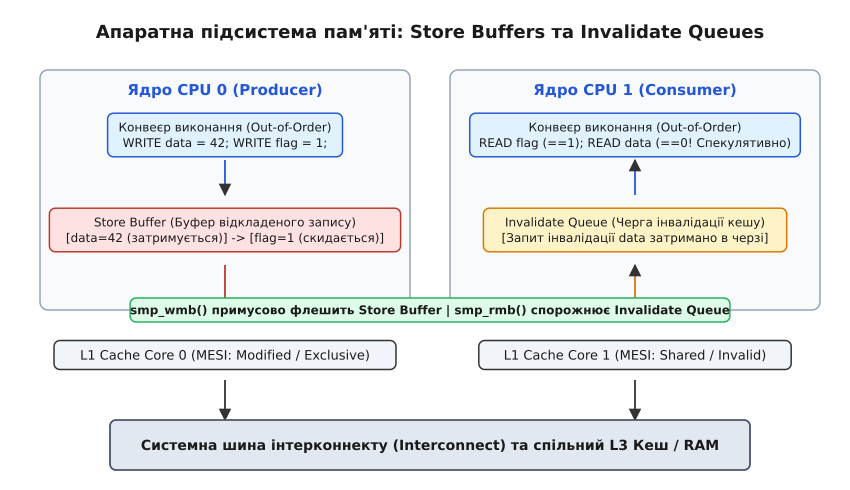
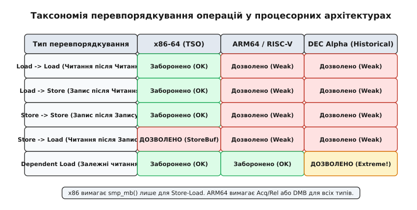
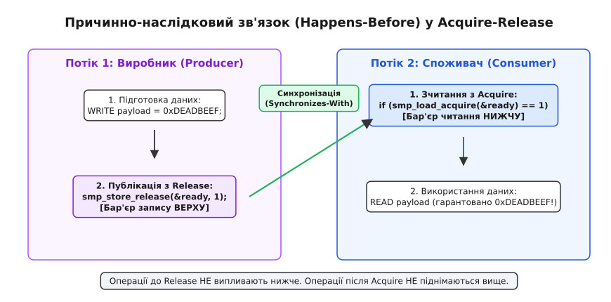

# Бар'єри пам'яті: впорядкування операцій у багатоядерних системах

<preknowlist>
- [Атомні операції](book:unix-linux/atomic-ops) — атомарні інструкції читання, запису та RMW-операцій.
- [Конкурентність і блокування в ядрі](book:unix-linux/kernel-locking) — механізми синхронізації паралельних потоків виконання.
</preknowlist>

Коли два процесорних ядра у багатоядерній системі виконують паралельні потоки коду і обмінюються даними через спільні комірки оперативної пам'яті, спроба передати прапорець готовності без спеціальних примітивів синхронізації рано чи пізно закінчується збоєм — і саме таким, якого не відтворити на вимогу. Потік-виробник на першому ядрі записує корисні дані у буфер `data = 42`, а потім встановлює прапорець `flag = 1`. У цей же час потік-споживач на другому ядрі чекає на появу `flag == 1`, після чого зчитує `data`. 

Інтуїтивна модель програмування підказує, що споживач обов'язково прочитає `42`. Проте на реальній суперскалярній системі споживач може зчитати старе значення `0` — не щоразу, а раз на багато проходів, і тим важче буде спіймати причину. Це відбувається тому, що і сучасний компілятор C, і конвеєр процесора змінюють реальний порядок виконання інструкцій читання та запису (Out-of-Order execution) задля оптимізації продуктивності.

Бар'єри пам'яті (memory barriers / memory fences) — це спеціальні примітиви компілятора та апаратні інструкції процесора, які примусово блокують перевпорядкування операцій читання й запису крізь визначену межу у коді, гарантуючи послідовну видимість змін у багатьох ядрах.

## 1. Чому процесор і компілятор переставляють операції

Причина виникнення перевпорядкування полягає у фундаментальному розриві між швидкодією обчислювальних ядер процесора та швидкістю доступу до системної оперативної пам'яті (DRAM). За час розробки мікропроцесорів частота обчислювальних ядер зросла у тисячі разів, досягнувши кількох гігагерц, тоді як затримка вибірки даних із динамічної оперативної пам'яті залишилася відносно високою. Зчитування даних із DRAM займає від 100 до 300 тактів процесора, тоді як виконання арифметичної операції у регістрі займає частки такту. Якщо обчислювальні блоки конвеєра змушені чекати кожного разу на завершення шинної транзакції, процесор простоятиме понад дев'яносто відсотків робочого часу.

Щоб обчислювальні блоки конвеєра не простоювали в очікуванні пам'яті, оптимізації застосовуються на двох незалежних рівнях: рівні компіляції та рівні мікроархітектури CPU.


*_Буфери відкладеного запису (Store Buffers) та черги інвалідації кешу (Invalidate Queues) у процесорній підсистемі пам'яті._*

### Рівень компілятора (Compiler Reordering)

Компілятори C/C++ (GCC та Clang) під час агресивних оптимізацій (`-O2`, `-O3`) переставляють інструкції читання й запису місцями у згенерованому асемблерному коді, якщо між цими інструкціями немає прямої дата-залежності у межах однієї функції. 

Компілятор оптимізує розміщення змінних у регістрах (Register Allocation), виносить повторні читання з циклів (Loop Invariant Code Motion) та виключає «зайві» записи. З точки зору компілятора, який бачить лише один потік виконання, інструкції `data = 42;` та `flag = 1;` є абсолютно незалежними, тому він має повне право поміняти їх місцями у згенерованому масиві інструкцій.

Компілятор також може об'єднувати кілька окремих записів у один ширший запис (Store Merging) або заміняти послідовність читань у циклі на одне одноразове завантаження у регістр. Якщо змінна прапорця не позначена спеціальними макросами впорядкування, компілятор має повне право згенерувати цикл, який зчитає прапорець один раз у регістр CPU і крутитиметься вічно, навіть якщо інше ядро вже оновило значення прапорця в оперативній пам'яті.

### Рівень апаратури процесора (Hardware Out-of-Order Execution)

Навіть якщо компілятор згенерує асемблерний код у строгому порядку, процесор під час виконання інструкцій все одно може змінити порядок їхнього виходу на системну шину:

1. **Буфери відкладеного запису (Store Buffers):** Коли ядро виконує інструкцію запису `MOV [address], val`, воно не чекає підтвердження від кеш-пам'яті L1/L2. Запис миттєво розміщується у локальному Store Buffer ядра, а конвеєр негайно виконує наступні інструкції коду. Інші ядра процесора не бачать вмісту цього Store Buffer, поки його не скинуть у спільний кеш L3/RAM. Якщо запис `data = 42` застряг у Store Buffer, а запис `flag = 1` потрапив у кеш раніше, інше ядро побачить `flag == 1`, але зчитає застарілий `data == 0`. Чи можлива така перестановка взагалі — питання архітектури: буфер, зобов'язаний зливатися суворо в порядку надходження, її не дасть. Розділ 2 показує, що це якраз випадок x86-64, тоді як ARM64 подібних обіцянок не дає.
2. **Черги інвалідації кешу (Invalidate Queues):** Коли ядро 0 оновлює кеш-рядок, воно надсилає іншим ядрам шинне повідомлення про інвалідацію їхніх локальних копій. Ядро 1, щоб не затримувати свій конвеєр, поміщає це повідомлення у локальну чергу інвалідації (Invalidate Queue) і підтверджує прийом. Доки черга інвалідації не буде оброблена, ядро 1 продовжує зчитувати застарілі дані зі свого L1-кешу.
3. **Буфер перевпорядкування (Reorder Buffer / ROB):** Суперскалярні процесори розбирають потік інструкцій на мікрооперації (uops) та розміщують їх у станціях резервування (Reservation Stations). Виконавчі блоки (ALU, AGU) виконують мікрооперації у міру готовності їхніх операндів, а не в порядку їхнього розміщення у програмі. Результати фіксуються в архітектурному стані процесора лише при виході інструкції з Reorder Buffer.
4. **Спекулятивне виконання та переадресація запису (Store-to-Load Forwarding):** Якщо ядро виконує читання за адресою, яка ще знаходиться у його власному Store Buffer, внутрішній блок переадресації (Store Forwarding Unit) повертає значення прямо з буфера. Проте якщо інше ядро запитує той самий кеш-рядок, воно отримає його вміст **без цього запису**: Store Buffer не є публічно видимим для інтерконнекту, і протокол когерентності про нього просто не знає.

Детальний історичний розвиток позапорядкового виконання процесорів та унікальну апаратну поведінку архітектури DEC Alpha розглянуто у вставці [Історія позапорядкового виконання та моделей пам'яті CPU](book:unix-linux/memory-barriers/hist-out-of-order-cpu.md).

## 2. Апаратні моделі когерентності та впорядкування (TSO vs Weak)

У системному програмуванні важливо чітко відрізняти **когерентність кешів (Cache Coherence)** від **впорядкування пам'яті (Memory Ordering)**.

Апаратні протоколи когерентності (MESI, MOESI) гарантують, що всі ядра процесора узгоджують між собою стан **однієї конкретної комірки пам'яті**. Порядок записів у одну й ту саму адресу бачиться всіма ядрами однаково. Протокол MESI оперує чотирма станами кеш-рядка:
- **Modified (M):** Кеш-рядок присутній тільки в даному кеші й модифікований (брудний).
- **Exclusive (E):** Кеш-рядок присутній тільки в даному кеші, але чистий (збігається з RAM).
- **Shared (S):** Кеш-рядок може бути завантажений у кеші кількох ядер для читання.
- **Invalid (I):** Вміст кеш-рядка застарів і не може використовуватися.

Проте когерентність кешу **нічого не гарантує щодо порядку доступу до РІЗНИХ комірок пам'яті**. Саме модель впорядкування пам'яті процесорної архітектури визначає, які типи перевпорядкувань між різними адресами дозволені на фізичному рівні.


*_Порівняння моделей впорядкування пам'яті в архітектурах x86-64 (TSO), ARM64 та DEC Alpha._*

### 1. Total Store Order (x86-64 TSO)

Архітектура Intel x86-64 та AMD64 реалізує строгу модель пам'яті Total Store Order (TSO). Процесори Intel та AMD гарантують на рівні кристала:
- Читання не переставляються з читаннями (`Load->Load` ordered).
- Записи не переставляються з записами (`Store->Store` ordered).
- Запис не піднімається вище попереднього читання (`Load->Store` ordered).

Єдине апаратне перевпорядкування, можливе на x86-64, — це **`Store->Load` reordering**. Воно виникає тоді, коли запис сідає у локальний Store Buffer ядра, а наступне читання за *іншою* адресою виконується з L1-кешу раніше, ніж Store Buffer скине дані на шину.

### 2. Weakly-Ordered Memory (ARM64, RISC-V, POWER)

Процесори архітектур ARM (ARMv8-A, ARMv9-A) та RISC-V реалізують слабку модель пам'яті. Конвеєр процесора має право переставляти місцями будь-які комбінації операцій: `Load->Load`, `Load->Store`, `Store->Store` та `Store->Load`, якщо між ними немає прямої дата-залежності. 

Це означає, що паралельний код, який бездоганно працює на x86-64 без апаратних бар'єрів пам'яті, на серверах ARM64 або мобільних SoC періодично падатиме з важковиявлюваними помилками пошкодження даних (Data Race / Memory Corruption).

## 3. Види та класифікація бар'єрів пам'яті в ядрі Linux

Ядро Linux надає чітко розмежований набір примітивів впорядкування, які діляться на бар'єри компілятора, симетричні SMP-бар'єри та бар'єри введення-виведення (MMIO). Перші дві групи розглянуто нижче; третя — обов'язкові `wmb()`, `rmb()` і `mb()` — впорядковує не міжядерний обмін, а доступ до регістрів периферії й буферів відкладених записів шинних мостів, і її розібрано у довіднику окремо.

### 1. Бар'єр компілятора (`barrier()`)

Бар'єр компілятора повідомляє оптимізатору GCC/Clang, що дане місце у коді не дозволяє переставляти інструкції читання та запису місцями:

```c
#define barrier() __asm__ __volatile__("": : :"memory")
```

Рядок `"memory"` у списку зіпсованих регістрів (`clobber list`) повідомляє компілятору, що ця інструкція може змінити будь-яку комірку оперативної пам'яті. Компілятор змушений скинути всі локальні значення з регістрів у стек/RAM до бар'єра і повторно зчитати необхідні змінні з пам'яті після нього. При цьому `barrier()` не генерує жодної машинної інструкції процесора і має нульову апаратну вартість.

Для атомарного доступу до окремих змінних ядро використовує макроси `READ_ONCE()` та `WRITE_ONCE()`, які перетворюють доступ на `volatile`-читання й записи. Вони гарантують, що компілятор не видалить читання, не розщепить 32/64-бітну операцію на окремі байти (Byte Tearing) і не перетворить умову на спекулятивний запис.

### 2. Симетричні апаратні SMP-бар'єри

У багатопроцесорних системах розробники ядра використовують три основних примітиви апаратного впорядкування:

```c
smp_wmb(); // Write Memory Barrier (Бар'єр запису)
smp_rmb(); // Read Memory Barrier (Бар'єр читання)
smp_mb();  // Full Memory Barrier (Повний бар'єр пам'яті)
```

- **`smp_wmb()`**: Гарантує, що всі операції запису, оголошені до бар'єра, будуть зафіксовані у кеші раніше, ніж будь-який запис після бар'єра. На x86-64 розгортається у `barrier()`, на ARM64 — у машинну інструкцію `DMB ISHST`.
- **`smp_rmb()`**: Гарантує, що всі операції читання до бар'єра завершаться раніше будь-якого читання після бар'єра. На x86-64 розгортається у `barrier()`, на ARM64 — у інструкцію `DMB ISHLD`.
- **`smp_mb()`**: Повний двосторонній бар'єр пам'яті. Забороняє будь-який перетин межі бар'єра як для читань, так і для записів. На x86-64 ядро генерує не `MFENCE`, а дешевшу атомарну операцію з префіксом `LOCK` над вершиною стека (`lock addl $0, -4(%rsp)`); `MFENCE` лишився для бар'єра введення-виведення `mb()`. На ARM64 `smp_mb()` розгортається у `DMB ISH`.

Повний перелік усіх ядерних макросів, включаючи макроси доступу до регістрів периферії `wmb()`, `rmb()`, `mb()` та впорядкування контрольних залежностей, зведено у вставці [Довідник бар'єрів пам'яті в ядрі Linux](book:unix-linux/memory-barriers/api-kernel-memory-barriers.md).

## 4. Семантика Acquire / Release: Побудова причинно-наслідкових зв'язків

Традиційні симетричні бар'єри `smp_wmb()` та `smp_rmb()` вимагають від розробника ручного розміщення відповідних фенсів у коді обох потоків. Проте у сучасному ядрі Linux та стандартах C11/C++11 найбільш популярним підходом стало використання **Acquire-Release семантики**.

Acquire-Release семантика зв'язує парні операції завантаження та збереження у єдиний причинно-наслідковий ланцюг **Happens-Before** (Синхронізується з / Synchronizes-With).


*_Побудова впорядкування Happens-Before між виробником і споживачем за допомогою Acquire-Release семантики._*

### Принцип роботи Acquire-Release

- **`smp_store_release(ptr, val)` (Release-запис):** Зберігає значення `val` за адресою `ptr` із семантикою Release. Ставить **бар'єр ЗВЕРХУ, перед самим записом**: жодна операція читання або запису, розміщена у коді *до* цього виклику, не може бути переставлена компілятором або CPU *після* нього.
- **`smp_load_acquire(ptr)` (Acquire-читання):** Зчитує значення за адресою `ptr` із семантикою Acquire. Ставить **бар'єр ЗНИЗУ, одразу після читання**: жодна операція читання або запису, розміщена у коді *після* цього виклику, не може бути виконана спекулятивно *до* нього.

Проілюструємо переписаний Producer-Consumer приклад за допомогою Acquire-Release:

:::tabs
```c
// Застосування Acquire-Release у коді ядра Linux (C)
#include <linux/compiler.h>

// Потік 1: Виробник (CPU Core 0)
void producer(struct my_data *payload)
{
    payload->value = 42;
    payload->status = STATUS_READY;

    // Публікація прапорця з семантикою Release
    smp_store_release(&global_ready_flag, 1);
}

// Потік 2: Споживач (CPU Core 1)
void consumer(struct my_data *payload)
{
    // Перевірка прапорця з семантикою Acquire
    if (smp_load_acquire(&global_ready_flag) == 1) {
        // Гарантовано зчитає payload->value == 42!
        pr_info("Payload value: %d\n", payload->value);
    }
}
```
```cpp
// Застосування Acquire-Release у користувацькому просторі (C++17)
#include <atomic>
#include <iostream>

struct MyData {
    int value{0};
    int status{0};
};

std::atomic<int> global_ready_flag{0};
MyData payload;

// Потік 1: Виробник
void producer()
{
    payload.value = 42;
    payload.status = 1;

    // Публікація прапорця з семантикою Release
    global_ready_flag.store(1, std::memory_order_release);
}

// Потік 2: Споживач
void consumer()
{
    // Перевірка прапорця з семантикою Acquire
    if (global_ready_flag.load(std::memory_order_acquire) == 1) {
        // Гарантовано надрукує 42!
        std::cout << "Payload value: " << payload.value << "\n";
    }
}
```
:::

### Апаратна перевага Acquire-Release на ARM64

На архітектурі x86-64 TSO інструкції `smp_store_release` та `smp_load_acquire` розгортаються у звичайні компіляторні бар'єри `barrier()` і мовні присвоєння, бо залізо x86 впорядковує записи та читання апаратно.

Проте на архітектурі ARM64 інструкції Acquire-Release розгортаються у спеціалізовані апаратні інструкції:
- `smp_store_release()` -> `STLR` (Store-Release Register).
- `smp_load_acquire()` -> `LDAR` (Load-Acquire Register).

Різниця не косметична. `DMB ISH` — це бар'єр щодо **всієї** пам'яті: він упорядковує кожен доступ по обидва боки від себе, тож ядро мусить дочекатися, поки розсмокчеться весь Store Buffer. `STLR` і `LDAR` упорядковують доступи відносно **однієї конкретної операції** — того самого запису чи читання, у який їх вбудовано, — і конвеєр не зобов'язаний зупинятися на решті. Тому на гарячому шляху пара `STLR`/`LDAR` коштує одиниці тактів, тоді як вартість `DMB ISH` визначається станом буфера в момент виконання.

## 5. Формалізація моделі пам'яті ядра Linux (LKMM)

Формальна модель пам'яті ядра Linux (Linux Kernel Memory Model, LKMM) визначає точні математичні правила, за якими операції з пам'яттю взаємодіють між собою у багатопроцесорних системах. LKMM базується на теорії відношень між операціями виконання та описується мовою формальної верифікації `cat`.

### Основні математичні відношення LKMM

1. **Program Order (`po`):** Порядок виконання інструкцій у межах одного потоку, визначений послідовністю C-коду.
2. **Read-From (`rf`):** Відношення між записом та читанням, яке зчитало значення, записане цим записом. Якщо запис і читання відбуваються на різних ядрах, це відношення позначається як `rfe` (Read-From External).
3. **Coherence Order (`co`):** Строгий послідовний порядок між усіма записами у одну й ту саму комірку пам'яті (гарантується апаратним протоколом когерентності MESI). Міжядерні записи позначаються як `coe` (Coherence External).
4. **From-Read (`fr`):** Відношення між читанням та наступним записом у ту ж саму комірку пам'яті, який перезаписав зчитане значення (`fre` для різних ядер).

Повний бар'єр пам'яті `smp_mb()` створює відношення `mb`, яке перетворює локальний порядок `po` у глобальне розповсюдження `pb` (Propagated Before) для всіх ядер системи. Це гарантує, що операції до `smp_mb()` будуть зафіксовані раніше операцій після `smp_mb()` у загальному порядку виконання системи (Global Memory Order).

Верифікація алгоритмів ядра виконується за допомогою комп'ютерного аналізатора `herd7`, який моделює всі можливі перевпорядкування виконання і перевіряє аксіому поширення — відсутність циклів у графі відношень (`acyclic pb`).

## 6. Практичне застосування у примітивах ядра (Ring Buffers, RCU, Seqlocks)

Бар'єри пам'яті та Acquire-Release семантика є фундаментом, на якому побудовано всі безблокувальні структури даних у ядрі Linux.

### 1. Однопродюсерні кільцеві буфери (SPSC Ring Buffers)

У кільцевому буфері з одним виробником і одним споживачем (Single-Producer Single-Consumer) передача індексів `head` та `tail` здійснюється без використання спінлоків:

:::tabs
```c
// SPSC кільцевий буфер мовою C (ядро Linux)
void spsc_ring_enqueue(struct spsc_ring *ring, void *data)
{
    unsigned int head = ring->head;
    unsigned int tail = smp_load_acquire(&ring->tail);

    if ((head - tail) >= ring->size)
        return; // Буфер повністю заповнений

    ring->buffer[head & (ring->size - 1)] = data;
    smp_store_release(&ring->head, head + 1);
}

void *spsc_ring_dequeue(struct spsc_ring *ring)
{
    unsigned int tail = ring->tail;
    unsigned int head = smp_load_acquire(&ring->head);

    if (tail == head)
        return NULL; // Буфер порожній

    void *data = ring->buffer[tail & (ring->size - 1)];
    smp_store_release(&ring->tail, tail + 1);
    return data;
}
```
```cpp
// SPSC кільцевий буфер мовою C++17 (std::atomic, std::optional)
#include <atomic>
#include <vector>
#include <optional>

template <typename T, size_t Size>
class SPSCQueue {
private:
    std::vector<T> buffer_ = std::vector<T>(Size);
    alignas(64) std::atomic<size_t> head_{0};
    alignas(64) std::atomic<size_t> tail_{0};

public:
    bool enqueue(T val) {
        size_t head = head_.load(std::memory_order_relaxed);
        size_t tail = tail_.load(std::memory_order_acquire);

        if ((head - tail) >= Size)
            return false;

        buffer_[head % Size] = std::move(val);
        head_.store(head + 1, std::memory_order_release);
        return true;
    }

    std::optional<T> dequeue() {
        size_t tail = tail_.load(std::memory_order_relaxed);
        size_t head = head_.load(std::memory_order_acquire);

        if (tail == head)
            return std::nullopt;

        T val = std::move(buffer_[tail % Size]);
        tail_.store(tail + 1, std::memory_order_release);
        return val;
    }
};
```
:::

### 2. Публікація вказівників у RCU (Read-Copy-Update)

Механізм [RCU](book:unix-linux/rcu-read-copy-update) активно використовує бар'єри для безпечної заміни вказівників у ядрі Linux. Пара його макросів розподілила роботу несиметрично:
- `rcu_assign_pointer(p, v)` внутрішньо викликає `smp_store_release()`, щоб усі нові поля структури даних за адресою `v` зафіксувалися у пам'яті до того, як глобальний вказівник `p` стане видимим для RCU-читачів.
- `rcu_dereference(p)` натомість не ставить жодного апаратного бар'єра: це `READ_ONCE()` з перевірками для lockdep. Читача рятує адресна залежність — поля структури дістають лише за вже зчитаним вказівником, а залежне читання впорядковує саме залізо. Бар'єр Acquire потрібен там, де залежності немає: коли за прапорцем читають дані, до яких він не веде адресою.

### 3. Послідовні блокування (Seqlocks)

У структурах `seqlock_t`, де читачі не блокують письменників, лічильник версій `sequence` захищається бар'єрами:
- Письменник інкрементує `sequence` до непарного числа перед записом, вставляє `smp_wmb()`, оновлює дані, вставляє `smp_wmb()` і робить `sequence` знову парним.
- Читач зчитує `sequence`, вставляє `smp_rmb()`, зчитує дані, вставляє ще один `smp_rmb()` і перечитує `sequence`: якщо число непарне або змінилося, читання повторюється з початку.

Практичну реалізацію безблокувальної структури даних розглянуто у вставці [Безблокувальний стек Трайбера на Acquire-Release](book:unix-linux/memory-barriers/proj-lockfree-stack.md).

## 7. Діагностика: як шукати наслідки відсутнього бар'єра

При налагодженні багатопотокових систем у користувацькому просторі та ядрі Linux збої, викликані відсутністю бар'єрів пам'яті, проявляються як спорадичні падіння (Heisenbugs), які зникають при додаванні відлагоджувального друку `printk()` або `printf()`. Додавання друку вставляє виклики системних функцій, які діють як неявні компіляторні та апаратні бар'єри, маскуючи дефект.

### Діагностика через `perf` та апаратні лічильники CPU

Для виявлення проблем згортання конвеєра та аналізу затримок бар'єрів використовується утиліта `perf`:

```bash
# Промахи кеша даних L1 та кількість атомарних читань із префіксом LOCK
perf stat -e L1-dcache-load-misses,L1-dcache-store-misses,mem_inst_retired.lock_loads ./my_kernel_module_test
```

Аналіз апаратних подій дозволяє побачити:
- **`mem_inst_retired.lock_loads`**: Показує кількість виконаних читань із префіксом `LOCK` — саме ними реалізовано атомарні операції та `smp_mb()` на x86-64. Якщо це число занадто високе, код можна оптимізувати, замінивши `smp_mb()` на `smp_store_release()`.
- **`cycle_activity.stalls_l3_miss`**: Вказує на простої конвеєра через очікування синхронізації кешів між ядрами.

Профілювання міжпроцесорного обміну та виявлення конфліктів у кеш-рядках (Cache Line Bouncing / False Sharing) виконується за допомогою команди `perf c2c`:

```bash
# Запис профілю міжкешевого обміну даних
perf c2c record -F 60000 -- ./my_lockfree_benchmark

# Генерація звіту по кеш-рядках з високим рівнем конкуренції
perf c2c report --stdio
```

У звіті `perf c2c` метрика `HITM` (Hit in Modified Cache) вказує на ситуації, коли ядро змушене зупиняти свій конвеєр і чекати передачі модифікованого кеш-рядка з L1-кешу сусіднього ядра через інтерконнект шини.

### Використання `ftrace` для аналізу бар'єрів у ядрі

Через підсистему `ftrace` та трасування подій ядра можна відстежувати часові інтервали виконання критичних секцій та періодів спокою RCU (grace period), які залежать від бар'єрів:

```bash
# Увімкнення трасування періодів спокою RCU
echo 1 > /sys/kernel/tracing/events/rcu/rcu_utilization/enable
cat /sys/kernel/tracing/trace_pipe
```

## 8. Крайові випадки, транзитивність, вартість бар'єрів та типові помилки

При розробці системного коду найчастіше виникають такі помилки та хибні уявлення про бар'єри пам'яті:

### Транзитивність впорядкування (Transitivity)

Транзитивність означає, що якщо Потік 1 бачить оновлення Потоку 0, а Потік 2 бачить оновлення Потоку 1, то Потік 2 також гарантовано бачить оновлення Потоку 0. 

Не всі бар'єри гарантують транзитивність! 
- Окремі `smp_wmb()` та `smp_rmb()` **не є транзитивними**.
- Повні бар'єри `smp_mb()` та ланцюжки `smp_store_release()` -> `smp_load_acquire()` **гарантують транзитивність** у ланцюгах багатьох ядер.

### Комплексна порівняльна таблиця характеристик бар'єрів

| Тип бар'єра | Апаратний фенс x86_64 | Апаратний фенс ARM64 | Транзитивність | Порядок вартості |
| :--- | :--- | :--- | :--- | :--- |
| `barrier()` | Немає | Немає | Ні | Нуль інструкцій CPU |
| `smp_wmb()` | `barrier()` | `DMB ISHST` | Ні | 0 (x86) / залежить від заповнення Store Buffer (ARM) |
| `smp_rmb()` | `barrier()` | `DMB ISHLD` | Ні | 0 (x86) / залежить від глибини черги читань (ARM) |
| `smp_store_release()` | `barrier()` + `WRITE` | `STLR` | Так (в ланцюгу) | 0 (x86) / одиниці тактів (ARM) |
| `smp_load_acquire()` | `READ` + `barrier()` | `LDAR` | Так (в ланцюгу) | 0 (x86) / одиниці тактів (ARM) |
| `smp_mb()` | `LOCK ADD` (у ядрі; `MFENCE` — для `mb()`) | `DMB ISH` | Так | Десятки тактів на обох архітектурах |

Останню колонку слід читати саме як порядок величини, а не як вимір. Єдиного числа «для ARM64» не існує: вартість `DMB` кратно різниться між мікроархітектурами (Cortex-A72, Neoverse N1, N2, V2 — це різні конвеєри й різні контролери когерентності), а головне — залежить від того, скільки записів чекає у Store Buffer у момент бар'єра. На порожньому буфері `DMB ISHST` майже безкоштовний, на заповненому він коштує стільки, скільки триває скидання буфера в кеш. Так само й `smp_mb()` на x86-64: `LOCK`-операція над вершиною стека завжди влучає у власний, гарячий і невитіснений кеш-рядок, тож її вартість — це вартість серіалізації конвеєра, а не промаху кеша. Порівнювати ці числа має сенс лише між рядками однієї колонки.

### Поширені антипатерни системного програмування

1. **Несиметричне використання бар'єрів (Unpaired Barriers):** Використання `smp_store_release()` у виробника без відповідного `smp_load_acquire()` у споживача повністю знищує гарантії впорядкування. Споживач прочитає застаріле значення з кешу.
2. **Плутанина між `volatile` та бар'єрами:** Ключове слово `volatile` у мові C гарантує лише те, що компілятор не видалить читання або запис у змінну. Воно **НЕ прикладає жодних апаратних бар'єрів пам'яті CPU** і НЕ захищає від апаратного перевпорядкування у багатопроцесорних системах!
3. **Хибне уявлення про вартість `barrier()`:** Компіляторний бар'єр `barrier()` вимагає 0 тактів CPU, але може змусити компілятор зберегти змінні у стек, збільшуючи обсяг коду.

## 9. Де цей вибір видно на практиці: io_uring та DPDK

Інтерфейс `io_uring` передає команди між користувацьким простором і ядром через два кільцевих буфери — Submission Queue (SQ) та Completion Queue (CQ) — і системний виклик перестає бути обов'язковим на кожну операцію: обидві сторони відображають ту саму пам'ять, тож одним `io_uring_enter()` подають цілий пакет запитів, а в режимі `SQPOLL` не роблять і його. Уся коректність тримається виключно на впорядкуванні двох індексів. Протокол зафіксовано у сторінці `io_uring(7)`: програма, дописавши запис `SQE`, публікує новий `tail` черги подань через `smp_store_release()`, а ядро зчитує цей індекс через `smp_load_acquire()`; у зворотному напрямку ядро так само публікує `tail` черги завершень, а програма читає його з семантикою Acquire.

Пара Release/Acquire тут не «оптимізація замість `smp_mb()`», а мінімальний примітив, який узагалі робить схему коректною. Вона гарантує рівно те, що потрібно: вміст самого запису `SQE` стає видимим раніше, ніж стає видимим індекс, який на нього вказує. Якби індекс публікували звичайним присвоєнням, ядро прочитало б свіжий `tail` і взялося виконувати ще не дописану команду.

Повний бар'єр у `io_uring` лишився там, де пара Release/Acquire фізично не рятує — у режимі `SQPOLL`, коли черги обслуговує окремий ядерний потік. Програма мусить дізнатися, чи не заснув цей потік (прапорець `IORING_SQ_NEED_WAKEUP`), а потік симетрично перевіряє, чи не з'явилося роботи. Обидві сторони одночасно пишуть своє й читають чуже — це той самий взірець Store Buffering, і саме його перестановку `Store->Load` дозволяє навіть строгий x86-64 TSO. Жодна семантика Acquire-Release цього не закриває: потрібен справжній `smp_mb()`. Ось і практичне правило вибору примітива: якщо між потоками є один напрямок «виробник → споживач», вистачає пари Release/Acquire; якщо обидві сторони і пишуть, і читають чуже — потрібен повний бар'єр.

Той самий поділ видно в бібліотеці DPDK (Data Plane Development Kit). Кільце `rte_ring` у режимі Poll Mode Driver передає пакети між ядрами без жодного блокування, і початково впорядковувало свої індекси загальними бар'єрами `rte_smp_wmb()` та `rte_smp_rmb()` — на ARM64 це інструкції `DMB`. Згодом кільце перевели на атомарні операції моделі C11 із явними `memory_order_release` та `memory_order_acquire`: на x86-64 згенерований код при цьому не змінився взагалі (там обидві семантики безкоштовні), а на ARM64 окремі `DMB` поступилися місцем вбудованим у сам доступ `STLR` і `LDAR`. Виграш дає не «швидша інструкція бар'єра», а звужена область його дії: конвеєр більше не мусить чекати на скидання всього Store Buffer заради впорядкування одного індексу.

> 🔧 **Навіщо це.** Повний бар'єр `smp_mb()` — найдорожчий примітив упорядкування, і на гарячому шляху він майже завжди надлишковий. Заміна його парою `smp_store_release()` / `smp_load_acquire()` не коштує на x86-64 нічого, а на ARM64 зводить бар'єр до однієї інструкції — за тих самих гарантій, доки між потоками є один напрямок «виробник → споживач». Уміння відрізнити цей випадок від симетричного (де повний бар'єр не прибрати) і є тим, що відділяє робочий безблокувальний код від коду, який падає раз на мільйон ітерацій.
