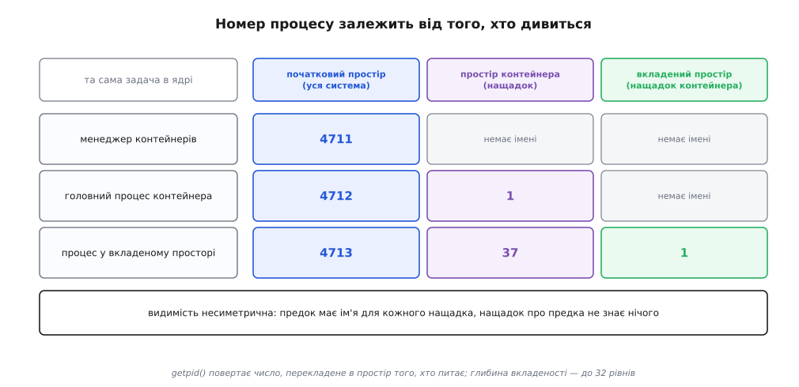
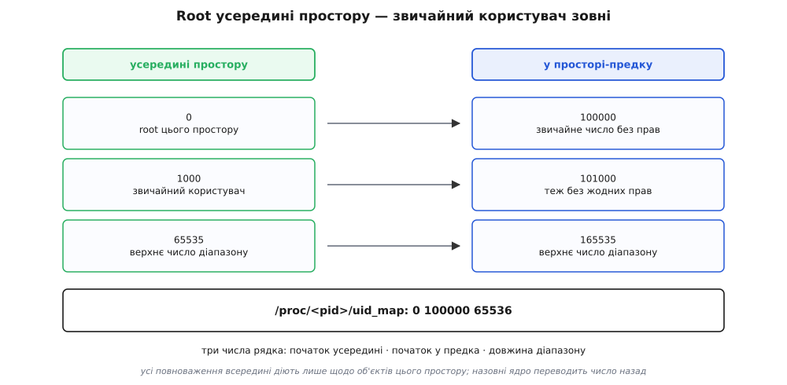
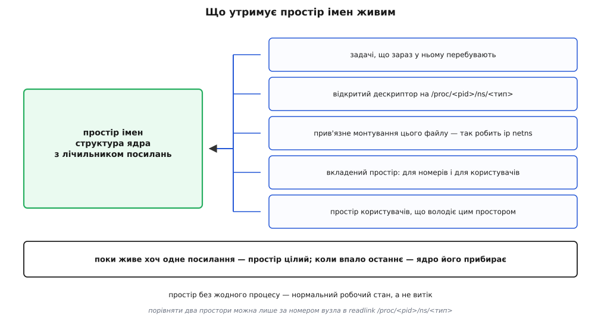

# Простори імен: ізоляція погляду на систему

<preknowlist>
- [Процес: що це насправді](topic:unix-linux/process-model) — задача майже нічого не тримає в собі, вона лише посилається на окремі структури ресурсів; що спільне, а що своє, обирають прапорцями `clone()`.
- [PID і дерево процесів](topic:unix-linux/pid-and-hierarchy) — процес названо числом, і всі дії над ним (сигнал, очікування, читання `/proc`) починаються з цього числа.
- [Монтування й дерево монтувань](topic:unix-linux/mount-model) — шлях розкривається не в самій файловій системі, а в дереві, зібраному з монтувань.
- [Користувачі, групи й ідентичність процесу](topic:unix-linux/uid-gid-model) — «хто ти» для ядра є набором чисел (UID, GID, додаткові групи), а не іменем.
- [Можливості (capabilities)](topic:unix-linux/capabilities) — всесилля root розкладено на окремі повноваження, і кожне перевіряють нарізно.
- [Файловий дескриптор](topic:unix-linux/file-descriptor) — відкритий об'єкт ядра програма тримає числом, і поки число відкрите, об'єкт живий.
- [/proc: процеси як файли](topic:unix-linux/proc-filesystem) — стан ядра прочитується як файли, і саме звідти всі інструменти беруть картину системи.
</preknowlist>

## Дві програми, кожна з яких вважає, що вона тут сама

Візьмімо дві служби баз даних і поставмо їх на одну машину. Кожну писали з припущенням, що машина належить їй: обидві хочуть каталог `/var/lib/db`, обидві хочуть слухати порт 5432, обидві читають `/etc/db.conf`, і кожна вважає, що процес номер 1 — це система, від якої вона чекає сигналу на зупинку.

Спробуймо зарадити правами. Не вийде: права відповідають на питання «чи можна цій ідентичності зробити оце», а тут конфлікту в дозволах немає. Обидві служби мають цілком законне право на порт 5432 — саме тому вони й зіштовхуються. Заборонивши одній із них, ми її просто зламаємо, а не розведемо.

Спосіб, який точно спрацює, відомий: дати кожній окрему машину. Віртуальна машина справді розводить їх остаточно, бо приносить із собою власне ядро, власну таблицю процесів і власний мережевий стек. Ціна теж відома — усе це доводиться утримувати вдруге: пам'ять під друге ядро, другий планувальник, другий набір драйверів.

Тому придивімося уважніше, чим саме ці дві служби конфліктують. Не процесорними ядрами й не мікросхемами пам'яті — тут вони мирно ділять ресурс, як будь-які два процеси. Вони конфліктують рядком `/var/lib/db`, числом 5432, числом 1, рядком `db-host`. Жодна з цих речей не є об'єктом. Кожна з них — **ім'я**, за яким ядро об'єкт знаходить.

А якщо конфлікт лежить в іменах, то й лікувати треба імена.

## Ім'я — це запис у таблиці, і таблиця досі була одна

Пройдімося по тому, що процес отримує від системи, і в кожному пункті спитаймо, звідки ядро знає, про який об'єкт ідеться.

Процес просить надіслати сигнал процесові 1234. Ядро бере число й шукає його в таблиці розподілу номерів — там лежить вказівник на `task_struct`. Процес відкриває `/var/lib/db/main`. Ядро розбирає шлях крок за кроком по дереву монтувань, і на кожній похилій рисці питає, чи не підключена сюди інша файлова система. Процес прив'язує сокет до порту 5432 — ядро дивиться в таблицю зайнятих портів свого мережевого стека. Процес питає `gethostname()` — ядро віддає рядок з однієї структури. Процес створює сегмент спільної пам'яті з ключем `0x4d2` — ядро шукає ключ у своєму реєстрі об'єктів System V.

Щоразу та сама конструкція: **відображення «ім'я → об'єкт ядра»**. І щоразу це відображення було одне-єдине на всю систему.

Так вийшло не з якогось принципу, а замовчуванням. Коли писали Unix, машина була одна, система на ній одна, і питання «а чий це список процесів» просто не поставало — список був той самий, що й машина. Глобальність словників ніхто не обирав; її успадкували від обставин.

Отже, задача формулюється вже точно: зробити ці словники не глобальними. Не забороняти по них ходити, а дати різним процесам різні примірники.

## Знайома конструкція, застосована ще раз

Спосіб зробити ресурс «не глобальним» у Linux уже є, і застосований він не раз. Задача в ядрі майже нічого не тримає всередині себе: відображення пам'яті лежить в окремій `mm_struct`, таблиця дескрипторів — в окремій `files_struct`, корінь і поточний каталог — у `fs_struct`. Задача лише **посилається** на них, а кожна структура має лічильник посилань і живе, доки на неї хтось указує. Дві задачі з одним вказівником бачать те саме; дві задачі з різними вказівниками не мають способу навіть назвати чуже.

Простір імен (англ. *namespace*, від *name* — ім'я і *space* — область: ділянка, у межах якої ім'я щось означає) — це та сама конструкція, застосована до глобальних словників ядра. Кожен такий словник виносять в окрему структуру з лічильником посилань, а в задачі з'являється ще один вказівник — `nsproxy`, невеликий набір посилань на простори всіх типів одразу.

*Об'єкти ядра ті самі й лежать в одній пам'яті; змінюється лише те, через яку таблицю до них дістаються. Процес зліва має ім'я для всіх трьох; процес справа має ім'я тільки для одного — решта для нього не заборонена, а безіменна.*

Звідси випливає найважливіше твердження про цей механізм, і воно не про безпеку. **Простір імен не є ані стіною, ані перевіркою прав.** Це примірник таблиці. Процес у власному просторі номерів не «не має права» надіслати сигнал сусідньому контейнерові — він не має числа, яким той назвати.

Різниця видна просто в коді помилки. Спроба вбити чужий процес без прав дає `EPERM` — «не дозволено, але воно там є». Спроба вбити процес, номер якого не належить твоєму простору, дає `ESRCH` — «такого процесу немає». Ядро не бреше: у словнику цього процесу такого імені справді нема.

> 🔧 **Навіщо це.** Із цієї однієї фрази виводиться майже вся практика. Чому два контейнери можуть слухати порт 80 без конфлікту — бо таблиця зайнятих портів у кожного своя. Чому `ps` усередині контейнера показує три рядки — бо він читає `/proc`, змонтований від простору, у якому інших номерів просто не існує. Чому образ контейнера важить сотні мегабайтів, а не гігабайти — бо ядро в ньому не лежить, воно спільне. І чому вразливість у ядрі однаково належить усім контейнерам на машині — з тієї самої причини: під усіма словниками одне ядро, і воно нічим не роздвоєне.

Ідея прийшла не з порожнього місця. Операційна система Plan 9 з Bell Labs, наступниця Unix від тих самих людей, побудована саме на тому, що дерево імен у кожного процесу своє й збирається на льоту. У Linux цю думку приніс Alexander Viro: у лютому 2001 року він надіслав у список розсилки патч «per-process namespaces for Linux», прямо посилаючись на Plan 9, і в серпні 2002 року простір монтувань увійшов у ядро 2.4.19 під прапорцем `CLONE_NEWNS`. Далі типи додавали поодинці протягом майже двадцяти років — цей шлях, з датами й іменами, розібрано окремо: [звідки взялися простори імен](topic:unix-linux/namespaces/hist-namespaces-origin.md).

## Що саме відв'язали

Типів простору вісім, і перелічувати їх рядком було б безглуздо: вони різні не назвами, а тим, наскільки глибоко довелося переробити ядро. Розкладімо їх по цій ознаці.

**Прості словники.** Простір UTS тримає всього два рядки — ім'я вузла й ім'я домену NIS (назва спадкова: UTS означає *Unix Time-sharing System*). Простір IPC тримає реєстри об'єктів System V — сегменти спільної пам'яті, семафори, черги — і черги повідомлень POSIX. Тут уся робота звелася до того, щоб зробити структуру не глобальною, а при створенні простору дати новому власникові порожню копію.

**Складні підсистеми.** Простір монтувань тримає ціле дерево монтувань. Мережевий простір тримає весь стек: список інтерфейсів, адреси, таблиці маршрутів, зайняті порти, правила netfilter, таблицю відстеження з'єднань, лічильники. Тому мережевий простір і додавали поетапно, від 2.6.24 до майже завершеного стану в 2.6.29 (2009) — переробити довелося весь стек, а не одну структуру. І тому ж копіювати від батька тут нічого: свіжий мережевий простір народжується майже порожнім — один вимкнений `lo` і жодного маршруту, — тож усе, що в ньому має працювати, заводять руками. Що з нього виходить на практиці, як з'єднують такі простори парою `veth` і мостом, розібрано окремо ([мережеві простори імен](topic:unix-linux/network-namespaces)). Сюди ж належать простір cgroup (додано в 4.6, 2016, за патчами Aditya Kali), який ховає, у якій точці ієрархії обмежень процес насправді сидить, і простір часу (5.6, 2020, Dmitry Safonov і Andrei Vagin), який додає зсув до годинників `CLOCK_MONOTONIC` і `CLOCK_BOOTTIME` — і робить це не заради ізоляції, а щоб перенесений на іншу машину процес не побачив, що монотонний годинник стрибнув назад.

**Два, що міняють правила.** Простір номерів процесів — єдиний, де ім'я не просто інше, а **перекладається**. Простір користувачів — єдиний, що визначає, хто взагалі має право створити решту.

Ось на цих двох і варто зупинитися: перший показує, що буває, коли ізоляція мусить лишатися частковою, другий — звідки береться право ізолюватися. Повний перелік типів із прапорцями, версіями ядра, викликами та командами зібрано окремо, як довідку: [інтерфейси просторів імен](topic:unix-linux/namespaces/api-namespace-interfaces.md).

## Один процес — кілька номерів

Задача, створена в новому просторі номерів, дістає в ньому номер — найчастіше 1. Але свій старий номер вона не втрачає: у батьківському просторі вона так само видима й так само має число, і те саме стосується всіх просторів-предків. Одна `task_struct` — кілька імен одночасно.

Це не недогляд, а вимушений вибір. Уявімо протилежне: створення простору забирає процес із поля зору батька. Тоді будь-яка програма могла б утекти з-під нагляду власного наглядача одним викликом, і жоден менеджер контейнерів не зміг би зупинити те, що сам запустив. Тому видимість зроблено **несиметричною**: простір-предок бачить усе, що всередині нащадків, і має чим це назвати; нащадок про предка не знає нічого.

*Ті самі три задачі в трьох просторах. Число, яке поверне `getpid()`, залежить від того, хто питає: ядро перекладає номер у простір того, хто дивиться. Стрілки видимості йдуть лише згори вниз.*

Простори номерів утворюють дерево з обмеженням глибини — від ядра 3.7 не більше 32 рівнів вкладеності. Обмеження існує тому, що переклад номера коштує проходу вгору по ланцюжку, а кожен рівень додає рядок у структурі кожного процесу.

Перший процес нового простору дістає роль, яку в системі має [процес номер 1](topic:unix-linux/init-and-pid1): він переймає сиріт, що з'явилися в межах простору, і від нього залежить існування простору. Із цієї ролі випливають три поведінки, які інакше здаються дивними.

Сигнал від сусіда по простору доходить до такого процесу лише тоді, коли він поставив на цей сигнал власний обробник; типова дія не спрацьовує ніколи. Причина проста: інакше випадковий `kill -TERM 1` усередині зносив би весь простір, а «всередині» — це вже не система, а лише один контейнер із чужою програмою. Натомість із простору-предка `SIGKILL` і `SIGSTOP` доправляються силоміць — предок мусить мати останнє слово.

Коли цей процес усе-таки помирає, ядро розсилає `SIGKILL` усім, хто лишився в просторі, і нові процеси там уже не створюються — `fork()` повертає `ENOMEM`. Простір гине разом зі своїм коренем. Саме цього й чекають від команди «зупинити контейнер»: не обходити список процесів, а прибрати один — а решта піде за ним.

І третє: `unshare(CLONE_NEWPID)` не переносить у новий простір того, хто його викликав. Спокуса пояснити це недоробкою велика, але причина глибша. Процес уже має номер у поточному просторі, і цей номер незмінний за визначенням — на нього вже посилаються батько, наглядач, записи в журналі, відкриті дескриптори `pidfd`. Перекинути процес означало б зробити всі ці посилання неправдивими. Тому членство в просторі номерів фіксується в момент створення задачі й не змінюється ніколи; новий простір дістають діти, створені після виклику.

Є й наслідок, на який натикаються всі одразу: усередині свіжого простору номерів `ps` показує старий список. Це не помилка — `ps` читає `/proc`, а той досі змонтований від старого простору й перелічує його номери. Щоб побачити правду, треба змонтувати новий примірник procfs, а для цього потрібен власний простір монтувань. Ось перша точка, де два типи змикаються: сама по собі ізоляція номерів не дає навіть побачити себе.

## Своє дерево замість чужого кореня

Простір монтувань працює інакше, ніж простір номерів: тут нічого не перекладається. Процес просто розкриває шляхи крізь **інше дерево** — власну копію, зроблену в момент створення простору.

Порівняймо це з давнішим засобом. Виклик `chroot()` міняє для процесу одну річ — точку, від якої починається абсолютний шлях. Дерево монтувань при цьому лишається спільним на всю систему: змонтоване всередині видно всім іззовні, а розмонтоване ззовні зникає й усередині ([chroot і його межі](topic:unix-linux/chroot)). Простір монтувань міняє не точку відліку, а саме дерево — і тому монтування, зроблене всередині, назовні просто не існує.

Здавалося б, повна незалежність — це і є мета. Але вона одразу дає незручність: підключили USB-диск, система його змонтувала, а всередині контейнера його немає, хоч саме туди його й ставили. Абсолютна копія відрізає не лише зайве.

Тому в ядрі 2.6.15 (2006, патчі Ram Pai, доведені до придатного стану разом з Alexander Viro) кожне монтування дістало **тип поширення**. Спільне (*shared*) передає події підключення й відключення всім членам своєї групи; підпорядковане (*slave*) приймає їх, але назад не віддає; приватне (*private*) не спілкується ні з ким; неприв'язне (*unbindable*) додатково забороняє робити з себе прив'язку.

Практичний наслідок цього неочевидний і коштує людям годин. Systemd типово позначає кореневе монтування спільним, тому копія дерева, зроблена викликом `unshare(CLONE_NEWNS)`, насправді й далі обмінюється подіями з системою: монтування всередині вилізе назовні. Саме тому ручна збірка контейнера починається з `mount --make-rprivate /` — свіжу копію треба ще й відв'язати від поширення. Команда `unshare(1)` з util-linux цю пастку вже враховує: від версії 2.27 вона робить приватність сама, і це якраз той випадок, коли зручність інструмента ховає поведінку системного виклику під ним.

## Хто взагалі має право ізолюватися

Досі ми обходили питання, яке ламає всю конструкцію. Створити простір імен — дія, що прямо стосується безпеки, і до ядра 3.8 вона вимагала можливості `CAP_SYS_ADMIN`, тобто фактично прав root. Виходило замкнене коло: щоб зробити собі пісочницю й **зменшити** свої повноваження, треба спершу бути всесильним.

Коло розриває простір користувачів. Він віртуалізує саму ідентичність: усередині нього діють свої числа UID і GID, а між ними й числами простору-предка стоїть **відображення діапазонів**.

*Три числа на рядок мапи: перше — початок діапазону всередині, друге — початок відповідного діапазону в предка, третє — довжина. Кожне звертання назовні ядро переводить назад по цій самій мапі.*

Процес, що створив простір користувачів, отримує в ньому **повний набір можливостей** — усі до одної. Звучить як діра, але діри тут немає, бо повноваження діють лише щодо об'єктів, якими цей простір володіє. Коли такий процес із UID 0 усередині торкається файлу, що належить зовнішньому світові, ядро переводить його ідентичність назад по мапі — 0 стає, скажімо, числом 100000 — і питає права вже за цим числом, звичайним непривілейованим. Тому всередині можна змінити власника свого файлу, змонтувати `tmpfs`, підняти мережевий інтерфейс і створити ще один простір будь-якого типу; а поза межами не можна нічого з того, чого не міг початковий користувач. Змінити системний час чи завантажити модуль ядра не вийде — ці дії не належать жодному простору.

Мапу пишуть у файли `/proc/<pid>/uid_map` і `/proc/<pid>/gid_map`, по одному відображенню на рядок; до ядра 4.14 рядків дозволялося щонайбільше п'ять, від 4.15 — до 340. Непривілейований процес мусить перед записом мапи груп написати слово `deny` у файл `/proc/<pid>/setgroups`. Цей запобіжник з'явився в ядрі 3.19 після знайденої вразливості: скидання додаткової групи всередині простору дозволяло дістатися файлу, який саме цій групі й був заборонений негативним правилом.

Тут же і ціна рішення. Непривілейований користувач тепер може дотягтися до коду ядра, який раніше відкривався лише для root, — і це справді дало серію вразливостей у наступні роки. Тому частина дистрибутивів або тримає створення простору користувачів вимкненим (`kernel.unprivileged_userns_clone=0`), або обгороджує його профілем AppArmor чи фільтром seccomp. Механізм, що дає ізолюватися без прав, сам розширює поверхню атаки — і це не суперечність, а звичайний обмін, який варто робити свідомо.

Зібрати з усього переліченого найменший робочий контейнер — простір користувачів із мапою, простір номерів із власним `/proc`, окреме дерево монтувань і заміна образу — можна десятком системних викликів; такий розбір із робочим кодом і пастками винесено окремо: [контейнер на сотню рядків](topic:unix-linux/namespaces/proj-mini-container.md).

## Скільки живе простір

Природно думати, що простір існує, поки в ньому є процеси. Це не так, і на цьому тримається чимало інструментів.

Простір — звичайна структура ядра з лічильником посилань. Утримувати її може будь-що з такого списку: задача, що в цьому просторі перебуває; відкритий дескриптор на файл `/proc/<pid>/ns/<тип>`; прив'язне монтування такого файлу кудись у дерево; вкладений простір (для ієрархічних типів — номерів і користувачів); а також простір користувачів, який володіє непривілейованим простором іншого типу.

*Порожній простір без жодного процесу — нормальний стан, а не витік. Він зникне тієї миті, коли впаде останнє посилання, хай яким воно було.*

Саме тому команда `ip netns add lan` працює так просто, як працює: вона створює мережевий простір і прив'язним монтуванням прикріплює його файл у `/var/run/netns/lan`. Процесів у просторі немає жодного, а простір є — з налаштованими інтерфейсами й маршрутами, готовий прийняти програму через `ip netns exec`.

Файли в `/proc/<pid>/ns/` — це не звичайні символьні посилання, хоч і виглядають ними. За ними стоїть внутрішня файлова система `nsfs`, а те, що показує `readlink`, — рядок виду `net:[4026531992]`, де в дужках стоїть номер індексного вузла. Із цього випливає найпростіший спосіб з'ясувати правду про будь-які два процеси: якщо номери в дужках однакові, простір у них той самий; якщо різні — різний. Ніякого іншого способу порівняти простори не потрібно, і саме так працює команда `lsns`.

## Чого простори не роблять

Тепер варто чітко окреслити межу, бо саме на ній виникає більшість хибних уявлень.

Простори імен нічого не рахують і нічого не обмежують. Процес у власному просторі номерів може з'їсти всю пам'ять машини й завантажити всі ядра процесора — облік і межі роблять [cgroups](topic:unix-linux/cgroups), окремий і незалежний механізм. Простори не звужують набір доступних системних викликів — це робить [seccomp](topic:unix-linux/seccomp-filtering). Простори не перевіряють прав — це роблять ідентичність, можливості й, коли ввімкнено, обов'язковий контроль доступу.

І головне: простори не роздвоюють ядро. Системні виклики, планувальник, кеші процесора, драйвери — усе спільне, і помилка в ньому належить рівною мірою всім, хто ним користується. Ось де проходить справжня межа між контейнером і віртуальною машиною ([контейнери](topic:programming/containers)): друга приносить власне ядро, перший — ні.

Контейнер, отже, не є одним механізмом. Це комбінація: набір власних просторів, група обмежень, урізаний набір можливостей, фільтр системних викликів і, часто, профіль SELinux або AppArmor. Кожна складова робить рівно своє й не робить нічого понад те.

Звідси найпоширеніша помилка міркування — вважати, ніби «процес у namespace» вже ізольований. Процес із власним простором номерів, але спільним простором монтувань читає чуже `/proc` і бачить у ньому всю систему. Процес із власним мережевим простором, але спільним простором користувачів і збереженою можливістю `CAP_SYS_ADMIN` монтує що завгодно й виходить назовні за кілька кроків. Ізоляція — не властивість, яку вмикають, а перелік конкретних відображень, що стали власними.

Тому питання «чи ізольований цей процес» поставлене неправильно й відповіді не має. Правильне питання звучить інакше: **які саме словники імен у нього свої, а які він і далі ділить з рештою системи** — і відповідь на нього видно з восьми номерів у `/proc/<pid>/ns/`, які лишається порівняти з номерами процесу номер 1.
