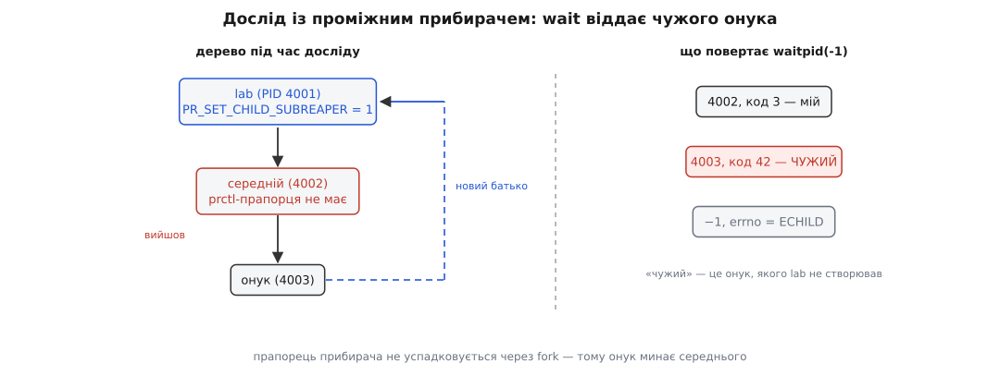
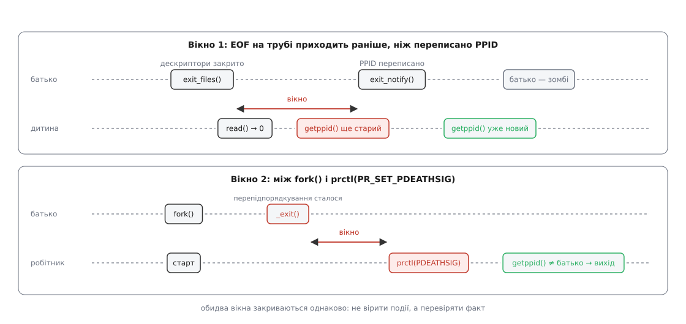

# ⚙️ Лабораторія: перепідпорядкування, яке видно на екрані

Це одна невелика програма на C із п'ятьма підкомандами: кожна відтворює один випадок — зміну PPID після смерті батька, чужого онука в `wait` у проміжного прибирача й сигнал про смерть батька, зокрема ту гонку, через яку сигнал не приходить ніколи. Потрібна вона не тому, що механізми складні: словами вони прості. Складними вони стають у коді, який на них покладається, — бо в кожному є **вікно**, усередині якого найочевидніша перевірка дає найочевидніше неправильну відповідь. Досліди зроблено так, щоб ці вікна не ловити випадковістю, а розчиняти навстіж і бачити щоразу.

Усі шматки далі — один файл `lab.c`, у тому порядку, у якому наведені. Збірка одна на всі досліди:

```
cc -std=c11 -Wall -Wextra -o lab lab.c
```

## Спільна основа

```c
#define _GNU_SOURCE
#include <errno.h>
#include <signal.h>
#include <stdio.h>
#include <string.h>
#include <time.h>
#include <unistd.h>
#include <sys/prctl.h>
#include <sys/wait.h>

static void msleep(long ms)
{
    struct timespec ts;
    ts.tv_sec  = ms / 1000;
    ts.tv_nsec = (ms % 1000) * 1000000L;
    while (nanosleep(&ts, &ts) == -1 && errno == EINTR)
        continue;                  /* ts містить залишок — досипляємо його */
}

/* Ім'я процесу за номером: /proc/<pid>/comm — один рядок без шляху. */
static const char *comm_of(pid_t pid, char *buf, size_t n)
{
    char path[64];
    FILE *f;
    size_t len;

    snprintf(path, sizeof path, "/proc/%d/comm", (int) pid);
    f = fopen(path, "r");
    if (f == NULL || fgets(buf, (int) n, f) == NULL)
        snprintf(buf, n, "?");
    if (f != NULL)
        fclose(f);
    len = strlen(buf);
    if (len > 0 && buf[len - 1] == '\n')
        buf[len - 1] = '\0';
    return buf;
}

/* Ядро нікого не будить, коли переписує PPID. Побачити зміну без сигналу
   можна лише одним способом — питати, доки відповідь не стане іншою. */
static pid_t await_reparent(pid_t old, long limit_ms)
{
    pid_t now = getppid();
    long waited = 0;

    while (now == old && waited < limit_ms) {
        msleep(5);
        waited += 5;
        now = getppid();
    }
    return now;
}
```

Три дрібниці тут не декоративні, і кожна колись коштувала комусь вечора.

`msleep` не просто спить, а **досипляє**. Виклик `nanosleep` перериває будь-який доставлений сигнал, і повертається він тоді з `EINTR` та рештою часу в тій самій структурі; без циклу третій дослід, де сигнал прилітає посеред сну, спав би менше, ніж просили ([EINTR і перезапуск викликів](book:unix-linux/eintr-and-restart) — переривані виклики повертають помилку замість результату, і рішення, що з цим робити, ухвалює програма, а не ядро).

`comm_of` читає `/proc/<pid>/comm` — рядок з іменем програми, яку виконує процес ([procfs](book:unix-linux/proc-filesystem) — тека, у якій ядро віддає стан процесів звичайними файлами). Він тут тому, що фраза «сирота йде до PID 1» на живій машині справджується рідше, ніж очікуєш: на типовому робочому столі осиротілий процес прилипає до **користувацького примірника systemd**, який оголосив себе проміжним прибирачем — це прямо описано в документації `PR_SET_CHILD_SUBREAPER`. Тому програма не стверджує, який має бути номер, а друкує, що вийшло, і як цей процес зветься.

`await_reparent` крутить `getppid()` у циклі, і це не лінощі. Перепідпорядкування не має свого сповіщення: ядро мовчки переписує поле. Єдиний виняток — сигнал про смерть батька, і саме він є темою третього досліду; поки його немає, лишається опитування.

## Дослід 1: PPID до і після

Задача проста на слух: надрукувати `getppid()` двічі — поки батько живий і після того, як він завершився. Уся складність у слові «після»: дитина мусить якось дізнатися, що батько вже пішов, і зробити це надійно, а не «поспавши про запас».

Надійний спосіб є, і він не потребує ані сигналів, ані опитувань: **труба**. Батько тримає писальний кінець, дитина читає з читального; коли батько завершується, ядро закриває його дескриптори, останній писальний кінець зникає — і `read` у дитини повертає нуль, тобто EOF ([труби](book:unix-linux/pipe-and-fifo) — однонапрямний потік байтів, у якого читання дає нуль рівно тоді, коли закрито всі писальні кінці). Друга труба, у зворотний бік, тримає батька, доки дитина не надрукує «до».

```c
static int lab_reparent(void)
{
    int printed[2], gate[2];
    pid_t me = getpid(), kid;
    char c, name[64];

    if (pipe(printed) == -1 || pipe(gate) == -1) {
        perror("pipe");
        return 1;
    }

    kid = fork();
    if (kid == -1) {
        perror("fork");
        return 1;
    }

    if (kid == 0) {
        pid_t now;

        close(printed[0]);
        close(gate[1]);            /* писати в gate має ЛИШЕ батько */

        printf("[дитина %d] до: PPID = %d\n", (int) getpid(), (int) getppid());
        if (write(printed[1], "1", 1) != 1)
            _exit(1);

        while (read(gate[0], &c, 1) == -1 && errno == EINTR)
            continue;              /* 0 == EOF: батько закрив свій кінець */

        printf("[дитина %d] EOF уже є, а PPID = %d\n",
               (int) getpid(), (int) getppid());

        now = await_reparent(me, 1000);
        printf("[дитина %d] після: PPID = %d (%s)\n",
               (int) getpid(), (int) now, comm_of(now, name, sizeof name));
        _exit(0);
    }

    close(printed[1]);
    close(gate[0]);
    while (read(printed[0], &c, 1) == -1 && errno == EINTR)
        continue;

    printf("[батько %d] дитина %d надрукувала «до»; виходжу\n",
           (int) me, (int) kid);
    _exit(0);                      /* gate[1] закриється разом із процесом */
}
```

Змінна `me` — номер батька, знятий **до** розділення; у дитини вона зберігає саме його, і саме з ним порівнює `await_reparent`. Це та сама техніка, що й у перевірці навколо `PR_SET_PDEATHSIG`: не питати, «чи живий батько», а порівняти з тим, ким він був.

```
$ ./lab reparent
[дитина 51544] до: PPID = 51543
[батько 51543] дитина 51544 надрукувала «до»; виходжу
$ [дитина 51544] EOF уже є, а PPID = 51543
[дитина 51544] після: PPID = 3186 (systemd)
```

Дві речі в цьому виведенні варті окремої уваги.

Запрошення оболонки з'являється **посеред** виводу — бо оболонка чекала на процес, який ви запустили, а він уже вийшов; дитина ж лишилася й друкує в той самий термінал. Це та сама втеча з-під оболонки, на якій тримається демонізація, тільки видима цілком.

А середній рядок — головна знахідка досліду. **EOF уже прийшов, а PPID ще старий.** Це не збіг і не тремтіння: у Linux завершення процесу проходить кроками, і `exit_files()`, який закриває дескриптори (звідки й береться EOF), стоїть у цій послідовності **раніше** за `exit_notify()`, усередині якого `forget_original_parent()` переписує ребра. Отже, між сигналом «батько зачинив за собою двері» і фактом «у мене новий батько» є проміжок, і він завжди в цей бік. Наївний код, що після EOF одразу читає `getppid()`, ловить старе значення в переважній більшості запусків — і виглядає це як «ядро бреше».

Звідси перше правило лабораторії: **подія не дорівнює факту**. EOF — подія; зміна PPID — факт; перевіряти треба факт.

## Дослід 2: чужий онук у `wait`

Тепер програма оголошує себе проміжним прибирачем, створює рівно один процес — а забирає коди виходу двох. Другий вона ніколи не створювала.

```c
static int lab_subreaper(void)
{
    pid_t me, mid;
    int isset = -1;

    if (prctl(PR_SET_CHILD_SUBREAPER, 1UL, 0UL, 0UL, 0UL) == -1) {
        perror("PR_SET_CHILD_SUBREAPER");
        return 1;
    }
    prctl(PR_GET_CHILD_SUBREAPER, (unsigned long) &isset, 0UL, 0UL, 0UL);
    me = getpid();
    printf("[lab %d] я прибирач (child_subreaper = %d)\n", (int) me, isset);

    mid = fork();
    if (mid == -1) {
        perror("fork");
        return 1;
    }

    if (mid == 0) {                          /* середній: подвійна вилка */
        pid_t self = getpid();
        pid_t grand = fork();
        int inherited = -1;

        if (grand == -1)
            _exit(127);
        if (grand > 0) {
            prctl(PR_GET_CHILD_SUBREAPER, (unsigned long) &inherited,
                  0UL, 0UL, 0UL);
            printf("[середній %d] мій child_subreaper = %d; онук %d\n",
                   (int) self, inherited, (int) grand);
            msleep(50);                      /* дати онукові надрукувати «до» */
            _exit(3);
        }

        printf("[онук %d] поки що батько = %d\n",
               (int) getpid(), (int) getppid());
        printf("[онук %d] новий батько = %d\n",
               (int) getpid(), (int) await_reparent(self, 1000));
        msleep(200);
        _exit(42);
    }

    printf("[lab %d] я створив рівно один процес: %d\n", (int) me, (int) mid);

    for (;;) {
        int st;
        pid_t got = waitpid(-1, &st, 0);

        if (got == -1) {
            if (errno == EINTR)
                continue;
            if (errno == ECHILD)
                break;
            perror("waitpid");
            return 1;
        }
        printf("[lab %d] wait: %d, код %d — %s\n", (int) me, (int) got,
               WIFEXITED(st) ? WEXITSTATUS(st) : -1,
               got == mid ? "мій" : "ЧУЖИЙ, я його не створював");
    }
    printf("[lab %d] дітей більше нема (ECHILD)\n", (int) me);
    return 0;
}
```

```
$ ./lab subreaper
[lab 51602] я прибирач (child_subreaper = 1)
[lab 51602] я створив рівно один процес: 51603
[середній 51603] мій child_subreaper = 0; онук 51604
[онук 51604] поки що батько = 51603
[lab 51602] wait: 51603, код 3 — мій
[онук 51604] новий батько = 51602
[lab 51602] wait: 51604, код 42 — ЧУЖИЙ, я його не створював
[lab 51602] дітей більше нема (ECHILD)
```



*Онук проходить повз середнього, бо той прапорця не має, і зупиняється на першому предкові, який ним є.*

Рядок `мій child_subreaper = 0` — не дрібниця, а причина, чому дослід узагалі працює. Прапорець прибирача **не успадковується через `fork`** (хоч і переживає `exec`), тож середній процес прибирачем не став, і онукові немає де зупинитися раніше. Якби прапорець передавався дітям, кожен нащадок ловив би своїх онуків сам, і менеджер служб не побачив би нічого — а це рівно те, чого латка 2012 року мала уникнути.

Друге, що видно з порядку рядків: `wait` віддав середнього **раніше**, ніж онук устиг помітити нового батька, — і все одно цикл не завершився передчасно з `ECHILD`. Це гарантія, а не удача. Перепідпорядкування й сповіщення про смерть живуть в одному критичному розділі завершення, причому `forget_original_parent()` виконується **перед** тим, як ядро повідомить батька про смерть. Тобто в мить, коли `wait` повернув середнього, онук уже записаний нашою дитиною. Цикл `waitpid(-1, …)` до `ECHILD` тому й коректний.

І третє, найпрактичніше. Виклик `waitpid(-1, …)` у прибирача означає буквально «будь-яка моя дитина», а дітьми тепер стають чужі процеси. Наглядач, написаний із припущенням «усе, що повернув `wait`, — це те, що я запускав», почне приписувати чужі коди виходу своїм службам: перезапускати живу службу, бо «вона впала з кодом 42», або мовчки з'їдати справжнє падіння. Правильний код тримає власну таблицю запущених номерів і звіряє з нею кожен результат, а нерозпізнані просто відкидає — вони й так забрані, місце в таблиці процесів звільнено, більше від прибирача нічого не потрібно ([завершення, wait і зомбі](book:unix-linux/exit-wait-zombies) — код виходу зберігається до `wait`, і саме `wait` звільняє запис).

> 🔧 **Навіщо це.** Два рядки `prctl` перетворюють звичайну програму на щось, що поводиться як `init` для власного піддерева. Це рівно те, що робить будь-який наглядач, який запускає чужі програми: тестовий запускач, обгортка збірки, локальний менеджер служб. Ціна одна — цикл `wait`, який мусить крутитися завжди, бо тепер саме ви останній, хто може звільнити запис.

## Дослід 3: гонка навколо `PR_SET_PDEATHSIG`

Третій випадок відрізняється від перших двох тим, що тут вікно **вбиває мовчки**: код виглядає правильним, у тестах працює, а на навантаженій машині раз на тисячу запусків лишає робітника, який пережив хазяїна й нікому не потрібен.

Прохання про сигнал ставиться в дитині **після** `fork` — інакше й бути не може, бо `fork` скидає це поле. Отже, між народженням дитини й рядком `prctl` є проміжок, у якому дитина ще не озброєна. Якщо батько встигне померти саме там, перепідпорядкування вже сталося, а прохання надіслати сигнал прийшло після нього — і не спрацює ніколи.

```c
static volatile sig_atomic_t death_signal_seen = 0;

static void on_parent_death(int sig)
{
    static const char msg[] = "  ← прилетів сигнал про смерть батька\n";
    ssize_t n;

    (void) sig;
    death_signal_seen = 1;
    n = write(STDOUT_FILENO, msg, sizeof msg - 1);   /* лише безпечні виклики */
    (void) n;
}

enum { PD_NORMAL, PD_RACE, PD_GUARD };

static int lab_pdeathsig(int mode)
{
    struct sigaction sa;
    pid_t parent = getpid(), kid;
    int i;

    memset(&sa, 0, sizeof sa);
    sa.sa_handler = on_parent_death;
    sigemptyset(&sa.sa_mask);
    if (sigaction(SIGTERM, &sa, NULL) == -1) {
        perror("sigaction");
        return 1;
    }

    kid = fork();
    if (kid == -1) {
        perror("fork");
        return 1;
    }

    if (kid == 0) {
        if (mode != PD_NORMAL)
            msleep(200);                     /* розчиняємо вікно навстіж */

        if (prctl(PR_SET_PDEATHSIG, (unsigned long) SIGTERM,
                  0UL, 0UL, 0UL) == -1) {
            perror("PR_SET_PDEATHSIG");
            _exit(1);
        }
        if (mode != PD_RACE && getppid() != parent) {
            printf("[робітник %d] батько зник до prctl — сигналу не буде\n",
                   (int) getpid());
            _exit(0);
        }

        for (i = 0; i < 5 && !death_signal_seen; i++) {
            printf("[робітник %d] працюю, PPID = %d\n",
                   (int) getpid(), (int) getppid());
            msleep(300);
        }
        printf("[робітник %d] кінець; сигнал %s\n", (int) getpid(),
               death_signal_seen ? "був" : "НЕ приходив");
        _exit(0);
    }

    if (mode == PD_NORMAL)
        msleep(100);                         /* даємо робітникові озброїтися */
    printf("[батько %d] виходжу\n", (int) parent);
    _exit(0);
}
```

Три підкоманди відрізняються лише двома прапорцями: чи спить дитина перед `prctl` і чи звіряє потім номер батька.

**Норма** — вікна немає, перевірка є:

```
$ ./lab pdeathsig
[робітник 51710] працюю, PPID = 51709
[батько 51709] виходжу
$   ← прилетів сигнал про смерть батька
[робітник 51710] кінець; сигнал був
```

**Гонка** — вікно є, перевірки немає:

```
$ ./lab pdeathsig-race
[батько 51740] виходжу
$ [робітник 51741] працюю, PPID = 3186
[робітник 51741] працюю, PPID = 3186
[робітник 51741] працюю, PPID = 3186
[робітник 51741] працюю, PPID = 3186
[робітник 51741] працюю, PPID = 3186
[робітник 51741] кінець; сигнал НЕ приходив
```

Робітник живе під прибирачем, `prctl` не повернув жодної помилки, і ніщо в програмі не натякає, що щось пішло не так. Саме тому цю поведінку варто побачити один раз навмисне: у житті вона трапляється не в кожному запуску, а тоді, коли машина зайнята й планувальник дав дитині процесор пізніше за звичайне.

**Сторожа** — вікно є, перевірка є:

```
$ ./lab pdeathsig-guard
[батько 51755] виходжу
$ [робітник 51756] батько зник до prctl — сигналу не буде
```



*Форма помилки в обох дослідах однакова: код довіряє події, а мусить перевіряти факт — і в обох випадках фактом є значення `getppid()`.*

Півтори секунди (п'ять кроків по 300 мс), які робітник у режимі гонки живе без батька, — навмисна межа, щоб лабораторія нічого по собі не лишала. У справжньому робітнику такої межі немає, і саме тому за загубленими процесами ходять руками.

> 🔧 **Навіщо це.** Перевірка `getppid() != parent` дає повну відповідь: якщо батько помер до `prctl`, номер уже інший, і ми виходимо самі; якщо він помре після, прохання вже стоїть і сигнал прийде. Проміжку, у якому не спрацювало б ані одне, ані друге, не існує. Симетричний варіант — тримати батька трубою, доки дитина не напише «озброївся»: тоді батько просто не може вийти всередині вікна. Обидва способи законні, обирати треба той, який видно з коду, — а не той, де замість перевірки стоїть `msleep`.

## Де це ламається насправді

Далі — те, що в лабораторії зроблено правильно, але легко зробити навпаки; кожен пункт зустрічається в чужому коді частіше, ніж хотілося б.

**Буферизація псує саме той вивід, заради якого все затівалося.** Виклики `printf` у термінал буферизуються по рядку, а в трубу чи файл — блоками по кілька кілобайтів. Оскільки всі процеси лабораторії завершуються через `_exit()`, який навмисне **не** зливає буфери мови C, вивід у `./lab reparent | cat` просто зник би. А ще гірше: `fork` копіює непорожній буфер, і той самий текст виводиться двічі — по разу з кожного процесу. Один рядок у `main` знімає обидві біди ([буферизація stdio](book:unix-linux/stdio-buffering) — рівень буферів бібліотеки, який живе окремо від дескрипторів і не зникає сам):

```c
int main(int argc, char **argv)
{
    setvbuf(stdout, NULL, _IOLBF, 0);   /* рядок — і одразу у вивід */

    if (argc >= 2 && strcmp(argv[1], "reparent") == 0)
        return lab_reparent();
    if (argc >= 2 && strcmp(argv[1], "subreaper") == 0)
        return lab_subreaper();
    if (argc >= 2 && strcmp(argv[1], "pdeathsig") == 0)
        return lab_pdeathsig(PD_NORMAL);
    if (argc >= 2 && strcmp(argv[1], "pdeathsig-race") == 0)
        return lab_pdeathsig(PD_RACE);
    if (argc >= 2 && strcmp(argv[1], "pdeathsig-guard") == 0)
        return lab_pdeathsig(PD_GUARD);

    fprintf(stderr, "вжиток: %s reparent|subreaper|pdeathsig"
                    "|pdeathsig-race|pdeathsig-guard\n", argv[0]);
    return 2;
}
```

**В обробнику сигналу дозволено дуже мало.** У `on_parent_death` стоїть `write` і присвоєння змінної типу `volatile sig_atomic_t` — і нічого більше. Спокуса написати там `printf` велика й закінчується зависанням: сигнал може прийти всередині іншого `printf`, коли захоплено внутрішній замок потоку, і повторний вхід стане самоблокуванням ([безпека в обробнику сигналу](book:unix-linux/async-signal-safety) — перелік викликів, які можна викликати з обробника, короткий і закритий).

**Сліпий перезапуск після `EINTR` робить процес глухим до себе.** `msleep` досипляє залишок, тому робітник, якому сигнал прилетів на початку сну, помітить це не одразу, а через триста мілісекунд. Тут це дрібниця; там, де сигнал означає «зупинися негайно», перезапускати сон не можна — треба виходити з циклу за прапорцем, який поставив обробник.

**`prctl` треба годувати аргументами правильної ширини.** Обгортка в glibc оголошена змінноаргументною і безумовно читає чотири значення як `unsigned long`; документація прямо попереджає про це. Тому в коді скрізь `0UL`, а не `0`, і `(unsigned long) SIGTERM`, а не просто `SIGTERM`: на 64-бітних платформах передане як `int` значення може приїхати зі сміттям у старших розрядах.

**Прохання про сигнал зникає в трьох випадках, і всі три легко проґавити.** Його скидає `fork` — онук не успадкує його від дитини. Його скидає будь-яка зміна облікових даних процесу, зокрема запуск програми з бітом `setuid`. І найпідступніше: батьком для нього вважається **потік**, який створив дитину, а не програма як ціле ([потоки як задачі](book:unix-linux/threads-as-tasks) — для ядра одиниця планування є задачею, і саме задача записана батьком). Звідси дірка, якої перевірка `getppid()` не закриває: якщо в багатопотоковому батькові завершився саме той потік, що викликав `fork`, ядро перечепить дитину до сусіднього потоку тієї ж групи — а номер процесу від цього не зміниться. `getppid()` поверне те саме число, перевірка скаже «все гаразд», хоча сигнал уже пролетів і другого не буде. У багатопотоковій програмі надійніше створювати дітей з одного виділеного потоку, який живе стільки ж, скільки програма.

**Прибирачем може виявитися не той, на кого ви думаєте.** Дослід друкує ім'я нового батька саме тому, що очікуваної одиниці там часто немає: на робочому столі це `systemd` користувача, у контейнері без `--init` — ваша ж головна програма, яка на роль прибирача не підписувалася ([простори імен](book:unix-linux/namespaces) — усередині контейнера номер 1 належить процесові цього простору, а не хостовому `init`). Запустіть ту саму лабораторію в контейнері й порівняйте: третій рядок першого досліду покаже вашу програму.

Після кожного прогону варто переконатися, що нічого не лишилося:

```
$ ./lab pdeathsig-race &
$ sleep 0.5 && ps -eo pid,ppid,pgid,stat,comm | grep -w lab
  51741    3186   51740 S    lab
```

Робітник 51741 лишився у групі процесів свого мертвого батька (`PGID 51740`), а `PPID` у нього вже чужий — номер прибирача. Це і є той самий загублений процес, тільки цього разу ви його бачите й знаєте, звідки він узявся.
