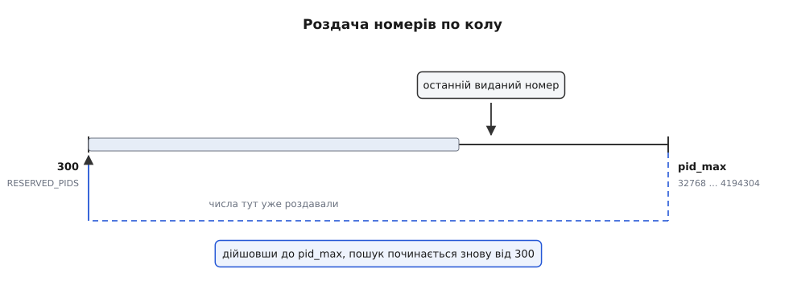
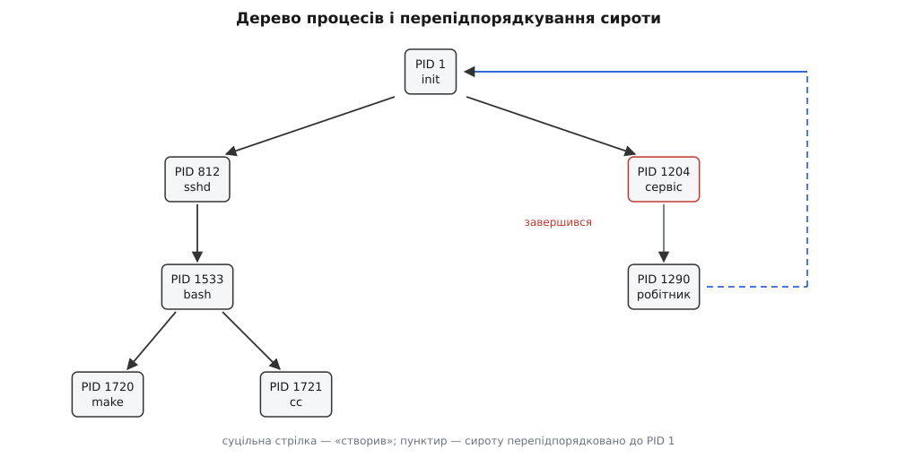
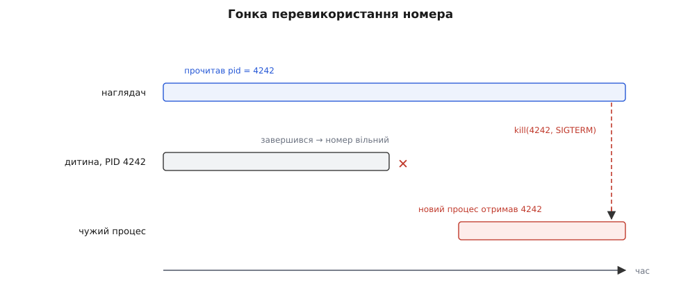
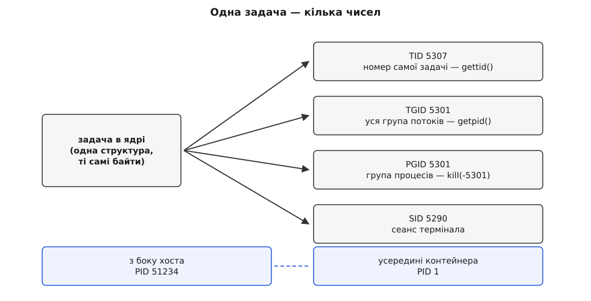

# PID і дерево процесів

<preknowlist>
- [Процес: що це насправді](book:unix-linux/process-model) — процес як запис усередині ядра: власний адресний простір, таблиця відкритих файлів, стан виконання.
- [Ядро й простір користувача](book:unix-linux/kernel-and-userspace) — межа між кодом програми й кодом ядра; структури ядра програмі не видно й адресувати їх вона не може.
- [Системний виклик: як програма просить ядро](book:unix-linux/syscall-mechanics) — єдиний спосіб передати ядру прохання разом з аргументами, і аргументи ці — прості числа в регістрах.
- [Файловий дескриптор](book:unix-linux/file-descriptor) — мале число, за яким ядро тримає посилання на об'єкт, поки дескриптор відкритий.
</preknowlist>

## Показати пальцем на процес

Уявіть найпростіше прохання, яке одна програма може мати до системи: «заверши он той процес». Щоб його висловити, треба якось указати, про кого йдеться. Усередині ядра процес — це структура в пам'яті ядра, і в принципі на неї є вказівник. Але передати цей вказівник програмі не можна з трьох незалежних причин, і кожної окремо вистачило б.

Перша: програма не може розіменувати адресу ядра — сторінки ядра для неї недоступні, спроба читання закінчиться помилкою доступу. Друга: якби могла, захисту не існувало б узагалі, бо будь-яка програма правила б чужі структури ядра як свої змінні. Третя, найпідступніша: структура живе рівно доти, доки живий процес, а програма, що тримає адресу, про смерть не дізнається — і наступний доступ поцілив би в звільнену або вже перевикористану пам'ять.

Отже, потрібне не посилання, а **замінник імені**: щось, що програма може тримати при собі, передавати ядру назад і показувати іншим програмам. Вимоги до такого замінника випливають із того, як він мандруватиме. Він проходить крізь межу системного виклику, а там аргумент — це машинне слово, тож ім'я має бути числом. Він потрапляє в журнали, у виведення команд, у текстові файли, у рядок оболонки, отже має бути коротким і читабельним людиною. За ним ядро мусить швидко знаходити свою структуру, отже це має бути ключ у таблиці. І він мусить бути однозначним: у кожен момент часу — не більше одного процесу на одне число.

Усі чотири вимоги задовольняє мале невід'ємне ціле. Саме його ядро й видає.

## Число, яке видає ядро

Це число називається PID (англ. *process identifier* — ідентифікатор процесу). Процес дізнається власний PID викликом `getpid()`, а PID свого творця — викликом `getppid()`. Тип цих чисел — `pid_t`, у Linux це знакове 32-бітове ціле.

Знаковість тут не випадковість і не недогляд. Самі PID завжди додатні, але місця, куди їх передають, використовують знак як додатковий біт змісту: `kill(1234, SIGTERM)` шле сигнал одному процесові, а `kill(-1234, SIGTERM)` — цілій групі процесів із номером 1234. Так само `waitpid(-1, …)` означає «будь-яка моя дитина». Тобто одне поле несе два різні різновиди адресата, і розрізняє їх знак — прийом, який задає всій системі стиль: числа-імена мають маленький словник домовленостей навколо себе.

Число видає ядро, і програма не може його замовити. Це не примха, а наслідок вимоги однозначності: якби кожен просив собі номер, довелося б розв'язувати конфлікти й довіряти проханням. Єдиний виняток зроблено там, де без нього неможливо — у механізмі збереження й відновлення стану процесів (checkpoint/restore): виклик `clone3()` приймає масив `set_tid`, яким відновлювач просить дати процесові точно ті самі номери, які були до збереження, бо всередині відновленої програми ці номери вже записані. Доти те саме роблять обхідним шляхом — записують бажане число в `/proc/sys/kernel/ns_last_pid`, щоб наступний пошук почався саме з нього; але то підказка, а не замовлення: між записом і розгалуженням число може забрати хтось інший.

## Звідки береться саме це число

Ядро тримає на кожен простір імен процесів свою таблицю зайнятих номерів і роздає їх **циклічно**: наступний кандидат — це число, наступне після виданого востаннє. Якщо воно вільне, його й беруть; якщо ні — шукають далі вгору. Дійшовши до верхньої межі, пошук починається знову з невеликого числа — у Linux це 300 (константа `RESERVED_PIDS`). Число 300 не має жодного глибокого сенсу: воно просто вище за номери, які встигають розібрати служби й потоки ядра на самому початку роботи системи, тож повторний прохід не витрачає час на суцільно зайняту ділянку.

Верхню межу задає налаштування `kernel.pid_max`. Історична типова величина — 32768, тобто 2¹⁵; максимум, який ядро дозволяє на 64-бітових машинах, — 4194304, тобто 2²². Багато сучасних дистрибутивів виставляють максимум одразу, бо контейнерні навантаження впираються в 32 тисячі процесів надто легко: systemd робить це типово з версії 256 (2024), а окремі дистрибутиви піднімали межу власними файлами в `sysctl.d` і раніше. Починаючи з ядра 6.14, `pid_max` можна задавати окремо для кожного простору імен процесів — саме тому, що частина старого програмного забезпечення досі вважає, ніби PID не буває більшим за п'ять цифр.



*Пошук вільного номера йде вперед від останнього виданого; діставшись pid_max, він повертається на 300. Простір номерів скінченний, тому обертання неминуче.*

З циклічної роздачі випливають два наслідки, і другий важить незрівнянно більше за перший.

Перший приємний: поки коло не замкнулося, номери зростають, тому більший PID зазвичай означає молодший процес. На цьому будують безліч дрібних здогадів («он той із номером 31000 щойно запустився»), і всі вони перестають працювати рівно в мить обертання.

Другий: **номери перевикористовуються**. Простір скінченний, отже число, звільнене померлим процесом, рано чи пізно дістанеться комусь іншому. Питання лише в тому, як швидко.

**Умова: складальна машина, `pid_max` = 32768, збірка запускає близько 600 короткоживучих процесів за секунду (компілятор, лінкер, оболонкові обгортки).**

```
вільних номерів у колі ≈ 32768 − 300 − (живих процесів ≈ 500) ≈ 31968
повний оберт           = 31968 / 600 ≈ 53 с
```

Тобто номер, який ви прочитали з файлу хвилину тому, на такій машині вже цілком може називати іншу програму. Піднімемо межу до максимуму:

```
повний оберт = (4194304 − 300 − 500) / 600 ≈ 6989 с ≈ 1.9 год
```

Краще, але не «ніколи»: довгоживучий наглядач, який тримає записаний номер годинами, знову опиняється в тій самій пастці. Збільшення межі розтягує вікно, а не закриває його.

## Батьківство перетворює список на дерево

Досі ми мали лише пласку множину пронумерованих процесів. Структура з'являється з іншого боку — з того, як процеси народжуються.

У Unix новий процес не створюється з нічого: його завжди створює вже наявний процес, розділяючись надвоє. Звідси єдиний факт, на якому тримається все подальше: у кожного процесу є **рівно один** творець. Не нуль (крім найпершого) і не два. Тому в кожного процесу є одне поле «номер батька» — PPID (англ. *parent process identifier*) — і множина процесів разом із цим полем утворює не довільний граф, а дерево.

> 🔧 **Навіщо це.** Дерево — не прикраса діаграм, а робоча структура: саме нею ходять `pstree`, аналізатори журналів і системи безпеки, коли треба відповісти на питання «хто це запустив». Ланцюжок PPID від підозрілого процесу вгору до PID 1 — це, по суті, історія походження: вебсервер → оболонка → інтерпретатор → мережевий клієнт читається як опис вторгнення без жодних додаткових даних.

Корінь дерева — перший процес, який ядро запускає вручну наприкінці свого завантаження. Йому дістається номер 1, і не тому, що номер зарезервовано, а просто тому, що він перший. Номер 0 у Linux належить внутрішній задачі простою (той самий код, що виконується, коли процесорові нічого робити), і в `/proc` вона не показується. Номер 2 займає `kthreadd` — предок усіх потоків ядра, тож насправді в дереві два корені: під 1 висить усе користувацьке, під 2 — усе ядрове. Особливі повноваження процесу 1 випливають не з номера, а з його ролі, і це окрема тема ([init і PID 1](book:unix-linux/init-and-pid1)); про те ж, звідки взялася сама ця нумерація, — [коротка історія народження схеми](book:unix-linux/pid-and-hierarchy/hist-pid-and-init.md).

Зв'язок «батько → дитина» несе цілком конкретні обов'язки, і без них дерево було б лише малюнком.

Дитина отримує від батька майже все своє початкове майно: копію адресного простору, копії дескрипторів, поточний каталог, оточення, ідентичність користувача, обмеження ресурсів. Дерево — це шлях, яким усе це успадковується; докладний розбір того, що саме копіюється, а що ділиться, — у [темі про fork](book:unix-linux/fork-semantics).

Коли дитина завершується, її код виходу треба комусь віддати. Ядро віддає його **батькові**: тримає запис про померлого до того моменту, поки батько не забере результат викликом із родини `wait`, і сповіщає батька сигналом `SIGCHLD`. Саме тому смерть процесу — не миттєве зникнення, а перехід у стан очікування на прибирання, і саме тому невибраний результат перетворює процес на «зомбі» ([стани й прибирання](book:unix-linux/exit-wait-zombies)).



*Кожен процес має рівно одного батька, тому зв'язки складаються в дерево; для всього користувацького простору його корінь — PID 1 (гілка потоків ядра під PID 2 тут не показана). Коли батько завершується раніше за дитину, ребро не зникає — воно перечіпляється вгору.*

## Дерево рухається під руками

Дерево не застигле. Найважливіша його властивість — воно **не може розірватися**: якщо батько завершується раніше за дитину, дитина не лишається без батька, її перепідпорядковують. Типово — процесові 1, а в новіших системах — найближчому предкові, який оголосив себе «підбирачем» через `prctl(PR_SET_CHILD_SUBREAPER)`; саме так менеджер служб збирає своїх нащадків, не змушуючи PID 1 приймати чужі коди виходу ([докладно про сиріт](book:unix-linux/orphan-reparenting)).

Звідси практичний висновок, який дорого коштує тим, хто його не зробив: **PPID — величина, яка змінюється**. Прочитали ви його секунду тому, а зараз він уже 1, бо проміжний процес завершився. Будувати на PPID логіку («якщо мій батько досі той самий, значить усе гаразд») — означає будувати на значенні, що змінюється без вашої участі й без сповіщення.

Ще один висновок стосується спроби керувати цілим піддеревом. Здається природним: «убий процес разом з усіма нащадками — вони ж у дереві». Але обійти піддерево атомарно неможливо: доки ви читаєте список дітей, з'являються нові, а старі перепідпорядковуються вгору й тікають із-під вашої гілки. Класичний спосіб «відв'язатися» — подвійне розділення з відходом у власний сеанс — робиться саме для цього. Тому для надійного обмеження групи процесів дерево не годиться, і в Linux цю роль виконує окремий механізм обліку, з якого не можна вийти зсередини ([cgroups](book:unix-linux/cgroups)).

## Ім'я нікого не тримає

Тепер сходяться дві лінії — скінченне коло номерів і дерево обов'язків, — і в місці їхнього сходження живе найпоширеніша помилка роботи з процесами.

PID — це **ім'я, а не посилання**. Тримаючи при собі число 4242, ви не тримаєте нічого: процес може завершитися будь-якої миті, номер повернеться в коло, і колись його видадуть комусь іншому. Число у вас у руках при цьому не зміниться й нічим не просигналить. Воно й далі буде цілком коректним PID — просто вже не тим.

Наслідок цього — не абстрактний, а дуже фізичний.



*Між миттю, коли номер прочитано, і миттю, коли за ним посилають сигнал, процес устигає завершитися, а його номер — дістатися чужій програмі. Перевірка «чи живий такий PID» цього не рятує: вона теж робиться до пострілу.*

Саме на ці граблі наступають скрипти вигляду `kill $(cat /run/сервіс.pid)`. Файл із номером написали під час запуску, служба тим часом упала, номер перевикористали — і команда зупинки прицільно вбиває сторонню програму, яка щойно народилася. Те саме, тільки з іншого боку, роблять інструменти на кшталт `pkill` за іменем: вони спершу читають `/proc`, потім шлють сигнал, і між цими двома діями світ змінюється.

Класичне пом'якшення — перевірити не лише номер, а ще щось: чи збігається командний рядок у `/proc/<pid>/cmdline`, чи збігається час старту (двадцять друге поле `/proc/<pid>/stat`, у тиках від завантаження системи). Час старту працює добре, бо два процеси з тим самим номером майже напевно народилися в різні тики. Але це звужує вікно, а не закриває: між перевіркою та пострілом лишається проміжок, і в ньому все ще може статися що завгодно. Це рівно та сама структура «перевірив — потім зробив», що й у [гонках за спільними даними](book:programming/atomicity-races): будь-яка перевірка застаріває тієї ж миті, коли завершується.

> 🔧 **Навіщо це.** Правило, яке варто застосовувати без роздумів: PID, отриманий не від ядра щойно, а прочитаний із файлу, з журналу, з виведення іншої команди, — це підказка, а не адреса. Якщо за ним іде дія з наслідками (сигнал, зміна пріоритету, приєднання налагоджувача), ім'я перед дією треба або підтвердити чимось, що не перевикористовується, або взагалі замінити на посилання.

## Коли ім'я все-таки безпечне

Із загальної небезпеки є один точно окреслений виняток, і він показує механіку зсередини.

Номер звільняється не тоді, коли процес перестав виконуватися, а тоді, коли **останній запис про нього прибрано**. Померла дитина, чий код виходу батько ще не забрав, лишається в системі як зомбі — і весь цей час її номер зайнятий. Тому батько, який ще не викликав `wait`, може без жодного ризику слати сигнали своїй дитині за номером: перевикористати цей номер система не має права, доки він, батько, не забере результат. Найгірше, що станеться, — сигнал прилетить у зомбі й нічого не зробить.

І навпаки: щойно батько зробив `wait`, гарантія зникає тієї ж миті. Тому послідовність «дочекався → потім про всяк випадок убив» — це вже гонка, хоча виглядає обережною.

Звідси видно й межу винятку: гарантія тримається на **власності**. Номер безпечний лише для того, хто відповідає за прибирання, тобто для батька. Для наглядача, скрипта, панелі керування чи сусідньої служби — тобто для всіх, хто дивиться на чужий процес, — жодної такої гарантії немає й бути не може.

## Як з імені зробити посилання

Розв'язок мусить з'явитися там, де живе справжній об'єкт, — по той бік межі ядра. Усередині ядра номер узагалі не є процесом: номер — це ключ у таблиці, а за ключем лежить окрема структура (`struct pid`) з лічильником посилань (`refcount_t count`). На неї посилається сама задача через свій `struct task_struct`, на неї ж посилаються групи й сеанси. Тобто механізм посилань у ядра вже є, бракує лише способу дати таке посилання програмі.

А спосіб давати програмі посилання на об'єкт ядра в Unix рівно один — файловий дескриптор. Так і зробили: **pidfd** (англ. *pid file descriptor*) — дескриптор, що вказує на конкретний процес.

:::tabs
```c
int fd = pidfd_open(4242, 0);          /* дескриптор на процес 4242 */
pidfd_send_signal(fd, SIGTERM, NULL, 0);  /* сигнал саме йому */
```
```cpp
int fd = pidfd_open(4242, 0);          // дескриптор на процес 4242
pidfd_send_signal(fd, SIGTERM, nullptr, 0); // сигнал саме йому
```
:::

Різниця з `kill(4242, SIGTERM)` не в зручності, а в тому, у що можна влучити. Дескриптор створює екземпляр анонімного файлу (`struct file`), який збільшує лічильник посилань на відповідну `struct pid` ядра і запам'ятовує **той самий** процес, а не його числовий номер. Якщо процес до моменту пострілу вже помер і його номер устигли роздати комусь іншому, `pidfd_send_signal` виявить, що прив'язаний `task_struct` вже від'єднався від `struct pid`, і не влучить у сусіда — він поверне помилку `ESRCH`. Тобто гонка не зникає (процес усе одно може померти будь-коли), але з розряду «мовчки нашкодив стороннім» переходить у розряд «повернув помилку».

Важливо розуміти й те, чого pidfd **не** робить: він не резервує числового номера. Тримаючи дескриптор, ви не заважаєте системі видати число 4242 наступному процесові; ви лише гарантуєте, що ваш дескриптор до того нового процесу не має жодного стосунку.

Довкола цієї ідеї добудували решту потрібного:

- `clone3()`/`clone()` з прапорцем `CLONE_PIDFD` віддають дескриптор дитини **одночасно** з її створенням, тож вікна «дитина вже є, а посилання ще нема» не існує зовсім;
- дескриптор можна класти в `poll`/`epoll` разом із сокетами й таймерами: він стає читабельним, коли процес перетворився на зомбі, і дає подію розриву, коли його прибрали. Наглядачеві більше не потрібен окремий шлях для `SIGCHLD` — смерть дитини приходить тим самим циклом подій, що й мережеві дані ([очікування на багато джерел](book:unix-linux/select-poll-epoll));
- `waitid(P_PIDFD, fd, …)` забирає код виходу за дескриптором;
- `pidfd_getfd()` дозволяє (за наявності прав) витягти з чужого процесу його відкритий дескриптор — на цьому тримаються сучасні пісочниці й засоби налагодження.

Робочий приклад наглядача, який запускає дитину з `CLONE_PIDFD`, чекає на неї в одному циклі з мережею й безпечно надсилає сигнали, — [в окремому розборі з кодом](book:unix-linux/pid-and-hierarchy/proj-pidfd-supervisor.md). Повний перелік викликів, їхніх аргументів, помилок і потрібних версій ядра — [у довідці інтерфейсів](book:unix-linux/pid-and-hierarchy/api-pid-interfaces.md).

## Одна задача — кілька чисел

Досі ми говорили так, ніби відповідність «процес ↔ число» взаємно однозначна. Насправді вона складніша з двох незалежних причин, і обидві виринають щоразу, коли числа з різних джерел не збігаються.

**Причина перша — потоки.** Одиниця планування в Linux — не процес, а задача; потоки одного процесу — це задачі, що поділяють адресний простір. Кожна задача має власний номер, а те, що звична програма називає PID, — це номер **головної задачі групи**, спільний для всіх потоків (у ядрі його називають TGID). Тому:

:::tabs
```c
printf("getpid  = %d\n", getpid());   /* однакове в усіх потоках процесу */
printf("gettid  = %ld\n", (long)gettid()); /* у кожного потоку своє */
```
```cpp
std::cout << "getpid = " << getpid() << '\n';   // однакове в усіх потоках процесу
std::cout << "gettid = " << gettid() << '\n';   // у кожного потоку своє
```
:::

Сигнал, надісланий за PID, адресовано **всій групі**, і доставити його може будь-який потік, у якого цей сигнал не заблокований. Щоб працювати з окремим потоком, потрібні окремі засоби — а з ядра 6.9 pidfd вміє посилатися й на окремий потік, а не лише на групу ([потоки як задачі](book:unix-linux/threads-as-tasks)).

**Причина друга — простори імен.** Одна задача може бути видима з кількох просторів імен процесів одночасно, і в кожному вона має **власний номер**. Усередині контейнера головний процес бачить себе як PID 1, а з боку хоста той самий процес — це, скажімо, 51234. Ядро зберігає обидва числа в одній структурі `struct pid`, де масив `numbers[]` містить записи `struct upid` для кожного рівня вкладеності просторів імен. Пошук за числом іде не через якийсь спільний на всю систему покажчик, а через власну таблицю кожного простору імен (від ядра 4.15 це IDR — розріджений відповідник «номер → структура», який заразом і роздає вільні номери). Видимість при цьому залишається строго односпрямованою: зовнішній простір бачить внутрішні процеси, внутрішній про зовнішні не знає нічого й назвати їх не може ([простори імен](book:unix-linux/namespaces)).



*«PID процесу» — це відповідь на питання «яким числом, з чийого боку і на якому рівні». Ті самі байти пам'яті ядра називаються по-різному для потоку, для групи потоків і для кожного простору імен.*

Практичний наслідок: PID має сенс лише разом із простором, у якому його прочитали. Число з журналу контейнера не можна подавати в `kill` на хості — воно там або нічого не значить, або, гірше, значить не те.

## Числа, що називають не процес, а групу

Останнє, що варто знати про PID: ними називають не тільки процеси.

Коли оболонка запускає конвеєр із кількох команд, усі їх треба вміти зупинити чи перервати разом — інакше `Ctrl+C` убивав би лише останню. Для цього процеси об'єднують у **групу процесів**, і групу теж треба якось назвати. Замість заводити окремий простір номерів систему зробили простіше: іменем групи стає PID того процесу, що її створив (лідера), — це число називають PGID. Так само сеанс (об'єднання груп навколо одного термінала) називається PID свого лідера — SID.

```
$ grep -r pid_max /usr/src | sort &     # конвеєр пішов у фон
$ ps -o pid,ppid,pgid,sid,comm
    PID    PPID    PGID     SID COMMAND
   3120    3110    3120    3120 bash
   3480    3120    3480    3120 grep
   3481    3120    3480    3120 sort
   3482    3120    3482    3120 ps
```

Тут видно всю систему іменування одразу: `grep` і `sort` — різні процеси з різними PID, але одна група (3480, за номером першого з них), і обидва в сеансі оболонки 3120. Сигнал, посланий на `-3480`, дістанеться обом; докладніше, як це використовує термінал, — у [керуванні завданнями](book:unix-linux/job-control). Останній рядок — сам `ps`: він теж дитина цієї ж оболонки й теж у її сеансі, але в конвеєр не входив, тож дістав власну групу зі своїм номером — і в будь-якому справжньому запуску такий рядок буде, бо на мить друку `ps` іще живий.

З того, що номер служить іменем групи, випливає тонкість, яку легко проґавити. Лідер групи може завершитися раніше за решту — а ім'я групи мусить лишатися чинним, бо інакше живі учасники втратили б адресу. Тому число, поки воно комусь служить іменем групи чи сеансу, **не повертається в коло вільних**, навіть якщо процес із таким номером уже помер і прибраний. Це та сама механіка лічильника посилань, що й у pidfd, тільки видима зсередини: номер живе стільки, скільки на нього посилаються, а не стільки, скільки живе процес.

## Де на це дивитися

Усе описане система показує через `/proc`: каталог `/proc/<pid>` існує рівно доти, доки існує процес, поле «батько» лежить у `/proc/<pid>/stat`, потоки видно в `/proc/<pid>/task/<tid>`, а поточну верхню межу — у `/proc/sys/kernel/pid_max` ([procfs як інтерфейс](book:unix-linux/proc-filesystem)). Команди `ps`, `top` і `pstree` не мають жодного окремого каналу до ядра — вони читають ті самі файли, і тому успадковують ту саму властивість: показане ними вже минуле. Каталог, який ви щойно перелічили, міг зникнути до того, як ви його відкрили; `ps` мовчки пропускає такі випадки, і це не помилка інструмента, а чесне відображення того, що моментального знімка дерева процесів не існує.

Тому найточніше формулювання того, чим є PID, звучить так: це **короткочасний ключ у скінченному кільці номерів, дійсний у межах одного простору імен**. Він чудово годиться, щоб про процес говорити — назвати в журналі, показати людині, передати як підказку. Але щоб на процес **діяти**, потрібне щось інше: або власність (ви його батько й ще не прибрали), або справжнє посилання (дескриптор), або зовнішня межа, з якої процес не втече (група, сеанс, cgroup). Усі три способи роблять те саме — перетворюють ім'я на щось, що ядро тримає за вас.
