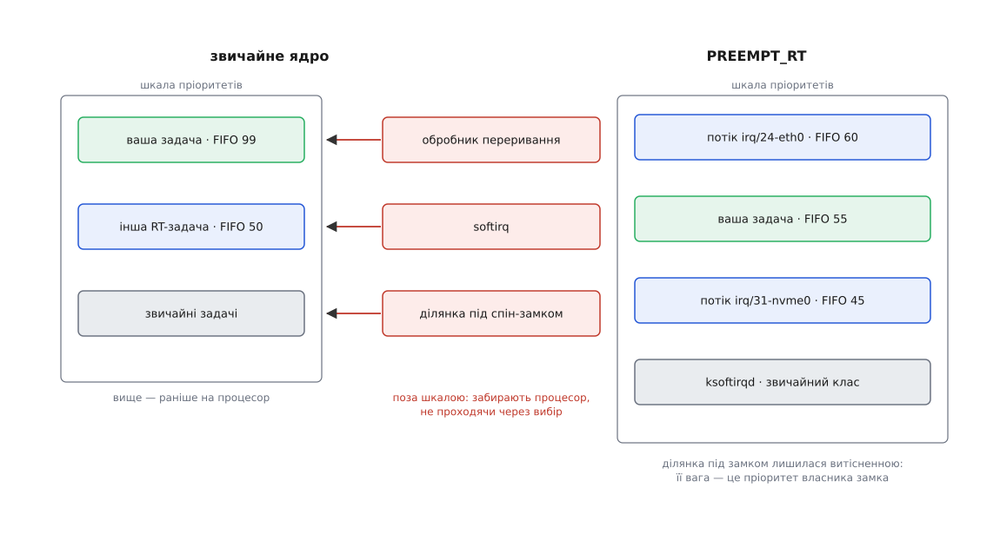
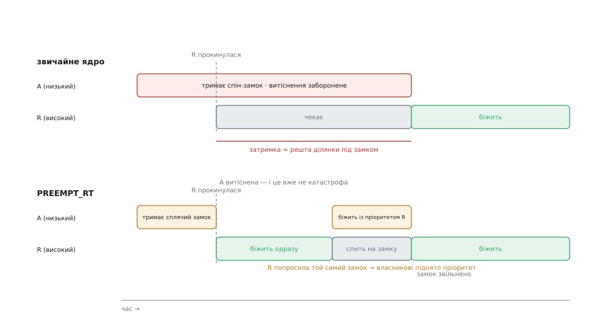
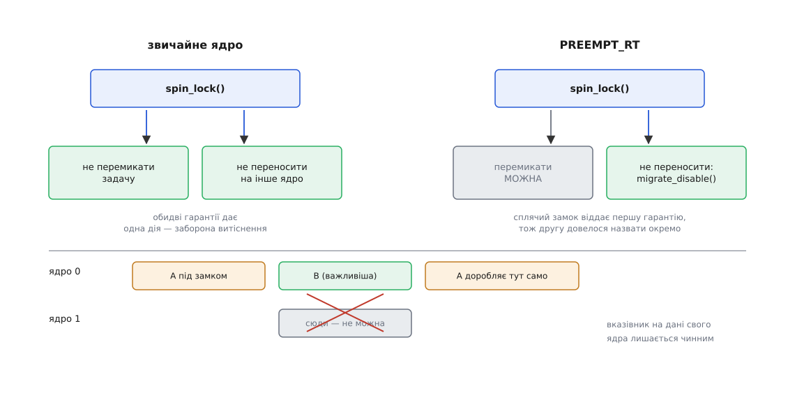

# Гілка реального часу PREEMPT_RT

<preknowlist>
- [Витісненість ядра: від PREEMPT_NONE до PREEMPT_RT](topic:unix-linux/kernel-preemption) — прапорець «цю задачу пора зняти» й лічильник заборон; перемикання стається лише там, де ядро питає вентиль.
- [Пріоритети, nice і реальночасові класи](topic:unix-linux/priority-nice-realtime) — клас `SCHED_FIFO` і число від 1 до 99: готова задача з більшим числом забирає процесор негайно.
- [Спін-замок](topic:programming/spinlock) — замок, на якому чекають, крутячись у порожньому циклі; тримати його можна лічені наносекунди.
- [Інверсія пріоритетів](topic:programming/priority-inversion) — важлива задача чекає на замок у руках неважливої; лікується успадкуванням пріоритету.
- [Замки в ядрі й атомарний контекст](topic:unix-linux/kernel-locking) — які місця ядра не мають права заснути й що з них можна кликати.
- [Переривання, softirq і робочі черги](topic:unix-linux/interrupts-bottom-halves) — обробник переривання не є задачею, а довгу частину його роботи ядро відкладає в softirq.
- [Дані свого ядра процесора](topic:unix-linux/per-cpu-data) — структури «по примірнику на ядро», захистом яких слугує сам факт, що задача не покине це ядро.
- [Перемикання контексту](topic:programming/context-switch) — ціна зміни задачі: збережені регістри плюс холодний кеш після неї.
</preknowlist>

## Число, яке нікого не зобов'язує

Ви дали своїй задачі найвище, що є: клас `SCHED_FIFO`, пріоритет 99. Це означає буквально таке — щойно вона готова, її ставлять на процесор попереду всіх. І все одно раз на хвилину вона прокидається на чотириста мікросекунд пізніше, ніж просила, і майже завжди тоді, коли крізь мережеву карту йде великий файл.

Спокуса — шукати винного серед задач. Але серед задач винного немає. Карта перериває процесор, ядро приймає пакети, потім розгрібає накопичену чергу — і жодна з цих робіт задачею не є. У неї немає рядка в черзі планувальника й немає числа, яке можна порівняти з вашими 99. Вона не вища за вас і не нижча: вона поза порівнянням.

Ось корінь усього. Пріоритет — не властивість задачі, а обіцянка **порядку між тими, кого система вибирає**. Хто споживає процесор, не проходячи через вибір, той цієї обіцянки просто не бачить, і жодне число її на нього не пошириш.

Таких споживачів у звичайному ядрі рівно три роди. **Обробник апаратного переривання** виконується там і тоді, де його застав сигнал, поза чергою й поза пріоритетами. **Softirq** — відкладена половина тієї самої роботи, теж не задача й теж без числа. **Ділянка, де витіснення заборонене**, — насамперед код під спін-замком: тут задача формально є, але зняти її з процесора не можна, тож для того, хто чекає, вона так само нечутлива до будь-яких пріоритетів.

`PREEMPT_RT` — набір змін із однією метою: **зробити всіх трьох задачами з числом**. Не додати точок, де ядро питає, чи не пора перемкнутися (це вже зробила повна модель витіснення), а перетворити самих споживачів так, щоб планувальник міг їх вибирати й розставляти за старшинством. Усе решта в цій гілці — наслідки того перетворення, включно з його ціною.



*Шкала пріоритетів у звичайному ядрі впорядковує лише задачі; переривання, softirq і ділянки під спін-замком стоять збоку й забирають процесор незалежно від неї. Мета RT — щоб на шкалі опинилося все, що виконується.*

## Замок, який засинає

Почнімо з найчисленнішого. Заборонених ділянок у ядрі стільки, скільки взять спін-замка, — а це десятки тисяч місць у коді. Доки `spinlock_t` лишається спін-замком, доти в ядрі лишаються десятки тисяч відрізків, під час яких пріоритети не діють. Отже, розв'язок мусить бити не по кожному з відрізків окремо, а по самому типу.

Під `PREEMPT_RT` `spinlock_t` компілюється в `rt_mutex` — сплячий замок. Той, хто не дістав замка, не крутиться в циклі, а стає в чергу й віддає процесор. І цим зникає причина, з якої витіснення доводилося забороняти: власника тепер можна знімати з процесора скільки завгодно, бо ніхто на цьому ядрі не крутиться, чекаючи на нього, — претендент спить і процесора не тримає.

Але ту саму мить, коли претендент заснув, з'являється нова біда, і з'являється неминуче. Час, який претендент проспить, дорівнює часові, доки власник добіжить до `unlock`. А власник тепер — звичайна витісненна задача з довільним пріоритетом: його самого можуть зняти з процесора на користь когось третього, і поки той третій біжить, важлива задача спить на замку. Ми власними руками зробили інверсію пріоритетів структурною — раніше вона траплялася лише на м'ютексах, тепер може статися на кожному замку ядра.

Тому успадкування пріоритету в `rt_mutex` — не прикраса, а друга половина того самого механізму. Замок пам'ятає власника, черга чекальників упорядкована за пріоритетом, і власник, доки тримає замок, тимчасово отримує пріоритет найвищого з тих, хто на нього чекає. Він добігає до `unlock` із чужою вагою за спиною — і віддає замок тому, хто справді важливий. Заміна крутіння на сон і успадкування пріоритету — це одне рішення, а не два: перше без другого зробило б затримки гіршими, ніж вони були.



*Ліворуч заборона витіснення тримає процесор за власником замка незалежно від того, хто прокинувся. Праворуч важлива задача сідає на процесор одразу; чекати їй доводиться лише тоді, коли потрібен саме той замок, і тоді власник біжить із її пріоритетом.*

## Друга робота, яку робила заборона

Тут ховається половина складності всієї гілки, і на неї легко не зважити. `preempt_disable()`, що його ставив спін-замок, давав **дві** гарантії, а не одну. Перша очевидна: задачу не перемкнуть. Друга мовчазна: задачу не перенесуть на інше ядро процесора — бо перенести можна лише в мить перемикання. Саме на другій гарантії стоять усі структури «по примірнику на ядро»: код бере вказівник на свій примірник і працює без замка, бо певен, що виконується там само, де вказівник узято.

Сплячий замок не дає жодної з двох. Значить, другу треба повернути окремо — і саме тому в ядрі з'явився `migrate_disable()`: задачу **можна** зняти з процесора, але не можна перенести на інше ядро, доки лічильник не впаде до нуля. Прокинеться вона там само, де заснула, і вказівник на дані свого ядра лишиться чинним.

```c
/* звичайне ядро: одна дія дає обидві гарантії */
spin_lock(&q->lock);        /* preempt_disable() + захоплення */
q->stats[smp_processor_id()]++;   /* не перемкнуть і не перенесуть */
spin_unlock(&q->lock);

/* PREEMPT_RT: спін-замок став сплячим */
spin_lock(&q->lock);        /* migrate_disable() + rt_mutex_lock(), може заснути */
q->stats[smp_processor_id()]++;   /* МОЖУТЬ перемкнути, ядро процесора те саме */
spin_unlock(&q->lock);
```

Розділення двох гарантій має ціну, і платить її планувальник. Задача, яку не можна перенести, звужує йому вибір: вирівнювати навантаження між ядрами тепер можна не завжди й не будь-ким, і балансувальник довелося переписати, щоб він умів обходити прибиті задачі. Це та рідкісна зміна, яка коштувала не наносекунд у гарячому місці, а перегляду цілої підсистеми.



*Витіснення й перенесення — різні речі, які в звичайному ядрі вимикалися однією дією. Дані свого ядра процесора боронить лише друга з них, тож саме її й лишили.*

## Те, що спати не може

Сплячий замок реалізовано через планувальник — отже, сам планувальник ним користуватися не може, як і вхід у переривання, і код обробки немаскованих переривань. Для них лишили `raw_spinlock_t`: справжній спін-замок зі справжньою забороною витіснення. Він і задає нижню межу затримки, тому кожне його вживання проходить окрему рецензію.

З цього розділення випливають три наслідки, на яких найчастіше спотикаються автори драйверів.

**Суфікс `_irqsave` перестав вимикати переривання.** `spin_lock_irqsave()` під RT бере сплячий замок і апаратних переривань не чіпає. Драйвер, який цим вимиканням боронився від власного обробника, під RT просто не захищений: якщо захист потрібен саме від переривання, замок мусить бути `raw`.

**`GFP_ATOMIC` більше не рятує.** Розподілювач пам'яті сам збудований на сплячих замках, тож із по-справжньому атомарного контексту виділити пам'ять не можна взагалі — жодним прапорцем. Усе, що знадобиться в такому контексті, виділяють заздалегідь.

**Під звичайним `spinlock_t` тепер технічно можна заснути** — ділянка ж витісненна. Але писати так не можна: той самий код складається і без RT, де сон під спін-замком лишається катастрофою. Правило для автора не змінилося, змінилося лише те, що ядро вміє його порушувати без наслідків.

Повна таблиця відповідностей — який тип замка чим стає, що з ним вільно робити під RT і що ні — винесена окремо: [типи замків під PREEMPT_RT: що чим стає](topic:unix-linux/preempt-rt/api-rt-lock-types.md).

## Переривання, яке має пріоритет

Другий рід споживачів прибирають простіше на вигляд і болючіше в наслідках. Під `PREEMPT_RT` обробники переривань **примусово стають потоками**: в апаратному контексті лишається крихітна первинна частина, що підтверджує апаратурі прийом сигналу, а решту роботи виконує окремий потік ядра. Потік — це задача: у нього є пріоритет, його можна витіснити, він змагається за процесор нарівні з усіма.

Не всі переривання можна віддати в потік, і винятки логічні: годинникове переривання, міжпроцесорні переривання, каскадні контролери, лічильники `perf`. Усе це або обслуговує сам механізм планування, або мусить відповісти негайно, тож позначається прапорцем `IRQF_NO_THREAD` і лишається в апаратному контексті.

Потоки переривань видно в системі як звичайні задачі класу `SCHED_FIFO` з пріоритетом 50 за замовчуванням:

```
$ ps -eo pid,class,rtprio,comm | grep FF
   58 FF      50 irq/24-eth0
   61 FF      50 irq/31-nvme0q1
  102 FF      50 irq/9-acpi
```

І ось де ховається пастка, якої не було в звичайному ядрі. Ставлячи своїй задачі пріоритет 99, ви ставите її **вище за потік переривання, що приносить їй дані**. Мережева буря вас більше не з'їсть — але й пакет, на який ви чекаєте, не прийде, доки ви не заснете самі. Число тепер треба не максимізувати, а розкладати: обробники, від яких ви залежите, — вище за вас; обробники, до яких вам байдуже, — нижче. Саме це й є обіцяний порядок: він з'явився, а разом із ним і обов'язок його продумати.

> 🔧 **Навіщо це.** Перше, що варто зробити на реальночасовій машині після завантаження, — переглянути `ps` за класом `FF` і розставити пріоритети потоків переривань свідомо, а не лишати всім 50. Типова розкладка: потік вашого пристрою 60, ваш керуючий цикл 55, потоки всього стороннього 45. Тоді вхідні дані завжди випереджають обчислення, а сусідній накопичувач із його чергою переривань не втручається взагалі.

## Softirq, таймери й читання без замків

Відкладена половина переривань перетворюється так само. `local_bh_disable()` під RT — уже не заборона витіснення, а замок «по примірнику на ядро»; обробники softirq виконуються з увімкненим витісненням і можуть бути зняті з процесора посеред роботи. Разом із тим змінюється й облік: лічильник «softirq заборонені» переїхав у саму задачу, бо тепер задача може заснути посеред такої ділянки й прокинутися пізніше.

Ціна тут не в механіці, а в числі, яке ці роботи дістали. Потік `ksoftirqd` живе у звичайному класі й змагається за процесор із будь-яким компілятором на тій самій машині. Мережева обробка перестала бути стихійним лихом, але й перестала бути безумовно першою: під важким навантаженням вона тепер може чекати. Це не вада, а прямий сенс перетворення — ранжувати означає й програвати комусь.

Таймери йдуть тим самим шляхом: більшість високоточних таймерів під RT спрацьовує не в апаратному контексті, а в окремому потоці, бо їхні дії беруть звичайні замки. Але тут ядро робить розумний виняток, без якого все розсипалося б: якщо на таймері спить **реальночасова** задача, її таймер позначається як апаратний і будить її прямо з обробника. Інакше ваше пробудження стало б у чергу за потоком і з'їло б увесь виграш ([час у ядрі: тики, монотонний годинник і джерела часу](topic:unix-linux/kernel-timekeeping)).

Читання без замків зачепило те саме правило. У звичайному ядрі `rcu_read_lock()` часто означав просто заборону витіснення — під RT це неприйнятно, тож RT завжди тягне за собою витісненну реалізацію RCU, а відкладені звільнення переносяться зі softirq в окремі потоки ([RCU: читання без замків і відкладене звільнення](topic:unix-linux/rcu-read-copy-update)).

## Що лишилося невитісненим

Після всіх перетворень нижню межу затримки задає невеликий і вже перелічний список: вхід у переривання й первинні обробники, ділянки під `raw_spinlock_t` у планувальнику, таймерному ядрі та підсистемі переривань, немасковані переривання. Це і є те, чого прибрати не можна принципово, бо на цьому стоїть сам механізм витіснення.

Але ядро — не єдиний, хто відбирає процесор. Під ним лежить прошивка з її режимом системного керування, який виконує код материнської плати без відома операційної системи взагалі. Поряд — апаратура: промах кеша, скидання буфера трансляції адрес, змагання за шину пам'яті, зміна частоти при виході з енергозберігального стану. Жодне з цих джерел `PREEMPT_RT` не бачить і не лікує.

Тому число, яке ви отримаєте, — властивість машини цілком, а не ядра. На налаштованій системі x86 з відрізаним ядром процесора найгірші затримки в `cyclictest` тримаються в десятках мікросекунд; на звичайному одноплатному комп'ютері ті самі виміри дають сотні. Різниця тут не в ядрі — воно те саме.

Був і протилежний підхід до цієї самої задачі: не перебудовувати Linux, а покласти під нього крихітне реальночасове ядро, яке перехоплює переривання першим і віддає Linux те, що лишиться. Ця школа старша за `PREEMPT_RT` і дала робочі системи, а її історія — з патентом на перехоплення переривань, розколами й судовими листами — пояснює, чому зрештою переміг шлях однієї системи: [дві школи реального часу: підкладене ядро проти перебудованого](topic:unix-linux/preempt-rt/hist-dual-kernel.md).

## Скільки це коштує

Плата за ранжування — пропускна здатність, і платиться вона рівно там, де замки гарячі.

**Гарячий замок черги пристрою: 2 000 000 взять за секунду, змагання в 1 % випадків, час утримання 300 нс.**

```
змагань за секунду    = 2 000 000 · 0.01        = 20 000
звичайне ядро: чекач крутиться в середньому пів утримання
    втрата            = 20 000 · 150 нс         = 3 мс/с   = 0.3 % ядра процесора

PREEMPT_RT: кожне змагання — засинання й пробудження
    два перемикання   ≈ 2 · 2 мкс = 4 мкс (пряма ціна)
    холодний кеш      ≈ 2 мкс
    втрата            = 20 000 · 6 мкс          = 120 мс/с = 12 % ядра процесора
```

Сорокакратна різниця на одному замку. Саме тому реальночасове ядро втрачає найбільше на мережевому вводі-виводі й файлових системах — там, де змагання за замки часте, — і майже нічого не втрачає на обчислювальному навантаженні, яке в ядро майже не заходить. І тому середня затримка під RT часто трохи гірша, ніж під повною моделлю витіснення: перемикань стало більше. `PREEMPT_RT` купує не швидкість, а обмеженість найгіршого випадку — і купує за реальні відсотки.

> 🔧 **Навіщо це.** Питання перед вибором ядра формулюється одним реченням: чи є у вашій системі момент, після якого результат уже нікому не потрібен. Якщо є — платіть відсотками. Якщо результат просто «бажано швидше», реальночасове ядро зробить систему повільнішою, не давши натомість нічого, бо властивість, за яку ви заплатили, у вашій задачі не використовується.

## Ваша половина роботи

Ядро прибирає своє джерело затримки, і на цьому його роль закінчується. Решта — у програмі, і кожен її пункт має ту саму природу: не дати задачі впертися в щось, що не має пріоритету.

Сторінковий збій не має пріоритету — тож пам'ять прибивають до фізичної й розігрівають стек і купу ще до входу в цикл ([прибивання пам'яті: mlock і сторінки, яких не можна віддати](topic:unix-linux/memory-locking)). Звичайний м'ютекс між вашими потоками не має успадкування пріоритету — тож його створюють із протоколом `PTHREAD_PRIO_INHERIT`, і тоді ядро вмикає для нього успадкування в самому механізмі очікування ([eventfd і futex](topic:unix-linux/eventfd-and-futex)). Сусідні задачі на вашому ядрі процесора не мають до вас стосунку — тож ядро процесора відрізають від загального планування ([ізоляція ядер процесора](topic:unix-linux/cpu-isolation)).

І окремо — запобіжник, який спрацьовує саме тоді, коли все нарешті працює. За замовчуванням ядро віддає реальночасовим класам не більше 950 мс із кожної секунди: цикл, що зациклився й не спить, буде примусово спинений на 50 мс, щоб система лишилася керованою. Для помилки це рятунок, для чесного стовідсоткового навантаження — раптова затримка в п'ятдесят мілісекунд, якої ви не замовляли. Знати про цей важіль треба до того, як він спрацює.

Як зібрати з усього цього робочу програму — від прибивання пам'яті й вибору числа до циклу на абсолютному часі, який не накопичує дрейф, — розібрано з кодом: [реальночасовий цикл, який справді встигає](topic:unix-linux/preempt-rt/proj-rt-application.md).

Що ж змінилося насправді? Не швидкість і не алгоритм. `PREEMPT_RT` зробив пріоритет **повним порядком**: після перетворення в системі не лишилося споживача процесора, якому не можна призначити число й порівняти його з вашим. Через це найгірший випадок перестав бути невідомою величиною, яку дізнаються з вимірювань постфактум, і став сумою названих доданків — первинних обробників, ділянок `raw`, прошивки й апаратури. Кожен доданок можна знайти, назвати й оцінити ([ftrace і трасувальні точки ядра](topic:unix-linux/ftrace-kernel-tracing)) — а це і є та властивість, заради якої системи реального часу взагалі будують ([системи реального часу](topic:algorithms/real-time-systems)).
