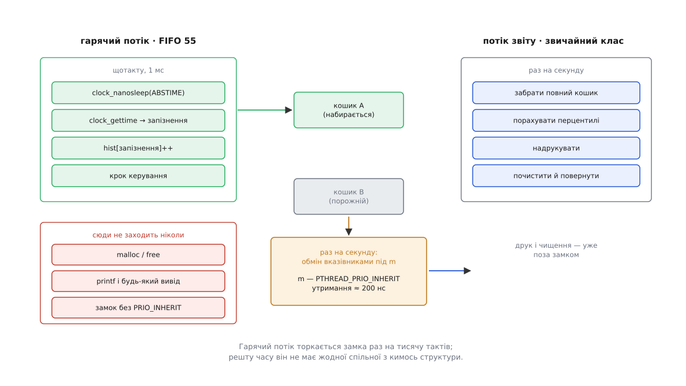
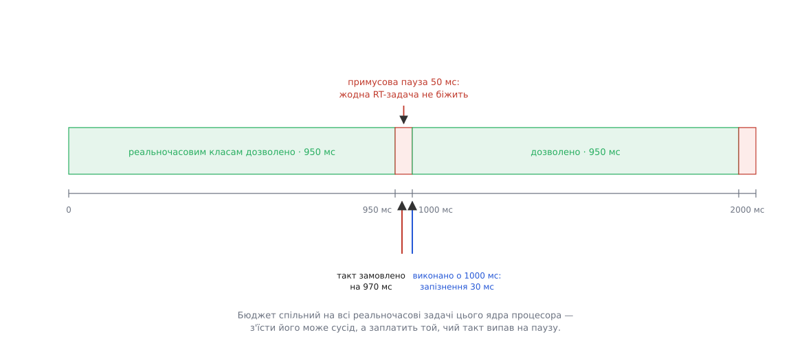

# ⚙️ Реальночасовий цикл, який справді встигає

Це готова програма на C — періодичний контур керування на 1 кГц, доведений до пуску на ядрі з `PREEMPT_RT`, тобто до стану, коли кожну затримку в ньому можна назвати на ім'я. Ядро вже прибрало своє джерело затримки й на цьому свою частину роботи закінчило; усе, що лишилося після нього, живе у прикладній програмі — і саме це «усе» тут зібрано в один файл.

## Задача

Привід, який треба тримати в заданій точці. Раз на мілісекунду програма читає положення, рахує поправку й віддає її пристроєві. Умова успіху сформульована не через середнє, а через межу: **жодне пробудження не сміє запізнитися більш ніж на 100 мкс**. Далі поправка приходить не в ту фазу й контур починає розгойдувати сам себе. Машина при цьому не порожня — на ній живуть звичайні задачі, і саме через них уся ця робота взагалі має зміст.

Другий потік програмі теж потрібен: хтось мусить рахувати статистику й друкувати її. Реальночасовим він не є й бути не мусить; уся хитрість — як передати йому дані, не зашкодивши першому.

## Чотири способи стати не готовим

`PREEMPT_RT` дає таку гарантію: у системі не лишилося споживача процесора без числа. Це твердження про ядро, а не про вашу програму. Планувальник вибирає лише **серед готових** задач — і найважливіша задача системи все ще може перестати бути готовою, а тоді її число нікого ні до чого не зобов'язує.

Способів рівно чотири, і кожен закривається кількома рядками коду.

Задача **впирається в сторінку**, якої ще немає: сторінковий збій — це робота ядра від імені вашої задачі, і поки ядро її робить, задача не готова ([сторінковий збій](book:unix-linux/page-fault) — звернення до ще не заселеної сторінки перериває виконання й змушує ядро знайти й підставити фізичну сторінку). Задача **засинає на замку**, власник якого має менше число: інверсію пріоритетів у ядрі полагодили, а у вашому власному м'ютексі ніхто не лагодив. Задача **накопичує дрейф** — прокидається пізніше не тому, що ядро спізнилося, а тому, що вона сама попросила пізніший момент. І задача **впирається в запобіжник ядра**, який стежить саме за реальночасовими класами й сам їх спиняє.

## Під ким саме стояти

Число, яке ви собі берете, під `PREEMPT_RT` уперше має сенс порівнювати з числом переривання: обробники тут — звичайні потоки класу `SCHED_FIFO`, типово з пріоритетом 50. Дані з вашого приводу приносить один із них. Поставите собі 99 — станете вище за того, хто вас годує: керуючий цикл прокинеться вчасно й побачить старі дані, бо потік переривання не дістав процесора, доки ви рахували.

Тому пріоритет не вибирають, а вимірюють — у самої системи:

```c
/* Пріоритет потоку переривання, у назві якого є needle («eth0», «xhci»).
 * Потоки ядра видно в /proc як звичайні задачі, тож sched_getparam працює. */
static int irq_thread_prio(const char *needle)
{
    DIR *d = opendir("/proc");
    struct dirent *e;
    char path[64], comm[128];
    int found = -1;

    if (!d) return -1;
    while ((e = readdir(d)) != NULL) {
        FILE *f;
        if (e->d_name[0] < '0' || e->d_name[0] > '9') continue;
        snprintf(path, sizeof path, "/proc/%s/comm", e->d_name);
        if (!(f = fopen(path, "r"))) continue;
        if (fgets(comm, sizeof comm, f) && strncmp(comm, "irq/", 4) == 0
                                        && strstr(comm, needle) != NULL) {
            pid_t pid = (pid_t)strtol(e->d_name, NULL, 10);
            struct sched_param p;
            if (sched_getscheduler(pid) == SCHED_FIFO && sched_getparam(pid, &p) == 0)
                found = p.sched_priority;
        }
        fclose(f);
    }
    closedir(d);
    return found;                 /* −1: ядро без RT або переривання не в потоці */
}
```

Далі програма ставить собі число **на одиницю менше** знайденого й відмовляється стартувати, якщо не знайшла нічого. Відмова тут корисніша за здогад: повернене `-1` означає або звичайне ядро без примусової потоковості переривань, або що ви помилилися в назві пристрою, — і в обох випадках мовчазний запуск дав би загадкові затримки в бою замість чесної помилки на старті.

> 🔧 **Навіщо це.** Розкладка чисел — не властивість програми, а властивість машини, тож програма її не встановлює, а перевіряє. Робоча розкладка проста: потік переривання вашого пристрою вище за ваш цикл, ваш цикл вище за все інше реальночасове, потоки сторонніх пристроїв нижче за все. Ставлять її під час налаштування системи (`chrt -f -p 60 <pid потоку irq>`), а програма лише переконується, що не опинилася зверху над власним джерелом даних.

## Замок, який беруть раз на секунду

Гарячий цикл не має права ділити з кимось жодну структуру — і не ділить. Гістограма запізнень набирається у власний кошик, до якого більше ніхто не торкається. Але раз на секунду накопичене треба комусь віддати, і в цю мить два потоки мусять домовитися.

Домовляються найдешевшим способом: кошиків два, і обмін — це обмін вказівниками. Гарячий потік під замком віддає повний кошик і бере порожній; потік звіту під тим самим замком забирає повний, а рахує перцентилі й друкує вже поза замком, бо забраний кошик належить тільки йому.



*Замок стоїть на межі між потоками й тримається лише стільки, скільки триває присвоєння двох вказівників; уся довга робота — друк, чищення, перцентилі — уже поза ним.*

Утримання виходить наносекунд двісті, і саме тут з'являється спокуса сказати: двісті наносекунд — то й хай собі, звичайного м'ютекса вистачить. Спокуса хибна, і хибна вона рівно тим, чим взагалі відрізняється реальний час від швидкодії.

**Замок беруть раз на секунду, тримають 200 нс; потік звіту — звичайного класу на завантаженій машині, де його знімають з процесора приблизно раз на 4 мс.**

```
імовірність, що власника знімуть саме всередині утримання
    p ≈ 200 нс / 4 мс                    = 5·10⁻⁵
взять за добу                            = 86 400
таких випадків за добу                   = 86 400 · 5·10⁻⁵ ≈ 4

ціна одного випадку без успадкування:
    гарячий потік чекає, доки власник знову дістане процесор
    ≈ квант чужої задачі                 ≈ 4 мс  (у 40 разів більше за бюджет)
з успадкуванням: власник не втрачає процесора взагалі
    гарячий потік чекає                  ≈ 200 нс
```

Чотири рази на добу — це і є форма найгіршого випадку: подія рідкісна, а ціна її не обмежена нічим. `PTHREAD_PRIO_INHERIT` перетворює її на ніщо: за стандартом власник такого м'ютекса виконується з пріоритетом найвищого з тих, хто на нього чекає, тож момент, коли гарячий потік заснув, є моментом, коли потік звіту дістає його число й добігає до `unlock` без зупинок ([інверсія пріоритетів](book:programming/priority-inversion) — важлива задача чекає на замок у руках неважливої, а між ними встигає побігати третя, ні до чого не причетна). Механізм цей не належить `PREEMPT_RT` — успадкування для м'ютексів простору користувача робить `futex` на будь-якому ядрі ([eventfd і futex](book:unix-linux/eventfd-and-futex) — дешеве очікування, яке заходить у ядро лише тоді, коли справді доводиться спати). Просто на реальночасовому ядрі це стає найвищим, що лишилося у вашій програмі, — усе нижче за нього вже прибрано.

## Програма

```c
/* rtapp.c — періодичний контур керування 1 кГц під PREEMPT_RT.
 * gcc -O2 -Wall -pthread -Wl,-z,now -o rtapp rtapp.c                        */
#define _GNU_SOURCE
#include <dirent.h>
#include <errno.h>
#include <malloc.h>
#include <pthread.h>
#include <sched.h>
#include <stdint.h>
#include <stdio.h>
#include <stdlib.h>
#include <string.h>
#include <sys/mman.h>
#include <time.h>
#include <unistd.h>

#define PERIOD_NS   1000000L                 /* 1 кГц                        */
#define ROTATE      1000                     /* обмін кошиками раз на секунду */
#define BUCKETS     2048                     /* кошики по 1 мкс              */
#define STACK_WARM  (256 * 1024)
#define HEAP_WARM   (4 * 1024 * 1024)

struct bin {
    uint32_t hist[BUCKETS];
    uint64_t n, sum_ns, worst_ns, overrun;
};

static struct bin       bins[2];
static struct bin      *hot   = &bins[0];    /* пише лише гарячий потік      */
static struct bin      *ready = NULL;        /* повний, чекає на звіт        */
static struct bin      *spare = &bins[1];    /* порожній, чекає на обмін     */
static pthread_mutex_t  m;                   /* PTHREAD_PRIO_INHERIT         */
static int              rt_prio;

static int irq_thread_prio(const char *needle);      /* тіло — у фрагменті вище */

static inline uint64_t ns_of(const struct timespec *t)
{
    return (uint64_t)t->tv_sec * 1000000000ULL + (uint64_t)t->tv_nsec;
}

static inline void ts_add_ns(struct timespec *t, long ns)
{
    t->tv_nsec += ns;
    while (t->tv_nsec >= 1000000000L) { t->tv_nsec -= 1000000000L; t->tv_sec++; }
}

/* Стек ЦЬОГО потоку заселяється ліниво — заходимо вглиб і торкаємось усього.
 * volatile — щоб оптимізатор не викинув запис у масив, який ніде не читають. */
static void warm_stack(void)
{
    volatile unsigned char deep[STACK_WARM];
    long page = sysconf(_SC_PAGESIZE);
    size_t i;
    for (i = 0; i < STACK_WARM; i += (size_t)page) deep[i] = 0;
}

static void control_step(uint64_t k, volatile double *out)
{
    double x = 1.0 + (double)(k & 0xff);     /* тут була б справжня поправка  */
    int i;
    for (i = 0; i < 400; i++) x = x * 1.0000001 + 1e-9;
    *out = x;
}

static void *rt_loop(void *unused)
{
    struct sched_param param = { .sched_priority = rt_prio };
    struct timespec next, woke;
    volatile double out = 0.0;
    uint64_t k;

    (void)unused;
    if (sched_setscheduler(0, SCHED_FIFO, &param) != 0) {   /* 0 — цей потік  */
        perror("sched_setscheduler");
        exit(1);
    }
    warm_stack();

    clock_gettime(CLOCK_MONOTONIC, &next);
    ts_add_ns(&next, PERIOD_NS);

    for (k = 0; ; k++) {
        int rc;
        int64_t late;
        size_t b;

        do {
            rc = clock_nanosleep(CLOCK_MONOTONIC, TIMER_ABSTIME, &next, NULL);
        } while (rc == EINTR);               /* сам не перезапуститься        */
        if (rc != 0) break;

        clock_gettime(CLOCK_MONOTONIC, &woke);
        late = (int64_t)(ns_of(&woke) - ns_of(&next));
        if (late < 0) late = 0;

        b = (size_t)(late / 1000);
        if (b >= BUCKETS) b = BUCKETS - 1;
        hot->hist[b]++;
        hot->sum_ns += (uint64_t)late;
        hot->n++;
        if ((uint64_t)late > hot->worst_ns) hot->worst_ns = (uint64_t)late;
        if (late >= PERIOD_NS) hot->overrun++;            /* такт пропущено   */

        control_step(k, &out);

        if ((k + 1) % ROTATE == 0) {         /* єдиний дотик до спільного     */
            pthread_mutex_lock(&m);
            if (spare != NULL) { ready = hot; hot = spare; spare = NULL; }
            pthread_mutex_unlock(&m);
        }
        ts_add_ns(&next, PERIOD_NS);         /* сітка, а не «ще мілісекунда»  */
    }
    return NULL;
}

static void report(const struct bin *b)
{
    uint64_t seen = 0, p99 = 0, p9999 = 0;
    size_t i;

    if (b->n == 0) return;
    for (i = 0; i < BUCKETS; i++) {
        seen += b->hist[i];
        if (!p99   && seen * 100ULL   >= b->n * 99ULL)   p99   = i + 1;
        if (!p9999 && seen * 10000ULL >= b->n * 9999ULL) p9999 = i + 1;
    }
    printf("n=%llu  сер=%.1f  p99=%llu  p99.99=%llu  макс=%.1f мкс  пропущено=%llu\n",
           (unsigned long long)b->n, b->sum_ns / 1000.0 / b->n,
           (unsigned long long)p99, (unsigned long long)p9999,
           b->worst_ns / 1000.0, (unsigned long long)b->overrun);
    fflush(stdout);
}

static void *reporter(void *unused)
{
    (void)unused;
    for (;;) {
        struct bin *b;
        sleep(1);

        pthread_mutex_lock(&m);
        b = ready; ready = NULL;
        pthread_mutex_unlock(&m);

        if (b == NULL) continue;
        report(b);                            /* друк — уже поза замком       */
        memset(b, 0, sizeof *b);
        pthread_mutex_lock(&m);
        spare = b;
        pthread_mutex_unlock(&m);
    }
    return NULL;
}

static void warn_throttling(void)
{
    long long runtime = -1, period = 1000000;
    FILE *f;
    if ((f = fopen("/proc/sys/kernel/sched_rt_runtime_us", "r")) != NULL) {
        if (fscanf(f, "%lld", &runtime) != 1) runtime = -1;
        fclose(f);
    }
    if ((f = fopen("/proc/sys/kernel/sched_rt_period_us", "r")) != NULL) {
        if (fscanf(f, "%lld", &period) != 1) period = 1000000;
        fclose(f);
    }
    if (runtime >= 0)
        fprintf(stderr, "запобіжник живий: %lld мкс із %lld — за їх вичерпання "
                        "буде примусова пауза %lld мкс\n",
                runtime, period, period - runtime);
}

int main(int argc, char **argv)
{
    pthread_mutexattr_t ma;
    pthread_attr_t      ta;
    pthread_t           th_rt, th_rep;
    const char         *device = (argc > 1) ? argv[1] : "eth0";
    void               *warm;
    int                 irq_prio;

    irq_prio = irq_thread_prio(device);
    if (irq_prio < 0) {
        fprintf(stderr, "потоку irq/*%s* не знайдено: ядро без PREEMPT_RT "
                        "або хибна назва пристрою\n", device);
        return 1;
    }
    rt_prio = irq_prio - 1;                  /* свідомо ПІД своїм джерелом    */
    fprintf(stderr, "irq/%s має %d, цикл бере %d\n", device, irq_prio, rt_prio);
    warn_throttling();

    if (mlockall(MCL_CURRENT | MCL_FUTURE) != 0) { perror("mlockall"); return 1; }
    mallopt(M_TRIM_THRESHOLD, -1);           /* не віддавати звільнене ядру   */
    mallopt(M_MMAP_MAX, 0);                  /* не брати великі шматки mmap-ом */
    if ((warm = malloc(HEAP_WARM)) != NULL) { memset(warm, 0, HEAP_WARM); free(warm); }
    memset(bins, 0, sizeof bins);            /* торкаємось обох кошиків       */

    pthread_mutexattr_init(&ma);
    if (pthread_mutexattr_setprotocol(&ma, PTHREAD_PRIO_INHERIT) != 0) {
        fprintf(stderr, "успадкування пріоритету недоступне\n");
        return 1;
    }
    pthread_mutex_init(&m, &ma);

    pthread_attr_init(&ta);
    pthread_attr_setstacksize(&ta, STACK_WARM + 128 * 1024);
    pthread_create(&th_rt, &ta, rt_loop, NULL);
    pthread_create(&th_rep, NULL, reporter, NULL);   /* лишається звичайним   */
    pthread_join(th_rt, NULL);
    return 0;
}
```

## Запуск

```sh
uname -a | grep -q PREEMPT_RT || echo 'ядро не реальночасове'
ps -eo pid,class,rtprio,comm | grep '^ *[0-9]* FF'   # хто які числа має

gcc -O2 -Wall -pthread -Wl,-z,now -o rtapp rtapp.c
sudo setcap cap_sys_nice,cap_ipc_lock+ep ./rtapp    # клас RT і прибивання пам'яті

taskset -c 3 ./rtapp eth0 &
stress-ng --cpu 8 --io 4 --vm 2 --timeout 300s      # без навантаження міряти нічого
```

Дві останні команди йдуть разом невипадково. Запізнення пробудження — це те, що станеться, **коли ядро зайняте чимось іншим**; на порожній машині ви зміряєте ідеальні умови, яких у бою не буде. І прив'язка до одного ядра теж не декорація: доки ядро процесора не відрізане від загального планування, ваш цикл ділить його з ким завгодно ([ізоляція ядер процесора](book:unix-linux/cpu-isolation), [прив'язка задач до ядер](book:unix-linux/cpu-affinity)).

## Пастки

**Запобіжник спрацьовує тоді, коли все нарешті працює.** Ядро віддає реальночасовим класам 950 мс із кожної секунди — і рахує цей бюджет спільно для всіх реальночасових задач ядра процесора, а не для кожної задачі окремо. Правильний періодичний цикл у цю межу не впирається, бо більшу частину періоду спить. Впираються в неї троє: цикл, у якого робота розрослася майже на весь період; цикл, який замість `clock_nanosleep` чекає крутінням; і — найпідступніше — ваш цикл поруч із чужою реальночасовою задачею, яка з'їла спільний бюджет. Заплатить той, чий такт випав на паузу.



*Пауза не розтягує ваш період на 50 мс — вона зсуває один такт; але для контуру з бюджетом 100 мкс це відмова, а не затримка.*

Вимикається запобіжник записом `-1` у `sched_rt_runtime_us`, і разом із ним зникає єдина сітка, що ловить зациклену реальночасову задачу. Хто його вимикає, той натомість ставить `RLIMIT_RTTIME`: ліміт на безперервний час у класі RT, за перевищення якого задачу вб'ють сигналом ([ліміти ресурсів](book:unix-linux/resource-limits)).

**`printf` у гарячому циклі — не повільність, а інверсія.** Він бере блокування потоку виводу, і те блокування — звичайний внутрішній замок бібліотеки, **без** успадкування пріоритету. Якщо в цю мить його тримає звичайний потік, вас нічого не витягне: ви заснули на замку, який не вміє піднімати свого власника. Саме тому в програмі є другий потік, а не рядок `printf` у циклі.

**`MCL_FUTURE` не робить `malloc` у циклі безпечним.** Він лише переносить ціну: нове відображення заселяється не пізніше, а одразу — усередині самого виклику, який тепер триває сотні мікросекунд і бере блокування адресного простору. Пам'ять беруть до входу в цикл і не віддають ([прибивання пам'яті: mlock і сторінки, яких не можна віддати](book:unix-linux/memory-locking)). Тому й лічильник `overrun` у звіті — не прикраса: він рахує такти, які пропущено цілком, і будь-яке ненульове значення означає, що в циклі є затримка, довша за цілий період, — а перший підозрюваний тут саме взяття пам'яті.

**Клас ставлять потокові, а не програмі.** `sched_setscheduler(0, …)` діє на потік, що викликав, і в програмі це навмисно: реальночасовим стає лише `rt_loop`. Запустивши те саме через `chrt -f 55 ./rtapp`, ви зробите реальночасовими **обидва** потоки — і потік звіту почне друкувати з пріоритетом 55, витрачаючи на `printf` той самий спільний бюджет, який стереже запобіжник.

**Звичайне ядро не скаржиться.** `sched_setscheduler` успішно поверне нуль і на ньому: клас `SCHED_FIFO` існує всюди, змінюється лише те, наскільки він щось означає ([пріоритети, nice і реальночасові класи](book:unix-linux/priority-nice-realtime)). Тому підміну ловить не він, а перевірка на початку: якщо переривання не стали потоками, ядро інше — і числа з такого запуску нема з чим порівнювати.
