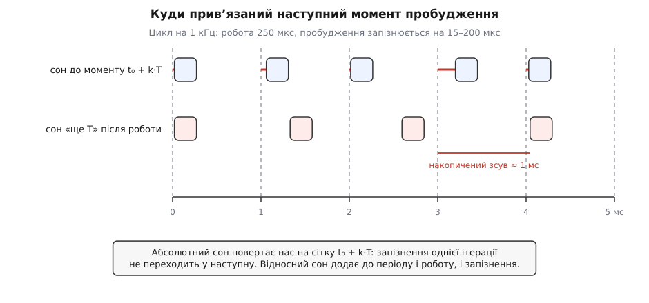
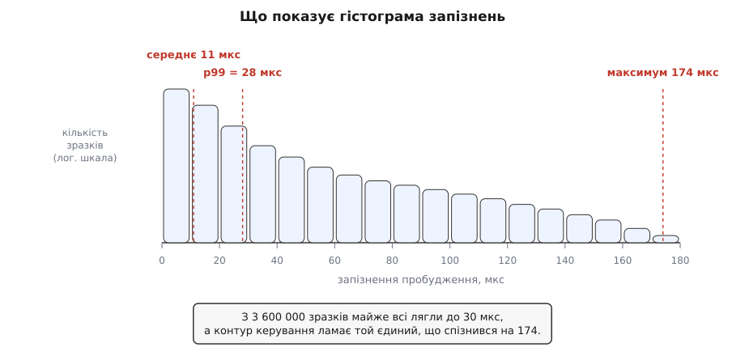

# ⚙️ Реальночасовий потік і вимірювання джитера

Ця програма на C створює періодичний потік на `SCHED_FIFO`, прибирає з-під нього все, що вміє несподівано затримати виконання, і — головне — сама міряє, наскільки пізно її будили. Без цього останнього числа реальночасове налаштування лишається вірою: пріоритет виставлено, а чи стало від нього краще, ніхто не знає. Усе нижче — Linux і glibc; сам цикл (`clock_nanosleep`, `pthread_attr_*`) — POSIX і працює й на інших системах, а `mallopt`, `RUSAGE_THREAD` та `/dev/cpu_dma_latency` — ні.

## Число, заради якого все затіяно

Домовмося точно, що саме міряємо, бо слово «джитер» (англ. *jitter* — тремтіння) вживають щонайменше в трьох значеннях.

Періодичний потік має розклад: моменти t₀, t₀+T, t₀+2T, … Ядру сказано розбудити потік у кожен із цих моментів. Прокидається він трохи пізніше. Різниця

```
запізнення_k = момент_фактичного_пробудження_k − (t₀ + k·T)
```

і є те число, яке ми збираємо. Воно **не** про те, скільки тривала корисна робота, і **не** про розкид тривалості роботи — це чиста плата за шлях від спрацювання апаратного таймера до першої інструкції вашого коду: переривання, пробудження задачі, рішення планувальника, перемикання контексту. Пріоритет впливає лише на цей відрізок, тож саме його треба виміряти, щоб зрозуміти, чи він щось дав.

Запізнення завжди додатне: ядро не будить раніше замовленого моменту. Тому питання не «наскільки точно», а «наскільки пізно в найгіршому випадку» — і відповіддю буде не одне число, а розподіл із довгим правим хвостом.

## Куди прив'язати наступне пробудження

Найпоширеніший спосіб зробити періодичний цикл — попрацювати й заснути «ще на мілісекунду». Він хибний, і хибний системно.

Поспати рівно T після роботи означає, що справжній період дорівнює T плюс тривалість роботи плюс запізнення пробудження. Кожна ітерація додає до розкладу власну похибку, і похибки не гасяться, а складаються одна з одною: цикл повільно, але невідворотно з'їжджає. За наведеними на рисунку числами — робота 250 мкс, запізнення пробудження від 15 до 200 мкс — уже четвертий такт приходить на цілий період пізніше за призначений.



*Один і той самий цикл на 1 кГц: угорі кожне пробудження замовлене від нерухомої сітки t₀+k·T, унизу — «ще T» після роботи; червоні риски перед блоками верхнього ряду — саме запізнення пробудження.*

Ліки — рахувати наступний момент **від нерухомої точки відліку**, а не від «зараз»: тримати змінну `next`, додавати до неї рівно T щоітерації й просити ядро спати **до** неї. Це `clock_nanosleep` із прапорцем `TIMER_ABSTIME`. Тоді запізнення однієї ітерації нікуди не переходить: наступний момент був обчислений заздалегідь і не зрушився. Довідкова сторінка каже про це прямо: абсолютний сон радять саме для того, щоб уникнути дрейфу таймера.

Годинник обов'язково `CLOCK_MONOTONIC`. `CLOCK_REALTIME` можуть підкрутити ззовні — і тоді ваш «наступний момент» опиниться в минулому або на пів секунди в майбутньому ([монотонний і настінний час](book:programming/monotonic-vs-wall-time) — настінний годинник показує дату й може стрибнути назад, монотонний лише рівномірно росте від старту й ні на що не реагує).

Одна пастка причаїлася в самому виклику: `clock_nanosleep` **ніколи** не перезапускається автоматично після сигналу, навіть якщо обробник поставлено з `SA_RESTART`. Він поверне `EINTR`, і продовжити сон — ваш обов'язок ([EINTR і перезапуск](book:unix-linux/eintr-and-restart) — перерваний сигналом виклик повертає помилку замість результату, і кожен такий виклик треба або повторювати самому, або знати, що ядро повторить його за вас). З `TIMER_ABSTIME` це тривіально: момент абсолютний, тож повторний виклик із тим самим `next` доспить рівно те, що лишилося.

## Що прибрати з-під потоку до першої ітерації

Пріоритет ставить вашу задачу першою в черзі готових. Він нічим не допоможе, якщо задача **не готова** — якщо вона застрягла в ядрі на чомусь власному. Кілька таких причин прибираються повністю, і всі — до початку циклу.

**Сторінкові збої.** Пам'ять процесу існує ліниво: сторінка з'являється тоді, коли до неї вперше торкнулися, і поява коштує входу в ядро, а іноді й читання з диска ([сторінковий збій](book:unix-linux/page-fault) — звернення до ще не заселеної сторінки перериває виконання й змушує ядро знайти й підставити фізичну сторінку). Усередині реальночасового циклу це катастрофа рівно тому, що трапляється рідко й непередбачувано. `mlockall(MCL_CURRENT | MCL_FUTURE)` прибиває наявні сторінки до фізичної пам'яті й вимагає заселяти майбутні одразу при відображенні.

**Робота алокатора.** `mlockall` не рятує від самого malloc: той бере пам'ять у ядра через `brk` і `mmap`, а звільнену — повертає ([звідки алокатор бере пам'ять](book:unix-linux/allocator-and-kernel) — купа росте зверненнями до ядра, і кожне таке звернення непередбачуване за часом). Два виклики `mallopt` вимикають обидва напрямки руху: `M_TRIM_THRESHOLD` зі значенням −1 забороняє віддавати звільнене назад, `M_MMAP_MAX` із нулем — брати великі шматки окремими відображеннями. Купа перестає дихати, і все, що ви взяли до циклу, лишається вашим.

**Стек, якого ще немає.** Стек потоку теж заселяється ліниво, і незвично глибокий ланцюг викликів усередині циклу спричинить збій у найневдаліший момент. Тому стек «прогрівають»: заходять углиб на завідомо достатню глибину й торкаються кожної сторінки. Тут ховається помилка, яку роблять майже всі: **прогрівати треба стек того потоку, який працюватиме**, а не той, з якого ви його створили. Кожен потік має власний стек, і прогрів у `main` для реальночасового потоку не означає нічого.

Четверта річ — не пам'ять, а ліниве зв'язування символів. Перший виклик функції зі спільної бібліотеки проходить через розв'язувач динамічного завантажувача ([PLT і GOT](book:unix-linux/plt-and-got) — виклик через межу бібліотеки типово йде в заглушку, яка при першому проході питає адресу в завантажувача й лише потім записує її в таблицю). Якщо цей перший виклик трапиться в циклі, ви отримаєте одиничний сплеск на кілька мікросекунд і будете шукати його місяць. Лікується прапорцем компонувальника `-Wl,-z,now`.

## Програма

:::tabs
```c
/* rtloop.c — періодичний потік на SCHED_FIFO з вимірюванням запізнення.
 * gcc -O2 -Wall -pthread -Wl,-z,now -o rtloop rtloop.c                     */
#define _GNU_SOURCE
#include <errno.h>
#include <fcntl.h>
#include <malloc.h>
#include <pthread.h>
#include <sched.h>
#include <stdint.h>
#include <stdio.h>
#include <stdlib.h>
#include <string.h>
#include <sys/mman.h>
#include <sys/resource.h>
#include <time.h>
#include <unistd.h>

#define PERIOD_NS    1000000L                /* 1 кГц                        */
#define RUN_SECONDS  60                      /* для серйозного виміру — години */
#define ITERATIONS   ((uint64_t)RUN_SECONDS * 1000000000ULL / PERIOD_NS)
#define RT_PRIORITY  60
#define STACK_BYTES  (512 * 1024)
#define PREFAULT     (256 * 1024)
#define BUCKETS      2000                    /* кошики по 1 мкс, стеля 2 мс   */

struct stats {
    uint32_t hist[BUCKETS];
    uint64_t samples, sum_ns, worst_ns;
    long     minflt_before, minflt_after;
};

static inline uint64_t ns_of(const struct timespec *t)
{
    return (uint64_t)t->tv_sec * 1000000000ULL + (uint64_t)t->tv_nsec;
}

static inline void ts_add_ns(struct timespec *t, long ns)
{
    t->tv_nsec += ns;
    while (t->tv_nsec >= 1000000000L) { t->tv_nsec -= 1000000000L; t->tv_sec++; }
}

/* Заходимо вглиб стека й торкаємось кожної сторінки. volatile — щоб
 * оптимізатор не викинув запис у масив, який більше ніде не читають.       */
static void prefault_stack(void)
{
    volatile unsigned char deep[PREFAULT];
    long page = sysconf(_SC_PAGESIZE);
    for (size_t i = 0; i < PREFAULT; i += (size_t)page)
        deep[i] = 0;
}

/* Поки цей дескриптор відкритий, ядро не пускає процесори в глибокий сон.
 * Закриття скасовує прохання, тому дескриптор НЕ закриваємо.               */
static int deny_deep_idle(void)
{
    int32_t target_us = 0;
    int fd = open("/dev/cpu_dma_latency", O_WRONLY);
    if (fd >= 0 && write(fd, &target_us, sizeof target_us) != sizeof target_us) {
        close(fd);
        fd = -1;
    }
    return fd;
}

static void payload(uint64_t k, volatile double *sink)
{
    double x = 1.0 + (double)(k & 0xff);
    for (int i = 0; i < 400; i++) x = x * 1.0000001 + 1e-9;
    *sink = x;                               /* тут була б корисна робота     */
}

static void *rt_loop(void *arg)
{
    struct stats *st = arg;
    struct timespec next, woke;
    struct rusage  ru;
    volatile double sink = 0.0;

    prefault_stack();                        /* стек ЦЬОГО потоку            */

    getrusage(RUSAGE_THREAD, &ru);
    st->minflt_before = ru.ru_minflt;

    clock_gettime(CLOCK_MONOTONIC, &next);
    ts_add_ns(&next, PERIOD_NS);

    for (uint64_t k = 0; k < ITERATIONS; k++) {
        int rc;
        do {
            rc = clock_nanosleep(CLOCK_MONOTONIC, TIMER_ABSTIME, &next, NULL);
        } while (rc == EINTR);               /* сам не перезапуститься       */
        if (rc != 0) break;

        clock_gettime(CLOCK_MONOTONIC, &woke);

        int64_t late = (int64_t)(ns_of(&woke) - ns_of(&next));
        if (late < 0) late = 0;

        size_t b = (size_t)(late / 1000);
        if (b >= BUCKETS) b = BUCKETS - 1;
        st->hist[b]++;
        st->sum_ns += (uint64_t)late;
        if ((uint64_t)late > st->worst_ns) st->worst_ns = (uint64_t)late;
        st->samples++;

        payload(k, &sink);

        ts_add_ns(&next, PERIOD_NS);         /* сітка, а не «від зараз»      */
    }

    getrusage(RUSAGE_THREAD, &ru);
    st->minflt_after = ru.ru_minflt;
    return NULL;
}

static void report(const struct stats *st)
{
    uint64_t seen = 0, p99 = 0, p9999 = 0;

    if (st->samples == 0) { printf("жодного зразка\n"); return; }

    for (size_t b = 0; b < BUCKETS; b++) {
        seen += st->hist[b];
        if (!p99   && seen * 100ULL   >= st->samples * 99ULL)   p99   = b + 1;
        if (!p9999 && seen * 10000ULL >= st->samples * 9999ULL) p9999 = b + 1;
    }
    printf("зразків          : %llu\n",      (unsigned long long)st->samples);
    printf("середнє          : %.1f мкс\n",  st->sum_ns / 1000.0 / st->samples);
    printf("p99              : %llu мкс\n",  (unsigned long long)p99);
    printf("p99.99           : %llu мкс\n",  (unsigned long long)p9999);
    printf("максимум         : %.1f мкс\n",  st->worst_ns / 1000.0);
    printf("сторінкових збоїв: %ld\n",       st->minflt_after - st->minflt_before);
}

int main(void)
{
    struct stats *st = malloc(sizeof *st);
    pthread_attr_t attr;
    struct sched_param param = { .sched_priority = RT_PRIORITY };
    pthread_t th;
    int rc;

    if (!st) return 1;
    memset(st, 0, sizeof *st);               /* торкаємось усіх сторінок     */

    if (mlockall(MCL_CURRENT | MCL_FUTURE) != 0) { perror("mlockall"); return 1; }
    mallopt(M_TRIM_THRESHOLD, -1);
    mallopt(M_MMAP_MAX, 0);
    deny_deep_idle();                        /* дескриптор лишається живим   */

    pthread_attr_init(&attr);
    pthread_attr_setstacksize(&attr, STACK_BYTES);
    pthread_attr_setschedpolicy(&attr, SCHED_FIFO);
    pthread_attr_setschedparam(&attr, &param);
    pthread_attr_setinheritsched(&attr, PTHREAD_EXPLICIT_SCHED);  /* без цього
                                   два попередні рядки не роблять нічого     */

    rc = pthread_create(&th, &attr, rt_loop, st);
    if (rc != 0) { fprintf(stderr, "pthread_create: %s\n", strerror(rc)); return 1; }

    pthread_join(th, NULL);
    report(st);
    return 0;
}
```

```cpp
/* rtloop.cpp — періодичний C++20 потік на SCHED_FIFO з вимірюванням запізнення.
 * g++ -O2 -Wall -std=c++20 -pthread -Wl,-z,now -o rtloop_cpp rtloop.cpp             */
#define _GNU_SOURCE
#include <chrono>
#include <cstdint>
#include <cstdio>
#include <iostream>
#include <memory>
#include <vector>
#include <thread>
#include <fcntl.h>
#include <malloc.h>
#include <pthread.h>
#include <sched.h>
#include <sys/mman.h>
#include <sys/resource.h>
#include <unistd.h>

constexpr std::chrono::nanoseconds PERIOD{1'000'000}; // 1 кГц
constexpr uint64_t RUN_SECONDS = 60;
constexpr uint64_t ITERATIONS = (RUN_SECONDS * 1'000'000'000ULL) / PERIOD.count();
constexpr int RT_PRIORITY = 60;
constexpr size_t STACK_BYTES = 512 * 1024;
constexpr size_t PREFAULT = 256 * 1024;
constexpr size_t BUCKETS = 2000;

struct Stats {
    std::vector<uint32_t> hist{std::vector<uint32_t>(BUCKETS, 0)};
    uint64_t samples{0}, sum_ns{0}, worst_ns{0};
    long minflt_before{0}, minflt_after{0};
};

static void prefault_stack() {
    volatile unsigned char deep[PREFAULT];
    long page = sysconf(_SC_PAGESIZE);
    for (size_t i = 0; i < PREFAULT; i += static_cast<size_t>(page))
        deep[i] = 0;
}

int main() {
    prefault_stack();
    if (mlockall(MCL_CURRENT | MCL_FUTURE) != 0) {
        std::perror("mlockall");
        std::cerr << "Попередження: запуск без CAP_IPC_LOCK\n";
    }

    auto stats = std::make_unique<Stats>();

    struct rusage ru;
    getrusage(RUSAGE_THREAD, &ru);
    stats->minflt_before = ru.ru_minflt;

    struct sched_param param{};
    param.sched_priority = RT_PRIORITY;
    if (pthread_setschedparam(pthread_self(), SCHED_FIFO, &param) != 0) {
        std::perror("pthread_setschedparam");
        std::cerr << "Помилка: потрібні CAP_SYS_NICE або запуск від root\n";
        return 1;
    }

    auto next = std::chrono::steady_clock::now() + PERIOD;

    for (uint64_t i = 0; i < ITERATIONS; ++i) {
        std::this_thread::sleep_until(next);
        auto now = std::chrono::steady_clock::now();

        if (now > next) {
            auto latency_ns = static_cast<uint64_t>(std::chrono::duration_cast<std::chrono::nanoseconds>(now - next).count());
            stats->samples++;
            stats->sum_ns += latency_ns;
            if (latency_ns > stats->worst_ns) stats->worst_ns = latency_ns;
            size_t bucket = latency_ns / 1000;
            if (bucket >= BUCKETS) bucket = BUCKETS - 1;
            stats->hist[bucket]++;
        }

        next += PERIOD;
    }

    getrusage(RUSAGE_THREAD, &ru);
    stats->minflt_after = ru.ru_minflt;

    std::cout << "Зразків: " << stats->samples << ", Середнє: " 
              << (stats->samples ? stats->sum_ns / stats->samples : 0) 
              << " нс, Найгірше: " << stats->worst_ns << " нс, Page faults: " 
              << (stats->minflt_after - stats->minflt_before) << "\n";

    return 0;
}
```
:::

Рядок `pthread_attr_setinheritsched(&attr, PTHREAD_EXPLICIT_SCHED)` — не формальність, а найдорожчий рядок у програмі. Типове значення атрибута — `PTHREAD_INHERIT_SCHED`: новий потік бере політику й пріоритет **у того, хто його створив**, а все, що ви записали в об'єкт атрибутів, ігнорується мовчки. Без цього рядка `pthread_create` успішно поверне нуль, потік запуститься зі звичайним `SCHED_OTHER`, програма надрукує гарні числа — і ці числа будуть про зовсім інший клас планування.

## Запуск

```sh
gcc -O2 -Wall -pthread -Wl,-z,now -o rtloop rtloop.c
sudo setcap cap_sys_nice,cap_ipc_lock+ep ./rtloop

taskset -c 3 ./rtloop &
stress-ng --cpu 8 --io 4 --vm 2 --timeout 70s
```

Потрібні дві можливості, а не одна: `cap_sys_nice` дозволяє взяти реальночасовий клас, `cap_ipc_lock` — прибити пам'ять понад ліміт `RLIMIT_MEMLOCK` (під systemd він типово 8 МБ, і серйозна програма в нього не влазить). Обидві дає й запуск від root, але точкові можливості чесніші за всесилля ([можливості замість root](book:unix-linux/capabilities) — права суперкористувача розрізано на десятки окремих дозволів, які видають програмі по одному).

`taskset -c 3` прив'язує потік до одного ядра ([прив'язка до процесорів](book:unix-linux/cpu-affinity) — маска дозволених ядер задачі; закріплення за одним ядром прибирає міграції й зберігає теплим його кеш). Друга команда — не декорація: **на порожній машині вимірювати нічого**. Запізнення пробудження — це те, що станеться, коли ядро зайняте чимось іншим, тож без навантаження ви міряєте ідеальні умови, яких у бою не буде.

## Що виходить із чисел



*Вертикальна шкала логарифмічна: майже всі зразки лежать у перших двох кошиках, а важить те, що видно лише на логарифмічній шкалі — поодинокі значення в кілька разів більші за середнє.*

Середнє в цій задачі — найменш корисне з усіх чисел, і його рахують радше для повноти. Реальночасова придатність визначається **найгіршим** випадком: якщо контур керування раз на годину запізнюється на 200 мкс і від цього ламається, то середні 11 мкс не рятують. Тому дивляться на максимум і на високі перцентилі — p99, p99.99, — які показують, де саме починається хвіст ([перцентилі й хвости](book:math/percentiles-quantiles) — перцентиль p відрізає значення, нижче за яке лежить p відсотків зразків; для рідкісних подій хвіст розподілу описує систему точніше за середнє).

Звідси випливає вимога до тривалості досліду. Подія «раз на мільйон» на частоті 1 кГц трапляється приблизно раз на 17 хвилин; щоб побачити її кілька разів і повірити числу, треба години. Шістдесят секунд у наведеному коді — це налагодження, а не вимір.

> 🔧 **Навіщо це.** Рядок «сторінкових збоїв» у звіті — не декорація, а перевірка чесності самої програми. Він рахує різницю `ru_minflt` до й після циклу, тобто скільки разів потік усе-таки спіткнувся об незаселену сторінку попри `mlockall`. Нуль означає, що пам'ять справді прибито. Будь-яке інше число означає, що всередині циклу хтось таки виділяє пам'ять — журнал, рядок, контейнер, який тихо виріс, — і саме там ховається ваш найгірший випадок.

## Ціна самого вимірювання

Вимірювання, яке коштує дорого, міряє себе. Тому обидві операції в гарячій частині обрано за принципом сталої ціни.

`clock_gettime(CLOCK_MONOTONIC, …)` на x86-64 — не системний виклик: ядро відображає в кожен процес маленьку бібліотеку, у якій ця функція виконується цілком у просторі користувача, читаючи лічильник процесора ([vDSO](book:unix-linux/vdso) — сторінка з кодом, яку ядро вкладає в адресний простір кожного процесу, щоб найчастіші «виклики» обходилися без переходу в ядро). Ціна — десятки наносекунд проти мікросекунди на повноцінний вхід у ядро.

Накопичення — гістограма фіксованого розміру: 2000 кошиків по чотири байти, разом 8 000 байтів, заселені до старту циклу. Одне ділення, одне порівняння, один інкремент — O(1) на зразок і нуль байтів нової пам'яті. Саме тому програма може працювати добу: обсяг пам'яті не залежить від кількості зразків.

Кошики по мікросекунді зі стелею 2 мс — компроміс: усе, що більше, потрапляє в останній кошик і перцентилі показують «≥ 2000», зате справжній максимум зберігається окремо в `worst_ns` і не губиться.

Порахувати перцентилі, надрукувати, зберегти у файл — усе це робиться **після** циклу. `printf` бере блокування потоку виводу, може виділити буфер і заблокуватися на терміналі; один такий виклик усередині ітерації додасть до вашої гістограми десятки мікросекунд власного походження. Якщо треба віддавати дані під час роботи, гаряча частина пише в заздалегідь виділений [кільцевий буфер](book:algorithms/ring-buffer) (масив фіксованого розміру з індексами читання й запису, що йдуть по колу; запис не блокується й не виділяє пам'яті), а звичайний потік із нижчим пріоритетом його вичитує.

## Пастки

**Пріоритет 99 — постріл собі в ногу.** На ядрі з набором PREEMPT_RT обробники переривань виконуються потоками, і типово це `SCHED_FIFO` із пріоритетом 50. Задача з пріоритетом 99, яка довго рахує, витіснить і їх — тобто саме ті потоки, що приносять їй дані з пристрою. Розумний вибір для прикладного циклу — трохи нижче за 50, а якщо вище, то з чітким розумінням, кого ви щойно відсунули.

**`std::thread` цього не вміє.** Стандарт C++ не має способу задати політику планування до старту потоку: об'єкт стартує вже виконуваним. Лишається `native_handle()` і `pthread_setschedparam` після створення — але між створенням і викликом потік уже виконував ваш код, і перші ітерації пройшли зі звичайним пріоритетом. Для реальночасового потоку лишається два чесні шляхи: `pthread_attr_t` із явними атрибутами, як вище, — або не створювати окремого потоку взагалі, і саме так зроблено у вкладці C++, де в `SCHED_FIFO` переводиться сам головний потік, і то ще до входу в цикл.

**Вимір без порівняння нічого не вартий.** Перший запуск робіть **без** реальночасового класу — просто закоментувавши три рядки атрибутів. Отримаєте базову лінію. Тоді ввімкніть їх і подивіться, що змінилося: якщо максимум не впав, то ваше вузьке місце — не планувальник, а щось із того, на що пріоритет не впливає ([витісненість ядра](book:unix-linux/kernel-preemption) — від конфігурації залежить, чи має право ядро спинити саме себе посеред довгої операції; у збірці без такого права задача чекатиме, хоч би який пріоритет мала).

**Те, що ви зміряли, — уся дорога.** Отримане число — сумарна затримка ланцюга «таймер → переривання → пробудження → планувальник → перемикання контексту → ваш код», а не властивість планувальника окремо. Змінити можна кожну ланку: конфігурацію витісненості, ізоляцію ядер, глибину енергозберігальних станів, частоту. Саме тому еталонний інструмент вимірювання — `cyclictest` із пакета rt-tests: за його довідковою сторінкою, написав його Томас Ґляйкснер, а далі підтримують розробники PREEMPT_RT; робить він той самий цикл, лише з набагато більшою кількістю режимів. Власна програма потрібна не замість нього, а щоб міряти **свій** цикл зі своїм навантаженням — бо ваша найгірша ітерація живе саме там, де ваш код, а не там, де порожній цикл еталона.
