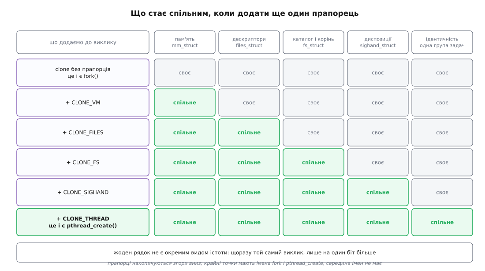
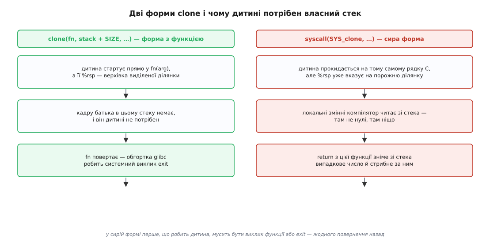

# ⚙️ clone() по одному прапорцю: дослід, що саме стало спільним

Беремо одну програму, один системний виклик — і вмикаємо в ньому по одному біту, щоразу міряючи п'ятьма зондами, що дитина тепер поділяє з батьком, а що має своє. На початку драбини стоїть звичайний процес, наприкінці — звичайний потік, а між ними лежать рядки, які не мають окремих назв, але цілком законні й працюють.

## Стенд: п'ять зондів на п'ять груп ресурсів

Дослід має сенс лише тоді, коли на кожну групу ресурсів є окреме питання з однозначною відповіддю. Питання ставимо не про структури ядра — їх зсередини програми не видно, — а про наслідки, які видно завжди:

```
що вмикаємо      зонд: дитина робить …            … а батько дивиться
CLONE_VM         пише 42 в глобальну змінну       чи змінилося значення
CLONE_FILES      закриває дескриптор батька       чи став дескриптор непридатним
CLONE_FS         робить chdir("/")                чи поїхав його поточний каталог
CLONE_SIGHAND    ставить обробник на SIGUSR1      чи з'явився обробник і в нього
CLONE_THREAD     каже свої getpid() і gettid()    чи збігся номер групи з його
```

Останній зонд подвійний навмисно. `getpid()` віддає не номер задачі, а номер **групи задач**, тож збіг цих номерів і означає «одна група»; окремий номер самої задачі показує `gettid()`, і він різний завжди — інакше це була б не нова задача.

Дитина звітує через канал, а не через пам'ять: половина дослідів іде без `CLONE_VM`, і жодна спільна змінна там не працює. Канал працює в обох випадках, бо навіть скопійована таблиця дескрипторів указує на ті самі відкриті файли — [опис відкритого файлу](topic:unix-linux/open-file-description) при цьому лишається один.

## Програма

```c
/* clone-flags.c — один виклик, різні набори бітів.
 *   gcc -O2 -Wall -o clone-flags clone-flags.c
 *   ./clone-flags                             нічого не вмикаємо: це fork()
 *   ./clone-flags vm files fs sighand thread  це pthread_create()
 * Запускати НЕ з кореня: зонд каталогу порівнює поточний каталог із "/".
 */
#define _GNU_SOURCE
#include <errno.h>
#include <fcntl.h>
#include <linux/futex.h>
#include <sched.h>
#include <signal.h>
#include <stdio.h>
#include <stdlib.h>
#include <string.h>
#include <sys/mount.h>
#include <sys/syscall.h>
#include <sys/wait.h>
#include <unistd.h>

#define STACK_SIZE (256 * 1024)

static volatile int probe_var;   /* зонд пам'яті: значення міняє інша задача */
static int probe_fd;             /* зонд дескрипторів: відкриває батько      */
static int report[2];            /* канал: ним дитина звітує в усіх випадках */
static int join_word;            /* futex-слово: ядро занулить його на смерті */
static int flags;

struct note { pid_t pid, tid; };

static void on_usr1(int s) { (void)s; }
static pid_t sys_gettid(void) { return (pid_t)syscall(SYS_gettid); }

/* Тіло дитини. Свідомо тримаємося найтонших обгорток libc: у цієї задачі
   немає власної пам'яті потоку, тож усе складніше за них тут ламається. */
static int child(void *arg)
{
    struct sigaction sa;
    struct note n;
    (void)arg;

    probe_var = 42;                        /* 1. пам'ять                  */
    close(probe_fd);                       /* 2. таблиця дескрипторів     */
    if (chdir("/") != 0) return 71;        /* 3. корінь і каталог         */

    memset(&sa, 0, sizeof sa);             /* 4. диспозиції сигналів      */
    sa.sa_handler = on_usr1;
    sigaction(SIGUSR1, &sa, NULL);

    if (flags & CLONE_NEWNS) {             /* окремий дослід: монтування  */
        mount(NULL, "/", NULL, MS_REC | MS_PRIVATE, NULL);
        mount("none", "/mnt", "tmpfs", 0, NULL);
        close(open("/mnt/marker", O_CREAT | O_WRONLY, 0600));
    }

    n.pid = getpid();                      /* 5. ідентичність             */
    n.tid = sys_gettid();
    write(report[1], &n, sizeof n);

    return 0;      /* обгортка glibc зробить SYS_exit — саме задачі, не групи */
}

/* Так само, і майже тим самим кодом, чекає pthread_join. */
static void join_task(void)
{
    int v;
    while ((v = __atomic_load_n(&join_word, __ATOMIC_ACQUIRE)) != 0)
        syscall(SYS_futex, &join_word, FUTEX_WAIT, v, NULL, NULL, 0);
}

static void line(const char *what, const char *seen, int shared)
{
    printf("%-14s %-38s %s\n", what, seen, shared ? "СПІЛЬНЕ" : "своє");
}

int main(int argc, char **argv)
{
    static const struct { const char *name; int bit; } TABLE[] = {
        { "vm",      CLONE_VM      }, { "files",  CLONE_FILES  },
        { "fs",      CLONE_FS      }, { "sighand", CLONE_SIGHAND },
        { "thread",  CLONE_THREAD  }, { "newns",  CLONE_NEWNS  },
        { "newpid",  CLONE_NEWPID  },
    };
    char cwd0[4096], cwd1[4096], b[192], *stack;
    struct sigaction seen;
    struct note n = { 0, 0 };
    int fd_alive, disp_moved;
    pid_t tid;

    for (int i = 1; i < argc; i++)
        for (unsigned j = 0; j < sizeof TABLE / sizeof *TABLE; j++)
            if (strcmp(argv[i], TABLE[j].name) == 0) flags |= TABLE[j].bit;

    getcwd(cwd0, sizeof cwd0);
    probe_fd = open("/dev/null", O_RDONLY);
    pipe(report);
    stack = malloc(STACK_SIZE);

    /* Молодший байт прапорців — сигнал смерті. У групі задач його не буває. */
    if (!(flags & CLONE_THREAD))
        tid = clone(child, stack + STACK_SIZE, flags | SIGCHLD, NULL);
    else
        tid = clone(child, stack + STACK_SIZE,
                    flags | CLONE_PARENT_SETTID | CLONE_CHILD_CLEARTID,
                    NULL, &join_word, NULL, &join_word);

    if (tid == -1) { perror("clone"); return 1; }

    if (flags & CLONE_THREAD) join_task();
    else                      waitpid(tid, NULL, 0);

    read(report[0], &n, sizeof n);
    getcwd(cwd1, sizeof cwd1);
    sigaction(SIGUSR1, NULL, &seen);
    fd_alive   = (fcntl(probe_fd, F_GETFD) != -1);
    disp_moved = (seen.sa_handler == on_usr1);

    snprintf(b, sizeof b, "глобальна змінна = %d", probe_var);
    line("пам'ять", b, probe_var == 42);

    snprintf(b, sizeof b, "fd %d %s", probe_fd,
             fd_alive ? "живий" : "закритий дитиною");
    line("дескриптори", b, !fd_alive);

    snprintf(b, sizeof b, "%s → %s", cwd0, cwd1);
    line("каталог", b, strcmp(cwd0, cwd1) != 0);

    snprintf(b, sizeof b, "SIGUSR1: %s",
             disp_moved ? "обробник дитини" : "типова дія");
    line("диспозиції", b, disp_moved);

    snprintf(b, sizeof b, "батько %d/%d, дитина %d/%d (clone дав %d)",
             getpid(), sys_gettid(), n.pid, n.tid, tid);
    line("ідентичність", b, n.pid == getpid());

    if (flags & CLONE_NEWNS)
        printf("%-14s %s\n", "монтування",
               access("/mnt/marker", F_OK) == 0
                   ? "tmpfs дитини ВИДНО з батька — монтування розповсюдилося"
                   : "tmpfs дитини не видно з батька — простір окремий");

    free(stack);
    return 0;
}
```

Три місця в цьому коді варті погляду ще до запуску.

**Дитина закінчується `return`, а не `_exit()`.** Це не стилістика. `_exit()` робить системний виклик `exit_group`, який убиває **всю** групу задач; у режимі `CLONE_THREAD` це вбило б і батька. Обгортка `clone()` у glibc, коли функція дитини повертає значення, робить інший виклик — `exit`, що завершує лише ту задачу, яка його зробила. Той самий поділ, що ховається за парою `pthread_exit()` та `exit()`.

**Чекання розгалужене на дві гілки.** Задачу, яку створено з `CLONE_THREAD`, `waitpid()` не бачить взагалі — повертає `ECHILD`. Тому там працює інший механізм: пара прапорців `CLONE_PARENT_SETTID` і `CLONE_CHILD_CLEARTID` каже ядру записати номер задачі в наше слово перед стартом і занулити його зі сплячим сповіщенням на смерті. Далі — звичайне очікування на [futex](topic:unix-linux/eventfd-and-futex), доки в слові не з'явиться нуль. Це буквально серцевина `pthread_join()`.

**Зонд пам'яті позначено `volatile`.** Значення в цю комірку кладе інша задача, і компілятор про це не знає.

## Драбина: додаємо по біту

```
$ cd ~ && ./clone-flags
пам'ять        глобальна змінна = 0                   своє
дескриптори    fd 3 живий                             своє
каталог        /home/u → /home/u                      своє
диспозиції     SIGUSR1: типова дія                    своє
ідентичність   батько 5312/5312, дитина 5313/5313 (clone дав 5313)   своє

$ ./clone-flags vm
пам'ять        глобальна змінна = 42                  СПІЛЬНЕ
    (решта рядків — «своє»)

$ ./clone-flags vm files
пам'ять        глобальна змінна = 42                  СПІЛЬНЕ
дескриптори    fd 3 закритий дитиною                  СПІЛЬНЕ

$ ./clone-flags vm files fs
каталог        /home/u → /                            СПІЛЬНЕ

$ ./clone-flags vm files fs sighand
диспозиції     SIGUSR1: обробник дитини               СПІЛЬНЕ

$ ./clone-flags vm files fs sighand thread
ідентичність   батько 5312/5312, дитина 5312/5319 (clone дав 5319)   СПІЛЬНЕ
```



*Верхній рядок ми звемо `fork()`, нижній — `pthread_create()`. Але це той самий виклик, і кожен проміжний рядок так само працює.*

Найцікавіше — останній рядок. `getpid()` у дитини повернув **той самий** номер, що й у батька, хоч `clone()` віддав батькові 5319. Суперечності немає: 5319 — це номер задачі, а `getpid()` віддає номер групи, до якої задача належить. Одна задача має два різні номери одночасно, і виклик, яким їх питають, вирішує, який саме ви побачите ([потоки в Linux: задача як одиниця планування](topic:unix-linux/threads-as-tasks)).

Другий висновок тихіший, але вагоміший. Жоден рядок таблиці не є «іншим видом істоти». Немає моменту, у якому програма перестала створювати процеси й почала створювати потоки, — є п'ять окремих вимикачів, і слова «процес» та «потік» просто позначають дві звичні комбінації їхніх положень.

## Чому прапорці не зовсім незалежні

Драбину ми проходили знизу вгору, додаючи по біту. Спробуймо тепер вмикати їх у довільному порядку:

```
$ ./clone-flags thread
clone: Invalid argument
$ ./clone-flags vm thread
clone: Invalid argument
$ ./clone-flags vm sighand thread          ← а ось так працює
$ ./clone-flags vm fs newns
clone: Invalid argument
$ ./clone-flags vm sighand thread newpid
clone: Invalid argument
```

Ядро відмовляє тут не з примхи. Кожна відмова — наслідок того, що дві групи ресурсів не мають самостійного змісту нарізно.

**`CLONE_SIGHAND` вимагає `CLONE_VM`.** Диспозиція сигналу — це адреса функції-обробника. Спільна таблиця адрес між задачами, які дивляться в різні відображення пам'яті, означала б, що за тим самим числом в одної задачі лежить обробник, а в іншої — будь-що. Ядро відмовляє прямо в `copy_process()` із коментарем «shared signal handlers imply shared VM».

**`CLONE_THREAD` вимагає `CLONE_SIGHAND`.** Група задач — це те, чому `kill(pid, SIGTERM)` убиває програму цілком, а не одну нитку. Щоб «сигнал надіслано групі» мало один сенс, у групі мусить бути одна відповідь на питання «що робити із SIGTERM». Дві задачі з різними таблицями диспозицій однією групою бути не можуть ([диспозиція сигналу](topic:unix-linux/signal-disposition)).

**`CLONE_NEWNS` не поєднується з `CLONE_FS`.** `fs_struct` містить корінь і поточний каталог. Новий простір монтувань — це інше дерево, у якому старий корінь може взагалі не існувати. Ділити з батьком запис «мій корінь ось тут», відгородившись від дерева, де це «тут» визначене, безглуздо, тож ядро відмовляє.

**`CLONE_THREAD` не поєднується з `CLONE_NEWPID`.** Група задач має один номер; номер існує в конкретному просторі імен. Задача, що живе в іншому просторі номерів, не може ділити номер із тими, хто лишився в старому.

Читається це все як одне правило: **прапорці незалежні рівно доти, доки незалежні самі поняття за ними.** Там, де одна група ресурсів визначена через іншу, ядро вимагає вмикати їх разом.

## `pthread_create()` — це той самий виклик

Тепер найпростіший спосіб у цьому переконатися: подивитися, що робить справжня бібліотека потоків. У glibc набір бітів записаний однією константою в `nptl/pthread_create.c`:

```c
const int clone_flags = (CLONE_VM | CLONE_FS | CLONE_FILES | CLONE_SYSVSEM
                       | CLONE_SIGHAND | CLONE_THREAD
                       | CLONE_SETTLS | CLONE_PARENT_SETTID
                       | CLONE_CHILD_CLEARTID
                       | 0);
```

П'ять із них — рівно наша драбина: `CLONE_VM`, `CLONE_FS`, `CLONE_FILES`, `CLONE_SIGHAND`, `CLONE_THREAD`. Решта — те, чого ручний дослід не робив:

- `CLONE_SYSVSEM` — спільні відкати семафорів System V, щоб вихід одного потоку не скасовував операції інших;
- `CLONE_SETTLS` — власна пам'ять потоку, про яку йтиметься нижче;
- `CLONE_PARENT_SETTID` і `CLONE_CHILD_CLEARTID` — те саме futex-слово, на якому тримається `pthread_join()`;
- `| 0` наприкінці — не окраса, а окремий запис: **сигналу смерті немає**. Молодший байт прапорців у старій формі виклику якраз ним і є, тож нуль тут промовистий.

Побачити виклик наживо можна [трасуванням](topic:unix-linux/syscall-tracing). Сучасна glibc іде вже через `clone3()`:

```
$ strace -f -e trace=clone,clone3 ./pthread-demo
clone3({flags=CLONE_VM|CLONE_FS|CLONE_FILES|CLONE_SIGHAND|CLONE_THREAD
        |CLONE_SYSVSEM|CLONE_SETTLS|CLONE_PARENT_SETTID|CLONE_CHILD_CLEARTID,
        child_tid=0x7f2c1e5fe990, parent_tid=0x7f2c1e5fe990, exit_signal=0,
        stack=0x7f2c1ddfe000, stack_size=0x7fff00, tls=0x7f2c1e5fe6c0}, 88)
        = 5319
```

Останнє число, 88, — розмір структури параметрів у байтах; про неї теж нижче.

> 🔧 **Навіщо це.** Драбина пояснює речі, які інакше доводиться просто запам'ятовувати. Чому потік не можна «вбити окремо» звичайним `kill` — бо номер, який ви йому даєте, адресує групу. Чому `chdir()` в одному потоці міняє каталог усій програмі — бо `CLONE_FS` у наборі є. Чому дитина після `fork()` не бачить, як батько закрив дескриптор, а сусідній потік бачить — бо `CLONE_FILES` у першому випадку немає, а в другому є. І чому контейнер — не «легкий віртуальний комп'ютер»: це той самий `clone()`, лише з іншим набором бітів у старшій частині прапорців.

## Ідентичність — не властивість задачі

Прапорці просторів імен стоять на іншій осі, ніж усі попередні. Ті питали «спільна структура чи своя»; ці питають «у якому наборі імен ти живеш». Різницю найпростіше побачити на номері. Потрібні права `CAP_SYS_ADMIN` — тобто зазвичай `sudo` ([можливості замість всесильного root](topic:unix-linux/capabilities)):

```
# ./clone-flags vm files newpid
ідентичність   батько 5312/5312, дитина 1/1 (clone дав 5320)   своє
```

Дитина щиро вважає себе процесом номер 1. Батько так само щиро бачить її під номером 5320. Обидва мають рацію: номер — властивість не задачі, а **пари** «задача плюс простір імен», з якого дивишся. Задача в новому просторі стає в ньому першою, тобто дістає всі обов'язки init: до неї перепідпорядковуються сироти, і її смерть убиває простір разом з усіма, хто в ньому лишився ([простори імен](topic:unix-linux/namespaces)).

Простір монтувань показує ту саму ідею з іншого боку — і водночас пастку, на яку натикаються майже всі:

```
# ./clone-flags vm files newns
монтування     tmpfs дитини не видно з батька — простір окремий
```

Рядок із `mount(NULL, "/", NULL, MS_REC | MS_PRIVATE, NULL)` у коді дитини поставлено не для краси. Приберіть його — і на будь-якій системі під systemd вивід зміниться на «ВИДНО»: systemd позначає корінь спільним для розповсюдження, новий простір успадковує цю позначку, і монтування, зроблене в «ізольованому» просторі, слухняно з'явиться в батька. Новий простір імен дає **копію** дерева монтувань, а не глуху стіну; наскільки вона глуха, вирішують позначки розповсюдження ([монтування й дерево монтувань](topic:unix-linux/mount-model)).

## Пастки ручного клонування

### Дитині потрібен власний стек — і повертатися їй нікуди

Обидві форми виклику вимагають ділянки пам'яті під стек, але поводяться з нею по-різному.



*Обгортка glibc робить дитині власний кадр і сама завершує задачу, коли функція повертає. Сирий системний виклик не робить нічого: дитина повертається з нього там само, де й батько, але з покажчиком стека, під яким немає ані її кадру, ані адреси повернення.*

Звідси три правила, кожне з яких коштує падіння.

**Стек передають з різних кінців у різних формах виклику.** Стара форма `clone()` чекає **найвищу** адресу ділянки — стеки під Linux ростуть униз на всіх процесорах, крім HP PA, тому в коді й стоїть `stack + STACK_SIZE`. А `clone3()` чекає **найнижчий** байт плюс окреме поле `stack_size`. Переписуючи код зі старої форми на нову «механічно», ви віддасте ядру вершину як основу, і дитина писатиме свій кадр повз усе.

**У сирій формі виклику дитині не можна повертатися.** `syscall(SYS_clone, …)` не має параметра-функції: дитина продовжує з наступної інструкції, як і батько, але її `%rsp` вказує на порожню ділянку. Локальних змінних там немає, адреси повернення теж — тож перший же `return` зніме зі стека випадкове число й стрибне за ним. Єдина припустима перша дія — виклик функції або негайний `exit`.

**Ділянка з `malloc` не має захисної сторінки.** Виділити стек купою можна, і всі приклади так і роблять заради стислості. Але справжній потік дістає стек через `mmap` із сусідньою сторінкою без жодних прав: [переповнення стека](topic:programming/stack-overflow) тоді впирається в неї й дає негайний збій. Стек із купи тихо переписує сусідні дані, і падіння станеться пізніше й в іншому місці.

### Пам'яті потоку немає, тож ламається libc

Це найпідступніша пастка, бо не дає ані помилки, ані падіння. Без `CLONE_SETTLS` нова задача успадковує від батька регістр, яким процесор адресує пам'ять потоку — на x86-64 це база `%fs`. Тобто дитина дивиться в **чужий** блок, батьків. А в цьому блоці лежить, серед іншого, `errno`:

```c
/* tls-trap.c — у ручного клона немає власної пам'яті потоку */
#define _GNU_SOURCE
#include <errno.h>
#include <sched.h>
#include <stdio.h>
#include <stdlib.h>
#include <string.h>
#include <unistd.h>
#include <sys/wait.h>

static int spoil(void *arg)
{
    (void)arg;
    close(-1);            /* завідомо провал: ядро віддасть EBADF */
    return 0;
}

int main(void)
{
    char *stack = malloc(64 * 1024);
    pid_t t;
    int e;

    errno = 0;
    t = clone(spoil, stack + 64 * 1024, CLONE_VM | SIGCHLD, NULL);
    waitpid(t, NULL, 0);
    e = errno;
    printf("errno у батька: %d (%s)\n", e, strerror(e));
    return 0;
}
```

```
$ ./tls-trap
errno у батька: 9 (Bad file descriptor)
```

Батько не робив жодного невдалого виклику — [код помилки](topic:programming/errno) йому записала чужа задача. Змінна `errno` в glibc оголошена як `__thread`, тобто [приватна для потоку](topic:cpp-standards/thread-local); приватність тут забезпечує саме окрема пам'ять потоку, якої в нашої дитини немає.

Далі те саме ламається дедалі тихіше й дедалі дорожче. У тому ж блоці живе кеш дрібних шматків пам'яті `malloc` — і дві задачі, кожна з яких упевнена, що кеш належить тільки їй, беруть і повертають блоки без жодного замка, доки купа не розсиплеться. Там же лежить дескриптор потоку, тож `pthread_self()` у дитини поверне значення батька. А глобальний прапорець `__libc_single_threaded`, за яким libstdc++ вирішує, чи можна рахувати посилання без атомарних операцій, переставляє в нуль саме `pthread_create()`; сирий `clone()` його не чіпає — і програма з двома задачами далі вважає себе однопотоковою.

Тому правило просте: якщо в новій задачі має працювати libc, її треба створювати через `pthread_create()`. Ручний `clone()` доречний там, де ви свідомо обходитеся без бібліотеки, — у реалізації самої бібліотеки потоків, у середовищах виконання зі своїм плануванням і в запускачах контейнерів.

### Сигнал смерті: кому й який

Молодший байт прапорців у старій формі — це номер сигналу, який ядро надішле батькові, коли дитина завершиться. Звідси три різні способи здивуватися.

**Забути `SIGCHLD`.** Дитина створиться, `waitpid()` її дочекається, але жодного сигналу не прийде. Програма, збудована навколо обробника `SIGCHLD`, просто ніколи не дізнається про смерть ([завершення, wait і зомбі](topic:unix-linux/exit-wait-zombies)).

**Поставити не той сигнал.** Байт приймає будь-який номер, а не тільки `SIGCHLD`. Написали `clone(…, CLONE_VM | SIGUSR1, …)` — і завершення дитини надішле батькові `SIGUSR1`, типова дія якого — убити отримувача. Батько тихо помре в момент, коли дитина відпрацювала успішно.

**Додати `CLONE_PARENT`.** Тоді батьком нової задачі стає не той, хто кликав, а **його** батько; сигнал смерті піде туди ж. Той, хто створив задачу, не дізнається про її кінець і не зможе на неї чекати.

І окремо — `CLONE_THREAD`: сигналу смерті там немає взагалі, ядро підставляє `−1` замість будь-якого вашого числа. Померлий потік не сповіщає нікого, і `wait()` його не бачить. Батьківський процес дістає `SIGCHLD` лише тоді, коли завершиться вся група.

### Дрібніші гострі кути

**`getpid()` колись брехав.** Від glibc 2.3.4 і аж до 2.24 обгортка кешувала номер, а виклики в обхід бібліотеки цей кеш не оновлювали — дитина ручного клона отримувала номер батька. Проблема зникла тільки в glibc 2.25, де кеш прибрали й `getpid()` завжди робить справжній системний виклик. На старіших системах дослід вище показав би неправду.

**Порядок аргументів сирого виклику залежить від архітектури.** На x86-64 це `clone(flags, stack, parent_tid, child_tid, tls)`, а на x86-32, ARM, AArch64, PowerPC, MIPS і ще кількох два останні аргументи стоять у зворотному порядку. Звична [угода про виклик](topic:programming/calling-convention) тут не рятує: порядок диктує не вона, а код ядра для конкретної архітектури. Саме тому сирий `clone` руками майже не пишуть.

## Чому `clone3()` зручніший

Стара форма впирається в те, з чого починалася: молодший байт прапорців зайнято під сигнал смерті. Тому простір прапорців для неї закінчився не фігурально, а буквально — `CLONE_NEWTIME`, прапорець простору імен часу, має значення `0x80`, тобто лежить усередині маски сигналу. Заголовок ядра каже про це прямо: такі прапорці «can be used with unshare and clone3 syscalls only». Тобто в старій формі цей біт неможливо навіть вимовити — його з'їсть маска сигналу. Сам `clone3()` теж довго відмовляв із `EINVAL` через перетин із маскою, і зайву перевірку зняли аж виправленням 2022 року (його завезли й у стабільні гілки), — до того новий простір часу справді створювало тільки `unshare()`.

`clone3()` (ядро 5.3) розв'язує це не хитрощами, а структурою параметрів:

```c
struct clone_args {
    __u64 flags;          /* 64 біти, ніяк не змішані із сигналом */
    __u64 pidfd;          /* сюди ядро покладе дескриптор на процес */
    __u64 child_tid;
    __u64 parent_tid;
    __u64 exit_signal;    /* окреме поле, а не молодший байт */
    __u64 stack;          /* НАЙНИЖЧИЙ байт ділянки */
    __u64 stack_size;
    __u64 tls;
    __u64 set_tid;        /* обрати номер у просторі імен (5.5) */
    __u64 set_tid_size;
    __u64 cgroup;         /* стартувати одразу в цій групі (5.7) */
};
```

Виграшів тут чотири, і всі практичні.

**Розмір структури передають окремим аргументом** — тим самим числом 88 із трасування вище. Тому нові поля додають без нового системного виклику: ядро бачить, скільки байтів ви знаєте, а решту вважає нулями.

**`exit_signal` став самостійним полем.** Заразом зникла ціла категорія помилок: `clone3()` просто відмовляє з `EINVAL`, якщо разом із `CLONE_THREAD` чи `CLONE_PARENT` вказано ненульовий сигнал, тоді як стара форма мовчки його викидала.

**Стек описано парою «основа плюс розмір».** Ядро саме рахує вершину, тож питання «з якого кінця» більше не стоїть.

**`CLONE_INTO_CGROUP` (5.7) створює задачу одразу в потрібній контрольній групі.** Раніше між появою задачі й переміщенням її в групу лишалася шпарина, за яку вона встигала витратити чужі ліміти. Так само `set_tid` (5.5) дає задати номер наперед — без цього неможливо відновити збережений стан процесу з тими самими номерами.

Ознака зрілості: glibc обгортки для `clone3()` не надає — його кличуть через `syscall()`. Усередині ж бібліотека сама йде цією дорогою, а на старе ядро відкочується до `clone()`. Саме тому в трасуванні звичайного `pthread_create()` ви побачите `clone3` — той самий один виклик, яким Linux створює все, що бігає.
