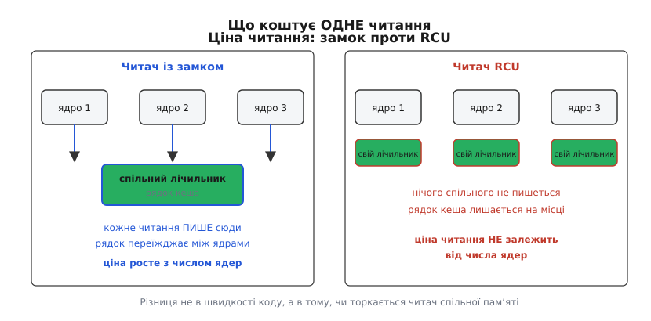
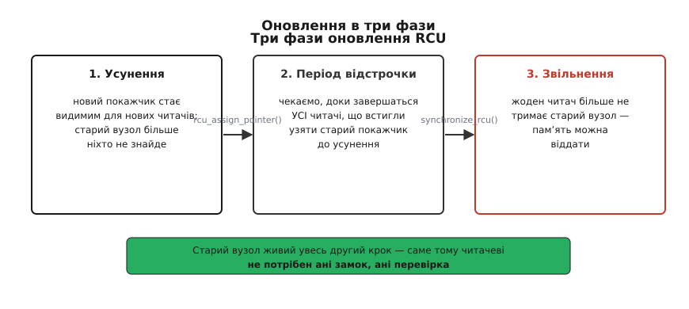
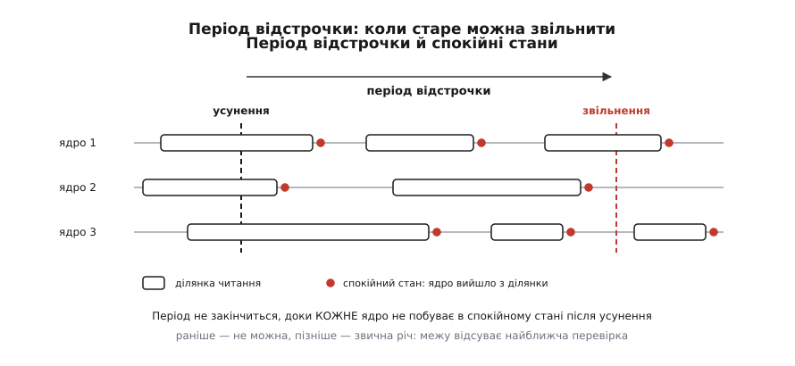

# RCU: читання без замків і відкладене звільнення

<preknowlist>
- [Перегони даних і замки](book:programming/data-races-locks) — двоє, що чіпають одну структуру водночас, псують її; замок робить ділянку неподільною для решти.
- [Багато читачів, один письменник](book:programming/readers-writer-lock) — замок, що пускає читачів гуртом, а письменника наодинці.
- [Когерентність кешів](book:programming/cache-coherence-protocol) — рядок кеша живе в одному ядрі процесора у виключному володінні, і передача володіння коштує часу.
- [Упорядкування пам'яті та бар'єри](book:programming/memory-ordering-barriers) — процесор і компілятор переставляють доступи до пам'яті, якщо між ними немає явної заборони.
- [Зв'язаний список](book:algorithms/linked-list) — вузли, зчеплені вказівниками; прохід — це послідовність переходів за `next`.
- [Використання після звільнення](book:programming/use-after-free) — звернення за вказівником на вже віддану пам'ять; наслідки непередбачувані.
- [Ядро й простір користувача](book:unix-linux/kernel-and-userspace) — код ядра виконується на тих самих процесорах, що й програми, і ядро одне на всі задачі.
- [Перемикання контексту](book:programming/context-switch) — зняти одну задачу з процесора й поставити туди іншу.
- [Витісненість ядра](book:unix-linux/kernel-preemption) — ядро дозволяє спинити себе не всюди; від конфігурації залежить, чи можна перемкнути задачу посеред коду ядра.
- [Замки в ядрі й атомарний контекст](book:unix-linux/kernel-locking) — вибір замка визначає не структура даних, а контекст: хто суперник і чи вільно тут засинати.
</preknowlist>

## Список, який читають мільйон разів на секунду

У ядрі є структури з абсурдно перекошеним режимом користування. Перелік мережевих інтерфейсів обходять щоразу, коли хтось шукає пристрій за індексом чи знімає статистику, — тисячі разів на секунду; змінюють, коли хтось увімкнув кабель, тобто раз на тиждень. Те саме співвідношення в таблиці маршрутів, у кеші каталогових записів, у списку завантажених модулів, у наборі правил фільтра: читань мільйони, змін одиниці.

Захистимо такий список найочевиднішим способом — замком, що пускає читачів гуртом:

```c
read_lock(&dev_lock);
list_for_each_entry(d, &dev_list, node)
    if (d->ifindex == idx)
        found = d;
read_unlock(&dev_lock);
```

Здається, читання тут безкоштовне: читачі одне одного не спиняють, письменник рідкісний. Але подивімося, у що обертається `read_lock` на машині. Це неподільна зміна лічильника, який лежить у спільній пам'яті: прочитати, збільшити, записати так, щоб між цими діями ніхто не втрутився. Щоб її виконати, ядро процесора мусить отримати рядок кеша з тим лічильником у **виключне** володіння — забрати його в того ядра, яке тримало рядок перед тим.

Далі проста арифметика. Прохід короткого списку, що вже лежить у кеші, — одиниці наносекунд. Перевезення рядка кеша від сусіднього ядра — десятки наносекунд, а між процесорними гніздами й більше. Захист коштує в рази дорожче за роботу, яку захищає.

Гірше інше. Чим більше читачів, тим гірше **кожному**: логічно вони одне одному не заважають, а фізично б'ються за один і той самий рядок кеша, і він переїжджає між ядрами по колу. Пропускна здатність не росте з кількістю ядер — вона падає. Це властивість не конкретного замка, а самої ідеї «читач десь позначає, що він тут».



*Ліворуч — чотири ядра змагаються за один рядок кеша, хоч усі лише читають список. Праворуч — жодного спільного запису, і ядра не бачать одне одного.*

Звідси випливає єдиний можливий висновок: щоб читання масштабувалося, читач не має права записувати нічого, що бачать інші ядра процесора. Ані лічильника, ані прапорця, ані свого імені в жодному спільному переліку.

> 🔧 **Навіщо це.** Саме на цьому місці мережевий стек Linux упирається в стелю. Коли на десятигігабітному інтерфейсі треба знайти маршрут для кожного з мільйонів пакетів за секунду, замок на таблиці маршрутів з'їдає більше процесорного часу, ніж сам пошук, і додавання ядер не рятує. Механізм, описаний далі, прибирає цю статтю витрат до нуля — і саме тому таблиці маршрутів, кеш каталогів і списки пристроїв у Linux побудовані навколо нього.

## Ціна свободи — незнання

Умова «читач нічого не пише» має негайний наслідок, і він неприємний. Якщо читач не лишає слідів, письменник **не має способу дізнатися**, хто зараз читає. Немає лічильника, який можна перевірити; немає списку, який можна переглянути.

А письменникові це знання конче потрібне. Він хоче вилучити вузол зі списку й віддати пам'ять розподілювачу. Якщо хтось у цю мить іде за вказівником на цей вузол, звільнення обертається зверненням до вже відданої пам'яті — з довільними наслідками.

Виходів із цієї суперечності рівно два. Перший — не звільняти ніколи: коректно, але пам'ять скінчиться. Другий — змінити критерій. Замість неможливого питання «чи хтось зараз читає цей вузол?» поставити інше, на яке відповідь **можна** дістати збоку: «чи минув відтоді час, за який усі, хто міг тримати вказівник, мусили закінчити?»

Ця підміна питання і є суттю механізму. Далі все — техніка того, як таку відповідь здобути дешево.

## Три кроки, з яких складається назва

Спершу розберемо простіший випадок — вилучення вузла зі списку.

Письменник від'єднує вузол: сусідній вузол перестає вказувати на нього, і новий читач, що зайде до списку після цього моменту, вузла вже не побачить. Але той, хто вже йде списком і саме зараз стоїть на цьому вузлі, нічого не помітив — його вказівник досі веде в живу пам'ять. Ключова деталь: вилучений вузол **зберігає свій `next`**, тому читач, що стоїть на ньому, спокійно виходить назад у живий список і завершує прохід.

Отже, після від'єднання множина тих, хто може тримати вказівник на вузол, лише зменшується: нових не додається, старі поступово завершують. Треба дочекатися, доки вона спорожніє, — і тільки тоді звільняти.

Тепер випадок складніший — не вилучити, а **змінити** вузол. Правити його на місці не можна: читач може прочитати половину старих полів і половину нових. Тому письменник робить обхідний маневр — виділяє новий вузол, копіює туди вміст, вносить правку в копію й одним записом перемикає вказівник із старого вузла на новий. Запис вказівника неподільний, тож кожен читач бачить або цілком стару версію, або цілком нову. Старий вузол після цього чекає своєї черги на звільнення — так само, як вилучений.

Три дії цього маневру й дали механізмові назву: **read — copy — update**, «прочитати, скопіювати, оновити» (англ.). Українською його зазвичай так і лишають абревіатурою RCU.



*Між від'єднанням і звільненням лежить проміжок, протягом якого вузол уже недосяжний для нових читачів, але ще живий для старих.*

## Як дізнатися, що «досить довго»

Лишилося найцікавіше: як письменник дізнається, що проміжок скінчився.

Відповідь тримається на одному обмеженні, накладеному на читача. Ділянка коду, всередині якої читач тримає вказівник на захищені дані, **не має права заснути** — ні чекати на замку, ні блокуватися на вводі-виводі, ні добровільно віддавати процесор. Читач заходить у ділянку, швидко проходить структуру й виходить.

З цього обмеження випливає дуже сильна річ. Якщо на якомусь ядрі процесора відбулося перемикання контексту, то жоден читач, що почав ділянку **до** цього перемикання, на цьому ядрі вже не працює: сам він процесора не віддав би. (Міркування точне для невитісненого ядра; у витісненому задачу можуть зняти й посеред ділянки — як ядро це враховує, побачимо нижче.) Момент, коли ядро процесора доводить, що на ньому не лишилося старих читачів, називають **спокійним станом** (англ. *quiescent state*, від лат. *quiescere* — спочивати). Перемикання контексту — спокійний стан. Простій — спокійний стан. Повернення в простір користувача — теж.

Тепер зберемо це докупи. Візьмемо проміжок часу, протягом якого **кожне** ядро процесора хоч раз побувало у спокійному стані. Наприкінці такого проміжку жодна ділянка читання, розпочата до його початку, вже не триває — просто тому, що на кожному ядрі відтоді щось таке сталося, що читача бути не могло. Такий проміжок називають **періодом відстрочки** (англ. *grace period* — букв. «пільговий строк»).

Ось звідки береться відповідь. Письменник від'єднує вузол, чекає один період відстрочки — і звільняє. Жоден читач до вузла вже не дійде.



*Період відстрочки не закінчується раніше за останнього читача, що встиг почати до вилучення, — і зазвичай закінчується значно пізніше.*

Тут варто зупинитися й побачити, що саме ми виміняли. Критерій **завідомо надлишковий**: період відстрочки гарантовано не коротший за життя останнього старого читача, але майже завжди довший — інколи на порядки. Механізм ніколи не звільнить зарано, зате систематично звільняє пізно.

І це не вада, а свідомий вибір. Уся вартість перекладена на письменника: він чекає мілісекунди. Читач же не платить нічого — і саме заради цього все затівалося. Асиметрія витрат точно повторює асиметрію користування: те, чого мільйони, зробили безкоштовним коштом того, чого одиниці.

Крім того, спокійні стани не треба **влаштовувати** — їх достатньо помічати. Перемикання контексту, простій, вихід у простір користувача відбуваються самі собою під час звичайної роботи системи. Ядро лише ставить у цих місцях позначку. Механізм спостерігає за системою, а не змушує її щось робити додатково.

Ідея відкладати звільнення, поки старі читачі не розійдуться, старша за Linux на два десятиліття: її вигадували наново щонайменше тричі, у різних компаніях і для різних машин, і кожного разу — впершись у ту саму стелю масштабування. [Родовід механізму](book:unix-linux/rcu-read-copy-update/hist-rcu-lineage.md) — від паралельних дерев пошуку 1980 року через мейнфреймовий патент 1989-го й багатопроцесорний Unix компанії Sequent до жовтня 2002-го, коли RCU потрапив у Linux.

## Що насправді робить rcu_read_lock()

Ділянку читання позначають парою `rcu_read_lock()` / `rcu_read_unlock()`. Назва оманлива: це не замок. Подивімося, у що вона розгортається.

У ядрі, зібраному без витісненості (`CONFIG_PREEMPT_NONE`), — **буквально ні в що**. Жодної машинної інструкції, лише заборона компіляторові переставляти доступи через цю межу. Так можна, бо в невитісненому ядрі задачу знімають із процесора тільки тоді, коли вона сама віддає керування, а читачеві це заборонено. Отже, ділянка читання й так не може бути розірвана перемиканням, і позначати нічого не треба.

У витісненому ядрі задачу можуть зняти будь-де, тому позначка потрібна:

```c
current->rcu_read_lock_nesting++;
```

Це збільшення поля у структурі **своєї** задачі. Не неподільна операція, без бар'єрів, без спільного рядка кеша: нікому, крім цієї задачі, поле не належить. Одна інструкція, яка не породжує жодного трафіку між ядрами.

Тепер видно, чому «захист» коштує нуль: він нічого не захищає. Позначка лише фіксує, що задача перебуває в ділянці читання: витіснити її можна, але поки ділянка не закінчилася, період відстрочки закривати не можна. Уся робота з вистежування читачів робиться не в момент читання, а окремою машинерією періодів відстрочки — на боці того, хто чекає.

## Публікація і підписка

Лишилася діра, яку видно, тільки якщо пам'ятати, що процесор і компілятор вільно переставляють записи в пам'ять.

Письменник додає новий вузол: заповнює поля, потім записує вказівник на нього в список. Якщо ці два записи побачити в зворотному порядку, читач дістане вказівник на вузол із сміттям у полях. Тому публікація робиться не звичайним присвоєнням, а `rcu_assign_pointer()` — записом із семантикою звільнення: усе, що письменник зробив раніше, стає видним усім раніше, ніж сам вказівник.

Симетричний бік — читач. Він бере вказівник через `rcu_dereference()` і далі має право ходити за ним усередині своєї ділянки. Тут цікаво, що **бар'єрної інструкції читачеві не потрібно**: між завантаженням вказівника й завантаженням поля за ним є залежність за адресою, а прочитати поле раніше, ніж дізнався адресу, процесор фізично не може. Порядок гарантований самою природою операції.

Єдиною архітектурою, що ламала цю природну гарантію, була DEC Alpha: її кеш розділявся на банки, і застаріле значення могло приїхати попри залежність. Роками в ядрі жив окремий бар'єр саме на цей випадок; у версії 4.15 його вгорнули всередину `READ_ONCE()`, і з коду він зник.

Компілятор, натомість, лишається цілком реальною загрозою: маючи змогу вгадати значення вказівника, він може підставити вгадане замість прочитаного — і залежність за адресою зникне разом із гарантією. `rcu_dereference()` це забороняє.

## Список, яким ходять без замка

Складені разом, ці правила дають набір спискових операцій, безпечних для читача без жодного замка. У Rust-частині ядра з них наразі є лише позначення ділянки: `rcu::read_lock()` повертає об'єкт-вартового, і кінець його життя й є `rcu_read_unlock()`. RCU-колекцію у вкладці нижче показано умовно — так виглядав би такий інтерфейс, якби система типів стерегла ще й доступ до елементів.

:::tabs
== C
```c
/* читач: жодного спільного запису на всьому шляху */
rcu_read_lock();
list_for_each_entry_rcu(d, &dev_list, node) {
    if (d->ifindex == idx) {
        found = d;
        break;
    }
}
/* усе, що робимо з found, робимо ТУТ, до розблокування */
rcu_read_unlock();

/* письменник: між письменниками — звичайний замок */
mutex_lock(&dev_mutex);
list_del_rcu(&d->node);
mutex_unlock(&dev_mutex);
call_rcu(&d->rcu, dev_free);   /* звільнити після періоду відстрочки */
```
== Rust
```rust
// У Rust читання під RCU оформлюється через RCU Guard.
// Межі RCU (lock/unlock) прив'язані до часу життя Guard.
let rcu_guard = kernel::sync::rcu::read_lock();

// Пошук у колекції, захищеній RCU. Без Guard компілятор не дасть доступ до елементів.
if let Some(dev) = dev_list.iter(&rcu_guard).find(|d| d.ifindex == idx) {
    // Працюємо з dev...
}
// Guard автоматично звільняється при виході з області видимості, викликаючи rcu_read_unlock() під капотом.
drop(rcu_guard);

// Письменник
let mut list = dev_list.lock(); // Захист письменників (аналог mutex_lock)
let old_node = list.remove(idx); // Вилучення
// Звільнення буде автоматично відкладене завдяки Drop + RCU, або можна явно викликати call_rcu
```
:::

`list_del_rcu()` відрізняється від звичайного `list_del()` однією дрібницею з великими наслідками: він отруює лише вказівник `prev` вилученого вузла, а `next` лишає цілим. Саме це дозволяє читачеві, що стоїть на вилученому вузлі, вийти назад у живий список замість того, щоб упасти на отруєній адресі.

Повний перелік примітивів — позначення ділянки, публікація й підписка, спискові й хеш-варіанти, засоби очікування — зібрано окремо: [інтерфейс RCU](book:unix-linux/rcu-read-copy-update/api-rcu-primitives.md).

## Скільки коштує чекати

У письменника два способи дочекатися періоду відстрочки. `synchronize_rcu()` блокує того, хто викликав, до кінця періоду — просто, але викликати його можна лише там, де вільно спати. `call_rcu()` реєструє функцію зворотного виклику й одразу повертається; ядро само викличе її, коли період мине. Окремий випадок — `kfree_rcu()`, коли єдине, що треба зробити, це звільнити пам'ять.

Період відстрочки на завантаженій машині триває одиниці — десятки мілісекунд. Здається, це вирок: за таку ціну не пооновлюєшся. Але вартість поводиться не так, як підказує інтуїція.

**Умова: період відстрочки — 10 мс, система вилучає 50 000 вузлів за секунду.**

```
наївно, по періоду на вузол:
  50000 × 10 мс      = 500 с очікування на 1 с роботи   → неможливо

насправді періоди спільні для всіх, хто чекає:
  періодів за секунду = 1 с / 10 мс      = 100
  вузлів на період    = 50000 / 100      = 500
  робота механізму на один вузол = (вартість періоду) / 500
```

Період відстрочки — це властивість **системи**, а не окремого оновлення: усі виклики `call_rcu()`, що надійшли протягом одного періоду, обслуговує той самий період. Тому росте не вартість, а тільки розмір пачки. **Затримка не ділиться — ділиться робота.** Кожен окремий вузол справді житиме зайві мілісекунди після вилучення, але процесорного часу на це витрачається тим менше на вузол, чим інтенсивніше йдуть оновлення.

Звідси й практичне правило: `call_rcu()` — норма, `synchronize_rcu()` — для рідкісних подій на кшталт вивантаження модуля. Викликати `synchronize_rcu()` у циклі — класичний спосіб зробити систему повільною законним чином.

## Чого RCU не робить

Механізм вирішує рівно одну задачу — безпечне звільнення при вільному читанні. Усе інше лишається на совісті того, хто ним користується.

**Письменників між собою він не синхронізує.** Двоє, що правлять список одночасно, зіпсують його так само, як без RCU. Письменникам потрібен звичайний замок — і саме тому в прикладі вище стоїть `mutex_lock`.

**Він не дає знімка структури.** Читач бачить кожен окремий вузол цілісним, але між двома вузлами, прочитаними один за одним, могла статися зміна. Якщо потрібне узгоджене прочитання **всієї** структури на один момент часу, RCU не підходить — тут працюють інші механізми, зокрема [seqlock](book:algorithms/seqlock), де читач помічає зміну й перечитує наново.

**Він не рятує вказівник, винесений із ділянки.** Щойно виконано `rcu_read_unlock()`, усі вказівники, здобуті всередині, стають недійсними — навіть якщо здаються живими. Хочеш тримати вузол довше — збільш на ньому [лічильник посилань](book:programming/reference-counting), поки ділянка ще триває.

**Читач не може спати.** Це те саме обмеження, з якого виріс увесь механізм. Для випадків, коли спати всередині читання все ж треба, існує окремий різновид — SRCU (*sleepable RCU*): він тримає власні лічильники читачів у межах свого домену, тобто повертає частину витрат назад читачеві в обмін на дозвіл заснути. Ще один різновид, RCU-tasks, чекає, доки кожна задача добровільно перепланується, — цим користуються, коли треба прибрати шматок коду, на якому хтось міг стояти.

Раніше основних різновидів було три, з окремими наборами викликів для звичайного коду, для softirq і для невитісненого контексту. Плутанина між ними породила вразливість; після цього, у версії 4.20, різновиди звели в один — тепер `synchronize_rcu()` покриває всі читацькі позначення одразу.

## Коли ламається

Період відстрочки закривається тільки тоді, коли **всі** ядра відзвітували. Ядро процесора, що застрягло в довгому циклі всередині ядра без витісненості, спокійного стану не показує — і період не закінчується ні для кого. Черга зворотних викликів росте, пам'ять не звільняється, машина повільно з'їдає сама себе. Ядро помічає таке й пише в журнал попередження про застій RCU з іменем винного ядра процесора та стеком.

Друга класична пастка стосується [модулів ядра](book:unix-linux/kernel-modules). Модуль, що встиг викликати `call_rcu()`, не має права вивантажитися, доки зворотні виклики не відпрацювали, — інакше ядро стрибне за адресою, де коду вже немає. Тому перед вивантаженням модуль зобов'язаний викликати `rcu_barrier()`, який чекає не періоду, а виконання всіх власних зворотних викликів.

Обидві пастки видно на живому коді: [модуль зі списком під RCU](book:unix-linux/rcu-read-copy-update/proj-rcu-list-module.md) реєструє пристрої, віддає їх читачам без замка й показує, що буде, якщо `rcu_barrier()` забути.

Варто мати на увазі й діагностику: збірка з `CONFIG_PROVE_RCU` перевіряє, чи справді кожне `rcu_dereference()` виконане всередині ділянки читання або під потрібним замком. Ця перевірка ловить найпідступніший клас помилок — той, що на робочій системі проявляється раз на місяць випадковим пошкодженням пам'яті.

## Час замість обліку

Варто побачити, який саме розмін тут зроблено, бо він трапляється далеко за межами ядра.

Звичайний підхід до спільних даних — **облік**: кожен, хто заходить, десь про це повідомляє, і той, хто хоче прибрати, дивиться в записи. Облік точний, але сама його ведення коштує рівно того ресурсу, який дефіцитний, — спільної пам'яті, за яку б'ються всі ядра.

RCU відмовляється від обліку на користь **часу**. Ніхто нічого не записує; замість цього система знає верхню межу тривалості будь-якого читання й чекає її. Точність утрачено — звільнення відбувається пізніше, ніж могло б. Але втрачена саме та точність, за яку платили дорого, а збережене — те, що потрібно насправді: жодного звернення до звільненої пам'яті.

Такий розмін окупається щоразу, коли читань на порядки більше за зміни, а відкладене звільнення нікому не заважає. Тому впізнавати його варто не як «прийом із ядра Linux», а як загальну відповідь на питання, що робити, коли облік дорожчий за те, що обліковують.
