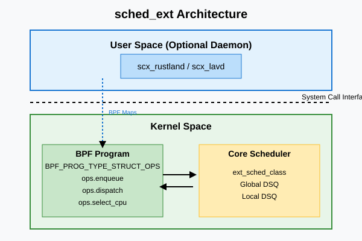

# Планувальник sched_ext: eBPF розширення для sched

<preknowlist>
- [Концепції ядра Linux](book:unix-linux/kernel-and-userspace) — базові поняття системних викликів та VFS.
</preknowlist>

Еволюція планувальників завдань у ядрі Linux є однією з найцікавіших сторінок історії операційних систем. Від раннього O(n) планувальника в епоху Linux 2.4 до O(1) у Linux 2.6, потім до Completely Fair Scheduler (CFS), який домінував більше десятиліття, і нещодавнього переходу до Earliest Eligible Virtual Deadline First (EEVDF). Кожен з цих кроків був продиктований необхідністю адаптуватися до нових апаратних архітектур, збільшення кількості ядер та різноманітності робочих навантажень.

Проте, жоден універсальний планувальник не може бути ідеальним для всіх можливих сценаріїв. Те, що добре працює для серверів баз даних з високою пропускною здатністю, може бути катастрофою для інтерактивних десктопних застосунків або мобільних пристроїв, де важливий час відгуку та енергоефективність. Розробники ігрових консолей, хмарних провайдерів та виробники смартфонів роками тримали власні форки ядра зі спеціалізованими планувальниками, що ускладнювало оновлення та підтримку.

Вирішенням цієї проблеми став **sched_ext** — новий клас планувальника (Extensible Scheduler Class), доданий у ядро Linux 6.12. Він дозволяє реалізовувати логіку планування за допомогою програм eBPF (Extended Berkeley Packet Filter), відкриваючи двері для створення, завантаження та зміни планувальників завдань на льоту, без необхідності перекомпіляції ядра чи перезавантаження системи.

## 1. Архітектура sched_ext

У ядрі Linux процеси плануються за допомогою різних "класів планування" (scheduler classes). Кожен клас відповідає за певну політику планування і має свій пріоритет. Наприклад, `SCHED_DEADLINE` (dl_sched_class) має найвищий пріоритет, за ним йде `SCHED_FIFO`/`SCHED_RR` (rt_sched_class), потім звичайний планувальник `SCHED_NORMAL` (fair_sched_class, зараз EEVDF), і наприкінці `SCHED_IDLE` (idle_sched_class).

`sched_ext` (ext_sched_class) вбудовується в цю ієрархію між класом реального часу (RT) та звичайним класом (Fair). Це означає, що завдання, віднесені до класу `sched_ext`, будуть плануватися після завдань реального часу, але перед звичайними завданнями.

### Механізм BPF_PROG_TYPE_STRUCT_OPS

Основною технологією, що уможливлює `sched_ext`, є `BPF_PROG_TYPE_STRUCT_OPS`. Цей тип BPF-програм дозволяє підміняти покажчики на функції у структурах ядра BPF-програмами. У випадку `sched_ext`, користувач визначає структуру `sched_ext_ops`, яка містить набір callback-функцій, що викликаються ядром у ключові моменти життєвого циклу завдання: при його пробудженні, при додаванні до черги, при виборі завдання для виконання на процесорі тощо.

Ці BPF-програми виконуються в контексті ядра, що гарантує високу продуктивність та низькі затримки. Більше того, завдяки верифікатору eBPF (eBPF verifier), ядро гарантує, що ці програми безпечні: вони не можуть викликати panic, не можуть потрапити у нескінченний цикл (завдяки обмеженням на кількість інструкцій та аналізу циклів) і не можуть читати довільну пам'ять.


*Рис. 1. Взаємодія між ядром Linux та BPF-планувальником через sched_ext_ops.*

## 2. Ключові хуки та життєвий цикл завдання

Щоб написати власний планувальник за допомогою `sched_ext`, необхідно реалізувати частину або всі хуки, передбачені структурою `sched_ext_ops`. Розглянемо найважливіші з них.

### 2.1. ops.enqueue

Цей хук викликається, коли завдання (task) стає готовим до виконання (runnable). Його головна мета — помістити завдання у відповідну чергу. У світі `sched_ext` ви маєте повну свободу вибору структури даних для зберігання завдань: це може бути проста FIFO черга, червоно-чорне дерево (RB-tree), пріоритетна черга або навіть багатовимірна структура для врахування топології NUMA та кешів.

```c
void BPF_STRUCT_OPS(my_enqueue, struct task_struct *p, u64 enq_flags)
{
    // Логіка додавання завдання 'p' до черги
    // BPF-програма може використовувати BPF maps для зберігання стану
}
```

У `sched_ext` є вбудована глобальна FIFO черга (Global Dispatch Queue - DSQ). Якщо ви не хочете реалізовувати складну логіку, ви можете просто відправити завдання в цю глобальну чергу за допомогою BPF-хелпера `scx_bpf_dispatch()`.

### 2.2. ops.select_cpu

Коли завдання пробуджується, ядру потрібно вирішити, на якому процесорі (CPU) його найкраще запустити. Це критично важливо для продуктивності, оскільки правильний вибір CPU може зменшити кількість промахів у кеші (cache misses) та уникнути міграції між вузлами NUMA.

Хук `select_cpu` дозволяє BPF-програмі вказати цільовий CPU для завдання.

```c
s32 BPF_STRUCT_OPS(my_select_cpu, struct task_struct *p, s32 prev_cpu, u64 wake_flags)
{
    s32 target_cpu = prev_cpu;
    // Логіка вибору CPU (балансування навантаження)
    return target_cpu;
}
```

### 2.3. ops.dispatch

Коли процесор стає вільним (idle) або коли настав час перепланування, ядро викликає хук `dispatch` для відповідного CPU. Завдання цього хука — взяти одне або кілька завдань з внутрішніх структур даних вашого планувальника і передати їх ядру для виконання за допомогою `scx_bpf_dispatch()`.

Якщо ваш планувальник використовує локальні черги для кожного CPU (Local DSQ), ви можете напряму вказувати, на який CPU відправити завдання.

### 2.4. ops.running, ops.stopping та ops.yield

- **`ops.running`**: викликається безпосередньо перед тим, як завдання почне виконуватися на CPU. Це чудове місце для оновлення статистики, запуску таймерів або фіксації часу початку виконання.
- **`ops.stopping`**: викликається, коли завдання перестає виконуватися (через те, що воно заблокувалося, або його квант часу вичерпано).
- **`ops.yield`**: викликається, коли завдання добровільно віддає процесор (викликаючи системний виклик `sched_yield()`).

## 3. Переваги та можливості User-Space планування

Однією з найцікавіших особливостей `sched_ext` є можливість делегувати частину (або всю) логіки планування в користувацький простір (user-space).

Хоча виконання хуків (як-от `enqueue` чи `dispatch`) завжди відбувається в BPF-програмах у режимі ядра, ви можете побудувати архітектуру, де BPF-програма є лише "тонким клієнтом". У такій моделі BPF-програма використовує BPF ring buffers або BPF queues для передачі інформації про події (пробудження, засинання завдань) до фонового демона в користувацькому просторі.

Цей демон (написаний на Rust, C++, Go або навіть Python) може підтримувати складну модель системи, виконувати важку математику (яка недоступна в BPF), враховувати дані від інших систем (наприклад, температуру процесора, мережеву активність) і обчислювати оптимальний розклад. Потім він передає прийняті рішення назад у BPF-програму через BPF maps.

Цей підхід має кілька грандіозних переваг:
1. **Зняття обмежень BPF**: У користувацькому просторі немає обмежень на складність алгоритмів, цикли, використання плаваючої коми чи обсяг пам'яті.
2. **Швидка розробка та дебаг**: Розробляти планувальник у user-space набагато легше, ніж у ядрі. Ви можете використовувати звичні інструменти профілювання, відладчики, бібліотеки та фреймворки. Збій у такому планувальнику призведе лише до падіння демона (після чого ядро автоматично повернеться до EEVDF), а не до kernel panic.

## 4. Екосистема SCX: scx_rustland, scx_lavd, scx_bpfland

Спільнота навколо `sched_ext` швидко зростає, і вже з'явилося багато готових планувальників, які демонструють можливості технології. Вони зібрані в репозиторії `scx` (sched_ext tools).

### scx_rustland
Це планувальник, повністю реалізований у користувацькому просторі мовою Rust. BPF-частина лише ловить події та передає їх Rust-демону. Демон приймає рішення про те, яке завдання і на якому CPU має виконуватися, і передає ці рішення назад у ядро. Цей планувальник є чудовим прикладом того, як можна швидко експериментувати з алгоритмами планування, використовуючи безпечну та швидку мову програмування високого рівня. Він особливо ефективний для тестування нових концепцій (наприклад, різних підходів до QoS або ізоляції контейнерів).

### scx_lavd (LAVD - Latency-sensitive And Virtual Deadline)
Цей планувальник зосереджений на ігрових навантаженнях та інтерактивних завданнях, де головна мета — мінімізація затримок (latency) та стабільний frame rate (FPS). У іграх та настільних застосунках пропускна здатність часто менш важлива, ніж швидкість реакції на події введення або синхронізація кадрів. `scx_lavd` агресивно ідентифікує інтерактивні потоки і дає їм максимальний пріоритет, гарантуючи, що важкі фонові завдання не спричинять "фрізів". Він демонструє значне покращення плавності в багатьох Linux-іграх.

### scx_bpfland
На відміну від `rustland`, цей планувальник повністю працює в BPF (у ядрі). Він демонструє, як можна побудувати високоефективний та масштабований планувальник без перемикань контексту між ядром і користувацьким простором. Його мета — бути базовим шаблоном для розробки суто BPF-планувальників.

## 5. Практичні Use-Cases для sched_ext

Навіщо комусь може знадобитися писати власний планувальник? Ось кілька реальних сценаріїв, де `sched_ext` виявляється незамінним:

### 5.1. Хмарні провайдери та мікросервіси
У дата-центрах на одному сервері часто працюють тисячі контейнерів. Хмарні провайдери хочуть максимізувати утилізацію CPU, але при цьому гарантувати суворий QoS (Quality of Service) для пріоритетних клієнтів. Стандартний EEVDF може бути занадто "справедливим". За допомогою `sched_ext` провайдер може реалізувати логіку, яка чітко знає про топологію сервісів: наприклад, давати абсолютний пріоритет потокам обробки мережевих пакетів, або групувати завдання одного tenant'а на спільних L3-кешах.

### 5.2. Android та мобільні пристрої
Смартфони використовують архітектуру big.LITTLE (або сучасніші трирівневі архітектури). Головне завдання — зберегти заряд батареї, забезпечуючи плавність UI. Google роками розробляв складні патчі (як-от EAS - Energy Aware Scheduling). З `sched_ext` розробники Android можуть динамічно завантажувати планувальник, який глибоко інтегрований з системою управління живленням пристрою і специфікою конкретного SoC, без необхідності чекати на прийняття цих патчів у mainline Linux.

### 5.3. Спеціалізовані бази даних та Data-plane застосунки
Такі системи, як Redis, ScyllaDB або високочастотні торгові системи (HFT), часто намагаються обійти планувальник ядра, прив'язуючи потоки до ядер (CPU pinning) і використовуючи poll-режими. З `sched_ext` розробник СУБД може написати власний планувальник, який ідеально розуміє внутрішню модель потоків цієї конкретної СУБД, забезпечуючи оптимальне перемикання контексту без "брудних" хаків.

### 5.4. Геймінг
Як показав приклад `scx_lavd`, Valve (Steam Deck) та інші компанії можуть використовувати `sched_ext` для забезпечення консистентного фреймрейту, ізолюючи ігровий процес від фонових завдань ОС (оновлення, індексація тощо).

## 6. Як написати найпростіший планувальник (FIFO)

Щоб продемонструвати простоту `sched_ext`, розглянемо концепт найпростішого глобального FIFO планувальника на BPF (на базі С).

```c
#include <vmlinux.h>
#include <bpf/bpf_helpers.h>
#include <bpf/bpf_tracing.h>

// Глобальна черга (DSQ - Dispatch Queue)
#define MY_DSQ_ID 0

// Хук enqueue: коли завдання стає готовим, відправляємо його в нашу глобальну чергу
void BPF_STRUCT_OPS(fifo_enqueue, struct task_struct *p, u64 enq_flags)
{
    // Відправляємо завдання в глобальну чергу MY_DSQ_ID.
    // Останній параметр - квант часу (SCX_SLICE_DFL - за замовчуванням)
    scx_bpf_dispatch(p, MY_DSQ_ID, SCX_SLICE_DFL, enq_flags);
}

// Хук dispatch: коли CPU стає вільним, він просить завдання
void BPF_STRUCT_OPS(fifo_dispatch, s32 cpu, struct task_struct *prev)
{
    // Беремо завдання з нашої глобальної черги і передаємо його на виконання
    scx_bpf_consume(MY_DSQ_ID);
}

// Хук init: ініціалізація планувальника при завантаженні
s32 BPF_STRUCT_OPS(fifo_init)
{
    // Створюємо глобальну чергу з нашим ID
    return scx_bpf_create_dsq(MY_DSQ_ID, -1);
}

// Структура, яка реєструє наші хуки в ядрі
SEC(".struct_ops.link")
struct sched_ext_ops fifo_ops = {
    .enqueue = (void *)fifo_enqueue,
    .dispatch = (void *)fifo_dispatch,
    .init = (void *)fifo_init,
    .name = "simple_fifo"
};
```

Цей код, після компіляції за допомогою `clang` у BPF об'єктний файл, може бути завантажений у ядро спеціальним loader'ом у користувацькому просторі (зазвичай за допомогою бібліотеки `libbpf`). Як тільки він завантажується, завдання, налаштовані на клас `sched_ext`, почнуть плануватися за правилом "перший прийшов - перший виконався".

## 7. Безпека, надійність та Fallback

Критичне питання: що станеться, якщо BPF-планувальник має логічну помилку (наприклад, забуває викликати `scx_bpf_dispatch`, або відправляє завдання на неіснуючий CPU)? Чи "зависне" система?

Ні. Розробники `sched_ext` передбачили потужний механізм захисту — **watchdog**. Ядро постійно моніторить стан завдань у класі `sched_ext`. Якщо завдання знаходиться в стані `runnable`, але не отримує процесорний час протягом тривалого періоду (timeout), спрацьовує watchdog.

Коли спрацьовує watchdog, або коли BPF-програма повертає помилку чи аварійно завершується (наприклад, через помилку доступу до пам'яті, хоча верифікатор намагається це запобігти), ядро автоматично ініціює **fallback**. Fallback означає, що поточний BPF-планувальник миттєво вивантажується, і всі завдання безпечно переводяться назад під управління стандартного планувальника (CFS/EEVDF). Система продовжує працювати без перебоїв, а адміністратор отримує повідомлення про помилку в dmesg.

Це робить розробку та експерименти абсолютно безпечними навіть на робочих системах.

## Підсумки

`sched_ext` — це зміна парадигми в розвитку ядра Linux. Подібно до того, як XDP та eBPF змінили мережевий стек, дозволивши створювати високопродуктивні балансувальники та фаєрволи без зміни коду ядра, `sched_ext` демократизує розробку планувальників завдань.

Тепер дослідники, інженери хмарних компаній та ентузіасти можуть розробляти, тестувати та впроваджувати оптимізовані планувальники за лічені дні, а не роки. Це відкриває шлях до глибоко персоналізованих систем, де ОС адаптується під конкретне навантаження ідеально і без компромісів.

Ядро Linux 6.12 назавжди змінило правила гри, перетворивши планування завдань з "чорної магії" ядерних хакерів на гнучкий, доступний та безпечний інструмент для кожного системного інженера.

---
**Ключові поняття для запам'ятовування:**
*   **sched_ext (Extensible Scheduler Class)**: механізм у ядрі Linux (з версії 6.12) для створення планувальників за допомогою eBPF.
*   **BPF_PROG_TYPE_STRUCT_OPS**: тип BPF-програм, що дозволяє підміняти покажчики на функції ядра (ops).
*   **Хуки (Hooks)**: `enqueue` (додавання до черги), `select_cpu` (вибір процесора), `dispatch` (відправка на виконання).
*   **User-Space Scheduler**: архітектура, де BPF лише передає події демону в просторі користувача, який приймає складні рішення (напр. scx_rustland).
*   **Fallback / Watchdog**: вбудований механізм ядра для захисту системи від зависань; автоматично повертає керування стандартному планувальнику у разі збою BPF-планувальника.
