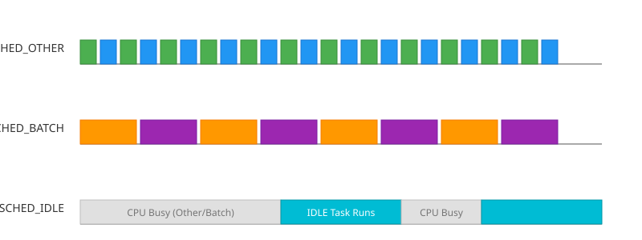

# Класи планування SCHED_IDLE та SCHED_BATCH

<preknowlist>
- [Концепції ядра Linux](book:unix-linux/kernel-and-userspace) — базові поняття системних викликів та VFS.
</preknowlist>

У ядрі Linux (починаючи з версії 2.6.23, коли було впроваджено Completely Fair Scheduler — CFS) планування звичайних, не-реальночасних процесів здійснюється на основі принципу абсолютної справедливості. Проте далеко не всі процеси вимагають однакового підходу до квантування часу та обробки витискання. Для задач, які мають специфічні патерни використання процесора, Linux надає додаткові класи планування: **SCHED_BATCH** та **SCHED_IDLE**.

Ці класи дозволяють системному адміністратору або самому розробнику (за допомогою системних викликів) тонко налаштовувати поведінку системи під час виконання фонових, тривалих або низькопріоритетних обчислень. У цій статті ми детально розглянемо архітектуру, механізми роботи, системні виклики та практичні сценарії використання класів `SCHED_BATCH` і `SCHED_IDLE`, а також порівняємо їх з типовим класом `SCHED_OTHER`.

## 1. Архітектура CFS та місце в ній BATCH/IDLE

Completely Fair Scheduler (CFS) моделює ідеальний багатозадачний процесор, у якому кожен процес отримує пропорційну частку процесорного часу. CFS відстежує "віртуальний час виконання" (`vruntime`) для кожної сутності планування (scheduling entity). 

За замовчуванням всі звичайні процеси належать до класу **SCHED_OTHER** (або `SCHED_NORMAL` у термінології внутрішнього коду ядра). Планувальник намагається мінімізувати затримку (latency), часто перемикаючи контекст між процесами `SCHED_OTHER`, щоб забезпечити високу чуйність інтерактивних додатків. 

Проте існують два класи процесів, для яких така поведінка не є оптимальною:
1. **Фонові пакетні завдання (Batch jobs):** компіляція великих проєктів, кодування відео, обробка великих масивів даних. Для них важлива загальна пропускна здатність (throughput), а не чуйність. Часті перемикання контексту призводять до скидання кешів процесора (L1/L2/L3), що уповільнює виконання.
2. **Фонові завдання з екстремально низьким пріоритетом:** аналітика логів, дефрагментація (у минулому), фонове створення резервних копій. Вони повинні виконуватися *тільки* тоді, коли процесор більше нічим не зайнятий, щоб жодним чином не впливати на продуктивність основної системи.

Для розв'язання цих завдань існують класи `SCHED_BATCH` та `SCHED_IDLE` відповідно. Усі три класи (`OTHER`, `BATCH`, `IDLE`) обслуговуються одним і тим самим класом планувальника ядра — `fair_sched_class`. Відмінності між ними полягають лише у внутрішніх евристиках витискання (preemption) та нарахування "ваги" (weight).


*Рис. 1. Візуалізація перемикання контексту для різних класів планування. SCHED_BATCH рідше перемикається, зберігаючи кеш, а SCHED_IDLE виконується лише за відсутності іншого навантаження.*

## 2. Клас SCHED_BATCH: Максимізація пропускної здатності

Клас **SCHED_BATCH** призначений для виконання процесів, які є "CPU-bound" (залежать переважно від швидкості процесора, а не від вводу/виводу), і не є інтерактивними. 

### Основні характеристики SCHED_BATCH

1.  **Збільшені кванти часу (Timeslices):** Хоча в CFS немає жорстко заданих квантів часу, планувальник динамічно розраховує час, який процес може виконуватися до витискання. Для `SCHED_BATCH` ядро застосовує "штраф за витискання" (preemption penalty) щодо інтерактивних завдань. Це означає, що процес у стані `SCHED_BATCH` виконуватиметься довше без переривань на користь інших завдань CFS.
2.  **Оптимізація кешу:** Завдяки рідшим перемиканням контексту (context switches), дані та інструкції процесу довше залишаються в апаратному кеші процесора (TLB, L1/L2 кеші). Це значно підвищує загальну пропускну здатність (throughput).
3.  **Відмова від "пробуджувального витискання" (Wake-up Preemption):** У класі `SCHED_OTHER`, якщо процес, що спав (наприклад, чекав на ввід з клавіатури), прокидається, він часто отримує бонус і негайно витискає поточний процес, щоб забезпечити швидку реакцію (чуйність). Процес класу `SCHED_BATCH` **ніколи** не буде витискати інший процес при своєму пробудженні, навіть якщо його `vruntime` менший. Він покірно стає в чергу і чекає свого ходу.
4.  **Значення Nice:** Як і `SCHED_OTHER`, клас `SCHED_BATCH` поважає значення `nice` (від -20 до +19). Процес `SCHED_BATCH` з `nice = 0` отримуватиме стільки ж сумарного процесорного часу, скільки й процес `SCHED_OTHER` з `nice = 0`. Відмінність лише в тому, *як* цей час розподіляється (довгими, безперервними блоками).

### Коли використовувати SCHED_BATCH?

*   Збірка великих проєктів програмного забезпечення (наприклад, збірка ядра Linux або Android ROM).
*   Наукові обчислення, машинне навчання, тренування нейромереж на CPU.
*   Кодування або транскодування відео (FFmpeg).
*   Стиснення або розпакування великих архівів.
*   Генерація звітів з великих баз даних у фоновому режимі.

## 3. Клас SCHED_IDLE: Робота під час повного простою

Клас **SCHED_IDLE** призначений для завдань, пріоритет яких є абсолютно найнижчим. (Примітка: не плутайте його з "idle task" ядра, потоком з PID 0 (swapper), який виконується, коли немає *жодних* готових до виконання процесів; `SCHED_IDLE` — це політика для *програм користувача*).

### Основні характеристики SCHED_IDLE

1.  **Екстремально низька вага:** У ядрі Linux кожен процес CFS має вагу (weight), яка визначає, наскільки швидко зростає його віртуальний час (`vruntime`). Процеси `SCHED_IDLE` отримують мінімально можливу вагу (в коді ядра, зазвичай, вага = 3). Це означає, що порівняно з нормальними процесами, їхній віртуальний час летить дуже швидко, і планувальник вкрай рідко обирає їх для виконання, якщо є будь-які інші готові процеси.
2.  **Ігнорування значення Nice:** На відміну від `SCHED_OTHER` та `SCHED_BATCH`, для процесів класу `SCHED_IDLE` значення `nice` не має жодного сенсу і ігнорується ядром. Їхня вага завжди фіксовано мінімальна.
3.  **Запобігання інверсії пріоритетів:** Хоча вони виконуються тільки тоді, коли процесор вільний від `OTHER`/`BATCH` та RT-завдань, сучасне ядро Linux реалізує механізми (через cgroups та спільне дерево CFS), які гарантують, що процес `SCHED_IDLE` все ж таки отримає мікроскопічну частку часу (щоб уникнути повного голодування — starvation), що може бути критичним, якщо такий процес утримує системний м'ютекс.
4.  **Вплив на енергозбереження:** Важливо розуміти, що запуск процесу `SCHED_IDLE` перешкоджає переходу процесора в глибокі стани енергозбереження (C-states). Навіть якщо процес `SCHED_IDLE` робить марну роботу, процесор працюватиме. Тому для мобільних пристроїв використання `SCHED_IDLE` може негативно вплинути на заряд батареї, якщо процес безперервно споживає цикли (polling).

### Коли використовувати SCHED_IDLE?

*   Утиліти на кшталт BOINC (Berkeley Open Infrastructure for Network Computing), такі як SETI@home або Folding@home, які використовують цикли процесора, які інакше були б змарновані.
*   Збирачі сміття (Garbage Collectors) у деяких специфічних архітектурах, фонові дефрагментатори пам'яті.
*   Фонове індексування файлової системи (наприклад, `updatedb` або `tracker`, хоча часто вони використовують просто `nice +19` та `ionice`).

## 4. Системні виклики для керування класами планування

Для встановлення класів `SCHED_BATCH` або `SCHED_IDLE` програміст може використовувати системні виклики сімейства `sched_setscheduler()` або сучасніший `sched_setattr()`. 

Для роботи з цими системними викликами у C необхідно підключити заголовний файл `<sched.h>`.

### 4.1. Використання sched_setscheduler(2)

Системний виклик `sched_setscheduler(pid_t pid, int policy, const struct sched_param *param)` є POSIX-сумісним інтерфейсом (хоча самі політики BATCH та IDLE специфічні для Linux).

*   `pid`: Ідентифікатор процесу (0 означає поточний процес).
*   `policy`: Політика планування (`SCHED_OTHER`, `SCHED_BATCH`, `SCHED_IDLE`, або класи реального часу `SCHED_FIFO`, `SCHED_RR`).
*   `param`: Вказівник на структуру `sched_param`, яка містить параметр пріоритету (для звичайних класів, таких як `OTHER`, `BATCH`, `IDLE`, значення `sched_priority` в цій структурі *повинно* дорівнювати 0).

**Приклад на C (встановлення SCHED_BATCH):**

```c
#include <stdio.h>
#include <stdlib.h>
#include <sched.h>
#include <unistd.h>
#include <errno.h>
#include <string.h>

int main() {
    struct sched_param param;
    
    // Для класів, що не є реальним часом, пріоритет завжди 0
    param.sched_priority = 0; 
    
    // Зміна політики поточного процесу (PID 0)
    if (sched_setscheduler(0, SCHED_BATCH, &param) == -1) {
        perror("Помилка sched_setscheduler(SCHED_BATCH)");
        return 1;
    }
    
    printf("Процес %d успішно переведений у клас SCHED_BATCH\n", getpid());
    
    // Тут йде інтенсивна обчислювальна робота
    unsigned long long sum = 0;
    for (unsigned long long i = 0; i < 10000000000ULL; i++) {
        sum += i;
    }
    printf("Обчислення завершено.\n");
    
    return 0;
}
```

### 4.2. Використання sched_setattr(2)

Починаючи з Linux 3.14, було введено новий, більш гнучкий системний виклик `sched_setattr(pid_t pid, struct sched_attr *attr, unsigned int flags)`. Він об'єднує налаштування політики, пріоритетів RT, `nice` для звичайних класів, а також параметри нового класу `SCHED_DEADLINE`.

Структура `sched_attr` дозволяє встановити значення `nice` одночасно з політикою.

**Приклад на C (встановлення SCHED_IDLE за допомогою sched_setattr):**

```c
#define _GNU_SOURCE
#include <stdio.h>
#include <stdlib.h>
#include <unistd.h>
#include <sys/syscall.h>
#include <linux/sched.h>
#include <string.h>
#include <errno.h>

// Оскільки libc може не мати обгортки для sched_setattr,
// ми оголошуємо структуру і викликаємо syscall напряму
struct sched_attr {
    uint32_t size;
    uint32_t sched_policy;
    uint64_t sched_flags;
    int32_t  sched_nice;
    uint32_t sched_priority;
    /* ... інші поля для SCHED_DEADLINE ... */
};

int sched_setattr(pid_t pid, const struct sched_attr *attr, unsigned int flags) {
    return syscall(SYS_sched_setattr, pid, attr, flags);
}

int main() {
    struct sched_attr attr;
    memset(&attr, 0, sizeof(attr));
    attr.size = sizeof(attr);
    attr.sched_policy = SCHED_IDLE;
    attr.sched_nice = 0; // Для SCHED_IDLE nice ігнорується, але ставимо 0
    attr.sched_priority = 0;

    if (sched_setattr(0, &attr, 0) == -1) {
        perror("Помилка sched_setattr(SCHED_IDLE)");
        return 1;
    }

    printf("Процес %d переведено в SCHED_IDLE\n", getpid());
    
    // Цей код буде виконуватись тільки якщо CPU абсолютно вільний
    while (1) {
        // Корисне фонове навантаження...
    }
    
    return 0;
}
```

## 5. Права доступу (Permissions)

Зміна політики планування вимагає розуміння прав доступу:

1.  **Пониження пріоритету:** Будь-який користувач може змінити політику свого власного процесу з `SCHED_OTHER` на `SCHED_BATCH` або `SCHED_IDLE`, оскільки це вважається пониженням пріоритету (добровільна відмова від процесорного часу або чуйності). 
2.  **Підвищення пріоритету:** Зворотний процес (з `IDLE` в `OTHER`, або з `BATCH` в `OTHER`) за замовчуванням може вимагати привілеїв суперкористувача (root), або наявності capabilities `CAP_SYS_NICE`. Це зроблено для того, щоб недобросовісний процес не міг обійти обмеження ресурсів.
3.  Для процесів реального часу (RT) правила ще суворіші, і завжди потрібен `CAP_SYS_NICE` або відповідні ліміти (`RLIMIT_RTPRIO`).

## 6. Порівняння: BATCH/IDLE vs Значення Nice

Початківці часто плутають `SCHED_BATCH` з просто зміною значення `nice` (наприклад, `nice +19`). Це принципово різні механізми, хоча вони можуть використовуватися разом.

*   `nice +19` у класі `SCHED_OTHER`: Зменшує *частку* процесорного часу, яку отримує процес (до приблизно 1.5% від часу нормального процесу при постійній конкуренції). Однак, коли такий процес прокидається, він все ще може намагатися витиснути інші процеси (wake-up preemption), і його кванти часу стають дуже короткими.
*   `SCHED_BATCH`: Частка часу залишається тією ж самою (залежно від `nice`), але процес виконується *довгими блоками* і ніколи не ініціює пробуджувальне витискання. Тобто `SCHED_BATCH` + `nice 0` — це багато часу, але без витискань інших. `SCHED_BATCH` + `nice 19` — це мало часу, довго чекати, і теж без витискань.
*   `SCHED_IDLE`: Набагато слабкіший, ніж `nice +19`. `nice +19` гарантує хоча б крихітну частку процесора. `SCHED_IDLE` не гарантує нічого (точніше, гарантує настільки мало, що це майже нуль), якщо є хоч одне звичайне завдання.

## 7. Взаємодія з вводом/виводом (I/O Scheduling)

Важливо пам'ятати, що класи CPU-планування прямо не керують плануванням вводу/виводу. Проте, з точки зору планувальника I/O (CFQ або BFQ), процеси також мають класи (Idle, Best-Effort, Real-Time). 

Команда `ionice(1)` використовується для зміни I/O класу. За замовчуванням, I/O пріоритет процесу в класі `Best-Effort` обчислюється на основі його значення CPU `nice`.
Процеси, переведені в `SCHED_IDLE`, **автоматично** отримують I/O клас `Idle` (найнижчий I/O пріоритет), що дуже зручно для фонових задач. Для `SCHED_BATCH` ця автоматична магія не працює таким самим чином, тому часто `SCHED_BATCH` комбінують із ручним викликом `ioprio_set` (або утилітою `ionice`), щоб запобігти ситуації, коли фонове завдання перевантажує диск.

## 8. Утиліти командного рядка

Системні адміністратори можуть встановлювати політики для процесів без написання коду мовою C за допомогою утиліти `chrt(1)`.

**Запуск програми з політикою BATCH:**
```bash
chrt --batch 0 ./my_heavy_compiler
```
*(Примітка: `0` тут — це пріоритет, який обов'язково має бути 0).*

**Зміна політики запущеного процесу на IDLE:**
```bash
chrt --idle -p 0 <PID>
```
Переглянути поточну політику процесу:
```bash
chrt -p <PID>
```

## 9. Внутрішня реалізація в ядрі (Deep Dive)

Якщо зазирнути у вихідний код ядра Linux (файл `kernel/sched/fair.c`), ми побачимо, як саме реалізовані ці відмінності. 
Усі три класи (`OTHER`, `BATCH`, `IDLE`) обслуговуються функцією `check_preempt_wakeup()`.

Коли новий процес прокидається і поміщається в чергу виконання (Runqueue), ядро перевіряє, чи повинен він витиснути поточний процес на процесорі.

Для `SCHED_BATCH`:
У функції `check_preempt_wakeup()` є перевірка:
```c
    if (unlikely(p->policy == SCHED_BATCH) || unlikely(curr->policy == SCHED_IDLE))
        // Спеціальні правила: BATCH ніколи не витискає, IDLE завжди витискається.
```
Якщо прокидається процес `SCHED_BATCH`, функція одразу повертає управління, дозволяючи поточному процесу допрацювати свій квант. Це зберігає кеші теплими.

Для `SCHED_IDLE`:
Його "вага" задається у масиві `prio_to_weight` (внутрішньо це масив з 40 елементів для nice від -20 до +19). Але для `SCHED_IDLE` використовується окрема, захардкоджена вага, визначена макросом `WEIGHT_IDLEPRIO`, який дорівнює 3. У той час як нормальний процес з `nice 0` має вагу 1024. Віртуальний час процесу `SCHED_IDLE` (його `vruntime`) обчислюється як:
`vruntime += delta_exec * (NICE_0_LOAD / weight)`.
Оскільки вага дуже мала (3), `vruntime` зростає блискавично. CFS завжди вибирає процес із найменшим `vruntime`. Тому `SCHED_IDLE` завжди опиняється в самому кінці черги (дерева), програючи процесам `OTHER` і `BATCH`, чий `vruntime` зростає значно повільніше.

## Висновок

Класи планування `SCHED_BATCH` та `SCHED_IDLE` — це потужні, але часто недооцінені інструменти в арсеналі розробника та адміністратора Linux. 
Використання `SCHED_BATCH` для важких CPU-bound завдань може збільшити пропускну здатність системи на 10-15% просто за рахунок кращої утилізації кеш-пам'яті процесора, усуваючи марні context switches.
Водночас `SCHED_IDLE` забезпечує найбезпечніший спосіб утилізації "вільних" циклів процесора без ризику загальмувати виконання критичних та інтерактивних завдань. Вміле комбінування цих класів планування з I/O пріоритетами (через `ionice`) дозволяє досягти досконалої роботи фонових служб.
