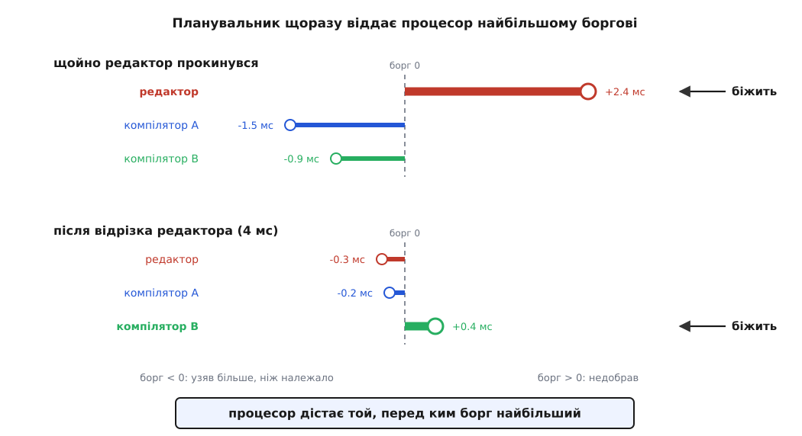

# Планувальник: як ядро ділить час

<preknowlist>
- [Процес: що це насправді](book:unix-linux/process-model) — на процесор ядро ставить задачу; процес — це група задач зі спільними ресурсами.
- [Стани процесу](book:unix-linux/process-states) — задача або готова виконуватися, або спить у чеканні події; за процесор змагаються лише готові.
- [Перемикання контексту](book:programming/context-switch) — щоб спинити задачу й потім продовжити, треба зберегти й відновити регістри; це коштує часу.
- [Витіснювальна багатозадачність](book:programming/preemptive-multitasking) — процесор у задачі відбирають, а не чекають, доки вона віддасть його сама.
</preknowlist>

## Один процесор, десятки охочих

На звичайному ноутбуці живуть сотні задач, готових виконуватися будь-якої миті — кілька десятків, а ядер процесора вісім. Одне ядро виконує рівно один потік інструкцій. Отже, хтось мусить постійно вирішувати, чий потік біжить зараз, а чиї стоять.

Цей хтось — **планувальник** (від англ. *schedule*, а те — від лат. *schedula*, «аркушик із записом»). Він не служба й не окремий потік: це шматок коду ядра, що виконується на тому самому процесорі, у контексті тієї самої задачі, яку саме збирається зняти. Інакше й бути не може: щоб ядро щось вирішило, воно мусить дістати процесор, а дістати його можна лише в когось відібравши.

Робить цю задачу непростою те, що від планувальника хочуть суперечливого. Хочуть **пропускної здатності**: вісім компіляторів мають скласти проєкт якнайшвидше, а для цього кожному треба давати процесор надовго — менше перемикань, тепліший кеш. Хочуть **швидкого відгуку**: натиснута клавіша має домалювати символ негайно, а для цього відрізки мають бути короткими й розбуджену задачу треба пускати вперед. Хочуть, щоб **ніхто не лишився ні з чим назавжди**. І над усім цим — вимога, щоб саме рішення було дешевим: планувальник кличуть тисячі разів на секунду на кожному ядрі.

## Рівні черги — не рівні частки

Найпростіша відповідь — черга по колу: усім по черзі, кожному однаковий відрізок. Вона ламається одразу. Нехай відрізок 10 мс, а готових задач сорок: редактор, що прокинувся, чекатиме своєї черги до 400 мс. Скоротімо відрізок до 1 мс — відгук стане прийнятним, але система перемикатиметься тисячу разів на секунду на кожному ядрі й на кожному перемиканні втрачатиме теплий кеш. Хоч куди крути ручку, вона поганить або відгук, або корисну роботу.

Але глибша вада не в числі. Черга роздає **рівні візити, а не рівні частки**. Задача, яка на своєму відрізку одразу заснула на читанні з диска, віддала процесор за 50 мкс — і стає в кінець кола нарівні з тією, що відпрацювала свої 10 мс сповна. Рахувати треба не візити, а **спожитий час**.

## Ідеальна машина й борг

Щоб міряти спожитий час, потрібне мірило. Уявімо машину, яку побудувати не можна, зате легко описати: процесор, що виконує **всі** готові задачі водночас, кожну зі швидкістю 1/n від повної. За будь-який проміжок T кожна дістає рівно T/n, і питання «кого пустити» не виникає взагалі.

Ця вигадана машина — не мета, а лінійка. Реальне ядро будь-якої миті може порахувати, скільки задача мала б отримати на ідеальній машині, і відняти те, що вона отримала насправді. Різниця — **борг** системи перед задачею (у ядрі його звуть *lag*, англ. «відставання»).

Щойно борг визначено, правило вибору пишеться саме собою: дати процесор тій задачі, перед якою борг найбільший. Вона біжить — її борг тане; коли він падає нижче за чийсь інший, найбільшим стає чужий, і черга переходить.



*Борг праворуч від нуля означає «система винна», ліворуч — «задача вже забрала наперед». Редактор проспав і тому боргу не витрачав; він приходить із найбільшим боргом і біжить негайно. Відпрацювавши свій відрізок, він з'їдає власний борг і поступається наступному.*

Ось де ховається найприємніше. Гарний відгук **не довелося вигадувати окремо**. Сплячий редактор не був претендентом — ідеальна машина ділить час лише між готовими, — тож він нічого не накопичував, але й нічого не витрачав. У мить пробудження його борг найбільший, а вісім компіляторів, що безперервно молотили, вже забрали більше, ніж їм належало. Інтерактивна задача за своєю природою споживає мало, а отже, майже завжди виграє вибір. Чесний облік часу дав відгук задарма.

> 🔧 **Навіщо це.** Саме тому на завантаженій машині курсор і редактор лишаються жвавими, доки ви не почнете рахувати щось важке **в самому редакторі**. Тоді він перестає бути «тим, хто мало споживає», його борг з'їдається так само, як у компіляторів, — і жодні пріоритети цього не приховають.

## Годинник, що йде з різною швидкістю

Чесно — не завжди означає порівну: одні задачі важливіші за інші. Замість того щоб віднімати секунди й окремо накручувати коефіцієнти, ядро дає кожній задачі **власний годинник**, який іде тим повільніше, чим більша її вага. Планувальник щоразу бере задачу, чий годинник відстав найдужче. Задача з удвічі більшою вагою намотує вдвічі менше за ту саму реальну секунду, тож щоб наздогнати сусіда, їй треба вдвічі більше процесора — рівно та частка, яку їй обіцяли. Одне порівняння замість перерахунку всіх часток щоразу, коли хтось заснув або прокинувся. Цю вагу й крутить `nice`, а поруч живуть [пріоритети, nice і реальночасові класи](book:unix-linux/priority-nice-realtime).

## Перемикання не безплатне

Різниця годинників між сусідами часто наносекундна, тож правило «біжить найбільший борг» у чистому вигляді перемикало б задачі безперервно. Пряма ціна перемикання — збереження й відновлення регістрів, перехід через межу ядра — це одиниці мікросекунд; непряма більша: нова задача починає з холодним кешем і якийсь час виконується помітно повільніше. Тому задача, яка вже сіла на процесор, тримає його щонайменше певний мінімальний відрізок, навіть якщо за цей час хтось накопичив трохи більший борг. Ще одна причина, чому облік спожитого часу мусить бути точним, — по ньому рахують не лише черговість, а й [споживання процесорного часу](book:unix-linux/cpu-time-accounting), яке ви бачите в `time` і `top`.

## Понад чесність і поза одним ядром

Чесний клас — не єдиний. Над ним стоять реальночасові класи: готова реальночасова задача витісняє всіх звичайних одразу, незалежно від будь-яких боргів. Це потрібно там, де пізно означає неправильно — звук, керування рухом, вимірювання. А для фонових задач у самому чесному класі є окрема політика з найменшою можливою вагою: така задача дістає процесор практично лише тоді, коли інших охочих немає.

А на багатоядерній машині чесність узагалі локальна: кожне ядро має власну чергу й ділить час усередині себе, бо спільна черга з одним замком не витримала б тисяч звернень на секунду. Рівність між ядрами наводить окремий балансувальник, який переносить задачі й щоразу зважує: перенесена задача починає з холодним кешем, тож іноді чесніше лишити перекіс, ніж його виправити.

## Що видно ззовні

Планувальника видно без спеціальних засобів. У файлі `/proc/<pid>/status` є два лічильники перемикань — добровільні (задача заснула сама) і примусові (її зняли):

```sh
$ grep ctxt /proc/2481/status
voluntary_ctxt_switches:      18452
nonvoluntary_ctxt_switches:    9317
```

Швидко зростає перше — програма більшість часу чогось чекає. Швидко зростає друге — їй бракує процесора, і винен не диск і не мережа, а конкуренція за час.
