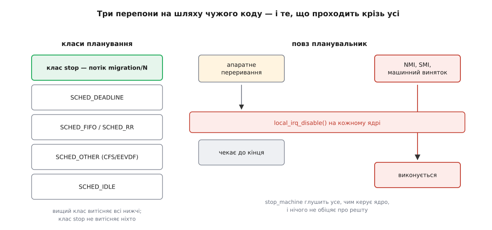
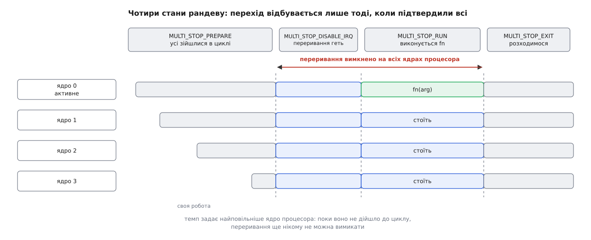
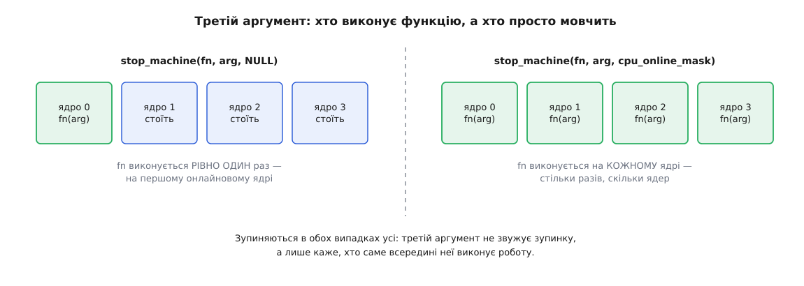

# stop_machine: зупинити всю машину, щоб змінити недоторканне

<preknowlist>
- [Ядро й простір користувача](topic:unix-linux/kernel-and-userspace) — код ядра виконується на тих самих процесорах, що й програми, і ядро в системі одне на всіх.
- [Планувальник: як ядро ділить час](topic:unix-linux/scheduler-model) — на кожному ядрі процесора в кожну мить біжить рівно одна задача, і обирає її планувальник.
- [Пріоритети, nice і реальночасові класи](topic:unix-linux/priority-nice-realtime) — задачі поділені на класи, і вищий клас витісняє нижчий безумовно.
- [Потоки ядра](topic:unix-linux/kernel-threads) — задача, що не має простору користувача й живе лише всередині ядра.
- [Витісненість ядра](topic:unix-linux/kernel-preemption) — де ядро дозволяє себе спинити, а де ні.
- [Замки в ядрі й атомарний контекст](topic:unix-linux/kernel-locking) — де можна заснути, а де лишається тільки крутитися.
- [Дані свого ядра процесора](topic:unix-linux/per-cpu-data) — структури, у яких кожне ядро процесора має власний примірник.
- [Міжпроцесорні переривання](topic:unix-linux/inter-processor-interrupts) — як одне ядро процесора змушує інше виконати код.
- [Переривання](topic:programming/interrupts) — апаратна подія силою забирає процесор у того, хто зараз біжить.
- [NMI та апаратні винятки](topic:programming/nmi-exceptions) — переривання, яке заборонити не можна.
- [Спін-замок](topic:programming/spinlock) — очікування крутінням у циклі замість засинання.
- [Атомарність і гонки](topic:programming/atomicity-races) — читання-зміна-запис як одна неподільна дія.
- [Упорядкування пам'яті та бар'єри](topic:programming/memory-ordering-barriers) — процесор і компілятор переставляють доступи до пам'яті, поки їх не спинити явно.
</preknowlist>

## Зміна, під яку не підкласти замок

Майже все спільне в ядрі захищає замок, і тримається він на одній-єдиній умові: **кожен, хто чіпає ці дані, погодився замок брати**. Писар бере його на запис, читач — на читання, і поки домовленість дотримана, ніхто не побачить половини зміни. Спирається вона не на апаратуру, а на дисципліну коду: усі сторони відомі, усі написані людьми, усі виконують угоду.

Тепер візьмімо зміну, для якої такої угоди не існує в принципі.

Ядро хоче переписати п'ять байтів у власному виконуваному коді — скажімо, погасити виклик трасувальної функції, поклавши на його місце порожню команду. Хто «читає» ці байти? Дешифратор команд процесора. Він тягне їх із пам'яті наперед, тримає в кеші команд і в конвеєрі — і жодного замка не бере не тому, що недбалий, а тому, що це апаратура, для якої поняття замка просто не існує. Якщо в мить запису сусіднє ядро процесора саме вибирає ці байти, воно може дістати перші два зі старої команди, а три наступні — з нової. Такої команди не існувало ніколи, і що процесор із неї зробить, не знає ніхто.

Другий приклад приземленіший. `cpu_online_mask` — бітова маска ядер процесора, які зараз працюють. Її читає кожен, хто збирається розіслати міжпроцесорне переривання або роздати роботу, і читає мимохідь, у гарячому шляху, одним доступом до пам'яті. Змусити всі ці місця брати замок означало б платити цим замком назавжди й усюди — заради події, яка трапляється раз на місяць.

Спільне в обох випадках одне: **читач не є стороною, з якою можна домовитися**. У першому випадку це апаратура, у другому — сотні розкиданих по ядру місць, для яких ціна домовленості вища за саму зміну.

Якщо читачів не змусити чекати, лишається протилежний хід: зробити так, щоб у мить зміни читачів **не було**. Не «не було охочих», а буквально — щоб у всій системі не виконувалося жодної команди, крім тих, які виконує сам той, хто змінює. Механізм, який це робить, зветься `stop_machine()`.

## Три шари тиші

«Ніхто не виконує коду» звучить як одна вимога, але розпадається на три різні, і кожну доводиться закривати окремо.

**Задачі.** На кожному ядрі процесора зараз щось біжить. Щоб воно перестало бігти, його треба витіснити, а законно витісняє в системі лише планувальник. Отже, потрібна задача, яку планувальник обере понад усе інше на кожному ядрі процесора.

**Переривання.** Навіть коли на ядрі процесора крутиться саме та задача, яка нам потрібна, апаратура має право будь-якої миті відібрати в неї процесор і віддати обробникові. Проти цього є `local_irq_disable()`, але слово `local` тут головне: вимкнення діє рівно на тому ядрі процесора, яке його виконало. Отже, вимкнути мусить кожен — і, як побачимо, не абиколи.

**Те, що не глушиться взагалі.** Немаскований запит переривання (NMI), переривання системного керування (SMI — воно заводить процесор у режим SMM на вимогу мікропрограми платформи, і операційна система про це навіть не дізнається), машинні винятки. `stop_machine` їх не спиняє й не вдає, що спиняє. Це чесна межа інструмента: він дає тишу від усього, чим керує ядро, і нічого не обіцяє про те, чим ядро не керує. Саме через цю щілину, як прямо каже документація ядра про завантажувач мікрокоду, зупинка машини не робить пізнє оновлення мікрокоду цілком безпечним.



*Дві перепони ядро ставить саме: витіснення найвищим класом планування і вимкнення переривань. Третій шлях воно не контролює й не закриває.*

## Задача, вища за все

Перший шар закривають потоки-зупинники. На кожному ядрі процесора живе свій потік ядра з ім'ям `migration/N`, де `N` — номер ядра процесора; він намертво прив'язаний до свого ядра й більшість часу спить. Особливий він тим, що належить до окремого класу планування — `stop_sched_class`, який стоїть **вище за всі інші**, зокрема вище за `SCHED_DEADLINE` і `SCHED_FIFO`. Тобто прокинутий зупинник витісняє на своєму ядрі процесора будь-що, а витіснити його не може ніхто.

Чому це мусить бути задача, а не просто міжпроцесорне переривання, розіслане всім? Здається ж, простіше: надіслав сигнал, обробник зупинився й чекає. Але обробник переривання вклинюється в довільну мить — зокрема тоді, коли перерване ядро процесора тримає спін-замок. Рандеву вимагає від кожного учасника крутитися, доки не зберуться всі; якщо один із них крутиться, тримаючи замок, а інший не може дійти до рандеву, бо чекає саме цього замка, система стає намертво.

А ось задачу планувальник поставить на ядро процесора **лише в точці, де поточний код дозволяє себе витіснити** — тобто там, де ядро процесора не тримає спін-замка й не сидить в атомарному контексті. Звідси випливає другий, набагато сильніший висновок: коли всі зупинники побігли, гарантовано **жодне ядро процесора не перебуває всередині критичної секції**. Не просто «всі стоять», а «всі стоять у чистій точці». Саме ця властивість колись зробила `stop_machine` зручним важким молотком для геть інших задач — наприклад, дочекатися, поки всі ядра процесора вийдуть із будь-якої секції, що не дає витіснити себе.

> 🔧 **Навіщо це.** Той самий потік-зупинник має й буденне заняття, від якого й дістав ім'я: коли планувальник переносить задачу на інше ядро процесора, він доручає це `migration/N` через `stop_one_cpu()`. Це та сама інфраструктура, але **без** зупинки світу: робота стає в чергу одного ядра процесора, і решта машини нічого не помічає. Тому «побачив `migration/N` у `top`» не означає «система зупинялася» — набагато частіше це звичайна міграція задач. Зупинка світу — це лише один із режимів роботи цих потоків, і саме той, що дорого коштує.

## Рандеву без розмов

Тепер найтонше. Кожне ядро процесора мусить дійти до спільної точки, вимкнути переривання, дочекатися, поки те саме зробить решта, і лише тоді дозволити змінам відбутися. Але ж домовлятися вони не можуть: переривання вимкнено, отже, розбудити одне одного вже нічим. Лишається спільна змінна в пам'яті й крутіння в циклі.

Реалізовано це маленькою машиною станів. Стан один на всю операцію, а поруч із ним — лічильник підтверджень:

```c
enum multi_stop_state {
        MULTI_STOP_NONE,
        MULTI_STOP_PREPARE,      /* усі прокинулися й крутяться в циклі */
        MULTI_STOP_DISABLE_IRQ,  /* усі вимкнули собі переривання */
        MULTI_STOP_RUN,          /* активні виконують fn */
        MULTI_STOP_EXIT,         /* можна розходитися */
};

static void set_state(struct multi_stop_data *msdata,
                      enum multi_stop_state newstate)
{
        atomic_set(&msdata->thread_ack, msdata->num_threads);
        smp_wmb();
        WRITE_ONCE(msdata->state, newstate);
}

/* хто підтвердив останнім — той і переводить у наступний стан */
static void ack_state(struct multi_stop_data *msdata)
{
        if (atomic_dec_and_test(&msdata->thread_ack))
                set_state(msdata, msdata->state + 1);
}
```

Лічильник спершу дорівнює кількості учасників. Кожен, хто виконав належне для поточного стану, зменшує його на одиницю; той, у кого вийшов нуль, знає, що він останній, — і сам переводить усіх у наступний стан, наперед перезарядивши лічильник. Бар'єр `smp_wmb()` між перезарядкою і записом стану потрібен, щоб ніхто не побачив новий стан зі старим, ще не оновленим лічильником: інакше учасник підтвердив би новий стан підрахунком від попереднього кола.

Сам зупинник крутиться в циклі й реагує лише на зміну стану:

```c
do {
        stop_machine_yield(cpumask);          /* здебільшого це cpu_relax() */
        newstate = READ_ONCE(msdata->state);
        if (newstate != curstate) {
                curstate = newstate;
                switch (curstate) {
                case MULTI_STOP_DISABLE_IRQ:
                        local_irq_disable();
                        hard_irq_disable();
                        break;
                case MULTI_STOP_RUN:
                        if (is_active)
                                err = msdata->fn(msdata->data);
                        break;
                default:
                        break;
                }
                ack_state(msdata);
        }
} while (curstate != MULTI_STOP_EXIT);
```

Тепер видно, навіщо станів саме стільки. Чому не вимикати переривання відразу після прокидання? Бо ядра процесора приходять до циклу різного часу: одному досить перепланування, інше саме обслуговує довгий обробник, третє щойно вийшло з глибокого сну. Якби кожен вимикав переривання щойно прийшов, найшвидший сидів би з вимкненими перериваннями всю ту невизначену вічність, поки доплететься найповільніший. Стан `PREPARE` служить рівно цьому: **вікно тиші починається тоді, коли всі вже на місці**, і триває стільки, скільки триває сама робота, а не стільки, скільки триває збирання.

Далі так само неминуче. `RUN` — окремий стан після `DISABLE_IRQ`, бо функцію не можна починати, поки бодай одне ядро процесора ще приймає переривання: обробник на ньому міг би прочитати те, що якраз переписують. І `EXIT` — окремий стан після `RUN`, бо ніхто не має права ввімкнути переривання й побігти далі, доки функція не завершилася скрізь, де вона виконується. Кожна межа між станами — це справжній бар'єр на всю машину, і кожен із них купується одним колом лічильника.



*Найповільніше ядро процесора визначає, коли починається вікно тиші; довжину вікна визначає вже сама функція.*

Дві дрібниці в тому ж циклі варті згадки, бо показують, ким система себе вважає в ці миті. Зупинники, що просто крутяться, час від часу торкаються сторожового таймера — інакше вартовий, який стежить за застряганням ядра процесора, цілком слушно вирішив би, що машина зависла. І кожне коло вони повідомляють механізм відкладеного звільнення, що перебувають у спокійному стані, — бо стояти з вимкненими перериваннями невизначено довго й не подавати ознак життя означало б заблокувати звільнення пам'яті на всій машині.

## Хто насправді виконує функцію

Назовні механізм виглядає гранично просто:

```c
typedef int (*cpu_stop_fn_t)(void *arg);

int stop_machine(cpu_stop_fn_t fn, void *arg, const struct cpumask *cpus);
```

І тут ховається головне непорозуміння. Третій аргумент — **не** перелік ядер процесора, які зупиняються. Зупиняються завжди **всі** онлайнові. Маска каже лише, хто з них усередині вікна тиші виконує `fn`; решта просто мовчки стоять. Якщо передати `NULL`, функція виконається **рівно один раз** — на першому ядрі процесора з маски онлайнових. Якщо передати `cpu_online_mask`, вона виконається на кожному, тобто стільки разів, скільки в системі ядер процесора.



*Вибір між «один раз» і «на кожному» диктує сама робота: правка спільної структури — один раз, перезапис регістра, що є в кожному ядрі процесора, — на кожному.*

Обидва режими потрібні, і плутати їх дорого. Правку спільної структури в пам'яті годиться робити один раз — виконати її вчетверо було б у кращому разі марно. А ось перезапис регістра, який фізично є в кожному ядрі процесора, або оновлення мікрокоду мусить відбутися на кожному, бо чужий регістр звідси не дістати.

Контекст виклику теж жорсткий і випливає з уже сказаного. `stop_machine()` **сам може заснути**: він будить потоки й чекає на них, тож викликати його з обробника переривання чи з-під спін-замка не можна. Він бере читацький бік замка гарячого підключення ядер процесора — щоб під час операції їх кількість не змінилася; хто вже тримає той замок, викликає `stop_machine_cpuslocked()`. А сама `fn` виконується з вимкненими перериваннями, тож для неї заборонено все, що може заснути: жодних мьютексів, жодного виділення пам'яті, яке чекає, жодного вкладеного `stop_machine()`. Повертається назовні значення, яке повернула `fn`; ненульове від будь-якого активного ядра процесора доходить до того, хто зупинку замовляв.

## Скільки коштує тиша

Ціна тут не абстрактна: уся машина не робить нічого. Порахуймо порядок величини.

**Умова: 64 ядра процесора, лічильник підтверджень лежить в одному рядку кеша, передача цього рядка між ядрами процесора коштує близько 0.15 мкс, сама `fn` виконується 20 мкс.**

```
пробудження 64 зупинників і планування
  (темп задає найповільніше ядро процесора)     ≈ 30 мкс
PREPARE → DISABLE_IRQ: 64 підтвердження підряд
  по одному рядку кеша       64 · 0.15         ≈ 10 мкс
DISABLE_IRQ → RUN                              ≈ 10 мкс
RUN: fn на активному ядрі процесора            =  20 мкс
RUN → EXIT                                     ≈ 10 мкс
──────────────────────────────────────────────────────
вікно з вимкненими перериваннями               ≈ 40 мкс
повна пауза системи                            ≈ 80 мкс
марно спалений процесорний час  64 · 80 мкс    ≈  5.1 мс
```

Числа тут модельні — вони показують не результат виміру, а форму залежності, і саме форма важлива. Пробудження взято тут сталою величиною, хоча насправді росте з кількістю ядер процесора теж, — тож на живій шістдесятичотириядерній машині пауза виходить у кілька разів довша за модельні вісімдесят мікросекунд. По-перше, корисної роботи в цьому бюджеті двадцять мікросекунд із вісімдесяти: більшу частину зупинки система витрачає на те, щоб зупинитися й розійтися. По-друге, кожен перехід між станами росте **лінійно з кількістю ядер процесора**, бо всі підтвердження б'ють в один рядок кеша по черзі. Тобто чим більша машина, тим дорожча кожна зупинка — і тим більше ядер процесора простоює даремно. Механізм, придуманий для машин на два-чотири ядра процесора, на сучасному сервері поводиться геть інакше.

Виміряти це на своїй машині — окрема невелика вправа: [модуль ядра, що зупиняє світ і показує тривалість паузи](topic:unix-linux/stop-machine/proj-freeze-cost.md) робить рівно один виклик `stop_machine()`, засікає час усередині вікна тиші й показує, як ця пауза виглядає в трасуванні та у вимірювачі затримок реального часу.

Найгостріше ця ціна відчувається там, де від системи чекають передбачуваності. Ізоляція ядер процесора під критичне навантаження, реальночасові налаштування, гарантія «задача прокидається за стільки-то мікросекунд» — усе це `stop_machine` перекреслює одним махом, бо ізольоване ядро процесора зупиняється разом з усіма. Домовитися з ним не можна: клас `stop` стоїть вище за будь-який реальночасовий пріоритет саме тому, що інакше механізм не працював би.

## Куди він відступив і де лишився

Через цю ціну історія `stop_machine` — це історія поступового витіснення. Коли він з'явився, ним користувалося вивантаження модулів; згодом на нього перейшло гаряче вимикання ядер процесора й правка коду ядра на ходу. А далі почався зворотний рух: кожен великий користувач по черзі знаходив спосіб обійтися без зупинки світу. Вивантаження модулів навчилося рахувати посилання інакше; правка коду ядра пішла [шляхом тимчасової пастки-переривання](topic:unix-linux/kernel-text-patching) замість зупинки всіх; спроби зробити гаряче вимикання ядер процесора без зупинки світу тривали роками. [Хто, коли й чому виводив із-під зупинки кожного з користувачів](topic:unix-linux/stop-machine/hist-birth-and-retreat.md) — окрема історія з іменами й датами, і в ній добре видно, що зупинка світу майже ніколи не була єдиним можливим рішенням, лише найшвидшим до написання.

Лишилося небагато, і лишилося за суттю. Вимикання ядра процесора на ходу: у мить, коли ядро процесора зникає з маски онлайнових, ніхто в системі не має права цю маску читати — інакше повідомлення піде на мерця, і відправник чекатиме відповіді вічно. Пізнє оновлення мікрокоду: команди, які процесор виконує, змінюються під ним самим, тож усі ядра процесора мають перечекати це в одному місці. Кілька архітектурних операцій із регістрами, які фізично спільні для групи ядер процесора й не мають способу оновитися по одному.

Спільна риса в усіх, що лишилися, одна: змінюється не структура даних, а **умови, за яких взагалі виконується код**. Замок захищає дані від інших читачів; тут захищати треба від самого процесора, і жодної домовленості з ним не існує. Тому список користувачів `stop_machine` — непоганий вимірювач: він показує рівно ті місця, де ядро ще не навчилося міняти світ, не спиняючи його, і кожен викреслений із цього списку рядок був окремою інженерною перемогою.
