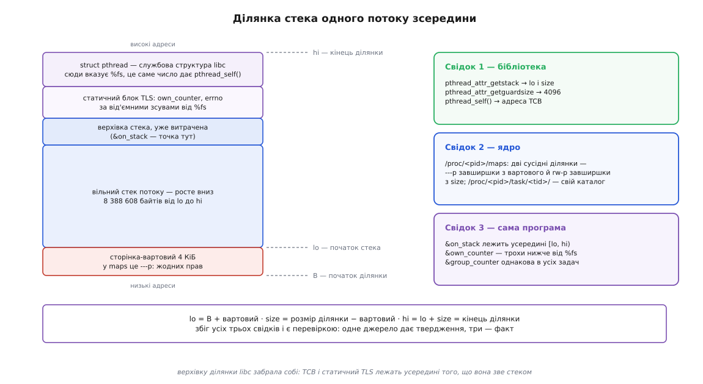

# ⚙️ Анатомія потоку зсередини: програма, що друкує власні номери, стеки й блоки TLS

Кожна частина моделі потоку має або число, або адресу: номер задачі, дві межі ділянки пам'яті, адресу змінної. Ця невелика програма їх друкує, а потім ті самі значення знаходяться в `/proc` — уже очима ядра. Далі вірити нікому не треба: збіг двох незалежних джерел і є перевіркою.

## Що саме перевіряємо

Чотири питання, і на кожне має бути відповідь числом, а не поясненням.

**Скільки в програмі задач і які в них номери.** `getpid()` мусить дати одне число на всіх, `gettid()` — різні; у каталозі `/proc/<pid>/task/` мусить бути рівно стільки підкаталогів, скільки задач.

**Де лежить стек кожної задачі.** Бібліотека повідомляє межі ділянки й розмір вартового; ядро показує ту саму ділянку двома рядками в `maps`; програма показує третє — адресу власної локальної змінної, яка мусить потрапити всередину повідомлених меж.

**Де блок локальних даних.** Адреса `errno` й адреса змінної, оголошеної `__thread`, мусять різнитися між задачами, а адреса звичайної глобальної змінної — збігатися в усіх.

**Кому дістанеться сигнал.** Один і той самий `SIGUSR1`, посланий двома різними способами, має потрапити до різних задач, і котра з них його зловила, програма мусить сказати сама.

Правило досліду одне: **жодне число не приймається з одного джерела**. Бібліотека може повідомляти те, що сама собі записала; ядро може показувати сирі ділянки, не знаючи, чим їх вважає libc; адреса змінної не бреше ніколи, але сама по собі мало що означає. Три свідки, що сходяться, роблять із твердження факт.

## Що саме звіряти: як бібліотека будує ділянку

Щоб знати, чого чекати від `/proc`, треба знати, як влаштована та одна ділянка, з якої живе потік. Бібліотека бере її одним `mmap()` і сама розрізає:

```
ділянка mmap             = [B, B + blocksize)
сторінка-вартовий        = [B, B + guard)          ← у maps це ---p
pthread_attr_getstack дає  lo   = B + guard
                           size = blocksize − guard
верх                       hi   = lo + size = B + blocksize
```

Звідси два прямі наслідки, які й перевіряємо в `maps`: **рядок `---p` закінчується рівно на `lo`**, а **рядок `rw-p` тягнеться від `lo` до `hi`**. Розмір ділянки під запит на 8 МіБ виходить не 8 МіБ, а 8 МіБ плюс сторінка — вартовий додається понад замовлений розмір, а не вирізається з нього. Це правда для glibc від 2.27; до неї вартового віднімали від замовленого, тому старі приклади показують стек на сторінку менший (glibc bug 22637 — «guard size is subtracted from thread stack size instead of adding it on top»).

Верхівку ділянки бібліотека забирає собі: там лежить її службова структура `struct pthread` (на неї вказує `%fs`, і те саме число повертає `pthread_self()` — на x86-64 це збіг за побудовою, а не за стандартом), а трохи нижче — статичний блок локальних даних потоку. Тож `hi` не є верхівкою вживаного стека: перший кадр починається на кілька кілобайтів нижче. Як компілятор перетворює `__thread` на зсув від `%fs` і хто той зсув призначає — [TLS в ELF](book:unix-linux/elf-tls): змінна там адресується не абсолютно, а від'ємним зсувом від покажчика потоку, тому весь блок лежить **під** значенням `%fs`.

## Програма

Інтерфейси тут не обираються: `pthread_getattr_np`, `gettid`, `arch_prctl` і `__thread` — це glibc і системні виклики Linux. Сусідня вкладка показує ту саму програму на C++ — вона звертається рівно до тих самих викликів, бо іншого способу спитати ці числа немає.

:::tabs
```c
/* thread-anatomy.c — що в потоку своє, а що спільне: числами.
   Збірка:  cc -std=c11 -O0 -g -Wall -pthread thread-anatomy.c -o thread-anatomy */
#define _GNU_SOURCE
#include <errno.h>
#include <pthread.h>
#include <semaphore.h>
#include <signal.h>
#include <stdint.h>
#include <stdio.h>
#include <string.h>
#include <sys/syscall.h>
#include <unistd.h>
#ifdef __x86_64__
#include <asm/prctl.h>            /* ARCH_GET_FS */
#endif

#define NWORKERS 3

static int            group_counter;   /* спільна на всю групу задач */
static __thread int   own_counter;     /* своя в кожної задачі */
static __thread pid_t my_tid;          /* хто я — знадобиться в обробнику */

static sem_t quit;                     /* робітникам: час завершуватися */
static sem_t ready;                    /* головній: я вже відзвітував */
static sem_t caught;                   /* головній: сигнал спіймано */
static volatile sig_atomic_t caught_by;

static pid_t tid(void)
{
    return (pid_t) syscall(SYS_gettid);      /* обгортка в glibc лише з 2.30 */
}

static uintptr_t thread_pointer(void)
{
#if defined(__x86_64__)
    uintptr_t tp = 0;
    syscall(SYS_arch_prctl, ARCH_GET_FS, &tp);
    return tp;
#elif defined(__aarch64__)
    uintptr_t tp;
    __asm__ volatile("mrs %0, tpidr_el0" : "=r"(tp));
    return tp;
#else
    return 0;
#endif
}

/* Обробник робить рівно дві дії: запам'ятовує, хто він, і будить головну.
   my_tid читається з блоку ТОГО потоку, у якому виконався обробник. */
static void on_usr1(int sig)
{
    (void) sig;
    caught_by = my_tid;
    sem_post(&caught);
}

static void report(void)
{
    pthread_attr_t attr;
    void  *lo;
    size_t size, guard;
    char   name[16];
    int    on_stack;                     /* адреса цієї змінної — точка в стеку */

    if (pthread_getattr_np(pthread_self(), &attr) != 0)
        return;
    pthread_attr_getstack(&attr, &lo, &size);
    pthread_attr_getguardsize(&attr, &guard);
    pthread_attr_destroy(&attr);
    pthread_getname_np(pthread_self(), name, sizeof name);

    printf("%-8s tid=%-6d getpid()=%d\n", name, (int) my_tid, (int) getpid());
    printf("  стек  [%p .. %p)  %zu КіБ, вартовий %zu Б\n",
           lo, (char *) lo + size, size / 1024, guard);
    printf("  SP    %p — на %td Б нижче від верху ділянки\n",
           (void *) &on_stack, (char *) lo + size - (char *) &on_stack);
    printf("  tp    %#lx   pthread_self() %#lx\n",
           (unsigned long) thread_pointer(), (unsigned long) pthread_self());
    printf("  &own_counter %p   &errno %p   &group_counter %p\n\n",
           (void *) &own_counter, (void *) &errno, (void *) &group_counter);
}

static void *worker(void *arg)
{
    char name[16];

    my_tid = tid();
    own_counter = (int) (intptr_t) arg;
    __atomic_fetch_add(&group_counter, 1, __ATOMIC_RELAXED);
    snprintf(name, sizeof name, "worker-%d", own_counter);
    pthread_setname_np(pthread_self(), name);   /* видно в /proc/<tid>/comm */

    report();
    sem_post(&ready);

    while (sem_wait(&quit) == -1 && errno == EINTR)
        ;                       /* обробник сигналу перериває чекання */
    return NULL;
}

int main(void)
{
    pthread_t w[NWORKERS];
    struct sigaction sa;
    sigset_t usr1;
    int i;

    my_tid = tid();
    own_counter = 100;
    setvbuf(stdout, NULL, _IOLBF, 0);
    sem_init(&quit, 0, 0);
    sem_init(&ready, 0, 0);
    sem_init(&caught, 0, 0);

    memset(&sa, 0, sizeof sa);
    sa.sa_handler = on_usr1;
    sigemptyset(&sa.sa_mask);
    sigaction(SIGUSR1, &sa, NULL);        /* диспозиція — одна на всю групу */

    pthread_setname_np(pthread_self(), "leader");
    report();

    for (i = 0; i < NWORKERS; i++)
        pthread_create(&w[i], NULL, worker, (void *) (intptr_t) (i + 1));
    for (i = 0; i < NWORKERS; i++)
        sem_wait(&ready);

    /* Маска — властивість ЗАДАЧІ. Робітники успадкували порожню маску
       до цього рядка, тому блокування зачепить лише головну задачу. */
    sigemptyset(&usr1);
    sigaddset(&usr1, SIGUSR1);
    pthread_sigmask(SIG_BLOCK, &usr1, NULL);

    for (i = 0; i < 2; i++) {
        kill(getpid(), SIGUSR1);                  /* адресовано ГРУПІ */
        sem_wait(&caught);
        printf("kill(pid, SIGUSR1)        -> спіймала задача %d\n", (int) caught_by);
    }

    pthread_kill(w[NWORKERS - 1], SIGUSR1);       /* адресовано ЗАДАЧІ */
    sem_wait(&caught);
    printf("pthread_kill(worker-%d)     -> спіймала задача %d\n\n",
           NWORKERS, (int) caught_by);

    printf("pid=%d — подивіться /proc/%d/task/ і натисніть Enter\n",
           (int) getpid(), (int) getpid());
    getchar();

    for (i = 0; i < NWORKERS; i++)
        sem_post(&quit);
    for (i = 0; i < NWORKERS; i++)
        pthread_join(w[i], NULL);

    printf("group_counter=%d (спільний), own_counter головної=%d\n",
           group_counter, own_counter);
    return 0;
}
```
```cpp
/* thread-anatomy.cpp — що в потоку своє, а що спільне: числами (C++17).
   Збірка:  g++ -std=c++17 -O0 -g -Wall -pthread thread-anatomy.cpp -o thread-anatomy */
#include <iostream>
#include <thread>
#include <vector>
#include <atomic>
#include <cerrno>
#include <cstdint>
#include <cstdio>
#include <cstring>
#include <csignal>
#include <semaphore.h>
#include <pthread.h>
#include <sys/syscall.h>
#include <unistd.h>
#ifdef __x86_64__
#include <asm/prctl.h>
#endif

constexpr int NWORKERS = 3;

static std::atomic<int>      group_counter{0};   /* спільна на всю групу задач */
static thread_local int      own_counter{0};     /* своя в кожної задачі (TLS) */
static thread_local pid_t    my_tid{0};

static sem_t quit;
static sem_t ready;
static sem_t caught;
static volatile sig_atomic_t caught_by;

static pid_t tid()
{
    return static_cast<pid_t>(syscall(SYS_gettid));
}

static uintptr_t thread_pointer()
{
#if defined(__x86_64__)
    uintptr_t tp = 0;
    syscall(SYS_arch_prctl, ARCH_GET_FS, &tp);
    return tp;
#elif defined(__aarch64__)
    uintptr_t tp;
    __asm__ volatile("mrs %0, tpidr_el0" : "=r"(tp));
    return tp;
#else
    return 0;
#endif
}

static void on_usr1(int)
{
    caught_by = my_tid;
    sem_post(&caught);
}

static void report()
{
    pthread_attr_t attr;
    void *lo;
    size_t size, guard;
    char name[16];
    int on_stack;

    if (pthread_getattr_np(pthread_self(), &attr) != 0)
        return;
    pthread_attr_getstack(&attr, &lo, &size);
    pthread_attr_getguardsize(&attr, &guard);
    pthread_attr_destroy(&attr);
    pthread_getname_np(pthread_self(), name, sizeof name);

    std::cout << (name[0] ? name : "worker")
              << " tid=" << my_tid << " getpid()=" << getpid() << '\n'
              << "  стек  [" << lo << " .. " << static_cast<void *>(static_cast<char *>(lo) + size) << ") "
              << (size / 1024) << " КіБ, вартовий " << guard << " Б\n"
              << "  SP    " << &on_stack << " — на "
              << (static_cast<char *>(lo) + size - reinterpret_cast<char *>(&on_stack))
              << " Б нижче від верху ділянки\n"
              << "  tp    0x" << std::hex << thread_pointer()
              << "   pthread_self() 0x" << pthread_self() << std::dec << '\n'
              << "  &own_counter " << &own_counter
              << "   &errno " << &errno
              << "   &group_counter " << &group_counter << "\n\n";
}

static void worker_func(int id)
{
    char name[16];
    my_tid = tid();
    own_counter = id;
    group_counter.fetch_add(1, std::memory_order_relaxed);
    snprintf(name, sizeof name, "worker-%d", own_counter);
    pthread_setname_np(pthread_self(), name);

    report();
    sem_post(&ready);

    while (sem_wait(&quit) == -1 && errno == EINTR)
        ;
}

int main()
{
    std::vector<std::thread> workers;
    struct sigaction sa{};
    sigset_t usr1;

    my_tid = tid();
    own_counter = 100;
    std::cout << std::unitbuf;

    sem_init(&quit, 0, 0);
    sem_init(&ready, 0, 0);
    sem_init(&caught, 0, 0);

    sa.sa_handler = on_usr1;
    sigemptyset(&sa.sa_mask);
    sigaction(SIGUSR1, &sa, nullptr);

    pthread_setname_np(pthread_self(), "leader");
    report();

    for (int i = 0; i < NWORKERS; i++)
        workers.emplace_back(worker_func, i + 1);
    for (int i = 0; i < NWORKERS; i++)
        sem_wait(&ready);

    sigemptyset(&usr1);
    sigaddset(&usr1, SIGUSR1);
    pthread_sigmask(SIG_BLOCK, &usr1, nullptr);

    for (int i = 0; i < 2; i++) {
        kill(getpid(), SIGUSR1);
        sem_wait(&caught);
        std::cout << "kill(pid, SIGUSR1)        -> спіймала задача " << caught_by << '\n';
    }

    pthread_kill(workers[NWORKERS - 1].native_handle(), SIGUSR1);
    sem_wait(&caught);
    std::cout << "pthread_kill(worker-" << NWORKERS
              << ")     -> спіймала задача " << caught_by << "\n\n";

    std::cout << "pid=" << getpid() << " — подивіться /proc/" << getpid() << "/task/ і натисніть Enter\n";
    std::cin.get();

    for (int i = 0; i < NWORKERS; i++)
        sem_post(&quit);
    for (auto &w : workers)
        w.join();

    std::cout << "group_counter=" << group_counter
              << " (спільний), own_counter головної=" << own_counter << '\n';
    return 0;
}
```
:::

Два рішення в цьому коді неочевидні й важливі.

**Обробник не друкує.** `printf()` бере внутрішній замок потоку виводу; якщо сигнал застав ту саму задачу всередині `printf()`, обробник стане на власному замку назавжди. Тому обробник робить лише те, що дозволено, — записує число й викликає `sem_post()`, один із небагатьох дозволених у ньому викликів, — а друкує вже головна задача, коли її розбудили ([що взагалі можна робити в обробнику сигналу](book:unix-linux/async-signal-safety)).

**Робітники чекають у циклі.** Коли обробник відпрацював у задачі, що спала в `sem_wait()`, чекання не продовжується само — виклик повертає помилку `EINTR`. Без циклу робітник, який спіймав сигнал, тихо вийшов би з очікування й завершився.

## Що вона друкує

Адреси у вас будуть інші, важливі співвідношення між ними:

```
leader   tid=1200   getpid()=1200
  стек  [0x7ffd1c1f7000 .. 0x7ffd1c9f7000)  8192 КіБ, вартовий 0 Б
  SP    0x7ffd1c9f6f1c — на 228 Б нижче від верху ділянки
  tp    0x7f2c4c1a3740   pthread_self() 0x7f2c4c1a3740
  &own_counter 0x7f2c4c1a3718   &errno 0x7f2c4c1a36e0   &group_counter 0x55a3f1c2e014

worker-1 tid=1203   getpid()=1200
  стек  [0x7f2c4b200000 .. 0x7f2c4ba00000)  8192 КіБ, вартовий 4096 Б
  SP    0x7f2c4b9fee5c — на 4516 Б нижче від верху ділянки
  tp    0x7f2c4b9ff700   pthread_self() 0x7f2c4b9ff700
  &own_counter 0x7f2c4b9ff6d8   &errno 0x7f2c4b9ff6a0   &group_counter 0x55a3f1c2e014

worker-2 tid=1204   getpid()=1200
  стек  [0x7f2c4a9ff000 .. 0x7f2c4b1ff000)  8192 КіБ, вартовий 4096 Б
  ...
```

Читаємо по рядках.

`getpid()` однакове в усіх чотирьох, `tid` різні — саме це й означає «спільна ідентичність, окремі одиниці планування».

Стек `worker-1` — рівно 8 МіБ (8 388 608 Б) від `lo` до `hi`, вартовий 4 КіБ понад це. Верх стека `worker-2` (`0x7f2c4b1ff000`) впритул прилягає до початку ділянки `worker-1`, а між вживаними стеками стоїть рівно одна сторінка без прав: переповнення першого впреться в неї, а не в чужі кадри.

Покажчик стека `worker-1` стоїть на 4516 Б нижче від `hi`, хоч задача щойно почалася. Ці кілька кілобайтів — не витрачений стек, а `struct pthread` разом зі статичним блоком TLS, які бібліотека поклала на верхівці тієї самої ділянки. Тому й `tp` (`0x7f2c4b9ff700`) потрапляє в проміжок `[lo, hi)` — покажчик потоку вказує **всередину того, що бібліотека зве стеком**.

`&own_counter` і `&errno` лежать трохи нижче від `tp` — це і є від'ємні зсуви від покажчика потоку. У кожної задачі своя пара адрес; `&group_counter` в усіх однакова, бо ця змінна лежить у сегменті даних програми, спільному на групу.

У головної задачі картина інша, і кожна відмінність має причину. Вартовий — 0, бо головний стек охороняє не сторінка без прав, а незайнятий розрив адрес, який ядро тримає під ним (`stack_guard_gap`, після виправлення класу вразливостей Stack Clash 2017 року — типово 1 МіБ). Розмір — 8192 КіБ, узятий з м'якого `RLIMIT_STACK`, а не з того, що справді відображено ([ліміти ресурсів](book:unix-linux/resource-limits)). А блок локальних даних головної задачі (`0x7f2c4c1a3740`) лежить зовсім не в її стеку (`0x7ffd…`): для неї цей блок виділяє динамічний завантажувач ще до `main()`, тоді як для створених задач його вирізає зі стекової ділянки бібліотека.



*Одна ділянка `mmap` розрізана на чотири частини. Знизу — сторінка без прав доступу; над нею вільний стек, який росте вниз; зверху — статичний блок TLS і службова структура, куди вказує `%fs`. `pthread_attr_getstack` повідомляє межі всього, крім вартового, тому TCB і TLS потрапляють у «стек» за цим звітом.*

## Ті самі числа очима ядра

Поки програма чекає на `Enter`, усе видно ззовні ([/proc: процеси як файли](book:unix-linux/proc-filesystem)).

```bash
$ ls /proc/1200/task
1200  1203  1204  1205

$ grep -H '' /proc/1200/task/*/comm
/proc/1200/task/1200/comm:leader
/proc/1200/task/1203/comm:worker-1
/proc/1200/task/1204/comm:worker-2
/proc/1200/task/1205/comm:worker-3

$ grep -E '^(Tgid|Pid|Threads|SigBlk):' /proc/1200/task/1203/status
Tgid:    1200
Pid:     1203
Threads: 4
SigBlk:  0000000000000000

$ grep -E '^(Tgid|Pid|SigBlk):' /proc/1200/task/1200/status
Tgid:    1200
Pid:     1200
SigBlk:  0000000000000200
```

Ім'я задачі (`comm`) — річ окрема в кожної, і саме тому `pthread_setname_np` не перейменовує програму. `Tgid` однаковий, `Pid` різний — ті самі два числа, що їх програма надрукувала як `getpid()` і `tid`. А `SigBlk` показує, що блокування зачепило рівно одну задачу:

```
SIGUSR1                = 10
номер біта в масці     = 10 − 1 = 9
маска                  = 1 << 9 = 0x200
SigBlk головної задачі = 0000000000000200   ⇒ заблоковано лише SIGUSR1
SigBlk робітників      = 0000000000000000   ⇒ не заблоковано нічого
```

Ділянку стека шукаємо за надрукованою нижньою межею:

```bash
$ grep -B1 '^7f2c4b200000' /proc/1200/maps
7f2c4b1ff000-7f2c4b200000 ---p 00000000 00:00 0
7f2c4b200000-7f2c4ba00000 rw-p 00000000 00:00 0
```

Обидва обіцяні співвідношення справдилися: ділянка `---p` завширшки 4 КіБ закінчується рівно на `lo`, а `rw-p` тягнеться від `lo` до `hi` й має рівно 8 МіБ. Імені в цих рядків немає — жодного `[stack]` чи позначки з номером задачі: анотацію `[stack:TID]` ядро вміло з 3.4 до 4.4 і прибрало у 4.5, бо перебирати всі задачі на кожен рядок `maps` було надто дорого для програм із тисячами потоків. Стек потоку в `maps` виглядає як звичайне безіменне відображення, і єдиний спосіб упізнати його — саме той, яким ми щойно скористалися: спитати адресу в бібліотеки.

Головний стек, навпаки, підписаний — і показує, наскільки повідомлений розмір випереджає дійсність:

```bash
$ grep '\[stack\]' /proc/1200/maps
7ffd1c9d6000-7ffd1c9f7000 rw-p 00000000 00:00 0    [stack]
```

Відображено 132 КіБ, а бібліотека повідомила 8192 КіБ. Верхня межа збігається байт у байт — `0x7ffd1c9f7000` і в програмі, і в `maps`, — і це не випадковість: саме звідси бібліотека її й бере, розбираючи цей самий рядок. А нижню вона просто відкладає вниз на весь м'який `RLIMIT_STACK`. Нижче за `0x7ffd1c9d6000` немає нічого — там просто адреси, які ядро віддасть під стек, коли до них доторкнуться.

Насамкінець — те, чим задачі різняться в очах планувальника:

```bash
$ ps -o tid,comm,psr,pri -L -p 1200
  TID COMMAND         PSR PRI
 1200 leader            2  19
 1203 worker-1          6  19
 1204 worker-2          0  19
 1205 worker-3          3  19

$ taskset -p -c 1204
pid 1204's current affinity list: 0-7
```

`taskset` бере номер **задачі**, не програми: прив'язати `worker-2` до одного ядра можна, не зачепивши решти.

> 🔧 **Навіщо це.** Та сама послідовність дій розбирає справжні аварії. Програма впала з `SIGSEGV`, а адреса збою на кілька байтів нижча за `lo` одного з потоків — це не зіпсований покажчик, а переповнення стека, яке спинив вартовий. `top -H` показує задачу, що з'їдає ціле ядро, — `taskset -p` по її `tid` скаже, чи не загнали її туди примусово. Два «різні потоки» в журналі поводяться як один — звірте номери з `/proc/<pid>/task/`: частина таких загадок виявляється повторно виданим `tid`.

## Кому дістався сигнал

Вивід трьох посилань виглядає так:

```
kill(pid, SIGUSR1)        -> спіймала задача 1203
kill(pid, SIGUSR1)        -> спіймала задача 1203
pthread_kill(worker-3)    -> спіймала задача 1205
```

Другий рядок — найцікавіший. Сигнал, адресований програмі, не роздається по колу: ядро спершу пропонує його **лідерові групи**, і лише коли той тримає сигнал заблокованим, шукає далі, починаючи з задачі, якій віддало сигнал минулого разу. Тому приберіть із програми рядок із `pthread_sigmask` — і обидва групові сигнали ловитиме сама головна задача, а дослід виглядатиме так, ніби ніякого вибору немає.

Це поведінка сьогоднішнього ядра, а не обіцянка. Правило «спершу лідер, далі від попереднього обранця» — деталь реалізації, яка вже мінялася; програма, що на неї спирається, зламається тихо. Спостережуваний висновок протилежний: щоб керувати адресатом, треба не вгадувати вибір ядра, а прибрати вибір — заблокувати сигнал усюди, крім одного місця, як ми й зробили маскою в лідері.

## Розкладка TLS у машинному коді x86-64

На архітектурі x86-64 локальні змінні потоку (TLS) адресуються через сегментний регістр `%fs`. Розкладку блока задає ABI, і x86-64 користується **варіантом II** із двох, описаних Дреппером.

У цьому варіанті покажчик потоку (Thread Pointer, `tp`) вказує безпосередньо на структуру `struct pthread` (Control Block). Статичні локальні змінні `__thread` розміщуються **перед** цим покажчиком, тобто за від'ємними зсувами:

```
[ ... вільний стек ... ]
[ __thread змінні (наприклад, own_counter на tp - 0x28) ]
[ errno на tp - 0x60 ]
[ struct pthread (TCB) ]  <--- %fs вказує сюди
```

Компілятор генерує інструкції доступу через сегментний префікс `%fs:`:
- Для читання `own_counter`: `mov %fs:-0x28, %eax`
- Для запису `errno`: `mov %edx, %fs:-0x60`

Системний виклик `arch_prctl(ARCH_SET_FS, address)` встановлює базову адресу сегмента `%fs`. На процесорах із розширенням FSGSBASE ядро може дозволити читати й міняти цю базу прямо в просторі користувача — інструкціями `rdfsbase` і `wrfsbase`, без системного виклику; у Linux цю можливість увімкнули в ядрі 5.9, до нього прикладний код мусив ходити через `arch_prctl()`.

## Як ця анатомія будується: strace і gdb

Щоб побачити, як ядро та бібліотека створюють цю анатомію під час виконання, скористайтеся `strace`:

```bash
$ strace -f -e trace=clone3,clone,mmap,mprotect,arch_prctl ./thread-anatomy
```

У виводі ви побачите послідовність системних викликів:
1. `mmap(NULL, 8392704, PROT_READ|PROT_WRITE, MAP_PRIVATE|MAP_ANONYMOUS, -1, 0)` — виділення 8 МіБ + 4 КіБ для стека нового потоку.
2. `mprotect(0x7f2c4b1ff000, 4096, PROT_NONE)` — створення сторінки-вартового на початку виділеної ділянки (сам стек починається на сторінку вище, з `0x7f2c4b200000`).
3. `clone3({flags=CLONE_VM|CLONE_FS|CLONE_FILES|CLONE_SIGHAND|CLONE_THREAD|CLONE_SETTLS, tls=0x7f2c4b9ff700, ...})` — створення нової задачі ядра з ініціалізацією сегмента `%fs` адресою блоку TCB.

У `gdb` ви можете перевірити базову адресу `%fs` та розібрати інструкції доступу до TLS:

```text
(gdb) info registers fs_base
fs_base        0x7f2c4b9ff700      139828224063232

(gdb) disassemble worker
Dump of assembler code for function worker:
   ...
   mov    %fs:0x28, %rax          # Читання сторожового слова стека (stack canary)
   mov    %fs:-0x28, %edx         # Читання own_counter від зсуву %fs
   ...
```

## Скільки з восьми мебібайтів справді в пам'яті — і хто будить pthread_join

Якщо подивитися на відображення стека потоку в `/proc/1200/smaps`, видно різницю між зарезервованим віртуальним обсягом та реально спожитою фізичною пам'яттю (RSS):

```bash
$ grep -A 15 '^7f2c4b200000' /proc/1200/smaps
7f2c4b200000-7f2c4ba00000 rw-p 00000000 00:00 0 
Size:               8192 kB
KernelPageSize:        4 kB
MMUPageSize:           4 kB
Rss:                   8 kB
Pss:                   8 kB
Shared_Clean:          0 kB
Shared_Dirty:          0 kB
Private_Clean:         0 kB
Private_Dirty:         8 kB
Anonymous:             8 kB
AnonHugePages:         0 kB
```

Із 8192 КіБ зарезервованої віртуальної пам'яті фізично виділено лише 8 КіБ (`Rss`) — дві сторінки, яких торкнулася програма при старті потоку (одна під кадр функції `worker`, інша під блок TCB/TLS).

На етапі завершення задачі спрацьовує механізм `CLONE_CHILD_CLEARTID`. Ядро записує нуль за адресою `ctid` у пам'яті програми й одразу будить тих, хто на цьому слові чекає — тим самим кодом, що обслуговує `futex()` із простору користувача:

```text
put_user(0, tsk->clear_child_tid);
do_futex(tsk->clear_child_tid, FUTEX_WAKE, 1, …);   /* kernel/fork.c */
```

Саме це пробудження й повертає з `pthread_join()`. Опитування в циклі (polling) не відбувається: поки слово не обнулили, очікувач спить у ядрі й процесорного часу не витрачає.

## Ціна викликів і пастки

Усі числа в програмі беруться майже задарма — але одне з них дороге, і саме воно спокушає покласти його в цикл.

```
gettid, arch_prctl              — по одному системному виклику, десятки наносекунд
pthread_self, pthread_attr_get* — читання полів структури, без входу в ядро
pthread_getattr_np у робітника  — теж лише копіювання полів
pthread_getattr_np у ГОЛОВНОЇ   — fopen + розбір усього /proc/self/maps
```

Для головної задачі бібліотека не знає меж стека: його вирощує ядро. Тому вона щоразу відкриває й розбирає `/proc/self/maps` — це десятки кілобайтів тексту й виділення пам'яті всередині виклику. Один раз при старті це нормально; у перевірці «чи не переповнюється стек», яку викликають на кожен кадр рекурсії, це катастрофа. Кешуйте результат. Там же ховається й друга неприємність: у контейнері без змонтованого `/proc` цей виклик просто не спрацює, і код, який не перевіряє його повернення, дістане сміття замість меж.

Решта пасток такого ж роду — числа правдиві, але означають не те, що здається.

**`pthread_self()` — не адреса.** На x86-64 з glibc воно збігається з покажчиком потоку, і саме тому дослід виходить наочним. Стандарт же не обіцяє, що `pthread_t` узагалі є числом: порівнювати два ідентифікатори можна лише через `pthread_equal()`, а друкувати їх — тільки в такому досліді, як цей.

**Номер задачі повторно вживаний.** Після смерті задачі її `tid` рано чи пізно дістанеться новій. Журнал, у якому рядки склеєні за номером задачі, на довгій роботі змішає дві різні задачі в одну.

**Адреса ділянки повертається.** Завершений потік не віддає стек ядру — ділянка лягає в кеш бібліотеки, і наступний створений потік дістане ту саму адресу. Створіть і приєднайте потік двічі поспіль: `lo` буде однакове. Тому адреса стека не є ідентифікатором потоку в часі — вона ідентифікує лише живого.

**Адреса змінної `__thread` дійсна поза своєю задачею.** Передати `&own_counter` в іншу задачу можна, і запис за цією адресою спрацює — але зайде він у чужу копію. Помилка живуча, бо не падає й не діагностується: просто одна задача бачить не своє.

**Числа міняються під інструментами.** Санітайзери й Valgrind підміняють і алокатор стеків, і розкладку TLS: під ними той самий дослід дасть інші межі, інші розміри й іноді вартового нульового розміру. Міряти анатомію потоку треба на звичайній збірці.

І одна перевірка, яку варто зробити наостанок. Останній рядок виводу програми:

```
group_counter=3 (спільний), own_counter головної=100
```

Три робітники додали по одиниці до спільної змінної — головна задача бачить їхню роботу. Кожен із них записав своє число в `own_counter` — головна задача бачить свою сотню незайманою. Одна й та сама назва, один і той самий рядок оголошення, різниця лише в слові `__thread` — і в тому, у якій із двох структур врешті опинилася змінна.
