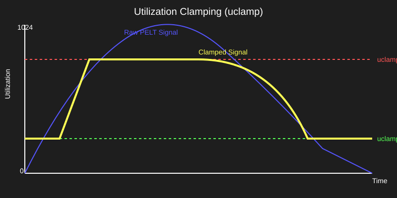

# Обмеження утилізації CPU: uclamp (Utilization Clamping)

<preknowlist>
- [Планувальник CFS](topic:unix-linux/scheduler-model) — концепція планування процесів та вимірювання навантаження PELT.
- [Cgroups v2](topic:unix-linux/cgroups-v2-unified-hierarchy) — уніфікована ієрархія контролерів ресурсів та обмеження CPU.
</preknowlist>

Коли мобільний додаток запускає анімацію гортання списку зі швидкістю 120 кадрів на секунду, система вимагає від процесора миттєвого підйому тактової частоти для відмалювання кадру за 8.3 мілісекунди. Проте стандартний механізм оцінки навантаження ядра Linux — PELT (Per-Entity Load Tracking) — реагує на нову активність поступово, з періодом напіврозпаду 32 мілісекунди. Через цей "повільний розігрів" перший кадр анімації обробляється на мінімальній частоті 300 МГц, що призводить до видимого гальмування інтерфейсу (пропуску кадрів). З іншого боку, фонова задача синхронізації файлів через постійне виконання обчислень розганяє процесор до максимальних 3.0 ГГц, виснажуючи акумулятор пристрою.

Механізм **Utilization Clamping (uclamp)** усуває цю фундаментальну проблему, дозволяючи процесам задавати гарантований мінімум та жорсткий максимум утилізації для підсистеми масштабування частоти та вибору ядер процесора.

## Що таке uclamp та як він працює

Utilization Clamping — це підсистема ядра Linux (додана у версії 5.3), яка модифікує значення утилізації (шкала від 0 до 1024 одиниць), яке бачить регулятор частоти процесора `schedutil` та планувальник енергозбереження EAS.

uclamp не змінює загальний час виконання процесу і не порушує пропорції розподілу CPU між задачами. Він діє як фільтр для двох параметрів:

- **`uclamp_min` (Гарантія швидкості / Floor):** Нижня межа утилізації. Якщо фізичне навантаження за PELT є низьким (наприклад, 20 одиниць), але для задачі встановлено `uclamp_min = 512`, планувальник діє так, ніби утилізація дорівнює 512. Це змушує регулятор `schedutil` негайно підвищити частоту CPU до 50% від максимуму без очікування розігріву PELT.
- **`uclamp_max` (Обмеження швидкості / Ceiling):** Верхня межа утилізації. Навіть якщо фонова задача завантажує ядро на 100% (PELT дорівнює 1024), але має `uclamp_max = 256`, планувальник бачить утилізацію лише у 25%. Це забороняє регулятору підвищувати частоту вище 25% і утримує задачу на малому енергоефективному ядрі.

Формула ефективного сигналу утилізації обчислюється як:

```
util_effective = min(max(util_avg, uclamp_min), uclamp_max)
```
[де util_avg — фізичне значення PELT, uclamp_min — нижня межа, uclamp_max — верхня межа]


*Принцип затискання сирого сигналу PELT за допомогою нижньої (uclamp.min) та верхньої (uclamp.max) меж утилізації.*

## Управління через системний виклик `sched_setattr(2)`

Для налаштування uclamp на рівні окремих потоків програма використовує системний виклик `sched_setattr(2)` зі структурою `sched_attr`. 

Зміна параметрів вимагає передачі прапорів `SCHED_FLAG_UTIL_CLAMP_MIN` та `SCHED_FLAG_UTIL_CLAMP_MAX`. Значення задаються цілими числами у діапазоні від 0 до 1024, де 1024 відповідає повній обчислювальній спроможності процесора.

Нижче наведено приклад налаштування параметрів утилізації для поточного потоку.

:::tabs
```c
#define _GNU_SOURCE
#include <stdio.h>
#include <unistd.h>
#include <string.h>
#include <sys/syscall.h>
#include <linux/sched/types.h>

#ifndef SYS_sched_setattr
#define SYS_sched_setattr 314
#endif

#ifndef SCHED_FLAG_UTIL_CLAMP
#define SCHED_FLAG_UTIL_CLAMP 0x60
#endif

int main(void) {
    struct sched_attr attr;
    memset(&attr, 0, sizeof(attr));
    attr.size = sizeof(attr);
    attr.sched_policy = SCHED_OTHER;

    /* Встановлюємо uclamp_min = 512 (50%) та uclamp_max = 768 (75%) */
    attr.sched_flags = SCHED_FLAG_UTIL_CLAMP;
    attr.sched_util_min = 512;
    attr.sched_util_max = 768;

    if (syscall(SYS_sched_setattr, 0, &attr, 0) == 0) {
        printf("uclamp успішно застосовано!\n");
    }
    return 0;
}
```
```cpp
#include <iostream>
#include <cstring>
#include <unistd.h>
#include <sys/syscall.h>
#include <linux/sched/types.h>

namespace sys {
    #ifndef SYS_sched_setattr
    #define SYS_sched_setattr 314
    #endif

    #ifndef SCHED_FLAG_UTIL_CLAMP
    #define SCHED_FLAG_UTIL_CLAMP 0x60
    #endif
}

int main() {
    struct sched_attr attr{};
    attr.size = sizeof(attr);
    attr.sched_policy = SCHED_OTHER;

    attr.sched_flags = SCHED_FLAG_UTIL_CLAMP;
    attr.sched_util_min = 512;
    attr.sched_util_max = 768;

    if (::syscall(SYS_sched_setattr, 0, &attr, 0) == 0) {
        std::cout << "[C++] uclamp успішно застосовано!\n";
    }
    return 0;
}
```
:::

## Управління через Cgroups v2

У контролері `cpu` системи Cgroups v2 uclamp налаштовується через два файли у відсотках від `0.00` до `100.00`:

- `cpu.uclamp.min`: Гарантований мінімум групи.
- `cpu.uclamp.max`: Максимальна стеля групи.

Обмеження cgroup є жорсткими: ефективний `uclamp_max` потоку не може перевищувати `cpu.uclamp.max` його групового контейнера. Якщо потік намагається встановити власний мінімум вище за груповий максимум, ядро примусово обмежує його значенням cgroup.

## Внутрішня лінійка бакетів у черзі виконання

Для швидкого визначення максимального значення `uclamp_min` серед активних задач ядро ділить шкалу 0–1024 на 5 бакетів (по 20% кожен). Черга виконання `rq` підтримує лічильники задач у кожному бакеті. Пошук максимуму зводиться до сканування 5 елементів зверху вниз, що забезпечує постійний час O(1) і запобігає затримкам планувальника на кожному переключенні контексту.

## Апаратна взаємодія з CPPC та Intel Speed Shift

На процесорах x86 та ARM затиснуту утилізацію `schedutil` перетворює на цільову частоту й передає драйверу CPUFreq — `cpufreq-dt`, `intel_cpufreq` чи `amd_pstate`. На x86 із HWP драйвер виражає цю частоту як підказку в регістрі процесора `IA32_HWP_REQUEST`. Якщо ж HWP працює в автономному (активному) режимі, частоту обирає сам процесор і uclamp на неї не впливає — лишається тільки вплив на вибір ядра.

## Переваги над застарілим механізмом SchedTune

На відміну від застарілого підходу SchedTune, який застосовував нелінійний буст лише на рівні Cgroups v1, uclamp дає двостороннє регулювання (min та max), працює на рівні окремих потоків без контекстних витрат cgroups і оновлює утилізацію за час O(1).

## Практичне значення та застосування

Використання uclamp є стандартом у мобільних операційних системах (зокрема Android 11+), а також там, де адміністратор виставляє межі вручну — файлами `cpu.uclamp.*` у cgroup сервісу чи контейнера або утилітою `uclampset(1)` (власних директив для uclamp `systemd` поки не має).

Це дозволяє операційній системі забезпечувати високу плавність інтерфейсу для активних додатків (за допомогою підвищеного `uclamp_min`) та одночасно зберігати заряд акумулятора та знижувати тепловиділення під час виконання фонових завдань (за допомогою обмеженого `uclamp_max`).

Таким чином, uclamp робить керування продуктивністю процесора гнучким, передбачуваним та повністю інтегрованим з сучасними енергоефективними архітектурами CPU.

Завдяки цьому механізму розробники системного ПЗ отримують прямий інструмент для гарантії пропускної здатності та оптимізації енергоспоживання у складних гетерогенних обчислювальних середовищах, захищаючи додатки від затримок та знижуючи загальну вартість володіння інфраструктурою.

Варто пам'ятати, що uclamp керує саме частотою та розміщенням на ядрах, а не пропорційним розподілом процесорного часу, що робить його ідеальним доповненням до класичних механізмів Nice та CPU Weight. Застосування цієї підсистеми дозволяє збалансувати продуктивність та енергоефективність на рівні всієї операційної системи.
