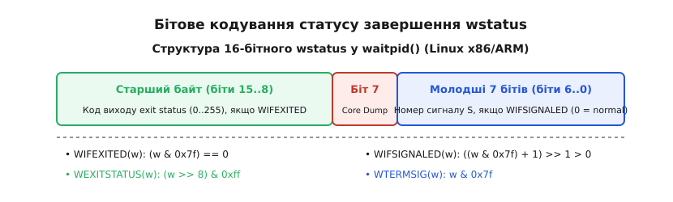
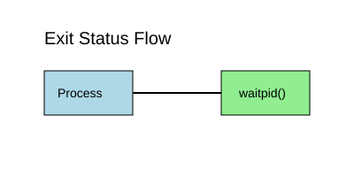

# Код виходу як інтерфейс програми

<preknowlist>
- [Життєвий цикл процесів: exit, wait та зомбі](book:unix-linux/exit-wait-zombies) — як процес передає свій стан батьку через системні виклики wait/waitpid.
- [Стандарт POSIX](book:unix-linux/posix-standard) — узгодженість системних інтерфейсів між основними Unix-подібними системами.
</preknowlist>

Коли операційна система Unix створює процес для виконання програми, цей процес не існує у визольованому просторі: він народжується від батьківського процесу, отримує від нього ресурси (пам'ять, файлові дескриптори, змінні оточення) та повинен повернути чітку, однозначну відповідь про результат своєї роботи. Усі програми у світі Unix та Linux — від базової утиліти `ls` чи `grep` до складних вебсерверів та контейнерних демонів — спілкуються з навколишнім середовищем через надзвичайно елегантний, але суворий контракт: **код виходу** (exit status).

На перший погляд код виходу здається банальним цілим числом від 0 до 255. Проте за цією простотою ховається цілий шар системної архітектури ядра Linux, міжпроцесного зв'язку (IPC) та командних оболонок (shells). Статус виходу — це єдиний універсальний мостик, який дозволяє оболонці знати, чи варто запускати наступну команду в ланцюгу `&&`, системному менеджеру `systemd` — чи потрібно перезапускати впалий сервіс, а оркестратору Kubernetes — чи вважати контейнер збійним.

Розуміння того, як цей код народжується у системному виклику ядра, як він упаковується у бітову маску `wstatus`, як розпаковується через макроси POSIX і як транпонюється оболонкою у значення `$?`, є фундаментальним знанням для будь-якого системного програміста та інженера.

---

## 1. Першопричини та системний механізм завершення процесу

Коли процес завершує своє виконання — будь то природний вихід з функції `main()`, виклик бібліотечної функції `exit()` або апаратний збій через звернення за недійсною адресою пам'яті — операційна система повинна миттєво відповісти на два запитання:
1. Що зробити з ресурсами процесу (пам'яттю, відкритими файловими дескрипторами, сокетами)?
2. Як безвитратно передати результат роботи батьківському процесу, який його створив?

Виділення пам'яті під повноцінний канал IPC (такий як анонімний дескриптор каналу pipe або спільна пам'ять shared memory) для кожного короткоживучого процесу у системі було б надто дорогою операцією. Історично розробники Unix обрали мінімалістичний підхід: зберігати єдине число безпосередньо у структурі управління процесом у ядрі (`task_struct`).

### Анатомія виконання do_exit() у ядрі Linux

При виклику завершення процес потрапляє у внутрішню функцію ядра `do_exit(long code)`. Ядро виконує послідовну процедуру демонтажу структур процесу:

1. **`exit_mm(tsk)`**: Анулюється простір віртуальної пам'яті. Звільняються структури `mm_struct`, сторінки пам'яті та таблиці сторінок (page tables).
2. **`exit_files(tsk)`**: Закриваються всі відкриті файлові дескриптори у структурі `files_struct`. Зменшуються лічильники посилань на файли та сокети.
3. **`exit_fs(tsk)`**: Відключаються посилання на кореневий та поточний робочий каталоги (`fs_struct`).
4. **`exit_task_namespaces(tsk)`**: Процес відключається від просторів імен (namespaces).
5. **`exit_notify(tsk, group_dead)`**: Стан процесу змінюється на `EXIT_ZOMBIE`. Ядро надсилає батьківському процесу сигнал `SIGCHLD` та сповіщає його про зміну стану дочірнього завдання.

### Відмінність між `exit()`, `_exit()` та `exit_group()`

У мові C та стандартній бібліотеці POSIX libc існують три системні виклики завершення: `void exit(int status)` (заголовок `<stdlib.h>`), `void _exit(int status)` (заголовок `<unistd.h>`) та ядерний виклик `exit_group(int status)`.

Коли програма викликає `exit(status)`, відбувається багатоетапна процедура очищення у просторі користувача:
1. Викликаються усі користувацькі обробники завершення, зареєстровані через функцію `atexit()` або `on_exit()`.
2. Скидаються на диск усі незаписані буфери стандартних потоків виводу C (`fflush()` для `stdout`, `stderr`, `stdio`).
3. Видаляються тимчасові файли, створені функцією `tmpfile()`.
4. Здійснюється системний виклик `exit_group(status)`, який завершує всі потоки в даній групі потоків (thread group).

Виклик `_exit(status)` (системний виклик `sys_exit`) діє негайно на рівні ядра: він оминає всі буфери libc і прямо завершує виконання викликаючого потоку. Системний виклик `exit_group()` було додано у Linux 2.5.35 для того, щоб виклик `exit()` з одного потоку POSIX (pthread) коректно завершував увесь багатопотоковий процес, а не лишав інші потоки у завислому стані.

### Життєвий цикл та стан зомбі (Zombie)

Після виклику `do_exit()` ядро Linux звільняє майже всі ресурси процесу. Протім сам елемент процесу у таблиці процесів ядра **не видаляється**.

Процес переходить у стан `TASK_ZOMBIE` (або `EXIT_ZOMBIE`). У цьому стані процес не споживає оперативної пам'яті чи процесорного часу, але зберігає свою структуру `task_struct` з єдиною метою: утримувати свій PID та значення статусу виходу `exit_code`, доки батьківський процес не прочитає його через системний виклик `waitpid()`.

Якщо батьківський процес гине раніше за дочірній, дочірній процес стає "сиротою" (orphan). Ядро Linux негайно перевизначає батьківський процес для сироти (orphan reparenting). Новим батьком стає системний процес `PID 1` (`/sbin/init` або `systemd`) чи найближчий процес-підзбірник (subreaper), призначений через `prctl(PR_SET_CHILD_SUBREAPER)`. Процес PID 1 у безперервному циклі викликає `waitpid()`, очищуючи систему від сирітських зомбі.

### Пастка 8-бітного усічення

Найважливіший математичний та системний факт про код виходу полягає у його розмірності. Хоча у мові C функція `exit(int status)` приймає 32-бітне (або 64-бітне) ціле число `int`, ядро Linux та специфікація POSIX зберігають у вихідному статусі **лише молодші 8 бітів** значення `status`.

Фізична формула усічення в ядрі описується бітовою маскою:

```
Actual Exit Status = status & 0xFF
```

Це означає, що діапазон усіх можливих кодів виходу процесу обмежений значеннями від `0` до `255`. З цього випливає небезпечна пастка усічення (truncation trap):

* Якщо програма виконує `exit(0)`, ядро зберігає `0` (Успіх).
* Якщо програма виконує `exit(1)`, ядро зберігає `1` (Помилка).
* Якщо програма виконує `exit(256)`, то внаслідок усічення бітів `256 & 0xFF` стає `0`!

⚠️ **Катастрофічний наслідок**: якщо розробник повертає з програми кількість оброблених помилок або розмір обробленого масиву через `exit(count)`, то при поверненні значення `256` операційна система та командна оболонка сприймуть це як **ідеально успішне завершення без жодної помилки** (`0`).

Якщо передати від'ємне значення, наприклад `exit(-1)`, двоічний доповняльний код перетворить його на `255`:

```
-1 у двоічному коді 8-біт = 11111111₂ = 255₁₀
```

---

## 2. Анатомія `waitpid()` та бітове кодування `wstatus`

Для того щоб прочитати статус завершення дочірнього процесу та остаточно видалити його зі стану зомбі, батьківський процес виконує системний виклик `pid_t waitpid(pid_t pid, int *wstatus, int options)` з заголовка `<sys/wait.h>`.

Аргумент `wstatus` — це вказівник на 32-бітне ціле число, у яке ядро Linux записує бітовий упакований вектор стану завершення.


*Бітове кодування статусу завершення wstatus у системному виклику waitpid().*

Значення, записане в `wstatus`, **не дорівнює** коду виходу, переданому в `exit()`. Воно є комбінованою структурою, яка одночасно кодує дві альтернативні причини зупинки процесу:
1. Добровільний вихід програми через `exit()`.
2. Аварійна загибель від неперехопленого сигналу ядра (наприклад, звернення до чужої пам'яті або примусовий `kill`).

### Розпакування макросами POSIX

Для розбору значення `wstatus` заборонено писати прямі порівняння зі сталими числами, оскільки бітове кодування залежить від архітектури процесора та версії OS. Стандарт POSIX визначає набір обов'язкових макросів у заголовку `<sys/wait.h>`:

:::tabs
```c
#include <stdio.h>
#include <sys/wait.h>

void inspect_c(int wstatus) {
    if (WIFEXITED(wstatus)) {
        int exit_code = WEXITSTATUS(wstatus);
        printf("Нормальний вихід з кодом: %d\n", exit_code);
    } else if (WIFSIGNALED(wstatus)) {
        int sig_num = WTERMSIG(wstatus);
        printf("Вбито сигналом: %d\n", sig_num);
        if (WCOREDUMP(wstatus)) {
            printf("Записано core dump.\n");
        }
    } else if (WIFSTOPPED(wstatus)) {
        printf("Зупинено сигналом: %d\n", WSTOPSIG(wstatus));
    }
}
```
```cpp
#include <iostream>
#include <sys/wait.h>

void inspect_cpp(int wstatus) {
    if (WIFEXITED(wstatus)) {
        std::cout << "Нормальний вихід з кодом: " << WEXITSTATUS(wstatus) << "\n";
    } else if (WIFSIGNALED(wstatus)) {
        std::cout << "Вбито сигналом: " << WTERMSIG(wstatus) << "\n";
        if (WCOREDUMP(wstatus)) {
            std::cout << "Записано core dump.\n";
        }
    } else if (WIFSTOPPED(wstatus)) {
        std::cout << "Зупинено сигналом: " << WSTOPSIG(wstatus) << "\n";
    }
}
```
:::

### Фізичне розкладання бітів у ядрі Linux

На архітектурах Linux x86 та ARM макроси реалізовані через наступну бітову арифметику:

1. **Якщо процес завершився через `exit(N)`**:
   * Молодші 7 бітів (`wstatus & 0x7F`) дорівнюють `0`.
   * Старший байт (`(wstatus >> 8) & 0xFF`) містить число `N`.
   * Макрос `WIFEXITED(wstatus)` перевіряє, чи молодші біти дорівнюють `0`.
   * Макрос `WEXITSTATUS(wstatus)` зміщує значення праворуч на 8 бітів.

2. **Якщо процес вбито сигналом `S`**:
   * Молодші 7 бітів (`wstatus & 0x7F`) містять номер сигналу `S`.
   * Біт 7 (`wstatus & 0x80`) встановлюється у `1`, якщо ядро скинуло `core dump`.
   * Старший байт дорівнює `0`.
   * Макрос `WIFSIGNALED(wstatus)` перевіряє, чи молодший 7-бітний блок не дорівнює `0` та не позначає зупинку.
   * Макрос `WTERMSIG(wstatus)` маскує значення `wstatus & 0x7F`.

3. **Порівняння варіантів системних викликів `wait`**:
   * `wait(&wstatus)`: Очікує на перший-ліпший завершений дочірній процес.
   * `waitpid(pid, &wstatus, options)`: Дозволяє чекати на конкретний PID, групу процесів (`pid < -1`) або використовувати прапор `WNOHANG` для неблокуючої перевірки.
   * `waitid(idtype, id, infop, options)`: Сучасний виклик POSIX, який повертає структуру `siginfo_t` без бітового маскування.

---

## 3. Трансляція в командну оболонку: змінна `$?` та конвенція `128 + N`

Під час виконання команд у командному інтерпретаторі (Bash, Zsh, Dash, Sh) оболонка виступає батьківським процесом для всіх викликаних системних утиліт. Оболонка викликає `fork()`, `execve()`, чекає на дочірній процес через `waitpid()` та отримує упакований `wstatus`.

Проте для користувача та для мови командних скриптів оболонка згортає двовимірну складність `wstatus` у **єдине 8-бітне число**, яке зберігається у спеціальній змінній оболонки `$?`.


*Послідовність трансляції статусу завершення від системного виклику exit() до змінної оболонки $?.*

### Алгоритм формування `$?` у Shell

Оболонка розраховує значення `$?` за двома правилами:

1. **Якщо дочірній процес завершився нормально (`WIFEXITED` є істинним)**:
   Оболонка присвоює `$? = WEXITSTATUS(wstatus)`. Значення лежить у діапазоні `0..255`.

2. **Якщо дочірній процес загинув від сигналу (`WIFSIGNALED` є істинним)**:
   Оскільки процес не викликав `exit()`, у нього немає власного коду завершення. Щоб повідомити користувача про апаратний або системний збій, оболонка застосовує конвенцію зсуву:
   
   ```
   $? = 128 + WTERMSIG(wstatus)
   ```

Детальніше про історію появи цієї конвенції дивіться у вставці [Історія та еволюція статусу завершення в Unix](book:unix-linux/exit-status/hist-exit-status-evolution.md).

### Повна таблиця мапування сигналів у коди оболонки

| Сигнал ядра | Номер `N` | Причина загибелі процесу | Значення `$?` у Shell (`128 + N`) |
| :--- | :--- | :--- | :--- |
| `SIGHUP` | 1 | Обрив зв'язку з управляючим терміналом | `129` |
| `SIGINT` | 2 | Переривання користувачем з клавіатури (`Ctrl+C`) | `130` |
| `SIGQUIT` | 3 | Сигнал виходу з генерацією дампа пам'яті (`Ctrl+\`) | `131` |
| `SIGILL` | 4 | Неприпустима інструкція процесора (Illegal Instruction) | `132` |
| `SIGTRAP` | 5 | Апаратна точка зупинки або трапування відлагоджувача | `133` |
| `SIGABRT` | 6 | Аварійне зупинення за запитом програми (`abort()`) | `134` |
| `SIGBUS` | 7 | Помилка шини пам'яті (Bus Error / unaligned access) | `135` |
| `SIGFPE` | 8 | Арифметична помилка (ділення на нуль / floating point) | `136` |
| `SIGKILL` | 9 | Примусове безумовне знищення ядра (`kill -9`) | `137` |
| `SIGUSR1` | 10 | Користувацький сигнал 1 | `138` |
| `SIGSEGV` | 11 | Помилка сегментації (звернення за недійсною адресою RAM) | `139` |
| `SIGUSR2` | 12 | Користувацький сигнал 2 | `140` |
| `SIGPIPE` | 13 | Запис у канал pipe, з якого ніхто не читає | `141` |
| `SIGALRM` | 14 | Сигнал таймера зворотного відліку (`alarm()`) | `142` |
| `SIGTERM` | 15 | Стандартний сигнал запиту на завершення (`kill`) | `143` |

### Зарезервовані коди оболонки: 126 та 127

Окрім кодування сигналів, командний інтерпретатор POSIX резервує два високі коди для власних помилок запуску програм:

* **Код `127`**: Команду не знайдено (`Command not found`). Виникає, коли вказане ім'я бинарника відсутнє в усіх каталогах, перелічених у змінній оточення `PATH`, або коли вказано неправильний абсолютний шлях.
* **Код `126`**: Команду знайдено, але вона не є виконуваною (`Command invoked cannot execute`). Виникає, коли файл існує, але у нього відсутні права на виконання (`chmod +x`), або коли системний виклик `execve()` повертає `EACCES` чи `ENOEXEC` (наприклад, некоректний `shebang` `#!/bin/invalid_bash` у скрипті).
* **Код `128`**: Недійсний аргумент виходу у команді `exit`. Виникає, якщо викликати `exit abc`.

---

## 4. Код виходу як контракт та семантика програмних помилок

У програмуванні під Unix діє фундаментальне правило бінарної семантики статусів:

* **Код `0`** означає **УСПІХ** (`EXIT_SUCCESS`).
* **Будь-який ненульовий код `1..255`** означає **ПОМИЛКУ** (`EXIT_FAILURE`).

⚠️ **Увага, плутанина для початківців**: у математичній логіці та мовах C/C++/Python число `1` означає Істину (`true`), а `0` означає Хибність (`false`). У командній оболонці Unix ситуація **дзеркально протилежна**: код `0` означає «Помилок немає (Істина)», а код `1` (і вище) означає «Сталася помилка (Хибність)».

### Небезпека колізій статусів

Оскільки простір чисел від `128` до `255` зарезервований оболонкою для відображення сигналів (`128+N`), власні програми **ніколи не повинні використовувати коди виходу більше 125**.

Розглянемо критичний сценарій колізії:
Якщо автор C++ програми при виявленні помилки у базі даних напише:

```cpp
// ПЛОХА ПРАКТИКА: Використання коду 139
std::cerr << "Database error!\n";
std::exit(139);
```

Коли ця програма запуститься під керуванням Bash, оболонка отримає нормальний вихід `WIFEXITED` з кодом `139` і запише у змінну `$? = 139`. 

Зовнішній моніторинговий скрипт або автоматизована система CI/CD перевірить `$?` і зробить **абсолютно хибний висновок**: вона вирішить, що програма впала від помилки сегментації пам'яті (`SIGSEGV`: `128 + 11 = 139`), і надішле звіт про бінарний збій замість обробки помилки БД!

### Стандортизація через `<sysexits.h>`

Для створення передбачуваного контракту між CLI-програмами та системними демонами розробники BSD створили стандартний заголовочний файл `<sysexits.h>`. Він визначає сімейство стандартних кодів помилок у діапазоні від `64` до `78`:

* `EX_USAGE` (64) — помилка у параметрах командного рядка.
* `EX_DATAERR` (65) — некоректні вхідні дані у файлі.
* `EX_NOINPUT` (66) — відсутній вхідний файл.
* `EX_UNAVAILABLE` (69) — потрібна служба або ресурс недоступний.
* `EX_SOFTWARE` (70) — внутрішня логічна помилка у коді.
* `EX_OSERR` (71) — системна помилка ядра (вичерпано PIDs або пам'ять).
* `EX_NOPERM` (77) — недостатньо прав доступу.

Детальний перелік та опис усіх констант наведено у вставці [Специфікація макросів waitpid, sysexits.h та POSIX кодів](book:unix-linux/exit-status/api-posix-sysexits.md).

---

## 5. Керування потоком виконання у Shell: оператори `&&`, `||`, `set -e` та `trap`

У командній оболонці Unix статус завершення команди `$?` є основним механізмом керування розгалуженням.

### Логічні оператори short-circuit

Оболонка підтримує короткі логічні зв'язки між командами:

* **Оператор `cmd1 && cmd2`**: Виконує `cmd2` **тільки якщо** `cmd1` повернула код `0` (успіх). Якщо `cmd1` повертає ненульовий код, виконання переривається.
* **Оператор `cmd1 || cmd2`**: Виконує `cmd2` **тільки якщо** `cmd1` повернула ненульовий код (помилка).

Приклад побудови надійного ланцюга у скрипті:

```bash
make build && make test && ./deploy.sh || echo "Збій на одному з етапів!"
```

### Автоматичний аварійний режим `set -e`

За замовчуванням інтерпретатор Bash продовжує виконання скрипту крок за кроком, навіть якщо одна з проміжних команд впала з помилкою. Це нерідко призводить до катастрофічних наслідків (наприклад, якщо команда переходу в каталог `cd /opt/app` завершилася з помилкою, а наступна команда `rm -rf *` очищує поточний системний каталог).

Для запобігання цьому використовується режим `set -e` (або `set -o errexit`):

```bash
#!/usr/bin/env bash
set -e

cd /nonexistent_dir  # Скрипт негайно перерве роботу тут із кодом виходу 1
rm -rf *
```

#### Підводні камені `set -e`

Стандарт POSIX визначає складні винятки, де прапор `set -e` **автоматично вимикається**:
1. Всередині перевірок умов `if cmd; then ...`.
2. Всередині циклів `while cmd; do ...` та `until cmd; do ...`.
3. У лівій частині логічних операторів `cmd1 || cmd2` та `cmd1 && cmd2`.

Якщо команда перевіряє факт наявності файлу через `grep` всередині `if`, `set -e` не зупинить скрипт при відсутності збігу, що є правильною поведінкою.

### Перехоплення аварійних виходів через `trap`

Для виконання очищення тимчасових ресурсів при виході зі скрипту (незалежно від того, чи відбувся вихід успішно, чи через збій) використовується системний обробник `trap`:

```bash
#!/usr/bin/env bash
set -euo pipefail

TMPFILE=$(mktemp)

# Зареєструвати обробник видалення тимчасового файлу при виході з процесів
trap 'rm -f "$TMPFILE"' EXIT
trap 'echo "Аварійне зупинення через помилку на рядку $LINENO!"' ERR

# Основна логіка
echo "Обробка даних..." > "$TMPFILE"
```

---

## 6. Поведінка у конвеєрах (Pipelines): `PIPESTATUS` та `pipefail`

Коли кілька команд об'єднуються у вертикальний конвеєр даних за допомогою оператора каналу `|`:

```bash
cmd1 | cmd2 | cmd3
```

Ядро Linux створює всі три процеси **одночасно** і з'єднує їх анонімними файловими дескрипторами `pipe()`.

### Проблема прихованої помилки у POSIX

Згідно зі стандартом POSIX, статусом завершення всього конвеєра вважається **код виходу останньої команди** (`cmd3`).

Розглянемо критичний дефект автоматизації:

```bash
grep "CRITICAL_ERROR" /var/log/missing_file.log | sort | head -n 5
```

Що відбувається під час виконання цього ланцюга:
1. `grep` не знаходить файл `/var/log/missing_file.log`, виводить помилку в `stderr` і повертає код виходу `2`.
2. `sort` отримує порожній вхід від `grep`, нічого не сортує і повертає `0`.
3. `head` отримує порожній вхід, виводить 0 рядків і повертає `0`.

Оскільки остання команда `head` повернула `0`, оболонка записує у змінну `$? = 0`! Скрипт вважає виконання успішним, хоча первинне джерело даних взагалі не існувало!

### Розв'язання: `PIPESTATUS` та `set -o pipefail`

Оболонка Bash надає два потужні інструменти для розв'язання цієї проблеми:

1. **Спеціальний масив `${PIPESTATUS[@]}`**: Зберігає коди виходу **усіх** елементів останнього виконаного конвеєра:

```bash
cat /nonexistent | grep "test" | wc -l
echo "Статуси елементів: ${PIPESTATUS[0]} ${PIPESTATUS[1]} ${PIPESTATUS[2]}"
# Виведе: Статуси елементів: 1 1 0
```

2. **Опція `set -o pipefail`**: Змінює правило обчислення підсумкового коду виходу конвеєра. Якщо увімкнено `pipefail`, підсумковим кодом виходу конвеєра стає **значення найпершої (найлівішої) команди, яка завершилася з ненульовим кодом**. Якщо всі команди завершилися успішно, повертається `0`.

Докладну реалізацію та розбір інспектора конвеєрів дивіться у вставці [Практичний інспектор статусів виходу та конвеєрів Unix](book:unix-linux/exit-status/proj-pipeline-exit-inspector.md).

---

## 7. Простеження та діагностика статусів на рівні ядра

Для глибокого аналізу причин завершення системних процесів інженери використовують трасування системних викликів та підсистеми ядра Linux.

### Аналіз через `strace`

Утиліта `strace` дозволяє перехоплювати точний момент виклику `exit_group` та `waitpid`:

```bash
strace -e trace=exit_group,wait4 -f bash -c "ls /nonexistent"
```

Приклад виводу `strace`:

```text
[pid 12345] execve("/usr/bin/ls", ["ls", "/nonexistent"], ...) = 0
[pid 12345] write(2, "ls: cannot access '/nonexistent'...", 45) = 45
[pid 12345] exit_group(2)               = ?
[pid 12344] wait4(12345, [{WIFEXITED(s) && WEXITSTATUS(s) == 2}], 0, NULL) = 12345
```

З виводу чітко видно, що дочірній PID 12345 викликав `exit_group(2)`, а батьківський PID 12344 прочитав цей стан через `wait4` з макросом `WEXITSTATUS(s) == 2`.

### Перевірка через `/proc/[pid]/stat`

Коли процес перебуває у стані зомбі, його код виходу можна прочитати безпосередньо з псевдофайлової системи `procfs`. Поле №52 файлу `/proc/[pid]/stat` містить агрегований код виходу процесу `exit_code`.

### Трасування через eBPF та `tracepoints`

У сучасних Linux-системах перехоплення смерті процесів здійснюється через точку трасування ядра `sched:sched_process_exit`:

```bash
sudo perf trace -e sched:sched_process_exit
```

Це дозволяє реєструвати коди виходу навіть для тих процесів, які швидко створюються і зникають у системі, запобігаючи витокам аварійних ситуацій.

---

## 8. Розробка мовами C та C++: ідіоматичні приклади

Нижче наведено практичний код запуску дочірнього процесу, очікування його завершення та безпечного розбору `wstatus`.

:::tabs
```c
#include <stdio.h>
#include <stdlib.h>
#include <sys/types.h>
#include <sys/wait.h>
#include <unistd.h>

int run_and_inspect(char *const argv[]) {
    pid_t pid = fork();
    if (pid < 0) {
        perror("fork");
        return -1;
    }

    if (pid == 0) {
        // Дочірній процес: заміна образу програми
        execvp(argv[0], argv);
        perror("execvp");
        _exit(127); // Помилка запуску програми
    }

    // Батьківський процес: очікування завершення
    int wstatus;
    if (waitpid(pid, &wstatus, 0) < 0) {
        perror("waitpid");
        return -1;
    }

    if (WIFEXITED(wstatus)) {
        int code = WEXITSTATUS(wstatus);
        printf("[C] Процес PID %d завершився з кодом: %d\n", pid, code);
        return code;
    } else if (WIFSIGNALED(wstatus)) {
        int sig = WTERMSIG(wstatus);
        printf("[C] Процес PID %d вбито сигналом: %d\n", pid, sig);
        return 128 + sig;
    }

    return -1;
}
```
```cpp
#include <iostream>
#include <vector>
#include <string>
#include <variant>
#include <expected>
#include <sys/types.h>
#include <sys/wait.h>
#include <unistd.h>

struct ProcessSuccess {
    int exit_code;
};

struct ProcessKilled {
    int signal_number;
    bool core_dumped;
};

using ProcessExitStatus = std::variant<ProcessSuccess, ProcessKilled>;

class ProcessRunner {
public:
    static std::expected<ProcessExitStatus, std::string> 
    execute(const std::vector<std::string>& args) {
        if (args.empty()) {
            return std::unexpected("Порожній список аргументів");
        }

        pid_t pid = ::fork();
        if (pid < 0) {
            return std::unexpected("Системна помилка fork()");
        }

        if (pid == 0) {
            std::vector<char*> c_args;
            for (const auto& arg : args) {
                c_args.push_back(const_cast<char*>(arg.c_str()));
            }
            c_args.push_back(nullptr);

            ::execvp(c_args[0], c_args.data());
            ::_exit(127);
        }

        int wstatus = 0;
        if (::waitpid(pid, &wstatus, 0) < 0) {
            return std::unexpected("Системна помилка waitpid()");
        }

        if (WIFEXITED(wstatus)) {
            return ProcessSuccess{WEXITSTATUS(wstatus)};
        } else if (WIFSIGNALED(wstatus)) {
            return ProcessKilled{
                WTERMSIG(wstatus), 
                static_cast<bool>(WCOREDUMP(wstatus))
            };
        }

        return std::unexpected("Невідомий стан процесa");
    }
};
```
:::

---

## 9. Практичні рекомендації та підсумковий чек-лист

Для забезпечення надійності системних продуктів дотримуйтеся наступних правил при роботі з кодами виходу:

1. **Дотримуйтеся суворого діапазону**: Використовуйте коди `1..125` для власних програмних помилок. Ніколи не викликайте `exit()` зі значеннями `>= 126`, щоб не створювати колізій із зарезервованими кодами оболонки та сигналами ядра.
2. **Уникайте небезпечного усічення**: Пам'ятайте, що ядро передає лише молодші 8 бітів. Ніколи не передавайте кількість помилок або розмір даних у виклик `exit(count)`, оскільки будь-яке число, кратне `256`, перетвориться на успішний код `0`.
3. **Завжди вмикайте строгий режим у скриптах Bash**: Починайте кожен комерційний скрипт з інструкції `set -euo pipefail`. Це запобіжить мовчазному ігноруванню збоїв у конвеєрах та незаініціалізованих змінних.
4. **Гарантуйте скидання буферів**: У C/C++ програмах завжди відрізняйте `exit()` від `_exit()`. Використовуйте `_exit()` у дочірніх процесах після `fork()` лише при помилці `exec()`, щоб запобігти подвійному скиданню буферів `stdio` батьківського процесу.

> 🔧 **Навіщо це у продакшені.**
> Більшість сучасних систем оркестрації спираються саме на код виходу:
> * **Kubernetes**: Контейнерна проба `Liveness/Readiness Probe` виконує команду всередині контейнера і вважає її успішною **тільки при коді виходу 0**. Код `139` змушує Kubernetes негайно перезапустити pod через SIGSEGV.
> * **Systemd**: Службовий менеджер інтерпретує коди виходу демона згідно з конфігурацією `RestartPreventExitStatus=` та `SuccessExitStatus=`.
> * **CI/CD (GitHub Actions / GitLab CI)**: Кожен крок збірки зупиняє весь пайплайн при отриманні будь-якого ненульового статусу завершення.
