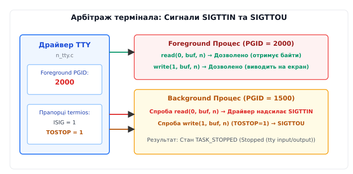
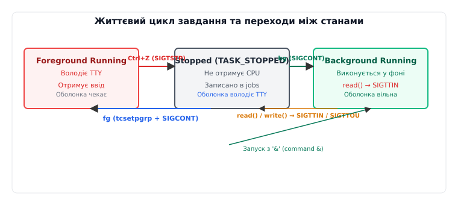

# Керування завданнями: PGID, управляючий термінал, SIGTSTP і сигнальні групи

<preknowlist>
- [Сеанси, групи процесів і керівний термінал](book:unix-linux/sessions-and-process-groups) — як структура сеансу огороджує групи процесів і пов'язує їх з терміналом.
- [Сигнал: асинхронне сповіщення](book:unix-linux/signal-model) — механізм доставки сигналів та типові дії ядра при їх отриманні.
- [TTY і послідовний порт: модель termios](book:unix-linux/tty-and-termios) — дисципліна лінії термінала, режими вводу-виводу та спеціальні символи керування.
- [Стани процесу і що означає стан D](book:unix-linux/process-states) — призупинення процесу (стан TASK_STOPPED) та відновлення виконання.
</preknowlist>

Коли користувач виконує у командній оболонці складний конвеєр `cat /var/log/syslog | grep "CRITICAL" | sort | uniq -c`, операційна система створює чотири окремі процеси, що працюють паралельно і з'єднані між собою анонімними каналами (pipes). Якщо цей конвеєр працює занадто довго або виводить мільйони рядків, натискання комбінації `Ctrl+C` повинно миттєво зупинити всі чотири процеси одночасно. Якби ядро надіслало сигнал переривання лише першому процесу `cat`, решта процесів залишилися б у пам'яті у висячому стані, марно чекаючи на дані. Аналогічно, при натисканні `Ctrl+Z` користувач очікує, що весь конвеєр призупиниться як єдина цілісна одиниця, звільнивши пристрій введення для оболонки, але зберігши весь внутрішній стан процесів у пам'яті до моменту їхнього відновлення.

Механізм, який забезпечує цю інтерактивну гнучкість, називається **керуванням завданнями (job control)**. Це не просто набір команд оболонки (`fg`, `bg`, `jobs`), а узгоджений тристоронній арбітраж між ядром операційної системи (планувальником і сигнальним підкомплексом), драйвером термінала (дисципліною лінії N_TTY) та командною оболонкою (лідером сеансу). Керування завданнями вирішує фундаментальну проблему: як безпечно розділити єдиний фізичний або віртуальний термінал між десятками паралельних процесів без виникнення хаосу під час введення з клавіатури та виведення на екран.

---

## 1. Анатомія завдання та структури даних ядра

У класичній моделі Unix кожен процес має унікальний ідентифікатор `PID` (Process ID) та ідентифікатор батька `PPID` (Parent Process ID). Однак для керування завданнями ієрархічного дерева процесів недостатньо. Оболонці потрібна абстракція, яка дозволяє адресувати групу пов'язаних процесів (конвеєр) як єдиний об'єкт. Для цього в ядрі Linux введено концепцію **групи процесів (Process Group)**, що ідентифікується номером **PGID** (Process Group ID).

Група процесів об'єднує один або кілька процесів, створених для виконання спільного завдання. Кожна група має свого **лідера групи (Group Leader)** — процес, чий `PID` збігається з `PGID` всієї групи.

У внутрішній архітектурі ядра Linux (`kernel/sched` та `fs/proc`) групи процесів та сеанси описуються зв'язаними структурами даних. Кожен процес описується структурою `struct task_struct`, яка містить вказівники на структури ідентифікаторів:

```c
struct task_struct {
    /* ... */
    pid_t pid;
    struct pid *thread_pid;
    struct signal_struct *signal;
    struct task_struct *group_leader;
    /* ... */
};

struct signal_struct {
    /* ... */
    struct pid *pgrp;       /* Вказівник на PID-структуру групи процесів */
    struct pid *session;    /* Вказівник на PID-структуру сеансу */
    int tty_old_pgrp;       /* Збережений PGID після від'єднання TTY */
    /* ... */
};
```

Ядро зберігає ідентифікатори процесів у хеш-таблицях `struct pid`. Це дозволяє ядру за викликом `find_get_pid(pgid)` миттєво знаходити абстракцію групи та ітеруватися по всіх процесах, що до неї належать, за допомогою виклику `pid_task()`. Кожен об'єкт `struct pid` містить списки списків завдань `tasks[PIDTYPE_PGID]`, що дозволяє ядру Linux виконувати операції розсилки сигналів усередині групи за константний або лінійний від кількості членів групи час, без повного сканування глобальної таблиці процесів.

Групи процесів об'єднуються у вищий рівень ієрархії — **сеанс (Session)**, що ідентифікується **SID** (Session ID). Сеанс створюється під час входу користувача в систему або відкриття нового вікна емулятора термінала. Оболонка, що запускається при вході, викликає `setsid()`, стаючи **лідером сеансу (Session Leader)** та лідером нової групи процесів.


*Ієрархічна структура сеансу: сеанс із лідером оболонки містить управляючий термінал, групу переднього плану (Foreground) та фонові групи (Background).*

Найважливішим елементом сеансу є його зв'язок із пристроєм введення-виведення — **управляючим терміналом (Controlling Terminal)**, який у системній структурі ядра описується об'єктом `struct tty_struct`.

У структурі `struct tty_struct` збережено ключове поле арбітражу:

```c
struct tty_struct {
    /* ... */
    struct pid *pgrp;       /* Вказівник на foreground групу процесів (TPGID) */
    struct pid *session;    /* Вказівник на сеанс, якому належить TTY */
    unsigned long flags;     /* Прапорці стану термінала (TTY_THROTTLED тощо) */
    /* ... */
};
```

Це поле `tty->pgrp` вказує, яка саме група процесів у сеансі наразі є **групою переднього плану (Foreground Process Group)**. Усі процеси, які входять до групи `tty->pgrp`, отримують монопольний доступ на читання даних з клавіатурного буфера термінала та отримують термінальні сигнали.

### Інспектування через procfs та утиліти діагностики

Стан груп процесів та їхній зв'язок з терміналом можна безпосередньо відстежити у файловій системі `/proc`. Файл `/proc/[pid]/stat` виводить текстові поля, де п'яте, шосте та восьме поля описують структуру завдання:

- **Поле 1 (`pid`):** Ідентифікатор даного процесу.
- **Поле 5 (`pgrp`):** Ідентифікатор групи процесів (PGID).
- **Поле 6 (`session`):** Ідентифікатор сеансу (SID).
- **Поле 8 (`tpgid`):** Ідентифікатор групи переднього плану на терміналі, до якого підключено процес.

Якщо значення `pgrp` процесу дорівнює `tpgid` термінала, процес перебуває у передньому плані (`Foreground`). Якщо `pgrp != tpgid`, процес є фоновим (`Background`).

Виклик утиліти `ps` дозволяє наочно побачити цей розрозділ:

```bash
ps -o pid,pgid,sid,tpgid,stat,comm
```

У колонці `STAT` прапорці інтерпретуються так:
- `s`: Процес є лідером сеансу (Session Leader).
- `+`: Процес належить до фокусної групи переднього плану (Foreground Process Group).
- `T`: Процес зупинено сигналом керування завданнями (`TASK_STOPPED`).
- `t`: Процес призупинено під час трасування налагоджувальником (`TASK_TRACED`).

---

## 2. Створення завдання та гонка встановлення PGID (The setpgid Race)

Коли оболонка обробляє рядок команди, що складається з конвеєра процесів, вона створює кожен новий процес за допомогою виклику `fork()`. Перший процес конвеєра повинен створити нову групу процесів, викликавши `setpgid(0, 0)` (що еквівалентно `setpgid(pid, pid)`). Цей процес стає лідером нової групи, а його `PID` стає `PGID` для всієї групи. Усі наступні процеси конвеєра приєднуються до цієї ж групи викликом `setpgid(child_pid, first_child_pgid)`.

Однак у цій схемі криється одна з найвідоміших класичних проблем паралелізму в POSIX — **гонка встановлення PGID**.

Після того, як оболонка викликає `fork()`, ядро створює новий процес і додає його до черги планувальника. З цього моменту батьківський процес (оболонка) та нащадок виконуються асинхронно. Якщо планувальник спочатку виділить процесорний час оболонці, вона може спробувати передати термінал новій групі через `tcsetpgrp(tty_fd, child_pgid)` або відправити сигнал цій групі. Якщо нащадок ще не встиг виконати системний виклик `setpgid()`, його PGID все ще дорівнюватиме PGID оболонки. Виклик `tcsetpgrp` завершиться помилкою `EPERM` або змінить групу термінала на некоректне значення.

Навпаки, якщо планувальник віддасть перевагу нащадку, нащадок може встигнути виконати системний виклик `execve()` до того, як оболонка у батьківському процесі викликає `setpgid(child_pid, child_pgid)`. З міркувань безпеки POSIX забороняє змінювати `PGID` процесу після того, як він виконав `execve()` (виклик `setpgid` повертає помилку `EACCES`).

```
Батько (Оболонка):   fork() ────► setpgid(child, child) ────► tcsetpgrp(tty, child)
                                         ▲
                                 ГОНКА ПЛАНУВАЛЬНИКА
                                         ▼
Нащадок (Child):     fork() ────► setpgid(0, 0) ───────────► execve("binary")
```

Універсальний розв'язок цієї проблеми в Unix полягає у **дубльованому виконанні `setpgid`**:

1. Одразу після `fork()` нащадок викликає `setpgid(0, 0)` перед викликом `execve()`.
2. Батьківський процес (оболонка) у своєму коді одразу після `fork()` також викликає `setpgid(child_pid, child_pid)`.

Ядро Linux обробляє цей виклик атомарно, захищаючи списки груп спіновою моделлю `tasklist_lock`. Той з процесів, який дістанеться системного виклику першим, створить або оновить групу процесів. Другий виклик `setpgid` просто поверне `0` (або `EPERM`, якщо група вже сформована точно так само), гарантуючи, що до моменту повернення з `fork()` у батьківському процесі та до `execve()` у нащадку процес **гарантовано** перебуває у правильній групі.

Після формування групи оболонка передає їй володіння терміналом за допомогою системного виклику:

```c
tcsetpgrp(shell_terminal_fd, job_pgid);
```

Цей виклик атомарно змінює поле `tty->pgrp` у драйвері термінала. З цього моменту група `job_pgid` стає переднім планом.

---

## 3. Дисципліна лінії N_TTY та генерація сигналів з клавіатури

Управлюючий термінал не є просто символьним файлом прямого запису; він працює через шар **дисципліни лінії (line discipline)**, що в ядрі Linux реалізований у модулі `drivers/tty/n_tty.c`.

Коли користувач натискає клавіші на клавіатурі, драйвер термінала перехоплює вхідні байти у перериванні пристрою. Якщо у структурі налаштувань термінала `struct termios` у полі `c_lflag` увімкнено прапорець **`ISIG`** (Enable Signals), драйвер аналізує кожен байт на збіг зі спецсимволами масиву `c_cc`:

1. **`VINTR` (зазвичай `Ctrl+C`, ASCII `0x03`):** Драйвер термінала генерує сигнал **`SIGINT`**.
2. **`VQUIT` (зазвичай `Ctrl+\`, ASCII `0x1C`):** Драйвер генерує сигнал **`SIGQUIT`**, який за замовчуванням зупиняє процес із дампами пам'яті (`core dump`).
3. **`VSUSP` (зазвичай `Ctrl+Z`, ASCII `0x1A`):** Драйвер генерує сигнал **`SIGTSTP`** (Terminal Stop).

Ключовий момент полягає у **механіці адресації сигналу**. Драйвер термінала не надсилає сигнал конкретному процесу, який створив TTY, і не надсилає його лідеру сеансу. Драйвер виконує в ядрі системну функцію `kill_pgrp()`:

```c
/* Спрощена концептуальна схема в ядрі n_tty.c */
if (L_ISIG(tty)) {
    if (c == INTR_CHAR(tty)) {
        isig(SIGINT, tty);
        return;
    }
    if (c == SUSP_CHAR(tty)) {
        isig(SIGTSTP, tty);
        return;
    }
}

static void isig(int sig, struct tty_struct *tty) {
    struct pid *pgrp = tty->pgrp;
    if (pgrp) {
        kill_pgrp(pgrp, sig, 1);
    }
}
```

Функція `kill_pgrp` розсилає сигнал **усім процесам, що входять до групи `tty->pgrp`** (тобто поточній foreground групі).

Фонові групи процесів (`pgrp != tty->pgrp`) ці сигнали **не отримують**. Якщо у фоні працює десяток процесів, натискання `Ctrl+C` перерве лише ті процеси, які наразі володіють терміналом, залишаючи фонові завдання недоторканими.

---

## 4. Арбітраж термінала: Сигнали SIGTTIN та SIGTTOU

Якщо у сесії одночасно працюють передньопланові та фонові групи, виникає потенційний конфлікт доступу до загального ресурсу (клавіатури та дисплея). Ядро захищає термінал від хаотичного розбиття даних за допомогою двох спеціальних сигналів арбітражу: `SIGTTIN` та `SIGTTOU`.



*Схема контролю доступу до TTY: спроба фонового читання завжди генерує SIGTTIN; спроба фонового запису при увімкненому TOSTOP генерує SIGTTOU.*

### Читання у фоні: SIGTTIN

Що станеться, якщо фоновий процес (наприклад, `cat &`) спробує прочитати дані з клавіатури, виконавши системний виклик `read(0, buf, count)`?

Якби ядро дозволило це зробити, виникла б гонка за вхідний буфер термінала: частина введених користувачем символів потрапила б до оболонки, а частина — до фонового процесу. Щоб запобігти цьому, під час виконання виклику `read()` драйвер термінала перевіряє групу викликаючого процесу:

```c
if (task_pgrp(current) != tty->pgrp) {
    if (is_ignored(SIGTTIN) || is_blocked(SIGTTIN)) {
        return -EIO;
    }
    kill_pgrp(task_pgrp(current), SIGTTIN, 1);
    return -ERESTARTSYS;
}
```

Якщо група викликаючого процесу не збігається з `tty->pgrp`, ядро негайно надсилає сигнал **`SIGTTIN`** (Terminal Input for Background Process) усій групі фонового процесу. Стандартна дія ядра при отриманні `SIGTTIN` — **призупинення виконання процесу** (перехід у стан `TASK_STOPPED`).

Процес переходить у стан заблокованого очікування, а оболонка виводить повідомлення `Stopped (tty input)`. Єдиний спосіб розблокувати цей процес — повернути його на передній план командою `fg`.

### Запис у фоні: SIGTTOU та прапор TOSTOP

За замовчуванням POSIX **дозволяє** фоновим процесам виконувати системний виклик `write()` на управляючий термінал. Це призводить до того, що вихідний потік фонового процесу може вклинитися у текст, який користувач набирає в оболонці.

Однак користувач або оболонка можуть заборонити фоновий вивід, увімкнувши прапорець **`TOSTOP`** у конфігурації термінала:

```bash
stty tostop
```

Коли прапорець `TOSTOP` увімкнено у `termios.c_lflag`, будь-яка спроба фонового процесу виконати `write()` на термінал викликає аналогічну перевірку в драйвері TTY. Ядро надсилає усій фоновій групі сигнал **`SIGTTOU`** (Terminal Output for Background Process).

Крім того, сигнал `SIGTTOU` надсилається фоновому процесу **завжди** (незалежно від прапорця `TOSTOP`), якщо фоновий процес намагається змінити налаштування термінала за допомогою викликів `tcsetattr()`, `tcsetpgrp()`, `tcsendbreak()` або `tcflush()`. Це гарантує, що фоновий процес не зможе тихо змінити режими роботи термінала (наприклад, вимкнути ехо-вивід `ECHO`) поза очима користувача.

---

## 5. Механіка призупинення та відновлення: SIGTSTP, SIGCONT та waitpid

Повний життєвий цикл керування завданнями включає переходи між трьома основними станами: **Foreground Running**, **Background Running** та **Stopped**.



*Діаграма станів завдання: переходи під впливом сигналів SIGTSTP, SIGCONT та системних викликів tcsetpgrp.*

### Послідовність дій при натисканні Ctrl+Z

1. Користувач натискає `Ctrl+Z`. Драйвер термінала генерує `SIGTSTP` і надсилає його у `tty->pgrp` (Foreground PGID).
2. Усі процеси у foreground групі обробляють `SIGTSTP`. За відсутності власного обробника стандартна дія ядра — переведення процесів у стан `TASK_STOPPED`. Планувальник ядра припиняє виділяти їм процесорний час.
3. Оскільки стан нащадка змінився, ядро розбуджує батьківський процес (оболонку), який перебував у системному виклику `waitpid(pid, &status, WUNTRACED)`.
4. Прапорець **`WUNTRACED`** у `waitpid` є критично важливим: без нього `waitpid` повертає керування лише при загибелі або штатному виході нащадка, ігноруючи призупинення.
5. Оболонка аналізує повернений `status` за допомогою макросу `WIFSTOPPED(status)`. Переконавшись, що нащадок зупинений (`WSTOPSIG(status) == SIGTSTP`), оболонка:
   - Відновлює володіння терміналом для себе: `tcsetpgrp(shell_terminal, shell_pgid)`.
   - Зберігає поточні налаштування `termios` зупиненого завдання.
   - Додає інформацію про групу до своєї внутрішньої таблиці завдань (`job table`).
   - Виводить повідомлення `[1]+ Stopped make` та повертає користувачу текстове запрошення.

### Робота внутрішніх команд fg та bg

Команди `fg` та `bg` є внутрішніми командами оболонки (`built-ins`), оскільки вони маніпулюють внутрішньою таблицею завдань оболонки та її власним дескриптором термінала.

#### Команда `bg %N` (Background)

1. Оболонка знаходить завдання під номером `N` у таблиці завдань.
2. Оболонка відправляє сигнал **`SIGCONT`** усій групі процесів завдання за допомогою системного виклику:
   ```c
   kill(-job_pgid, SIGCONT);
   ```
   *(Від'ємне значення `pid` у виклику `kill` означає надсилання сигналу всій групі процесів із номером `|job_pgid|`).*
3. При отриманні `SIGCONT` ядро змінює стан усіх процесів групи з `TASK_STOPPED` на `TASK_RUNNING` і видаляє з їхніх черг невиконані сигнали зупинки (`SIGTSTP`, `SIGTTIN`).
4. Оболонка **не викликає** `tcsetpgrp()`. Завдання продовжує виконуватися у фоновому режимі.
5. Оболонка не викликає блокуючий `waitpid()`, а одразу виводить нове запрошення.

#### Команда `fg %N` (Foreground)

1. Оболонка відновлює режими термінала, які зберегло завдання (`tcsetattr`).
2. Оболонка передає термінал групі завдання:
   ```c
   tcsetpgrp(shell_terminal, job_pgid);
   ```
3. Якщо завдання було зупинено, оболонка відправляє сигнал відновлення:
   ```c
   kill(-job_pgid, SIGCONT);
   ```
4. Оболонка переходить у стан очікування, викликаючи `waitpid(-job_pgid, &status, WUNTRACED)`.

---

## 6. Втрата термінала, демонізація та орфанні (сиротілі) групи процесів

Що відбувається з фоновими та зупиненими завданнями, коли користувач закриває вікно термінала або розриває SSH-з'єднання?

При закритті пристрою термінала драйвер TTY генерує сигнал **`SIGHUP`** (Hangup) і надсилає його лідеру сеансу (оболонці). Стандартна реакція оболонки на `SIGHUP` — завершення роботи. Проте перед виходом POSIX-сумісна оболонка проходить по своїй таблиці завдань і послідовно надсилає `SIGHUP` усім створеним нею групам процесів.

Якщо серед фонових завдань є зупинені процеси (`TASK_STOPPED`), вони не зможуть обробити `SIGHUP`, оскільки знаходяться у стані, де процесорний час не виділяється. Тому оболонка після `SIGHUP` обов'язково надсилає їм `SIGCONT`, гарантуючи, що процеси прокинуться, опрацюють `SIGHUP` і штатно завершаться.

### Механізм демонізації (Daemonization)

Коли фоновий процес повинен вижити після закриття оболонки та розриву зв'язку з терміналом, він виконує процедуру **демонізації**:

1. Перший `fork()`: Батьківський процес завершується, а нащадок продовжує виконання. Це гарантує, що новий процес не є лідером групи процесів.
2. Виклик `setsid()`: Створює новий сеанс, робить процес лідером цього сеансу та від'єднує від нього управляючий термінал.
3. Другий `fork()`: Гарантує, що процес більше не є лідером сеансу. У System V Unix це запобігає випадковому повторному захопленню термінала при майбутніх викликах `open()`.
4. Зміна робочого каталогу на `/` та скидання прапорців створення файлів через `umask(0)`.
5. Перенаправлення стандартних файлових дескрипторів `0`, `1`, `2` на `/dev/null`.

### Орфанні групи процесів (Orphaned Process Groups)

Існують ситуації, коли оболонка гине аварійно (наприклад, при отриманні `kill -9`) або процес від'єднується від батька. У цьому випадку група процесів стає **орфанною (сиротілою)**.

**Формальне означення POSIX:** Група процесів називається *орфанною (orphaned process group)*, якщо батько кожного члена цієї групи є або членом цієї ж групи, або належить до іншого сеансу.

Простіше кажучи: угруповання процесів вважається сиротою, якщо у її сеансі більше немає жодного батьківського процесу вищого рівня, який міг би прочитати її статус через `waitpid()`.

Ядро Linux відстежує стан сиротіння з однієї критичної причини: **захист від вічно завислих зупинених процесів**.

Якщо група процесів стає сиротілою, і в ній є хоча б один процес у стані `TASK_STOPPED` (наприклад, зупинений через `Ctrl+Z`), цей процес більше ніколи не зможе отримати `SIGCONT` від оболонки, бо оболонки більше не існує. Процес навічно залишився б у пам'яті комп'ютера, споживаючи RAM та RAM-таблиці ядра.

Щоб запобігти витоку ресурсів, POSIX регламентує суворе правило ядра:

> Якщо в результаті завершення або перегрупування процесу група процесів **стає орфанною**, і при цьому вона **містить хоча б один зупинений процес**, ядро зобов'язане послідовно надіслати всім процесам цієї групи сигнал **`SIGHUP`**, а одразу за ним — сигнал **`SIGCONT`**.

Ця послідовність сигналів спочатку сповіщає процеси про втрату зв'язку з сеансом (`SIGHUP`), а потім негайно будит їх (`SIGCONT`), щоб вони могли завершити свою роботу. Якщо програма перехоплює `SIGHUP` або була запущена через `nohup`, вона продовжує виконання у фоні, стаючи незалежним фоновим демоном.

---

## 7. Довідники та прикладні реалізації

Для глибшого вивчення конкретних системних викликів та написання власного коду керування завданнями зверніться до спеціалізованих вставок:

- [📋 Системні виклики та термінальні інтерфейси керування завданнями](book:unix-linux/job-control/api-job-control-syscalls.md) — повний довідник за викликами `setpgid`, `tcsetpgrp`, прапорцями `termios` та макросами `waitpid`.
- [⚙️ Реалізація керування завданнями у власній оболонці](book:unix-linux/job-control/proj-job-control-shell.md) — повноцінний вихідний код інтерактивної оболонки з підтримкою `fg`, `bg`, `jobs` та обробкою сигналів на C та C++.
- [📜 Як народилося керування завданнями](book:unix-linux/sessions-and-process-groups/hist-job-control-birth.md) — історія виникнення механізму у 4.1BSD та еволюція від 7th Edition Unix до стандарту POSIX.

---

## 8. Практичний інструментарій та діагностика

> 🔧 **Навіщо це.** У реальному системному адмініструванні та розробці консольних застосунків знання механіки job control дає змогу швидко розгадувати причини «зависання» процесів у виробничих середовищах.

### 1. Діагностика зависання на SIGTTIN / SIGTTOU

Якщо фоновий скрипт або сервіс раптом зупиняється у стані `T` (Stopped), перевірте його статус через `ps`:

```bash
ps -o pid,ppid,pgid,tpgid,stat,cmd -p <PID>
```

Якщо у колонці `STAT` ви бачите `T` або `Tn`, а значення `PGID` не збігається з `TPGID`, процес був зупинений ядром через спробу читання з TTY.
Перевірте, чи не забули ви перенаправити стандартний ввід:

```bash
# Невірно: процес зупиниться при спробі read()
my_script.sh &

# Вірно: закриваємо stdin або перенаправляємо з /dev/null
my_script.sh < /dev/null > output.log 2>&1 &
```

### 2. Діагностика через sysfs та procfs

Дізнатися, який саме термінал є управляючим для процесу та яку групу він вважає переднім планом, можна прочитавши `/proc/[pid]/stat`:

```bash
cat /proc/$$/stat | awk '{print "PID="$1, "PGID="$5, "SID="$6, "TTY_NR="$7, "TPGID="$8}'
```

Значення `TTY_NR` містить кодований старший і молодший номер пристрою (major/minor device number). Розкодувати його у назву пристрою можна зіставивши з `/dev/pts/`:

```bash
ls -l /dev/pts/
```

### 3. Відстеження сигналів керування завданнями через strace та bpftrace

Щоб побачити, як оболонка маніпулює групами процесів та терміналом під час виконання команди, запустіть `strace` з відстеженням системних викликів керування процесами:

```bash
strace -e trace=process,signal,ioctl -f bash -c "sleep 10 | cat"
```

У виводі `strace` ви чітко побачите послідовність:
`clone()` -> `setpgid()` -> `ioctl(0, TIOCSPGRP, ...)` -> `wait4()`.

Для відстеження генерації `SIGTTIN` та `SIGTTOU` у реальному часі можна використати eBPF-скрипт `bpftrace`:

```bash
sudo bpftrace -e 'tracepoint:signal:signal_generate /args->sig == 21 || args->sig == 22/ { printf("Signal %d sent to pid %d\n", args->sig, args->pid); }'
```

---

## 9. Підсумок

Керування завданнями в Unix — це елегантний компроміс між простотою лінійного термінала та складністю багатозадачної операційної системи. Його надійність спирається на чіткий розроділ обов'язків:

- **Ядро Linux** підтримує ієрархію `PGID`/`SID`, реалізує атомарний арбітраж сигналів і гарантує коректне призупинення та знищення сиротілих груп.
- **Драйвер термінала (N_TTY)** перехоплює комбінації клавіатури, адресирує `SIGINT`/`SIGTSTP` виключно у фокусну групу переднього плану та захищає ввід-вивід через `SIGTTIN`/`SIGTTOU`.
- **Командна оболонка (Shell)** виступає диригентом: формує групи процесів через `setpgid`, передає фокус екрана через `tcsetpgrp` та надає користувачу зручний інтерфейс маніпуляції завданнями (`fg`, `bg`, `jobs`).
