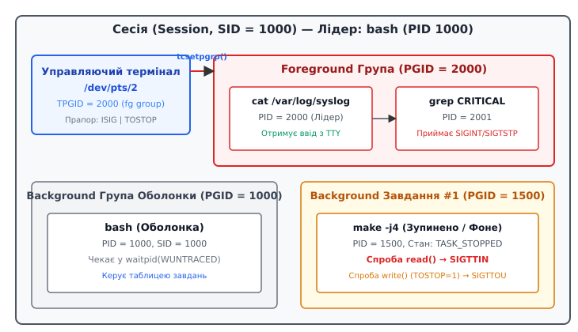

# Керування завданнями: PGID, управляючий термінал, SIGTSTP і сигнальні групи

<preknowlist>
- book:shell-basics
- book:signals
- book:process-tree
</preknowlist>

Коли ми взаємодіємо з Unix-системами, найчастіше це відбувається через оболонку (shell). Ми вводимо команди, запускаємо програми і чекаємо на результат. Однак, що робити, коли програма, яка виконується просто зараз, раптом "зависає" чи просто працює занадто довго? Або коли ми хочемо запустити кілька довгих завдань і час від часу перемикатися між ними без необхідності відкривати нові вікна термінала? Саме цю проблему вирішує механізм **керування завданнями (job control)**.

Керування завданнями — це складна й елегантна взаємодія між ядром операційної системи, драйвером термінала та командною оболонкою. Вона дозволяє користувачеві зупиняти працюючі процеси, переводити їх на задній план (у фоновий режим), повертати назад на передній план і контролювати, хто саме має право зчитувати з клавіатури і писати на екран. Щоб зрозуміти, як саме `Ctrl+Z` зупиняє програму, а команди `fg` та `bg` нею керують, ми маємо зануритися у внутрішні структури ядра: групи процесів, сесії та управляючий термінал.

## Анатомія завдання: Групи процесів (PGID)

У базовій моделі процесів кожен процес має свій унікальний ідентифікатор `PID` (Process ID) та знає ідентифікатор свого батька `PPID` (Parent Process ID). Проте для командної оболонки цієї ієрархії недостатньо. 

Коли ми виконуємо команду в оболонці, це рідко буває один самостійний процес. Найчастіше це так званий конвеєр (pipeline), де кілька процесів працюють паралельно, з'єднані між собою:

```bash
cat large_file.log | grep "error" | sort | uniq -c
```

Якщо користувач вирішить зупинити цю операцію, натиснувши `Ctrl+C`, він очікує, що зупиняться **всі** чотири процеси. Якби сигнал `SIGINT` (Interrupt) було надіслано лише першому процесу (`cat`), він би завершився, але `grep`, `sort` і `uniq` залишилися б висіти в пам'яті, чекаючи на дані, які ніколи не надійдуть (або завершилися б набагато пізніше через закриття каналу).

Щоб вирішити цю проблему універсально, POSIX впроваджує концепцію **груп процесів (Process Groups)**. Кожен процес належить до певної групи процесів, яка ідентифікується **PGID** (Process Group ID). 

Коли оболонка створює новий конвеєр, вона об'єднує всі процеси цього конвеєра в одну групу. Системний виклик `setpgid(pid, pgid)` дозволяє змінити групу процесу. Зазвичай, першому процесу в конвеєрі призначається `PGID`, який дорівнює його власному `PID`. Цей процес стає **лідером групи**. Усі наступні процеси конвеєра додаються до цієї ж групи.

### Чому обоє викликають setpgid()

Під час створення нового процесу в конвеєрі оболонка виконує класичний патерн `fork()` → `exec()`. Виникає стан гонки (race condition): хто повинен встановити `PGID` для нового процесу — сама оболонка чи щойно створений нащадок?
Якщо це зробить лише нащадок, оболонка може встигнути спробувати надіслати сигнал цій групі ще до того, як нащадок добереться до виклику `setpgid()`. 
Якщо це зробить лише оболонка, нащадок може встигнути викликати `exec()` і почати виконувати нову програму (яка спробує змінити налаштування термінала), тоді як оболонка ще не встигла перевести його в потрібну групу.

Розв'язок у Unix завжди один: **це роблять обидва**. І батько (оболонка), і нащадок одразу після `fork()` викликають `setpgid()`. Ядро просто ігнорує другий виклик, якщо група вже встановлена, що гарантує уникнення гонки.

## Сесії (SID) та Управляючий термінал (Controlling Terminal)

Групи процесів об'єднуються у ще більшу структуру — **сесію (Session)**. Сесія ідентифікується `SID` (Session ID). Коли ви відкриваєте нове вікно емулятора термінала або підключаєтесь через SSH, для вас створюється нова сесія, і оболонка стає лідером цієї сесії.

Найважливіша характеристика сесії — її зв'язок із пристроєм введення/виведення, який називається **управляючим терміналом (Controlling Terminal)** (зазвичай це щось на кшталт `/dev/pts/1`).
Управляючий термінал — це єдина точка взаємодії користувача з усіма процесами сесії. Але якщо всі процеси мають доступ до одного термінала, хто з них отримує введення з клавіатури?

Для вирішення конфліктів драйвер термінала впроваджує фундаментальне правило: **У будь-який момент часу лише одна група процесів у сесії є групою переднього плану (Foreground Process Group)**.
Всі інші групи в цій сесії вважаються фоновими (Background).



Коли ви просто дивитесь на запрошення (prompt) оболонки і вводите текст, групою переднього плану є сама оболонка. Коли ви запускаєте команду (наприклад, конвеєр компіляції), оболонка переводить створену групу на передній план за допомогою спеціального системного виклику.

### Роль tcsetpgrp()

Функція `tcsetpgrp(fd, pgid)` — це інструмент, за допомогою якого лідер сесії (оболонка) каже драйверу термінала, яка саме група віднині є "володарем" термінала (foreground).

Життєвий цикл виконання команди в оболонці виглядає так:
1. Оболонка отримує від вас команду (наприклад, `make`).
2. Вона створює новий процес (`fork`), встановлює йому нову групу (`setpgid`).
3. Оболонка передає термінал новій групі, викликаючи `tcsetpgrp(tty_fd, new_pgid)`.
4. Оболонка викликає `wait()` і засинає, чекаючи на завершення або зупинку цього завдання.
5. `make` працює у foreground. Якщо ви натиснете `Ctrl+C`, драйвер термінала надішле сигнал `SIGINT` усім процесам групи `new_pgid`.
6. Коли `make` завершується, ядро будить оболонку.
7. Оболонка негайно викликає `tcsetpgrp(tty_fd, shell_pgid)`, повертаючи термінал **собі**. Тільки після цього вона виводить нове запрошення на екран.

## Магія клавіатури: SIGINT, SIGQUIT та SIGTSTP

Однією з головних функцій драйвера термінала є трансляція певних натискань клавіатури (escape-послідовностей) у **сигнали**. Коли прапорець `ISIG` (Generate Signals) увімкнено в налаштуваннях термінала, натискання спеціальних комбінацій не передаються програмі як звичайні байти, а перехоплюються ядром.

Ядро формує сигнал і надсилає його **усім процесам у поточній foreground групі**:
- **`Ctrl+C` (INTR):** Генерує сигнал `SIGINT`. Його standard дія — завершення процесу. Використовується для переривання програми, яка вийшла з-під контролю.
- **`Ctrl+\` (QUIT):** Генерує сигнал `SIGQUIT`. Він не лише завершує процес, але й змушує ядро створити *core dump* — знімок пам'яті для подальшого аналізу в зневаджувачі (debugger).
- **`Ctrl+Z` (SUSP):** Генерує сигнал `SIGTSTP` (Terminal Stop). Це найважливіший сигнал для керування завданнями. Він не вбиває процес, а **зупиняє його виконання**, переводячи процес у стан `Stopped` (літера `T` в утилітах `top` або `ps`).

Фонові групи процесів **не отримують** ці сигнали. Тому ви можете сміливо натискати `Ctrl+C` для завершення програми, що працює зараз, не боячись, що це вплине на фонові завдання.

## Призупинення та відновлення: fg, bg, jobs

Що відбувається, коли ви натискаєте `Ctrl+Z` під час довгого компілювання? 
Драйвер термінала надсилає `SIGTSTP` усім процесам групи компілятора. Ядро зупиняє їх планування (вони більше не отримують процесорний час). 

Оскільки стан процесів змінився, ядро будить оболонку, яка чекала у `wait()`. Оболонка аналізує статус, бачить, що її нащадків зупинено (а не вбито). Далі відбувається стандартна процедура:
1. Оболонка повертає термінал собі через `tcsetpgrp()`.
2. Вона записує інформацію про це завдання (job) у свою внутрішню таблицю (тепер це, наприклад, Job #1).
3. Виводить на екран `[1]+  Stopped  make` і нове запрошення.

Внутрішні команди оболонки (`built-ins`) існують саме для маніпуляцій з цією таблицею завдань:
- **`jobs`**: Виводить вміст таблиці завдань оболонки. Вона показує, які завдання працюють у фоні (`Running`), а які призупинені (`Stopped`).
- **`bg %1` (Background)**: Оболонка надсилає сигнал **`SIGCONT`** (Continue) групі процесів завдання №1. Цей сигнал наказує ядру розбудити процеси і знову додати їх до черги планувальника. Завдання продовжує роботу, але **без** передачі йому термінала (воно працює у фоні). Оболонка одразу виводить запрошення, не викликаючи `wait()`.
- **`fg %1` (Foreground)**: Оболонка передає управляючий термінал групі завдання №1 через `tcsetpgrp()`, потім надсилає їм `SIGCONT`, щоб розбудити їх, і врешті-решт викликає `wait()`, чекаючи на їхнє завершення. Завдання знову стає foreground.

Важливий нюанс: якщо ви запустили процес одразу у фоні (додавши амперсанд `&` у кінці команди, напр. `sleep 100 &`), оболонка створює нову групу, запускає процес, але **не викликає** `tcsetpgrp()`. Термінал залишається в оболонки, а команда тихо працює у фоні з самого початку.

## Захист Термінала: SIGTTIN та SIGTTOU

Якщо у нас є фонові процеси, виникає природна загроза конфлікту вводу/виводу. Що станеться, якщо процес у фоновій групі спробує прочитати дані з термінала (зробити `read` зі `stdin`)?

Якби ядро дозволило це зробити, виник би абсолютний хаос. Ви намагаєтеся ввести команду в оболонку, але якийсь байт перехоплює фоновий процес, а інший байт — оболонка. Це призвело б до непередбачуваної поведінки.

Щоб запобігти цьому, ядро суворо контролює доступ. Якщо процес, що **не належить** до foreground групи, робить `read()` з управляючого термінала, драйвер термінала негайно надсилає сигнал **`SIGTTIN`** (Terminal input for background process) усій його групі. 
За замовчуванням `SIGTTIN` **зупиняє** процеси (як і `SIGTSTP`). Оболонка помітить це, поверне вам керування і повідомить: `Stopped (tty input)`. Якщо програмі дійсно потрібно отримати ваш ввід, єдиний спосіб — перевести її у foreground командою `fg`.

А що з виведенням тексту (`write()`) на екран?
Цікаво, що POSIX за замовчуванням **дозволяє** фоновим процесам писати на термінал. Ви, напевно, бачили ситуації, коли ви вводите команду, а якийсь фоновий процес раптом виводить свої логи, розриваючи текст, який ви друкуєте. Це вважається допустимим, оскільки не порушує цілісність вводу, хоча й дратує візуально.

Однак ви можете заборонити і це, увімкнувши прапорець **TOSTOP** (Terminal Output Stop) у налаштуваннях термінала:
```bash
stty tostop
```
Якщо `TOSTOP` увімкнено, будь-яка спроба фонового процесу записати щось на екран або змінити налаштування термінала (`tcsetattr`) згенерує сигнал **`SIGTTOU`** (Terminal output for background process). Група процесів буде негайно зупинена з повідомленням `Stopped (tty output)`, і чекатиме, поки ви зробите її foreground.

## Сироти й SIGHUP: Захист від втрати термінала

Остання важлива частина пазлу керування завданнями — що відбувається, коли сесія завершується?
Якщо ви закриєте вікно термінала або розірвете SSH-з'єднання, пристрій термінала закривається. Драйвер виявляє це і надсилає сигнал **`SIGHUP`** (Hangup) лідеру сесії (вашій оболонці).

Коли оболонка отримує `SIGHUP`, її стандартна поведінка — завершити свою роботу. Проте, перед тим як померти, оболонка проходить по своїй таблиці завдань і надсилає `SIGHUP` усім процесам, які вона породила. Це гарантує, що разом із вами завершаться і ваші фонові конвеєри, не перетворюючись на сміття в пам'яті сервера.
Після надсилання `SIGHUP` зупиненим завданням оболонка також надсилає їм `SIGCONT`, оскільки зупинений процес не може обробити `SIGHUP` (він не планується). `SIGCONT` будить його, і перше, що він бачить — сигнал відключення, який його вбиває.

### Орфанні групи процесів (Orphaned Process Groups)

Іноді розрив зв'язку відбувається аварійно: оболонка помирає (наприклад, її вбили через `kill -9`), не встигнувши надіслати `SIGHUP` своїм нащадкам. У цьому випадку нащадки залишаються у фоні. Їхня група процесів стає **орфанною (сиротою)**.

У POSIX група процесів вважається орфанною, якщо жоден процес у ній не має батька в **іншій** групі в тій самій сесії. Грубо кажучи: лідер сесії помер, і в цій групі не лишилося нікого, хто міг би "прозвітувати" про свій стан комусь вище в цій сесії.

Чому ядро відстежує цей стан? Проблема в **зупинених процесах**. Якщо група стає орфанною, і в ній є хоча б один процес у стані `Stopped` (зупинений через `SIGTSTP`), він ніколи не зможе прокинутися, бо немає оболонки, яка могла б надіслати йому `SIGCONT` (немає кому викликати `fg`). Це був би вічний витік ресурсів.

Тому POSIX гарантує: у момент, коли група стає орфанною, якщо в ній є зупинені процеси, ядро автоматично надсилає всім членам цієї групи **SIGHUP**, а одразу за ним — **SIGCONT**.
Це означає: "Ваш єдиний зв'язок із користувачем втрачено, і нікому вас розбудити. Ви повинні завершитись". Більшість процесів помирають від `SIGHUP`. Якщо ж процес спеціально перехоплює `SIGHUP` (через `nohup` або власний обробник), він прокидається і продовжує працювати без термінала, стаючи повноцінним демоном.

## Підсумок

Керування завданнями — це приклад того, як потужно спроєктована архітектура Unix. Кожна частина системи робить лише свою роботу, але їхня комбінація дає гнучкий інструмент:
- **Ядро** створює абстракцію груп процесів (PGID), гарантує доставку сигналів і захищає від сиріт (Orphaned Process Groups).
- **Термінал** відстежує "власника" екрана через `tcsetpgrp` і генерує `SIGTSTP`/`SIGINT` лише для нього, блокуючи конфлікти через `SIGTTIN`/`SIGTTOU`.
- **Оболонка (Shell)** виступає як диригент: маніпулює групами, ловить статуси від ядра через `wait()` і надає зручний інтерфейс (`fg`, `bg`, `jobs`) для користувача.

Розуміння цієї взаємодії дозволяє розробникам писати надійні консольні застосунки (наприклад, текстові редактори на кшталт `vim`, які мають правильно перехоплювати й обробляти `SIGTSTP`), а системним адміністраторам — майстерно керувати десятками завдань на віддалених серверах.
