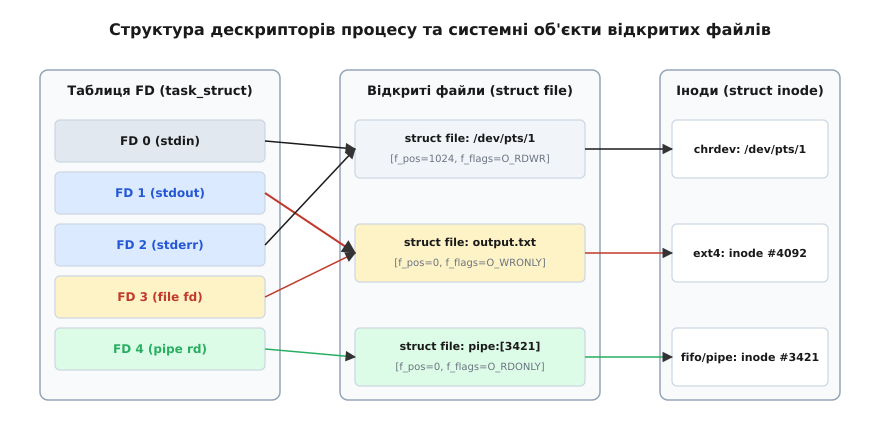
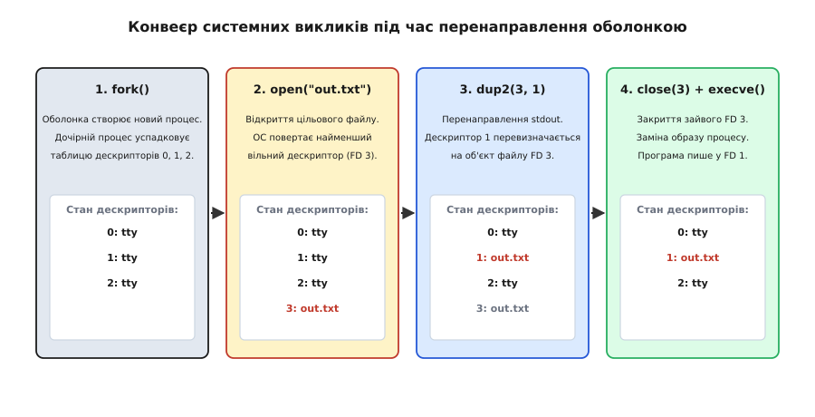

# Перенаправлення як робота з дескрипторами: dup2, таблиці ядра та механіка потоків

<preknowlist>
- [Три потоки: stdin, stdout, stderr](topic:unix-linux/standard-streams) — призначення стандартних файлових дескрипторів 0, 1 та 2.
- [Системний виклик: як програма просить ядро](topic:unix-linux/syscall-mechanics) — механіка системних викликів, перехід у простір ядра та ресурси процесів.
</preknowlist>

Коли у командному рядку запускається комбінація утиліт на кшталт `grep "ERROR" < app.log > filtered.log 2>&1`, операційна система виконує серію прозорих маніпуляцій з внутрішніми структурами даних процесів. Програми `grep` або `cat` взагалі не знають, звідки надходять вхідні байти і куди відправляються результати. Вони не містять коду для відкриття дискових файлів чи розпізнавання типів терміналів — увесь цей зв'язок будується оболонкою ще до того, як перша інструкція цільової утиліти буде виконана процесором.

В основі цієї універсальності лежить механізм **перенаправлення введення-виведення** (I/O redirection). За простими символами `<`, `>`, `>>` та `2>&1` ховається елегантна дворангова система абстракцій ядра Linux: **файлові дескриптори** та **системний виклик `dup2`**.

---

## 1. Першопричина: чому процеси не знають про файли

У перших операційних системах 1960-х років кожна програма мала безпосередньо містити виклики драйверів конкретних фізичних пристроїв: зчитувачів перфокарт, стрічкових накопичувачів чи алфавітно-цифрових друкарок. Зміна пристрою вимагала або перекомпіляції коду, або використання складних операторів керування завданнями.

Філософія Unix змінила цей підхід, висунувши постулат: **для програми будь-який потік даних має виглядати як послідовність байтів**, доступна через мале ціле число — **файловий дескриптор** (file descriptor, FD).

Програма не працює з файловою системою, дисковими блоками чи драйвером відеокарти напряму. Замість цього вона просить ядро: «прочитай байти з дескриптора 0» або «запиши байти у дескриптор 1». Яке саме джерело чи приймач стоїть за цими номерами — дисковий файл ext4, символьний пристрій псевдотермінала `/dev/pts/1`, анонімний канал `pipe` чи мережевий сокет — вирішує ядро операційної системи.

Кожен новий процес у Unix за домовленістю успадковує від батьківського процесу три стандартні дескриптори:

*   **0 (`STDIN_FILENO`, Standard Input)**: Стандартне джерело введення даних (за замовчуванням — клавіатура термінала).
*   **1 (`STDOUT_FILENO`, Standard Output)**: Стандартний приймач нормального виведення (за замовчуванням — дисплей термінала).
*   **2 (`STDERR_FILENO`, Standard Error)**: Стандартний приймач діагностичних повідомлень та помилок (за замовчуванням — той самий дисплей термінала).

Той факт, що `stdout` (1) та `stderr` (2) початково відображаються на один і той самий фізичний екран, але є **різними дескрипторами в таблиці процесу**, відкриває можливість розділяти або об'єднувати ці потоки за допомогою інструментів оболонки.

Детальний опис еволюції цієї ідеї — від перфокарт до уніфікованих дескрипторів — наведено у вставці [📜 Вставка: історія виникнення концепції перенаправлення](topic:unix-linux/redirection-model/hist-io-redirection.md).

---

## 2. Трьохрівнева анатомія дескрипторів у ядрі Linux

Щоб зрозуміти, як відбувається перенаправлення, необхідно розглянути внутрішню організацію збереження стану відкритих файлів у ядрі Linux. Існує поширена помилкова думка, що файловий дескриптор є безпосереднім вказівником на файл на диску. Насправді ядро підтримує трирівневу ієрархію структур даних.


*Морфологія файлових дескрипторів: дескриптори процесу вказують на відкриті файли у ядрі, де зберігаються зміщення та прапорці.*

### Рівень 1: Таблиця дескрипторів процесу (`struct files_struct`)

У структурі керування процесом `task_struct` (ядерний дескриптор процесу) міститься вказівник `files` на структуру `struct files_struct`. У цій структурі зберігається масив вказівників `fd_array` (або динамічна таблиця `fdtable`).

Індексом у цьому масиві є сам **файловий дескриптор** (ціле число 0, 1, 2, 3...). Елемент масиву під індексом `K` містить вказівник на об'єкт відкритого файлу третього рівня (`struct file*`). Окремо для кожного дескриптора на цьому рівні зберігається битова маска прапорців дескриптора — зокрема прапорець **close-on-exec** (`FD_CLOEXEC`).

### Рівень 2: Системна таблиця відкритих файлів (`struct file`)

Елемент таблиці дескрипторів процесу вказує на об'єкт `struct file` (загальносистемна таблиця відкритих файлів / Open File Description Table). Цей об'єкт створюється ядром під час кожного системного виклику `open()` або `pipe()`.

Об'єкт `struct file` зберігає динамічний стан конкретного сеансу роботи з файлом:
*   **`f_pos` (File Offset)**: Поточна позиція зміщення у байтах для наступного читання або запису.
*   **`f_flags` (File Status Flags)**: Прапорці статусу відкритого файлу (`O_RDONLY`, `O_WRONLY`, `O_APPEND`, `O_NONBLOCK`).
*   **`f_count` (Reference Count)**: Лічильник посилань. Показує, скільки дескрипторів у різних (або одному) процесах вказують на цей системний об'єкт `struct file`.
*   **`f_op`**: Вказівник на таблицю методів операцій (`read`, `write`, `poll`, `ioctl`), специфічних для даного типу файлу чи пристрою.

### Рівень 3: Інода віртуальної файлової системи VFS (`struct inode`)

Об'єкт `struct file` посилається на `struct inode` — конкретну сутність файлової системи або пристрою. Інода містить метадані об'єкта: розмір у байтах, права доступу, ідентифікатор власника, номери фізичних блоків на диску або внутрішні буфери пристрою.

### Чому ця трирівневість важлива

Розділення прапорців дескриптора (`FD_CLOEXEC`), поточної позиції (`f_pos`) та метаданих файлу (`struct inode`) пояснює ключові властивості поведінки процесів у Unix:

1.  **Спільне зміщення при `fork()`**: Коли процес викликає `fork()`, дочірній процес отримує копію таблиці дескрипторів (Рівень 1). Однак вказівники у цій таблиці посилаються на **ті самі системні об'єкти `struct file`** (Рівень 2). Оскільки лічильник `f_count` збільшується на 1, а об'єкт `struct file` залишається спільним, батьківський та дочірній процеси ділять одну й ту саму позицію `f_pos`. Якщо один процес прочитає 100 байтів, позиція зміститься і для другого процесу!
2.  **Незалежні зміщення при окремих `open()`**: Якщо два різних процеси (або один процес двічі) відкриють один і той самий файл через `open("data.txt")`, ядро створить **два різних об'єкти `struct file`**, які посилатимуться на одну й ту саму іноду `struct inode`. Кожен сеанс матиме власне незалежне зміщення `f_pos`.

---

## 3. Системні виклики dup(), dup2() та dup3(): клонування вказівників

Першопричиною перенаправлення потоків у командному рядку є можливість маніпулювати вказівниками у таблиці дескрипторів процесу (Рівень 1). За це відповідає сімейство системних викликів `dup`.

### Механіка системного виклику `dup()`

Системний виклик `dup(oldfd)` приймає існуючий відкритий дескриптор `oldfd` і шукає **найменший вільний індекс** у таблиці дескрипторів процесу:

:::tabs
```c
#include <unistd.h>

int newfd = dup(oldfd);
```
```cpp
#include <unistd.h>
#include <system_error>

int newfd = ::dup(oldfd);
```
:::

Ядро копіює вказівник `struct file*` з комірки `oldfd` у комірку `newfd` та збільшує лічильник посилань `f_count` у `struct file` на 1. В результаті обидва дескриптори (`oldfd` та `newfd`) посилаються на один і той самий відкритий файл.

### Атомарне копіювання через `dup2()`

Для перенаправлення стандартних потоків потрібно встановити вказівник на потрібне конкретне місце — наприклад, зробити так, щоб дескриптор 1 (stdout) вказував на щойно відкритий дисковий файл (дескриптор 3).

Виклик `dup(oldfd)` не гарантує, що новий дескриптор буде саме номером 1. Для цього використовується системний виклик `dup2(oldfd, newfd)`:

:::tabs
```c
#include <unistd.h>

int result = dup2(oldfd, newfd);
```
```cpp
#include <unistd.h>
#include <system_error>

int result = ::dup2(oldfd, newfd);
```
:::

Сигнатура та алгоритм роботи `dup2` у ядрі підпорядковуються суворим правилам:

1.  **Атомарне закриття цільового FD**: Якщо дескриптор `newfd` був відкритий (наприклад, дескриптор 1 початково вказує на термінал), ядро мовчки і атомарно закриває `newfd`.
2.  **Копіювання вказівника**: Елемент масиву дескрипторів під номером `newfd` стає рівним вказівнику з елемента `oldfd`. Лічильник посилань `f_count` відповідного `struct file` збільшується.
3.  **Спеціальний випадок `oldfd == newfd`**: Якщо `oldfd` та `newfd` рівні і `oldfd` є дійсним дескриптором, `dup2` просто повертає `newfd` без закриття та жодних змін. Якщо ж `oldfd` є недійсним, повертається помилка `-1` (`EBADF`).

```
Перед dup2(3, 1):
FD Table:
  0 ──> struct file (/dev/pts/1)
  1 ──> struct file (/dev/pts/1)
  2 ──> struct file (/dev/pts/1)
  3 ──> struct file (output.txt)

Після dup2(3, 1):
FD Table:
  0 ──> struct file (/dev/pts/1)
  1 ──> struct file (output.txt)   <── [dup2 замінив вказівник!]
  2 ──> struct file (/dev/pts/1)
  3 ──> struct file (output.txt)
```

### Прапорець `O_CLOEXEC` та виклик `dup3()`

У багатопотокових програмах виклик `dup2()` створює потенційну проблему гонки (race condition). Якщо один потік виконує `dup2()`, а потім планує встановити прапорець `FD_CLOEXEC` через `fcntl()`, інший паралельний потік може викликати `fork()` та `execve()` у цей короткочасний проміжок, через що секретний дескриптор витече у сторонню програму.

Для вирішення цієї проблеми у Linux 2.6.27 з'явився системний виклик `dup3()`:

:::tabs
```c
#define _GNU_SOURCE
#include <unistd.h>
#include <fcntl.h>

int dup3(int oldfd, int newfd, int flags);
```
```cpp
#define _GNU_SOURCE
#include <unistd.h>
#include <fcntl.h>
#include <system_error>

int res = ::dup3(oldfd, newfd, O_CLOEXEC);
```
:::

Аргумент `flags` приймає прапорець `O_CLOEXEC`, що дозволяє атомарно закрити `newfd`, скопіювати дескриптор та встановити прапорець close-on-exec за один нерозривний системний виклик.

Детальну специфікацію всіх системних викликів маніпулювання дескрипторами з кодами помилок та C/C++ прикладами наведено у вставці [📋 Вставка: системні виклики перенаправлення та маніпуляції дескрипторами](topic:unix-linux/redirection-model/api-redirection-syscalls.md).

---

## 4. Життєвий цикл перенаправлення в оболонці (fork-dup2-exec)

Тепер розглянемо, як саме командна оболонка поєднує виклики `fork()`, `open()`, `dup2()`, `close()` та `execve()` при виконанні звичайного перенаправлення:

```bash
sort < unsorted.txt > sorted.txt
```

Послідовність дій оболонки розгортається у чіткий конвеєр:


*Життєвий цикл дочірнього процесу оболонки: підготовка дескрипторів до передачі контролю цільовій програмі.*

### Покроковий алгоритм оболонки

1.  **Створення дочірнього процесу (`fork`)**: Оболонка викликає `fork()`. Батьківський процес отримує PID дочірнього процесу і зупиняється у системному виклику `waitpid()`. Дочірній процес продовжує виконання з повною копією таблиці дескрипторів оболонки (FD 0, 1, 2 вказують на термінал).
2.  **Перенаправлення вводу (`< unsorted.txt`)**:
    *   Дочірній процес викликає `int fd_in = open("unsorted.txt", O_RDONLY)`. ОС повертає найменший вільний дескриптор — `FD 3`.
    *   Дочірній процес викликає `dup2(fd_in, 0)`. Тепер `FD 0` (stdin) вказує на об'єкт відкритого файлу `unsorted.txt`.
    *   Дочірній процес викликає `close(fd_in)`. Дескриптор `FD 3` закривається. Це **критично важливо**: дескриптор 0 продовжує вказувати на файл, а тимчасовий дескриптор 3 більше не витікає.
3.  **Перенаправлення виводу (`> sorted.txt`)**:
    *   Дочірній процес викликає `int fd_out = open("sorted.txt", O_WRONLY | O_CREAT | O_TRUNC, 0644)`. ОС повертає найменший вільний дескриптор — знову `FD 3`.
    *   Дочірній процес викликає `dup2(fd_out, 1)`. Тепер `FD 1` (stdout) вказує на файл `sorted.txt`.
    *   Дочірній процес викликає `close(fd_out)`.
4.  **Заміна образу процесу (`execve`)**:
    *   Дочірній процес викликає `execve("/usr/bin/sort", ["sort", NULL], environ)`.
    *   Ядро замінює кодовий сегмент та стек процесу кодом утиліти `sort`. **Проте таблиця дескрипторів (FD 0, 1, 2) повністю зберігається!**
5.  **Виконання утиліти `sort`**:
    *   Утиліта `sort` починає працювати з першої інструкції `main()`. Вона читає з дескриптора 0 і пише у дескриптор 1. Програма навіть не здогадується, що читає з диска і пише на диск.

Повний виправлений код міні-оболонки мовами C та C++, яка реалізує цей алгоритм, міститься у вставці [⚙️ Вставка: реалізація перенаправлення в міні-оболонці](topic:unix-linux/redirection-model/proj-shell-redirection.md).

---

## 5. Базові оператори перенаправлення: <, >, >> та режими відкриття файлів

Синтаксичні оператори оболонки напряму відображаються на прапорці системного виклику `open()`:

### Перенаправлення введення: `< file`

Оболонка відкриває файл джерела у режимі лише для читання:

:::tabs
```c
int fd = open("file", O_RDONLY);
dup2(fd, STDIN_FILENO);
close(fd);
```
```cpp
int fd = ::open("file", O_RDONLY);
::dup2(fd, STDIN_FILENO);
::close(fd);
```
:::

Якщо файл не існує або немає прав на читання, виклик `open()` повертає `-1`, оболонка виводить помилку і припиняє виконання без виклику `execve`.

### Перенаправлення виведення зі перезаписом: `> file`

Оболонка відкриває цільовий файл із трьома прапорцями:

:::tabs
```c
int fd = open("file", O_WRONLY | O_CREAT | O_TRUNC, 0644);
dup2(fd, STDOUT_FILENO);
close(fd);
```
```cpp
int fd = ::open("file", O_WRONLY | O_CREAT | O_TRUNC, 0644);
::dup2(fd, STDOUT_FILENO);
::close(fd);
```
:::

*   `O_WRONLY`: Відкриття для запису.
*   `O_CREAT`: Створення файлу, якщо він ще не існував на диску.
*   `O_TRUNC`: **Обрізання файлу до нульової довжини**. Якщо файл уже існував і містив дані, ядро негайно видаляє весь його вміст у момент виклику `open()`, ще до виконання самісінької команди!

> ⚠️ **Пастка обрізання файлу:**
> Спроба прочитати з файлу і записати у той самий файл через `cat file.txt > file.txt` призведе до **повної втрати даних**. Оболонка відкриє `file.txt` з прапорцем `O_TRUNC` і обріже його до 0 байтів *до того*, як утиліта `cat` встигне прочитати хоча б один байт.

### Дописування у кінець файлу: `>> file`

Оператор `>>` використовує прапорець `O_APPEND` замість `O_TRUNC`:

:::tabs
```c
int fd = open("file", O_WRONLY | O_CREAT | O_APPEND, 0644);
dup2(fd, STDOUT_FILENO);
close(fd);
```
```cpp
int fd = ::open("file", O_WRONLY | O_CREAT | O_APPEND, 0644);
::dup2(fd, STDOUT_FILENO);
::close(fd);
```
:::

### Атомарність `O_APPEND` на рівні ядра

Прапорець `O_APPEND` має фундаментальну особливість. Якщо декілька паралельних процесів (наприклад, п'ять веб-серверів) пишуть в один і той самий лог-файл `app.log`, кожен запис через `write()` з прапорцем `O_APPEND` виконується **атомарно на рівні ядра**.

Перед виконанням кожного запису ядро під внутрішнім блокуванням іноди (`f_lock`) автоматично встановлює поточне зміщення `f_pos` на актуальний кінець файлу.

Якщо ж спробувати зробити це вручну через `lseek(fd, 0, SEEK_END)` та наступний `write(fd, buf, len)`, між двома викликами виникне стан гонки: один процес може записати дані після `lseek` другого процесу, і другий процес перезапише дані першого. Прапорець `O_APPEND` усуває цю проблему.

---

## 6. Злиття потоків, 2>&1 та аналіз порядку обробки зліва направо

Для відправки діагностичних повідомлень про помилки (`stderr`, FD 2) у той самий файл, куди направляється стандартне виведення (`stdout`, FD 1), використовується синтаксис **дублювання дескрипторів**: `2>&1`.

Конструкція `N>&M` означає: «зроби так, щоб дескриптор N вказував туди ж, куди зараз вказує дескриптор M». У коді оболонки це виконується викликом `dup2(M, N)`.

### Критична важливість порядку операторів!

Оболонка обробляє оператори перенаправлення строго **зліва направо**. Зміна порядку операторів докорінно змінює результат.

Розглянемо два випадки:

#### Правильний варіант: `cmd > output.txt 2>&1`

1.  Оболонка бачить `> output.txt`. Вона відкриває `output.txt` (`FD 3`) і робить `dup2(3, 1)`.
    *   `FD 1` тепер вказує на `struct file (output.txt)`.
2.  Оболонка бачить `2>&1`. Вона робить `dup2(1, 2)`.
    *   `FD 2` бере вказівник з `FD 1` і тепер також вказує на `struct file (output.txt)`.
3.  **Результат**: І `stdout` (1), і `stderr` (2) пишуть у файл `output.txt`.

#### Неправильний варіант: `cmd 2>&1 > output.txt`

1.  Оболонка бачить `2>&1`. Вона робить `dup2(1, 2)`.
    *   У цей момент `FD 1` усе ще вказує на **термінал** (`/dev/pts/1`).
    *   Отже, `FD 2` отримує вказівник на термінал.
2.  Оболонка бачить `> output.txt`. Вона відкриває файл (`FD 3`) і робить `dup2(3, 1)`.
    *   `FD 1` тепер вказує на `output.txt`.
3.  **Результат**: `stdout` (1) іде у файл `output.txt`, але `stderr` (2) продовжує виводитися на екран термінала!

```
Аналіз стану FD для 'cmd 2>&1 > output.txt':

Початковий стан:
  FD 1 ──> /dev/pts/1 (термінал)
  FD 2 ──> /dev/pts/1 (термінал)

Після 2>&1 (dup2(1, 2)):
  FD 1 ──> /dev/pts/1 (термінал)
  FD 2 ──> /dev/pts/1 (термінал)  [скопійовано вказівник на термінал]

Після > output.txt (dup2(3, 1)):
  FD 1 ──> output.txt             [перенаправлено у файл]
  FD 2 ──> /dev/pts/1 (термінал)  [залишився на терміналі!]
```

Сучасні оболонки (Bash, Zsh) підтримують скорочений синтаксис `&> file` або `>& file`, який є еквівалентом `> file 2>&1`.

---

## 7. Маніпулювання довільними дескрипторами та трюк обміну stdout і stderr

Оболонка дозволяє працювати з будь-якими номерами дескрипторів (0...9 у POSIX shell). Для цього перед оператором вказується номер дескриптора.

### Створення та закриття тимчасових дескрипторів

*   `3> data.db` — відкрити файл і призначити його дескриптору 3.
*   `3<&-` — закрити дескриптор 3 (`close(3)`).
*   `exec 3> log.txt` — відкрити файл у дескрипторі 3 для **поточного процесу оболонки** (усі наступні команди можуть писати в FD 3).

### Класична задача: обмін місцями stdout та stderr

Уявімо задачу: потрібно передати через конвеєр `|` далі за течією лише повідомлення про помилки (`stderr`), а нормальне виведення (`stdout`) при цьому вивести на екран термінала.

Оскільки конвеєр `|` зв'язує лише дескриптор 1 першої команди з дескриптором 0 другої команди, нам потрібно поміняти місцями дескриптори 1 та 2.

За аналогією з обміном значень двох змінних через третю тимчасову змінну (`temp = a; a = b; b = temp`), для обміну дескрипторів потрібен третій тимчасовий дескриптор (наприклад, FD 3):

```bash
cmd 3>&1 1>&2 2>&3 3>&- | process_errors
```

Простежимо роботу системних викликів у дочірньому процесі зліва направо:

1.  `3>&1` (`dup2(1, 3)`): Створюється дескриптор 3, який бере вказівник з FD 1 (початковий `stdout`, підключений до каналу `pipe`).
2.  `1>&2` (`dup2(2, 1)`): Дескриптор 1 перевизначається вказівником з FD 2 (`stderr`, підключений до термінала). Тепер `stdout` іде на термінал.
3.  `2>&3` (`dup2(3, 2)`): Дескриптор 2 перевизначається вказівником з FD 3 (оригінальний `stdout`, що вказує на `pipe`). Тепер `stderr` іде в конвеєр.
4.  `3>&-` (`close(3)`): Закривається тимчасовий дескриптор 3, щоб не залишати витоків.

В результаті програма `cmd` пише свої помилки в конвеєр для `process_errors`, а свій нормальний результат — на екран термінала.

---

## 8. Вбудований документ (Here-Document <<EOF) та вбудований рядок (Here-String <<<)

У багаторядкових Bash-скриптах часто використовується синтаксис вбудованого документа (Here-Document) для передачі текстового блоку у `stdin` програми без створення зовнішніх файлів на диску:

```bash
cat <<EOF > config.json
{
  "server": "localhost",
  "port": 8080
}
EOF
```

### Внутрішній механізм виконання оболонкою

Коли оболонка зустрічає оператор `<<EOF`, вона реалізує передачу даних одним із двох способів залежно від версії ОС та розміру тексту:

1.  **Створення анонімного каналу `pipe()`**: Оболонка створює pipe, у записальний кінець якого відправляє увесь текст документу до мітки `EOF`. Потім вона дублює читальний кінець у дескриптор 0 (`dup2(pipe_read, 0)`) і викликом `execve()` запускає програму.
2.  **Створення тимчасового безназваного файлу через `memfd_create()` або `O_TMPFILE`**: Для великих текстових блоків оболонка виділяє анонімний оперативний файл у пам'яті через виклик `memfd_create()`, записує туди вміст, зміщує позицію у початок `lseek(fd, 0, SEEK_SET)` і перенаправляє дескриптор 0 на цей файл.

Синтаксис `<<< "string"` (Here-String) працює аналогічно, але відправляє в `stdin` один вказаний рядок.

---

## 9. Підміна процесів (Process Substitution: <(cmd) та >(cmd))

Часто виникає потреба передати результат виконання команди програмі, яка не вміє читати зі стандартного вводу `stdin`, а вимагає вказати шлях до файлу в аргументах командного рядка (наприклад, утиліти `diff`, `cmp` або `wireshark`).

Для цього у Bash та Zsh існує механізм **підміни процесів**: `<(command)` та `>(command)`.

Приклад порівняння списку файлів у двох каталогах:
```bash
diff <(ls dir1) <(ls dir2)
```

### Що відбувається під капотом

Коли оболонка зустрічає синтаксис `<(ls dir1)`, вона виконує наступну складну серію дій:

1.  Створює анонімний канал `pipe()` у ядрі. Читальний кінець каналу отримує дескриптор `FD R` (наприклад, 63), а записовий кінець — `FD W`.
2.  Створює дочірній процес через `fork()`, у якому перенаправляє stdout у записовий кінець каналу (`dup2(W, 1)`), після чого запускає утиліту `ls dir1` через `execve()`.
3.  Оболонка підставляє замість конструкції `<(ls dir1)` у командний рядок шлях до псевдофайлу у файловій системі `/dev/fd/`:

```bash
# Те, що насправді запускає оболонка:
diff /dev/fd/63 /dev/fd/64
```

Коли утиліта `diff` викликає системний виклик `open("/dev/fd/63", O_RDONLY)`, ядро Linux розпізнає спеціальну файлову систему `procfs`/`devtmpfs` і повертає новий дескриптор, зв'язаний із читальним кінцем відповідного анонімного каналу!

На системах, де `/dev/fd/` відсутній, оболонка створює тимчасові іменовані канали FIFO за допомогою системного виклику `mkfifo()` у каталозі `/tmp/`.

---

## 10. Простеження, інспекція та буферизація перенаправлень у Linux

### Інспекція відкритих файлів через `/proc/[pid]/fd/`

У псевдофайловій системі `procfs` Linux для кожного процесу існує каталог `/proc/<pid>/fd/`. У ньому знаходяться символічні посилання, номери яких відповідають відкритим файловим дескрипторам процесу.

Ви можете проінспектувати дескриптори будь-якого працюючого процесу (наприклад, з PID 4096):

```bash
ls -l /proc/4096/fd
```

Приклад виведення:
```
lrwx------ 1 user user 64 Aug 14 10:00 0 -> /dev/pts/1
l-wx------ 1 user user 64 Aug 14 10:00 1 -> /var/log/app.log
l-wx------ 1 user user 64 Aug 14 10:00 2 -> /var/log/app.log
lr-x------ 1 user user 64 Aug 14 10:00 3 -> /etc/config.json
```

У каталозі `/proc/<pid>/fdinfo/` містяться детальні текстові файли про стан кожного дескриптора (позиція `pos`, прапорці `flags`):

```bash
cat /proc/4096/fdinfo/1
```
```
pos:    1048576
flags:  0100001
mnt_id: 32
ino:    4092
```

### Відстеження системної статистики відкритих файлів у ядра Linux

Параметри системного ліміту файлів інспектуються через вікно `/proc/sys/fs/`:

*   `/proc/sys/fs/file-max`: Загальна максимальна кількість відкритостей для всієї ОС.
*   `/proc/sys/fs/file-nr`: Повертає три числа: кількість виділених наразі дескрипторів відкритих файлів, кількість вільних виділених дескрипторів та максимально припустиме значення.

### Простеження системних викликів через `strace`

Найкращий спосіб побачити механіку перенаправлення «наживо» — це відстежити системні виклики за допомогою утиліти `strace`:

```bash
strace -f -e trace=openat,dup2,close,execve bash -c 'ls > out.txt'
```

У логу ви побачите чітку послідовність системних викликів дочірнього процесу:
```c
openat(AT_FDCWD, "out.txt", O_WRONLY|O_CREAT|O_TRUNC, 0666) = 3
dup2(3, 1)                              = 1
close(3)                                = 0
execve("/usr/bin/ls", ["ls"], 0x7ff...) = 0
```

### Вплив перенаправлення на буферизацію `libc` (stdio)

Один із найбільш неочевидних ефектів перенаправлення — це зміна поведінки буферизації виведення стандартної бібліотеки C (`glibc`).

У стандартній бібліотеці `stdio` (функції `printf`, `puts`, `fwrite`) існує три режими буферизації:

1.  **Небуферизований (Unbuffered)**: Байти негайно передаються ядру через виклик `write()`. Це режим за замовчуванням для `stderr` (FD 2).
2.  **Порядкова буферизація (Line buffered)**: Дані накопичуються у буфері і відправляються у ядро при появі символу нового рядка `\n` або при заповненні буфера. Це режим за замовчуванням для `stdout` (FD 1), **якщо він підключений до термінала**.
3.  **Блочна буферизація (Block / Fully buffered)**: Дані накопичуються до повного заповнення буфера (зазвичай 4096 або 8192 байти) незалежно від наявності `\n`. Це режим за замовчуванням для `stdout` (FD 1), **якщо він перенаправлений у файл або pipe!**

> 🔧 **Наслідок на практиці:**
> Коли ви запускаєте програму на терміналі, її логи з'являються рядок за рядком миттєво. Але як тільки ви перенаправляєте виведення в файл чи конвеєр (`app | grep foo`), `glibc` прозоро перемикає `stdout` у блочний режим. Результати перестають з'являтися у файлі в реальному часі і виводяться порціями по 4 КБ, створюючи ілюзію зависання програми!
> 
> Для відключення блочного буфера використовується утиліта `stdbuf`:
> ```bash
> stdbuf -oL -eL app | grep foo
> ```
> Прапорець `-oL` примусово перемикає `stdout` у порядочний режим буферизації.

---

## 11. Демонізація та закриття успадкованих дескрипторів

Коли процес перетворюється на фоновий системний демон (Daemon), він повинен повністю відновити або закрити зв'язок із управлінням терміналом.

Якщо фоновий демон залишить дескриптори 0, 1 та 2 підключеними до псевдотермінала SSH-сесії, користувач не зможе закрити сеанс зв'язку: SSH-демон чекатиме закриття усіх дескрипторів термінала, утримуваних дочірніми процесами.

Стандартна процедура демонізації передбачає перевизначення усіх трьох стандартних дескрипторів на псевдопристрій «чорної діри» `/dev/null`:

:::tabs
```c
int null_fd = open("/dev/null", O_RDWR);
if (null_fd >= 0) {
    dup2(null_fd, STDIN_FILENO);
    dup2(null_fd, STDOUT_FILENO);
    dup2(null_fd, STDERR_FILENO);
    if (null_fd > STDERR_FILENO) {
        close(null_fd);
    }
}
```
```cpp
int null_fd = ::open("/dev/null", O_RDWR);
if (null_fd >= 0) {
    ::dup2(null_fd, STDIN_FILENO);
    ::dup2(null_fd, STDOUT_FILENO);
    ::dup2(null_fd, STDERR_FILENO);
    if (null_fd > STDERR_FILENO) {
        ::close(null_fd);
    }
}
```
:::

Після цього будь-яке виведення демона у `stdout`/`stderr` мовчки поглинається ядром без помилок, а читання зі `stdin` негайно повертає EOF (0 байтів).

---

## 12. Крайові випадки, ліміти системи та безпека

При роботі з перенаправленням дескрипторів необхідно враховувати системні обмеження та потенційні загрози безпеці:

### Ліміти відкритих дескрипторів (`RLIMIT_NOFILE`)

Кожен процес у Linux має обмеження на максимальну кількість одночасно відкритих файлових дескрипторів.

М'який та жорсткий ліміти можна перевірити командою `ulimit -n`. За замовчуванням м'який ліміт зазвичай дорівнює 1024. У ядрі також існує загальносистемне обмеження на загальну кількість відкритих файлів у всіх процесах, яке задається через параметр `/proc/sys/fs/file-max`.

Якщо процес вичерпує ліміт дескрипторів, системні виклики `open()`, `dup()`, `accept()` або `pipe()` повертають помилку `-1`, а змінна `errno` отримує значення `EMFILE` (Too many open files) або `ENFILE` (Too many open files in system).

### Гонка безпеки у багатопотоковому середовищі

Якщо процес створює тимчасовий дескриптор для дочірньої програми без прапорця `O_CLOEXEC` або без використання `dup3(..., O_CLOEXEC)`, існує ризик витоку конфіденційних дескрипторів (наприклад, відкритих сокетів бази даних або файлів ключів шифрування). Інший потік, який виконає `execve()` у цей момент, передасть усі відкриті дескриптори сторонній утиліті.

### Поведінка при помилках відкриття

Якщо при виконанні перенаправлення `< non_existent_file` відкриття файлу завершується помилкою, оболонка виводить повідомлення у `stderr`, повертає код помилки (зазвичай 1) і **не викликає `fork` / `exec` для цільової команди**. Це захищає систему від запуску програм із некоректним оточенням.

---

## 13. Підсумок

Перенаправлення в Unix — це не просто зручний синтаксичний цукор командного рядка, а фундаментальна архітектурна концепція операційної системи.

Завдяки трирівневій структурі ядерних таблиць (`task_struct` → `struct files_struct` → `struct file` → `struct inode`), прозорому використанню малого цілого числа як дескриптора та атомарному системному виклику `dup2`, оболонка отримує можливість довільно з'єднувати процеси з файлами та анонімними каналами. Програми залишаються простими та універсальними, оскільки оперують стандартними потоками 0, 1, 2 і повністю відчужені від деталей фізичних пристроїв.
