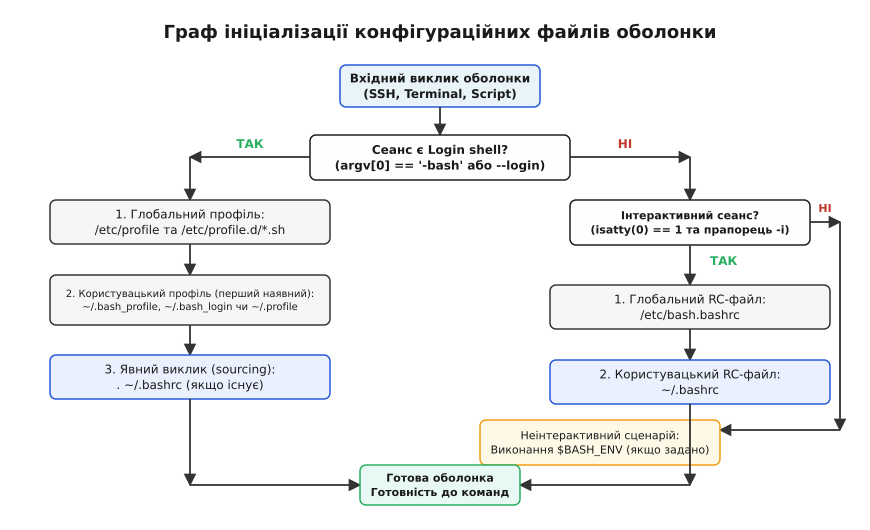
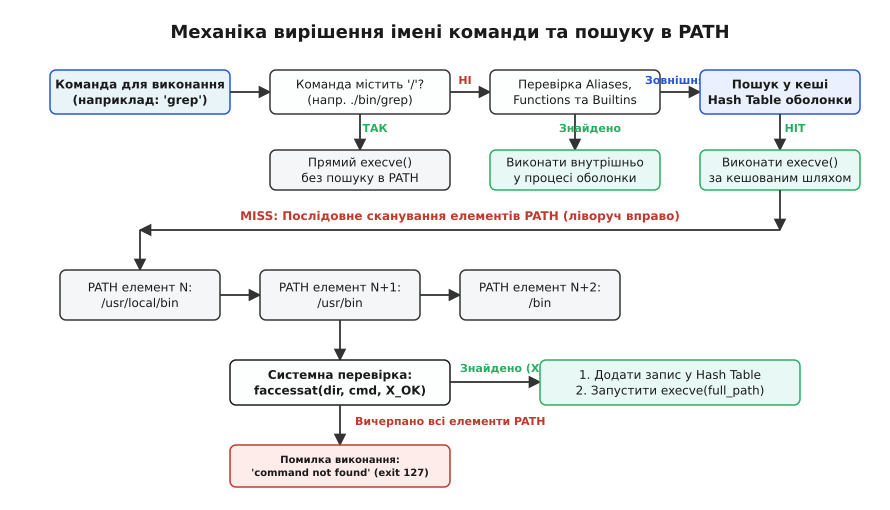

# Оточення сеансу: profile, rc і пошук у PATH

<preknowlist>
- [Аргументи, оточення й що успадковує дитина](book:unix-linux/argv-and-environment) — передача змінних оточення та масиву argv у системний виклик execve.
- [Роль оболонки: між користувачем і ядром](book:unix-linux/shell-role) — оболонка як командний інтерпретатор і процес простору користувача.
- [Системний виклик: як програма просить ядро](book:unix-linux/syscall-mechanics) — механіка переходу в простір ядра та виконання файлів.
</preknowlist>

Спроба виконати віддалену команду `ssh user@host "ll"` викликає миттєву помилку `bash: ll: command not found`, хоча під час інтерактивного входу по SSH той самий псевдонім `ll` відкриває кольоровий список файлів без жодних нарікань. Водночас після встановлення нової версії компілятора у `/usr/local/bin/gcc` оболонка завзято продовжує запускати стару версію з `/usr/bin/gcc`, доки сесію не буде закрито або не виконано примусове скидання внутрішніх таблиць. Ці розбіжності виникають через двоступеневу архітектуру створення оточення сеансу Unix: поділ оболонок за типами завантаження та багаторівневий алгоритм пошуку й кешування команд у змінній `PATH`.

Оболонка простору користувача (така як Bash чи Zsh) бере на себе роль оркестратора сеансу. Вона повинна одночасно забезпечувати два протилежних завдання: швидко реагувати на інтерактивні команди користувача з його персональними налаштуваннями та гарантувати детерміноване, чисте й безпечне середовище для виконання сценаріїв автоматизації.

---

## 1. Анатомія сеансу: Login проти Non-Login, Interactive проти Non-Interactive

Будь-який екземпляр оболонки Unix під час старту опиняється в одній із чотирьох точок двовимірної матриці станів. Ці стани визначаються тим, як саме оболонка була викликана батьківським процесом.

```
                     ┌───────────────────────────┬───────────────────────────┐
                     │     Interactive (TTY)     │     Non-Interactive       │
┌────────────────────┼───────────────────────────┼───────────────────────────┤
│ Login Shell        │ SSH login, Console TTY,   │ Automated deployment,     │
│                    │ su - user, bash --login   │ cron with login flags     │
├────────────────────┼───────────────────────────┼───────────────────────────┤
│ Non-Login Shell    │ GUI terminal tab,         │ Script execution ./a.sh,  │
│                    │ tmux window, bash         │ ssh user@host "command"   │
└────────────────────┴───────────────────────────┴───────────────────────────┘
```

### 1.1. Ознака Login Shell (Сеанс входу)

Сеанс входу (Login Shell) — це найперша оболонка, яка створюється під час автентифікації користувача в операційній системі. Її головна мета — ініціалізувати глобальний контекст сеансу: прочитати системні конфігурації, сформувати початковий масив змінних середовища (`PATH`, `USER`, `HOME`, `SHELL`, `LANG`) та підготувати робоче оточення.

Оболонка визначає, що вона є Login Shell, за допомогою двох механізмів:
1. **Конвенція `argv[0]` із мінусом**: Демон автентифікації (наприклад, `sshd` або утиліта `/bin/login`) під час системного виклику `execve()` передає у якості першого аргументу масиву `argv[0]` рядок, який починається з дефісу. Наприклад, замість `"bash"` передається `"-bash"`.
2. **Явний прапорець запуску**: Передача параметрів `--login` або `-l` під час виклику бінарника `bash`.

Перевірити режим роботи поточної оболонки можна за допомогою внутрішньої змінної `$0`:

```bash
# Якщо першим символом є мінус, це login shell
$ echo $0
-bash
```

### 1.2. Ознака Interactive Shell (Інтерактивна оболонка)

Інтерактивна оболонка призначена для безпосередньої взаємодії з людиною. Вона виводить підказку командного рядка (`PS1`), читає ввід з клавіатури, підтримує редагування рядка (Readline), історію команд та обробляє сигнали переривання `SIGINT` (Ctrl+C).

Оболонка вважає себе інтерактивною, якщо виконуються дві умови:
- Стандартні потоки вводу (дескриптор 0) та виводу (дескриптор 1) прив'язані до термінала. На рівні системного виклику C це перевіряється функцією `isatty(STDIN_FILENO) == 1`.
- Оболонці передано прапорець `-i` при запуску.

Внутрішньо Bash зберігає прапорці поточного режиму у змінній `$-`. Якщо в ній присутній символ `i`, оболонка працює в інтерактивному режимі:

```bash
$ echo $-
himBHs   # Символ 'i' свідчить про інтерактивний режим
```

Неінтерактивна оболонка (Non-Interactive Shell) запускається для виконання сценаріїв (наприклад, `./deploy.sh`) або віддалених команд. Вона не виводить підказки `PS1`, миттєво завершує роботу при виникненні помилок (якщо встановлено `set -e`) і не завантажує інтерактивні псевдоніми.

---

## 2. Граф ініціалізації: Послідовність виконання файлів конфігурації

Розділення оболонок за типами обумовлює сувору послідовність читання конфігураційних файлів під час її старту.


*Послідовність завантаження системних та користувацьких файлів налаштувань для login/non-login та interactive/non-interactive сеансів.*

### 2.1. Сценарій 1: Interactive Login Shell

Коли користувач підключається по SSH або заходить у текстову консоль TTY1, Bash виконує кроки у наступній послідовності:

1. **Читання глобального профілю `/etc/profile`**:
   Цей сценарій належить операційній системі. Він налаштовує базовий `PATH`, системні ліміти ресурсів (`ulimit`), значення `umask` (зазвичай `022` або `002`), а також виконує всі додаткові скрипти з каталогу `/etc/profile.d/*.sh`.

2. **Пошук персонального профілю користувача**:
   Bash шукає у домашньому каталозі **перший наявний** файл з наступного списку і виконує лише його (ігноруючи інші):
   - `~/.bash_profile`
   - `~/.bash_login`
   - `~/.profile`

   Якщо знайдено `~/.bash_profile`, файли `~/.bash_login` та `~/.profile` **навіть не відкриваються**. Це диктує стандартну конвенцію: в `~/.bash_profile` або `~/.profile` розміщують оголошення та експорт змінних середовища (`export PATH=...`, `export EDITOR=vim`).

3. **Явний виклик (sourcing) `~/.bashrc`**:
   Оскільки Login Shell зчитує лише профіль, але не зчитує `~/.bashrc` автоматично, канонічний `~/.bash_profile` завжди містить блок явного підключення `~/.bashrc`:

```bash
# Канонічний вміст ~/.bash_profile
if [ -f ~/.bashrc ]; then
    . ~/.bashrc
fi
```

### 2.2. Сценарій 2: Interactive Non-Login Shell

Коли користувач вже знаходиться у графічному робочому столі (GNOME, KDE) і відкриває нову вкладку емулятора термінала (`gnome-terminal`, `kitty`, `alacritty`), або запускає під-оболонку командою `bash`, створюється **Interactive Non-Login Shell**.

Оскільки змінні середовища вже були успадковані від графічної сесії (яка пройшла ініціалізацію при вході), повторно виконувати важкий `/etc/profile` не потрібно. Тому Bash виконує коротший шлях:

1. **Глобальний RC-файл**: `/etc/bash.bashrc` (у деяких дистрибутивах `/etc/bashrc`).
2. **Персональний RC-файл**: `~/.bashrc`.

У `~/.bashrc` розміщують налаштування, які вимагають переініціалізації у кожному окремому терміналі: псевдоніми (`alias ll='ls -la'`), колірну гаму, функції оболонки, налаштування історії (`HISTSIZE`) та форматування підказки `PS1`.

Детальний аналіз того, як виникло це розділення в історичній перспективі від Bourne Shell у 1979 році до C-Shell та Zsh, винесено у матеріал [📜 Історія та еволюція конфігураційних файлів сеансу](book:unix-linux/session-environment/hist-profile-and-rc-evolution.md).

### 2.3. Сценарій 3: Non-Interactive Shell

Коли оболонка запускається для виконання скрипту `bash script.sh` або при виклику `ssh user@host "command"`, вона не зчитує ані `/etc/profile`, ані `~/.bashrc`.

Замість цього Bash перевіряє наявність змінної середовища `BASH_ENV` (або `ENV` у POSIX-режимі `sh`). Якщо ця змінна містить шлях до файла, Bash виконує його перед запуском основного скрипту:

```bash
# Виконання скрипту з попереднім завантаженням специфічного середовища
BASH_ENV="/opt/ci/env_setup.sh" bash build.sh
```

---

## 3. Механізм пошуку команд у змінній PATH

Коли користувач вводить у командному рядку слово — наприклад, `grep -i "main" main.c` — оболонка повинна перетворити символьний ідентифікатор `grep` у конкретний виклик виконуваного файлу файлової системи або внутрішньої процедури.


*Пріоритет перевірки типів команд у баші та двоступеневий процес пошуку виконуваного файлу через хеш-таблицю та каталоги PATH.*

### 3.1. Ієрархія резолюції імен

Пошук не починається з диска. Bash дотримується жорсткого пріоритету вибору виконавця:

1. **Абсолютні та відносні шляхи**:
   Якщо ім'я команди містить хоча б один символ косої риски `/` (наприклад, `./script.sh`, `/usr/bin/python3`, `bin/app`), оболонка повністю пропускає пошук у `PATH` і відразу передає шлях системному виклику `execve()`.

2. **Псевдоніми (Aliases)**:
   Перевіряються лише в інтерактивному режимі. Якщо `grep` визначено як `alias grep='grep --color=auto'`, відбувається текстова підстановка аргументів.

3. **Зарезервовані слова граматики (Keywords)**:
   Конструкції мови оболонки: `if`, `then`, `else`, `while`, `for`, `case`, `{`, `}`.

4. **Функції оболонки (Shell Functions)**:
   Функції, визначені у пам'яті поточної оболонки через `function myfunc() { ... }`.

5. **Вбудовані команди (Builtins)**:
   Команди, які виконуються всередині самого процесу оболонки без виклику `fork()` та `execve()`. До них належать `cd`, `pwd`, `echo`, `export`, `set`, `alias`, `exit`, `read`, `hash`.

6. **Зовнішні виконувані файли (External Executables)**:
   Тільки якщо слово не збіглося з жодним із попередніх пунктів, оболонка розпочинає процедуру обходу каталогів, вказаних у змінній середовища `PATH`.

### 3.2. Алгоритм обходу каталогів PATH

Змінна `PATH` є рядком, який містить перелік абсолютних шляхів до каталогів, розділених двокрапкою `:`.

```bash
$ echo $PATH
/usr/local/sbin:/usr/local/bin:/usr/sbin:/usr/bin:/sbin:/bin
```

Алгоритм обходу диска виконується наступним чином:
1. Рядок `PATH` розбивається на послідовний список елементів слева направо.
2. Для кожного каталогу `D` з даного списку формується кандидатний шлях `P = D / command_name`.
3. Оболонка здійснює системний перевірочний виклик `faccessat(AT_FDCWD, P, X_OK, AT_EACCESS)`.
4. Якщо системний виклик повертає `0` (файл існує, є звичайним файлом і має встановлені біти виконання `x` для поточного користувача), пошук **зупиняється**.
5. Якщо список каталогів вичерпано, а відповідник не знайдено, оболонка завершує обробку з повідомленням `bash: command: command not found` та кодом повернення `127`.

### 3.3. Кешування та внутрішня хеш-таблиця оболонки (Hash Table)

Сканування файлової системи за допомогою системних викликів `stat()` чи `faccessat()` для кожного введення команди створює відчутні накладні витрати на дисковий ввід/вивід (I/O) та контекстні переходи у ядро.

Щоб оптимізувати цей процес, Bash після першого успішного знаходження зовнішньої програми записує пару `(назва_команди -> абсолютний_шлях)` у свою внутрішню оперативну хеш-таблицю.

```bash
# Перегляд вмісту хеш-таблиці поточної оболонки
$ hash
hits    command
   4    /usr/bin/git
  12    /usr/bin/ls
   1    /usr/bin/nvim
```

Під час наступного виклику `git` оболонка здійснює `O(1)` пошук в оперативній пам'яті, знаходить `/usr/bin/git` і негайно робить `fork()` + `execve()`, повністю минаючи перебір елементів `PATH`.

#### Проблема «фантомного» кешу та його очищення

Ця оптимізація створює характерний крайній випадок. Якщо системний адміністратор переніс або перевстановив програму з `/usr/bin/custom` у `/usr/local/bin/custom`, оболонка видасть помилку `No such file or directory`, оскільки вона намагатиметься запустити закешований старий шлях z `/usr/bin/custom`, не зважаючи на те, що `/usr/local/bin` стоїть у `PATH` раніше за `/usr/bin`.

Для керування кешем використовуються команди:

```bash
# Скидання усієї хеш-таблиці оболонки
$ hash -r

# Видалення з кешу конкретної команди
$ hash -d custom
```

---

## 4. Взаємодія з системним менеджером systemd та графічними сесіями

У сучасних Linux-дистрибутивах (Ubuntu, Fedora, Debian, Arch) керування сеансом користувача частково змістилося від класичних оболонок до системного менеджера `systemd` та менеджера дисплея (Display Manager, такого як GDM, SDDM чи LightDM).

### 4.1. Екземпляр systemd --user та генератори середовища

Під час автентифікації користувача `systemd` запускає спеціальний менеджер процесів користувацького рівня `systemd --user` (PID якого належить даному користувачу). Цей процес ініціалізує власний блок середовища незалежно від оболонки `bash`.

Для формування цього середовища `systemd` використовує генератори з каталогів:
- `/usr/lib/systemd/user-environment-generators/`
- `/etc/systemd/user-environment-generators/`

Якщо змінна встановлена лише у `~/.bashrc`, графічні додатки (наприклад, VS Code або браузер, запущені з меню додатків) не отримають її, оскільки вони є дочірніми процесами `systemd --user` або Wayland/X11 сесії, а не оболонки Bash.

### 4.2. Синхронізація середовища між оболонкою та systemd

Щоб передати змінні, експортовані у `~/.profile` або `~/.bashrc`, до системного менеджера `systemd --user`, використовується утиліта `systemctl`:

```bash
# Передача конкретних змінних до оточення systemd --user
systemctl --user import-environment PATH SECRETS_KEY

# Передача всього поточного середовища оболонки
dbus-update-activation-environment --systemd --all
```

---

## 5. Системні виклики execvp() та системне розгортання PATH

Пошук у `PATH` виконується не лише оболонкою. Будь-яка програма на мові C або C++ може доручити обхід `PATH` системній бібліотеці `libc` за допомогою системного виклику `execvp()` або `execvpe()`.

:::tabs
```c
#include <unistd.h>

/* Сигнатура POSIX функції execvp у заголовочному файлі unistd.h */
int execvp(const char *file, char *const argv[]);
```
```cpp
#include <unistd.h>
#include <vector>
#include <string>

// Виклик execvp у стилі C++20 з використанням вектора рядків
[[noreturn]] void execvp_cpp(const std::string& file, const std::vector<std::string>& args) {
    std::vector<char*> c_argv;
    c_argv.reserve(args.size() + 1);
    for (const auto& arg : args) {
        c_argv.push_back(const_cast<char*>(arg.c_str()));
    }
    c_argv.push_back(nullptr);
    ::execvp(file.c_str(), c_argv.data());
    throw std::system_error(errno, std::generic_category(), "execvp failed");
}
```
:::

Коли програма викликає `execvp("ls", argv)`, C-бібліотека самостійно вичитує `getenv("PATH")`, здійснює обхід каталогів і викликає `execve()` для першого знайденого файлу з бітом `X_OK`.

### Відмінності між розгортанням в оболонці та викликом execvp()

| Критерій | Пошук у командній оболонці (Bash) | Системний виклик `execvp(3)` у `libc` |
| :--- | :--- | :--- |
| **Врахування Builtins/Aliases** | Так (перевіряє до диска) | Ні (шукає виключно бінарні файли на диску) |
| **Кешування (Hash Table)** | Так (зберігає результати у пам'яті) | Ні (сканує дискові каталоги при кожному виклику) |
| **Відсутність змінної PATH** | Використовує дефолтний шлях оболонки | Використовує шлях POSIX `_CS_PATH` (`:/usr/bin:/bin`) |
| **Обробка скриптів без шебангу** | Запускає новий екземпляр оболонки | Запускає `/bin/sh` для інтерпретації |

Вичерпний опис сигнатур системних функцій C/C++, прапорців `AT_EACCESS` та специфікацій файлу `/etc/environment` наведено у довіднику [📋 Системні інтерфейси пошуку в PATH та виклики execvp](book:unix-linux/session-environment/api-path-lookup-and-exec.md).

---

## 6. Крайові випадки, безпека та вектор атаки Binary Hijacking

Порядок каталогів у змінній `PATH` має критичне значення для безпеки системи.

### 6.1. Порожні елементи та поточний каталог `.` у PATH

Якщо у змінній `PATH` присутній символ точки `.`, порожній елемент між двокрапками (`::`) або двокрапка на початку/наприкінці рядка, ядро та оболонка інтерпретують це як **поточний робочий каталог (Current Working Directory)**.

```bash
# Вкрай небезпечні конфігурації PATH:
PATH=".:/usr/local/bin:/usr/bin:/bin"       # Поточний каталог першим
PATH="/usr/local/bin::/usr/bin:/bin"       # Порожній елемент між ::
PATH="/usr/local/bin:/usr/bin:/bin:"       # Двокрапка наприкінці
```

### 6.2. Атака перехоплення бінарників (Binary Hijacking)

Розглянемо сценарій: адміністратор або розробник із привілеями `root` має у своєму `PATH` запис `.`: `PATH=".:/usr/bin:/bin"`.

1. Зловмисник створює у публічному каталозі `/tmp` або спільному проектному каталозі файл з іменем `ls`:

```bash
#!/bin/sh
# Шкідливий скрипт /tmp/ls
cp /bin/bash /tmp/.backdoor_shell
chmod u+s /tmp/.backdoor_shell
exec /bin/ls "$@"
```

2. Користувач `root` переходить у каталог `/tmp` і вводить стандартну команду `ls`.
3. Оболонка бачить `.` на початку `PATH`, знаходить виконуваний файл `/tmp/ls` раніше ніж `/bin/ls`, і виконує код зловмисника з привілеями суперкористувача.

**Правило безпеки**: У системних облікових записах (і особливо для `root`) поточний каталог `.` **ніколи** не повинен входити до `PATH`. Усі командні виклики програм з поточного каталогу повинні здійснюватися явно: `./application`.

### 6.3. Прапорці безбезпекового запуску та Restricted Shell

Для діагностики або підвищення безпеки середовища виконання Bash надає прапорці запуску, які вимикають читання конфігураційних файлів:

- `bash --noprofile`: Не зчитувати `/etc/profile`, `~/.bash_profile`, `~/.bash_login` чи `~/.profile` при запуску Login Shell.
- `bash --norc`: Не зчитувати `/etc/bash.bashrc` та `~/.bashrc` при запуску Interactive Shell.
- `rbash` або `bash -r` (**Restricted Shell**): Обмежена оболонка, у якій заборонено змінювати `PATH`, виконувати команди із символом `/`, робити `cd` та перенаправляти вивід.

Повний працюючий приклад написання власного роутера команд із парсингом `PATH`, перевіркою `faccessat` та кешуванням на C та C++ винесено у практичний матеріал [⚙️ Практикум: Реалізація роутера команд та пошуку в PATH](book:unix-linux/session-environment/proj-path-resolver.md).

---

## 7. Діагностика та трасування ініціалізації сеансу

При виникненні складних колізій у конфігураціях (наприклад, коли якась змінна перевизначається у невідомому скріпті) використовуються інструменти трасування запуску.

### 7.1. Режим розширеного виводу bash -x

Передача прапорця `-x` змушує Bash виводити кожен рядок конфігураційного сценарію перед його виконанням:

```bash
# Трасування завантаження Login Shell із записом у лог
bash -x --login -c "exit" 2> /tmp/startup_trace.log
```

У файлі `/tmp/startup_trace.log` будуть чітко зафіксовані всі виклики `. /etc/profile`, `source ~/.bashrc` та кожна операція присвоєння `PATH`.

### 7.2. Системне трасування через strace

Щоб побачити, які саме конфігураційні файли намагається відкрити процес на рівні ядра, застосовують `strace`:

```bash
# Перехоплення системних викликів openat для відкриття файлів
strace -e openat bash -l -c "exit"
```

Це дозволяє миттєво виявити, які файли `~/.bash_profile`, `~/.profile` чи `/etc/bash.bashrc` реально існують і відкриваються системою.

---

## 8. Підсумок

Оточення сеансу у Unix — це цілісний механізм, побудований на чіткому розмежуванні відповідальності:

1. **Тип сеансу визначає джерело налаштувань**: Login Shell ініціалізує глобальне середовище сесії через профілі (`/etc/profile`, `~/.bash_profile`), тоді як Interactive Non-Login Shell завантажує локальні інтерактивні інструменти через `~/.bashrc`.
2. **Змінна PATH визначає простір пошуку**: Оболонка та системний виклик `execvp` послідовно сканують каталоги слева направо, перевіряючи права виконання через `X_OK`.
3. **Хеш-таблиця оптимізує продуктивність**: Закешовані шляхи прискорюють повторний запуск програм, але вимагають очищення командою `hash -r` при зміні дискового розташування бінарників.
