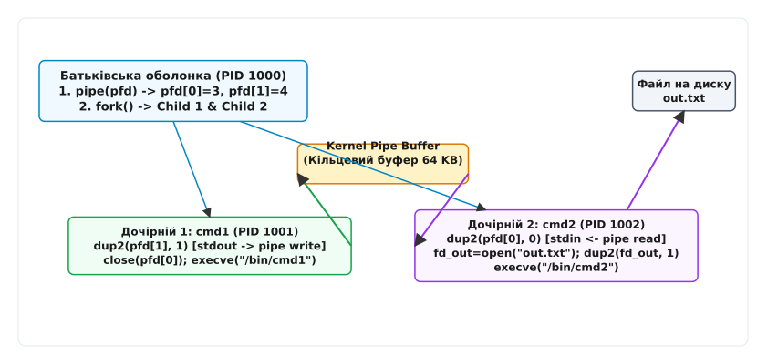

# Оболонка: що вона робить насправді

<preknowlist>
- [Концепції ядра Linux](topic:unix-linux/kernel-and-userspace) — системні виклики, простір користувача та межа привілеїв.
- [Три потоки: stdin, stdout, stderr](topic:unix-linux/standard-streams) — файлові дескриптори, таблиця відкритих файлів ядра та стандартні потоки.
</preknowlist>

Коли користувач вводить у терміналі команду `ls -l | grep txt > result.txt`, ядро Linux не розуміє жодного з цих слів. Операційна система на фундаментальному рівні оперує числовими ідентифікаторами процесів (PID), файловими дескрипторами, сторінками оперативної пам'яті та системними викликами. Перетворення текстового рядка користувача на структурований граф процесів, з'єднаних каналами передачі даних, виконує окрема програма простору користувача — командна оболонка (shell).

Оболонка є не просто командним інтерпретатором чи текстовим інтерфейсом. Вона є системним оркестратором процесів і компілятором потоків даних, який транслює людські наміри у послідовність системних викликів ядра.

## 1. Першопричина: чому ядру Linux потрібен користувацький оркестратор

У класичній архітектурі Unix ядро операційної системи ізольоване у привілейованому режимі роботи процесора (Ring 0 / Supervisor Mode). Головне завдання ядра — забезпечити безпечний розподіл апаратних ресурсів (процесорного часу, оперативної пам'яті, пристроїв введення-виведення) між неуповноваженими програмами простору користувача (Ring 3 / User Mode) за допомогою системних викликів (`syscall`).

Ядро відповідає за підтримку низькорівневих таблиць сторінок пам'яті (Page Tables), перемикання контексту процесів (Context Switch), обробку апаратних переривань та підтримку віртуальної файлової системи (VFS). Воно функціонує як суворо строгий менеджер ресурсів, але не володіє жодною логікою щодо того, *навіщо* і *в якій послідовності* користувач бажає ці ресурси комбінувати. Ядро не знає поняття «рядковий синтаксис сценарію» — воно оперує структурованими бінарними викликами `sys_clone`, `sys_execve` та `sys_pipe2`.

Якби ядро Linux містило в собі вбудований синтаксичний аналізатор команд та текстовий промпт, це призвело б до трьох катастрофічних системних наслідків:
1. **Порушення принципу найменших привілеїв:** Будь-яка синтаксична помилка, переповнення буфера або зависання у коді розбору тексту відбувалися б у режимі ядра, спричиняючи негайний крах всієї операційної системи (kernel panic).
2. **Неможливість еволюції інтерфейсу:** Зміна порядку підстановки змінних, додавання нових операторів або налаштування гарячих клавіш вимагали б перекомпіляції та перезавантаження всієї операційної системи.
3. **Жорстка прив'язка до політик:** Ядро Linux відповідає за *механізми* (як створити процес, як відкрити файл), але не за *політики* (які утиліти заповнюють конвеєр і в якому порядку).

З цих причин архітектура Unix із самого початку відокремила інтерпретатор команд від ядра. Оболонка (`/bin/sh`, `/bin/bash`, `/bin/zsh`) є звичайною програмою простору користувача. Вона не має жодних особливих привілеїв ядра і взаємодіє з операційною системою через той самий стандартний POSIX API, що й будь-який утилітарний софт. Більш детально про витоки цього рішення розказано в [Історії відокремлення оболонки від ядра](topic:unix-linux/shell-role/hist-unix-shell-decoupling.md).

```
┌─────────────────────────────────────────────────────────────────────────┐
│                       ПРОСТІР КОРИСТУВАЧА (USER SPACE)                   │
│                                                                         │
│  ┌──────────────────┐    Текст    ┌──────────────────────────────────┐  │
│  │ Термінал / PTY   │────────────►│ Командна оболонка (/bin/bash)    │  │
│  └──────────────────┘             └──────────────────────────────────┘  │
│                                                     │                   │
│                                     fork(), execve(), pipe(), dup2()    │
│                                                     │                   │
└─────────────────────────────────────────────────────┼───────────────────┘
                                                      │ Syscall Boundary
┌─────────────────────────────────────────────────────▼───────────────────┐
│                           ЯДРО LINUX (KERNEL SPACE)                     │
│                                                                         │
│  ┌──────────────────┐    ┌──────────────────┐    ┌───────────────────┐  │
│  │ Планувальник     │    │ Таблиця VFS / FD │    │ Буфери каналів    │  │
│  │ процесів (PID)   │    │ (Open Files)     │    │ (Pipe Buffers)    │  │
│  └──────────────────┘    └──────────────────┘    └───────────────────┘  │
└─────────────────────────────────────────────────────────────────────────┘
```

## 2. Чотири стовпи функціональності оболонки

Діяльність командної оболонки можна поділити на чотири незалежні, але тісно пов'язані системні підсистеми.

### Стовп 1: Двигун інтерактивного стану та REPL
У своєму інтерактивному режимі оболонка працює як нескінченний цикл читання, оцінки та виводу (Read-Eval-Print Loop). Оболонка зберігає поточний стан сесії: робочий каталог, змінні середовища, локальні змінні, масиви псевдонімів (aliases) та історію команд.

Під час читання рядка зі стандартного вводу інтерактивна оболонка співпрацює з драйвером псевдотермінала (`/dev/pts/X`) та бібліотеками редагування рядка (`readline` або ZLE). Драйвер термінала за умовчанням працює у **канонічному режимі (canonical mode)**, де введення накопичується буфером до натискання `Enter`. 

Однак для реалізації автодоповнення по натисканню `Tab` чи інтерактивного пошуку `Ctrl+R` бібліотека `readline` тимчасово перемикає термінал у **неканонічний (raw mode)** за допомогою системного виклику `tcsetattr()`. У цьому режимі кожен символ відразу передається процесу оболонки. Після збору команди оболонка відновлює канонічний режим термінала перед запуском зовнішніх утиліт.

Оболонка перехоплює сигнали переривання (`SIGINT`), щоб анулювати поточний незавершений рядок введення і вивести новий промпт без аварійного виходу з програми.

### Стовп 2: Транслятор тексту в синтаксичне дерево (AST)
Отримавши сирий рядок символів, оболонка виступає у ролі компілятора/інтерпретатора. Вона розбиває рядок на токени, виявляє метасимволи, будує абстрактне синтаксичне дерево (AST) і виконує сувору послідовність етапів розширення (expansions).

На цьому етапі перевіряється синтаксична коректність введеного виразу (відповідність відкритих та закритих дужок, наявність операндів у конвеєрах), а також здійснюється розвертання змінних середовища та підстановка результатів виконання вкладених команд.

### Стовп 3: Оркестратор графу процесів та потоків даних
Після того, як синтаксичне дерево збудовано й усі змінні підставлено, оболонка переходить до виконання. Вона транслює вузли AST у послідовність системних викликів ядра Linux:
- `fork()` / `clone()` — для створення нових процесів простору користувача.
- `pipe()` / `pipe2()` — для створення неіменованих каналів передачі даних між процесами.
- `open()` / `openat()` — для відкриття файлів перенаправлення вводу-виводу.
- `dup2()` — для комутації файлових дескрипторів standard streams у таблиці відкритих файлів процесів.
- `execve()` — для завантаження виконуваних бинарних файлів у простір пам'яті дочірніх процесів.

### Стовп 4: Супервізор завдань та терміналу (Job Control)
Оболонка керує розподілом доступу до керуючого терміналу (`/dev/tty`). Вона об'єднує пов'язані процеси у групи процесів (Process Groups), створює сесії та використовує системні виклики `tcsetpgrp()`, щоб перемикати контроль над терміналом між фоновими та пріоритетними завданнями.

Оболонка стежить за сигналами призупинення (`SIGTSTP`) та відновлення (`SIGCONT`), дозволяючи користувачеві зупиняти тривалі обчислення, переводити їх у фоновий режим (`bg`) або повертати на передній план (`fg`).


*Цикл REPL: послідовна обробка команди від введення рядка до збору коду виходу.*

## 3. Аналіз фази Eval: від текстового рядка до AST та розширення

Процес перетворення тексту команди на готові до виконання аргументи складається з трьох послідовних кроків: лексичного аналізу, побудови AST та фази розширення.

### 3.1 Токенізація та метасимволи
Коли користувач вводить рядок символів, оболонка отримує суцільну послідовність байтів. Щоб зрозуміти, де закінчується назва програми, де починаються її прапорці, а де розташовані оператори перенаправлення чи конвеєра, цей суцільний рядок необхідно розбити на окремі неподільні синтаксичні одиниці — токени. Лексичний аналізатор (лексер) читає вхідний рядок символ за символом від початку до кінця. Звичайні символи (букви, цифри, шляхи) лексер послідовно накопичує у буфері поточного токена-слова. Проте для виділення меж між словами та визначення операторів керування аналізаторові потрібен механізм розпізнавання спеціальних відокремлювачів.

Розглянемо, як лексер обробляє вхідний рядок:
```bash
cat < input.txt | grep -i "error" > output.log
```
Починаючи з першого символу, аналізатор зчитує `c`, `a`, `t` і накопичує їх у слово. Зустрівши пробіл або знак `<`, лексер завершує формування токена-слова `cat` і фіксує оператор `<`. Далі зчитується `input.txt`, після чого символ конвеєра `|` відокремлює його від наступної команди. У результаті весь рядок розбивається на дев'ять токенів:
`cat` (слово), `<` (оператор), `input.txt` (слово), `|` (оператор), `grep` (слово), `-i` (слово), `"error"` (слово), `>` (оператор), `output.log` (слово).

Такий механізм розбиття працює завдяки тому, що певні спецсимволи заздалегідь зафіксовані у синтаксисі як межі слів або керуючі елементи. Будь-який символ, який відокремлює слова або формує оператор, є **метасимволом** — згідно зі стандартом POSIX, до метасимволів належать: `space`, `tab`, `newline`, `|`, `&`, `;`, `(`, `)`, `<`, `>`. Якщо символ не є метасимволом і не екранований, він продовжує накопичуватися у поточному токені-слові.

### 3.2 Побудова Абстрактного Синтаксичного Дерева (AST)
Парсер приймає потік токенів і будує з них дерево виконання відповідно до граматики. Корневими вузлами дерева стають оператори керування потоком (`&&`, `||`, `;`, `|`).

Для виразу `cmd1 | cmd2 && cmd3` парсер побудує дерево, де верхівкою є логічний оператор `&&`. Його лівим операндом є вузол конвеєра `cmd1 | cmd2`, а правим — одиночна команда `cmd3`. Це означає, що конвеєр повинен повністю завершитися, і лише у випадку повернення коду виходу `0` буде запущено `cmd3`.

Складання виразів із чітким графом виконання дозволяє будувати довільно складні ланцюги обробки даних без необхідності написання тимчасових скриптів іншими мовами програмування.

### 3.3 Послідовність 7 фаз розширення POSIX
Перед тим, як передати аргументи системному виклику `execve()`, оболонка виконує розширення вмісту токенів. Порядок виконання фаз жорстко зафіксований стандартом POSIX:

1. **Brace Expansion (Розширення фігурних дужок):** Генерує довільні комбінації рядків (наприклад, `file{1,2}.txt` -> `file1.txt file2.txt`).
2. **Tilde Expansion (Розширення тильди):** Замінює `~` на вміст змінної середовища `$HOME`.
3. **Parameter, Command, Arithmetic Expansion:** Одночасно підставляє значення змінних (`$VAR`), виконує під-оболонки для збору виводу (`$(command)`) та обчислює арифметику (`$((1 + 2))`).
4. **Word Splitting (Розбиття на слова):** Результати фази 3 розбиваються на окремі аргументи за символами, вказаними у змінній `IFS` (за умовчанням — пробіл, табуляція, новий рядок).
5. **Pathname Expansion (Globbing):** Перетворює шаблони зі спецсимволами `*`, `?`, `[...]` у список реальних файлів на диску.
6. **Quote Removal (Видалення лапок):** Видаляє одинарні та подвійні лапки, які використовувалися для екранування.
7. **Redirection Setup (Налаштування перенаправлень):** Витягує оператори `<`, `>`, `>>` із списку аргументів та готує файлові дескриптори.

Повний нормативний опис граматики та таблиці операторів можна знайти у [Довіднику граматики та послідовності підстановок POSIX shell](topic:unix-linux/shell-role/api-posix-shell-grammar.md).

> ⚠️ **Пастка Word Splitting:** Якщо змінна містить пробіли (`FILE="my document.pdf"`), невжиття подвійних лапок при її виклику (`cat $FILE`) призведе до того, що на фазі 4 команда `cat` отримає **два окремих аргументи**: `my` та `document.pdf`. Брати змінні у подвійні лапки `"$FILE"` обов'язково тому, що подвійні лапки пригнічують фазу Word Splitting, зберігаючи цілісність рядка.

Одинарні лапки `'...'` пригнічують усі види підстановок повністю (текст всередині передається буква в буква). Подвійні лапки `"..."` дозволяють підстановку змінних, виклики під-оболонок `$(...)` та арифметичні вирази, але блокують Word Splitting та Globbing.

## 4. Механіка оркестрації процесів: fork(), pipe(), dup2() та execve()

Після завершення фази розширення оболонка отримує очищений список аргументів і переходить до етапу оркестрації процесів.

### 4.1 Пошук команди та вбудовані утиліти (Builtins)
Спочатку оболонка визначає, чи є перше слово команди вбудованою функцією чи зовнішньою програмою. Пошук здійснюється у суворому порядку:
1. **Aliases (Псевдоніми)**
2. **Keywords (Ключові слова мови: `if`, `for`, `while`)**
3. **Shell Functions (Функції оболонки)**
4. **Special Builtins (`exec`, `eval`, `export`, `set`, `trap`)**
5. **Regular Builtins (`cd`, `echo`, `pwd`, `read`, `kill`)**
6. **External PATH Binaries (Зовнішні файли на диску)**

Якщо команда є вбудованою (`cd`, `export`, `exit`), вона **не створює новий процес**. Оболонка виконує її у власному процесі за допомогою внутрішніх викликів (наприклад, `chdir()`).

Для чого це потрібно? Процес-нащадок у Unix не може змінити стан батьківського процесу (його робочий каталог чи змінні середовища). Таблиця змінних середовища передається від батька до нащадка при виклику `execve()` через глобальний вказівник `char **environ`. Однак дочірній процес модифікує лише власну копію пам'яті. Якби команда `cd` виконувалася у дочірньому процесі через `fork()`, вона змінила б каталог у нащадку, який відразу ж завершився б, залишивши батьківську оболонку у початковому каталозі.

### 4.2 Анатомія виконання конвеєра `cmd1 | cmd2 > out.txt`
Розглянемо покроково, як оболонка оркеструє виконання конвеєра з двох зовнішніх команд з перенаправленням виводу у файл:

1. **Створення каналу (Pipe Creation):**
   Оболонка виконує системний виклик `pipe(pfd)`. Ядро Linux виділяє у системній пам'яті кільцевий буфер розміром 64 КБ і повертає оболонці два нових файлових дескриптори: `pfd[0]` (для читання) та `pfd[1]` (для запису).

2. **Спаун першого процесу (`cmd1`):**
   Оболонка викликає `fork()`. У дочірньому процесі (Child 1):
   - Виконується `dup2(pfd[1], STDOUT_FILENO)` — дескриптор запису каналу копіюється на місце стандартного виводу (FD 1).
   - Закриваються оригінальні дескриптори `pfd[0]` та `pfd[1]`.
   - Викликається `execve("/bin/cmd1", args1, envp)` — простір пам'яті замінюється кодом `cmd1`.

3. **Спаун другого процесу (`cmd2`):**
   Оболонка викликає другий `fork()`. У дочірньому процесі (Child 2):
   - Виконується `dup2(pfd[0], STDIN_FILENO)` — дескриптор читання каналу копіюється на місце стандартного вводу (FD 0).
   - Виконується системний виклик `fd_out = open("out.txt", O_WRONLY|O_CREAT|O_TRUNC, 0644)`.
   - Виконується `dup2(fd_out, STDOUT_FILENO)` — стандартний вивід FD 1 спрямовується у файл `out.txt`.
   - Закриваються службові дескриптори `fd_out`, `pfd[0]`, `pfd[1]`.
   - Викликається `execve("/bin/cmd2", args2, envp)`.

4. **Закриття дескрипторів у батьківській оболонці (Критичний крок):**
   Батьківський процес оболонки **обов'язково закриває** свої копії `pfd[0]` та `pfd[1]`. Якби оболонка забула закрити `pfd[1]`, лічильник посилань ядра на кінець запису каналу не дорівнював би нулю після завершення `cmd1`. Як наслідок, `cmd2` чекав би на символ кінця файлу (EOF) і завис би назавжди.

5. **Збір статусів завершення (Wait):**
   Оболонка викликає `waitpid(pid1)` та `waitpid(pid2)`, зчитуючи коди виходу за допомогою макросів `WEXITSTATUS(status)`.


*Перенаправлення та комутація файлових дескрипторів через системні виклики pipe(), dup2() та fork().*

Кожен дочірній процес успадковує копію таблиці файлових дескрипторів батьківської оболонки під час системного виклику `fork()`. Системний виклик `execve()` повністю скидає адресний простір процесу, код та дані, але **зберігає відкриті файлові дескриптори** (якщо для них не було встановлено прапорець `FD_CLOEXEC`). Саме ця властивість ядра дозволяє оболонці налаштувати перенаправлення потоків до виклику `execve()`, і нова програма відразу починає читати з каналу та писати у потрібний файл.

Пересвідчитися у простоті цієї схеми можна, переглянувши [Мінімальний оркестратор процесів мовами C та C++](topic:unix-linux/shell-role/proj-mini-shell.md).

## 5. Управління завданнями, сесії та сигнальна інфраструктура

Для забезпечення комфортної інтерактивної роботи оболонка реалізує механізм **Job Control** (Управління завданнями).

### 5.1 Ієрархія ідентифікаторів: PID, PGID та SID
Кожен процес у Linux має три рівні ідентифікації:
- **PID (Process ID):** Унікальний номер процесу.
- **PGID (Process Group ID):** Ідентифікатор групи процесів. Усі процеси одного конвеєра (`cmd1 | cmd2`) об'єднуються в одну групу процесів, лідером якої стає перший процес конвеєра.
- **SID (Session ID):** Ідентифікатор сесії. При відкритті емулятора термінала створюється нова сесія, лідером якої стає процес інтерактивної оболонки.

```
┌─────────────────────────────────────────────────────────────────────────┐
│                        СЕСІЯ ТЕРМІНАЛА (SID 500)                        │
│                     Керуючий термінал: /dev/pts/2                       │
│                                                                         │
│  ┌───────────────────────────────────────────────────────────────────┐  │
│  │ ФОНОВА ГРУПА ПРОЦЕСІВ (PGID 501, &)                               │  │
│  │ ┌───────────────────────────┐     ┌────────────────────────────┐ │  │
│  │ │ Process 1 (PID 501)       │──|──│ Process 2 (PID 502)        │ │  │
│  │ └───────────────────────────┘     └────────────────────────────┘ │  │
│  └───────────────────────────────────────────────────────────────────┘  │
│                                                                         │
│  ┌───────────────────────────────────────────────────────────────────┐  │
│  │ ПРІОРИТЕТНА ГРУПА (FOREGROUND PGID 600, має доступ до /dev/pts/2) │  │
│  │ ┌───────────────────────────┐     ┌────────────────────────────┐ │  │
│  │ │ grep (PID 600)            │──|──│ awk (PID 601)              │ │  │
│  │ └───────────────────────────┘     └────────────────────────────┘ │  │
│  └───────────────────────────────────────────────────────────────────┘  │
└─────────────────────────────────────────────────────────────────────────┘
```

### 5.2 Передавання контролю над терміналом
Термінал (`/dev/pts/X`) у кожен момент часу може віддавати введення з клавіатури лише **одній** групі процесів — пріоритетній (Foreground Process Group).

Коли користувач запускає команду без символу `&`, оболонка:
1. Викликом `setpgid(child_pid, child_pid)` створює нову групу процесів для команди.
2. Викликом `tcsetpgrp(tty_fd, child_pgid)` передає права керуючого термінала цій новій групі.
3. Сама оболонка переходить у стан очікування via `waitpid()`.

Якщо фоновий процес (з фонової групи) пробує зчитати дані з керуючого термінала, ядро Linux відразу зупиняє його, надсилаючи сигнал `SIGTTIN`. Якщо фоновий процес пробує записати дані на термінал при встановленому прапорці `TOSTOP`, ядро надсилає сигнал `SIGTTOU`. Це захищає екран користувача від хаотичного виводу фонових завдань.

Якщо користувач натискає `Ctrl+C`, драйвер термінала генерує сигнал `SIGINT` і надсилає його **усім процесам пріоритетної групи**. Інтерактивна оболонка, знаходячись у фоні, цей сигнал не отримує.

При натисканні `Ctrl+Z` термінал надсилає сигнал `SIGTSTP` (Terminal Stop). Процеси пріоритетної групи призупиняються. Оболонка перехоплює зміну стану через `waitpid(..., WUNTRACED)`, викликом `tcsetpgrp(tty_fd, shell_pgid)` повертає собі контроль над терміналом, виводить повідомлення `[1]+ Stopped` і повертає користувачеві промпт.

## 6. Простеження роботи оболонки через системні інструменти Linux

Зрозуміти реальну поведінку оболонки найпростіше за допомогою утиліт динамічного аналізу трасування системних викликів.

### 6.1 Трасування за допомогою strace
Запустимо трасування системних викликів оболонки `bash` при виконанні простих перенаправлень:

```bash
strace -f -e trace=process,file,pipe,dup2 bash -c "ls | grep txt > out.txt"
```

У виводі `strace` ми побачимо чітку послідовність системних подій ядра:

```text
[pid 12000] pipe2([3, 4], 0)            = 0
[pid 12000] clone(child_stack=NULL, flags=CLONE_CHILD_CLEARTID|...) = 12001
[pid 12001] dup2(4, 1)                  = 1
[pid 12001] close(3)                    = 0
[pid 12001] execve("/bin/ls", ["ls"], envp) = 0
[pid 12000] clone(child_stack=NULL, flags=CLONE_CHILD_CLEARTID|...) = 12002
[pid 12002] dup2(3, 0)                  = 0
[pid 12002] openat(AT_FDCWD, "out.txt", O_WRONLY|O_CREAT|O_TRUNC, 0666) = 4
[pid 12002] dup2(4, 1)                  = 1
[pid 12002] execve("/bin/grep", ["grep", "txt"], envp) = 0
[pid 12000] close(3)                    = 0
[pid 12000] close(4)                    = 0
[pid 12000] wait4(12001, [{WIFEXITED(s) && WEXITSTATUS(s) == 0}], 0, NULL) = 12001
[pid 12000] wait4(12002, [{WIFEXITED(s) && WEXITSTATUS(s) == 0}], 0, NULL) = 12002
```

Цей лог трасування безпосередньо підтверджує теорію: створення каналу `pipe2`, два послідовних виклики `clone` (`fork`), комутацію дескрипторів `dup2`, відкриття файла `openat`, виклики `execve` та обов'язкове закриття дескрипторів каналу у батьківському процесі PID 12000 перед `wait4`.

### 6.2 Інспектування /proc filesystem
Під час виконання довготривалого конвеєра можна перевірити стан дескрипторів процесів у віртуальній файловій системі procfs:

```bash
ls -l /proc/<PID_CHILD_1>/fd
```

Результат покаже реальні посилання ядра:
```text
lrwx------ 1 user user 64 Aug 14 10:00 0 -> /dev/pts/2
l--w------ 1 user user 64 Aug 14 10:00 1 -> pipe:[458921]
lrwx------ 1 user user 64 Aug 14 10:00 2 -> /dev/pts/2
```
Дескриптор 1 дочірнього процесу вказує не на файл на диску, а на об'єкт ядра `pipe:[458921]`.

Також файл `/proc/<PID>/stat` відображає точні значення PID, PGID та SID процесу, що дозволяє спостерігати формування груп процесів у режимі реального часу.

## 7. Крайові випадки, під-оболонки (Subshells) та ціна оркестрації

Незважаючи на гнучкість, оркестрація через оболонку має свою системну ціну та крайові випадки.

### 7.1 Накладні витрати під-оболонок (Subshells)
Коли оболонка виконує вирази у круглих дужках `(cd /tmp && ls)` або підстановку команд `VAR=$(date)`, вона створює **під-оболонку (subshell)**.

Створення під-оболонки відбувається через системний виклик `fork()`. Новий процес копіює весь простір пам'яті батьківської оболонки, але **не викликає `execve()`**. Під-оболонка успадковує всі змінні та функції, але будь-які зміни змінних у ній (`VAR=123`) відбуваються у копії пам'яті дочірнього процесу і **не повертаються у батьківську оболонку**.

> ⚠️ **Пастка конвеєра в bash:** У стандарті POSIX кожен елемент конвеєра може виконуватися у під-оболонці. У `bash` вираз `cat file.txt | while read line; do COUNT=$((COUNT+1)); done` виконує цикл `while` у під-оболонці (окремому `fork`). Після завершення конвеєра змінна `COUNT` у батьківській оболонці залишиться рівною 0! (У `zsh` останній елемент конвеєра за умовчанням виконується у поточному процесі оболонки).

### 7.2 Продуктивність та ціна системних викликів
Створення процесів через `fork()` та `execve()` у Linux виконується дуже швидко завдяки механізму Copy-On-Write (COW). Проте запуск тисяч зовнішніх утиліт у циклі (наприклад, виклик `sed` або `cut` на кожній ітерації `while read`) створює величезні накладні витрати на перемикання контексту ядра (context switches) та заповнення таблиць процесів. Обробка великих масивів даних за допомогою системних утиліт оболонки завжди повинна будуватися через один потоковий конвеєр (`cat file | awk ...`), а не через цикли оболонки.

Сучасні оболонки застосовують оптимізації для зменшення кількості викликів `fork()`. Наприклад, якщо останньою командою у скрипті є зовнішня бінарна програма, оболонка замість послідовності `fork() + execve() + wait()` викликає `execve()` безпосередньо у своєму процесі (оптимізація хвостового виклику / tail-call optimization).

> 🔧 **Навіщо це в реальній розробці.**
> Розуміння оболонки як оркестратора процесів вирішує три критичні завдання інженерії:
> 1. **Діагностика зависань у CI/CD:** Зависання кроків build-скриптів найчастіше спричинені тим, що фоновий дочірній процес залишив відкритим дескриптор `stdout` або `stderr`, позбавляючи систему CI/CD можливості отримати EOF.
> 2. **Контейнеризація (Docker / Kubernetes PID 1):** Якщо у Dockerfile вказати `ENTRYPOINT script.sh`, оболонка стає PID 1 всередині контейнера. За умовчанням оболонка не передає сигнали `SIGTERM` дочірнім процесам, що призводить до того, що контейнери зупиняються лише по таймауту через `SIGKILL`. Використання `exec script.sh` заміщує процес оболонки цільовим бинарником.
> 3. **Безпека (Command Injection):** Розуміння 7 етапів розширення дозволяє проектувати безпечні скрипти, унеможливлюючи впровадження довільного коду через неочищені користувацькі змінні.

## Висновок

Командна оболонка є фундаментальним сполучним шармом систем Unix і Linux. Вона відокремлює високорівневу логіку людських інструкцій від низькорівневих механізмів ядра, транслюючи текст у графи процесів за допомогою системних викликів `fork()`, `execve()`, `pipe()` та `dup2()`. Розуміння внутрішньої архітектури оболонки перетворює її з набору розрізнених команд на потужний, передбачуваний та надійний інструмент системної оркестрації.
