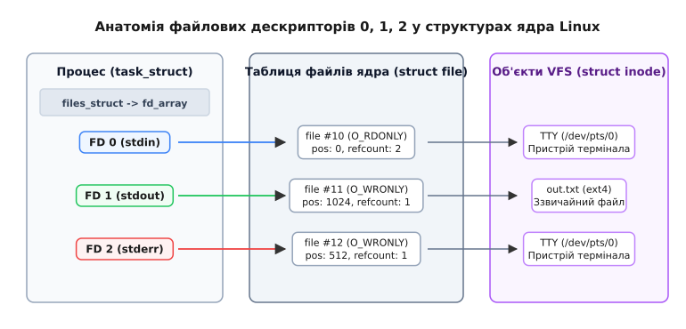
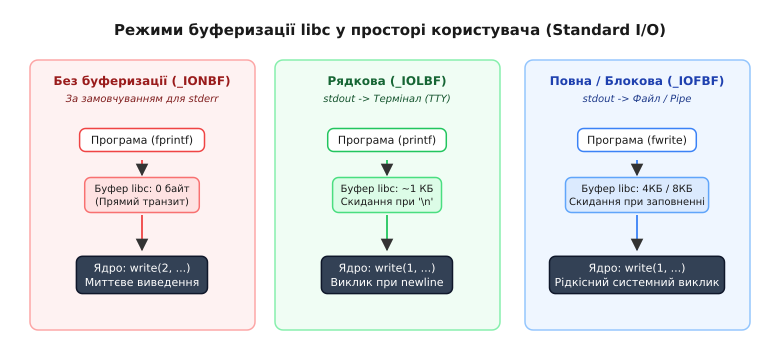
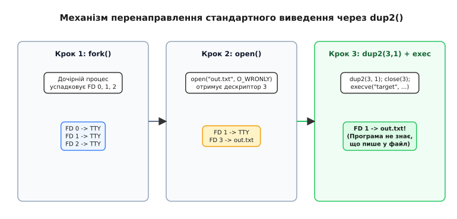

# Три потоки: stdin, stdout, stderr й дескриптори 0, 1, 2

<preknowlist>
- [«Усе є файлом»: один інтерфейс на все](book:unix-linux/everything-is-a-file) — концепція уніфікованого абстрактного файлу в Unix.
- [Ядро й простір користувача](book:unix-linux/kernel-and-userspace) — межа системних викликів та перемикання контексту.
- [libc як шлюз до ядра](book:unix-linux/libc-as-gateway) — обгортки `FILE *` над числовими файловими дескрипторами.
</preknowlist>

Уявіть операційну систему, у якій кожна програма має самостійно запитувати у користувача імена файлів для вхідних даних, створювати власні унікальні аргументи командного рядка для збереження результатів і самотужки вирішувати, куди виводити повідомлення про помилки. У такому середовищі дві утиліти, написані різними розробниками, практично неможливо об'єднати для спільної роботи. Програма сортування не зможе прочитати виведення програми пошуку, а утиліта підрахунку рядків вимагатиме збереження проміжних даних на диск.

Unix вирішив цю проблему концептуально простим і потужним кроком: стандартизацією вхідних та вихідних каналів даних. Замість того щоб змушувати кожну програму відкривати конкретні файли або пристрої, операційна система під час запуску будь-якого процесу автоматично надає йому три відкриті канали зв'язку: **стандартне введення (stdin)**, **стандартне виведення (stdout)** та **стандартне виведення помилок (stderr)**. На рівні ядра Linux цим потокам відповідають строго зафіксовані файлові дескриптори `0`, `1` та `2`.

Завдяки цьому механізму програма перестає турбуватися про те, звідки надходять її дані й куди прямує результат — з клавіатури термінала, зі звичайного файлу на диску чи з міжпроцесного каналу від іншої утиліти. Детальніше про те, як розробники Bell Labs пройшли шлях від жорсткої прив'язки файлів до універсальних каналів, описано в історичній вставці [📜 Історія появи трьох стандартних потоків та концепції каналів](book:unix-linux/standard-streams/hist-unix-streams-and-pipes.md).

## Анатомія файлових дескрипторів 0, 1, 2 у структурі ядра

Коли програма у просторі користувача викликає функції читання або запису, вона оперує не іменами файлів або вказівниками на пам'ять диска, а файловими дескрипторами. Файловий дескриптор (File Descriptor, FD) — це невід'ємне ціле число, яке слугує індексом у таблиці відкритих файлів конкретного процесу.

Ядро Linux зберігає стан кожного процесу у структурі `struct task_struct`. Усередині цієї структури міститься вказівник `files` на структуру `struct files_struct`, яка утримує таблицю файлових дескрипторів процесу (`struct fdtable`). За угодою POSIX, перші три елементи цієї таблиці завжди зарезервовані:

1. **Дескриптор `0` (`STDIN_FILENO`):** Потік для читання вхідних даних процесу.
2. **Дескриптор `1` (`STDOUT_FILENO`):** Потік для запису основних результатів роботи процесу.
3. **Дескриптор `2` (`STDERR_FILENO`):** Потік для запису діагностичних повідомлень, журналів та помилок.


*Структура таблиць файлових дескрипторів процесу, записів відкритих файлів ядра та об'єктів VFS inode.*

Схема адресації в ядрі є трирівневою:
- **Рівень 1 (Таблиця дескрипторів процесу):** Елемент масиву `fd_array[1]` у структурі `files_struct` посилається на об'єкт відкритого файлу у глобальній таблиці ядра. Доступ до таблиці розширюється динамічно, якщо процес відкриває більше файлів, ніж вміщує базовий стаціонарний масив.
- **Рівень 2 (Таблиця відкритих файлів ядра):** Екземпляр `struct file` містить поточну позицію зсуву в файлі (`f_pos`), прапорці доступу (`O_RDONLY`, `O_WRONLY`, `O_APPEND`), лічильник посилань (`f_count`), атрибути прав доступу (`f_cred`) та вказівник на таблицю операцій `f_op`.
- **Рівень 3 (Віртуальна файлова система VFS):** Структура `struct inode` представляє реальний об'єкт файлової системи — це може бути звичайний файл на ext4, символьний пристрій термінала (`/dev/pts/0`), анонімний канал (pipe) або мережевий сокет.

Коли процес запускається у звичайному інтерактивному терміналі без перенаправлення потоків, усі три дескриптори — `0`, `1` і `2` — посилаються на один і той самий пристрій термінала (наприклад, `/dev/pts/0`). Однак ядро підтримує для них окремі записи у таблиці `struct file`, що дозволяє змінювати зсув або прапорці кожного дескриптора незалежно.

### Успадкування дескрипторів при `fork()` та збереження при `execve()`

Під час виконання системного виклику `fork()` ядро дублює структуру `files_struct` батьківського процесу для дочірнього. Це означає, що дочірній процес отримує точно такий самий масив дескрипторів `0`, `1`, `2`, які вказують на ті самі об'єкти `struct file` у ядрі. Лічильник посилань `f_count` у таблиці файлів ядра при цьому збільшується.

Коли після цього дочірній процес викликає `execve()` для заміни свого адресувального простору новою програмою, **файлові дескриптори за замовчуванням залишаються відкритими**. Нова програма починає своє виконання, успадкувавши дескриптори `0`, `1` і `2` від свого попередника. Саме ця властивість ядра робить можливим перенаправлення потоків у командній оболонці (Shell).

Якщо для файлового дескриптора встановлено прапорець `FD_CLOEXEC` (close-on-exec) за допомогою виклику `fcntl()`, ядро автоматично закриє цей дескриптор під час виклику `execve()`. Для дескрипторів `0`, `1` і `2` прапор `FD_CLOEXEC` зазвичай **не встановлюється**, оскільки нова програма повинна мати доступ до успадкованих потоків.

## Буферизація в просторі користувача: бій за продуктивність і його пастки

Прямий системний виклик `write(1, buf, len)` вимагає від процесора переключення контексту з простору користувача (User Space) у простір ядра (Kernel Space). Переключення контексту супроводжується збереженням регістрів, перевіркою прав доступу, інвалідацією кешів та виконанням коду драйвера пристрою. Якщо програма виводить дані по одному символу за допомогою системних викликів, продуктивність падає на кілька порядків.

Щоб розв'язати цю проблему, стандартна бібліотека C (`libc`) створює шар абстракції над числовими файловими дескрипторами `0`, `1`, `2` у вигляді вказівників на структури `FILE *` (`stdin`, `stdout`, `stderr`). 

Усередині реалізації `glibc` структура `FILE` (визначена як `struct _IO_FILE`) містить вказівники на межі користувацького буфера пам'яті:
- `_IO_buf_base` та `_IO_buf_end` — початок та кінець виділеного буфера пам'яті;
- `_IO_write_ptr` та `_IO_write_end` — поточна позиція запису в буфері;
- `_fileno` — цілочисельний дескриптор ядра (0, 1 або 2).


*Порівняння режимів буферизації libc: без буферизації (_IONBF), рядкова (_IOLBF) та блокова (_IOFBF).*

Стандарт POSIX та реалізація `glibc` визначають три режими буферизації для потоків `FILE *`:

### 1. Без буферизації (`_IONBF` — Unbuffered)
У цьому режимі кожна функція виведення (наприклад, `fputc()` або `fprintf()`) негайно викликає системний виклик `write()`.
- **Застосування:** Режим за замовчуванням для `stderr`.
- **Причина:** Якщо програма виконує неприпустиму операцію (наприклад, розіменування нульового вказівника) і негайно аварійно завершується (Segmentation fault), буфер у пам'яті користувача буде втрачено. Відсутність буферизації гарантує, що повідомлення про помилку потрапить до ядра та виведеться на екран за мить до загибелі процесу.

### 2. Рядкова буферизація (`_IOLBF` — Line Buffered)
Дані накопичуються у користувацькому буфері й передаються ядрові через системний виклик `write()` лише тоді, коли у потік записується символ нового рядка `\n`, або коли буфер заповнюється повністю.
- **Застосування:** Режим за замовчуванням для `stdout` і `stdin`, якщо вони підключені до інтерактивного термінала.
- **Причина:** Інтерактивний користувач очікує бачити відповідь програми рядок за рядком, а не чекати накопичення кілобайтів даних.

### 3. Повна / Блокова буферизація (`_IOFBF` — Fully Buffered)
Дані накопичуються у буфері й передаються ядрові через `write()` виключно тоді, коли буфер заповнюється до останнього байта (або при явному виклику `fflush()`).
- **Застосування:** Режим за замовчуванням для `stdout`, якщо його перенаправлено у звичайний файл на диску або в міжпроцесний канал (pipe).
- **Причина:** Дискове введення-виведення та передача даних через блоки ядра працюють максимально ефективно при масивних блоках пам'яті (наприклад, 4096 або 8192 байти).

Режим буферизації можна змінити у коді за допомогою виклику `setvbuf()`. Повний опис функцій та прапорців буферизації наведено у довіднику [📋 Інтерфейс системних викликів та libc для стандартних потоків](book:unix-linux/standard-streams/api-standard-descriptors.md).

### Керування буферизацією сторонніх утиліт: `stdbuf`

Іноді розробнику потрібно змінити режим буферизації сторонньої утиліти, вихідний код якої неможливо модифікувати. Наприклад, у конвеєрі `tail -f app.log | grep "ERROR" | my_notifier` утиліта `grep` помічає, що її `stdout` перенаправлено у pipe, і автоматично вмикає блокову буферизацію (`_IOFBF`). У результаті повідомлення про помилки з'являтимуться в `my_notifier` із затримкою у кілька хвилин — поки `grep` не накопичить 4 КБ даних.

Утиліта `stdbuf` із комплекту GNU Coreutils вирішує цю проблему без перевидання програми:

```bash
# Принудити grep використовувати рядкову буферизацію у конвеєрі
stdbuf -oL tail -f app.log | grep "ERROR" | my_notifier
```

Під капотом `stdbuf` використовує механізм `LD_PRELOAD`, підставляючи перед запуском утиліти динамічну бібліотеку `libstdbuf.so`. Конструктор цієї бібліотеки виконується **до функції `main()`** target-програми та викликає `setvbuf(stdout, NULL, _IOLBF, 0)`, модифікуючи налаштування `glibc`.

### Пастка №1: Задубльоване виведення при `fork()`

Одна з найпоширеніших помилок при роботі зі стандартними потоками виникає під час поєднання користувацької буферизації `libc` із системним викликом `fork()`.

Розглянемо наступну ситуацію:

:::tabs
```c
#include <stdio.h>
#include <unistd.h>

int main(void) {
    printf("Початок обчислень..."); // Символу \n немає!
    
    fork();

    printf(" Завершено.\n");
    return 0;
}
```
```cpp
#include <iostream>
#include <unistd.h>

int main() {
    std::cout << "Початок обчислень..."; // Без std::endl або \n
    
    fork();

    std::cout << " Завершено.\n";
    return 0;
}
```
:::

Якщо ви запустите цей код у терміналі, ви побачите очікуваний рядок:
`Початок обчислень... Завершено.`

Однак якщо ви перенаправите виведення у файл (`./app > output.txt`), режим `stdout` автоматично переключиться з рядкової буферизації (`_IOLBF`) на повну блокову буферизацію (`_IOFBF`). У результаті текст `"Початок обчислень..."` залишиться накопиченим у буфері пам'яті процесу в просторі користувача.

Коли виконується системний виклик `fork()`, ядро створює точну копію адресового простору процесу, **включаючи буфер `libc` з нескинутим текстом**. Коли і батьківський, і дочірній процеси завершать свою роботу, функція `exit()` у кожному з них скине свій буфер на диск. У файлі `output.txt` з'явиться задубльований рядок:
`Початок обчислень... Завершено.`
`Початок обчислень... Завершено.`

> 🔧 **Навіщо це знати.** Щоб уникнути подвійного виведення даних у логи або файли при перенаправленні, **завжди викликайте `fflush(stdout)` або `fflush(NULL)` безпосередньо перед виконанням системного виклику `fork()`**.

### Пастка №2: Втрата даних при `_exit()`

Стандартна функція C `exit(code)` перед завершенням процесу обходить усі відкриті потоки `FILE *`, викликає для них `fflush()` та закриває дескриптори. 

Натомість системний виклик `_exit(code)` (або `_Exit(code)`) негайно припиняє виконання процесу на рівні ядра, **минаючи обгортки `libc`**. Якщо програма записала дані у `stdout` за допомогою `printf()`, а потім викликала `_exit()`, усі накопичені в буфері користувача дані будуть остаточно втрачені, оскільки ядро нічого не знає про існування буфера у просторі користувача.

## Розділення даних і діагностики: stdout проти stderr

Використання двох окремих вихідних потоків — `stdout` (дескриптор 1) та `stderr` (дескриптор 2) — є наріжним каменем архітектури Unix.

Концептуальна різниця між ними полягає в їхньому призначенні:
- **`stdout` (Payload):** Призначений виключно для чистих предметних даних програми, які можуть бути передані далі по конвеєру іншим утилітам.
- **`stderr` (Telemetry & Diagnostics):** Призначений для системних повідомлень, відсотків прогресу виконання, попереджень та помилок.

Уявіть утиліту `grep`, яка шукає рядок у багатьох файлах і передає знайдені результати утиліті `wc -l` для підрахунку кількості знайдених збігів:

```bash
grep "ERROR" /var/log/*.log | wc -l
```

Якщо під час читання одного з файлів утиліта `grep` стикається із відсутністю прав доступу, вона виводить повідомлення `grep: /var/log/secure.log: Permission denied`. Оскільки це повідомлення про помилку надсилається у **`stderr` (дескриптор 2)**, воно виводиться безпосередньо на екран користувача. Канал конвеєра (`|`), який з'єднує лише **`stdout` (дескриптор 1)** програми `grep` із `stdin` програми `wc`, отримує виключно чисті рядки збігів.

Якби повідомлення про помилки виводилися у `stdout`, утиліта `wc` порахувала б рядок помилки як реальний збіг у логах, спотворивши кінцевий результат обчислень.

### Синхронізація потоків при об'єднанні (`2>&1`)

Коли користувач об'єднує `stderr` та `stdout` в один файл або канал за допомогою shell-конструкції `2>&1` (або `&>`), виникає ефект розсинхронізації через різницю в режимах буферизації:
- Повідомлення в `stderr` (`_IONBF`) потрапляють до ядра миттєво.
- Текст у `stdout` (`_IOFBF`) чекає заповнення 4-кілобайтного буфера.

У результаті у кінцевому файлі або логу повідомлення про помилки можуть з'явитися раніше, ніж текст, який був надрукований у коді програми декількома рядками вище. Для запобігання цьому утиліти інтерактивного моніторингу явно переводять `stdout` у режим рядкової буферизації або виконують `fflush(stdout)` перед записом у `stderr`.

## Перенаправлення та маніпуляція дескрипторами: dup2(), fcntl та pipe()

Операційна система дозволяє змінювати призначення стандартних потоків без модифікації коду самої програми. Для цього використовується системний виклик `dup2(oldfd, newfd)`.

Виклик `dup2(oldfd, newfd)` виконує дві атомарні операції:
1. Якщо дескриптор `newfd` відкритий, ядро закриває його.
2. Ядро копіює вказівник на відкритий файл з елемента `fd_array[oldfd]` в елемент `fd_array[newfd]`.


*Етапи заміни дескриптора 1 при виконанні dup2() у дочірньому процесі.*

Коли ви виконуєте у терміналі команду `ls -l > output.txt`, командна оболонка виконує наступну послідовність кроків:

1. **`fork()`:** Створює дочірній процес.
2. **`open("output.txt", O_WRONLY|O_CREAT|O_TRUNC)`:** Дочірній процес відкриває файл на запис і отримує найменший вільний дескриптор (наприклад, `3`).
3. **`dup2(3, 1)`:** Елемент `fd_array[1]` (stdout) перевизначається і починає вказувати на той самий відкритий файл `output.txt`, що й дескриптор `3`.
4. **`close(3)`:** Закриває додатковий дескриптор `3`, оскільки дескриптор `1` тепер успішно посилається на файл.
5. **`execve("/bin/ls", ...)`:** Замінює образ дочірнього процесу програмою `ls`.

Програма `ls` запускається і здійснює запис у дескриптор `1`, абсолютно не підозрюючи, що ядро спрямовує її виведення у файл на диску, а не на екран термінала.

Детальний приклад побудови власного міні-шеллу із підтримкою перенаправлення потоків та міжпроцесного каналу мовами C та C++ наведено у практичному проекті [⚙️ Практична реалізація перенаправлення потоків та конвеєрів](book:unix-linux/standard-streams/proj-mini-shell-redirection.md).

## Неблокуюче введення-виведення та мультиплексування потоків

За замовчуванням системні виклики `read()` та `write()` на дескрипторах `0`, `1`, `2` є **блокуючими**. Якщо програма викликає `read(0, buf, len)`, а користувач ще не натиснув жодної клавіші на терміналі, ядро переводить процес у стан сну (`TASK_INTERRUPTIBLE`), виключаючи його з черги планувальника.

Однак високонавантажені мережеві демони або мультиплексори терміналів (на кшталт `tmux` чи `screen`) повинні обробляти декілька потоків одночасно, не зависаючи на очікуванні stdin.

Для переведення стандартного потоку у неблокуючий режим використовується системний виклик `fcntl()`:

:::tabs
```c
#include <fcntl.h>
#include <unistd.h>

void make_stdin_nonblocking(void) {
    int flags = fcntl(STDIN_FILENO, F_GETFL, 0);
    if (flags != -1) {
        fcntl(STDIN_FILENO, F_SETFL, flags | O_NONBLOCK);
    }
}
```
```cpp
#include <fcntl.h>
#include <unistd.h>
#include <system_error>

void set_stdin_nonblocking() {
    int flags = ::fcntl(STDIN_FILENO, F_GETFL, 0);
    if (flags == -1) {
        throw std::system_error(errno, std::generic_category(), "fcntl F_GETFL failed");
    }
    if (::fcntl(STDIN_FILENO, F_SETFL, flags | O_NONBLOCK) == -1) {
        throw std::system_error(errno, std::generic_category(), "fcntl F_SETFL failed");
    }
}
```
:::

Після цього виклик `read(STDIN_FILENO, ...)` у разі відсутності готових даних не блокує процес, а негайно повертає `-1`, встановлюючи `errno = EAGAIN` (або `EWOULDBLOCK`). Для відстеження готовності даних на стандартному введенні програми використовують системні виклики мультиплексування `poll()`, `select()` або `epoll()`.

## Інтроспекція й адаптація поведінки: isatty() та /proc/self/fd/

Сучасні консольні утиліти часто змінюють свою поведінку залежно від того, куди спрямовані їхні стандартні потоки:
- `ls --color=auto` виводить кольорові імена файлів у терміналі, але вимикає ANSI-коди при перенаправленні у файл.
- `git log` автоматично відкриває пейджер `less`, якщо `stdout` підключено до термінала.
- `zsh` показує інтерактивне запрошення (prompt) лише тоді, коли `stdin` і `stdout` є терміналом.

### Перевірка дескриптора через `isatty()` та `ioctl()`

Для визначення типу пристрою програма використовує функцію `isatty(int fd)`. 

Під капотом `isatty(fd)` виконує системний виклик `ioctl()` із проханням прочитати параметри термінала (`TCGETS` у Linux або `TIOCGETA` у BSD):

:::tabs
```c
#include <stdio.h>
#include <unistd.h>
#include <termios.h>
#include <sys/ioctl.h>
#include <errno.h>

int check_if_terminal(int fd) {
    struct termios t;
    // Якщо ioctl успішний, дескриптор є терміналом
    if (ioctl(fd, TCGETS, &t) == 0) {
        return 1;
    }
    // Якщо повертається ENOTTY — це файл, pipe або сокет
    if (errno == ENOTTY) {
        return 0;
    }
    return 0;
}
```
```cpp
#include <iostream>
#include <unistd.h>
#include <sys/ioctl.h>
#include <termios.h>
#include <cerrno>

bool is_device_terminal(int fd) noexcept {
    ::termios t{};
    if (::ioctl(fd, TCGETS, &t) == 0) {
        return true;
    }
    return false;
}
```
:::

Якщо системний виклик `ioctl()` повертає помилку `ENOTTY` (Inappropriate ioctl for device), програма розуміє, що дескриптор `fd` підключений до звичайного файлу або анонімного каналу, і вимикає спецсимволи форматування та ANSI-кольори.

### Інспекція дескрипторів через `/proc/self/fd/`

У Linux кожна програма може проінспектувати власні відкриті файлові дескриптори через псевдофайлову систему `procfs`.

Шляхи `/proc/self/fd/0`, `/proc/self/fd/1` та `/proc/self/fd/2` є спеціальними символьними посиланнями, які вказують на точні об'єкти, відкриті програмою:

```bash
# Перевірка куди вказують дескриптори в інтерактивному терміналі
ls -l /proc/self/fd/
# lrwx------ 0 user group -> /dev/pts/1
# lrwx------ 1 user group -> /dev/pts/1
# lrwx------ 2 user group -> /dev/pts/1

# Перевірка дескрипторів при перенаправленні stdout у файл
ls -l /proc/self/fd/ > fds.txt && cat fds.txt
# lrwx------ 0 user group -> /dev/pts/1
# l-wx------ 1 user group -> /home/user/fds.txt
# lrwx------ 2 user group -> /dev/pts/1

# Перевірка дескрипторів всередині конвеєра
ls -l /proc/self/fd/ | cat
# lrwx------ 0 user group -> pipe:[482910]
# l-wx------ 1 user group -> /dev/pts/1
# lrwx------ 2 user group -> /dev/pts/1
```

Це дозволяє програмам відкривати `/proc/self/fd/1` для повторного читання або передавати шлях до власного стандартного виведення стороннім бібліотекам, які приймають лише імена файлів.

## Підводні камені, безпека та практики системного програмування

### Небезпека довільного закриття дескрипторів 0, 1, 2

У системному програмуванні на C/C++ існує критичне правило безпеки: **ніколи не залишайте дескриптори 0, 1 або 2 закритими**.

Якщо програма закриє дескриптор `0` за допомогою `close(0)`, а потім викличе `open("/etc/config.json", O_RDONLY)`, ядро Linux дотримається свого стандарту і виділить для нового файлу **найменший вільний номер дескриптора — `0`**.

У результаті будь-яка стороння бібліотека або функція (наприклад, `getchar()`), яка розраховує прочитати вхідні дані від користувача з `stdin` (дескриптор 0), тихо прочитає вміст вашого конфігураційного файлу `/etc/config.json`. Якщо ж ви закриєте дескриптор `1` або `2`, наступний відкритий сокет або файл бази даних отримає номер `1` або `2`, і звичайний `printf()` або `fprintf(stderr, ...)` вигатить діагностичний лог прямо у бінарне мережеве з'єднання або пошкодить файл бази даних.

### Захист у демонах: Перенаправлення в `/dev/null`

Коли процес перетворюється на фонового демона (Daemon) і відв'язується від термінала, він повинен закрити зв'язок із пристроєм термінала. Однак замість того щоб залишати дескриптори `0`, `1`, `2` закритими, демон відкриває псевдопристрій `/dev/null` і перенаправляє їх туди через `dup2()`:

:::tabs
```c
#include <unistd.h>
#include <fcntl.h>

void sanitize_standard_descriptors(void) {
    int null_fd = open("/dev/null", O_RDWR);
    if (null_fd < 0) return;

    // Перенаправляємо 0, 1, 2 на /dev/null
    dup2(null_fd, STDIN_FILENO);
    dup2(null_fd, STDOUT_FILENO);
    dup2(null_fd, STDERR_FILENO);

    if (null_fd > STDERR_FILENO) {
        close(null_fd);
    }
}
```
```cpp
#include <unistd.h>
#include <fcntl.h>
#include <system_error>

void sanitize_descriptors_raii() {
    int null_fd = ::open("/dev/null", O_RDWR);
    if (null_fd < 0) {
        throw std::system_error(errno, std::generic_category(), "Failed to open /dev/null");
    }

    ::dup2(null_fd, STDIN_FILENO);
    ::dup2(null_fd, STDOUT_FILENO);
    ::dup2(null_fd, STDERR_FILENO);

    if (null_fd > STDERR_FILENO) {
        ::close(null_fd);
    }
}
```
:::

Тепер, якщо якась частина коду демона виконає `printf()`, виведення буде тихо поглинуто пристроєм `/dev/null`, не створюючи загрози для інших файлових дескрипторів програми.

## Підсумок

Стандартні потоки `stdin`, `stdout` та `stderr` — це універсальний контракт між операційною системою Unix/Linux і програмами у просторі користувача:

- **Дескриптори `0`, `1`, `2`** у таблиці процесу ядра ізолюють програму від фізичних пристроїв, роблячи джерела й одержувачі даних взаємозамінними.
- **Буферизація в `libc`** (`_IOFBF`, `_IOLBF`, `_IONBF`) підвищує продуктивність введення-виведення, але вимагає уважного ставлення до скидання буферів (`fflush()`) перед викликом `fork()`.
- **Розділення `stdout` та `stderr`** дозволяє будувати чисті обчислювальні конвеєри без ризику забруднення результатів діагностичними логами.
- **Інтерфейси `isatty()` та `procfs`** дають змогу програмам гнучко адаптувати свій формат під середовище виконання.
