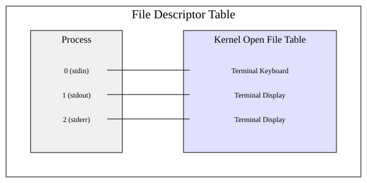

# Стандартні потоки: stdin, stdout, stderr й дескриптори 0, 1, 2

<preknowlist>
- [Концепції ядра Linux](book:unix-linux/kernel-and-userspace) — базові поняття системних викликів та VFS.
</preknowlist>

Unix і Linux побудовані навколо концепції «все є файл». Коли ви запускаєте програму, операційна система автоматично відкриває для неї три спеціальні «файли», які називаються стандартними потоками. Це стандартне введення (stdin), стандартне виведення (stdout) і стандартне виведення помилок (stderr).

У цій статті ми глибоко зануримося в те, як працюють ці потоки на рівні ядра (дескриптори 0, 1, 2), як стандартна бібліотека C (libc) здійснює їх буферизацію, і як програми дізнаються, чи взаємодіють вони з терміналом за допомогою системного виклику `isatty()`.

## Файлові дескриптори 0, 1 і 2

Коли процес звертається до файлу, він не використовує ім'я файлу безпосередньо. Замість цього ядро повертає йому невелике ціле число, яке називається **файловим дескриптором** (file descriptor, FD). Це число є індексом у таблиці відкритих файлів процесу, яку підтримує ядро.

За угодою (яка закріплена стандартом POSIX), кожен новий процес отримує три попередньо відкриті файлові дескриптори:

1.  **0 (stdin, стандартне введення):** Звідси програма читає вхідні дані. За замовчуванням це клавіатура термінала.
2.  **1 (stdout, стандартне виведення):** Сюди програма записує свої звичайні результати роботи. За замовчуванням це екран термінала.
3.  **2 (stderr, стандартне виведення помилок):** Сюди програма записує повідомлення про помилки та діагностичну інформацію. За замовчуванням це також екран термінала.



### Як це виглядає в ядрі

Таблиця файлових дескрипторів належить конкретному процесу. Записи 0, 1 і 2 в цій таблиці є просто вказівниками на записи в глобальній **таблиці відкритих файлів ядра** (kernel open file table). Ця глобальна таблиця, своєю чергою, вказує на vnode (структуру, що представляє реальний файл, пристрій або канал).

Якщо ви запускаєте програму з термінала без перенаправлення, дескриптори 0, 1 і 2 вказують на один і той самий пристрій — ваш термінал (наприклад, `/dev/pts/0`).

Коли ви використовуєте перенаправлення в оболонці (наприклад, `> output.txt`), оболонка:
1. Відкриває файл `output.txt`.
2. Використовує системний виклик `dup2()` для копіювання отриманого файлового дескриптора в дескриптор 1.
3. Закриває початковий дескриптор.
4. Запускає програму.

Програма продовжує писати у файловий дескриптор 1, не підозрюючи, що ядро тепер спрямовує ці дані у файл, а не на екран.

## Буферизація в libc (Standard I/O)

Системні виклики (такі як `read()` і `write()`) працюють повільно, оскільки вимагають перемикання контексту між простором користувача і простором ядра. Щоб мінімізувати кількість системних викликів, стандартна бібліотека C (`libc`), яка надає функції на кшталт `printf()`, `fputs()` і `fread()`, використовує **буферизацію**.

Потоки високого рівня в C (структури `FILE *`, такі як `stdin`, `stdout`, `stderr`) є обгортками над файловими дескрипторами (0, 1, 2) і містять власні буфери в пам'яті користувача.

Існує три режими буферизації:

### 1. Повна буферизація (Fully Buffered або Block Buffered)

У цьому режимі `libc` накопичує дані в буфері (зазвичай розміром 4 КБ або 8 КБ). Системний виклик `write()` виконується лише тоді, коли буфер заповнюється повністю.
*   **Коли використовується:** Це режим за замовчуванням для файлів і каналів (pipes).
*   **Переваги:** Максимальна продуктивність при записі/читанні великих обсягів даних.
*   **Недоліки:** Дані не з'являються одразу. Це може бути проблемою для інтерактивних програм.

### 2. Рядкова буферизація (Line Buffered)

У цьому режимі дані накопичуються в буфері, але `write()` викликається автоматично щоразу, коли в потоці зустрічається символ нового рядка (`\n`).
*   **Коли використовується:** Це режим за замовчуванням для `stdout` і `stdin`, **якщо вони підключені до термінала**.
*   **Переваги:** Зручно для інтерактивних програм, де ви хочете бачити виведення рядок за рядком (наприклад, логи в консолі).
*   **Недоліки:** Більше системних викликів, ніж при повній буферизації, якщо рядки короткі.

### 3. Без буферизації (Unbuffered)

У цьому режимі кожен символ одразу передається ядру через системний виклик `write()`.
*   **Коли використовується:** Це режим за замовчуванням для `stderr`.
*   **Переваги:** Повідомлення з'являються миттєво, навіть якщо програма аварійно завершується (crash) одразу після цього. Ви не втратите важливі повідомлення про помилки, які могли б застрягти в буфері `stdout`.
*   **Недоліки:** Дуже низька продуктивність через величезну кількість системних викликів.

### Зміна режиму буферизації

Програміст може змінити режим буферизації будь-якого потоку за допомогою функції `setvbuf()` з бібліотеки C.
Крім того, утиліта `stdbuf` (частина GNU Coreutils) дозволяє змінити буферизацію іншої програми під час її запуску без модифікації коду:

```bash
# Зробити stdout програми grep повністю буферизованим (наприклад, 4K)
stdbuf -o4K grep 'error' log.txt > errors.txt

# Зробити stdout програми рядково-буферизованим (корисно для tail -f | grep)
stdbuf -oL tail -f log.txt | grep 'error'
```

## isatty(): Як програми розпізнають термінал

Ви коли-небудь помічали, що утиліта `ls` виводить імена файлів у стовпчики, якщо ви запускаєте її просто в терміналі, але виводить по одному файлу на рядок, якщо ви перенаправляєте її виведення (`ls > files.txt` або `ls | wc -l`)?

Як програма дізнається, куди йде її виведення? Відповідь — функція `isatty()`.

`isatty(int fd)` — це бібліотечна функція, яка перевіряє, чи вказує даний файловий дескриптор на термінал. Під капотом вона зазвичай робить системний виклик `ioctl()` (наприклад, `TCGETS`) до дескриптора. Якщо дескриптор є терміналом, `ioctl` повертає успіх і параметри термінала (терміос). Якщо це звичайний файл або канал, `ioctl` повертає помилку `ENOTTY` (Inappropriate ioctl for device).

Програми використовують `isatty()` для адаптації своєї поведінки:

1.  **Кольорове виведення:** Такі утиліти, як `grep --color=auto` або `ls --color=auto`, викликають `isatty(1)` (для stdout). Якщо виведення йде в термінал, вони додають ANSI-коди кольорів. Якщо виведення йде у файл, вони вимикають кольори, щоб не засмічувати файл незрозумілими спецсимволами (`\033[31m`).
2.  **Пагінація:** Такі програми, як `git log` або `man`, перевіряють, чи підключений stdout до термінала. Якщо так, вони автоматично запускають пейджер (наприклад, `less`), щоб ви могли гортати текст. Якщо ні, вони просто виводять увесь текст одразу.
3.  **Інтерактивні підказки:** Оболонка (bash, zsh) перевіряє `isatty(0)` (stdin) і `isatty(1)` (stdout). Якщо обидва є терміналами, вона працює в інтерактивному режимі (показує prompt, підтримує історію). Інакше вона вважає, що виконує скрипт, і працює неінтерактивно.

### Приклад на C

Ось як просто використовувати `isatty()`:

```c
#include <stdio.h>
#include <unistd.h>

int main() {
    if (isatty(STDOUT_FILENO)) {
        printf("stdout is a terminal. Yay, colors!\\n");
    } else {
        printf("stdout is redirected to a file or pipe. Plain text only.\\n");
    }
    return 0;
}
```

## Підсумок

- **Дескриптори 0, 1, 2** — це фундаментальний інтерфейс ядра для стандартних потоків вводу/виводу.
- **libc буферизація** — це оптимізація в просторі користувача. Знання різниці між повною, рядковою та відсутньою буферизацією допомагає зрозуміти, чому `grep` у конвеєрі іноді "зависає" з виведенням, і чому помилки в `stderr` завжди видно миттєво.
- **isatty()** — це спосіб для програми стати "розумнішою" та адаптувати своє виведення (кольори, форматування) залежно від того, чи взаємодіє з нею жива людина через термінал, чи інша програма.
