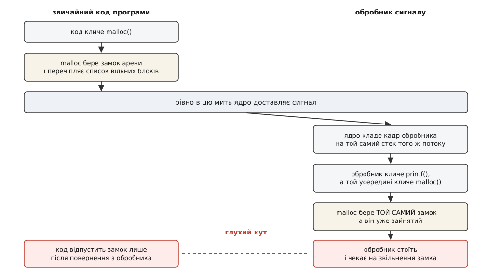
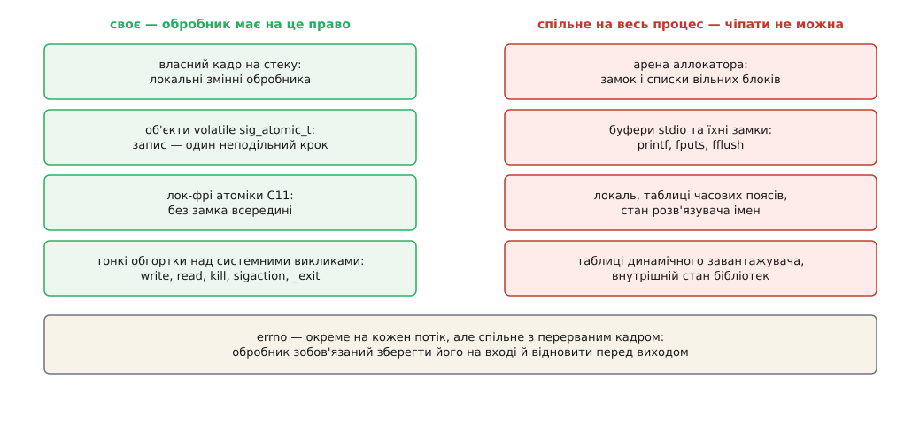
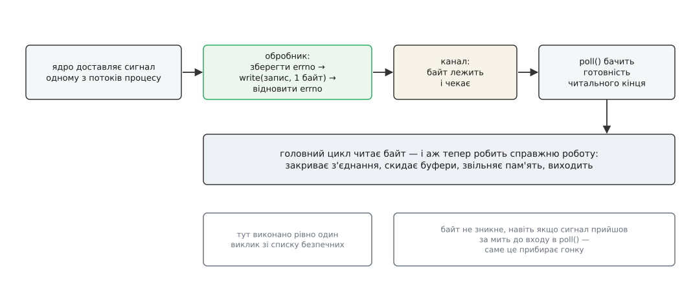

# Що взагалі можна робити в обробнику сигналу

<preknowlist>
- [Сигнал](topic:unix-linux/signal-model) — асинхронне сповіщення процесу: ядро запам'ятовує його й доставляє на найближчому виході в простір користувача.
- [Диспозиція сигналу](topic:unix-linux/signal-disposition) — що процес призначив сигналові: власну функцію-обробник, ігнорування або типову дію.
- [libc як шлюз до ядра](topic:unix-linux/libc-as-gateway) — більшість «системних» функцій насправді код у просторі користувача з власним станом, а не голий вхід у ядро.
- [Реентерабельність](topic:programming/reentrancy) — властивість функції правильно працювати, коли її покликали вдруге, поки перший виклик ще не завершився.
- [Перегони даних і замки](topic:programming/data-races-locks) — чому спільний стан стережуть замком і що означає «замок зайнятий».
- [Купа](topic:programming/heap-dynamic-memory) — динамічна пам'ять і те, що аллокатор веде власний облік вільних блоків.
- [errno](topic:programming/errno) — глобальна змінна, у яку невдалий виклик кладе код помилки й з якої її потім читають.
- [volatile](topic:programming/volatile) — вказівка компіляторові не кешувати значення змінної в регістрі.
- [Буферизація stdio](topic:unix-linux/stdio-buffering) — `printf` не пише в ядро одразу, а складає байти у власний буфер у пам'яті процесу.
</preknowlist>

Демон дістав команду завершитися. Автор, звісно, хоче лишити слід у журналі: у функції, яку система кличе на `SIGTERM`, стоїть один рядок з `printf`. Місяць усе працює. А потім одного дня процес після команди не вмирає й нічого не пише — застигає намертво, з'їдає нуль відсотка процесора й знімається лише через `SIGKILL`.

Випадковості тут немає, і винен не `printf`. Винна механіка того, як програма взагалі потрапляє в обробник.

## Обробник виконує той самий потік, який ви перервали

Слово «обробник» натякає на окремого виконавця, що десь збоку розбирає події. Насправді ядро не створює ні процесу, ні потоку. Воно бере вже наявний потік — той, що в цю мить рахував щось своє, — і править його збережений стан так, щоб повернення в простір користувача сталося не туди, звідки потік вийшов, а на початок вашої функції. Усе потрібне для повернення назад ядро кладе на стек цього ж потоку ([сигнальний кадр і `rt_sigreturn`](topic:unix-linux/signal-frame-and-sigreturn) — структура, яку ядро вибудовує на стеку перед запуском обробника, і окремий системний виклик, яким обробник із неї повертається).

Звідси два наслідки, і обидва вирішальні.

Перший: перерваний код застиг на довільній машинній інструкції й не зрушить, поки обробник не поверне керування. Це не паралельність. Два паралельні потоки просуваються по черзі й зрештою розминаються; тут перерваний код не просувається взагалі — він заручник обробника.

Другий: обробник дістав не порожній світ, а рівно ту саму пам'ять, ті самі дескриптори й ті самі глобальні змінні, з якими щойно працював перерваний код. Тобто це звичайний вкладений виклик посеред довільної функції — тільки функцію цю писали не ви, і зупинилася вона на рядку, якого ви не обирали.

## Замок, який ніхто не відпустить

Візьмімо найчистіший випадок — аллокатор. `malloc` веде власне господарство: списки вільних блоків та їхніх розмірів, і замок, що це господарство стереже. Виділити пам'ять означає взяти замок, зняти блок з одного списку, поправити сусідні посилання, покласти залишок в інший список і замок відпустити. Поки посилання переставлені наполовину, списки не описують нічого осмисленого — і це нормально, бо між взяттям і відпусканням замка туди ніхто не зазирає.

Тепер уявіть, що сигнал прилетів саме туди — між взяттям замка й розчепленням посилань.



*Обидва учасники глухого кута — один і той самий потік: обробник чекає на замок, який відпустять тільки після його повернення.*

Обробник кличе `printf`. Той складає байти у власний буфер, і рано чи пізно — на першому виклику, або коли буфер треба виростити — доходить до `malloc`. `malloc` намагається взяти замок арени. Замок зайнятий. Ким? Цим самим потоком, на два кадри стека нижче. Відпустить він його, коли дорахує своє, а дорахує — коли обробник поверне керування, а обробник поверне — коли дістане замок. Цикл із двох ланок, обидві всередині одного потоку виконання ([дедлок](topic:programming/deadlock) — взаємне очікування, у якому жоден учасник не може зрушити першим).

Найгірше в цій історії те, що заклинювання — ще й щасливий кінець. Реалізація може обійти замок швидкою доріжкою для однопотокової програми — і тоді обробник не застигне, а спокійно перечепить ті самі списки, які перерваний код лишив недоробленими. Пошкодження виявиться пізніше й деінде: у чужому `free`, за годину, у стеку, де жодного сигналу немає.

Замок тут не рятує — він і є пасткою. І рекурсивний замок, який пропустив би власника вдруге, теж нічого б не дав: обробник пройшов би всередину, побачив напівпереставлені посилання й дописав би до них свої.

## Чому «потокобезпечна» — не те слово

Звідси видно межу звичної класифікації. Потокобезпечність будують саме на замках: функція сама себе стереже, і два потоки не втручаються один в одного. Проти переривання власним обробником це не ліки, а отрута — бо той, хто тримає замок, і той, хто на нього чекає, тут одна особа.

Реентерабельність — уже ближче: реентерабельна функція терпить повторний вхід, поки перший не завершився, бо не тримає між викликами спільного стану. Але й цього мало: буває, що функція сама по собі нешкідлива, а от структура, з якою вона працює, у мить сигналу переставлена наполовину.

Тому стандарт заводить окреме поняття — **асинхронно-сигнальну безпечність**. Функція безпечна, якщо вона або реентерабельна, або атомарна щодо сигналів, тобто її виконання обробник перервати не може взагалі. І стандарт не пропонує вам це виводити самотужки: POSIX просто перелічує безпечні функції поіменно й каже прямо — якщо обробник кличе будь-яку іншу функцію зі стандарту, поведінка не визначена.

Список має впізнаваний вигляд. Туди потрапили тонкі обгортки над системними викликами (`write`, `read`, `open`, `close`, `kill`, `sigaction`, `sigprocmask`, `_exit`) і функції, що працюють винятково з пам'яттю, яку ви їм дали (`strlen`, `memcpy`). Не потрапило все, що має власний стан у просторі користувача: увесь stdio, `malloc` і `free`, `syslog`, `setlocale`, `dlopen`, `getaddrinfo`, `pthread_mutex_lock`, `new` і `delete` у C++. Показова дрібниця: у списку немає навіть `snprintf` — відформатувати число в рядок обробникові нема чим, і число доводиться перекладати в цифри руками ([що саме дозволено кликати з обробника](topic:unix-linux/async-signal-safety/api-safe-functions.md) — розбір списку POSIX за групами, з поясненням, чому кожна велика родина функцій до нього не дійшла, і що з поширених зручностей доводиться писати самотужки).

Що список живий, а не висічений у камені, добре видно з історії `fork`. Він стояв там від POSIX.1-2001 — і не даремно: сам виклик коротший нікуди. Але в бібліотеці `fork` — не системний виклик, а обгортка, яка ще й проганяє обробники, зареєстровані через `pthread_atfork`, тобто довільний код застосунку. Обіцяти безпечність за такий код неможливо. У POSIX.1-2024 вимогу до `fork` бути асинхронно-сигнально безпечним прибрали й натомість додали `_Fork` — те саме народження процесу, але без обробників `pthread_atfork`; у glibc він з'явився ще раніше, у версії 2.34 (реалізація Адемервала Занелли). Це не формальність, а сам критерій у дії: у списку тримається те, під чим немає чужого стану ([fork](topic:unix-linux/fork-semantics) — виклик, що робить із процесу два майже однакові).

## errno — чужа річ, яку легко зіпсувати

Навіть бездоганно чистий обробник має одну обов'язкову дію, про яку легко забути.

Перерваний код міг щойно дістати `-1` з `read` і саме збиратися прочитати `errno`, щоб дізнатися причину. Обробник вклинюється й робить свій `write`. Той теж може не вдатися — і теж запише в `errno` свій код. Обробник повертається, перерваний код читає `errno` — і бачить чужу помилку замість власної.

POSIX ставить це прямо: читати й писати `errno` з обробника безпечно **за умови**, що обробник збереже його значення на вході й відновить перед виходом. Умова — частина правила, а не порада.

## Які дані обробникові можна чіпати

З даними стандарт так само конкретний: зі змінних, що переживають виклик, обробник має право читати й писати лише `errno`, лок-фрі атомарні об'єкти й об'єкти типу `volatile sig_atomic_t`.



*Межа проходить не між «складним» і «простим», а між станом, який хтось міг лишити напівзміненим, і станом, якого це не стосується.*

Обидві половини цієї назви несуть свою частину сенсу.

`sig_atomic_t` — це тип, читання й запис якого процесор робить однією неподільною дією. Звучить самоочевидно, поки не згадати, що на 32-бітній машині запис 64-бітного лічильника — це дві окремі інструкції. Сигнал, що прилетів між ними, покаже обробникові половину старого значення склеєну з половиною нового — число, якого програма ніколи не записувала. Стандарт гарантує неподільність рівно для одного типу, і саме тому прапорець оголошують ним, а не звичним `int`.

`volatile` захищає не від процесора, а від компілятора. Цикл `while (!stop_requested) { ... }` компілятор має повне право переписати так, щоб значення прочиталося один раз у регістр і більше не перечитувалося: у видимому коді його ніхто не змінює. Обробник для оптимізатора невидимий, тож без `volatile` цикл просто ніколи не помітить прапорця.

Важлива межа чесності: `sig_atomic_t` не має жодного стосунку до багатопотоковості. Він гарантує неподільність щодо доставки сигналу в тому самому потоці — і нічого не каже про видимість запису іншим ядрам процесора. Коли прапорець ставить обробник, а читає інший потік, потрібен лок-фрі атомарний об'єкт з явним порядком пам'яті ([std::atomic і порядок пам'яті](topic:programming/std-atomic) — атомарні типи та правила видимості записів між потоками); стандарт дозволяє їх в обробнику саме тому, що всередині лок-фрі атоміка немає замка, який можна було б перервати.

> 🔧 **Навіщо це.** Практично всі помилки цього класу мовчазні: код з `printf` в обробнику працює роками, бо ймовірність влучити сигналом усередину `malloc` мала й росте лише з навантаженням. Тому ловлять їх не тестами, а дисципліною на етапі письма — і статичними аналізаторами, які просто звіряють викликане в обробнику зі списком POSIX (у GCC це `-Wanalyzer-unsafe-call-within-signal-handler`, у clang-tidy — перевірка `cert-sig30-c`).

## Найкоротший обробник: перетворити сигнал на подію

Список безпечних функцій підказує стратегію: якщо в обробнику майже нічого не можна, хай він майже нічого й не робить. Уся справжня робота — закрити з'єднання, дописати журнал, звільнити пам'ять — має статися у звичайному коді, який нікого не перервав і володіє моментом.

Найпростіша форма — прапорець. Обробник ставить `volatile sig_atomic_t`, головний цикл на кожному оберті його перевіряє. Для програми, що весь час рахує, цього досить.

Для програми, що весь час **чекає**, — ні. Головний цикл сервера стоїть у `poll` і не крутиться. Прапорця він не побачить, бо не виконує жодної інструкції. Виручити тут може перерваність самого очікування: доставка сигналу вибиває заблокований виклик із `errno == EINTR` ([EINTR](topic:unix-linux/eintr-and-restart) — обірваний сигналом системний виклик повертає помилку замість результату, якщо ядру не сказали перезапустити його самому). Але щілина лишається: якщо сигнал прийшов після перевірки прапорця й до входу в `poll`, переривати вже нічого, а прапорець прочитають лише наступного оберту — тобто після наступної події, якої може не бути ніколи.

Щілину закриває прийом, що виглядає надто простим, аби працювати: обробник пише один байт у власний канал процесу, читальний кінець якого лежить у тому самому наборі дескрипторів, що й сокети ([канали](topic:unix-linux/pipe-and-fifo) — однобічна труба між двома дескрипторами, у якій записане чекає, доки його не прочитають).



*Сигнал перестає бути асинхронною подією і стає звичайною готовністю дескриптора — тією самою, яку цикл і так уміє чекати.*

```c
static int wake_fd = -1;          /* кінець каналу на запис, неблокуючий */

static void on_signal(int signo)
{
    int saved = errno;                        /* чужий errno — під захист */
    unsigned char b = (unsigned char) signo;  /* який саме сигнал прийшов */

    (void) write(wake_fd, &b, 1);             /* один виклик зі списку     */

    errno = saved;                            /* повернути як було         */
}
```

Тут працює кожна дрібниця. `write` є у списку безпечних. Результат свідомо проігноровано: канал неблокуючий, тож коли він переповнений, `write` віддасть `EAGAIN` — і це не біда, бо повний канал означає, що непрочитане пробудження вже й так лежить ([неблокуючий режим](topic:unix-linux/blocking-and-nonblocking) — виклик не чекає всередині ядра, а одразу повертає `EAGAIN`, якщо зробити роботу негайно не можна). І головне: байт залишається в каналі, поки його не прочитають. Сигнал, що прийшов за мить до входу в `poll`, не загубиться — `poll` побачить готовність одразу ([select, poll, epoll](topic:unix-linux/select-poll-epoll) — виклики, що чекають на готовність відразу багатьох дескрипторів).

Прийом придумав Деніел Дж. Бернстайн — за його власним свідченням, близько 1990 року; описав він його в групах `comp.unix.questions` 16 червня 1991-го й `comp.unix.internals` 25 серпня того ж року, а звичну назву «self-pipe trick» дав уже за кілька років. Задача, яку він розв'язував, і досі та сама: змішати очікування на дескриптори з очікуванням на сигнали, не отримавши гонки.

Linux дає й радикальніший вихід — прибрати обробник узагалі. Процес блокує сигнал, і той нікуди не доставляється, а осідає в черзі очікуваних; звідти його дістають або окремим дескриптором `signalfd`, або виділеним потоком через `sigwaitinfo`. Обробник не запускається жодного разу, тож і питання про безпечні виклики не постає: сигнал розбирає звичайний код у звичайний момент ([маскування сигналів і signalfd](topic:unix-linux/signal-mask-signalfd) — як заблокувати сигнал усім потокам і читати сигнали як дані з дескриптора). Ціна — маску треба поставити до створення потоків, бо кожен новий потік успадковує її від творця ([потоки як задачі](topic:unix-linux/threads-as-tasks) — у Linux потік це та сама задача, зі своєю маскою сигналів).

Обидва шляхи разом із коректним завершенням складаються в одну невелику, але примхливу програму ([сервер, що доживає до останнього байта](topic:unix-linux/async-signal-safety/proj-signal-to-event-loop.md) — робочий приклад на C: самоканал і `signalfd` в одному циклі `poll`, коректне завершення за `SIGTERM`, розбір типових пасток — забутий `O_NONBLOCK`, втрачений `SIGINT` між перевіркою й очікуванням, подвійне пробудження).

## Як померти з обробника правильно

Найчастіше обробникові все ж треба завершити процес — і тут теж дві пастки.

`exit` кликати не можна. Він проганяє функції, зареєстровані через `atexit`, і скидає буфери stdio — тобто робить рівно те, чого обробникові робити заборонено, ще й у буферах, які перерваний код міг лишити напівзаповненими. Безпечні відповідники — `_exit` і `_Exit`: вони віддають керування ядру негайно, нічого не скидаючи.

Друга пастка тонша. Якщо процес, отримавши `SIGTERM`, виходить через `_exit(0)`, то батько побачить у `wait` штатний код завершення й ніколи не дізнається, що дитину зупинили сигналом. Оболонки, супервізори та скрипти цю різницю читають. Тому померти треба саме від сигналу — повернути йому типову дію й покликати його на себе знову:

```c
static void die_by(int signo)
{
    struct sigaction dfl;
    sigset_t only;

    dfl.sa_handler = SIG_DFL;                 /* типова дія: убити процес */
    sigemptyset(&dfl.sa_mask);
    dfl.sa_flags = 0;
    sigaction(signo, &dfl, NULL);

    sigemptyset(&only);
    sigaddset(&only, signo);
    sigprocmask(SIG_UNBLOCK, &only, NULL);    /* зняти блокування саме з нього */

    raise(signo);                             /* тепер він доходить і вбиває */
}
```

Розблокування потрібне тому, що на час роботи обробника ядро само блокує свій сигнал — інакше він доставився б повторно й запустив обробник рекурсивно. Усі функції в цьому фрагменті — зі списку безпечних, тож `die_by` можна кликати прямо з обробника.

## Коли сигнал прилітає від власної інструкції

`SIGSEGV`, `SIGBUS`, `SIGFPE` і `SIGILL` стоять осторонь. Вони не приходять ззовні — їх породжує сама інструкція, яку процесор не зміг виконати. Тому обробник тут перериває не «якийсь випадковий момент», а конкретну зламану дію, і правила стають ще жорсткішими.

Повернення з такого обробника не пропускає інструкцію, а повторює її. Якщо причину не усунуто, процесор знову спіткнеться об те саме — і програма закрутиться в нескінченному колі збоїв замість того, щоб чесно впасти. Осмислене повернення можливе тільки там, де обробник справді полагодив причину: наприклад, підклав сторінку через `mmap` за адресою, якої бракувало.

Окремий клопіт — переповнення стека. Сигнал прилітає саме тому, що місця на стеку немає, а обробникові потрібен кадр — на тому ж стеку. Без запасної площадки, яку заводять через `sigaltstack`, обробник не запуститься взагалі й процес помре з типовою дією.

І про відверту практику. Аварійні обробники, що друкують стек викликів, порушують правила свідомо: `backtrace_symbols` виділяє пам'ять, а розбір символів читає файли й веде свій стан. Це не безпечно, і чесна назва цьому — спроба на удачу в момент, коли процес однаково втрачено. Коли слід потрібен надійно, звіт складають інакше: пишуть заздалегідь підготовлений буфер одним `write`, або віддають збір даних окремому процесові, який спостерігає ззовні й нічиїх замків не тримає.

## Вихід стрибком

Лишається спокуса не повертатися з обробника взагалі, а стрибнути через `siglongjmp` у заздалегідь збережену точку — так роблять, наприклад, тайм-аути навколо довгого виклику. Обидві функції, `siglongjmp` і `longjmp`, у списку безпечних є, але стандарт окремо застерігає: якщо стрибок веде туди, звідки програма пішла в перерваний небезпечний виклик, поведінка не визначена.

Причина та сама, з якої почалася вся розмова, тільки наслідок тепер вічний. Перерваний `malloc` при звичайному поверненні хоча б дорахує своє й відпустить замок. Стрибок його не дорахує ніколи: замок лишиться взятим назавжди, а списки — напівпереставленими.

Тому й останній висновок ширший за список POSIX. Список описує лише стандартну бібліотеку — ваш власний глобальний масив, кільцевий буфер чи лічильник у ньому не згадані. А правило до них те саме: обробник міг влучити рівно в середину їхньої зміни. Питання, на яке доводиться відповідати щоразу, одне — чи має ця річ стан, який хтось міг лишити напівзміненим; і чим менше обробник робить, тим менше разів це питання доводиться ставити.
