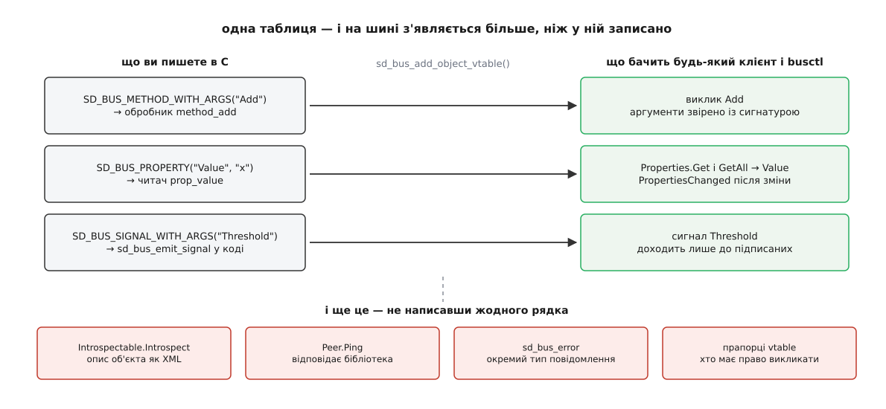

# ⚙️ Служба й клієнт на sd-bus: лічильник, який видно з `busctl`

Напишімо службу, до якої можна звернутися з чужої програми, з командного рядка й зі скрипта, не давши жодній із них ані рядка коду, — а потім клієнта до неї, і подивімось, де такий код зазвичай зависає.

## Що робимо

Служба бере ім'я `org.example.Counter` і виставляє один об'єкт `/org/example/Counter` з інтерфейсом `org.example.Counter1`: метод `Add(x) → x` додає крок і повертає нове значення, властивість `Value` віддає поточне, а сигнал `Threshold(x)` спрацьовує саме тоді, коли лічильник переступає межу вгору. Клієнт викличе метод двома способами, синхронно й асинхронно, і підпишеться на сигнал.

Пишемо на C: `sd-bus` є частиною `libsystemd`, і це C-бібліотека з C-шним двійковим інтерфейсом. Збірка одна на всі приклади:

```bash
cc counter.c -o counter $(pkg-config --cflags --libs libsystemd)
```

## Ідея: не розбирати повідомлення, а описати члени

Спокуса написати «прийшло повідомлення — подивимось, який у нього член, і зробимо `if`» веде до сотень рядків нудної перевірки: чи той інтерфейс, чи та сигнатура, як відповісти на `Introspect`, як обслужити `Properties.Get`. Усе це однакове для будь-якої служби, тож `sd-bus` просить не код, а **таблицю**: перелік членів із сигнатурами й вказівниками на ваші функції. З таблиці бібліотека сама виводить решту.



*Таблиця описує три ваші члени — а на шині з'являється ще й самоопис, стандартні інтерфейси й перевірка аргументів за сигнатурою.*

## Служба

```c
#include <systemd/sd-bus.h>
#include <stdio.h>
#include <string.h>

#define SVC_NAME  "org.example.Counter"
#define SVC_PATH  "/org/example/Counter"
#define SVC_IFACE "org.example.Counter1"

typedef struct { sd_bus *bus; int64_t value, threshold; } Counter;

/* метод Add: додає крок, повертає нове значення, за потреби б'є на сполох */
static int method_add(sd_bus_message *m, void *userdata, sd_bus_error *ret_error) {
    Counter *c = userdata;
    int64_t step, before;
    int r;

    r = sd_bus_message_read(m, "x", &step);      /* «x» — 64-бітове зі знаком */
    if (r < 0)
        return r;                                /* тіло не збіглося з сигнатурою */

    if (step == 0)                               /* іменована помилка, яку клієнт розрізнить */
        return sd_bus_error_set_const(ret_error, SVC_IFACE ".ZeroStep",
                                      "Крок 0 нічого не змінює");

    before = c->value;
    c->value += step;

    /* стандартний сигнал про зміну властивості — його чекають чужі клієнти */
    sd_bus_emit_properties_changed(c->bus, SVC_PATH, SVC_IFACE, "Value", NULL);

    if (before < c->threshold && c->value >= c->threshold)
        sd_bus_emit_signal(c->bus, SVC_PATH, SVC_IFACE, "Threshold", "x", c->value);

    return sd_bus_reply_method_return(m, "x", c->value);
}

/* читач властивості: пише значення просто у вже приготовану відповідь */
static int prop_value(sd_bus *bus, const char *path, const char *iface,
                      const char *prop, sd_bus_message *reply,
                      void *userdata, sd_bus_error *ret_error) {
    Counter *c = userdata;
    return sd_bus_message_append(reply, "x", c->value);
}

static const sd_bus_vtable counter_vtable[] = {
    SD_BUS_VTABLE_START(0),
    SD_BUS_METHOD_WITH_ARGS("Add",
        SD_BUS_ARGS("x", step), SD_BUS_RESULT("x", value),
        method_add, SD_BUS_VTABLE_UNPRIVILEGED),
    SD_BUS_PROPERTY("Value", "x", prop_value, 0,
        SD_BUS_VTABLE_PROPERTY_EMITS_CHANGE),
    SD_BUS_SIGNAL_WITH_ARGS("Threshold", SD_BUS_ARGS("x", value), 0),
    SD_BUS_VTABLE_END
};
```

Імена аргументів у `SD_BUS_ARGS` — не прикраса: вони потрапляють у самоопис, і `busctl introspect` покаже їх людині, яка вашої документації не читала. Прапорець `SD_BUS_VTABLE_PROPERTY_EMITS_CHANGE` обіцяє клієнтам, що про зміну `Value` вони дізнаються сигналом і опитувати не треба; обіцянку виконує рядок із `sd_bus_emit_properties_changed`. `SD_BUS_VTABLE_UNPRIVILEGED` знімає з методу типову вимогу привілеїв — без нього непривілейований клієнт дістане відмову ще до вашого обробника.

Тепер запуск:

```c
int main(void) {
    Counter c = { .value = 0, .threshold = 10 };
    int r;

    r = sd_bus_open_user(&c.bus);        /* під'єднуємось до сеансової шини */
    if (r < 0) goto fail;

    /* СПОЧАТКУ об'єкт, ЛИШЕ ПОТІМ ім'я — інакше клієнт побачить ім'я раніше за метод */
    r = sd_bus_add_object_vtable(c.bus, NULL, SVC_PATH, SVC_IFACE, counter_vtable, &c);
    if (r < 0) goto fail;

    r = sd_bus_request_name(c.bus, SVC_NAME, 0);   /* -EEXIST: ім'я вже зайняте */
    if (r < 0) goto fail;

    for (;;) {
        r = sd_bus_process(c.bus, NULL);  /* щонайбільше ОДНЕ повідомлення за виклик */
        if (r < 0) goto fail;
        if (r > 0) continue;              /* могло лишитися ще — не лягаємо спати */
        r = sd_bus_wait(c.bus, UINT64_MAX);
        if (r < 0) goto fail;
    }
fail:
    fprintf(stderr, "sd-bus: %s\n", strerror(-r));
    sd_bus_flush_close_unref(c.bus);
    return 1;
}
```

Форма циклу випливає з того, що `sd_bus_process` обробляє **щонайбільше одне** повідомлення. Поки він повертає додатне число, у буфері може лежати ще щось, і засинати не можна; нуль означає «черга порожня» — аж тоді `sd_bus_wait` спить на дескрипторі з'єднання.

## Той самий цикл, але в `epoll`

`sd_bus_wait` годиться, поки шина — єдине джерело подій. Щойно з'являється своя мережа, свої таймери чи сигнали, дескриптор шини стає одним із багатьох ([select, poll, epoll](book:unix-linux/select-poll-epoll) — очікування готовності багатьох дескрипторів в одній точці; `epoll` тримає набір усередині ядра й віддає лише готові):

```c
int fd = sd_bus_get_fd(bus);
struct epoll_event ev = { .data.fd = fd };
epoll_ctl(epfd, EPOLL_CTL_ADD, fd, &ev);

for (;;) {
    while ((r = sd_bus_process(bus, NULL)) > 0)   /* вичерпати чергу до нуля */
        ;
    if (r < 0) break;

    int want = sd_bus_get_events(bus);            /* POLLIN та/або POLLOUT */
    ev.events = (want & POLLIN  ? EPOLLIN  : 0)
              | (want & POLLOUT ? EPOLLOUT : 0);
    epoll_ctl(epfd, EPOLL_CTL_MOD, fd, &ev);      /* маска МІНЛИВА: є що слати — POLLOUT */

    uint64_t deadline;                            /* АБСОЛЮТНИЙ строк, CLOCK_MONOTONIC, мкс */
    sd_bus_get_timeout(bus, &deadline);
    int ms = -1;
    if (deadline != UINT64_MAX) {
        struct timespec ts;
        clock_gettime(CLOCK_MONOTONIC, &ts);
        uint64_t now = (uint64_t)ts.tv_sec * 1000000 + ts.tv_nsec / 1000;
        ms = deadline > now ? (int)((deadline - now + 999) / 1000) : 0;
    }
    epoll_wait(epfd, out, N, ms);                 /* тут же прокидаються й ваші дескриптори */
}
```

Дві дрібниці тут коштують дорого. Маску подій треба перепитувати щоразу: доки вихідний буфер порожній, шині потрібен лише `POLLIN`, а щойно ви відправили щось велике — ще й `POLLOUT`. І `sd_bus_get_timeout` віддає **абсолютний** момент, а не тривалість; переводячи його в мілісекунди для `epoll_wait`, округляйте **вгору** — інакше цикл прокидатиметься на частку мілісекунди зарано й крутитиметься вхолосту. Повернення `epoll_wait` з `EINTR` — не помилка, а звичайне переривання сигналом ([EINTR і рестарт викликів](book:unix-linux/eintr-and-restart) — перерваний сигналом виклик повертає `EINTR`, і повторити його має програма).

## Клієнт

```c
static int on_threshold(sd_bus_message *m, void *ud, sd_bus_error *e) {
    int64_t v;
    if (sd_bus_message_read(m, "x", &v) < 0) return 0;   /* читаємо СТРОГО за сигнатурою */
    printf("поріг перетнуто на %lld\n", (long long)v);
    return 0;
}

static int on_reply(sd_bus_message *m, void *ud, sd_bus_error *e) {
    int64_t v;
    if (sd_bus_message_is_method_error(m, NULL)) {       /* відмова приходить сюди ж */
        const sd_bus_error *err = sd_bus_message_get_error(m);
        fprintf(stderr, "відмовила: %s: %s\n", err->name, err->message);
        return 0;
    }
    sd_bus_message_read(m, "x", &v);
    printf("асинхронно: %lld\n", (long long)v);
    return 0;
}

int main(void) {
    sd_bus *bus = NULL;
    sd_bus_error err = SD_BUS_ERROR_NULL;
    sd_bus_message *reply = NULL, *m = NULL;
    int64_t v;

    if (sd_bus_open_user(&bus) < 0) return 1;

    /* правило добору: NULL у полі означає «це поле не перевіряти» */
    sd_bus_match_signal(bus, NULL, SVC_NAME, SVC_PATH, SVC_IFACE, "Threshold",
                        on_threshold, NULL);

    /* синхронно: доречно в утиліті, небезпечно в циклі подій */
    if (sd_bus_call_method(bus, SVC_NAME, SVC_PATH, SVC_IFACE, "Add",
                           &err, &reply, "x", (int64_t)4) < 0) {
        fprintf(stderr, "%s: %s\n", err.name, err.message);
        sd_bus_error_free(&err);            /* рядки можуть бути з купи — звільняти обов'язково */
        return 1;
    }
    sd_bus_message_read(reply, "x", &v);
    printf("синхронно: %lld\n", (long long)v);
    sd_bus_message_unref(reply);

    /* асинхронно: відправили й пішли крутити цикл; 0 — типовий тайм-аут */
    sd_bus_message_new_method_call(bus, &m, SVC_NAME, SVC_PATH, SVC_IFACE, "Add");
    sd_bus_message_append(m, "x", (int64_t)7);
    sd_bus_call_async(bus, NULL, m, on_reply, NULL, 0);
    sd_bus_message_unref(m);

    for (;;) {                              /* той самий цикл, що й у службі */
        int r = sd_bus_process(bus, NULL);
        if (r < 0) break;
        if (r > 0) continue;
        if (sd_bus_wait(bus, UINT64_MAX) < 0) break;
    }
    sd_bus_flush_close_unref(bus);
    return 0;
}
```

Різниця між двома викликами не в зручності, а в тому, хто чекає. `sd_bus_call_method` крутить цикл усередині себе, доки не побачить відповідь із потрібним номером, і на цей час ваша програма мертва. `sd_bus_call_async` лише кладе повідомлення в чергу відправлення й запам'ятовує, кому віддати відповідь; чекає той самий цикл, що обробляє все інше.

## Перевірка без жодного клієнта

```bash
busctl --user tree org.example.Counter
busctl --user introspect org.example.Counter /org/example/Counter
busctl --user call org.example.Counter /org/example/Counter \
       org.example.Counter1 Add x 4
busctl --user get-property org.example.Counter /org/example/Counter \
       org.example.Counter1 Value
busctl --user monitor org.example.Counter      # видно й виклики, і сигнали
```

Якщо `introspect` показує ваші члени з правильними сигнатурами, служба готова: далі жоден клієнт не спитає нічого, чого тут не видно.

## Пастки

**Синхронний виклик усередині обробника.** Найдорожча з усіх. Ваш `method_add` виконується *всередині* `sd_bus_process`; якщо звідти покликати `sd_bus_call_method` до іншої служби, цикл зупиниться, і ваша служба перестане відповідати на все, зокрема на виклик, якого чекає та сама інша служба. Дві служби, що синхронно кличуть одна одну, зависають надійно й обидві. Правило просте: з обробника — лише `sd_bus_call_async`, а відповідь клієнтові доробити в колбеку.

**Тайм-аут відповіді.** Розчепить зависання лише він: типово **25 секунд**. Змінити можна викликом `sd_bus_set_method_call_timeout()` або змінною оточення `SYSTEMD_BUS_TIMEOUT` — але змінну бібліотека читає **один раз** і запам'ятовує, тож підкрутити її на ходу не вийде. Для операції на хвилини тайм-аут не піднімають: відповідають одразу, а результат надсилають сигналом.

**Гонка з іменем.** Клієнт, запущений раніше за службу, дістане `org.freedesktop.DBus.Error.ServiceUnknown`. Три чесні виходи: описати службу файлом активації, щоб брокер підняв її сам; підписатися на `NameOwnerChanged` і чекати появи власника; або довірити порядок менеджерові служб — юніт із `Type=dbus` і `BusName=` вважається запущеним лише тоді, коли ім'я справді взято ([життєвий цикл служби](book:unix-linux/service-lifecycle) — стани юніта й те, за якою ознакою менеджер вирішує, що служба вже піднялася). Усередині служби гонка теж є, і вона тонша: реєструйте таблицю **до** `sd_bus_request_name`, бо ім'я — це сигнал «я готовий».

**Помилки.** `sd_bus_error` після невдалого виклику часто містить рядки з купи — `sd_bus_error_free` обов'язковий, інакше витік на кожній відмові. У службі не повертайте з обробника голий `-EINVAL`: клієнт дістане загальне `org.freedesktop.DBus.Error.InvalidArgs` і не відрізнить його від помилки самої бібліотеки. Іменована помилка через `sd_bus_error_set_const` — це те, за чим клієнт відрізнить «крок нульовий» від «служби немає».

**Дві шини.** Приклад бере сеансову: `sd_bus_open_user` читає `DBUS_SESSION_BUS_ADDRESS`, а без неї пробує `$XDG_RUNTIME_DIR/bus`; під `sudo` чи в `ssh` без сеансу немає ні того, ні того — виклик падає, хоча код правильний. Переїзд на системну шину додає ще одну сходинку: `sd_bus_request_name` там поверне `-EPERM`, доки ви не покладете правило в `/usr/share/dbus-1/system.d/`, яке дозволить вашому користувачеві володіти цим ім'ям. І перевіряйте потрібну шину: `busctl --user` і `busctl --system` показують різні світи, а `busctl` без прапорця — системний.
