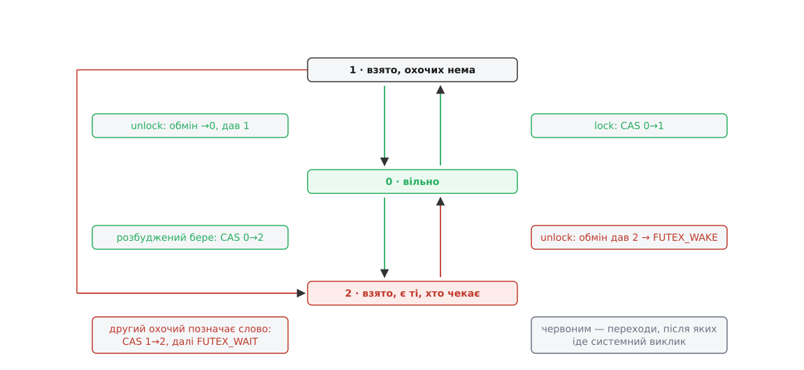

# ⚙️ Мʼютекс на futex: від наївного до правильного

Зробимо мʼютекс власноруч — три десятки рядків C, жодної бібліотеки, один системний виклик `futex(2)`. Вправа варта заходу не сама по собі: у цих тридцяти рядках видно, звідки береться цифра «взяти незайнятий замок коштує два десятки наносекунд», і чому кожна спроба трохи спростити цей код обертається зависанням.

Замок — це одне 32-бітове слово в памʼяті, яку нитки бачать спільно. Ядро про нього не знає нічого, поки ми самі до нього не прийдемо. Обгортка над викликом одна на все:

```c
#include <linux/futex.h>
#include <sys/syscall.h>
#include <unistd.h>

static int futex(int *uaddr, int op, int val)
{
    return syscall(SYS_futex, uaddr, op, val, NULL, NULL, 0);
}
```

`syscall()` тут не примха: обгортки для `futex` у glibc немає взагалі. Виклик навмисне лишили будівельним матеріалом для бібліотек ниток, а не прикладним інструментом.

## Два стани: працює, але платить щоразу

Найпростіше кодування — `0` вільно, `1` взято:

```c
void lock2(int *m)
{
    int c = 0;
    while (!__atomic_compare_exchange_n(m, &c, 1, 0,
                                        __ATOMIC_ACQUIRE, __ATOMIC_RELAXED)) {
        futex(m, FUTEX_WAIT_PRIVATE, 1);   /* спати, поки там 1 */
        c = 0;                             /* CAS затер очікуване значення */
    }
}

void unlock2(int *m)
{
    __atomic_store_n(m, 0, __ATOMIC_RELEASE);
    futex(m, FUTEX_WAKE_PRIVATE, 1);       /* щоразу, наосліп */
}
```

Спершу про гонку — вона тут є, і саме її обходить будова futex. Між невдалою [атомарною заміною](topic:programming/atomicity-races) і викликом `FUTEX_WAIT` минає час, і нитку можуть зняти з процесора рівно в цьому проміжку. Якщо власник за цю мить відпустить замок, його `FUTEX_WAKE` подасться тоді, коли будити ще нема кого. Далі наша нитка лягає спати на вже вільний замок — і не прокидається.

Не стається цього тільки тому, що `FUTEX_WAIT` означає не «спати», а «спати, якщо за адресою досі лежить 1». Ядро бере замок кошика своєї хеш-таблиці, звіряє слово з переданим значенням і лише за збігу ставить задачу в чергу. Власник устиг записати нуль — звірка не збігається, виклик повертає `EAGAIN`, нитка не засинає й іде на новий оберт циклу.

Звідси й відповідь, чому самого CAS у циклі мало. CAS уміє рівно одне: узяти замок або не взяти. Чекати ним можна тільки крутячись на процесорі, спалюючи такт за тактом. А будь-яке засинання, влаштоване **окремо** від перевірки — хоч через сигнал, хоч через умовну змінну поверх іншого замка, — знову розчахує ту саму щілину між «побачив, що зайнято» і «заснув». Неподільність «звірив і заснув» мусить бути всередині одного виклику, і саме її futex і продає.

Отже, код правильний. Тепер подивімося на `unlock2`. Власник не має жодного способу дізнатися, чи чекає хтось: слово каже «взято», і не більше. Тож він кличе `FUTEX_WAKE` завжди — і в тому переважному випадку, коли замок узяли й віддали без жодної суперечки. Виграш, заради якого futex існує, ми щойно повернули назад: швидкий шлях знову коштує вхід у ядро.

Полагодити це окремим лічильником охочих задарма не вийде. Ядро звіряє **одне** слово, тож ознака «є ті, хто чекає» в сусідній змінній у ту саму неподільну звірку не входить. Виходить класична пара «я пишу своє й читаю чуже» на двох незалежних змінних: охочий позначається й читає слово замка, власник обнуляє слово й читає ознаку — і щоб жоден із них не побачив застарілого значення, обидва мусять поставити повний барʼєр памʼяті, а це на x86 ще одна атомарна операція. Заплатили б нею рівно на швидкому шляху, заради якого все й затівалося. Ознака мусить жити в тому самому слові, яке ядро порівнює.

## Три стани

Це і є розвʼязок Ульріха Дреппера (Ulrich Drepper) з праці «Futexes Are Tricky» — третє значення того самого слова:

- `0` — вільно;
- `1` — взято, охочих нема;
- `2` — взято, і хтось або вже спить, або збирається заснути.



*Зелені переходи не перетинають межі ядра взагалі; системний виклик зʼявляється лише там, де хтось справді лягає спати або кого треба будити.*

Щоб код читався так само, як його викладав Дреппер, зробимо помічника, що повертає **старе** значення слова:

```c
/* повертає те, що лежало в *p (як апаратний cmpxchg) */
static inline int cas(int *p, int expected, int desired)
{
    __atomic_compare_exchange_n(p, &expected, desired, 0,
                                __ATOMIC_ACQUIRE, __ATOMIC_RELAXED);
    return expected;   /* при невдачі сюди записано справжнє значення */
}

void mutex_lock(int *m)
{
    int c = cas(m, 0, 1);
    if (c == 0)
        return;                              /* швидкий шлях: у ядро не йдемо */

    do {
        if (c == 2 || cas(m, 1, 2) != 0)     /* позначити: тут є охочі */
            futex(m, FUTEX_WAIT_PRIVATE, 2); /* спати, поки там 2 */
        c = cas(m, 0, 2);                    /* прокинулись — пробуємо взяти */
    } while (c != 0);
}

void mutex_unlock(int *m)
{
    if (__atomic_exchange_n(m, 0, __ATOMIC_RELEASE) == 2)
        futex(m, FUTEX_WAKE_PRIVATE, 1);
}
```

Тепер відпускання дивиться на те, що саме воно щойно витіснило зі слова. Була одиниця — суперечки не було, ядро не потрібне, весь відпуск звівся до однієї атомарної інструкції. Була двійка — хтось чекає, і тільки тоді ми платимо за `FUTEX_WAKE`.

Дві дрібниці у взятті виглядають довільними, і вони різної ваги. Перша — суто заради швидкості: `cas(m, 1, 2)` пропускається, коли `c` уже дорівнює двійці, бо заміна 1→2 у цьому разі однаково не спрацювала б, а зайва атомарна операція над спільним рядком кешу не безкоштовна. Прибрати цей `c == 2` можна, і код лишиться правильним: заміна віддала б те, що справді лежить у слові, і рішення «спати чи ні» вийшло б те саме. Друга дрібниця вже обовʼязкова: узявши замок після пробудження, ми записуємо **2, а не 1**. Ми не знаємо, чи лишився ще хтось у черзі, — розбудили ж одного. Заявити «охочих нема» означало б приректи решту на вічний сон. Зайва двійка коштує один непотрібний `FUTEX_WAKE` на виході; забута — зависання назавжди.

## Чому навколо `FUTEX_WAIT` обовʼязково цикл

Зверніть увагу: результат `futex()` ми не перевіряємо взагалі. Це не недбальство, а єдиний спосіб лишитися правильним, бо повернутися виклик може з чотирьох різних причин, і жодна з них не означає «замок твій»:

- **`EAGAIN`** — слово змінилося ще до звірки; нитка не спала жодної миті;
- **`EINTR`** — прийшов сигнал, а його обробник не має `SA_RESTART`; із цим прапорцем ядро перезапустить очікування само, [без вашої участі](topic:unix-linux/eintr-and-restart);
- **хибне пробудження** — `FUTEX_WAKE` за цією адресою подав хтось геть сторонній: місце нашого слова раніше належало чужому обʼєктові синхронізації, а чужий код досі будить саме цю адресу. Посібник `futex(2)` прямо радить вважати, що навіть повернення нуля може бути хибним пробудженням;
- **справжнє пробудження** — але замок відтоді міг перехопити той, хто прийшов швидким шляхом і взагалі не спав. Futex-мʼютекс не передає замок із рук у руки: розбуджений дістає лише право спробувати ще раз.

Отже, єдиний надійний висновок після повернення — «щось могло змінитися, перевір слово сам». Умову знає ваш код, ядро знає лише число.

## Впорядкування памʼяті й приватність

Взяття мусить бути щонайменше `__ATOMIC_ACQUIRE`, відпускання — `__ATOMIC_RELEASE`. Це не декорація: [впорядкування памʼяті](topic:programming/memory-ordering-barriers) — єдине, що забороняє процесорові й компіляторові винести читання захищених даних поперед узяття замка, а записи в них — за межу відпускання. Пара «release-запис нуля → acquire-читання цього нуля» і створює той причиновий звʼязок, заради якого мʼютекс узагалі існує. `__ATOMIC_RELAXED` як порядок невдачі — свідомий вибір: невдала заміна нічого не відкриває, вона лише каже, що робити далі.

Пастка в тому, що на x86-64 усі ці позначки не міняють жодної інструкції: `lock cmpxchg` і так є повним барʼєром. Код із випадково ослабленим порядком пройде всі тести на ноутбуці й розсиплеться на ARM чи RISC-V, де слабкий порядок памʼяті — не теорія, а щоденна реальність.

`FUTEX_PRIVATE_FLAG` (він же суфікс `_PRIVATE` в іменах операцій) міняє те, як ядро рахує ключ черги. Для приватного futex ключ — пара «адресний простір + віртуальна адреса», і на цьому все: ні заглядання в таблиці сторінок, ні пошуку обʼєкта памʼяті. Без прапорця ядро мусить розвʼязати адресу до сторінки й побудувати ключ з inode та зсуву в ньому — щоб два процеси, які відобразили одну памʼять за різними адресами, потрапили в один кошик. Замок усередині одного процесу за цю послугу платити не мусить.

## Пастки

**`if` замість `while`.** Найчастіша й найтихіша: розбуджена нитка вважає, що замок уже її. Дві нитки в критичній ділянці одночасно, дані під замком тихо псуються, а на слабко навантаженій машині це може не вилізти місяцями.

**Обмін значеннями замість умовної заміни.** `__atomic_exchange_n(m, 1, …)` виглядає дешевшим за CAS і на двох станах справді годиться. На трьох він знищує інформацію: якщо в слові було 2, обмін перепише його на 1, власник на виході побачить одиницю, вирішить, що охочих нема, і `FUTEX_WAKE` не покличе — сплячі не прокинуться ніколи. Взяття мусить бути умовним саме тому, що 1 і 2 не рівноцінні.

**Замок між процесами.** Слово має лежати у [спільній памʼяті](topic:unix-linux/posix-shared-memory), а з операцій треба прибрати `FUTEX_PRIVATE_FLAG` — інакше кожен процес порахує свій ключ за своїм адресним простором, і пробудження до сусіда не дійде. Помилка мовчазна: код працює, поки нитки в одному процесі, і зависає, щойно ви рознесете їх по різних. Пильнуйте й за тим, що приватне відображення після `fork` розходиться копіюванням при записі: замок, який здавався спільним, стане двома незалежними.

**Смерть власника.** Наш мʼютекс цього не переживе: у слові лишиться 1 або 2, а ядро не має способу здогадатися, що це був замок. Усі, хто чекає, спатимуть довіку. Лікує тільки стійкий (robust) список — але він вимагає іншого кодування слова: у молодших тридцяти бітах ядро хоче бачити ідентифікатор нитки-власника, щоб при смерті процесу пройтися списком, підняти в слові біт `FUTEX_OWNER_DIED` і розбудити одного з охочих. Схема 0/1/2 під це не підходить у принципі.

> 🔧 **Навіщо це.** У справжній програмі писати все це не треба: `pthread_mutex_t` — той самий код, доведений до кінця, з перевіркою помилок, рекурсивністю, стійкістю й успадкуванням пріоритету. Цінність вправи в іншому. Тепер за рядком `pthread_mutex_lock` видно конкретну машинерію: одну атомарну інструкцію в звичайному разі й два системні виклики на кожну передачу замка в разі суперечки. Звідси й правило, чому дрібнити критичні ділянки корисно, а брати замок «про всяк випадок» у гарячому циклі — ні: доки суперечки нема, замок майже безкоштовний, а щойно вона зʼявилася, ціна стрибає на два порядки.
