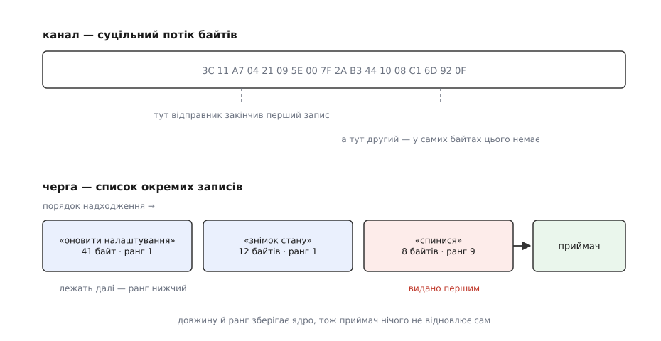
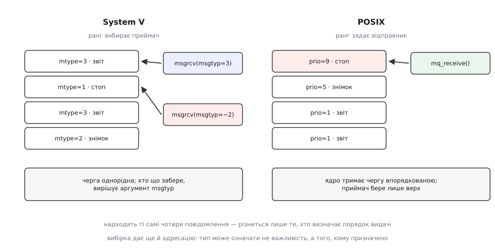
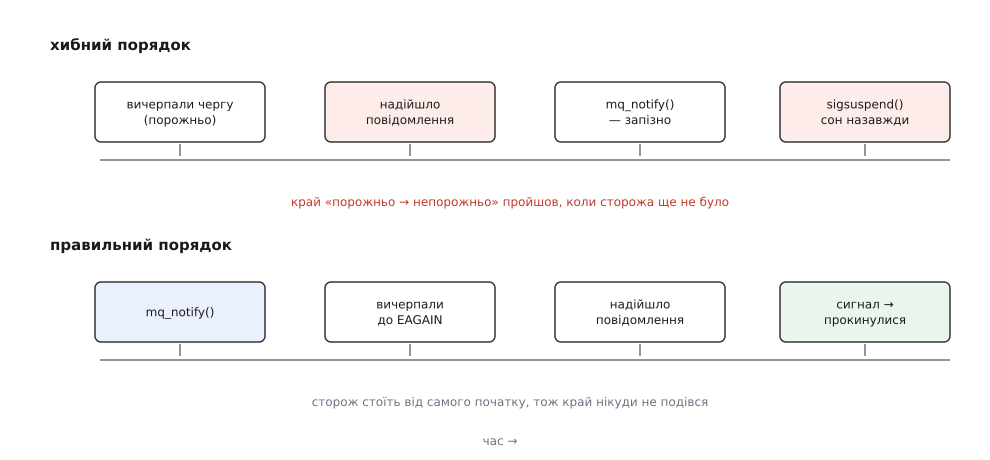

# Черги повідомлень

<preknowlist>
- [Процес](topic:unix-linux/process-model) — окрема одиниця виконання з власною пам'яттю, яка нічого не бачить у сусіда безпосередньо.
- [Файловий дескриптор](topic:unix-linux/file-descriptor) — невелике число, яким процес називає ядру вже відкритий об'єкт вводу-виводу.
- [Системний виклик](topic:unix-linux/syscall-mechanics) — перехід у ядро й назад, помітно дорожчий за звичайний виклик функції.
- [Канали й іменовані канали](topic:unix-linux/pipe-and-fifo) — найпростіший спосіб передати байти сусідньому процесові й що саме він передає.
- [Блокуючий і неблокуючий режим](topic:unix-linux/blocking-and-nonblocking) — що означає «виклик чекає» і що змінює прапорець `O_NONBLOCK`.
- [select, poll, epoll](topic:unix-linux/select-poll-epoll) — очікування готовності багатьох дескрипторів в одній точці програми.
- [Сигнал](topic:unix-linux/signal-model) — асинхронне сповіщення, що перериває виконання процесу.
- [Біти прав](topic:unix-linux/permission-bits) — трійки прав власника, групи й решти, і як ядро вирішує, кого пускати до об'єкта.
- [POSIX](topic:unix-linux/posix-standard) — що саме зафіксовано стандартом, а що лишається особливістю конкретної системи.
</preknowlist>

Служба, яка керує приводом, дістає розпорядження з трьох боків: веб-інтерфейс просить оновити налаштування, планувальник щогодини наказує зробити знімок стану, а кнопка на корпусі каже спинитися негайно. Усі троє — окремі програми, усі троє звертаються до однієї. Якщо шлях до неї один і спільний, аварійне «спинися» стоятиме в ньому за знімком стану, який триває вісім секунд.

І це ще не головна біда. Спільний шлях, який дає Unix найпростіше — канал, — переносить не розпорядження, а байти. Записали двадцять байтів і потім ще тридцять — читач може отримати всі п'ятдесят одним шматком, або сім, а тоді сорок три. Де кінчається одне розпорядження й починається наступне, ядро не знає й знати не може: у потоці байтів такого поняття немає. Довжину доводиться дописувати самому й самому ж збирати шматки назад ([серіалізація даних](topic:programming/data-serialization) — як перетворити структуру на байти й звідки читач бере довжину, щоб знати, де кінець запису).

Отже, від засобу передачі тут потрібні дві речі, яких потік байтів не має за побудовою. Перша — **одиниця**: скільки записали одним викликом, стільки й має прочитатися, цілим. Друга — **ранг**: порядок видачі має визначати важливість, а не мить надходження. Об'єкт ядра, який дає обидві, називають чергою повідомлень.

## Що саме лежить у ядрі

Канал — це кільцевий буфер байтів. Черга повідомлень — список записів. Коли відправник викликає `msgsnd` або `mq_send`, ядро виділяє під повідомлення власну пам'ять, копіює туди байти з буфера процесу й **запам'ятовує поряд довжину та ранг**. Коли приймач викликає `msgrcv` чи `mq_receive`, ядро копіює запис у його буфер, повертає точну довжину й викидає запис зі списку.

Межі виживають саме тому, що довжину зберігають, а не вгадують. Приймачеві не треба домовлятися з відправником про роздільник чи префікс довжини — про це вже домовилося ядро, один раз і для всіх.



*Той самий обмін двома способами: у каналі читач сам шукає, де кінчається запис, у черзі межу тримає ядро, і видача йде за рангом, а не за чергою надходження.*

За це платять двічі. По-перше, кожне повідомлення проходить через ядро двома копіями — з буфера відправника в ядро й з ядра в буфер приймача, плюс два системні виклики. Для розпорядження на сотню байтів це нікого не обходить: копія дешевша за сам перехід у ядро. Для потоку відеокадрів — навпаки, і тоді беруть [спільну пам'ять](topic:unix-linux/posix-shared-memory), де байти не рухаються взагалі.

По-друге — і це важливіше — пам'ять під записи ядро бере зі своєї, а не з процесу. Ядро не може дозволити собі необмежене зростання через те, що якийсь демон не встигає читати. Тому кожна черга має тверду стелю, і коли вона впирається, `msgsnd` не помиляється й не викидає дані — він **засинає**, доки приймач не звільнить місце.

> 🔧 **Навіщо це.** Стеля черги — не прикрість, а вбудований протитиск. Швидкий виробник автоматично гальмує до швидкості споживача, і система, замість тихо втрачати розпорядження чи роздуватися до OOM, просто сповільнюється ([протитиск](topic:algorithms/backpressure) — чому конструкція без зворотного гальмування рано чи пізно або переповнює буфер, або починає губити дані). Якщо ж гальмувати не можна — ставлять `IPC_NOWAIT` чи `O_NONBLOCK`, дістають `EAGAIN` і **свідомо** вирішують, що робити з зайвим: відкинути, злити на диск, підняти тривогу.

## Дві родини, дві дисципліни

Черг повідомлень у Unix не одна, а дві, і різняться вони не косметикою імен. Історія цього роздвоєння — окрема ([дві родини IPC](topic:unix-linux/ipc-landscape/hist-sysv-and-posix-ipc.md) — System V IPC народилася в Columbus UNIX наприкінці 1970-х і стала загальновідомою з System V 1983 року, а POSIX-варіант прийшов аж 1993-го з розширеннями реального часу; чому другий не витіснив першого). Тут важливе інше: **вони по-різному відповідають на питання, хто визначає порядок видачі — відправник чи приймач**.

**System V.** Черга створюється викликом `msgget` за цілим числом-ключем і повертає ідентифікатор — не дескриптор, просто число. Кожне повідомлення починається полем `long mtype`, обов'язково додатним, а далі йде тіло довільної довжини. Приймач у `msgrcv` вказує `msgtyp` і цим **вибирає, що саме взяти**:

- `msgtyp == 0` — перше повідомлення в черзі, хай яким буде тип: звичайна черга;
- `msgtyp > 0` — перше повідомлення саме цього типу, решта лишається лежати;
- `msgtyp < 0` — повідомлення з **найменшим** типом, не більшим за `|msgtyp|`.

Третій варіант і є пріоритетом: домовтеся, що менше число означає важливіше, і `msgrcv(id, &m, n, -9, 0)` завжди віддасть найтерміновіше з наявного. Другий варіант дає щось інше — **адресацію**. Один об'єкт черги працює як кілька логічних каналів: сервер читає тип 1 (запити), а відповідь кладе з `mtype`, рівним PID клієнта; кожен клієнт чекає на свій номер і чужого не бачить. Одна черга обслуговує сотню клієнтів, і жодних окремих об'єктів на кожного.

**POSIX.** Черга відкривається як `mq_open("/drive-cmd", …)` і повертає `mqd_t` — на Linux це справжній файловий дескриптор. У повідомлення немає типу; натомість `mq_send` бере окремим аргументом беззнаковий пріоритет, від 0 до `sysconf(_SC_MQ_PRIO_MAX) - 1` (на Linux — 32767). Ядро тримає чергу **впорядкованою**: спершу вищий пріоритет, а всередині однакового — за часом надходження. `mq_receive` завжди віддає голову й нічого не вибирає — приймач не може попросити «щось інше».



*Дві дисципліни на тому самому наборі повідомлень: ліворуч черга однорідна, а розбирає її вибірка приймача; праворуч сортує ядро, і приймач бере лише те, що лежить зверху.*

Різниця виходить принципова. System V дає **механізм вибірки**, з якого ви будуєте що завгодно — пріоритет, адресацію, розділення на класи, — але будуєте самі, і кожен учасник має знати вашу домовленість про значення чисел. POSIX дає рівно одну готову річ — терміновість — і не дає більше нічого: щоб розвести відповіді по клієнтах, доведеться заводити окрему чергу на клієнта.

Спільна ж пастка в обох одна й та сама, і вона властива будь-якому впорядкуванню за важливістю: рівний потік термінових повідомлень не дає нетерміновим шансу ніколи ([черга з пріоритетом](topic:algorithms/priority-queue) — структура, у якій видача завжди йде з верхівки, і чому нижні елементи можуть чекати нескінченно). Якщо «оновити налаштування» має колись виконатися, потрібна або стеля на частку термінових, або підвищення рангу з часом — ядро цього не зробить.

Точні сигнатури, поля структур, повний набір прапорців і команд `msgctl`/`mq_getattr` зібрані окремо ([інтерфейс черг повідомлень](topic:unix-linux/message-queues/api-message-queues.md) — довідка обох родин: виклики, аргументи, помилки, керуючі структури й системні межі).

## Скільки повідомлень туди поміститься

Оскільки пам'ять під записи ядрова, межі задають наперед — і задають по-різному.

У System V межа черги — **у байтах**: сума довжин усіх повідомлень, що лежать у ній, не може перевищити `msg_qbytes` (типово 16384). Окремо стоїть стеля на одне повідомлення, `MSGMAX`, типово 8192 байти. Розмір повідомлення довільний, доки він у ці межі вкладається.

У POSIX межа — **у штуках і в розмірі слота**, і обидві фіксуються при створенні:

```c
struct mq_attr a = { .mq_maxmsg = 64, .mq_msgsize = 512 };
mqd_t q = mq_open("/drive-cmd", O_CREAT | O_RDWR, 0600, &a);
```

`mq_msgsize` — це не середній розмір, а розмір **кожного** слота: повідомлення на десять байтів усе одно займе свій. І `mq_receive` вимагає буфер не менший за `mq_msgsize`, інакше поверне `EMSGSIZE` — байдуже, що там насправді лежить одне коротке розпорядження.

Просити скільки заманеться не вийде. Обсяг черг обмежений на користувача лімітом `RLIMIT_MSGQUEUE`, і `mq_open` звіряється з ним при створенні.

**Черга на тисячу розпоряджень по 8 КіБ при типовому ліміті користувача.**

```
mq_maxmsg  = 1000
mq_msgsize = 8192 байтів

тіло       = 1000 · 8192            = 8 192 000 байтів
службове   ≈ 1000 · ~96 байтів      ≈    96 000 байтів   (struct msg_msg плюс вузол дерева
                                                          пріоритетів на кожен слот)
разом      ≈ 8 288 000 байтів       ≈ 7.9 МіБ

RLIMIT_MSGQUEUE (типово)            =    819 200 байтів  ≈ 0.78 МіБ
8 288 000 > 819 200                 →  mq_open відмовляє
```

Щоправда, саме в цьому прикладі до обліку за лімітом справа не дійде: `mq_maxmsg = 1000` непривілейованому процесові ядро відкине раніше й іншим кодом — `EINVAL` за системною стелею `msg_max`, про яку нижче. Облік за лімітом лишається чинним там, де ту стелю вже піднято, і саме він визначає, скільки місця має користувач насправді.

Геометрію черги, отже, обирають не з міркування «хай буде із запасом», а з ліміту, поділеного на розмір слота: за типового ліміту та слотів по 8 КіБ це близько ста повідомлень на всі черги користувача разом. Зменшити слот майже завжди дешевше, ніж підняти ліміт.

Системні стелі для POSIX-черг лежать у `/proc/sys/fs/mqueue/`: `msg_max` (типово 10), `msgsize_max` (типово 8192) і `queues_max` (типово 256 черг на простір імен). Черга, відкрита без `attr`, дістає саме типові 10 × 8192 — і демон, який чекав на тисячу повідомлень у буфері, натомість почне блокуватися на одинадцятому.

## Черга живе довше за того, хто її створив

Канал зникає, щойно закрито останній дескриптор на нього, і прибирати за ним не треба ніколи. Черга поводиться інакше: вона **існує в ядрі сама по собі**, доки її явно не видалять або машина не перезавантажиться. Саме це й робить її зручною — відправник може покласти розпорядження й вийти, а приймач запуститися через хвилину й усе забрати, — і саме це створює половину проблем із нею.

Об'єкт System V не має шляху: ключ — просто число, яке обидві сторони мусять порахувати однаково (звідси допоміжна `ftok`, що робить число зі шляху й літери). У файловій системі його не видно; показує окрема команда `ipcs -q`, видаляє `ipcrm -q`. Демон, який упав і перезапустився двадцять разів із різними ключами, лишить по собі двадцять черг, і жоден інструмент, що дивиться на процеси, їх не покаже.

Об'єкт POSIX має ім'я на кшталт `/drive-cmd` — воно схоже на шлях, але шляхом не є: черги живуть у власному просторі імен, який ядро показує окремою псевдо-файловою системою ([псевдо-ФС](topic:unix-linux/pseudo-filesystems) — procfs, sysfs, tmpfs та інші файлові системи без носія, у яких файли є поглядом на структури ядра):

```
mkdir /dev/mqueue
mount -t mqueue none /dev/mqueue
```

Після цього черги видно як звичайні файли: `ls` перелічує їх, `chmod` міняє права, `rm` видаляє (те саме, що `mq_unlink`), а `cat /dev/mqueue/drive-cmd` показує, скільки байтів даних лежить у черзі зараз і хто підписаний на сповіщення. Це велика перевага над System V: черга перестає бути невидимкою.

Обидві родини бачать межу [простору імен IPC](topic:unix-linux/namespaces) — контейнер має власний набір черг, і ключ чи ім'я з нього не перетинається з тим самим ключем зовні. Побічний ефект, на який натрапляють раз по раз: процес усередині контейнера й процес зовні «домовляються» через однакове ім'я й не бачать одне одного.

Живучість черги породжує дві типові пастки, і обидві виглядають як помилка в коді, хоч насправді помилка в припущенні.

**Стара черга з новими намірами.** `mq_open` з `O_CREAT` без `O_EXCL` на наявному імені не створює нічого — він відкриває те, що вже є, а переданий `attr` просто ігнорує. Ви попросили слот на 4 КіБ, дістали чергу з учорашніми 512 байтами, і `mq_send` починає повертати `EMSGSIZE` на цілком нормальних повідомленнях. Те саме в System V: `msgget` з наявним ключем віддає стару чергу зі старими правами. Ліки прості — `O_EXCL` (чи `IPC_EXCL`), щоб побачити факт існування, і свідоме рішення: видалити й створити заново або прийняти чужу геометрію.

**Учорашні розпорядження.** Служба перезапустилася — а в черзі лежить те, що надійшло перед падінням. Іноді це саме те, чого хочуть (нічого не загубилося), іноді — катастрофа (виконати відкладене «повний хід» через півгодини після аварії). Це не деталь реалізації, а рішення, яке приймає той, хто проєктує: черга нічого не знає про сенс своїх записів. Хто хоче почати з чистого аркуша, той при старті вичерпує чергу неблокуючим читанням до `EAGAIN` або просто видаляє її й створює нову.

## Як дізнатися, що повідомлення прийшло

Найпростіше — заснути в `msgrcv` чи `mq_receive`, і хай ядро розбудить. Це працює, доки черга — єдине джерело подій у програмі. Щойно поряд з'явиться сокет, таймер чи ще одна черга, така конструкція розсипається: процес, який спить на одному виклику, не почує решти.

Тут родини розходяться остаточно. Об'єкт System V **не має дескриптора**, тому в `poll` чи `epoll` його підсунути нічим — лишається окремий потік на кожну чергу з власним `msgrcv`. Це і зайва складність, і зайва синхронізація. POSIX-черга на Linux дескриптор має, і `epoll` з нею працює як зі звичайним сокетом. Тільки пам'ятайте, що це **розширення Linux**, а не вимога стандарту: на FreeBSD чи Solaris той самий код доведеться писати інакше.

Портативна відповідь — `mq_notify`. Процес реєструє намір бути сповіщеним, і ядро дає знати про появу повідомлення сигналом (`SIGEV_SIGNAL`), запуском функції в новому потоці (`SIGEV_THREAD`; glibc робить це через сирий netlink-сокет і власний допоміжний потік) або взагалі нічим (`SIGEV_NONE` — реєстрація без сповіщення, яка просто займає місце для інших). Із сигналом приходить `siginfo` з `si_code == SI_MESGQ` і даними відправника ([реальночасові сигнали](topic:unix-linux/realtime-signals) — черга сигналів і структура `siginfo`, з якої обробник дізнається деталі події).

Правил у `mq_notify` три, і всі три неочевидні:

1. **Реєстрант один.** Друга спроба зареєструватися на ту саму чергу дає `EBUSY`.
2. **Сповіщення — по краю.** Воно спрацьовує лише тоді, коли повідомлення надходить у **порожню** чергу і при цьому ніхто не блокований у `mq_receive`. Якщо в черзі вже щось лежало, нове нічого не викличе: край «порожньо → непорожньо» вже пройдено.
3. **Одноразове.** Після спрацювання реєстрацію знято, і треба реєструватися знову.

Разом ці три правила задають єдиний правильний порядок дій — і той, що напрошується інтуїтивно, є хибним.



*Повідомлення, що надійшло у проміжку між останнім читанням і новою реєстрацією, не створює краю «порожньо → непорожньо» — процес засинає над непорожньою чергою.*

Спокуса — спочатку вичерпати чергу, а потім зареєструватися на наступне. Тоді повідомлення, що надійшло у проміжку, застає чергу порожньою й реєстрації ще немає — краю ніхто не помітив, і наступне повідомлення вже прийде в непорожню чергу, тобто теж мовчки. Процес спатиме над чергою, повною роботи. Правильний порядок зворотний: **спершу реєстрація, потім вичерпування до `EAGAIN`**. Тоді все, що надійшло під час читання, або буде прочитане цим-таки циклом, або дасть край уже після реєстрації.

```c
#include <mqueue.h>
#include <signal.h>
#include <fcntl.h>
#include <stdlib.h>
#include <errno.h>
#include <stdio.h>

static void on_msg(int sig) { (void)sig; }          /* тіло не потрібне */
void handle(const char *msg, size_t len, unsigned prio);

int main(void)
{
    struct sigaction sa = { .sa_handler = on_msg };
    sigemptyset(&sa.sa_mask);
    sigaction(SIGUSR1, &sa, NULL);

    /* сигнал блокуємо: інакше він може прийти між читанням і засинанням */
    sigset_t blocked, waiting;
    sigemptyset(&blocked);
    sigaddset(&blocked, SIGUSR1);
    sigprocmask(SIG_BLOCK, &blocked, &waiting);     /* waiting — маска без SIGUSR1 */

    mqd_t q = mq_open("/drive-cmd", O_RDONLY | O_NONBLOCK);
    if (q == (mqd_t)-1) { perror("mq_open"); return 1; }

    struct mq_attr attr;
    mq_getattr(q, &attr);
    char *buf = malloc(attr.mq_msgsize);

    struct sigevent ev = { .sigev_notify = SIGEV_SIGNAL, .sigev_signo = SIGUSR1 };

    for (;;) {
        if (mq_notify(q, &ev) == -1 && errno != EBUSY) { perror("mq_notify"); return 1; }

        for (;;) {                                  /* вичерпуємо все наявне */
            unsigned prio;
            ssize_t n = mq_receive(q, buf, attr.mq_msgsize, &prio);
            if (n == -1) {
                if (errno == EAGAIN) break;         /* порожньо — можна спати */
                perror("mq_receive"); return 1;
            }
            handle(buf, (size_t)n, prio);
        }

        sigsuspend(&waiting);                       /* відпустити сигнал і заснути — атомарно */
    }
}
```

Другу пастку тут закриває саме `sigsuspend`. Якби сигнал не був заблокований, він міг би прийти в мить між виходом із внутрішнього циклу й засинанням — обробник відпрацював би вхолосту, а процес заснув би вже після краю. Заблокований сигнал у цей проміжок лишається у стані очікування, і `sigsuspend` віддає його одразу, щойно знімає блокування.

> 🔧 **Навіщо це.** Той самий порядок — «озброїти сторожа, потім прибрати наявне» — потрібен усюди, де сповіщення йде по краю, а не за рівнем: `epoll` у режимі `EPOLLET`, `inotify`, сигнальний ввід-вивід. Хто засвоїв його на `mq_notify`, той упізнає ту саму помилку в чужому циклі подій із першого погляду.

## Коли черга — правильна відповідь

Черга повідомлень варта того, щоб її взяти, коли збігається одразу кілька умов: сторони не мусять бути живими одночасно, повідомлення дискретні й невеликі, важливість у них різна, а виробників кілька на одного споживача. Класика — керування службою, що працює місяцями без перерви: розпорядження надходять зрідка, зате мають ранг, і жодна зі сторін не повинна чекати іншу.

Коли ж потрібен двобічний діалог із чітким зіставленням запиту й відповіді, передача дескрипторів, посвідчень відправника або перспектива колись рознести сторони на різні машини — розумнішим стандартним вибором лишається сокет домену Unix у режимі `SOCK_SEQPACKET`: він теж зберігає межі повідомлень, але вміє й діалог, і дескриптори, і посвідчення, а чекати на нього можна звичайним `epoll`; коли ж сторони таки роз'їдуться по машинах, зміниться сімейство адрес, а не будова програми ([огляд засобів взаємодії](topic:unix-linux/ipc-landscape) — три осі, за якими насправді обирають між каналом, чергою, спільною пам'яттю й сокетом). Робочий приклад того, як черга виглядає в живій службі — з двома пріоритетами, коректним перезапуском і вичерпуванням старого, — розібрано окремо ([диспетчер розпоряджень із пріоритетом](topic:unix-linux/message-queues/proj-priority-dispatcher.md) — невелика служба на POSIX-чергах: геометрія, ранги, реєстрація сповіщень і поведінка після падіння).

Головна ж особливість черги, яку варто тримати в голові, стосується не швидкості й не зручності викликів. У каналі й сокеті політика видачі тривіальна — що надійшло раніше, те й вийде раніше, — і вся розумність живе в коді процесів. Черга повідомлень **виносить політику в сам об'єкт ядра**: порядок видачі задає не код процесів, а дисципліна, вбудована в саму чергу, — вибірка приймача в System V, впорядкування ядром у POSIX. Це велика зручність, поки дисципліна вам підходить, і глухий кут, коли ні: наявна черга своєї не змінить, бо вибір зробили один раз — коли обрали родину й створили об'єкт.
