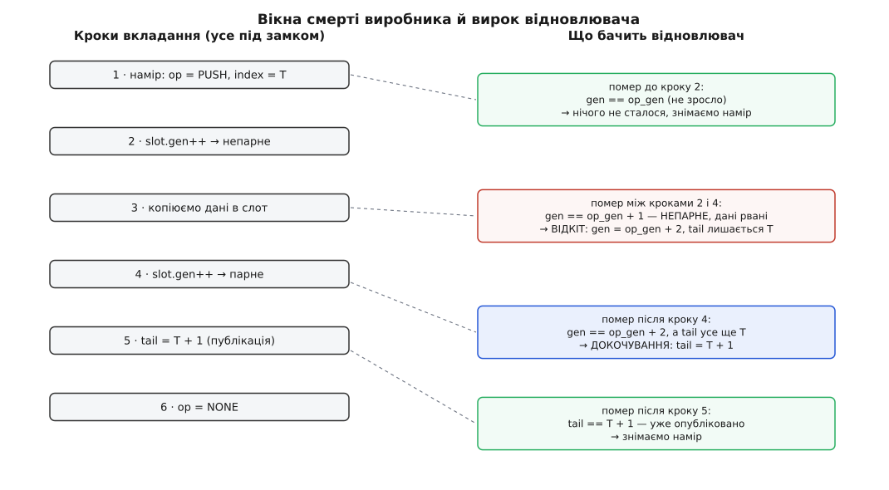

# ⚙️ Черга задач на два процеси, що переживає `kill -9`

Це повна програма на C: два незалежні процеси — виробник і споживач — обмінюються задачами через кільце у спільному сегменті пам'яті, а коли виробникові прилітає `kill -9` рівно посеред запису, споживач сам приводить чергу до ладу й працює далі. Живучий м'ютекс тут не рятує дані: він лише каже «власник помер під замком». Лагодити доводиться самим, і вся вага прикладу — у тому, як улаштувати структуру, щоб недороблену зміну взагалі **можна було** розпізнати й довершити або скасувати.

Мова тут не обирається: розкладка спільного сегмента, `pthread_mutex_t` усередині нього й атомарні слова — це рівень, де працюють саме C і C++.

## Правило, за яким усе будується

Черга спирається на [кільцевий буфер](book:algorithms/ring-buffer) із двома монотонними лічильниками: `tail` — скільки задач укладено, `head` — скільки забрано. Різниця дає довжину, а індекс слота — молодші біти лічильника. Це та частина, яку кожен знає.

Смерть посеред роботи додає до неї одну вимогу, і вона визначає решту конструкції. **Стан має бути таким, щоб зі спільних байтів однозначно читалося, на якому кроці зупинився мрець.** Якщо цього не забезпечити, відновлювач бачить кільце й не знає найголовнішого: чи той запис, на який указує `tail`, уже цілий — чи це половина від старого й половина від нового.

Звідси два засоби. Перший — **лічильник поколінь** у кожному слоті: парне значення означає «запис цілий», непарне — «його зараз пишуть». Другий — **намір**, записаний у заголовок ще до першого дотику до кільця: що саме робимо, з яким номером і яким було покоління слота на початку. Намір коштує три записи в пам'ять, а дає відновлювачеві точну відповідь замість здогаду.

## Розкладка сегмента

```c
/* wq.c — черга задач у спільному сегменті на два незалежні процеси.
   збірка: cc -std=c11 -O2 -Wall -pthread -o wq wq.c -lrt             */
#define _GNU_SOURCE
#include <errno.h>
#include <fcntl.h>
#include <pthread.h>
#include <signal.h>
#include <stdatomic.h>
#include <stdint.h>
#include <stdio.h>
#include <stdlib.h>
#include <string.h>
#include <sys/mman.h>
#include <sys/stat.h>
#include <time.h>
#include <unistd.h>

#define SHM_NAME   "/wq-demo"
#define WQ_MAGIC   0x51574B31u   /* довільне, але СВОЄ: чужий сегмент не сплутаємо */
#define WQ_ABI     1u
#define WQ_SLOTS   64u           /* степінь двійки: індекс — маскою, без ділення */
#define WQ_PAYLOAD 96u

enum { OP_NONE = 0, OP_PUSH = 1, OP_POP = 2 };

struct slot {
    _Atomic uint64_t gen;         /* парне — запис цілий; непарне — його зараз пишуть */
    uint32_t len;
    uint8_t  data[WQ_PAYLOAD];
};

struct wq {
    uint32_t magic, abi;
    uint32_t hdr_size, slot_size; /* розкладка: сусід іншої розрядности не пройде */
    uint32_t slots;
    _Atomic uint32_t ready;       /* 0 → 1 після ПОВНОЇ ініціалізації */

    pthread_mutex_t lock;
    pthread_cond_t  not_empty, not_full;

    _Atomic uint64_t head, tail;  /* монотонні; індекс = значення & (slots − 1) */

    _Atomic uint32_t op;          /* намір, записаний ДО дотику до кільця */
    _Atomic uint64_t op_index;    /* номер запису, який укладають або забирають */
    _Atomic uint64_t op_gen;      /* яким було покоління слота ПЕРЕД зміною */

    struct slot ring[WQ_SLOTS];
};

_Static_assert(ATOMIC_LLONG_LOCK_FREE == 2,
    "64-бітні атоміки мусять бути неблокувальні: інакше компілятор підставить "
    "замок із таблиці власного процесу — сусідові він невидимий");

#define CK(x) do { if (!(x)) { fprintf(stderr, "%s:%d %s (%s)\n", __FILE__, __LINE__, \
                   #x, strerror(errno)); _exit(1); } } while (0)
```

Три дрібниці в цій розкладці варті окремого слова. Поля оголошені `_Atomic` не заради швидкодії — під замком вона й так не потрібна, — а щоб компілятор не переставив запис наміру після запису даних: звичайні присвоєння на `_Atomic` дають найсуворіше впорядкування, і на кількох операціях за задачу його ціна невидима. Статичне твердження про неблокувальні атоміки ловить архітектуру, де 64-бітна атомарна операція реалізується через приховану таблицю замків усередині процесу — у спільній пам'яті така «атомарність» бреше. А `hdr_size` і `slot_size` записані в сам сегмент, бо `sizeof(pthread_mutex_t)` у glibc дорівнює 24 байтам на 32-бітних архітектурах і 40 на x86-64: узгодити ці два погляди неможливо, зате можна чесно відмовитися.

## Одноразова ініціалізація

Право ініціалізувати належить тому, кому вдався `O_EXCL`. Решта чекають на ознаку готовости — і читають її з семантикою захоплення, щоб побачити не лише саму одиницю, а й усі байти, записані до неї ([впорядкування пам'яті](book:programming/memory-ordering-barriers)). Сегмент і його відображення — звичайні `shm_open` та `mmap` ([спільна пам'ять POSIX](book:unix-linux/posix-shared-memory)).

```c
static struct wq *wq_attach(int *out_created)
{
    int created = 1;
    int fd = shm_open(SHM_NAME, O_RDWR | O_CREAT | O_EXCL, 0600);
    if (fd < 0 && errno == EEXIST) { created = 0; fd = shm_open(SHM_NAME, O_RDWR, 0600); }
    CK(fd >= 0);
    if (created) CK(ftruncate(fd, (off_t)sizeof(struct wq)) == 0);

    /* Хто прийшов другим — чекає на повний розмір: між shm_open творця й ftruncate
       файл нульовий, а mmap на короткий файл дає при першому дотику SIGBUS,
       не помилку. */
    for (int i = 0; !created; i++) {
        struct stat st;
        CK(fstat(fd, &st) == 0);
        if ((size_t)st.st_size >= sizeof(struct wq)) break;
        CK(i < 5000); usleep(1000);
    }

    struct wq *q = mmap(NULL, sizeof *q, PROT_READ | PROT_WRITE, MAP_SHARED, fd, 0);
    CK(q != MAP_FAILED);
    close(fd);                       /* відображення живе й без дескриптора */

    if (created) {
        pthread_mutexattr_t ma; pthread_condattr_t ca;
        pthread_mutexattr_init(&ma);
        pthread_mutexattr_setpshared(&ma, PTHREAD_PROCESS_SHARED);
        pthread_mutexattr_setrobust (&ma, PTHREAD_MUTEX_ROBUST);
        pthread_mutex_init(&q->lock, &ma);
        pthread_mutexattr_destroy(&ma);

        pthread_condattr_init(&ca);
        pthread_condattr_setpshared(&ca, PTHREAD_PROCESS_SHARED);
        pthread_condattr_setclock  (&ca, CLOCK_MONOTONIC);   /* НЕ типовий REALTIME */
        pthread_cond_init(&q->not_empty, &ca);
        pthread_cond_init(&q->not_full,  &ca);
        pthread_condattr_destroy(&ca);

        q->magic = WQ_MAGIC; q->abi = WQ_ABI; q->slots = WQ_SLOTS;
        q->hdr_size  = (uint32_t)sizeof(struct wq);
        q->slot_size = (uint32_t)sizeof(struct slot);
        atomic_store_explicit(&q->ready, 1, memory_order_release);   /* ОСТАННІМ */
    } else {
        for (int i = 0; atomic_load_explicit(&q->ready, memory_order_acquire) == 0; i++)
            { CK(i < 5000); usleep(1000); }
        CK(q->magic == WQ_MAGIC && q->abi == WQ_ABI);
        CK(q->hdr_size == sizeof(struct wq) && q->slot_size == sizeof(struct slot));
    }
    *out_created = created;
    return q;
}
```

Лічильники, наміри й покоління починають з нулів, які й так лежать у свіжому сегменті, — і це єдине, що дозволено взяти нулями. М'ютекс і умовні змінні ініціалізуються явно, з атрибутами; чому саме обнулення тут не годиться — у пастках наприкінці.

## Захоплення, що вміє прийняти спадок

```c
static void wq_recover(struct wq *q);                    /* нижче */

static struct timespec deadline_ms(int ms)
{
    struct timespec t;
    clock_gettime(CLOCK_MONOTONIC, &t);      /* ТОЙ САМИЙ годинник, що в condattr */
    t.tv_sec += ms / 1000;
    t.tv_nsec += (long)(ms % 1000) * 1000000L;
    if (t.tv_nsec >= 1000000000L) { t.tv_sec++; t.tv_nsec -= 1000000000L; }
    return t;
}

static void wq_lock(struct wq *q)
{
    int rc = pthread_mutex_lock(&q->lock);
    if (rc == EOWNERDEAD) {          /* замок НАШ, але під ним лишився мрець */
        wq_recover(q);               /* усередині — pthread_mutex_consistent */
    } else if (rc == ENOTRECOVERABLE) {
        fprintf(stderr, "черга непоправна — лишається shm_unlink і почати з чистого\n");
        _exit(2);
    } else CK(rc == 0);
}
```

## Намір, покоління, публікація

Порядок дій у виробнику підібраний так, щоб кожна пара сусідніх кроків лишала по собі розпізнаваний слід.

```c
static int wq_push(struct wq *q, const void *buf, uint32_t len, int die_now)
{
    const uint8_t *p = buf;
    CK(len <= WQ_PAYLOAD);
    struct timespec dl = deadline_ms(2000);

    wq_lock(q);
    while (atomic_load(&q->tail) - atomic_load(&q->head) == WQ_SLOTS) {
        int rc = pthread_cond_timedwait(&q->not_full, &q->lock, &dl);
        if (rc == EOWNERDEAD) { wq_recover(q); continue; }
        if (rc == ETIMEDOUT)  { pthread_mutex_unlock(&q->lock); return -1; }
        CK(rc == 0);
    }

    uint64_t T = atomic_load(&q->tail);
    struct slot *s = &q->ring[T & (WQ_SLOTS - 1)];
    uint64_t g = atomic_load(&s->gen);           /* парне: слот у спокої */

    atomic_store(&q->op_index, T);               /* 1 · намір — ПЕРЕД кільцем */
    atomic_store(&q->op_gen,   g);
    atomic_store(&q->op,       OP_PUSH);

    atomic_store(&s->gen, g + 1);                /* 2 · непарне: слот у роботі */
    s->len = len;                                /* 3 · копіюємо дані           */
    memcpy(s->data, p, len / 2);
    if (die_now) raise(SIGKILL);                 /*    ← те саме, що kill -9 ззовні */
    memcpy(s->data + len / 2, p + len / 2, len - len / 2);
    atomic_store(&s->gen, g + 2);                /* 4 · парне: запис цілий      */

    atomic_store(&q->tail, T + 1);               /* 5 · ПУБЛІКАЦІЯ              */
    atomic_store(&q->op, OP_NONE);               /* 6 · намір знято             */

    pthread_cond_signal(&q->not_empty);
    pthread_mutex_unlock(&q->lock);
    return 0;
}
```

Точка невороття тут одна — крок 5. Усе до нього коїться поза відрізком `[head, tail)`, тобто поза чергою, і нікого не обходить; усе після нього вже видиме споживачеві. Тому й вироків у відновлювача рівно чотири, за числом проміжків.



*Записаний намір із початковим поколінням робить кожне вікно смерті розпізнаваним: три перших вироки різняться лише тим, чи покоління зросло на нуль, один чи два.*

## Відновлення

```c
static void wq_recover(struct wq *q)
{
    uint32_t op = atomic_load(&q->op);

    if (op == OP_PUSH) {
        uint64_t T = atomic_load(&q->op_index), g = atomic_load(&q->op_gen);
        struct slot *s = &q->ring[T & (WQ_SLOTS - 1)];
        uint64_t now = atomic_load(&s->gen);

        if (now == g) {
            fprintf(stderr, "[віднов] намір був, кільця не торкнулися\n");
        } else if (now == g + 1) {               /* ВІДКІТ: дані рвані */
            atomic_store(&s->gen, g + 2);        /* слот знову «цілий», але порожній */
            fprintf(stderr, "[віднов] слот %llu рваний — відкинуто\n",
                    (unsigned long long)T);      /* tail не рухаємо: запису не було */
        } else if (now == g + 2 && atomic_load(&q->tail) == T) {
            atomic_store(&q->tail, T + 1);       /* ДОКОЧУВАННЯ: запис цілий */
            fprintf(stderr, "[віднов] слот %llu цілий — докочено\n",
                    (unsigned long long)T);
        }
    }
    /* OP_POP: якщо head не зрушив, задача лишається в черзі й буде видана вдруге.
       Свідомий вибір «щонайменше раз»: чи встиг мрець її виконати, знати нізвідки. */
    atomic_store(&q->op, OP_NONE);

    /* Цілісність кільця, незалежна від наміру: непарних поколінь бути не сміє,
       а зайнятих слотів — не більше, ніж їх є. */
    for (uint32_t j = 0; j < WQ_SLOTS; j++)
        CK((atomic_load(&q->ring[j].gen) & 1) == 0);
    CK(atomic_load(&q->tail) - atomic_load(&q->head) <= WQ_SLOTS);

    CK(pthread_mutex_consistent(&q->lock) == 0);   /* без цього замок помре назавжди */
}
```

У відкоті ми не рятуємо вміст слота — він поза `[head, tail)` і нікому не потрібен. Ми відновлюємо **інваріант**: після відкоту жодне покоління не лишається непарним, і наступне відновлення знову зможе судити за парністю.

Вирок для `OP_POP` навмисно порожній, і ця порожнеча — рішення, а не недогляд. Мрець устиг скопіювати задачу собі, але встиг чи ні виконати її — у спільній пам'яті сліду не лишає. Не зрушений `head` означає, що задача лишиться в черзі й дістанеться наступному: черга гарантує «щонайменше раз», а не «рівно раз». Хочете протилежного — досить у відновленні зробити `head = op_index + 1`, і задача мовчки зникне. Третього не дано: без підтвердження з боку самого обробника вибір стоїть між повтором і втратою, і зробити його мусить той, хто знає, чи задача ідемпотентна.

> 🔧 **Навіщо це.** Заманливо тримати відновлення «на око»: побачив дивний стан — перезаписав нулями й поїхав далі. Різниця між таким кодом і наміром із поколіннями видна не в день написання, а в день розбору аварії. Тут кожен вирок спирається на арифметику — покоління зросло на нуль, один чи два, — тож у журналі стоїть точна фраза «слот 2 рваний, відкинуто», і питання «а чи не з'їла черга задачу мовчки» закривається за секунди. Механізм, який після смерті не вміє пояснити, що саме він зробив, доводиться перевіряти цілком щоразу, коли щось загубилося.

Найцікавіше в цій функції — її падіння. Якщо перевірка кільця не пройшла, `CK` виходить із процесу, тримаючи замок і **не** підтвердивши цілісности. Тут важлива межа, яку легко проґавити: смерть власника і звільнення замка без підтвердження — різні речі. Мрець лише знову вмикає `FUTEX_OWNER_DIED`, тож наступний дістане черговий `EOWNERDEAD`, зайде в те саме відновлення й упреться в ту саму перевірку. Непоправним (`ENOTRECOVERABLE`) замок стає рівно тоді, коли власник, який дістав `EOWNERDEAD`, зробив `unlock` без `pthread_mutex_consistent`. Тобто вирок «більше не пробуйте» треба виносити свідомо — відпустивши замок перед виходом; лишений як є, він щоразу пропонуватиме наступному спробувати ще раз.

## Споживач і чому тайм-аут тут обов'язковий

```c
static int wq_pop(struct wq *q, void *out, uint32_t *len, int ms)
{
    struct timespec dl = deadline_ms(ms);

    wq_lock(q);
    while (atomic_load(&q->head) == atomic_load(&q->tail)) {
        int rc = pthread_cond_timedwait(&q->not_empty, &q->lock, &dl);
        if (rc == EOWNERDEAD) { wq_recover(q); continue; }   /* замок віддано нам */
        if (rc == ETIMEDOUT)  { pthread_mutex_unlock(&q->lock); return -1; }
        CK(rc == 0);              /* EINTR звідси не буває — лише хибні побудки */
    }

    uint64_t H = atomic_load(&q->head);
    struct slot *s = &q->ring[H & (WQ_SLOTS - 1)];

    atomic_store(&q->op_index, H);
    atomic_store(&q->op_gen, atomic_load(&s->gen));
    atomic_store(&q->op, OP_POP);

    uint32_t n = s->len > WQ_PAYLOAD ? WQ_PAYLOAD : s->len;  /* довжині з чужої */
    memcpy(out, s->data, n); *len = n;                       /* пам'яті не віримо */
    atomic_store(&q->head, H + 1);            /* точка невороття: задачу видано */
    atomic_store(&q->op, OP_NONE);

    pthread_cond_signal(&q->not_full);
    pthread_mutex_unlock(&q->lock);
    return 0;
}
```

Тут ховається наслідок, через який тайм-аут у цій конструкції не розкіш, а частина механізму. Ядро, проходячи робустний список мерця, будить **одного, хто спить на самому м'ютексі**. Споживач у `pthread_cond_timedwait` спить не на м'ютексі — він спить на умовній змінній, свій замок він віддав, засинаючи. Смерть виробника його не будить узагалі. Він прокинеться сам, за строком, і аж тоді, беручи замок назад, дістане `EOWNERDEAD`. Без строку споживач спав би вічно поруч із чергою, яку нікому було полагодити.

Строк відлічується за `CLOCK_MONOTONIC`, бо типовим для умовної змінної є `CLOCK_REALTIME` — годинник, який переводять. Годинник задається один раз, атрибутом при створенні; `clock_gettime` при обчисленні строку мусить брати той самий, інакше строк вийде безглуздим числом.

## Головна програма

```c
int main(int argc, char **argv)
{
    int created; struct wq *q = wq_attach(&created);
    const char *role = argc > 1 ? argv[1] : "";

    if (!strcmp(role, "producer")) {
        long die_at = (argc > 3 && !strcmp(argv[2], "--die-at")) ? atol(argv[3]) : -1;
        for (long n = 1; n <= 10; n++) {
            char msg[WQ_PAYLOAD];
            int k = snprintf(msg, sizeof msg, "задача №%ld", n);
            if (wq_push(q, msg, (uint32_t)k + 1, n == die_at) == 0)
                printf("виробник: уклав %s\n", msg);
            usleep(200000);
        }
    } else if (!strcmp(role, "consumer")) {
        for (;;) {
            char buf[WQ_PAYLOAD]; uint32_t len;
            if (wq_pop(q, buf, &len, 2000) == 0) printf("споживач: узяв %s\n", buf);
            else                                 printf("споживач: дві секунди тиші\n");
        }
    } else { fprintf(stderr, "вжиток: %s producer|consumer [--die-at N]\n", argv[0]); return 1; }
    return 0;
}
```

## Дослід

```sh
rm -f /dev/shm/wq-demo
./wq consumer &
./wq producer --die-at 3        # помре посеред копіювання третьої задачі
```

```
виробник: уклав задача №1
споживач: узяв задача №1
виробник: уклав задача №2
споживач: узяв задача №2
Killed
                                ← тиша: споживач спить на умовній змінній,
                                  і смерть сусіда його не будить
[віднов] слот 2 рваний — відкинуто
споживач: дві секунди тиші
```

Тепер найважливіше — черга жива. Запустіть виробника вдруге, вже без `--die-at`, і задачі підуть далі, без перезавантаження, без перестворення сегмента, без адміністратора. Замініть `--die-at 3` на `kill -9` із сусіднього термінала — вийде те саме, лише момент смерті випаде випадковий, і частина спроб потрапить у вікно між кроками 4 і 5, де в журналі буде «докочено» замість «відкинуто».

## Скільки це коштує

Незаперечуване захоплення живучого м'ютекса — одна атомарна операція над словом, десятки наносекунд; за живучість платять хіба тим, що glibc додає адресу замка до списку у власній пам'яті — без системного виклику. Намір додає до кожної задачі три записи в пам'ять. Відновлення пробігає всі слоти по разу, тобто `O(slots)` — для 64 слотів це одиниці мікросекунд, і трапляється воно раз на смерть, а не раз на задачу. Ціна конструкції — не в тактах, а в тому, що кожну зміну спільного стану доводиться будувати як послідовність із розпізнаваними межами.

## Пастки

**`pshared` на умовній змінній.** Про м'ютекс пам'ятають усі, про `pthread_condattr_setpshared` — не всі. Забутий атрибут не дає ані помилки, ані попередження: сигнал іде в чергу очікування, яку сусід не бачить.

**Ініціалізація нулями.** Спокуса покластися на те, що свіжий сегмент обнулено, а обнулений `pthread_mutex_t` у glibc поводиться як вільний. Поводиться — але як **приватний і неживучий**: ні спільного ключа, ні `EOWNERDEAD`. Такий код проходить усі тести й розсипається в бою.

**Різна розрядність.** 32-бітний учасник поруч із 64-бітним бачить у тих самих байтах інші поля, бо навіть `pthread_mutex_t` у них різного розміру. Узгодити це не можна; перевірка `hdr_size` перетворює тихе псування на чесну відмову при під'єднанні.

**Тайм-аут за `CLOCK_REALTIME`.** Типовий годинник умовної змінної переводиться службою часу. Служба, що стартує до синхронізації годинника, дістає стрибок на години — і чекання або обривається негайно, або розтягується. Лікує `pthread_condattr_setclock(CLOCK_MONOTONIC)` **разом** із `clock_gettime` того ж годинника при обчисленні строку.

**`EINTR` у циклі.** `pthread_cond_wait` і `pthread_cond_timedwait` за POSIX **не повертають** `EINTR` — але мають право прокинутися без причини, тож умова стоїть у `while`, а не в `if`. Натомість `sem_wait` і `sem_timedwait` `EINTR` таки повертають, і код, що змішує обидва механізми, потребує обох шаблонів ([EINTR і перезапуск](book:unix-linux/eintr-and-restart)).

**Мертвонароджений сегмент.** Якщо творець помер між `O_EXCL` і записом ознаки готовости, сегмент лишиться назавжди з `ready == 0`, і всі решта чекатимуть на нього. Тому чекання обмежене; після вичерпання строку правильна дія — `shm_unlink` і створення заново, а не ще один цикл.

**Довжина з чужої пам'яті.** `s->len` пише сусід, і саме він міг померти посеред запису. Будь-яка довжина, лічена зі спільного сегмента, обмежується перед `memcpy` — інакше відновлюваність черги куплена ціною переповнення буфера.
