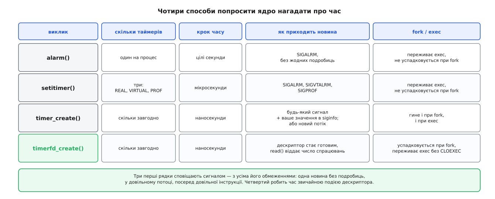
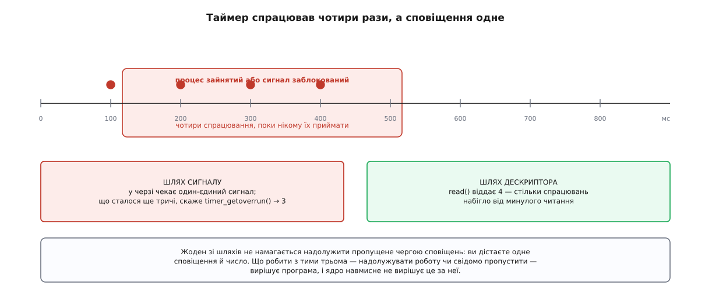
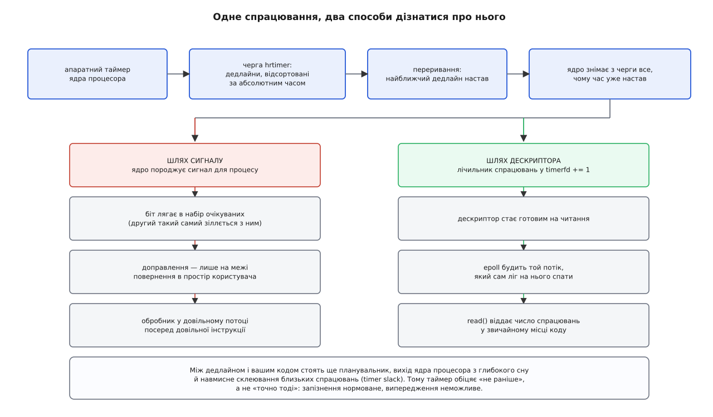
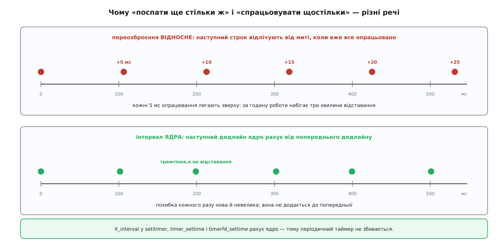

# Таймери процесу: alarm, setitimer, POSIX-таймери й timerfd

<preknowlist>
- [Сигнал: асинхронне сповіщення](book:unix-linux/signal-model) — новина без вмісту, яку ядро вкидає процесові між двома інструкціями; повтори того самого номера злипаються.
- [Диспозиція сигналу](book:unix-linux/signal-disposition) — три можливі долі доправленого сигналу: власний обробник, ігнорування, типова дія.
- [Що можна робити в обробнику сигналу](book:unix-linux/async-signal-safety) — чому всередині обробника заборонено майже все звичне.
- [Маскування сигналів і signalfd](book:unix-linux/signal-mask-signalfd) — як відкласти доправлення й забрати сигнал у зручний момент замість обробника.
- [Файловий дескриптор](book:unix-linux/file-descriptor) — маленьке число, яким процес називає ядру вже відкритий об'єкт.
- [select, poll, epoll](book:unix-linux/select-poll-epoll) — як один потік засинає одразу на багатьох джерелах і прокидається від будь-якого.
- [Час у ядрі](book:unix-linux/kernel-timekeeping) — тики, монотонний і реальний годинники, звідки ядро взагалі знає, котра година.
- [EINTR: перервані виклики й перезапуск](book:unix-linux/eintr-and-restart) — що стається з блокуючим викликом, коли посеред нього надходить сигнал.
</preknowlist>

Програма надіслала запит і чекає на відповідь. Якщо відповіді нема п'ять секунд — треба здатися й спробувати інший вузол. Але відлічити ці п'ять секунд програма не може: вона сидить усередині `read()`, який ще не повернувся, і нічого не виконує. Перевірити годинник нема кому.

Отже, рахувати має хтось інший, а потім втрутитися ззовні. Такий «хтось» у системі один — ядро: воно єдине бачить апаратний лічильник і єдине має право забрати процесор у задачі. Тому потрібен спосіб сказати ядру наперед: **через стільки-то мене торкни**. Уся споруда таймерів процесу — це чотири різні відповіді на це одне прохання, і кожна наступна з'явилася тому, що попередня чогось не вміла.



*Три перші сповіщають сигналом і тому успадковують усі його обмеження; четвертий перетворює час на подію файлового дескриптора.*

## Найменше, що взагалі можна попросити

`alarm(5)` — одне число, один системний виклик. Через п'ять секунд ядро надішле процесові `SIGALRM`. Якщо диспозиції нема, типова дія `SIGALRM` — убити процес; тому таймаут майже завжди означає ще й обробник, хай навіть порожній.

Порожній обробник тут не безглуздий, а якраз найкорисніший. Сигнал, доправлений посеред блокуючого виклику, виводить процес із того виклику з помилкою `EINTR` — саме те, чого ми домагалися: `read()` перестає чекати.

```c
static void on_alarm(int signo) { (void)signo; }   /* лише розбудити read() */

struct sigaction sa = { .sa_handler = on_alarm };  /* БЕЗ SA_RESTART */
sigemptyset(&sa.sa_mask);
sigaction(SIGALRM, &sa, NULL);

alarm(5);
ssize_t n = read(fd, buf, sizeof buf);
int err = errno;
alarm(0);                                          /* скасувати, якщо встигли */
if (n < 0 && err == EINTR) { /* минуло п'ять секунд */ }
```

Пастка тут одна, зате коштовна: прапорець `SA_RESTART`. З ним ядро після обробника саме перезапускає перерваний виклик, `read()` знову лягає чекати — і таймаут просто зникає, хоча код виглядає правильним. Роз'яснення обох режимів — у [EINTR і перезапуску](book:unix-linux/eintr-and-restart).

Обмеження `alarm()` видно одразу з його форми. Таймер один на весь процес: якщо бібліотека всередині вашого ж коду викличе `alarm()`, вона мовчки зітре ваш строк, а ви — її. Крок — ціла секунда, тож «таймаут 200 мс» висловити нічим. І новина приходить порожньою: `SIGALRM` не каже, **який саме** строк настав, бо строк може бути тільки один.

## Три годинники замість одного

`setitimer()` з 4.2BSD знімає дві межі відразу. Час задають структурою з мікросекундним полем, а до строку додається **інтервал** (лат. *intervallum* — проміжок): ядро само переозброює таймер після кожного спрацювання, і періодичні задачі перестають бути ланцюжком ручних переозброєнь.

Третя зміна цікавіша. Таймерів стало три, і вони рахують **різний час**:

- `ITIMER_REAL` — справжній час на стіні; сповіщає `SIGALRM`.
- `ITIMER_VIRTUAL` — тільки той час, який процес справді провів на процесорі у своєму коді; сповіщає `SIGVTALRM`.
- `ITIMER_PROF` — час процесу в своєму коді плюс час, витрачений ядром на його системні виклики; сповіщає `SIGPROF`.

Різниця між ними — не примха. Профільник, що хоче зазирнути «де ми зараз» кожні 10 мс **виконання**, не має права рахувати секунди, поки процес спить у черзі на диск: інакше вибірки скупчаться там, де програма нічого не робила. Тому й з'явилися годинники, які тікають лише тоді, коли задача працює; як ядро набирає ці два лічильники, описано в [обліку процесорного часу](book:unix-linux/cpu-time-accounting).

Що лишилося незмінним — головне. Кожного виду таймер усе ще **один на процес**, а `alarm()` і `ITIMER_REAL` у Linux — це взагалі той самий таймер під двома іменами: виклик одного псує стан іншого. І новиною знову є голий сигнал.

## Проблема, спільна для обох

Придивімося, чому перші два шари вперлися в стелю. Річ не в секундах і не в кількості — річ у **посланцеві**.

Сигнал несе рівно один номер. Він не має поля «від кого», не має вмісту й не рахується: поки один `SIGALRM` лежить недоправленим, другий такий самий із ним зіллється, і два спрацювання стануть одним. Він приходить у довільний потік групи й перериває довільну інструкцію, тому в обробнику дозволено смішно мало ([асинхронно-сигнальна безпека](book:unix-linux/async-signal-safety)). А ще диспозиція — властивість усього процесу: два незалежні модулі не можуть по-своєму слухати той самий `SIGALRM`.

Звідси видно, чого бракує: щоб таймерів було багато, сповіщення мусить нести **ознаку, який саме спрацював**, і мати спосіб сказати, **скільки разів** це сталося, поки ніхто не слухав.

## Багато таймерів, які себе називають

Саме це дали POSIX-таймери, що прийшли зі стандартом реальночасових розширень POSIX.1b-1993. `timer_create()` створює **окремий об'єкт** — стільки, скільки треба, кожен зі своїм годинником і своїм строком; повертається `timer_t`, і далі ним керують `timer_settime()`, `timer_gettime()`, `timer_delete()`.

Ключове тут — третій аргумент створення, структура `sigevent`: вона описує, **як саме** сповістити. І в ній є поле `sigev_value`, вміст якого ядро донесе разом із сигналом.

```c
struct sigevent sev = {0};
sev.sigev_notify = SIGEV_SIGNAL;
sev.sigev_signo  = SIGRTMIN;             /* реальночасовий: такі стають у чергу */
sev.sigev_value.sival_ptr = session;     /* ось хто спрацював */

timer_t tid;
timer_create(CLOCK_MONOTONIC, &sev, &tid);

struct itimerspec its = {
    .it_value    = { .tv_sec = 0, .tv_nsec = 250000000 },   /* перший строк */
    .it_interval = { .tv_sec = 0, .tv_nsec = 250000000 },   /* і далі щочверть секунди */
};
timer_settime(tid, 0, &its, NULL);
```

Обробник, оголошений із `SA_SIGINFO`, дістає `siginfo_t` і бере з нього `si_value.sival_ptr` — той самий покажчик на сесію. Поле `si_code` дорівнює `SI_TIMER`, тобто «це від таймера, а не від `kill()`». Тепер тисяча з'єднань з тисячею таймаутів розрізняються без єдиної глобальної таблиці.

Керування строком тримається на одній угоді, яку легко проґавити: нульовий `it_value` **роззброює** таймер, а нульовий `it_interval` при ненульовому `it_value` означає одноразове спрацювання. Тобто скасування, одноразовий строк і період — це не три різні виклики, а три різні заповнення тієї самої структури.

Питання «в якому потоці спрацює обробник» лишається й тут, бо `SIGEV_SIGNAL` шле сигнал **процесові**, а процесові адресований сигнал ядро віддає будь-якому потоку, що його не блокує. У багатопотоковій програмі це знову лотерея. Linux дає на неї відповідь: `SIGEV_THREAD_ID` разом із номером задачі адресує сигнал **конкретному потоку** — тому, який ви призначили приймачем часу й підготували до цієї ролі.

Вибір годинника став окремим параметром, і це важливіше, ніж здається. `CLOCK_MONOTONIC` тече рівно від якоїсь довільної точки в минулому й **не стрибає ніколи**; `CLOCK_REALTIME` показує календарний час, а тому може смикнутися назад чи вперед, коли адміністратор або NTP поправлять годинник. Є ще `CLOCK_BOOTTIME`, що на відміну від монотонного зараховує час, проведений машиною в сні, і пара `CLOCK_REALTIME_ALARM`/`CLOCK_BOOTTIME_ALARM`, які мають право **розбудити приспану систему** (і саме тому потребують окремого повноваження `CAP_WAKE_ALARM`). Доступні також процесорні годинники `CLOCK_PROCESS_CPUTIME_ID` і `CLOCK_THREAD_CPUTIME_ID` — точна заміна старим `ITIMER_VIRTUAL`/`ITIMER_PROF`, ще й окремо на кожен потік.

> 🔧 **Навіщо це.** Правило, яке рятує від нічних дзвінків: **усе, що міряє тривалість, — на монотонному годиннику**. Таймаут з'єднання, крок опитування, ретрай — `CLOCK_MONOTONIC`. Календарний годинник лишіть тільки для подій, прив'язаних до календаря: «о 07:00», «першого числа». Таймаут на `CLOCK_REALTIME` під час переведення годинника назад на годину зависає рівно на цю годину, і відтворити таке в тесті майже неможливо.

Лишається питання про пропущені спрацювання, і відповідь на нього чесна, хоч і не дуже приємна. У черзі на один таймер стоїть **щонайбільше один сигнал**. Якщо чвертьсекундний таймер спрацював чотири рази, поки процес не приймав сигнали, ви дістанете одне сповіщення, а `timer_getoverrun()` скаже, що спрацювань було ще три понад це. Ядро не намагається надолужити чергою — воно віддає число й лишає рішення програмі.



*Обидва шляхи стискають пропущене в число. Надолужувати роботу чи свідомо пропустити — вирішує програма.*

`sigevent` уміє й інше: `SIGEV_NONE` не сповіщає взагалі (строк просто питають через `timer_gettime()`), а `SIGEV_THREAD` обіцяє викликати вашу функцію «як стартову функцію нового потоку». Обіцянка приваблива, бо всередині такої функції знову можна все. Плата видна, коли знати механізм: у Linux це робить не ядро, а glibc — вона тримає допоміжний потік і службовий реальночасовий сигнал, і кожне спрацювання коштує створення потоку. Для рідкісних подій прийнятно, для сотні спрацювань за секунду — ні. Точні сигнатури, поля структур і перелік помилок усіх чотирьох інтерфейсів зібрано в [довідці по викликах](book:unix-linux/process-timers/api-timer-interfaces.md).

Ще одна дрібниця, що дорого коштує в програмах із `fork()`: POSIX-таймери **не успадковуються дитиною** і **знищуються при `exec()`**. Старі ж `alarm()` і `setitimer()` поводяться навпаки — переживають `exec()`, але дитині не дістаються.

## Коли новина приходить у неслушний момент

Усе попереднє поліпшувало сповіщення, лишаючи його сигналом. А сигнал у програмі з циклом подій — чужорідне тіло: він перериває код там, де ви на це не чекали, вимагає окремої маски, окремого потоку-приймача й дисципліни, з якою легко помилитися.

Розв'язок у дусі Unix: якщо все є файлом, хай і час буде файлом. `timerfd_create()` повертає **дескриптор**, який стає готовим на читання, коли строк настав.

```c
int tfd = timerfd_create(CLOCK_MONOTONIC, TFD_NONBLOCK | TFD_CLOEXEC);
struct itimerspec its = { .it_value    = { .tv_sec = 0, .tv_nsec = 250000000 },
                          .it_interval = { .tv_sec = 0, .tv_nsec = 250000000 } };
timerfd_settime(tfd, 0, &its, NULL);

struct epoll_event ev = { .events = EPOLLIN, .data.fd = tfd };
epoll_ctl(ep, EPOLL_CTL_ADD, tfd, &ev);

/* у циклі подій, поряд із сокетами: */
uint64_t ticks;
if (read(tfd, &ticks, sizeof ticks) == sizeof ticks) {
    /* ticks — скільки спрацювань набігло від минулого читання */
}
```

Зникає не одна проблема, а цілий їхній клас. Немає обробника — отже, немає й списку дозволених у ньому функцій. Немає гонитви між перевіркою прапорця й засинанням — потік спить у `epoll_wait()`, і таймер такий самий учасник, як сокет. Немає питання «в якому потоці» — читає той, хто читає. І перевищення рахуються самі: `read()` віддає 64-бітове число спрацювань — те саме знання, що дає `timer_getoverrun()`, тільки повніше: там лічать зайві понад одне, тут — усі разом, і без окремого виклику.



*Спільна частина — черга дедлайнів у ядрі. Різниця починається аж на останніх кроках, зате саме вона визначає, як виглядатиме ваш код.*

> 🔧 **Навіщо це.** У службі з циклом подій timerfd прибирає цілий шар коду: замість обробника з `volatile sig_atomic_t`, маски, самотруби чи виділеного потоку-приймача — один дескриптор у тому ж `epoll`. Той самий обхідний шлях для решти сигналів дає [signalfd](book:unix-linux/signal-mask-signalfd), а для сповіщень від власних потоків — [eventfd](book:unix-linux/eventfd-and-futex).

Оскільки таймер став дескриптором, він і поводиться як дескриптор: `fork()` віддає дитині ту саму озброєну сутність (обидві сторони читатимуть з одного лічильника), а `exec()` її зберігає — якщо не поставили `TFD_CLOEXEC`. Прямо протилежно до POSIX-таймерів, і причина суто структурна: об'єктом володіє тепер опис відкритого файлу, а не процес.

Два прапорці озброєння варті окремої уваги. `TFD_TIMER_ABSTIME` каже, що в `it_value` лежить не «через скільки», а **абсолютний момент** на обраному годиннику — саме те, що потрібно для розкладу. А `TFD_TIMER_CANCEL_ON_SET` розв'язує неприємність, властиву календарним будильникам: ви поставили пробудження на 07:00 за `CLOCK_REALTIME`, а о 03:00 NTP посунув годинник на дві години назад. З цим прапорцем наступний `read()` поверне помилку `ECANCELED` — «годинник під тобою переставили, перерахуй строк». Без нього програма мовчки прокинеться не тоді.

## Що насправді означають наносекунди в структурі

Поле `tv_nsec` не обіцяє наносекундної точності — воно лише не обмежує вас згори. Реальна точність — це властивість ядра, і вона мінялася.

Історично строки зберігали в тиках системного таймера, тож усе округлювалося до кроку в 1, 4 або 10 мс. Підсистема **hrtimer**, що прийшла в 2.6.16, а разом із високою роздільністю запрацювала з 2.6.21, змінила саму структуру зберігання: дедлайни лежать в упорядкованому дереві за абсолютним часом у наносекундах, а ядро щоразу програмує апаратний таймер на **найближчий** із них. Тик перестав бути одиницею часу — він лишився одиницею обліку. Загальний прийом, яким такі черги строків будують, розібрано в [колесі таймерів](book:algorithms/timer-wheel).

Проти точності працюють три речі, і всі три навмисні. Перша — **timer slack**, дозволене запізнення, у межах якого ядро склеює сусідні пробудження в одне; для нащадків `init` це 50 мкс, а власне значення потоку крутять через `prctl(PR_SET_TIMERSLACK, …)`. Мета — енергія: одне спільне пробудження замість трьох дозволяє процесорові довше лишатися в глибокому сні. Друга — вихід із цього самого сну, який сам по собі коштує десятки мікросекунд. Третя — планувальник: строк настав, задачу зробили готовою, але процесор зараз зайнятий кимось іншим.

Тому єдина чесна гарантія звучить так: таймер спрацює **не раніше** заданого моменту. Запізнення нормоване й зазвичай мале, випередження неможливе — і будувати логіку варто саме на цій асиметрії.

## Дрейф: два способи повторювати

Звідси випливає різниця, на якій спотикаються всі, хто пише періодичні задачі вручну. Порівняймо два способи робити щось «сто разів на секунду».

Перший: попрацював, потім озброїв таймер на 100 мс, і так по колу. Другий: попросив ядро про інтервал у 100 мс і просто забирає спрацювання.

**Робота в кожному циклі забирає 5 мс, період номінально 100 мс:**

```
ручне переозброєння     фактичний період = 100 + 5 = 105 мс
                        за годину: 3600 / 0.105 ≈ 34 285 спрацювань
                        замість 36 000 — відставання ≈ 180 с

інтервал у ядрі         наступний дедлайн = попередній дедлайн + 100 мс
                        за годину: рівно 36 000 спрацювань
                        похибка кожного разу нова, ≈ десятки мкс, і не додається
```

Причина в одному слові. Ручне переозброєння відлічує час **від миті, коли ви його попросили**, тобто вже після роботи й після всіх затримок доправлення; кожна затримка назавжди осідає у фазі. Ядро відлічує **від попереднього дедлайну** — його арифметика не знає про ваші затримки, тож помилка не має де накопичуватися.



*Відставання, що накопичується, проти тремтіння, що не накопичується. Це різниця не в точності годинника, а в тому, від чого відлічують наступний строк.*

Той самий висновок стосується й одноразових строків, коли їх багато й вони мають шикуватися в розклад: тримайте **абсолютні** моменти (`TFD_TIMER_ABSTIME` чи `TIMER_ABSTIME`), а не ланцюжок відносних затримок. Тоді запізнення одного кроку не зсуває всі наступні.

Робочий приклад — планувальник періодичних задач з різними періодами на одному дескрипторі й на кількох — розібрано в [проєкті з timerfd](book:unix-linux/process-timers/proj-timerfd-scheduler.md).

## Що з цього брати

Правило вибору коротке і випливає з усього сказаного. Якщо в програмі є цикл подій — беріть `timerfd`: час стає таким самим джерелом, як сокет, і жодна сигнальна дисципліна вам не потрібна. Якщо циклу подій нема, а таймерів багато й вони мають себе називати — беріть POSIX-таймери з реальночасовим сигналом і `sigev_value`, бо саме [реальночасові сигнали](book:unix-linux/realtime-signals) вміють ставати в чергу й нести значення. `setitimer()` лишається доречним рівно для одного: профільної вибірки за процесорним часом. А `alarm()` — для сторожового таймауту в короткій програмі, де читабельність важить більше за все інше.

Причини, з яких ці чотири шари наросли один на одному саме в такому порядку, і що в кожен момент здавалося головною проблемою, зібрано в [історії таймерів Unix](book:unix-linux/process-timers/hist-from-alarm-to-timerfd.md).

І остання межа, яку варто знати наперед: таймер процесу вимірює час, але не резервує процесор. Він скаже «пора» вчасно, проте виконає вашу роботу планувальник — тоді, коли дійде черга. Якщо вам потрібне не сповіщення в строк, а **виконання** в строк, то самих таймерів мало: потрібен ще й реальночасовий клас планування ([пріоритети й реальночасові класи](book:unix-linux/priority-nice-realtime)).
